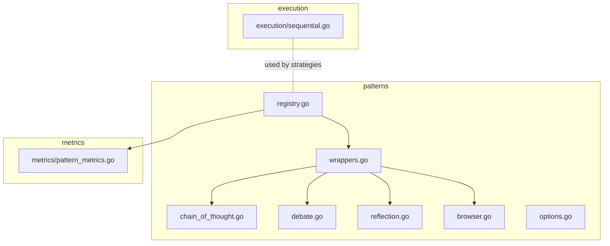
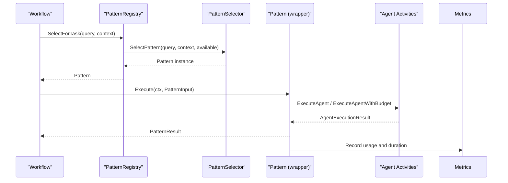
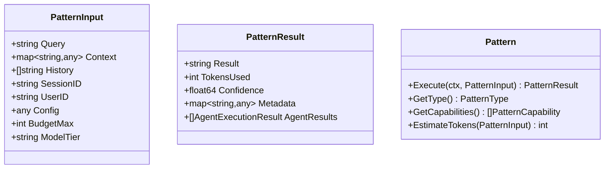
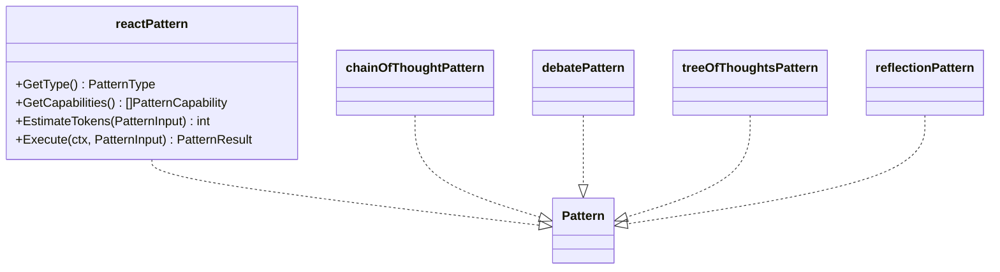
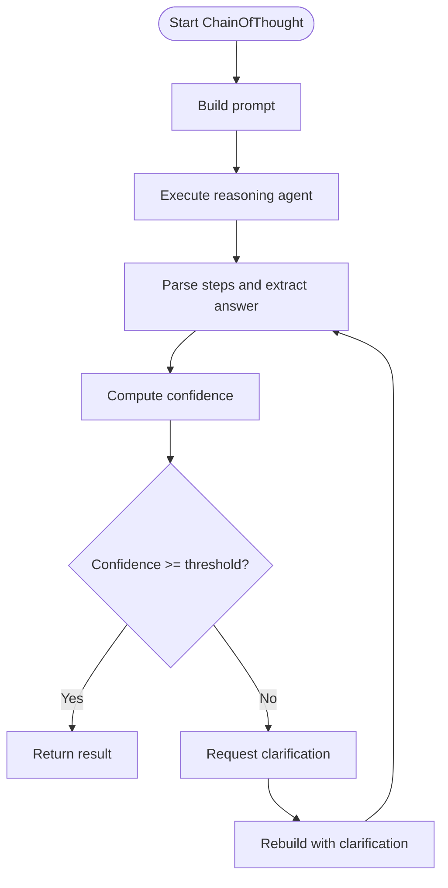
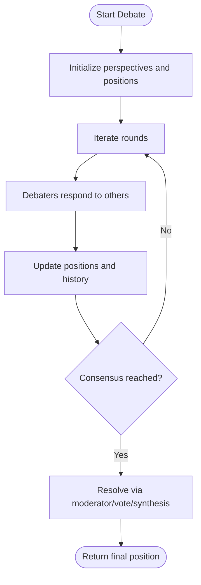
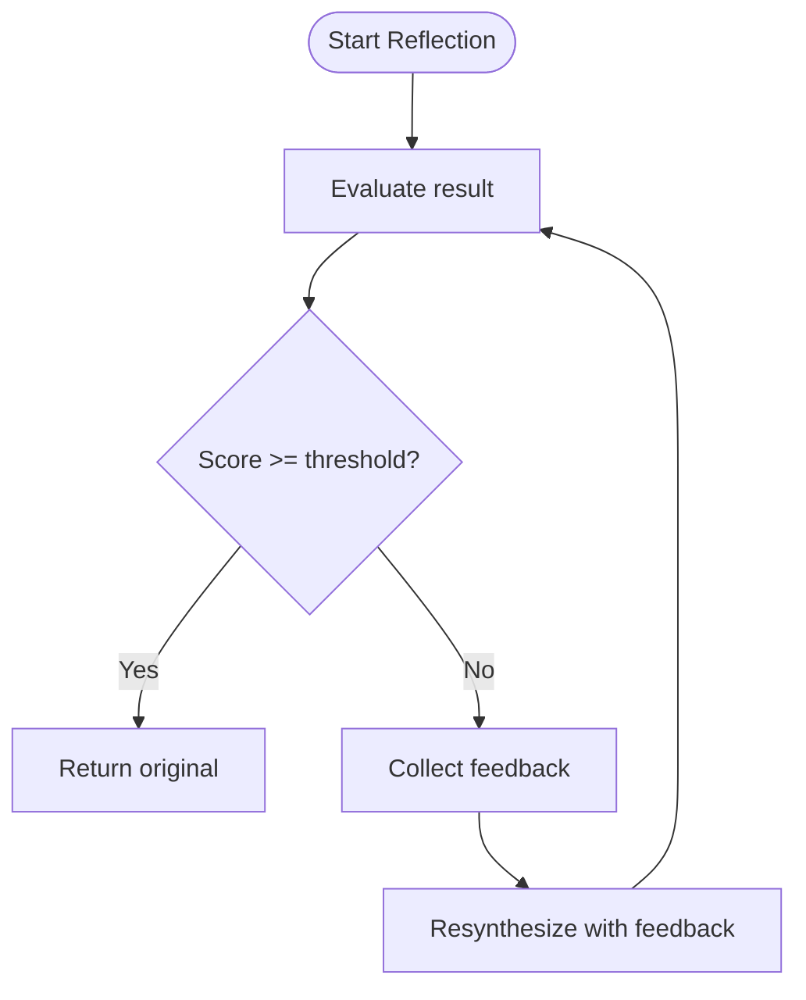
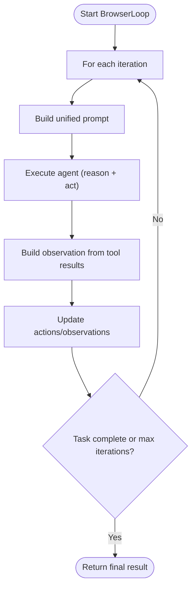
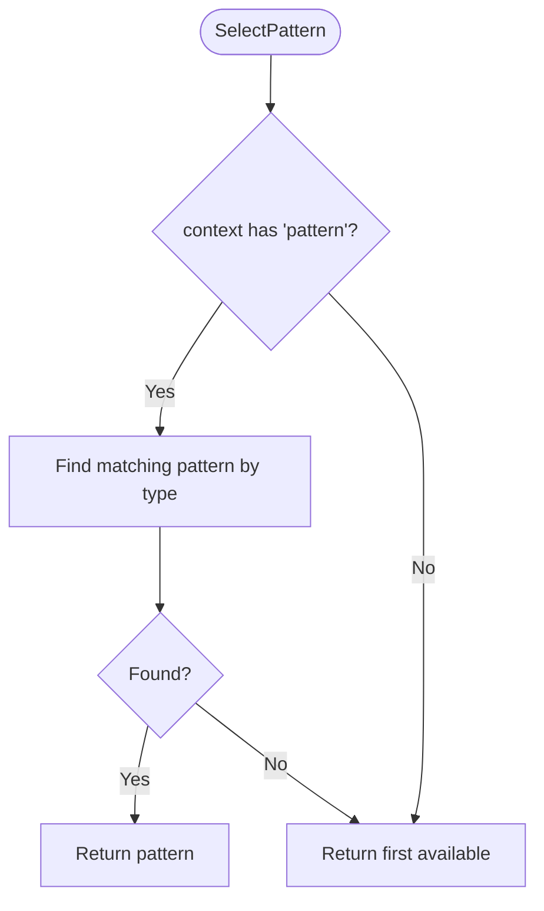
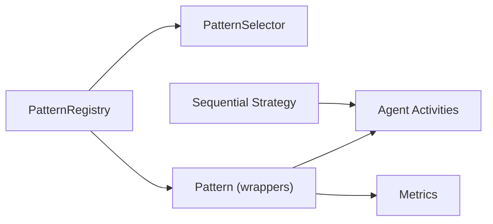

# Pattern Registry System

<cite>
**Referenced Files in This Document**
- [registry.go](file://go/orchestrator/internal/workflows/patterns/registry.go)
- [options.go](file://go/orchestrator/internal/workflows/patterns/options.go)
- [wrappers.go](file://go/orchestrator/internal/workflows/patterns/wrappers.go)
- [chain_of_thought.go](file://go/orchestrator/internal/workflows/patterns/chain_of_thought.go)
- [debate.go](file://go/orchestrator/internal/workflows/patterns/debate.go)
- [reflection.go](file://go/orchestrator/internal/workflows/patterns/reflection.go)
- [browser.go](file://go/orchestrator/internal/workflows/patterns/browser.go)
- [sequential.go](file://go/orchestrator/internal/workflows/patterns/execution/sequential.go)
- [pattern_metrics.go](file://go/orchestrator/internal/workflows/metrics/pattern_metrics.go)
</cite>

## Table of Contents
1. [Introduction](#introduction)
2. [Project Structure](#project-structure)
3. [Core Components](#core-components)
4. [Architecture Overview](#architecture-overview)
5. [Detailed Component Analysis](#detailed-component-analysis)
6. [Dependency Analysis](#dependency-analysis)
7. [Performance Considerations](#performance-considerations)
8. [Troubleshooting Guide](#troubleshooting-guide)
9. [Conclusion](#conclusion)

## Introduction
This document explains the workflow pattern registry system in Shannon. It covers how patterns are defined, registered, discovered, and executed during workflow orchestration. It documents the Pattern interface, PatternInput, PatternResult, and the PatternRegistry with its selection strategy. It also details pattern capabilities, estimation mechanisms, and cost optimization strategies, and shows how patterns integrate with the broader orchestration system.

## Project Structure
The pattern registry and pattern implementations live under the workflows/patterns package. Supporting execution strategies (sequential, parallel, hybrid) are under workflows/patterns/execution. Metrics for pattern usage are under workflows/metrics.



**Diagram sources**
- [registry.go](file://go/orchestrator/internal/workflows/patterns/registry.go#L1-L190)
- [wrappers.go](file://go/orchestrator/internal/workflows/patterns/wrappers.go#L1-L264)
- [chain_of_thought.go](file://go/orchestrator/internal/workflows/patterns/chain_of_thought.go#L1-L433)
- [debate.go](file://go/orchestrator/internal/workflows/patterns/debate.go#L1-L644)
- [reflection.go](file://go/orchestrator/internal/workflows/patterns/reflection.go#L1-L170)
- [browser.go](file://go/orchestrator/internal/workflows/patterns/browser.go#L1-L500)
- [sequential.go](file://go/orchestrator/internal/workflows/patterns/execution/sequential.go#L1-L475)
- [pattern_metrics.go](file://go/orchestrator/internal/workflows/metrics/pattern_metrics.go#L1-L94)

**Section sources**
- [registry.go](file://go/orchestrator/internal/workflows/patterns/registry.go#L1-L190)
- [wrappers.go](file://go/orchestrator/internal/workflows/patterns/wrappers.go#L1-L264)
- [sequential.go](file://go/orchestrator/internal/workflows/patterns/execution/sequential.go#L1-L475)
- [pattern_metrics.go](file://go/orchestrator/internal/workflows/metrics/pattern_metrics.go#L1-L94)

## Core Components
- Pattern interface: Defines Execute, GetType, GetCapabilities, and EstimateTokens.
- PatternInput: Provides query, context, history, identifiers, per-pattern config, and budget/tier hints.
- PatternResult: Captures final result, tokens used, confidence, metadata, and agent execution details.
- PatternRegistry: Thread-safe registry with registration, retrieval, listing, and selection.
- PatternSelector: Strategy for choosing a pattern given a query and available patterns.
- Wrapper implementations: Pattern interface adapters for built-in patterns (reflection, react, chain-of-thought, debate, tree of thoughts).
- Options: Shared execution options for token budgets, session/user IDs, streaming, model tier, and additional context.

**Section sources**
- [registry.go](file://go/orchestrator/internal/workflows/patterns/registry.go#L35-L69)
- [registry.go](file://go/orchestrator/internal/workflows/patterns/registry.go#L71-L126)
- [options.go](file://go/orchestrator/internal/workflows/patterns/options.go#L3-L11)
- [wrappers.go](file://go/orchestrator/internal/workflows/patterns/wrappers.go#L14-L263)

## Architecture Overview
The registry exposes a global singleton that registers built-in patterns. At runtime, workflows request a pattern for a task, the registry selects one using the configured selector, and the chosen pattern executes via the wrapper, invoking agent activities and recording metrics and token usage.



**Diagram sources**
- [registry.go](file://go/orchestrator/internal/workflows/patterns/registry.go#L162-L177)
- [registry.go](file://go/orchestrator/internal/workflows/patterns/registry.go#L88-L108)
- [wrappers.go](file://go/orchestrator/internal/workflows/patterns/wrappers.go#L31-L51)
- [pattern_metrics.go](file://go/orchestrator/internal/workflows/metrics/pattern_metrics.go#L65-L93)

## Detailed Component Analysis

### Pattern Registry and Selection
- Global registry initialization ensures a single registry instance with default patterns registered.
- Registration is thread-safe and guarded by a mutex.
- Listing returns all registered patterns for selection.
- Default selector supports an explicit pattern hint via context and falls back to the first available pattern.

```mermaid
classDiagram
class Pattern {
+Execute(ctx, PatternInput) PatternResult
+GetType() PatternType
+GetCapabilities() []PatternCapability
+EstimateTokens(PatternInput) int
}
class PatternRegistry {
-mu
-patterns
-selector
+Register(Pattern) error
+Get(PatternType) (Pattern,bool)
+List() []Pattern
+SelectForTask(string, map[string]interface{}) (Pattern,error)
+SetSelector(PatternSelector)
}
class PatternSelector {
<<interface>>
+SelectPattern(string, map[string]interface{}, []Pattern) (Pattern,error)
}
class DefaultPatternSelector {
+SelectPattern(...)
}
PatternRegistry --> PatternSelector : "uses"
DefaultPatternSelector ..|> PatternSelector
```

**Diagram sources**
- [registry.go](file://go/orchestrator/internal/workflows/patterns/registry.go#L35-L83)
- [registry.go](file://go/orchestrator/internal/workflows/patterns/registry.go#L110-L177)

**Section sources**
- [registry.go](file://go/orchestrator/internal/workflows/patterns/registry.go#L110-L177)

### Pattern Interface and Data Contracts
- PatternInput: carries query, context, history, identifiers, per-pattern config, and budget/tier hints.
- PatternResult: captures final output, tokens used, confidence, metadata, and agent results.
- PatternCapability: enumerates capabilities like iterative improvement, step-by-step, multi-perspective, conflict resolution, exploration, and consensus building.



**Diagram sources**
- [registry.go](file://go/orchestrator/internal/workflows/patterns/registry.go#L50-L69)

**Section sources**
- [registry.go](file://go/orchestrator/internal/workflows/patterns/registry.go#L23-L69)

### Built-in Pattern Wrappers
Each built-in pattern is wrapped as a Pattern interface implementation. Wrappers:
- Define capabilities.
- Estimate tokens using either input BudgetMax or defaults.
- Execute via ReactLoop, ChainOfThought, Debate, TreeOfThoughts, or reflection flows.
- Return PatternResult with tokens, confidence, and metadata.



**Diagram sources**
- [wrappers.go](file://go/orchestrator/internal/workflows/patterns/wrappers.go#L14-L263)

**Section sources**
- [wrappers.go](file://go/orchestrator/internal/workflows/patterns/wrappers.go#L14-L263)

### Pattern Execution Flows

#### Chain-of-Thought
- Builds a structured prompt and executes a reasoning agent.
- Parses steps, extracts final answer, computes confidence.
- Optionally requests clarification if confidence is low.



**Diagram sources**
- [chain_of_thought.go](file://go/orchestrator/internal/workflows/patterns/chain_of_thought.go#L36-L295)

**Section sources**
- [chain_of_thought.go](file://go/orchestrator/internal/workflows/patterns/chain_of_thought.go#L36-L295)

#### Debate
- Spawns multiple debaters with perspectives, collects initial positions, then iterates rounds.
- Supports optional moderator or voting to resolve positions.



**Diagram sources**
- [debate.go](file://go/orchestrator/internal/workflows/patterns/debate.go#L48-L473)

**Section sources**
- [debate.go](file://go/orchestrator/internal/workflows/patterns/debate.go#L48-L473)

#### Reflection
- Evaluates initial result against criteria and synthesizes improvements if below threshold.
- Records token usage for evaluation and synthesis steps.



**Diagram sources**
- [reflection.go](file://go/orchestrator/internal/workflows/patterns/reflection.go#L17-L170)

**Section sources**
- [reflection.go](file://go/orchestrator/internal/workflows/patterns/reflection.go#L17-L170)

#### Browser Automation Loop
- Unified loop reasoning and acting in a single agent call.
- Tracks actions and observations, limits history, and records token usage.



**Diagram sources**
- [browser.go](file://go/orchestrator/internal/workflows/patterns/browser.go#L39-L294)

**Section sources**
- [browser.go](file://go/orchestrator/internal/workflows/patterns/browser.go#L39-L294)

### Pattern Discovery and Selection
- Explicit hint: If context contains a pattern key equal to a pattern type, select that pattern.
- Fallback: Select the first available pattern.
- Extensible: Selector can be swapped to support ML-driven selection.



**Diagram sources**
- [registry.go](file://go/orchestrator/internal/workflows/patterns/registry.go#L88-L108)

**Section sources**
- [registry.go](file://go/orchestrator/internal/workflows/patterns/registry.go#L88-L108)

### Pattern Validation and Cost Optimization
- Token estimation: Each wrapper provides EstimateTokens using BudgetMax or defaults.
- Budgeted execution: Wrappers call ExecuteAgentWithBudget to enforce per-agent token caps.
- Token usage recording: Wrappers and supporting flows record token usage per phase and agent.
- Streaming and events: Patterns publish progress and agent lifecycle events for observability.

**Section sources**
- [wrappers.go](file://go/orchestrator/internal/workflows/patterns/wrappers.go#L23-L29)
- [wrappers.go](file://go/orchestrator/internal/workflows/patterns/wrappers.go#L62-L67)
- [wrappers.go](file://go/orchestrator/internal/workflows/patterns/wrappers.go#L92-L97)
- [wrappers.go](file://go/orchestrator/internal/workflows/patterns/wrappers.go#L122-L127)
- [wrappers.go](file://go/orchestrator/internal/workflows/patterns/wrappers.go#L152-L157)
- [chain_of_thought.go](file://go/orchestrator/internal/workflows/patterns/chain_of_thought.go#L145-L181)
- [debate.go](file://go/orchestrator/internal/workflows/patterns/debate.go#L201-L238)
- [browser.go](file://go/orchestrator/internal/workflows/patterns/browser.go#L467-L499)

## Dependency Analysis
- PatternRegistry depends on PatternSelector and holds a map of PatternType to Pattern.
- Wrappers depend on activities and constants for agent execution and token recording.
- Metrics are decoupled and recorded by wrappers and execution helpers.
- Sequential execution is a reusable strategy that patterns can leverage.



**Diagram sources**
- [registry.go](file://go/orchestrator/internal/workflows/patterns/registry.go#L71-L126)
- [wrappers.go](file://go/orchestrator/internal/workflows/patterns/wrappers.go#L1-L264)
- [sequential.go](file://go/orchestrator/internal/workflows/patterns/execution/sequential.go#L1-L475)
- [pattern_metrics.go](file://go/orchestrator/internal/workflows/metrics/pattern_metrics.go#L1-L94)

**Section sources**
- [registry.go](file://go/orchestrator/internal/workflows/patterns/registry.go#L71-L126)
- [wrappers.go](file://go/orchestrator/internal/workflows/patterns/wrappers.go#L1-L264)
- [sequential.go](file://go/orchestrator/internal/workflows/patterns/execution/sequential.go#L1-L475)
- [pattern_metrics.go](file://go/orchestrator/internal/workflows/metrics/pattern_metrics.go#L1-L94)

## Performance Considerations
- Token estimation: Use EstimateTokens to pre-validate budget feasibility.
- Budget enforcement: Prefer ExecuteAgentWithBudget to cap per-agent usage.
- Parallelization: Use parallel execution strategies where safe to reduce latency.
- Observability: Record durations and token usage to tune patterns and budgets.
- Streaming: Emit events to keep clients informed without blocking execution.

## Troubleshooting Guide
- No suitable pattern found: Ensure patterns are registered and selector is configured.
- Budget exceeded: Verify EstimateTokens and BudgetMax alignment; confirm ExecuteAgentWithBudget is used.
- Low confidence results: Enable reflection or adjust Chain-of-Thought thresholds.
- Missing token records: Confirm non-budgeted flows record token usage via dedicated activities.

**Section sources**
- [registry.go](file://go/orchestrator/internal/workflows/patterns/registry.go#L162-L177)
- [wrappers.go](file://go/orchestrator/internal/workflows/patterns/wrappers.go#L159-L263)
- [chain_of_thought.go](file://go/orchestrator/internal/workflows/patterns/chain_of_thought.go#L194-L276)
- [pattern_metrics.go](file://go/orchestrator/internal/workflows/metrics/pattern_metrics.go#L65-L93)

## Conclusion
The pattern registry system provides a clean, extensible contract for multi-agent patterns. Patterns are encapsulated behind a common interface, registered centrally, and selected based on task characteristics. Built-in patterns demonstrate robust execution, validation, and cost control. Metrics and token recording enable continuous optimization and observability across the orchestration pipeline.