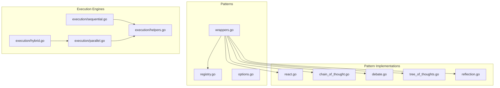
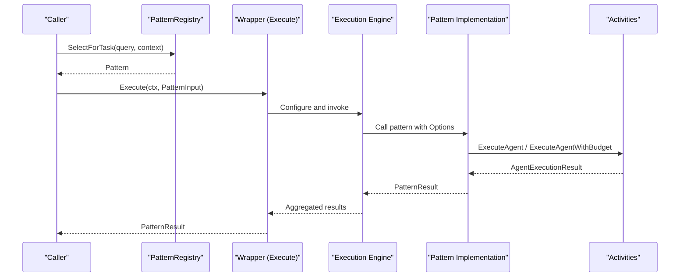
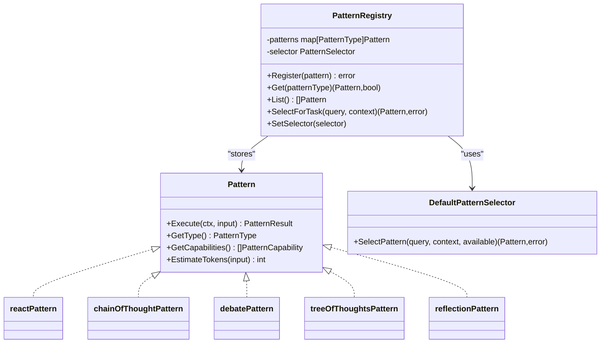
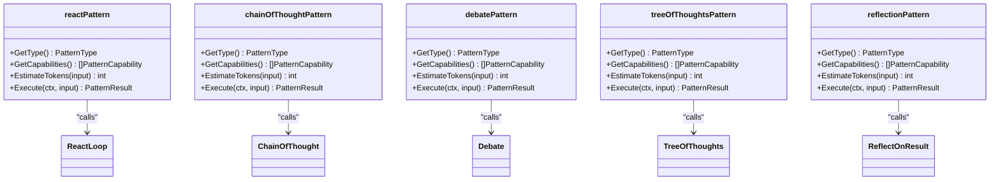
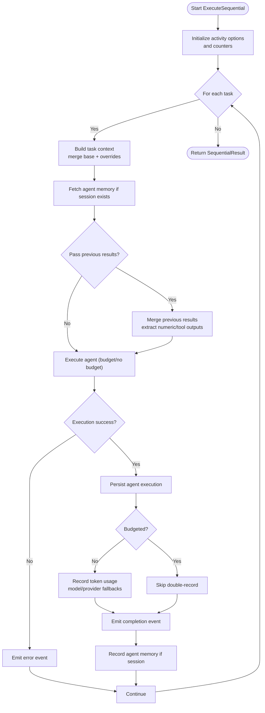
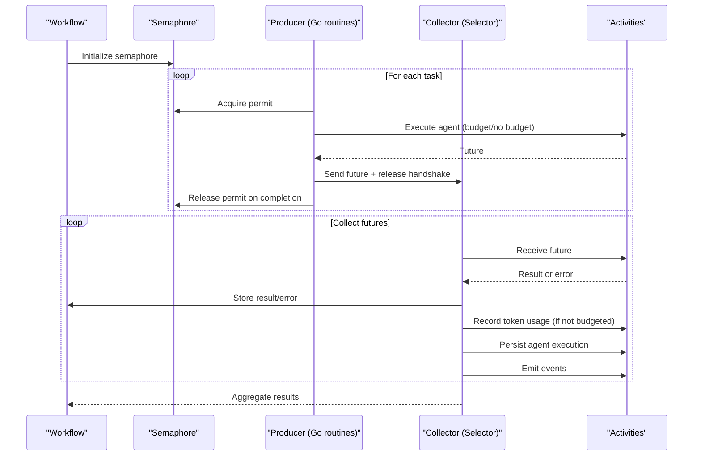
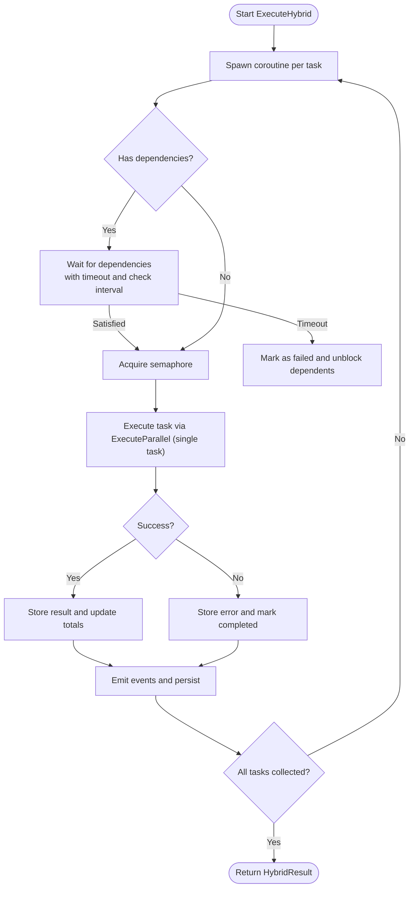
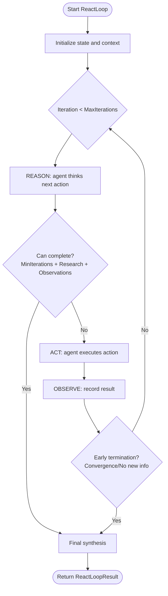
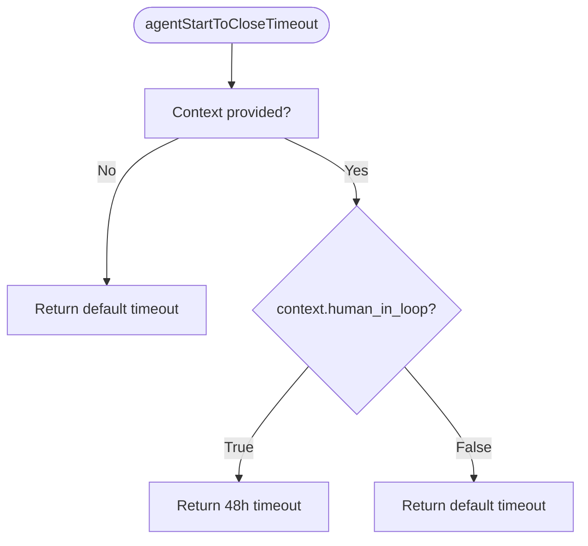
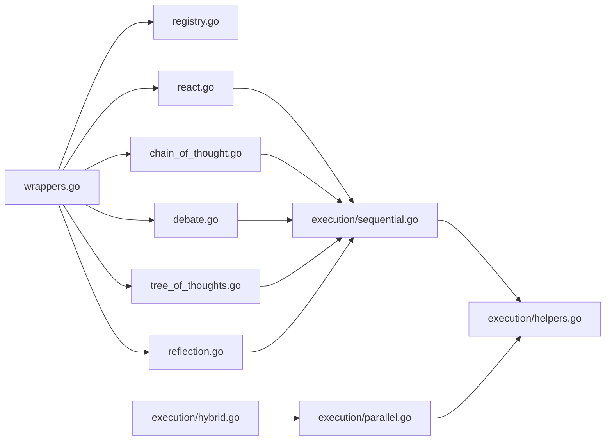

# Pattern Wrappers and Execution

<cite>
**Referenced Files in This Document**
- [wrappers.go](file://go/orchestrator/internal/workflows/patterns/wrappers.go)
- [registry.go](file://go/orchestrator/internal/workflows/patterns/registry.go)
- [options.go](file://go/orchestrator/internal/workflows/patterns/options.go)
- [sequential.go](file://go/orchestrator/internal/workflows/patterns/execution/sequential.go)
- [parallel.go](file://go/orchestrator/internal/workflows/patterns/execution/parallel.go)
- [hybrid.go](file://go/orchestrator/internal/workflows/patterns/execution/hybrid.go)
- [helpers.go](file://go/orchestrator/internal/workflows/patterns/execution/helpers.go)
- [react.go](file://go/orchestrator/internal/workflows/patterns/react.go)
- [chain_of_thought.go](file://go/orchestrator/internal/workflows/patterns/chain_of_thought.go)
- [debate.go](file://go/orchestrator/internal/workflows/patterns/debate.go)
- [tree_of_thoughts.go](file://go/orchestrator/internal/workflows/patterns/tree_of_thoughts.go)
- [reflection.go](file://go/orchestrator/internal/workflows/patterns/reflection.go)
</cite>

## Table of Contents
1. [Introduction](#introduction)
2. [Project Structure](#project-structure)
3. [Core Components](#core-components)
4. [Architecture Overview](#architecture-overview)
5. [Detailed Component Analysis](#detailed-component-analysis)
6. [Dependency Analysis](#dependency-analysis)
7. [Performance Considerations](#performance-considerations)
8. [Troubleshooting Guide](#troubleshooting-guide)
9. [Conclusion](#conclusion)

## Introduction
This document explains the pattern wrappers and execution mechanisms in Shannon’s workflow system. It focuses on how wrapper functions adapt cognitive and orchestration patterns for different execution contexts, propagate errors, and manage the lifecycle of pattern execution. It also documents the execution flow, state management, and coordination between wrapper functions and underlying pattern implementations. Practical usage scenarios and integration strategies are included to help developers adopt and extend the system effectively.

## Project Structure
Shannon organizes multi-agent patterns and their execution strategies under a cohesive set of packages:
- Pattern wrappers and registry define the high-level interface and selection strategy.
- Execution engines implement sequential, parallel, and hybrid orchestration with robust error handling and telemetry.
- Individual pattern implementations encapsulate reasoning, debate, tree-of-thoughts, and reflection logic.
- Shared options and helpers standardize configuration and context adaptation.

**Diagram sources**
- [wrappers.go](file://go/orchestrator/internal/workflows/patterns/wrappers.go#L1-L264)
- [registry.go](file://go/orchestrator/internal/workflows/patterns/registry.go#L1-L190)
- [options.go](file://go/orchestrator/internal/workflows/patterns/options.go#L1-L21)
- [sequential.go](file://go/orchestrator/internal/workflows/patterns/execution/sequential.go#L1-L475)
- [parallel.go](file://go/orchestrator/internal/workflows/patterns/execution/parallel.go#L1-L520)
- [hybrid.go](file://go/orchestrator/internal/workflows/patterns/execution/hybrid.go#L1-L408)
- [helpers.go](file://go/orchestrator/internal/workflows/patterns/execution/helpers.go#L1-L27)
- [react.go](file://go/orchestrator/internal/workflows/patterns/react.go#L1-L905)
- [chain_of_thought.go](file://go/orchestrator/internal/workflows/patterns/chain_of_thought.go#L1-L433)
- [debate.go](file://go/orchestrator/internal/workflows/patterns/debate.go#L1-L644)
- [tree_of_thoughts.go](file://go/orchestrator/internal/workflows/patterns/tree_of_thoughts.go#L1-L631)
- [reflection.go](file://go/orchestrator/internal/workflows/patterns/reflection.go#L1-L170)

**Section sources**
- [wrappers.go](file://go/orchestrator/internal/workflows/patterns/wrappers.go#L1-L264)
- [registry.go](file://go/orchestrator/internal/workflows/patterns/registry.go#L1-L190)
- [sequential.go](file://go/orchestrator/internal/workflows/patterns/execution/sequential.go#L1-L475)
- [parallel.go](file://go/orchestrator/internal/workflows/patterns/execution/parallel.go#L1-L520)
- [hybrid.go](file://go/orchestrator/internal/workflows/patterns/execution/hybrid.go#L1-L408)
- [helpers.go](file://go/orchestrator/internal/workflows/patterns/execution/helpers.go#L1-L27)
- [react.go](file://go/orchestrator/internal/workflows/patterns/react.go#L1-L905)
- [chain_of_thought.go](file://go/orchestrator/internal/workflows/patterns/chain_of_thought.go#L1-L433)
- [debate.go](file://go/orchestrator/internal/workflows/patterns/debate.go#L1-L644)
- [tree_of_thoughts.go](file://go/orchestrator/internal/workflows/patterns/tree_of_thoughts.go#L1-L631)
- [reflection.go](file://go/orchestrator/internal/workflows/patterns/reflection.go#L1-L170)

## Core Components
- Pattern interface and registry: Defines the contract for all patterns, exposes selection and registration, and provides default capability hints.
- Wrapper implementations: Thin adapters that convert raw pattern inputs into structured configuration, enforce budgets, and translate results into a unified output format.
- Execution engines: Provide deterministic orchestration strategies (sequential, parallel, hybrid) with streaming, persistence, and token accounting.
- Pattern implementations: Encapsulate specialized reasoning and synthesis logic with budget-aware execution and token usage recording.

Key responsibilities:
- Wrapper functions: Adapt inputs, configure options, invoke underlying patterns, and normalize outputs.
- Execution engines: Manage concurrency, timeouts, retries, persistence, and telemetry.
- Pattern implementations: Perform reasoning, debate, synthesis, and reflection with optional budget enforcement.

**Section sources**
- [registry.go](file://go/orchestrator/internal/workflows/patterns/registry.go#L35-L108)
- [wrappers.go](file://go/orchestrator/internal/workflows/patterns/wrappers.go#L14-L263)
- [sequential.go](file://go/orchestrator/internal/workflows/patterns/execution/sequential.go#L47-L395)
- [parallel.go](file://go/orchestrator/internal/workflows/patterns/execution/parallel.go#L48-L450)
- [hybrid.go](file://go/orchestrator/internal/workflows/patterns/execution/hybrid.go#L45-L161)

## Architecture Overview
The system separates concerns across three layers:
- Wrapper layer: Provides a uniform interface for invoking patterns with context adaptation and budget handling.
- Execution layer: Implements orchestration strategies with deterministic concurrency and robust error handling.
- Pattern layer: Encapsulates specialized reasoning and synthesis logic with optional budget enforcement.

**Diagram sources**
- [registry.go](file://go/orchestrator/internal/workflows/patterns/registry.go#L162-L170)
- [wrappers.go](file://go/orchestrator/internal/workflows/patterns/wrappers.go#L31-L51)
- [sequential.go](file://go/orchestrator/internal/workflows/patterns/execution/sequential.go#L49-L395)
- [parallel.go](file://go/orchestrator/internal/workflows/patterns/execution/parallel.go#L50-L450)
- [react.go](file://go/orchestrator/internal/workflows/patterns/react.go#L49-L702)
- [chain_of_thought.go](file://go/orchestrator/internal/workflows/patterns/chain_of_thought.go#L38-L294)
- [debate.go](file://go/orchestrator/internal/workflows/patterns/debate.go#L49-L472)
- [tree_of_thoughts.go](file://go/orchestrator/internal/workflows/patterns/tree_of_thoughts.go#L54-L235)
- [reflection.go](file://go/orchestrator/internal/workflows/patterns/reflection.go#L20-L169)

## Detailed Component Analysis

### Pattern Registry and Selection
- The registry defines the Pattern interface, input/output structures, and capability taxonomy.
- Default selector chooses a pattern based on explicit hints or falls back to the first available pattern.
- Registration binds wrapper implementations to the registry for discovery.

**Diagram sources**
- [registry.go](file://go/orchestrator/internal/workflows/patterns/registry.go#L35-L108)
- [registry.go](file://go/orchestrator/internal/workflows/patterns/registry.go#L110-L189)

**Section sources**
- [registry.go](file://go/orchestrator/internal/workflows/patterns/registry.go#L11-L78)
- [registry.go](file://go/orchestrator/internal/workflows/patterns/registry.go#L162-L170)

### Wrapper Functions: React, Chain-of-Thought, Debate, Tree-of-Thoughts, Reflection
Each wrapper adapts raw inputs to pattern-specific configuration, constructs Options, and invokes the underlying pattern. Results are normalized into a unified PatternResult.

Key behaviors:
- Type identification and capability reporting.
- Token estimation heuristics.
- Budget-aware invocation of underlying patterns.
- Result normalization and metadata enrichment.

**Diagram sources**
- [wrappers.go](file://go/orchestrator/internal/workflows/patterns/wrappers.go#L14-L263)
- [react.go](file://go/orchestrator/internal/workflows/patterns/react.go#L49-L702)
- [chain_of_thought.go](file://go/orchestrator/internal/workflows/patterns/chain_of_thought.go#L38-L294)
- [debate.go](file://go/orchestrator/internal/workflows/patterns/debate.go#L49-L472)
- [tree_of_thoughts.go](file://go/orchestrator/internal/workflows/patterns/tree_of_thoughts.go#L54-L235)
- [reflection.go](file://go/orchestrator/internal/workflows/patterns/reflection.go#L20-L169)

**Section sources**
- [wrappers.go](file://go/orchestrator/internal/workflows/patterns/wrappers.go#L14-L263)

### Sequential Execution Engine
Sequential execution runs tasks in order, optionally passing prior results and extracting numeric/tool outputs. It enforces timeouts, retries, persistence, and token accounting.

Highlights:
- Context augmentation per task.
- Optional streaming events and agent memory integration.
- Zero-token observability and provider/model fallbacks.
- Deterministic persistence and tool execution logging.

**Diagram sources**
- [sequential.go](file://go/orchestrator/internal/workflows/patterns/execution/sequential.go#L49-L395)

**Section sources**
- [sequential.go](file://go/orchestrator/internal/workflows/patterns/execution/sequential.go#L47-L395)

### Parallel Execution Engine
Parallel execution launches multiple tasks concurrently with a configurable semaphore. It collects results deterministically, emits events, and records token usage.

Highlights:
- Semaphore-based concurrency control.
- Selector-based result collection to preserve completion order.
- Robust error handling with event emission and persistence.
- Zero-token observability and provider/model fallbacks.

**Diagram sources**
- [parallel.go](file://go/orchestrator/internal/workflows/patterns/execution/parallel.go#L50-L450)

**Section sources**
- [parallel.go](file://go/orchestrator/internal/workflows/patterns/execution/parallel.go#L48-L450)

### Hybrid Execution Engine
Hybrid execution coordinates tasks with dependencies using a semaphore and channels. It waits for dependencies with incremental timeouts and executes tasks either in parallel or sequentially depending on configuration.

Highlights:
- Dependency satisfaction with bounded wait and incremental progress logs.
- Optional passing of dependency results and clearing of tool parameters for dependent tasks.
- Event emission and persistence for each task.

**Diagram sources**
- [hybrid.go](file://go/orchestrator/internal/workflows/patterns/execution/hybrid.go#L66-L161)
- [hybrid.go](file://go/orchestrator/internal/workflows/patterns/execution/hybrid.go#L170-L346)

**Section sources**
- [hybrid.go](file://go/orchestrator/internal/workflows/patterns/execution/hybrid.go#L45-L161)
- [hybrid.go](file://go/orchestrator/internal/workflows/patterns/execution/hybrid.go#L348-L407)

### Pattern Implementations

#### React Loop (Reason-Act-Observe)
The React loop orchestrates iterative reasoning, action, and observation with streaming updates and optional research-mode tool biasing.

Key aspects:
- Iteration control with minimum/maximum bounds and convergence checks.
- Research-mode tool biasing and citation tracking.
- Final synthesis and token usage recording.

**Diagram sources**
- [react.go](file://go/orchestrator/internal/workflows/patterns/react.go#L49-L702)

**Section sources**
- [react.go](file://go/orchestrator/internal/workflows/patterns/react.go#L47-L702)

#### Chain-of-Thought
Chain-of-thought builds a structured reasoning prompt, executes a single agent call, parses steps, and optionally clarifies low-confidence reasoning.

Highlights:
- Structured prompt building and step parsing.
- Optional clarification with reduced budget.
- Confidence calculation and result formatting.

**Section sources**
- [chain_of_thought.go](file://go/orchestrator/internal/workflows/patterns/chain_of_thought.go#L36-L294)

#### Debate
Debate initializes multiple debaters, runs rounds of counter-argumentation, and resolves via moderator, voting, or synthesis.

Highlights:
- Parallel initial positions and round responses.
- Argument extraction and strength estimation.
- Consensus detection and persistence.

**Section sources**
- [debate.go](file://go/orchestrator/internal/workflows/patterns/debate.go#L48-L472)

#### Tree-of-Thoughts
Tree-of-thoughts explores a branching thought tree with pruning, scoring, and optional backtracking.

Highlights:
- Branch generation and evaluation with pruning thresholds.
- Best-path synthesis and confidence calculation.
- Backtracking to improve low-confidence solutions.

**Section sources**
- [tree_of_thoughts.go](file://go/orchestrator/internal/workflows/patterns/tree_of_thoughts.go#L52-L235)

#### Reflection
Reflection evaluates a result against criteria and iteratively synthesizes improvements until a threshold is met.

Highlights:
- Evaluation with feedback-driven re-synthesis.
- Token usage recording for re-synthesis.
- Graceful fallback on failures.

**Section sources**
- [reflection.go](file://go/orchestrator/internal/workflows/patterns/reflection.go#L17-L169)

### Execution Context Adaptation and Timeout Handling
Execution engines adapt timeouts based on context, particularly enabling extended human-in-the-loop scenarios.

**Diagram sources**
- [helpers.go](file://go/orchestrator/internal/workflows/patterns/execution/helpers.go#L8-L26)

**Section sources**
- [helpers.go](file://go/orchestrator/internal/workflows/patterns/execution/helpers.go#L8-L26)

### Pattern Lifecycle Management
Lifecycle stages:
- Initialization: Wrapper constructs Options and validates Config.
- Execution: Underlying pattern invoked with budget and context.
- Monitoring: Streaming events, persistence, and token usage recording.
- Cleanup: Fire-and-forget persistence and optional memory recording.

**Section sources**
- [wrappers.go](file://go/orchestrator/internal/workflows/patterns/wrappers.go#L31-L51)
- [sequential.go](file://go/orchestrator/internal/workflows/patterns/execution/sequential.go#L397-L471)
- [parallel.go](file://go/orchestrator/internal/workflows/patterns/execution/parallel.go#L452-L520)
- [hybrid.go](file://go/orchestrator/internal/workflows/patterns/execution/hybrid.go#L348-L407)

## Dependency Analysis
The wrapper layer depends on the registry and pattern implementations. Execution engines depend on shared helpers and activities. Pattern implementations depend on activities and token recording.

**Diagram sources**
- [wrappers.go](file://go/orchestrator/internal/workflows/patterns/wrappers.go#L1-L264)
- [registry.go](file://go/orchestrator/internal/workflows/patterns/registry.go#L1-L190)
- [sequential.go](file://go/orchestrator/internal/workflows/patterns/execution/sequential.go#L1-L475)
- [parallel.go](file://go/orchestrator/internal/workflows/patterns/execution/parallel.go#L1-L520)
- [hybrid.go](file://go/orchestrator/internal/workflows/patterns/execution/hybrid.go#L1-L408)
- [helpers.go](file://go/orchestrator/internal/workflows/patterns/execution/helpers.go#L1-L27)
- [react.go](file://go/orchestrator/internal/workflows/patterns/react.go#L1-L905)
- [chain_of_thought.go](file://go/orchestrator/internal/workflows/patterns/chain_of_thought.go#L1-L433)
- [debate.go](file://go/orchestrator/internal/workflows/patterns/debate.go#L1-L644)
- [tree_of_thoughts.go](file://go/orchestrator/internal/workflows/patterns/tree_of_thoughts.go#L1-L631)
- [reflection.go](file://go/orchestrator/internal/workflows/patterns/reflection.go#L1-L170)

**Section sources**
- [wrappers.go](file://go/orchestrator/internal/workflows/patterns/wrappers.go#L1-L264)
- [sequential.go](file://go/orchestrator/internal/workflows/patterns/execution/sequential.go#L1-L475)
- [parallel.go](file://go/orchestrator/internal/workflows/patterns/execution/parallel.go#L1-L520)
- [hybrid.go](file://go/orchestrator/internal/workflows/patterns/execution/hybrid.go#L1-L408)

## Performance Considerations
- Concurrency control: Use semaphores to cap parallelism and avoid resource contention.
- Budget enforcement: Distribute token budgets across tasks to prevent runaway costs.
- Persistence and retries: Use minimal retries for persistence to reduce tail latency.
- Zero-token observability: Enable explicit recording of zero-token events when needed to maintain observability.
- Timeout tuning: Adjust timeouts per context (e.g., human-in-the-loop) to balance responsiveness and reliability.

## Troubleshooting Guide
Common issues and resolutions:
- Agent execution failures: Execution engines emit error events and continue to maintain progress. Review emitted events and logs for root cause.
- Missing token usage: Verify model/provider fallbacks and ensure zero-token recording flags are set appropriately.
- Dependency timeouts: Increase wait timeouts and adjust check intervals for hybrid execution to improve progress visibility.
- Budget exhaustion: Reduce per-agent budgets or increase max budgets; ensure budget distribution across tasks.

**Section sources**
- [sequential.go](file://go/orchestrator/internal/workflows/patterns/execution/sequential.go#L239-L260)
- [parallel.go](file://go/orchestrator/internal/workflows/patterns/execution/parallel.go#L252-L275)
- [hybrid.go](file://go/orchestrator/internal/workflows/patterns/execution/hybrid.go#L368-L406)

## Conclusion
Shannon’s pattern wrappers and execution mechanisms provide a robust, extensible framework for orchestrating multi-agent reasoning and synthesis. Wrappers adapt inputs and configuration, while execution engines deliver deterministic, observable, and budget-aware orchestration. Together, they enable scalable integration of diverse cognitive patterns with strong error handling, persistence, and monitoring.