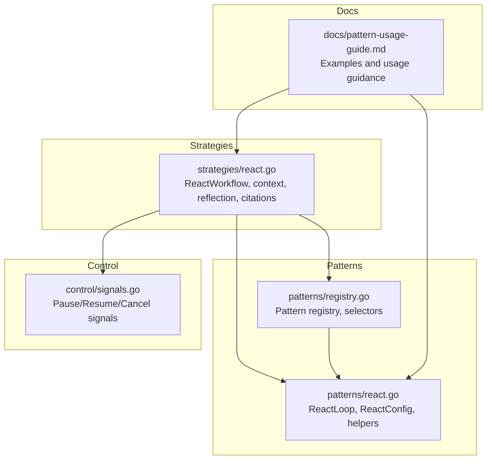
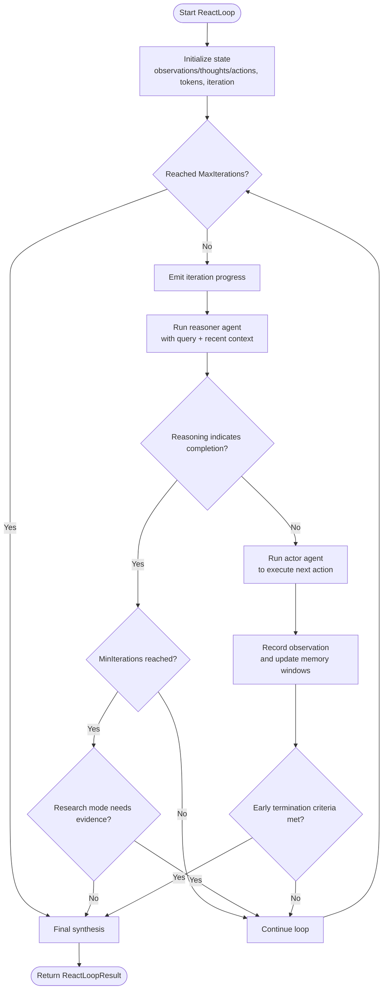
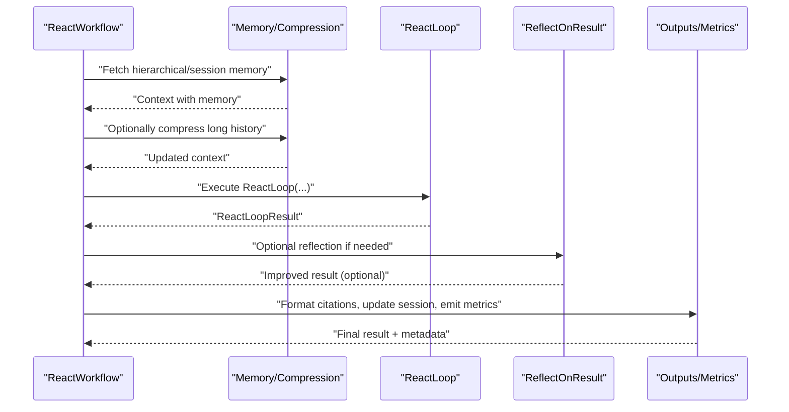
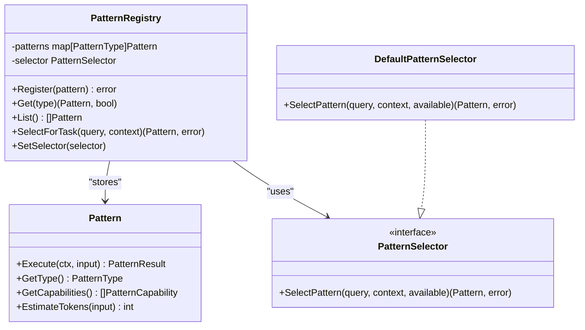
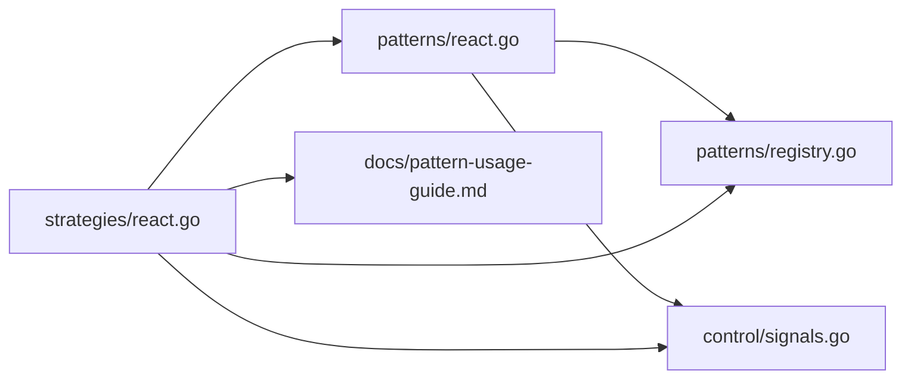

# React Pattern

<cite>
**Referenced Files in This Document**
- [react.go](file://go/orchestrator/internal/workflows/patterns/react.go)
- [react.go](file://go/orchestrator/internal/workflows/strategies/react.go)
- [registry.go](file://go/orchestrator/internal/workflows/patterns/registry.go)
- [signals.go](file://go/orchestrator/internal/workflows/control/signals.go)
- [pattern-usage-guide.md](file://docs/pattern-usage-guide.md)
</cite>

## Table of Contents
1. [Introduction](#introduction)
2. [Project Structure](#project-structure)
3. [Core Components](#core-components)
4. [Architecture Overview](#architecture-overview)
5. [Detailed Component Analysis](#detailed-component-analysis)
6. [Dependency Analysis](#dependency-analysis)
7. [Performance Considerations](#performance-considerations)
8. [Troubleshooting Guide](#troubleshooting-guide)
9. [Conclusion](#conclusion)

## Introduction
This document explains the React pattern in Shannon’s multi-agent orchestration system. The React pattern enables rapid response to changing conditions through iterative Reason-Act-Observe cycles. Agents using this pattern continuously monitor their environment, adapt behavior based on feedback, and generate dynamic responses. The pattern supports real-time adaptation strategies, reactive decision-making, and continuous monitoring of outcomes to refine actions until a goal is achieved or early termination criteria are met.

## Project Structure
The React pattern is implemented as a reusable workflow pattern with a dedicated workflow strategy and supporting utilities:
- Pattern definition and loop logic: go/orchestrator/internal/workflows/patterns/react.go
- Workflow strategy that orchestrates the pattern: go/orchestrator/internal/workflows/strategies/react.go
- Pattern registry and selection: go/orchestrator/internal/workflows/patterns/registry.go
- Control signals for pause/resume/cancel: go/orchestrator/internal/workflows/control/signals.go
- Usage guidance and examples: docs/pattern-usage-guide.md



**Diagram sources**
- [react.go](file://go/orchestrator/internal/workflows/patterns/react.go#L1-L905)
- [react.go](file://go/orchestrator/internal/workflows/strategies/react.go#L1-L535)
- [registry.go](file://go/orchestrator/internal/workflows/patterns/registry.go#L1-L190)
- [signals.go](file://go/orchestrator/internal/workflows/control/signals.go#L1-L41)
- [pattern-usage-guide.md](file://docs/pattern-usage-guide.md#L1-L458)

**Section sources**
- [react.go](file://go/orchestrator/internal/workflows/patterns/react.go#L1-L905)
- [react.go](file://go/orchestrator/internal/workflows/strategies/react.go#L1-L535)
- [registry.go](file://go/orchestrator/internal/workflows/patterns/registry.go#L1-L190)
- [signals.go](file://go/orchestrator/internal/workflows/control/signals.go#L1-L41)
- [pattern-usage-guide.md](file://docs/pattern-usage-guide.md#L1-L458)

## Core Components
- ReactConfig: Controls loop limits and memory windows for observations/thoughts/actions.
- ReactLoop: Implements the Reason-Act-Observe cycle with optional budgeting, streaming events, and early termination heuristics.
- ReactWorkflow: The strategy that prepares context, optionally injects memory and compression, runs the loop, applies optional reflection, collects citations, and records metrics and session updates.
- Pattern registry: Registers and selects patterns, including React.
- Control signals: Provides pause/resume/cancel hooks integrated into the workflow.

Key responsibilities:
- Adaptive decision-making: The loop checks completion cues and adapts behavior based on recent observations and tool execution success.
- Real-time monitoring: Streaming events announce agent starts/completions and loop progress; control signals allow runtime intervention.
- Dynamic response generation: Final synthesis aggregates thoughts, actions, and observations into a coherent answer.

**Section sources**
- [react.go](file://go/orchestrator/internal/workflows/patterns/react.go#L26-L702)
- [react.go](file://go/orchestrator/internal/workflows/strategies/react.go#L20-L534)
- [registry.go](file://go/orchestrator/internal/workflows/patterns/registry.go#L11-L190)
- [signals.go](file://go/orchestrator/internal/workflows/control/signals.go#L5-L41)

## Architecture Overview
The React pattern integrates tightly with the broader orchestration framework:
- The strategy composes context (including optional memory and compression), invokes the React loop, optionally reflects on results, and persists outputs.
- The loop coordinates two agents per iteration: a reasoner and an actor, emitting streaming events and tracking tokens and tool executions.
- Early termination heuristics and completion checks ensure efficient convergence.

```mermaid
sequenceDiagram
participant Client as "Caller"
participant Strategy as "ReactWorkflow"
participant Loop as "ReactLoop"
participant Reasoner as "Reasoner Agent"
participant Actor as "Actor Agent"
participant Synth as "Synthesizer Agent"
Client->>Strategy : "Start ReactWorkflow(query, context)"
Strategy->>Strategy : "Prepare baseContext, memory, compression"
Strategy->>Loop : "Execute ReactLoop(query, baseContext, ...)"
loop "Iterate up to MaxIterations"
Strategy->>Reasoner : "Reason (with observations/thoughts/actions)"
Reasoner-->>Strategy : "Next action plan"
Strategy->>Actor : "Act (execute tools)"
Actor-->>Strategy : "Observation result"
Strategy->>Strategy : "Check early termination / completion"
end
Strategy->>Synth : "Final synthesis from thoughts/actions/observations"
Synth-->>Strategy : "Final answer"
Strategy->>Strategy : "Optional reflection, citations, metrics"
Strategy-->>Client : "Result + metadata"
```

**Diagram sources**
- [react.go](file://go/orchestrator/internal/workflows/strategies/react.go#L22-L534)
- [react.go](file://go/orchestrator/internal/workflows/patterns/react.go#L47-L702)

## Detailed Component Analysis

### ReactLoop: Reason-Act-Observe Cycle
ReactLoop encapsulates the core reactive mechanism:
- Iteration lifecycle: For each iteration, it emits progress, runs a reasoner agent, executes an action via an actor agent, records observations, and checks early termination or completion.
- Completion detection: Uses heuristics to detect “task complete” statements and enforces minimum iterations and research-mode constraints.
- Early termination: Stops when convergence is detected (similar recent observations), high-confidence solutions appear, or citation counts plateau without new information.
- Streaming and events: Publishes structured events for agent starts/completions and loop progress to support real-time UI updates.
- Budgeting and token accounting: Supports optional per-activity budgeting and records token usage per phase.



**Diagram sources**
- [react.go](file://go/orchestrator/internal/workflows/patterns/react.go#L47-L702)

**Section sources**
- [react.go](file://go/orchestrator/internal/workflows/patterns/react.go#L47-L702)

### ReactWorkflow: Strategy Orchestration
ReactWorkflow wires the pattern into a full workflow:
- Context preparation: Merges input context and session context, injects memory (hierarchical or session), and optionally compresses long histories.
- Budget and model tier: Reads budget hints and determines an approximate model for pricing/metadata.
- Control signals: Integrates pause/resume/cancel checks before execution and after reflection.
- Reflection: Applies optional reflection for quality improvement when iterations exceed a threshold.
- Citations: Collects and formats citations when enabled.
- Session updates and metrics: Persists results, records token usage per agent, and emits pattern metrics.



**Diagram sources**
- [react.go](file://go/orchestrator/internal/workflows/strategies/react.go#L20-L534)

**Section sources**
- [react.go](file://go/orchestrator/internal/workflows/strategies/react.go#L20-L534)

### Pattern Registry and Selection
The pattern registry supports dynamic selection and composition:
- PatternType includes React and other patterns.
- DefaultPatternSelector chooses patterns based on context hints or falls back to a default.
- The registry enables future extensibility for pattern composition and selection strategies.



**Diagram sources**
- [registry.go](file://go/orchestrator/internal/workflows/patterns/registry.go#L35-L190)

**Section sources**
- [registry.go](file://go/orchestrator/internal/workflows/patterns/registry.go#L1-L190)

### Reactive Scenarios, Triggers, and Optimization
Common reactive scenarios and triggers:
- Tool failures: Observations include errors; loop continues to recover or try alternatives.
- Convergence: Similar recent observations indicate stability; early termination triggers.
- Citation stagnation: No new sources or minimal new content over iterations; loop stops to avoid redundancy.
- Completion cues: Reasoning explicitly states “task complete”; enforced minimum iterations and research-mode constraints apply.

Optimization techniques:
- Observation windowing: Limits tracked context to recent items to reduce memory growth.
- Thought/action/observation caps: Prevent unbounded growth in tracked artifacts.
- Early termination heuristics: Stop when confidence or convergence is evident.
- Budgeting: Optional per-activity token budgeting to constrain cost.
- Reflection gating: Apply reflection only for complex results to balance quality and speed.

**Section sources**
- [react.go](file://go/orchestrator/internal/workflows/patterns/react.go#L704-L802)
- [react.go](file://go/orchestrator/internal/workflows/strategies/react.go#L263-L326)

## Dependency Analysis
The React pattern depends on:
- Pattern registry for selection and composition.
- Control signals for runtime control.
- Activities and streaming for event emission and progress updates.
- Pricing utilities for token cost estimation.
- Metadata utilities for citations.



**Diagram sources**
- [react.go](file://go/orchestrator/internal/workflows/patterns/react.go#L1-L905)
- [react.go](file://go/orchestrator/internal/workflows/strategies/react.go#L1-L535)
- [registry.go](file://go/orchestrator/internal/workflows/patterns/registry.go#L1-L190)
- [signals.go](file://go/orchestrator/internal/workflows/control/signals.go#L1-L41)
- [pattern-usage-guide.md](file://docs/pattern-usage-guide.md#L1-L458)

**Section sources**
- [react.go](file://go/orchestrator/internal/workflows/patterns/react.go#L1-L905)
- [react.go](file://go/orchestrator/internal/workflows/strategies/react.go#L1-L535)
- [registry.go](file://go/orchestrator/internal/workflows/patterns/registry.go#L1-L190)
- [signals.go](file://go/orchestrator/internal/workflows/control/signals.go#L1-L41)
- [pattern-usage-guide.md](file://docs/pattern-usage-guide.md#L1-L458)

## Performance Considerations
- Token efficiency: Use observation windows and caps to bound memory and computation.
- Early termination: Leverage convergence and citation stagnation heuristics to avoid unnecessary iterations.
- Budgeting: Apply per-activity budgets to cap cost during reasoning, acting, and synthesis.
- Model tiering: Choose appropriate model tiers for reasoning vs. acting to balance quality and cost.
- Compression: For long histories, compress context proactively to reduce token usage.
- Reflection gating: Reserve reflection for complex outputs to minimize extra compute.

[No sources needed since this section provides general guidance]

## Troubleshooting Guide
Common issues and remedies:
- Pattern not converging:
  - Increase MaxIterations or adjust confidence thresholds.
  - Verify query clarity and context completeness.
- Excessive token usage:
  - Reduce observation/action/thought caps.
  - Lower model tier or enable compression.
  - Tighten early termination criteria.
- Poor quality results:
  - Enable reflection with stricter criteria.
  - Increase model tier or add evaluation dimensions.
- Runtime interruptions:
  - Use control signals to pause/resume/cancel; integrate checks before major phases.

**Section sources**
- [react.go](file://go/orchestrator/internal/workflows/patterns/react.go#L747-L787)
- [react.go](file://go/orchestrator/internal/workflows/strategies/react.go#L45-L58)
- [pattern-usage-guide.md](file://docs/pattern-usage-guide.md#L392-L410)

## Conclusion
The React pattern in Shannon provides a robust, adaptive framework for interactive problem solving. Through iterative reasoning, tool-driven action, and continuous observation, agents respond dynamically to environmental feedback. The pattern’s reactive mechanisms—completion detection, early termination heuristics, and real-time streaming—enable rapid, efficient responses while maintaining quality through optional reflection and citation management. Combined with memory injection, compression, and control signals, the React pattern supports scalable, production-ready multi-agent workflows.