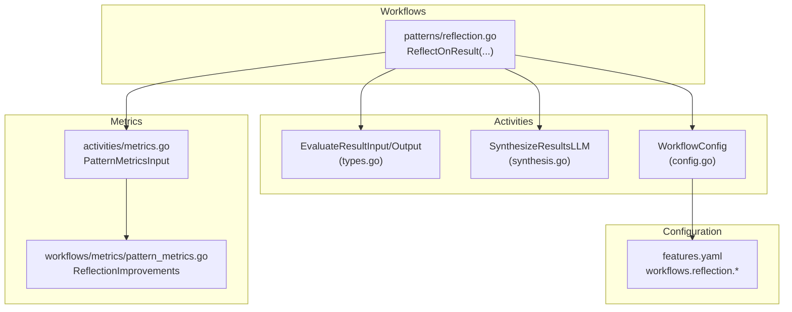
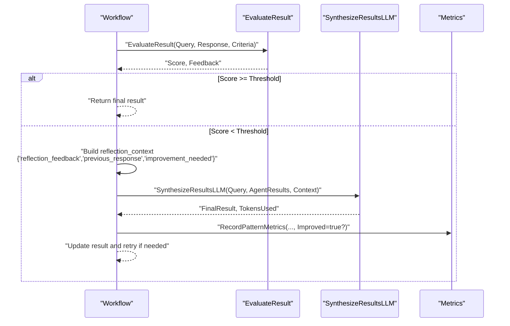
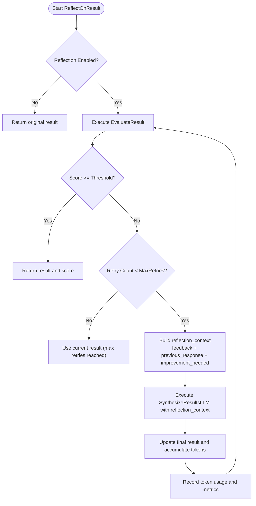
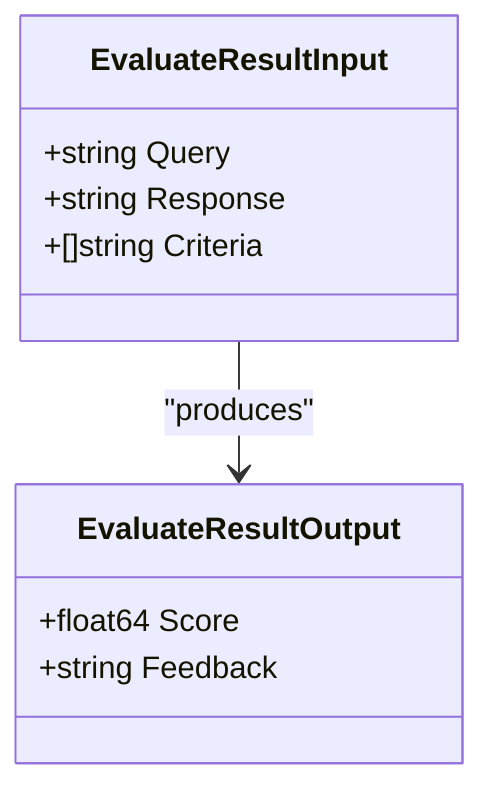
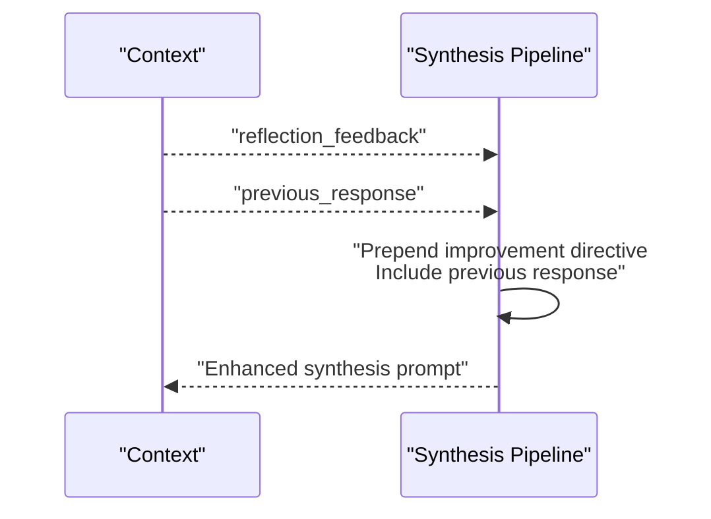
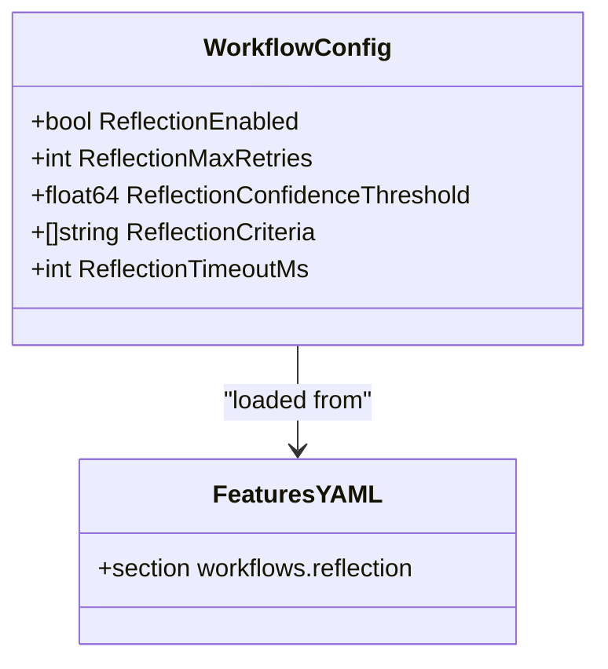
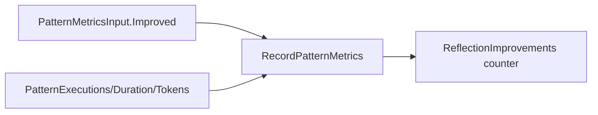
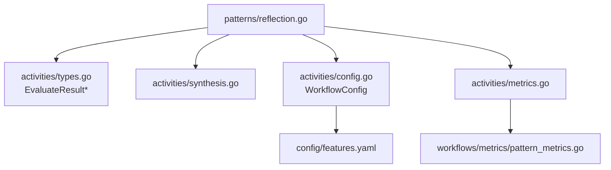

# Reflection Pattern

<cite>
**Referenced Files in This Document**
- [reflection.go](file://go/orchestrator/internal/workflows/patterns/reflection.go)
- [config.go](file://go/orchestrator/internal/activities/config.go)
- [types.go](file://go/orchestrator/internal/activities/types.go)
- [synthesis.go](file://go/orchestrator/internal/activities/synthesis.go)
- [metrics.go](file://go/orchestrator/internal/activities/metrics.go)
- [pattern_metrics.go](file://go/orchestrator/internal/workflows/metrics/pattern_metrics.go)
- [features.yaml](file://config/features.yaml)
- [research_comprehensive.tmpl](file://config/templates/synthesis/research_comprehensive.tmpl)
- [research_concise.tmpl](file://config/templates/synthesis/research_concise.tmpl)
</cite>

## Table of Contents
1. [Introduction](#introduction)
2. [Project Structure](#project-structure)
3. [Core Components](#core-components)
4. [Architecture Overview](#architecture-overview)
5. [Detailed Component Analysis](#detailed-component-analysis)
6. [Dependency Analysis](#dependency-analysis)
7. [Performance Considerations](#performance-considerations)
8. [Troubleshooting Guide](#troubleshooting-guide)
9. [Conclusion](#conclusion)

## Introduction
This document explains the Reflection pattern in Shannon’s multi-agent orchestration system. The Reflection pattern enables iterative self-improvement by systematically evaluating prior outputs, identifying weaknesses, and synthesizing enhanced solutions. It introduces a structured introspection loop that incorporates feedback into subsequent synthesis attempts, improving quality and confidence until a threshold is met or retries are exhausted.

## Project Structure
The Reflection pattern spans Go orchestration workflows, activity definitions, configuration, synthesis logic, and metrics. The following diagram maps the primary files involved in the reflection loop.

**Diagram sources**
- [reflection.go](file://go/orchestrator/internal/workflows/patterns/reflection.go#L17-L170)
- [types.go](file://go/orchestrator/internal/activities/types.go#L137-L148)
- [synthesis.go](file://go/orchestrator/internal/activities/synthesis.go#L460-L659)
- [config.go](file://go/orchestrator/internal/activities/config.go#L37-L42)
- [features.yaml](file://config/features.yaml#L66-L74)
- [metrics.go](file://go/orchestrator/internal/activities/metrics.go#L10-L19)
- [pattern_metrics.go](file://go/orchestrator/internal/workflows/metrics/pattern_metrics.go#L46-L53)

**Section sources**
- [reflection.go](file://go/orchestrator/internal/workflows/patterns/reflection.go#L17-L170)
- [config.go](file://go/orchestrator/internal/activities/config.go#L37-L42)
- [features.yaml](file://config/features.yaml#L66-L74)

## Core Components
- ReflectOnResult: Orchestrates the reflection loop, invoking quality evaluation and optional re-synthesis with feedback.
- EvaluateResultInput/Output: Defines the evaluation contract for scoring responses and generating feedback.
- SynthesizeResultsLLM: Incorporates reflection feedback into a new synthesis pass.
- WorkflowConfig and features.yaml: Configure reflection behavior (enabled, max retries, confidence threshold, criteria, timeout).
- Metrics: Track reflection improvements and pattern usage.

**Section sources**
- [reflection.go](file://go/orchestrator/internal/workflows/patterns/reflection.go#L17-L170)
- [types.go](file://go/orchestrator/internal/activities/types.go#L137-L148)
- [synthesis.go](file://go/orchestrator/internal/activities/synthesis.go#L460-L659)
- [config.go](file://go/orchestrator/internal/activities/config.go#L37-L42)
- [features.yaml](file://config/features.yaml#L66-L74)
- [metrics.go](file://go/orchestrator/internal/activities/metrics.go#L10-L19)
- [pattern_metrics.go](file://go/orchestrator/internal/workflows/metrics/pattern_metrics.go#L46-L53)

## Architecture Overview
The Reflection pattern follows a closed-loop process:
- Evaluate the current result against configured criteria.
- If below threshold, construct reflection context containing feedback and previous response.
- Re-run synthesis with reflection context to produce an improved result.
- Repeat up to configured retries; record metrics when improvements occur.

**Diagram sources**
- [reflection.go](file://go/orchestrator/internal/workflows/patterns/reflection.go#L17-L170)
- [types.go](file://go/orchestrator/internal/activities/types.go#L137-L148)
- [synthesis.go](file://go/orchestrator/internal/activities/synthesis.go#L460-L659)
- [metrics.go](file://go/orchestrator/internal/activities/metrics.go#L10-L19)

## Detailed Component Analysis

### ReflectOnResult: Reflection Loop Mechanics
- Early exit when reflection is disabled.
- Iterative evaluation with configurable timeout and single-attempt activities.
- Threshold gating: continue retrying only if score is below the confidence threshold.
- Reflection context augmentation: feedback, previous response, and a flag indicating improvement need.
- Re-synthesis with extended timeout and bounded retries; token usage recorded via a dedicated activity.
- Metrics recording for reflection improvements.

**Diagram sources**
- [reflection.go](file://go/orchestrator/internal/workflows/patterns/reflection.go#L17-L170)

**Section sources**
- [reflection.go](file://go/orchestrator/internal/workflows/patterns/reflection.go#L17-L170)

### Evaluation and Feedback: Quality Scoring and Criteria
- EvaluateResultInput specifies the query, response, and evaluation criteria.
- EvaluateResultOutput provides a numeric score and textual feedback.
- Criteria are loaded from configuration and can include completeness, accuracy, and relevance.

**Diagram sources**
- [types.go](file://go/orchestrator/internal/activities/types.go#L137-L148)

**Section sources**
- [types.go](file://go/orchestrator/internal/activities/types.go#L137-L148)
- [config.go](file://go/orchestrator/internal/activities/config.go#L37-L42)
- [features.yaml](file://config/features.yaml#L66-L74)

### Feedback Incorporation in Synthesis
- The synthesis pipeline reads reflection context keys to tailor prompts and improve output structure.
- When reflection feedback is present, synthesis prepends directives to focus on improvements and includes the previous response for contrast.
- Language and citation handling logic remains consistent with research templates, ensuring coherent outputs.

**Diagram sources**
- [synthesis.go](file://go/orchestrator/internal/activities/synthesis.go#L460-L659)

**Section sources**
- [synthesis.go](file://go/orchestrator/internal/activities/synthesis.go#L460-L659)

### Configuration and Tuning
- ReflectionEnabled toggles the pattern on/off.
- ReflectionMaxRetries controls iteration bounds.
- ReflectionConfidenceThreshold sets the acceptance bar.
- ReflectionCriteria defines evaluative dimensions.
- ReflectionTimeoutMs governs evaluation latency.

**Diagram sources**
- [config.go](file://go/orchestrator/internal/activities/config.go#L37-L42)
- [features.yaml](file://config/features.yaml#L66-L74)

**Section sources**
- [config.go](file://go/orchestrator/internal/activities/config.go#L37-L42)
- [features.yaml](file://config/features.yaml#L66-L74)

### Metrics and Quality Improvement Tracking
- PatternMetricsInput includes an Improved flag for reflection.
- RecordPatternMetrics conditionally increments reflection improvements.
- Prometheus metrics expose counters for reflection improvements and pattern usage.

**Diagram sources**
- [metrics.go](file://go/orchestrator/internal/activities/metrics.go#L10-L19)
- [pattern_metrics.go](file://go/orchestrator/internal/workflows/metrics/pattern_metrics.go#L46-L53)

**Section sources**
- [metrics.go](file://go/orchestrator/internal/activities/metrics.go#L10-L19)
- [pattern_metrics.go](file://go/orchestrator/internal/workflows/metrics/pattern_metrics.go#L46-L53)

### Practical Examples: How Reflection Enhances Problem-Solving
- Example 1: Research synthesis with comprehensive coverage
  - Use reflection to refine multi-area reports when initial synthesis lacks depth or citation density.
  - Templates guide structure; reflection ensures adherence to coverage and quality standards.
- Example 2: Concise synthesis under tight constraints
  - Apply reflection to improve clarity and confidence in shorter outputs, especially when dealing with ambiguous queries.

These examples illustrate how reflection elevates outputs by focusing synthesis on identified weaknesses and incorporating structured feedback.

**Section sources**
- [research_comprehensive.tmpl](file://config/templates/synthesis/research_comprehensive.tmpl#L1-L130)
- [research_concise.tmpl](file://config/templates/synthesis/research_concise.tmpl#L1-L69)
- [synthesis.go](file://go/orchestrator/internal/activities/synthesis.go#L460-L659)

## Dependency Analysis
The Reflection pattern depends on:
- Configuration loading for runtime tuning.
- Activity contracts for evaluation and synthesis.
- Metrics subsystem for observability.
- Templates for synthesis structure and quality expectations.

**Diagram sources**
- [reflection.go](file://go/orchestrator/internal/workflows/patterns/reflection.go#L17-L170)
- [types.go](file://go/orchestrator/internal/activities/types.go#L137-L148)
- [synthesis.go](file://go/orchestrator/internal/activities/synthesis.go#L460-L659)
- [config.go](file://go/orchestrator/internal/activities/config.go#L37-L42)
- [features.yaml](file://config/features.yaml#L66-L74)
- [metrics.go](file://go/orchestrator/internal/activities/metrics.go#L10-L19)
- [pattern_metrics.go](file://go/orchestrator/internal/workflows/metrics/pattern_metrics.go#L46-L53)

**Section sources**
- [reflection.go](file://go/orchestrator/internal/workflows/patterns/reflection.go#L17-L170)
- [config.go](file://go/orchestrator/internal/activities/config.go#L37-L42)
- [features.yaml](file://config/features.yaml#L66-L74)

## Performance Considerations
- Reflection adds latency proportional to evaluation and potential re-synthesis passes. Tune ReflectionMaxRetries and ReflectionTimeoutMs to balance quality and responsiveness.
- Token accounting distinguishes reflection synthesis from baseline synthesis; ensure budgets accommodate additional usage.
- Prefer targeted criteria to reduce unnecessary iterations.

## Troubleshooting Guide
- Reflection not triggering:
  - Verify ReflectionEnabled is true and ConfidenceThreshold is set appropriately.
- Frequent retries without improvement:
  - Review ReflectionCriteria and consider narrowing or adjusting thresholds.
- Excessive token usage:
  - Lower ReflectionMaxRetries or increase timeouts judiciously; monitor reflection synthesis token records.
- Metrics not incrementing:
  - Confirm Improved flag propagation and that RecordPatternMetrics is invoked with pattern "reflection".

**Section sources**
- [features.yaml](file://config/features.yaml#L66-L74)
- [reflection.go](file://go/orchestrator/internal/workflows/patterns/reflection.go#L17-L170)
- [metrics.go](file://go/orchestrator/internal/activities/metrics.go#L10-L19)
- [pattern_metrics.go](file://go/orchestrator/internal/workflows/metrics/pattern_metrics.go#L46-L53)

## Conclusion
The Reflection pattern in Shannon provides a robust mechanism for iterative self-improvement. By evaluating outputs against explicit criteria, capturing actionable feedback, and re-synthesizing with structured guidance, the system progressively refines results toward higher confidence and quality. Proper configuration, synthesis integration, and metrics tracking enable operators to monitor and optimize the effectiveness of reflection-driven refinement.