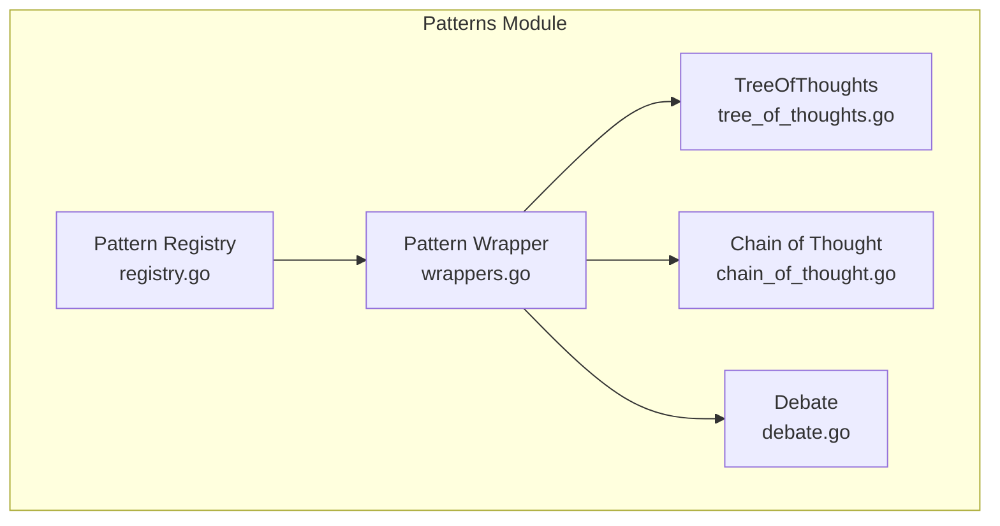
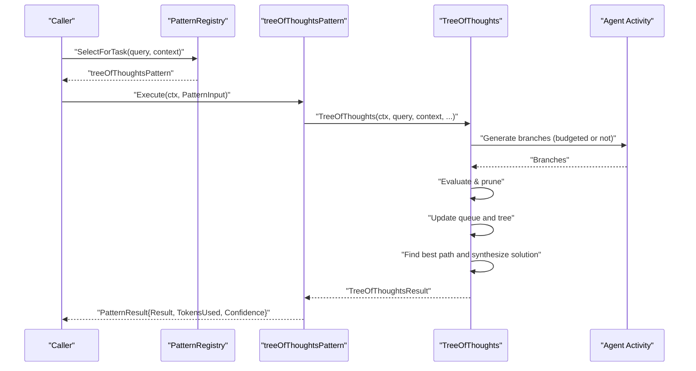
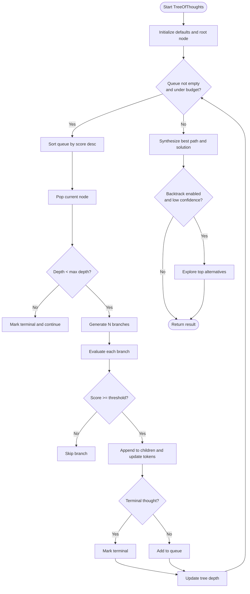
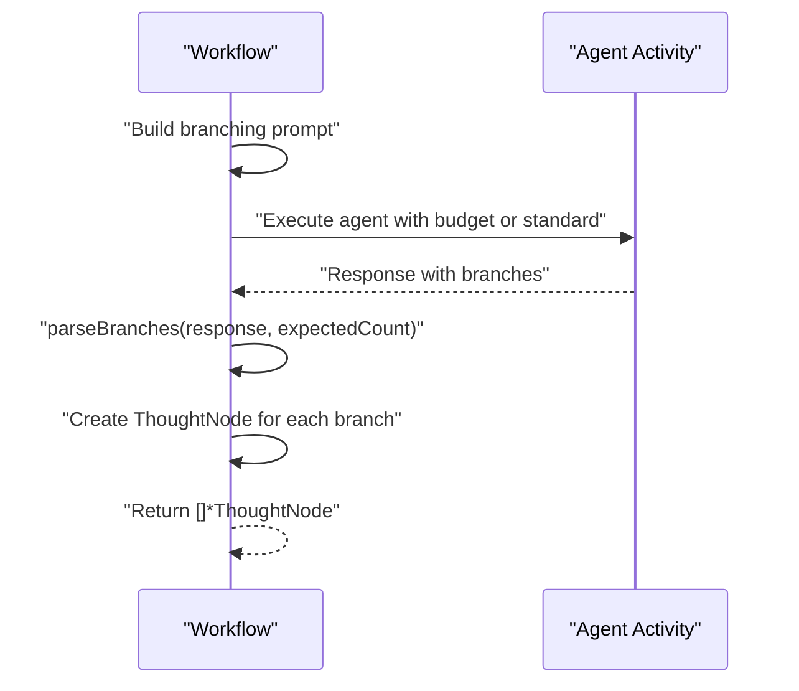
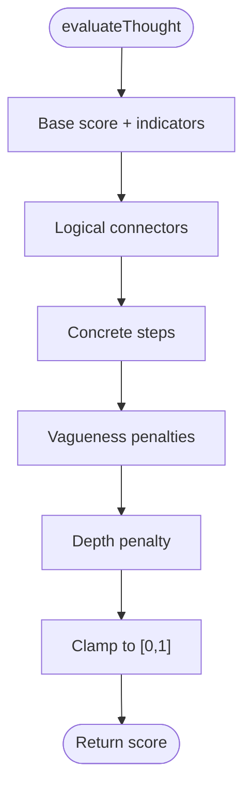
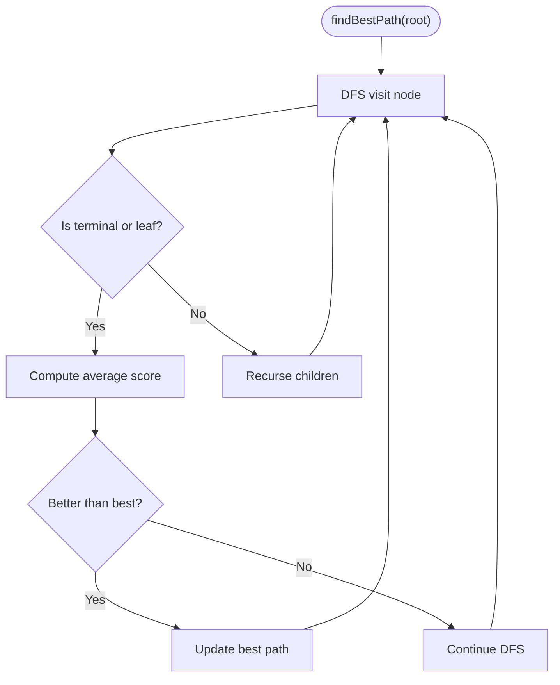
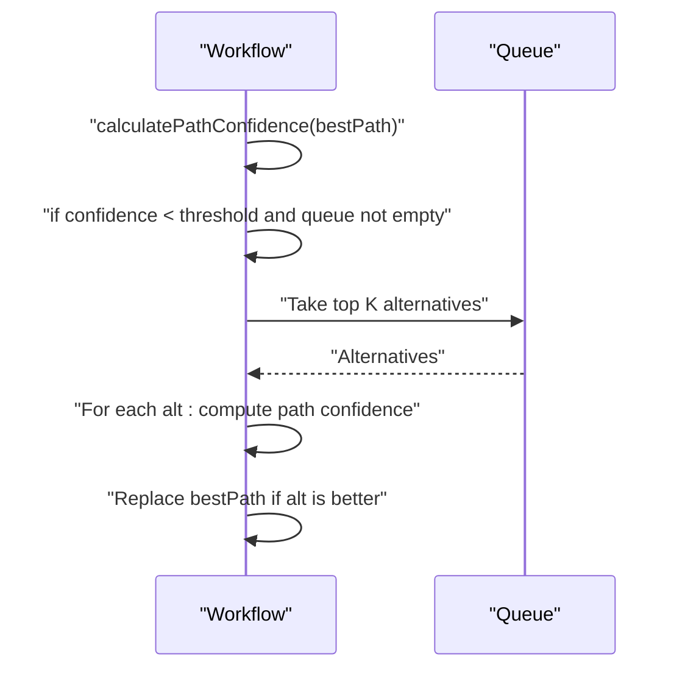
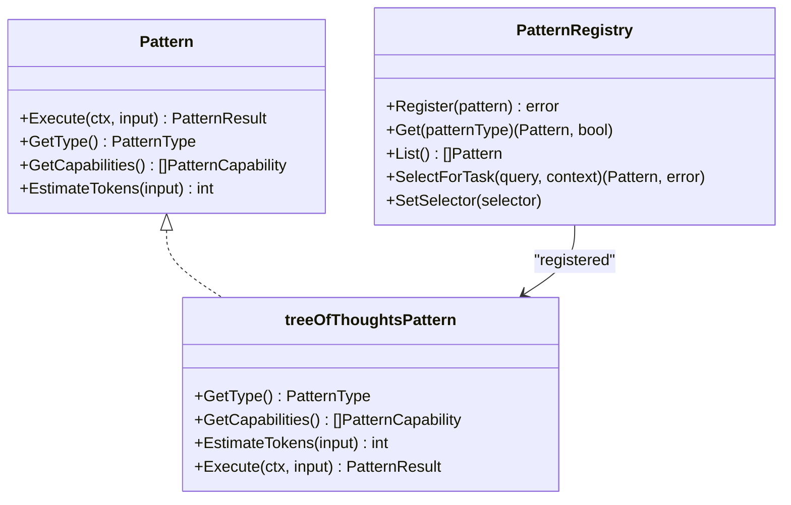
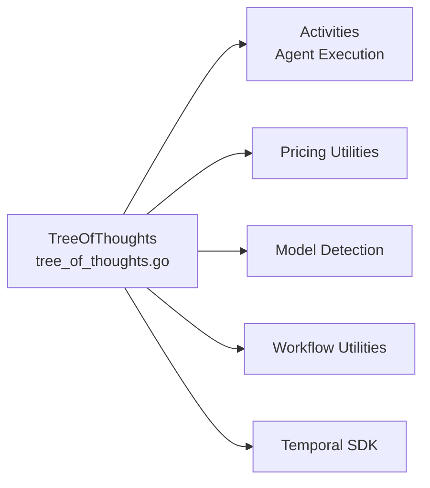

# Tree of Thoughts Pattern

<cite>
**Referenced Files in This Document**
- [tree_of_thoughts.go](file://go/orchestrator/internal/workflows/patterns/tree_of_thoughts.go)
- [wrappers.go](file://go/orchestrator/internal/workflows/patterns/wrappers.go)
- [registry.go](file://go/orchestrator/internal/workflows/patterns/registry.go)
- [chain_of_thought.go](file://go/orchestrator/internal/workflows/patterns/chain_of_thought.go)
- [debate.go](file://go/orchestrator/internal/workflows/patterns/debate.go)
- [patterns_exec_test.go](file://go/orchestrator/internal/workflows/patterns/patterns_exec_test.go)
</cite>

## Table of Contents
1. [Introduction](#introduction)
2. [Project Structure](#project-structure)
3. [Core Components](#core-components)
4. [Architecture Overview](#architecture-overview)
5. [Detailed Component Analysis](#detailed-component-analysis)
6. [Dependency Analysis](#dependency-analysis)
7. [Performance Considerations](#performance-considerations)
8. [Troubleshooting Guide](#troubleshooting-guide)
9. [Conclusion](#conclusion)

## Introduction
The Tree of Thoughts pattern in Shannon’s multi-agent orchestration system enables systematic exploration of multiple reasoning paths by branching thought processes. It supports parallel exploration of different solution approaches, selective expansion guided by scoring and pruning, and convergence on optimal solutions through best-path synthesis. The pattern is designed to handle complex decision-making scenarios where divergent reasoning is beneficial, and where confidence-based backtracking can improve outcomes.

## Project Structure
The Tree of Thoughts pattern is implemented as part of the multi-agent workflow patterns module. It integrates with the broader pattern registry and is exposed via a wrapper that conforms to the generic Pattern interface. Supporting patterns (Chain of Thought and Debate) illustrate complementary reasoning strategies within the same framework.

**Diagram sources**
- [tree_of_thoughts.go](file://go/orchestrator/internal/workflows/patterns/tree_of_thoughts.go#L1-L631)
- [wrappers.go](file://go/orchestrator/internal/workflows/patterns/wrappers.go#L1-L264)
- [registry.go](file://go/orchestrator/internal/workflows/patterns/registry.go#L1-L190)
- [chain_of_thought.go](file://go/orchestrator/internal/workflows/patterns/chain_of_thought.go#L1-L433)
- [debate.go](file://go/orchestrator/internal/workflows/patterns/debate.go#L1-L644)

**Section sources**
- [tree_of_thoughts.go](file://go/orchestrator/internal/workflows/patterns/tree_of_thoughts.go#L1-L631)
- [wrappers.go](file://go/orchestrator/internal/workflows/patterns/wrappers.go#L1-L264)
- [registry.go](file://go/orchestrator/internal/workflows/patterns/registry.go#L1-L190)

## Core Components
- TreeOfThoughtsConfig: Controls exploration limits and behavior (maximum depth, branching factor, evaluation method, pruning threshold, exploration budget, backtrack enablement, and model tier).
- ThoughtNode: Represents a node in the reasoning tree with fields for thought content, score, depth, parent/children pointers, token usage, terminal flag, and explanation.
- TreeOfThoughtsResult: Aggregates the best path, best solution, total explored thoughts, tree depth, total tokens consumed, the full exploration tree, and confidence.
- TreeOfThoughts: Orchestrates the exploration loop, generates branches, evaluates and prunes nodes, tracks budgets, and performs optional backtracking.

Key behaviors:
- Parallel-like exploration via a queue sorted by score (greedy selection of most promising nodes).
- Branch generation prompts an agent to propose multiple distinct next steps.
- Evaluation heuristics score nodes based on solution indicators, logical progression, concreteness, and depth penalties.
- Terminal detection identifies solution or dead-end keywords.
- Best path discovery uses DFS to compute average scores across paths.
- Optional backtracking explores top alternatives when confidence is low.

**Section sources**
- [tree_of_thoughts.go](file://go/orchestrator/internal/workflows/patterns/tree_of_thoughts.go#L17-L50)
- [tree_of_thoughts.go](file://go/orchestrator/internal/workflows/patterns/tree_of_thoughts.go#L52-L236)

## Architecture Overview
The Tree of Thoughts pattern is invoked through a standardized Pattern interface. The wrapper adapts the standalone TreeOfThoughts function to the interface, enabling selection by the registry and consistent result handling.

**Diagram sources**
- [registry.go](file://go/orchestrator/internal/workflows/patterns/registry.go#L115-L170)
- [wrappers.go](file://go/orchestrator/internal/workflows/patterns/wrappers.go#L113-L141)
- [tree_of_thoughts.go](file://go/orchestrator/internal/workflows/patterns/tree_of_thoughts.go#L52-L236)

## Detailed Component Analysis

### TreeOfThoughts Function
The core exploration routine:
- Initializes defaults for configuration and root node.
- Maintains an exploration queue and a global list of nodes.
- Iteratively selects the highest-scoring node, generates a fixed number of branches, evaluates and prunes, appends children, and updates depth.
- After exploration, computes the best path via DFS and synthesizes a final solution with confidence estimation.
- Optionally backtracks to top alternatives if confidence is below a threshold.

**Diagram sources**
- [tree_of_thoughts.go](file://go/orchestrator/internal/workflows/patterns/tree_of_thoughts.go#L52-L236)

**Section sources**
- [tree_of_thoughts.go](file://go/orchestrator/internal/workflows/patterns/tree_of_thoughts.go#L52-L236)

### Branch Generation and Parsing
Branch generation prompts an agent to produce multiple distinct next steps. The parser extracts structured items or falls back to sentence splitting to form thought candidates. Token usage is distributed among branches for accounting.

**Diagram sources**
- [tree_of_thoughts.go](file://go/orchestrator/internal/workflows/patterns/tree_of_thoughts.go#L238-L374)
- [tree_of_thoughts.go](file://go/orchestrator/internal/workflows/patterns/tree_of_thoughts.go#L579-L622)

**Section sources**
- [tree_of_thoughts.go](file://go/orchestrator/internal/workflows/patterns/tree_of_thoughts.go#L238-L374)
- [tree_of_thoughts.go](file://go/orchestrator/internal/workflows/patterns/tree_of_thoughts.go#L579-L622)

### Evaluation and Pruning
Evaluation heuristics assess each thought based on:
- Presence of solution indicators.
- Logical connectors indicating progression.
- Concrete step markers.
- Vagueness penalties.
- Depth penalty to favor shorter paths.

Pruning discards branches below a configurable threshold, controlling breadth and cost.

**Diagram sources**
- [tree_of_thoughts.go](file://go/orchestrator/internal/workflows/patterns/tree_of_thoughts.go#L376-L429)

**Section sources**
- [tree_of_thoughts.go](file://go/orchestrator/internal/workflows/patterns/tree_of_thoughts.go#L376-L429)

### Best Path Discovery and Confidence
Best path is computed via DFS over the tree, selecting the path with the highest average node score. Confidence is derived from the average score adjusted by a depth penalty.

**Diagram sources**
- [tree_of_thoughts.go](file://go/orchestrator/internal/workflows/patterns/tree_of_thoughts.go#L468-L502)
- [tree_of_thoughts.go](file://go/orchestrator/internal/workflows/patterns/tree_of_thoughts.go#L561-L577)

**Section sources**
- [tree_of_thoughts.go](file://go/orchestrator/internal/workflows/patterns/tree_of_thoughts.go#L468-L502)
- [tree_of_thoughts.go](file://go/orchestrator/internal/workflows/patterns/tree_of_thoughts.go#L561-L577)

### Backtracking Strategy
When confidence is low, the system explores top alternatives from the remaining queue to potentially discover higher-confidence paths.

**Diagram sources**
- [tree_of_thoughts.go](file://go/orchestrator/internal/workflows/patterns/tree_of_thoughts.go#L209-L225)

**Section sources**
- [tree_of_thoughts.go](file://go/orchestrator/internal/workflows/patterns/tree_of_thoughts.go#L209-L225)

### Pattern Registry and Wrapper
The wrapper exposes TreeOfThoughts via the Pattern interface, enabling selection by the registry. The registry maintains a catalog of supported patterns and a default selector.

**Diagram sources**
- [wrappers.go](file://go/orchestrator/internal/workflows/patterns/wrappers.go#L113-L141)
- [registry.go](file://go/orchestrator/internal/workflows/patterns/registry.go#L35-L108)

**Section sources**
- [wrappers.go](file://go/orchestrator/internal/workflows/patterns/wrappers.go#L113-L141)
- [registry.go](file://go/orchestrator/internal/workflows/patterns/registry.go#L35-L108)

### Comparative Patterns
- Chain of Thought: Step-by-step reasoning with explicit markers and optional clarification, useful for structured, linear problem solving.
- Debate: Multi-perspective exploration with parallel positions and optional consensus/voting, suited for contested topics requiring balanced consideration.

These patterns complement Tree of Thoughts by offering deterministic stepwise reasoning and multi-agent deliberation respectively.

**Section sources**
- [chain_of_thought.go](file://go/orchestrator/internal/workflows/patterns/chain_of_thought.go#L36-L295)
- [debate.go](file://go/orchestrator/internal/workflows/patterns/debate.go#L48-L473)

## Dependency Analysis
- Internal dependencies:
  - TreeOfThoughts depends on activities for agent execution and token recording.
  - Uses pricing and model detection utilities for budget and provider inference.
  - Integrates with workflow utilities for logging and token usage recording.
- External dependencies:
  - Temporal SDK for workflow orchestration and activity execution.
  - Constants for activity names and token usage recording.

**Diagram sources**
- [tree_of_thoughts.go](file://go/orchestrator/internal/workflows/patterns/tree_of_thoughts.go#L3-L15)

**Section sources**
- [tree_of_thoughts.go](file://go/orchestrator/internal/workflows/patterns/tree_of_thoughts.go#L3-L15)

## Performance Considerations
- Budget management: Token budget per thought is computed from the total budget and exploration budget to constrain costs during branch generation.
- Queue sorting: Sorting the queue by score ensures greedy selection of promising nodes, reducing wasted computation on low-value branches.
- Pruning threshold: Tuning the pruning threshold controls the effective branching factor and computational cost.
- Depth penalties: Depth penalties in evaluation and confidence calculation encourage concise reasoning paths.
- Backtracking: Optional backtracking trades off additional computation for improved solution quality when confidence is low.

[No sources needed since this section provides general guidance]

## Troubleshooting Guide
Common issues and mitigations:
- Low confidence solutions: Enable backtracking and increase exploration budget or adjust pruning threshold.
- Excessive branching: Reduce branching factor or tighten pruning threshold to limit search space.
- Token overuse: Set a realistic BudgetAgentMax and distribute tokens per thought to stay within limits.
- Poor parsing: Ensure agent prompts clearly instruct the generation of distinct, structured next steps.
- Terminal detection: Adjust solution/terminal keywords or logic if the system prematurely marks paths as terminal.

**Section sources**
- [tree_of_thoughts.go](file://go/orchestrator/internal/workflows/patterns/tree_of_thoughts.go#L71-L95)
- [tree_of_thoughts.go](file://go/orchestrator/internal/workflows/patterns/tree_of_thoughts.go#L168-L175)
- [tree_of_thoughts.go](file://go/orchestrator/internal/workflows/patterns/tree_of_thoughts.go#L431-L466)

## Conclusion
The Tree of Thoughts pattern in Shannon provides a robust framework for branching reasoning, enabling parallel exploration of multiple solution approaches while selectively expanding the most promising paths. Through evaluation heuristics, pruning, and optional backtracking, it converges on high-quality solutions with confidence estimates. Its integration with the pattern registry and wrapper ensures consistent invocation alongside other reasoning strategies like Chain of Thought and Debate, supporting diverse problem-solving scenarios within the multi-agent orchestration system.