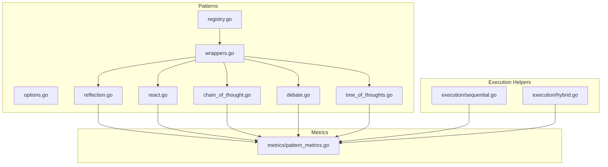
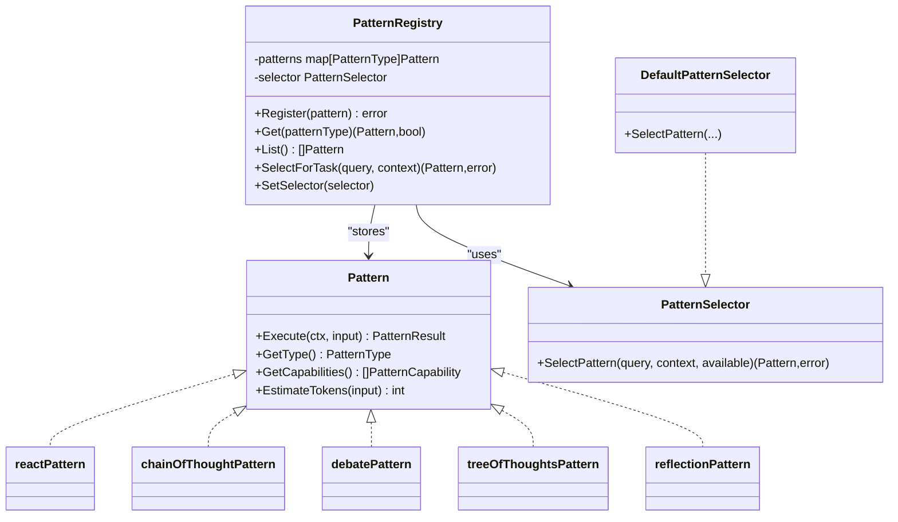
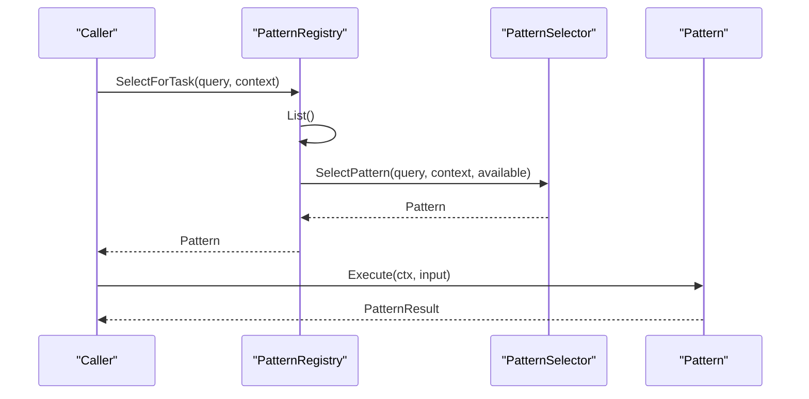
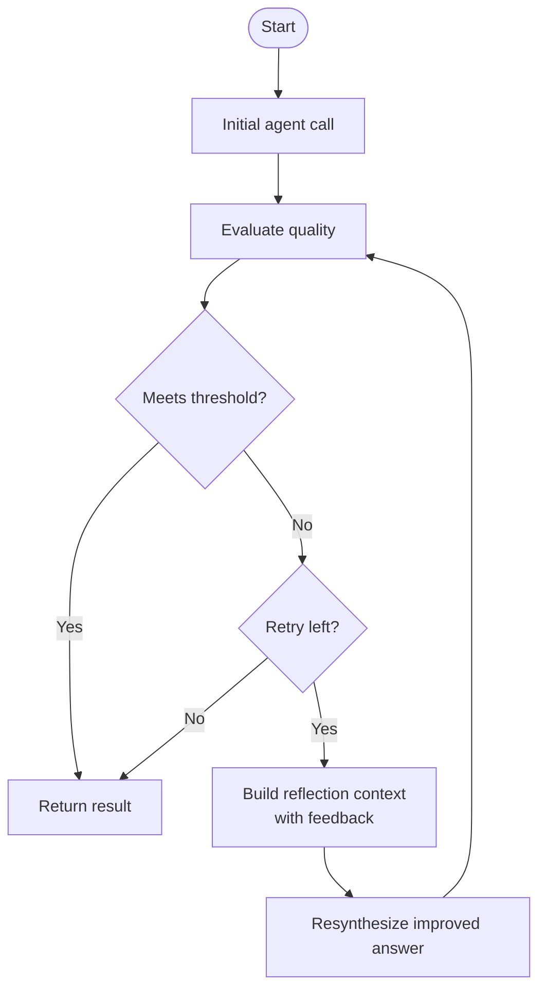
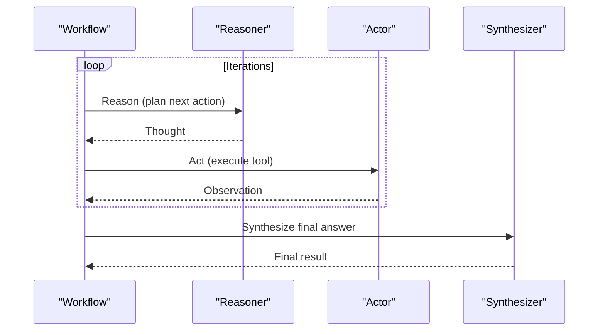
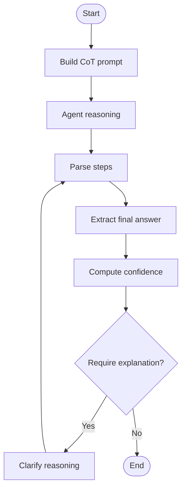
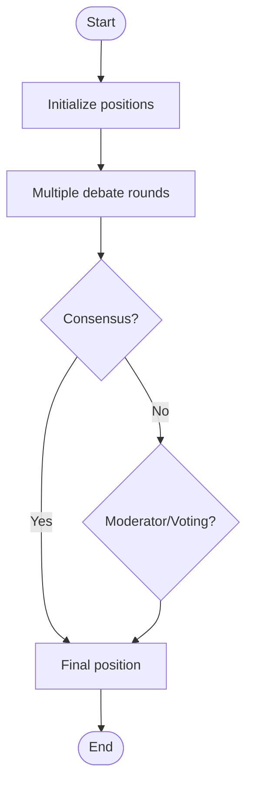
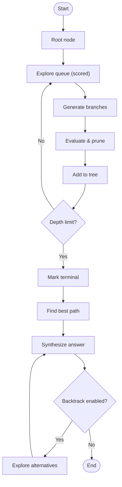
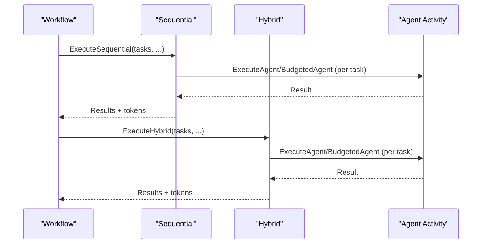
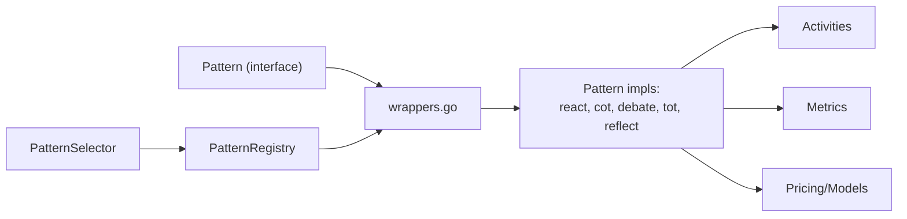

# Workflow Patterns

<cite>
**Referenced Files in This Document**
- [registry.go](file://go/orchestrator/internal/workflows/patterns/registry.go)
- [wrappers.go](file://go/orchestrator/internal/workflows/patterns/wrappers.go)
- [options.go](file://go/orchestrator/internal/workflows/patterns/options.go)
- [reflection.go](file://go/orchestrator/internal/workflows/patterns/reflection.go)
- [react.go](file://go/orchestrator/internal/workflows/patterns/react.go)
- [chain_of_thought.go](file://go/orchestrator/internal/workflows/patterns/chain_of_thought.go)
- [debate.go](file://go/orchestrator/internal/workflows/patterns/debate.go)
- [tree_of_thoughts.go](file://go/orchestrator/internal/workflows/patterns/tree_of_thoughts.go)
- [sequential.go](file://go/orchestrator/internal/workflows/patterns/execution/sequential.go)
- [hybrid.go](file://go/orchestrator/internal/workflows/patterns/execution/hybrid.go)
- [pattern_metrics.go](file://go/orchestrator/internal/workflows/metrics/pattern_metrics.go)
</cite>

## Table of Contents
1. [Introduction](#introduction)
2. [Project Structure](#project-structure)
3. [Core Components](#core-components)
4. [Architecture Overview](#architecture-overview)
5. [Detailed Component Analysis](#detailed-component-analysis)
6. [Dependency Analysis](#dependency-analysis)
7. [Performance Considerations](#performance-considerations)
8. [Troubleshooting Guide](#troubleshooting-guide)
9. [Conclusion](#conclusion)

## Introduction
This document explains the workflow patterns in Shannon’s multi-agent orchestration system. It covers the five core pattern types—reflection, react, chain of thought, debate, and tree of thoughts—detailing their capabilities, execution semantics, configuration, and integration with the broader orchestration framework. It also documents the Pattern interface, PatternInput structure, PatternResult format, the pattern registry and selection strategies, token estimation and cost optimization, and practical examples of how each pattern handles different problem domains.

## Project Structure
The workflow patterns live under the orchestrator’s Go module, organized by pattern type and execution helpers:
- Pattern definitions and registry: go/orchestrator/internal/workflows/patterns
- Execution helpers (sequential, hybrid): go/orchestrator/internal/workflows/patterns/execution
- Metrics: go/orchestrator/internal/workflows/metrics

**Diagram sources**
- [registry.go](file://go/orchestrator/internal/workflows/patterns/registry.go#L1-L190)
- [wrappers.go](file://go/orchestrator/internal/workflows/patterns/wrappers.go#L1-L264)
- [options.go](file://go/orchestrator/internal/workflows/patterns/options.go#L1-L21)
- [reflection.go](file://go/orchestrator/internal/workflows/patterns/reflection.go#L1-L170)
- [react.go](file://go/orchestrator/internal/workflows/patterns/react.go#L1-L905)
- [chain_of_thought.go](file://go/orchestrator/internal/workflows/patterns/chain_of_thought.go#L1-L433)
- [debate.go](file://go/orchestrator/internal/workflows/patterns/debate.go#L1-L644)
- [tree_of_thoughts.go](file://go/orchestrator/internal/workflows/patterns/tree_of_thoughts.go#L1-L631)
- [sequential.go](file://go/orchestrator/internal/workflows/patterns/execution/sequential.go#L1-L475)
- [hybrid.go](file://go/orchestrator/internal/workflows/patterns/execution/hybrid.go#L1-L408)
- [pattern_metrics.go](file://go/orchestrator/internal/workflows/metrics/pattern_metrics.go#L1-L94)

**Section sources**
- [registry.go](file://go/orchestrator/internal/workflows/patterns/registry.go#L1-L190)
- [wrappers.go](file://go/orchestrator/internal/workflows/patterns/wrappers.go#L1-L264)

## Core Components
- Pattern interface: Defines Execute, GetType, GetCapabilities, and EstimateTokens.
- PatternInput: Provides query, context, history, session/user identifiers, pattern-specific config, and a token budget cap.
- PatternResult: Aggregates final result text, total tokens used, confidence, metadata, and raw agent results.
- PatternRegistry: Central registry for pattern implementations, with a selector that chooses a pattern based on query/context and availability.
- PatternSelector: Strategy interface for selecting a pattern; default selector supports explicit hints and fallback to first available.
- Options: Shared execution options including per-agent budget, session/user IDs, model tier, and context.

These components enable pluggable, extensible pattern execution with standardized metrics and token accounting.

**Section sources**
- [registry.go](file://go/orchestrator/internal/workflows/patterns/registry.go#L35-L78)
- [registry.go](file://go/orchestrator/internal/workflows/patterns/registry.go#L85-L108)
- [registry.go](file://go/orchestrator/internal/workflows/patterns/registry.go#L110-L190)
- [options.go](file://go/orchestrator/internal/workflows/patterns/options.go#L3-L11)

## Architecture Overview
The orchestration integrates patterns through a thin wrapper that adapts each pattern implementation to the Pattern interface. The registry exposes a global registry and selection strategy. Patterns execute via Temporal workflows, invoking agent activities with optional token budgets and recording usage for observability.

**Diagram sources**
- [registry.go](file://go/orchestrator/internal/workflows/patterns/registry.go#L35-L108)
- [wrappers.go](file://go/orchestrator/internal/workflows/patterns/wrappers.go#L14-L264)

**Section sources**
- [registry.go](file://go/orchestrator/internal/workflows/patterns/registry.go#L71-L190)
- [wrappers.go](file://go/orchestrator/internal/workflows/patterns/wrappers.go#L14-L264)

## Detailed Component Analysis

### Pattern Interface and Types
- PatternType enumerates supported patterns: reflection, react, chain_of_thought, debate, tree_of_thoughts, ensemble.
- PatternCapability enumerates capabilities: iterative improvement, step-by-step, multi-perspective, conflict resolution, exploration, consensus building.
- PatternInput carries the query, contextual artifacts, history, session/user IDs, pattern-specific config, and a hard budget cap.
- PatternResult aggregates the final answer, total tokens, confidence, metadata, and raw agent results.

**Section sources**
- [registry.go](file://go/orchestrator/internal/workflows/patterns/registry.go#L11-L33)
- [registry.go](file://go/orchestrator/internal/workflows/patterns/registry.go#L50-L69)

### Pattern Registry and Selection
- Global registry initialized once and populated with default patterns.
- Registration adds implementations keyed by type; retrieval and listing support discovery.
- Selector chooses a pattern based on explicit hints in context or falls back to the first available.

**Diagram sources**
- [registry.go](file://go/orchestrator/internal/workflows/patterns/registry.go#L162-L177)
- [registry.go](file://go/orchestrator/internal/workflows/patterns/registry.go#L88-L108)

**Section sources**
- [registry.go](file://go/orchestrator/internal/workflows/patterns/registry.go#L110-L190)
- [registry.go](file://go/orchestrator/internal/workflows/patterns/registry.go#L162-L177)

### Reflection Pattern
- Purpose: Iterative improvement of an initial answer using evaluation and re-synthesis.
- Capabilities: iterative improvement.
- Execution:
  - Runs an initial agent to produce a candidate answer.
  - Evaluates quality against criteria and thresholds.
  - If below threshold, builds reflection context with feedback and synthesizes an improved result.
  - Records token usage for each phase.
- Configuration: Enabled flag, max retries, confidence threshold, evaluation criteria, timeout.
- Estimation: Heuristic budget based on input budget or default.

**Diagram sources**
- [reflection.go](file://go/orchestrator/internal/workflows/patterns/reflection.go#L20-L169)
- [wrappers.go](file://go/orchestrator/internal/workflows/patterns/wrappers.go#L143-L264)

**Section sources**
- [reflection.go](file://go/orchestrator/internal/workflows/patterns/reflection.go#L17-L169)
- [wrappers.go](file://go/orchestrator/internal/workflows/patterns/wrappers.go#L143-L157)

### React Pattern (Reason-Act-Observe)
- Purpose: Step-by-step problem solving with iterative reasoning, action execution, and observation.
- Capabilities: exploration, step-by-step.
- Execution:
  - Alternates between reasoning (think about next action), acting (execute tools), and observing (record outcomes).
  - Tracks thoughts, actions, and observations; enforces minimum iterations and convergence heuristics.
  - Supports budgeted execution per agent and token accounting.
  - Emits streaming events for progress and agent lifecycle.
- Configuration: Max/min iterations, observation window, limits on thoughts/actions/observations.
- Estimation: Heuristic budget based on input budget or default.

**Diagram sources**
- [react.go](file://go/orchestrator/internal/workflows/patterns/react.go#L47-L702)
- [wrappers.go](file://go/orchestrator/internal/workflows/patterns/wrappers.go#L14-L51)

**Section sources**
- [react.go](file://go/orchestrator/internal/workflows/patterns/react.go#L47-L702)
- [wrappers.go](file://go/orchestrator/internal/workflows/patterns/wrappers.go#L14-L29)

### Chain of Thought Pattern
- Purpose: Structured, step-by-step reasoning leading to a final answer.
- Capabilities: step-by-step.
- Execution:
  - Builds a structured prompt guiding stepwise reasoning.
  - Optionally requests clarification if confidence is low.
  - Parses reasoning steps and extracts final answer.
  - Estimates confidence based on structure and markers.
- Configuration: Max steps, requirement for explanations, delimiter, prompt template, model tier.
- Estimation: Heuristic budget based on input budget or default.

**Diagram sources**
- [chain_of_thought.go](file://go/orchestrator/internal/workflows/patterns/chain_of_thought.go#L36-L295)
- [wrappers.go](file://go/orchestrator/internal/workflows/patterns/wrappers.go#L53-L81)

**Section sources**
- [chain_of_thought.go](file://go/orchestrator/internal/workflows/patterns/chain_of_thought.go#L36-L295)
- [wrappers.go](file://go/orchestrator/internal/workflows/patterns/wrappers.go#L53-L67)

### Debate Pattern
- Purpose: Multi-perspective analysis with conflict resolution and consensus building.
- Capabilities: multi-perspective, conflict resolution, consensus building.
- Execution:
  - Initializes multiple debaters with perspectives.
  - Rounds of counter-arguments and position strengthening.
  - Optional moderator or voting to resolve positions.
  - Persists consensus for learning.
- Configuration: Number of debaters, max rounds, perspectives, consensus requirement, moderator/voting toggles, model tier.
- Estimation: Heuristic budget based on input budget or default.

**Diagram sources**
- [debate.go](file://go/orchestrator/internal/workflows/patterns/debate.go#L48-L473)
- [wrappers.go](file://go/orchestrator/internal/workflows/patterns/wrappers.go#L83-L111)

**Section sources**
- [debate.go](file://go/orchestrator/internal/workflows/patterns/debate.go#L48-L473)
- [wrappers.go](file://go/orchestrator/internal/workflows/patterns/wrappers.go#L83-L97)

### Tree of Thoughts Pattern
- Purpose: Systematic exploration of solution paths with pruning and backtracking.
- Capabilities: exploration.
- Execution:
  - Builds a tree of thoughts with branching factor and depth limits.
  - Generates child thoughts, evaluates and prunes low-scoring branches.
  - Finds best path and synthesizes a final answer with confidence.
  - Optional backtracking to higher-scoring alternatives.
- Configuration: Max depth, branching factor, evaluation method, pruning threshold, exploration budget, backtracking toggle, model tier.
- Estimation: Heuristic budget based on input budget or default.

**Diagram sources**
- [tree_of_thoughts.go](file://go/orchestrator/internal/workflows/patterns/tree_of_thoughts.go#L52-L235)
- [wrappers.go](file://go/orchestrator/internal/workflows/patterns/wrappers.go#L113-L141)

**Section sources**
- [tree_of_thoughts.go](file://go/orchestrator/internal/workflows/patterns/tree_of_thoughts.go#L52-L235)
- [wrappers.go](file://go/orchestrator/internal/workflows/patterns/wrappers.go#L113-L127)

### Pattern Execution Helpers
- Sequential execution: Executes tasks in order, optionally passing previous results and extracting numeric/tool outputs. Supports budgeted and non-budgeted modes with token recording.
- Hybrid execution: Manages dependencies among tasks, enabling parallelism up to a concurrency limit while respecting dependencies.

**Diagram sources**
- [sequential.go](file://go/orchestrator/internal/workflows/patterns/execution/sequential.go#L47-L395)
- [hybrid.go](file://go/orchestrator/internal/workflows/patterns/execution/hybrid.go#L45-L161)

**Section sources**
- [sequential.go](file://go/orchestrator/internal/workflows/patterns/execution/sequential.go#L47-L395)
- [hybrid.go](file://go/orchestrator/internal/workflows/patterns/execution/hybrid.go#L45-L161)

## Dependency Analysis
- Pattern implementations depend on:
  - Temporal SDK for workflow control and activities.
  - Activities for agent execution, evaluation, synthesis, token usage recording, and persistence.
  - Pricing and model detection utilities for token accounting.
  - Streaming utilities for progress and agent lifecycle events.
- Registry couples patterns to selection strategy and provides global access.
- Metrics are integrated across patterns for observability.

**Diagram sources**
- [registry.go](file://go/orchestrator/internal/workflows/patterns/registry.go#L35-L108)
- [wrappers.go](file://go/orchestrator/internal/workflows/patterns/wrappers.go#L14-L264)
- [pattern_metrics.go](file://go/orchestrator/internal/workflows/metrics/pattern_metrics.go#L1-L94)

**Section sources**
- [registry.go](file://go/orchestrator/internal/workflows/patterns/registry.go#L35-L108)
- [wrappers.go](file://go/orchestrator/internal/workflows/patterns/wrappers.go#L14-L264)

## Performance Considerations
- Token estimation: Each pattern wrapper provides a conservative estimate based on input budget or defaults. Use the EstimateTokens method to pre-provision budgets.
- Budgeted execution: Patterns support per-agent budget caps to constrain cost and improve predictability.
- Concurrency and dependencies: Use hybrid execution to parallelize independent tasks while respecting dependencies.
- Observability: Metrics track pattern executions, durations, agent counts, and token usage by pattern type.
- Reflection re-synthesis: Costs can increase with retries; tune thresholds and max retries to balance quality and cost.

[No sources needed since this section provides general guidance]

## Troubleshooting Guide
- Pattern selection:
  - Explicit hint: Provide a “pattern” key in context to force a specific pattern.
  - Fallback: If none available, the default selector returns the first registered pattern.
- Reflection:
  - If evaluation fails or thresholds are not met, the system falls back to the initial result.
  - Tune criteria, thresholds, and max retries to improve outcomes.
- React:
  - Completion heuristics may defer finishing until sufficient evidence or iterations; adjust MinIterations and research mode flags accordingly.
  - Early termination occurs on convergence or lack of new information; verify observation/action windows.
- Debate:
  - Consensus requires majority agreement; disable RequireConsensus or adjust perspectives.
  - Moderation/voting toggles change resolution behavior.
- Tree of Thoughts:
  - Pruning and backtracking influence cost and quality; adjust branching factor, depth, and thresholds.
- Token accounting:
  - When not using budgeted execution, token usage is recorded per step; verify model/provider inference and tier selection.

**Section sources**
- [registry.go](file://go/orchestrator/internal/workflows/patterns/registry.go#L88-L108)
- [reflection.go](file://go/orchestrator/internal/workflows/patterns/reflection.go#L20-L169)
- [react.go](file://go/orchestrator/internal/workflows/patterns/react.go#L255-L282)
- [debate.go](file://go/orchestrator/internal/workflows/patterns/debate.go#L400-L405)
- [tree_of_thoughts.go](file://go/orchestrator/internal/workflows/patterns/tree_of_thoughts.go#L164-L189)

## Conclusion
Shannon’s workflow patterns provide a flexible, extensible framework for multi-agent orchestration. The Pattern interface and registry enable easy addition of new patterns, while wrappers adapt implementations to a common contract. Built-in capabilities, token estimation, budgeting, and metrics support robust, cost-conscious deployments across diverse problem domains—from iterative refinement to multi-perspective debate and systematic exploration.