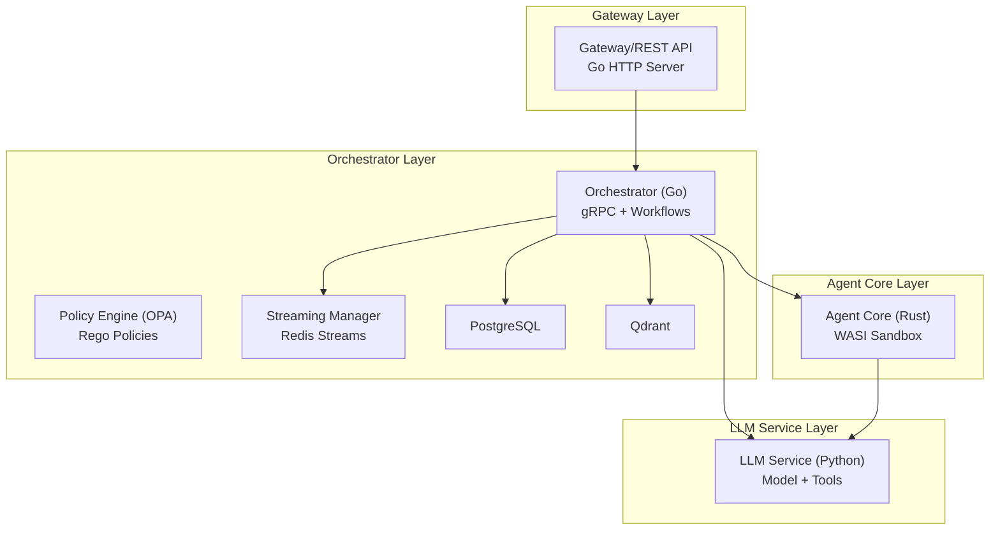
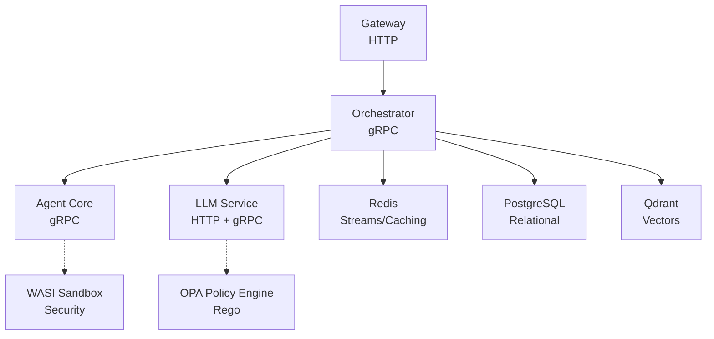
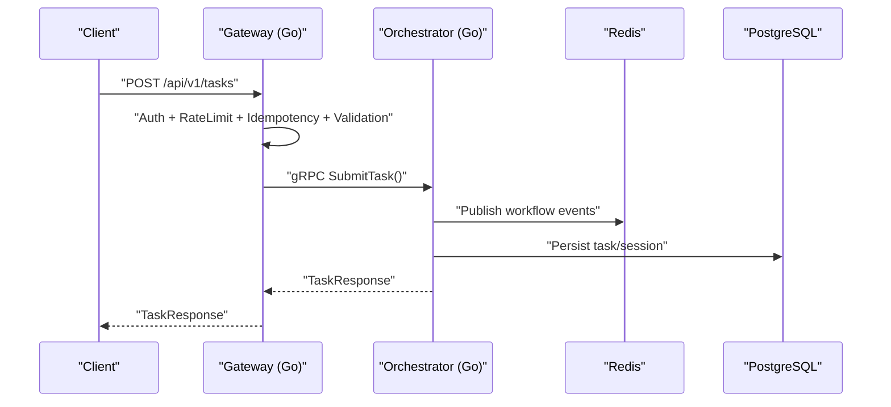
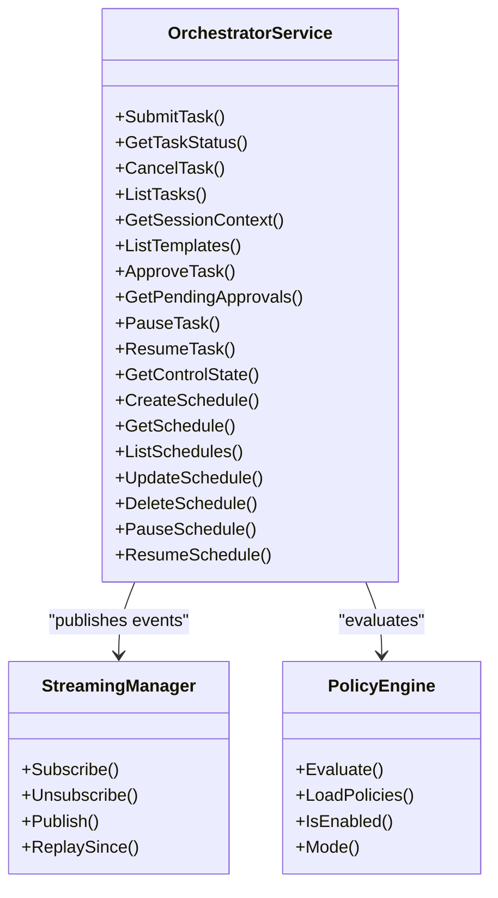
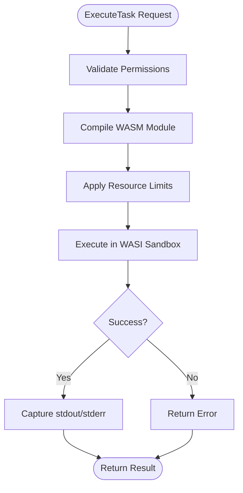
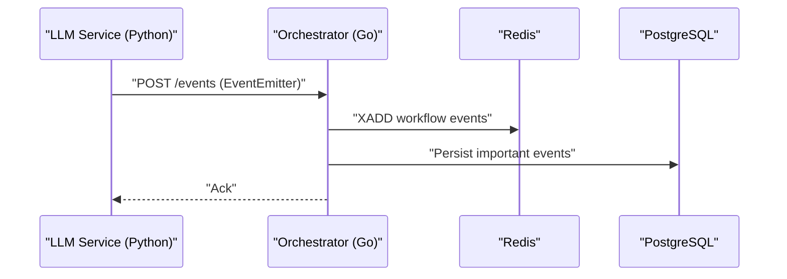
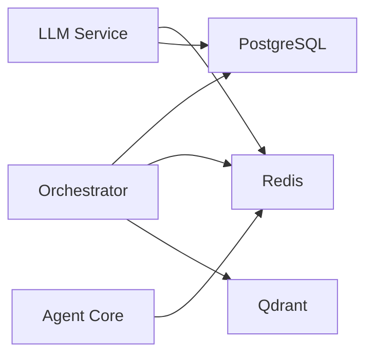
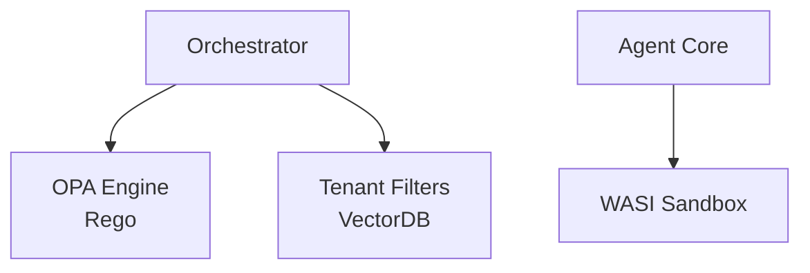
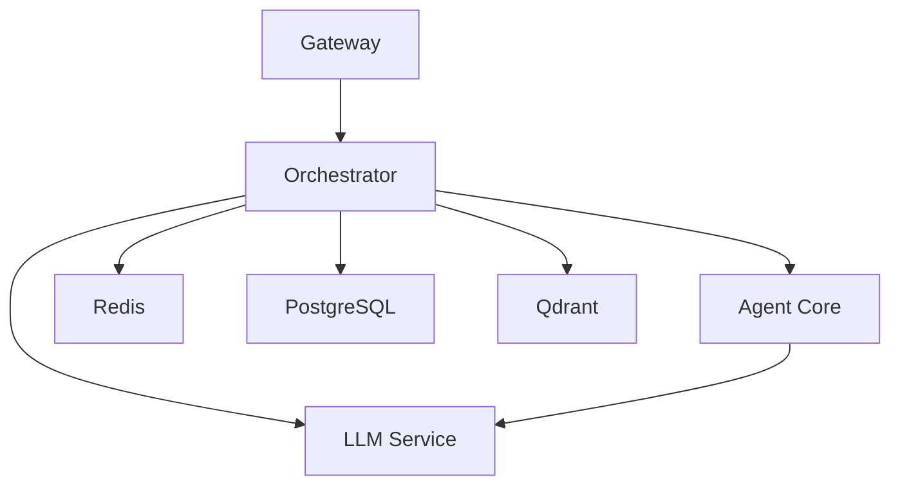

# Architecture Overview

<cite>
**Referenced Files in This Document**
- [main.go](file://go/orchestrator/main.go)
- [main.go](file://go/orchestrator/cmd/gateway/main.go)
- [main.rs](file://rust/agent-core/src/main.rs)
- [main.py](file://python/llm-service/main.py)
- [shannon.yaml](file://config/shannon.yaml)
- [docker-compose.yml](file://deploy/compose/docker-compose.yml)
- [orchestrator.proto](file://protos/orchestrator/orchestrator.proto)
- [agent.proto](file://protos/agent/agent.proto)
- [engine.go](file://go/orchestrator/internal/policy/engine.go)
- [base.rego](file://config/opa/policies/base.rego)
- [wasi_sandbox.rs](file://rust/agent-core/src/wasi_sandbox.rs)
- [manager.go](file://go/orchestrator/internal/streaming/manager.go)
- [client.go](file://go/orchestrator/internal/db/client.go)
- [client.go](file://go/orchestrator/internal/vectordb/client.go)
</cite>

## Table of Contents
1. [Introduction](#introduction)
2. [Project Structure](#project-structure)
3. [Core Components](#core-components)
4. [Architecture Overview](#architecture-overview)
5. [Detailed Component Analysis](#detailed-component-analysis)
6. [Dependency Analysis](#dependency-analysis)
7. [Performance Considerations](#performance-considerations)
8. [Troubleshooting Guide](#troubleshooting-guide)
9. [Conclusion](#conclusion)

## Introduction
This document presents the Shannon architecture overview, focusing on the multi-service system design and component relationships. The platform follows a microservices architecture with four primary layers:
- Gateway/REST API: HTTP entry point for clients and OpenAI-compatible endpoints
- Orchestrator (Go): Central workflow orchestration, policy enforcement, and service coordination
- Agent Core (Rust): Secure execution environment for agent tasks with WASI sandboxing
- LLM Service (Python): Model integration, tool execution, and streaming APIs

Inter-service communication leverages gRPC for strongly-typed RPC and Redis Streams for event streaming. Data persistence integrates PostgreSQL, Redis, and Qdrant for relational, caching, and vector operations respectively. Security is enforced through WASI sandbox isolation, Open Policy Agent (OPA) policy evaluation, and multi-tenant separation.

## Project Structure
The repository organizes functionality by language and responsibility:
- go/orchestrator: Orchestrator service, workflows, policy, streaming, and database integrations
- rust/agent-core: Agent execution service with WASI sandbox
- python/llm-service: LLM integration, tool execution, and event emission
- protos: Protocol buffers defining service contracts
- config: Runtime configuration, OPA policies, and feature flags
- deploy/compose: Docker Compose deployment with PostgreSQL, Redis, Qdrant, and services

**Diagram sources**
- [main.go](file://go/orchestrator/cmd/gateway/main.go#L30-L639)
- [main.go](file://go/orchestrator/main.go#L49-L800)
- [main.rs](file://rust/agent-core/src/main.rs#L10-L54)
- [main.py](file://python/llm-service/main.py#L1-L164)
- [docker-compose.yml](file://deploy/compose/docker-compose.yml#L14-L411)

**Section sources**
- [docker-compose.yml](file://deploy/compose/docker-compose.yml#L14-L411)
- [shannon.yaml](file://config/shannon.yaml#L1-L378)

## Core Components
- Gateway/REST API (Go): Provides HTTP endpoints for authentication, task submission, sessions, schedules, and OpenAI-compatible chat completions. It proxies streaming endpoints to the Orchestrator’s admin server and enforces rate limiting, idempotency, and validation.
- Orchestrator (Go): Implements gRPC services for task orchestration, session management, approvals, scheduling, and streaming. It coordinates workflows via Temporal, enforces policies, manages streaming events, and integrates with PostgreSQL, Redis, and Qdrant.
- Agent Core (Rust): Executes agent tasks securely using WASI sandboxing, enforcing memory, CPU, and filesystem constraints. It exposes gRPC services for task execution and tool discovery.
- LLM Service (Python): Integrates with external model providers, executes tools, emits events, and supports streaming. It interacts with PostgreSQL, Redis, and Qdrant for persistence and retrieval.

**Section sources**
- [main.go](file://go/orchestrator/cmd/gateway/main.go#L30-L639)
- [main.go](file://go/orchestrator/main.go#L49-L800)
- [main.rs](file://rust/agent-core/src/main.rs#L10-L54)
- [main.py](file://python/llm-service/main.py#L1-L164)

## Architecture Overview
Shannon employs a microservices architecture with clear service boundaries and asynchronous event streaming:
- Inter-service communication:
  - gRPC for typed, reliable RPC between Gateway, Orchestrator, Agent Core, and LLM Service
  - Redis Streams for event streaming and replay
- Data layer:
  - PostgreSQL for relational persistence and audit trails
  - Redis for caching, rate limiting, and streaming event buffering
  - Qdrant for vector similarity search and semantic retrieval
- Security:
  - WASI sandbox isolation for agent execution
  - OPA-based policy enforcement with configurable modes (off/dry-run/enforce)
  - Multi-tenant separation via tenant-aware filters and configuration

**Diagram sources**
- [orchestrator.proto](file://protos/orchestrator/orchestrator.proto#L10-L36)
- [agent.proto](file://protos/agent/agent.proto#L10-L17)
- [manager.go](file://go/orchestrator/internal/streaming/manager.go#L142-L440)
- [client.go](file://go/orchestrator/internal/db/client.go#L80-L146)
- [client.go](file://go/orchestrator/internal/vectordb/client.go#L19-L54)
- [engine.go](file://go/orchestrator/internal/policy/engine.go#L85-L115)

## Detailed Component Analysis

### Gateway/REST API
The Gateway provides:
- Authentication endpoints (register/login/refresh)
- Task lifecycle endpoints (submit, list, get, cancel, pause/resume)
- Session management (list, get, history, events)
- Scheduling endpoints (CRUD and pause/resume)
- OpenAI-compatible chat completions and model listings
- Streaming proxies for SSE and WebSocket
- Middleware for auth, rate limiting, idempotency, validation, and tracing

**Diagram sources**
- [main.go](file://go/orchestrator/cmd/gateway/main.go#L186-L213)
- [main.go](file://go/orchestrator/cmd/gateway/main.go#L540-L600)

**Section sources**
- [main.go](file://go/orchestrator/cmd/gateway/main.go#L30-L639)

### Orchestrator (Go)
Key responsibilities:
- gRPC services for task orchestration, sessions, approvals, and scheduling
- Workflow execution via Temporal workers
- Policy evaluation using OPA
- Streaming event management via Redis Streams
- Data access through PostgreSQL and Qdrant

**Diagram sources**
- [orchestrator.proto](file://protos/orchestrator/orchestrator.proto#L10-L36)
- [manager.go](file://go/orchestrator/internal/streaming/manager.go#L36-L60)
- [engine.go](file://go/orchestrator/internal/policy/engine.go#L21-L30)

**Section sources**
- [main.go](file://go/orchestrator/main.go#L368-L394)
- [engine.go](file://go/orchestrator/internal/policy/engine.go#L85-L115)
- [manager.go](file://go/orchestrator/internal/streaming/manager.go#L36-L60)

### Agent Core (Rust)
Agent Core provides secure execution:
- gRPC service for task execution and tool discovery
- WASI sandbox with memory, CPU, and filesystem constraints
- Metrics and health checks

**Diagram sources**
- [wasi_sandbox.rs](file://rust/agent-core/src/wasi_sandbox.rs#L124-L433)

**Section sources**
- [main.rs](file://rust/agent-core/src/main.rs#L10-L54)
- [wasi_sandbox.rs](file://rust/agent-core/src/wasi_sandbox.rs#L15-L72)

### LLM Service (Python)
LLM Service:
- FastAPI application exposing health, completions, embeddings, tools, and providers
- Event emission to Orchestrator’s event ingestion endpoint
- Provider integration and tool execution
- Prometheus metrics and OpenTelemetry tracing

**Diagram sources**
- [main.py](file://python/llm-service/main.py#L71-L114)
- [manager.go](file://go/orchestrator/internal/streaming/manager.go#L364-L440)

**Section sources**
- [main.py](file://python/llm-service/main.py#L1-L164)

### Data Layer Integration
- PostgreSQL: Relational persistence, audit logs, and relational queries
- Redis: Caching, rate limiting, idempotency keys, and streaming event buffering
- Qdrant: Vector similarity search for semantic retrieval and embeddings

**Diagram sources**
- [client.go](file://go/orchestrator/internal/db/client.go#L80-L146)
- [client.go](file://go/orchestrator/internal/vectordb/client.go#L19-L54)
- [docker-compose.yml](file://deploy/compose/docker-compose.yml#L41-L94)

**Section sources**
- [client.go](file://go/orchestrator/internal/db/client.go#L80-L146)
- [client.go](file://go/orchestrator/internal/vectordb/client.go#L19-L54)

### Security Architecture
- WASI Sandbox: Enforces memory, CPU, and filesystem constraints for agent execution
- OPA Policy Engine: Evaluates policy decisions with configurable modes and canary rollouts
- Multi-tenant Separation: Tenant-aware filters and configuration for vector searches

**Diagram sources**
- [engine.go](file://go/orchestrator/internal/policy/engine.go#L85-L115)
- [wasi_sandbox.rs](file://rust/agent-core/src/wasi_sandbox.rs#L15-L72)
- [client.go](file://go/orchestrator/internal/vectordb/client.go#L232-L304)

**Section sources**
- [engine.go](file://go/orchestrator/internal/policy/engine.go#L85-L115)
- [base.rego](file://config/opa/policies/base.rego#L1-L272)
- [wasi_sandbox.rs](file://rust/agent-core/src/wasi_sandbox.rs#L15-L72)

## Dependency Analysis
Service dependencies and communication patterns:
- Gateway depends on Orchestrator’s gRPC and Redis for streaming
- Orchestrator depends on Agent Core and LLM Service via gRPC
- Orchestrator depends on Redis for streaming and caching, PostgreSQL for persistence, and Qdrant for vectors
- Agent Core depends on Redis for rate limiting and LLM Service for model execution
- LLM Service depends on Redis and PostgreSQL for persistence and Qdrant for embeddings

**Diagram sources**
- [main.go](file://go/orchestrator/cmd/gateway/main.go#L97-L108)
- [main.go](file://go/orchestrator/main.go#L472-L597)
- [docker-compose.yml](file://deploy/compose/docker-compose.yml#L14-L411)

**Section sources**
- [main.go](file://go/orchestrator/cmd/gateway/main.go#L97-L108)
- [main.go](file://go/orchestrator/main.go#L472-L597)

## Performance Considerations
- Asynchronous event streaming: Redis Streams decouples producers from consumers, reducing latency and improving throughput
- Circuit breakers: Database and HTTP wrappers protect downstream systems under load
- Batching and backpressure: PostgreSQL write queue and batch sizes minimize contention
- Vector search optimization: Qdrant with MMR and configurable thresholds balances relevance and diversity
- Multi-tenant isolation: Tenant-aware filters prevent cross-tenant data leakage and reduce query complexity

[No sources needed since this section provides general guidance]

## Troubleshooting Guide
Common operational issues and diagnostics:
- Health checks: Use Orchestrator’s health endpoints and service-specific health probes
- Streaming issues: Inspect Redis Streams keys and event replay capabilities
- Database connectivity: Monitor PostgreSQL connection pool and circuit breaker status
- Policy evaluation: Review OPA policy loading and decision logs
- WASI sandbox failures: Validate module size/format and resource limits

**Section sources**
- [main.go](file://go/orchestrator/main.go#L119-L150)
- [manager.go](file://go/orchestrator/internal/streaming/manager.go#L180-L321)
- [client.go](file://go/orchestrator/internal/db/client.go#L394-L410)
- [engine.go](file://go/orchestrator/internal/policy/engine.go#L117-L195)

## Conclusion
Shannon’s architecture balances modularity, scalability, and security through a microservices design with clear service boundaries. gRPC and Redis Streams enable efficient inter-service communication and event-driven workflows. The combination of WASI sandboxing, OPA policy enforcement, and multi-tenant separation ensures robust security and compliance. The data layer integrates PostgreSQL, Redis, and Qdrant to support diverse workloads from relational persistence to vector similarity search.