# Comparison with Alternatives

<cite>
**Referenced Files in This Document**
- [features.yaml](file://config/features.yaml)
- [models.yaml](file://config/models.yaml)
- [research_strategies.yaml](file://config/research_strategies.yaml)
- [market_analysis.yaml](file://config/workflows/examples/market_analysis.yaml)
- [research_summary.yaml](file://config/workflows/examples/research_summary.yaml)
- [base.rego](file://config/opa/policies/base.rego)
- [engine.go](file://go/orchestrator/internal/policy/engine.go)
- [manager.go](file://go/orchestrator/internal/schedules/manager.go)
- [main.rs](file://desktop/src-tauri/src/main.rs)
- [package.json](file://desktop/package.json)
- [page.tsx](file://desktop/app/(app)/agents/page.tsx)
- [manager.go](file://go/orchestrator/internal/session/manager.go)
- [session.go](file://go/orchestrator/internal/activities/session.go)
- [simple_workflow.go](file://go/orchestrator/internal/workflows/simple_workflow.go)
- [supervisor_workflow.go](file://go/orchestrator/internal/workflows/supervisor_workflow.go)
</cite>

## Table of Contents
1. [Introduction](#introduction)
2. [Project Structure](#project-structure)
3. [Core Components](#core-components)
4. [Architecture Overview](#architecture-overview)
5. [Detailed Component Analysis](#detailed-component-analysis)
6. [Dependency Analysis](#dependency-analysis)
7. [Performance Considerations](#performance-considerations)
8. [Troubleshooting Guide](#troubleshooting-guide)
9. [Conclusion](#conclusion)
10. [Appendices](#appendices)

## Introduction
This document provides a comprehensive competitive comparison between Shannon and leading AI agent frameworks (LangGraph, Dify, AutoGen, CrewAI). It focuses on Shannon’s differentiated capabilities across scheduled tasks, research workflows, deterministic replay, token budget limits, security sandbox, OPA policy control, production metrics, native desktop apps, multi-language core, session persistence, and multi-agent orchestration. It includes quantitative feature matrices, limitations, and migration guidance to help teams choose Shannon when use cases align with its strengths.

## Project Structure
Shannon’s comparative advantages are implemented across configuration-driven features, policy enforcement, scheduling, session persistence, desktop application, and workflow orchestration. The following diagram maps key areas leveraged in this comparison.

**Diagram sources**
- [features.yaml](file://config/features.yaml#L1-L270)
- [models.yaml](file://config/models.yaml#L1-L776)
- [research_strategies.yaml](file://config/research_strategies.yaml#L1-L53)
- [market_analysis.yaml](file://config/workflows/examples/market_analysis.yaml#L1-L76)
- [research_summary.yaml](file://config/workflows/examples/research_summary.yaml#L1-L37)
- [base.rego](file://config/opa/policies/base.rego#L1-L272)
- [engine.go](file://go/orchestrator/internal/policy/engine.go#L1-L748)
- [manager.go](file://go/orchestrator/internal/schedules/manager.go#L1-L532)
- [main.rs](file://desktop/src-tauri/src/main.rs#L1-L7)
- [package.json](file://desktop/package.json#L1-L62)
- [page.tsx](file://desktop/app/(app)/agents/page.tsx#L1-L114)
- [manager.go](file://go/orchestrator/internal/session/manager.go#L1-L475)
- [session.go](file://go/orchestrator/internal/activities/session.go#L1-L146)
- [simple_workflow.go](file://go/orchestrator/internal/workflows/simple_workflow.go#L1-L712)
- [supervisor_workflow.go](file://go/orchestrator/internal/workflows/supervisor_workflow.go#L1-L800)

**Section sources**
- [features.yaml](file://config/features.yaml#L1-L270)
- [models.yaml](file://config/models.yaml#L1-L776)
- [research_strategies.yaml](file://config/research_strategies.yaml#L1-L53)
- [market_analysis.yaml](file://config/workflows/examples/market_analysis.yaml#L1-L76)
- [research_summary.yaml](file://config/workflows/examples/research_summary.yaml#L1-L37)
- [base.rego](file://config/opa/policies/base.rego#L1-L272)
- [engine.go](file://go/orchestrator/internal/policy/engine.go#L1-L748)
- [manager.go](file://go/orchestrator/internal/schedules/manager.go#L1-L532)
- [main.rs](file://desktop/src-tauri/src/main.rs#L1-L7)
- [package.json](file://desktop/package.json#L1-L62)
- [page.tsx](file://desktop/app/(app)/agents/page.tsx#L1-L114)
- [manager.go](file://go/orchestrator/internal/session/manager.go#L1-L475)
- [session.go](file://go/orchestrator/internal/activities/session.go#L1-L146)
- [simple_workflow.go](file://go/orchestrator/internal/workflows/simple_workflow.go#L1-L712)
- [supervisor_workflow.go](file://go/orchestrator/internal/workflows/supervisor_workflow.go#L1-L800)

## Core Components
This section highlights Shannon’s competitive differentiators and quantifies capabilities grounded in configuration and implementation.

- Scheduled Tasks
  - Cron-based scheduling with Temporal, budget enforcement per run, per-user limits, and timezone-aware execution.
  - Limits: maximum schedules per user, minimum interval enforcement, per-run budget cap.
  - Deterministic replay: per-execution workflow IDs derived from schedule IDs plus timestamps.

- Research Workflows
  - Tiered model selection (small/medium/large) with cost optimization and strategy-driven decomposition.
  - Strategies: quick, standard, deep, academic with configurable concurrency and iteration limits.
  - DAG workflows and supervisor orchestration for multi-agent synthesis.

- Deterministic Replay
  - Workflow IDs and per-execution identifiers enable deterministic replay and event history reconstruction.
  - Control signals and pause/resume/cancel support for deterministic control.

- Token Budget Limits
  - Centralized pricing, per-request and daily budget caps, per-agent budget hints, and token usage tracking.
  - Budget enforcement integrated with policy engine and workflows.

- Security Sandbox
  - OPA-based policy engine with allow/deny rules, environment-aware enforcement, and canary rollouts.
  - Input validation, output filtering, and rate limiting.

- OPA Policy Control
  - Rego policies with decision caching, dry-run enforcement, and emergency kill switches.
  - Vector-enhanced inputs and audit tagging for policy decisions.

- Production Metrics
  - Prometheus metrics, OpenTelemetry tracing, health checks, and policy load/version tracking.
  - Session token usage, cost aggregation, and error/performance monitoring.

- Native Desktop Apps
  - Tauri-based desktop app with Next.js frontend, Redux/Zustand state management, and platform-specific builds.

- Multi-Language Core
  - Go orchestrator, Rust agent core, Python LLM service, and TypeScript/React desktop app.
  - WASM sandbox for secure tool execution.

- Session Persistence
  - Redis-backed session manager with local cache, tenant isolation, and LRU eviction.
  - Automatic context compression and summary injection for long conversations.

- Multi-Agent Orchestration
  - Supervisor workflow with dynamic team recruitment/retirement, mailbox signaling, and P2P coordination.
  - DAG and parallel execution patterns with dependency synchronization.

**Section sources**
- [manager.go](file://go/orchestrator/internal/schedules/manager.go#L1-L532)
- [engine.go](file://go/orchestrator/internal/policy/engine.go#L1-L748)
- [base.rego](file://config/opa/policies/base.rego#L1-L272)
- [models.yaml](file://config/models.yaml#L1-L776)
- [research_strategies.yaml](file://config/research_strategies.yaml#L1-L53)
- [market_analysis.yaml](file://config/workflows/examples/market_analysis.yaml#L1-L76)
- [research_summary.yaml](file://config/workflows/examples/research_summary.yaml#L1-L37)
- [simple_workflow.go](file://go/orchestrator/internal/workflows/simple_workflow.go#L1-L712)
- [supervisor_workflow.go](file://go/orchestrator/internal/workflows/supervisor_workflow.go#L1-L800)
- [manager.go](file://go/orchestrator/internal/session/manager.go#L1-L475)
- [session.go](file://go/orchestrator/internal/activities/session.go#L1-L146)
- [main.rs](file://desktop/src-tauri/src/main.rs#L1-L7)
- [package.json](file://desktop/package.json#L1-L62)
- [page.tsx](file://desktop/app/(app)/agents/page.tsx#L1-L114)

## Architecture Overview
The following diagram shows how Shannon’s scheduling, policy, session, and workflow layers integrate with desktop and orchestration services.

**Diagram sources**
- [manager.go](file://go/orchestrator/internal/schedules/manager.go#L1-L532)
- [engine.go](file://go/orchestrator/internal/policy/engine.go#L1-L748)
- [manager.go](file://go/orchestrator/internal/session/manager.go#L1-L475)
- [simple_workflow.go](file://go/orchestrator/internal/workflows/simple_workflow.go#L1-L712)
- [supervisor_workflow.go](file://go/orchestrator/internal/workflows/supervisor_workflow.go#L1-L800)
- [main.rs](file://desktop/src-tauri/src/main.rs#L1-L7)

## Detailed Component Analysis

### Scheduled Tasks
- Capabilities
  - Cron expressions with minimum interval enforcement and per-user schedule limits.
  - Budget caps per run, timezone support, and Temporal schedule lifecycle management.
  - Deterministic per-execution workflow IDs for replay.
- Quantitative
  - Max schedules per user, minimum interval minutes, max budget per run USD.
  - Next-run calculation and authoritative time from Temporal.
- Limitations
  - Requires Temporal; cron parsing strictness enforces minimum intervals.
- Migration Notes
  - Replace cron-based scheduling with Temporal equivalents; map budget caps and timeouts.

**Diagram sources**
- [manager.go](file://go/orchestrator/internal/schedules/manager.go#L54-L169)

**Section sources**
- [manager.go](file://go/orchestrator/internal/schedules/manager.go#L1-L532)

### Research Workflows and Model Tiering
- Capabilities
  - Strategy-driven decomposition (quick, standard, deep, academic) with concurrency and iteration limits.
  - Tiered model selection (small/medium/large) with cost controls and per-request/token caps.
  - DAG workflows and supervisor orchestration with dynamic team management.
- Quantitative
  - Complexity thresholds for model tier selection; per-agent budget hints; token budget enforcement.
  - Strategy budgets and agent model tiers.
- Limitations
  - Strategy budgets and agent model tiers are configured; runtime overrides depend on caller context.
- Migration Notes
  - Map strategy configurations to framework-specific decomposition; align model tier thresholds.

**Diagram sources**
- [research_strategies.yaml](file://config/research_strategies.yaml#L12-L53)
- [models.yaml](file://config/models.yaml#L16-L120)
- [simple_workflow.go](file://go/orchestrator/internal/workflows/simple_workflow.go#L666-L712)
- [supervisor_workflow.go](file://go/orchestrator/internal/workflows/supervisor_workflow.go#L420-L454)

**Section sources**
- [research_strategies.yaml](file://config/research_strategies.yaml#L1-L53)
- [models.yaml](file://config/models.yaml#L1-L776)
- [simple_workflow.go](file://go/orchestrator/internal/workflows/simple_workflow.go#L1-L712)
- [supervisor_workflow.go](file://go/orchestrator/internal/workflows/supervisor_workflow.go#L1-L800)

### Deterministic Replay
- Capabilities
  - Per-execution workflow IDs derived from schedule IDs plus timestamps.
  - Control signals for pause/resume/cancel; event streaming for replayable timelines.
- Quantitative
  - Workflow IDs preserved across child workflows; event emission for deterministic reconstruction.
- Limitations
  - Determinism depends on version-gated features and consistent context serialization.
- Migration Notes
  - Preserve workflow IDs and event streams; adapt control signals to framework equivalents.

**Diagram sources**
- [supervisor_workflow.go](file://go/orchestrator/internal/workflows/supervisor_workflow.go#L256-L277)

**Section sources**
- [supervisor_workflow.go](file://go/orchestrator/internal/workflows/supervisor_workflow.go#L1-L800)

### Token Budget Limits
- Capabilities
  - Centralized pricing, per-request and daily budget caps, per-agent budget hints.
  - Token usage tracking and cost aggregation per session and activity.
- Quantitative
  - Max cost per request, max tokens per request, daily budget USD; per-agent budget hints.
- Limitations
  - Budget enforcement relies on policy engine and workflow integration.
- Migration Notes
  - Integrate budget checks before tool/model calls; map daily and per-request caps.

**Diagram sources**
- [models.yaml](file://config/models.yaml#L124-L129)
- [session.go](file://go/orchestrator/internal/activities/session.go#L16-L142)

**Section sources**
- [models.yaml](file://config/models.yaml#L124-L129)
- [session.go](file://go/orchestrator/internal/activities/session.go#L1-L146)

### Security Sandbox and OPA Policy Control
- Capabilities
  - OPA Rego policies with allow/deny rules, environment-aware enforcement, and canary rollouts.
  - Decision caching, dry-run mode, emergency kill switch, and audit tagging.
- Quantitative
  - Max token budgets per mode, system limits, and policy load/version tracking.
- Limitations
  - Policies must be loaded; fail-closed/fail-open behavior depends on configuration.
- Migration Notes
  - Translate framework-specific authorization to OPA modules; map environments and canary rules.

**Diagram sources**
- [engine.go](file://go/orchestrator/internal/policy/engine.go#L197-L282)
- [base.rego](file://config/opa/policies/base.rego#L1-L272)

**Section sources**
- [engine.go](file://go/orchestrator/internal/policy/engine.go#L1-L748)
- [base.rego](file://config/opa/policies/base.rego#L1-L272)

### Production Metrics
- Capabilities
  - Prometheus metrics, OpenTelemetry tracing, health checks, and policy load/version tracking.
  - Session token usage, cost aggregation, and error/performance monitoring.
- Quantitative
  - Metrics export interval, cost tracking, performance tracking, error tracking.
- Limitations
  - Metrics depend on exporters and dashboards; observability requires deployment configuration.
- Migration Notes
  - Wire Prometheus endpoints and OpenTelemetry collectors; map counters and histograms.

**Diagram sources**
- [engine.go](file://go/orchestrator/internal/policy/engine.go#L609-L656)
- [models.yaml](file://config/models.yaml#L764-L776)
- [session.go](file://go/orchestrator/internal/activities/session.go#L78-L80)

**Section sources**
- [engine.go](file://go/orchestrator/internal/policy/engine.go#L609-L656)
- [models.yaml](file://config/models.yaml#L764-L776)
- [session.go](file://go/orchestrator/internal/activities/session.go#L78-L80)

### Native Desktop Apps
- Capabilities
  - Tauri-based desktop app with Next.js frontend, Redux/Zustand state management, and platform builds.
  - Agent selection UI and run detail navigation.
- Quantitative
  - Dependencies include Tauri APIs, shell plugin, and UI libraries.
- Limitations
  - Desktop app is separate from core; integration depends on API exposure.
- Migration Notes
  - Repurpose UI components and state management patterns; expose APIs consumed by desktop.

**Diagram sources**
- [page.tsx](file://desktop/app/(app)/agents/page.tsx#L1-L114)
- [main.rs](file://desktop/src-tauri/src/main.rs#L1-L7)
- [package.json](file://desktop/package.json#L14-L46)

**Section sources**
- [page.tsx](file://desktop/app/(app)/agents/page.tsx#L1-L114)
- [main.rs](file://desktop/src-tauri/src/main.rs#L1-L7)
- [package.json](file://desktop/package.json#L1-L62)

### Multi-Language Core
- Capabilities
  - Go orchestrator, Rust agent core, Python LLM service, and TypeScript/React desktop app.
  - WASM sandbox for secure tool execution.
- Quantitative
  - WASM runtime configuration and sandbox enforcement.
- Limitations
  - Cross-language integration requires careful serialization and error handling.
- Migration Notes
  - Align tool registries and sandbox policies across languages; unify error reporting.

**Diagram sources**
- [features.yaml](file://config/features.yaml#L27-L42)
- [main.rs](file://desktop/src-tauri/src/main.rs#L1-L7)

**Section sources**
- [features.yaml](file://config/features.yaml#L27-L42)
- [main.rs](file://desktop/src-tauri/src/main.rs#L1-L7)

### Session Persistence
- Capabilities
  - Redis-backed session manager with local cache, tenant isolation, and LRU eviction.
  - Automatic context compression and summary injection for long conversations.
- Quantitative
  - Max history per session, TTL, cache size, and eviction metrics.
- Limitations
  - Tenant isolation depends on auth context; cache size impacts latency.
- Migration Notes
  - Replace session stores with framework-native persistence; preserve context compression.

**Diagram sources**
- [manager.go](file://go/orchestrator/internal/session/manager.go#L186-L243)

**Section sources**
- [manager.go](file://go/orchestrator/internal/session/manager.go#L1-L475)
- [session.go](file://go/orchestrator/internal/activities/session.go#L1-L146)

### Multi-Agent Orchestration
- Capabilities
  - Supervisor workflow with dynamic team recruitment/retirement, mailbox signaling, and P2P coordination.
  - DAG and parallel execution patterns with dependency synchronization.
- Quantitative
  - Max agents per workflow, parallel execution, and dependency topics.
- Limitations
  - P2P coordination depends on configuration and workspace entries.
- Migration Notes
  - Map supervisor/team concepts to framework equivalents; adapt signaling and dependency handling.

**Diagram sources**
- [supervisor_workflow.go](file://go/orchestrator/internal/workflows/supervisor_workflow.go#L208-L310)
- [supervisor_workflow.go](file://go/orchestrator/internal/workflows/supervisor_workflow.go#L642-L763)

**Section sources**
- [supervisor_workflow.go](file://go/orchestrator/internal/workflows/supervisor_workflow.go#L1-L800)

## Dependency Analysis
The following diagram shows key dependencies among components used in this comparison.

```mermaid
graph TB
SCH["Schedule Manager"] --> TEMP["Temporal"]
POL["Policy Engine"] --> OPA["Rego Policies"]
WF["Workflows"] --> ACT["Activities"]
ACT --> DB["Postgres/Redis/Qdrant"]
SESS["Session Manager"] --> REDIS["Redis"]
DESK["Desktop App"] --> Tauri["Tauri Runtime"]
```

**Diagram sources**
- [manager.go](file://go/orchestrator/internal/schedules/manager.go#L1-L532)
- [engine.go](file://go/orchestrator/internal/policy/engine.go#L1-L748)
- [simple_workflow.go](file://go/orchestrator/internal/workflows/simple_workflow.go#L1-L712)
- [supervisor_workflow.go](file://go/orchestrator/internal/workflows/supervisor_workflow.go#L1-L800)
- [manager.go](file://go/orchestrator/internal/session/manager.go#L1-L475)
- [main.rs](file://desktop/src-tauri/src/main.rs#L1-L7)

**Section sources**
- [manager.go](file://go/orchestrator/internal/schedules/manager.go#L1-L532)
- [engine.go](file://go/orchestrator/internal/policy/engine.go#L1-L748)
- [simple_workflow.go](file://go/orchestrator/internal/workflows/simple_workflow.go#L1-L712)
- [supervisor_workflow.go](file://go/orchestrator/internal/workflows/supervisor_workflow.go#L1-L800)
- [manager.go](file://go/orchestrator/internal/session/manager.go#L1-L475)
- [main.rs](file://desktop/src-tauri/src/main.rs#L1-L7)

## Performance Considerations
- Scheduling
  - Minimum interval enforcement prevents excessive runs; per-user limits cap resource usage.
- Policy
  - Decision caching reduces evaluation latency; dry-run mode enables safe rollouts.
- Sessions
  - Local cache and LRU eviction balance latency and memory usage; tenant isolation avoids cross-tenant access.
- Workflows
  - Version gating ensures deterministic behavior; context compression reduces token usage for long histories.

[No sources needed since this section provides general guidance]

## Troubleshooting Guide
- Scheduling
  - Validate cron expressions and minimum intervals; check per-user limits and budget caps.
- Policy
  - Inspect policy load errors, cache hits/misses, and effective mode routing.
- Sessions
  - Monitor cache size, evictions, and expiration; verify tenant isolation.
- Workflows
  - Use control signals to pause/resume; inspect event streams for replay.

**Section sources**
- [manager.go](file://go/orchestrator/internal/schedules/manager.go#L511-L531)
- [engine.go](file://go/orchestrator/internal/policy/engine.go#L219-L282)
- [manager.go](file://go/orchestrator/internal/session/manager.go#L415-L451)

## Conclusion
Shannon differentiates itself through:
- Robust scheduling with budget enforcement and deterministic per-execution IDs.
- Strategy-driven research workflows with tiered model selection and cost optimization.
- Deterministic replay via control signals and workflow ID derivation.
- Integrated token budget limits and centralized pricing.
- Strong security sandbox with OPA policy control, input/output filtering, and rate limiting.
- Production-grade observability with Prometheus and OpenTelemetry.
- Native desktop applications with Tauri and modern UI frameworks.
- Multi-language core with WASM sandbox for secure tool execution.
- Redis-backed session persistence with compression and tenant isolation.
- Supervisor orchestration with dynamic teams, mailbox signaling, and P2P coordination.

Choose Shannon when:
- Enterprise-grade security and policy control are required.
- Deterministic replay and strict budget controls are essential.
- Multi-agent orchestration with dynamic teams and P2P coordination is needed.
- Native desktop experiences and cross-language integration are priorities.

[No sources needed since this section summarizes without analyzing specific files]

## Appendices

### Capability Matrix: Shannon vs. Alternatives
- Scheduled Tasks
  - Shannon: Cron scheduling with Temporal, budget caps, per-user limits, timezone-aware, deterministic per-execution IDs.
  - Alternatives: Vary widely; LangGraph/AutoGen often rely on external schedulers; CrewAI integrates with external task runners.
- Research Workflows
  - Shannon: Strategy-driven decomposition, tiered model selection, DAG and supervisor orchestration.
  - Alternatives: LangGraph/AutoGen support DAGs; CrewAI emphasizes crew-based orchestration; Dify offers templates.
- Deterministic Replay
  - Shannon: Control signals, workflow IDs, and event streaming.
  - Alternatives: Some frameworks support replay; specifics vary by implementation.
- Token Budget Limits
  - Shannon: Centralized pricing, per-request/daily caps, per-agent hints, and tracking.
  - Alternatives: Many lack built-in budget enforcement; teams often implement custom guards.
- Security Sandbox
  - Shannon: OPA policies, input validation, output filtering, rate limiting, and canary rollouts.
  - Alternatives: Vary by framework; some offer RBAC but not OPA-based policy engines.
- OPA Policy Control
  - Shannon: Rego policies, decision caching, dry-run, kill switches, audit tagging.
  - Alternatives: Few provide OPA natively; most rely on RBAC or custom policy engines.
- Production Metrics
  - Shannon: Prometheus, OpenTelemetry, health checks, policy load/version tracking.
  - Alternatives: Mixed; some integrate with standard exporters, others require custom instrumentation.
- Native Desktop Apps
  - Shannon: Tauri-based desktop app with Next.js frontend.
  - Alternatives: LangGraph/Dify often web-focused; AutoGen/CrewAI primarily server-side.
- Multi-Language Core
  - Shannon: Go orchestrator, Rust agent core, Python LLM service, TypeScript/React desktop.
  - Alternatives: LangGraph/AutoGen/CrewAI primarily Python; Dify supports multiple providers.
- Session Persistence
  - Shannon: Redis-backed with local cache, tenant isolation, compression, and eviction.
  - Alternatives: Vary by stack; many use in-memory or framework-specific stores.
- Multi-Agent Orchestration
  - Shannon: Supervisor workflow, dynamic teams, mailbox signaling, P2P coordination.
  - Alternatives: LangGraph/AutoGen support multi-agent; CrewAI emphasizes crew composition; Dify offers templates.

[No sources needed since this section provides general guidance]

### Migration Guidance
- From LangGraph/AutoGen/CrewAI
  - Replace DAG orchestration with supervisor workflows; translate multi-agent teams to dynamic recruitment/retirement; adopt OPA policies for security; integrate scheduling with Temporal; map budget controls to centralized pricing.
- From Dify
  - Adopt strategy-driven decomposition and tiered model selection; replace templates with YAML-defined workflows; integrate desktop app if needed; unify metrics and observability.
- From Other Platforms
  - Focus on deterministic replay and control signals; implement token budget enforcement; adopt OPA policies; migrate sessions to Redis with compression; integrate desktop app if desired.

[No sources needed since this section provides general guidance]