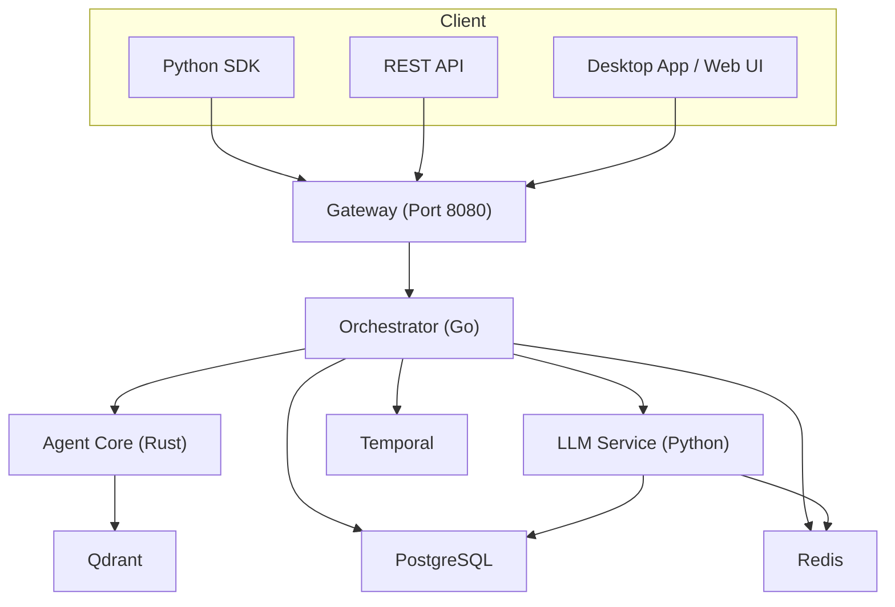

# Getting Started

<cite>
**Referenced Files in This Document**
- [README.md](file://README.md)
- [install.sh](file://scripts/install.sh)
- [docker-compose.yml](file://deploy/compose/docker-compose.yml)
- [.env.example](file://.env.example)
- [features.yaml](file://config/features.yaml)
- [models.yaml](file://config/models.yaml)
- [Makefile](file://Makefile)
- [setup_python_wasi.sh](file://scripts/setup_python_wasi.sh)
- [smoke_e2e.sh](file://scripts/smoke_e2e.sh)
- [stream_smoke.sh](file://scripts/stream_smoke.sh)
- [python/README.md](file://clients/python/README.md)
- [simple_task.py](file://clients/python/examples/simple_task.py)
- [python_example.py](file://examples/openai-sdk/python_example.py)
- [desktop/README.md](file://desktop/README.md)
- [troubleshooting.md](file://docs/troubleshooting.md)
</cite>

## Table of Contents
1. [Introduction](#introduction)
2. [Prerequisites](#prerequisites)
3. [Installation Methods](#installation-methods)
4. [Your First Agent](#your-first-agent)
5. [Essential Configuration](#essential-configuration)
6. [Architecture Overview](#architecture-overview)
7. [Verification and Troubleshooting](#verification-and-troubleshooting)
8. [Conclusion](#conclusion)

## Introduction
Welcome to Shannon, a production-grade AI agent platform designed to solve real-world scaling challenges: runaway costs, non-deterministic failures, and security nightmares. This Getting Started guide focuses on rapid onboarding so you can spin up Shannon quickly, choose your interaction mode, and run your first agent in minutes.

## Prerequisites
Before installing, ensure your environment satisfies the following:

- Docker Engine and Docker Compose
- At least one LLM provider API key (OpenAI, Anthropic, or compatible endpoint)
- Optional: Web search and web fetch API keys for richer tooling

These prerequisites are required for all installation methods.

**Section sources**
- [README.md](file://README.md#L34-L59)

## Installation Methods

### Automated Installer Script
The quickest way to get up and running is the automated installer. It downloads configuration, pulls images, and starts services.

- Run the installer script from your home directory or desired installation path.
- The script prompts you to edit the environment file for API keys.
- After editing, it pulls images and starts all services.

Quick steps:
- Download and run the installer script.
- Edit the generated environment file to add your API keys.
- Start services and verify health.

**Section sources**
- [install.sh](file://scripts/install.sh#L1-L168)
- [README.md](file://README.md#L39-L48)

### Manual Docker Compose Setup
If you prefer to inspect and customize the stack manually:

- Copy the example environment file to your project root.
- Add your API keys to the environment file.
- Bring up services with Docker Compose.

Ports and services:
- Gateway API: http://localhost:8080
- Admin/Events: http://localhost:8081
- Orchestrator gRPC: localhost:50052
- Temporal UI: http://localhost:8088
- Grafana: http://localhost:3030

**Section sources**
- [docker-compose.yml](file://deploy/compose/docker-compose.yml#L191-L200)
- [README.md](file://README.md#L191-L200)

### Development Environment from Source
For contributors or advanced users building locally:

- Create and link the environment file.
- Generate protocol buffers if needed.
- Optionally seed a test API key for development.
- Start services and run smoke tests.

Key commands:
- make setup-env
- make proto-local (if needed)
- make dev
- make smoke

**Section sources**
- [Makefile](file://Makefile#L12-L31)
- [Makefile](file://Makefile#L44-L58)
- [Makefile](file://Makefile#L137-L143)

## Your First Agent

Shannon supports multiple interaction modes. Choose the one that fits your workflow best.

### Option 1: REST API
- Submit a task to the gateway.
- Stream events via Server-Sent Events (SSE).
- Retrieve the final result.

Example commands:
- Submit a task.
- Stream events for the workflow.
- Fetch the task result.

Expected outcomes:
- Submission returns a task identifier and workflow identifier.
- Streaming shows lifecycle events (e.g., workflow started, agent started/completed, tool invoked/observed, LLM partials/outputs).
- Final result retrieval returns the computed answer.

**Section sources**
- [README.md](file://README.md#L66-L86)

### Option 2: Python SDK
- Install the official Python SDK.
- Initialize a client pointing to the gateway.
- Submit a task, wait for completion, and optionally stream events.

Example scripts:
- Basic task submission and status polling.
- CLI usage for common operations.

**Section sources**
- [python/README.md](file://clients/python/README.md#L17-L51)
- [python/README.md](file://clients/python/README.md#L74-L87)
- [simple_task.py](file://clients/python/examples/simple_task.py#L1-L48)

### Option 3: Native Desktop App
- Download pre-built desktop binaries for macOS, Windows, or Linux.
- Or build from source using Tauri and Next.js.

Benefits:
- System tray integration and notifications.
- Offline task history.
- Better performance and memory usage.
- Auto-updates.

**Section sources**
- [README.md](file://README.md#L130-L152)
- [desktop/README.md](file://desktop/README.md#L1-L210)

### Option 4: Web UI (Development)
- Run the desktop app as a local web server for development.
- Open http://localhost:3000 to explore the UI.
- Useful for real-time event streaming and quick testing.

**Section sources**
- [README.md](file://README.md#L154-L171)
- [desktop/README.md](file://desktop/README.md#L7-L27)

## Essential Configuration

### API Keys and Tool Integrations
Set your keys in the environment file. At minimum, add one LLM provider key. Optional keys enable web search and web fetch.

- Required: OPENAI_API_KEY or ANTHROPIC_API_KEY
- Recommended: SERPAPI_API_KEY for web search; FIRECRAWL_API_KEY for deep web fetching

**Section sources**
- [.env.example](file://.env.example#L17-L54)
- [README.md](file://README.md#L49-L58)

### Model Routing and Budgets
Configure model tiers and budgets via configuration files. These settings influence cost control and model selection.

- DEFAULT_MODEL_TIER, MAX_TOKENS, MAX_COST_PER_REQUEST
- Model catalog and pricing are defined centrally

**Section sources**
- [.env.example](file://.env.example#L105-L120)
- [models.yaml](file://config/models.yaml#L1-L136)

### Ports and Endpoints
Review the default ports and endpoints for all services.

- Gateway: 8080
- Admin/Events: 8081
- Orchestrator gRPC: 50052
- Temporal UI: 8088
- Grafana: 3030

**Section sources**
- [docker-compose.yml](file://deploy/compose/docker-compose.yml#L191-L200)
- [README.md](file://README.md#L191-L200)

## Architecture Overview

Shannon’s runtime architecture consists of:
- Gateway (REST and OpenAI-compatible API)
- Orchestrator (Go) for task routing, budget enforcement, and session management
- Agent Core (Rust) for WASI sandboxing and policy enforcement
- LLM Service (Python) for provider abstraction and tool execution
- Supporting systems: Temporal, PostgreSQL, Redis, Qdrant

**Diagram sources**
- [docker-compose.yml](file://deploy/compose/docker-compose.yml#L14-L411)

**Section sources**
- [README.md](file://README.md#L201-L218)

## Verification and Troubleshooting

### Quick Verification Commands
After starting services, run the smoke test to validate the end-to-end pipeline.

- Smoke test validates:
  - Temporal UI accessibility
  - Agent-Core gRPC health and task execution
  - Orchestrator gRPC readiness and task status polling
  - Persistence and metrics endpoints
  - LLM service health and MCP tool registration/execution
  - Qdrant readiness and required collections
  - Postgres connectivity

Run the smoke test:
- make smoke

Optional streaming smoke:
- export WF_ID=<your-workflow-id>; make smoke-stream

**Section sources**
- [smoke_e2e.sh](file://scripts/smoke_e2e.sh#L1-L141)
- [stream_smoke.sh](file://scripts/stream_smoke.sh#L1-L39)

### Health Checks and Logs
- Check service status: make ps
- View logs: make logs
- Health endpoints:
  - Gateway: http://localhost:8080/health
  - Admin: http://localhost:8081/health

**Section sources**
- [README.md](file://README.md#L395-L420)

### Common Issues and Fixes
- Services not starting:
  - Confirm required API keys are present in the environment file.
  - Ensure ports 8080, 8081, 50052 are available.
  - Recreate containers if needed.

- Task execution fails:
  - Verify the LLM API key is valid.
  - Check orchestrator logs for errors.
  - Ensure configuration files exist in the config directory.

- Out of memory:
  - Reduce WASI_MEMORY_LIMIT_MB.
  - Lower HISTORY_WINDOW_MESSAGES.
  - Adjust Docker memory limits.

- Python WASI execution:
  - Use the WASI setup script to download and configure the interpreter.
  - Restart services after updating the environment.

**Section sources**
- [README.md](file://README.md#L422-L438)
- [setup_python_wasi.sh](file://scripts/setup_python_wasi.sh#L1-L173)

### Known Behavior Notes
- Tokens may be counted without a visible result in some provider responses. Review troubleshooting guidance for causes and mitigations.

**Section sources**
- [troubleshooting.md](file://docs/troubleshooting.md#L1-L41)

## Conclusion
You now have multiple paths to start using Shannon:
- Use the automated installer for a turnkey setup.
- Customize Docker Compose for deeper control.
- Build from source for development and contribution.

Choose your interaction mode (REST API, Python SDK, Desktop App, or Web UI), configure your API keys, and run your first agent. Use the verification commands and troubleshooting tips to ensure a smooth experience.