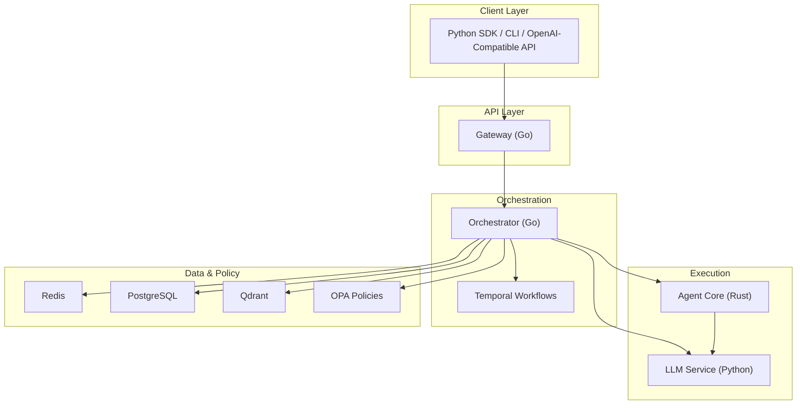
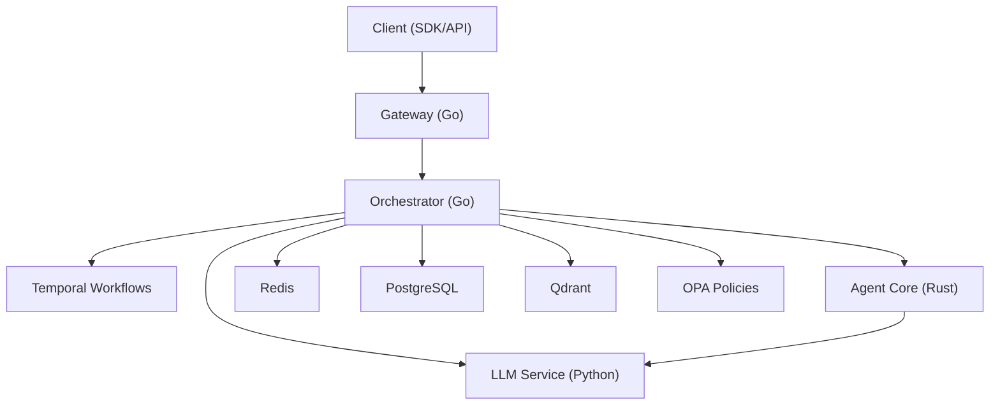
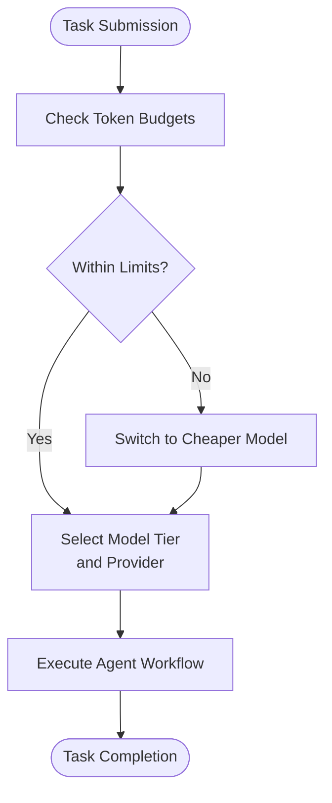
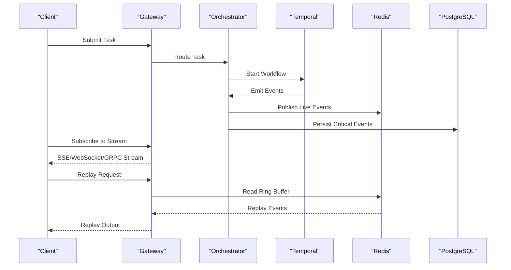
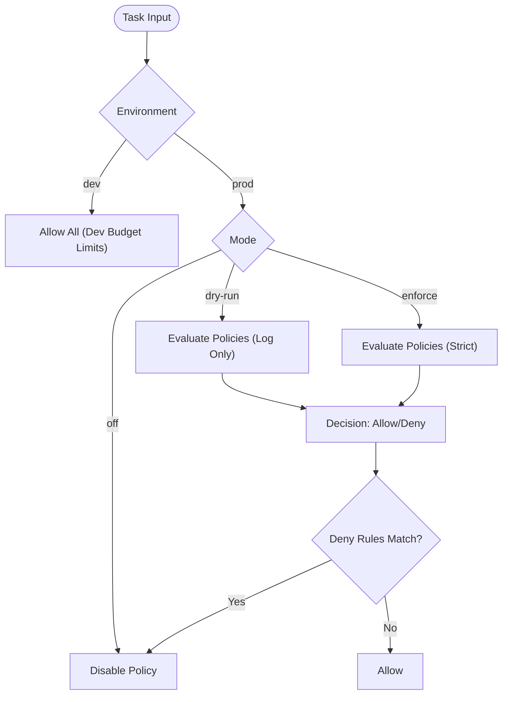
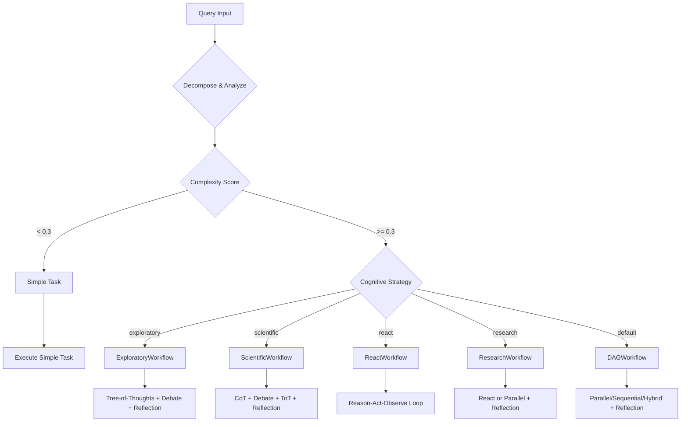
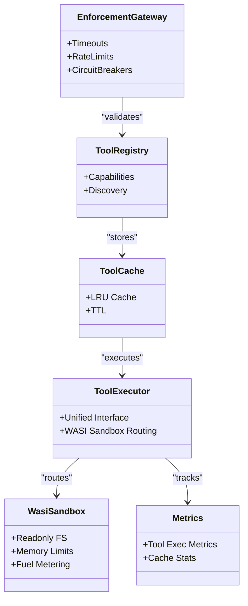
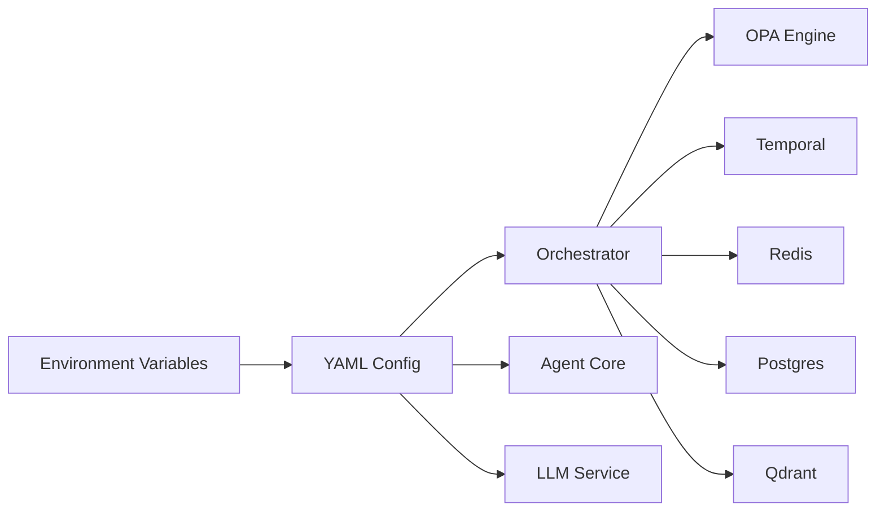

# Introduction

<cite>
**Referenced Files in This Document**
- [README.md](file://README.md)
- [ROADMAP.md](file://ROADMAP.md)
- [config/README.md](file://config/README.md)
- [config/shannon.yaml](file://config/shannon.yaml)
- [config/models.yaml](file://config/models.yaml)
- [config/opa/README.md](file://config/opa/README.md)
- [config/opa/policies/base.rego](file://config/opa/policies/base.rego)
- [docs/multi-agent-workflow-architecture.md](file://docs/multi-agent-workflow-architecture.md)
- [docs/agent-core-architecture.md](file://docs/agent-core-architecture.md)
- [docs/streaming-api.md](file://docs/streaming-api.md)
</cite>

## Table of Contents
1. [Introduction](#introduction)
2. [Project Structure](#project-structure)
3. [Core Components](#core-components)
4. [Architecture Overview](#architecture-overview)
5. [Detailed Component Analysis](#detailed-component-analysis)
6. [Dependency Analysis](#dependency-analysis)
7. [Performance Considerations](#performance-considerations)
8. [Troubleshooting Guide](#troubleshooting-guide)
9. [Conclusion](#conclusion)
10. [Appendices](#appendices)

## Introduction
Shannon is a production-grade AI agent platform engineered to solve the three fundamental challenges that plague AI agent deployments at scale:
- Runaway costs: Shannon enforces hard token budgets per task and agent, with automatic model fallback to protect spending.
- Non-deterministic failures: Shannon provides deterministic replay and time-travel debugging so you can step through any execution and pinpoint root causes.
- Security nightmares: Shannon isolates untrusted code execution in a WASI sandbox, enforces fine-grained governance via Open Policy Agent (OPA), and offers multi-tenant isolation.

Mission statement
- Ship reliable, auditable, and secure AI agents at enterprise scale.

Target audience
- Engineering teams building production AI systems who need predictable costs, deterministic behavior, and strong security guarantees.
- Organizations seeking a battle-tested, enterprise-ready platform that integrates seamlessly with existing toolchains and developer workflows.

Positioning in the AI agent ecosystem
- Shannon is not just another AI framework. It is a complete, production-grade platform that combines multi-agent orchestration, robust observability, strict cost controls, and hardened security—without sacrificing developer productivity or flexibility.

Problem-solution statements
- Problem: Agents fail silently and cost overruns are common.
  - Solution: Deterministic replay, comprehensive event streaming, and hard token budgets with automatic fallback.
- Problem: Security risks from arbitrary code execution and lack of governance.
  - Solution: WASI sandboxing, OPA policy enforcement, and multi-tenant isolation.
- Problem: Vendor lock-in and inconsistent provider experiences.
  - Solution: OpenAI-compatible API, provider abstraction, and multi-provider support with automatic failover.

Concrete examples
- Traditional platforms often allow unlimited token usage until a provider error occurs, leaving teams scrambling to recover costs and debug failures. Shannon’s hard budgets and automatic fallbacks cap spending early, while its time-travel replay lets you replay failures locally to inspect every decision and tool call.
- Many platforms lack a unified security posture. Shannon’s WASI sandbox prevents dangerous system calls, while OPA policies enforce allowlists, denylists, and budget thresholds, with dry-run and enforce modes for safe transitions.

Enterprise-ready design principles
- Multi-tenant isolation, human-in-the-loop approvals, audit trails, and on-premise readiness.
- Hot-reloadable configuration, robust health checks, and production-grade observability.

Accessibility
- For newcomers: Start with the OpenAI-compatible API, Python SDK, or the native desktop app.
- For experienced developers: Leverage the modular architecture, streaming APIs, and extensible patterns for advanced multi-agent workflows.

**Section sources**
- [README.md](file://README.md#L11-L31)
- [ROADMAP.md](file://ROADMAP.md#L5-L29)
- [config/README.md](file://config/README.md#L5-L11)
- [config/shannon.yaml](file://config/shannon.yaml#L12-L28)
- [config/models.yaml](file://config/models.yaml#L124-L129)
- [config/opa/README.md](file://config/opa/README.md#L234-L241)
- [docs/multi-agent-workflow-architecture.md](file://docs/multi-agent-workflow-architecture.md#L94-L116)
- [docs/agent-core-architecture.md](file://docs/agent-core-architecture.md#L7-L15)
- [docs/streaming-api.md](file://docs/streaming-api.md#L5-L28)

## Project Structure
Shannon is organized around a multi-service architecture with clear separation of concerns:
- Orchestrator (Go): Task routing, budget enforcement, session management, OPA policies, and Temporal workflow orchestration.
- Agent Core (Rust): WASI sandbox, tool execution, and secure agent operations.
- LLM Service (Python): Provider abstraction, MCP tools, and prompt management.
- Gateway (Go): REST API gateway exposing OpenAI-compatible endpoints.
- Configuration: YAML-based layered configuration with hot-reload support.
- Observability: Metrics, tracing, and streaming APIs for real-time insights.

**Diagram sources**
- [README.md](file://README.md#L201-L218)
- [docs/multi-agent-workflow-architecture.md](file://docs/multi-agent-workflow-architecture.md#L9-L25)
- [docs/agent-core-architecture.md](file://docs/agent-core-architecture.md#L18-L39)
- [config/shannon.yaml](file://config/shannon.yaml#L283-L304)

**Section sources**
- [README.md](file://README.md#L201-L226)
- [docs/multi-agent-workflow-architecture.md](file://docs/multi-agent-workflow-architecture.md#L27-L337)
- [docs/agent-core-architecture.md](file://docs/agent-core-architecture.md#L16-L337)
- [config/README.md](file://config/README.md#L12-L22)

## Core Components
- Orchestrator (Go): Central brain handling query decomposition, complexity analysis, strategy selection, budget enforcement, and policy checks. It coordinates multi-agent workflows and persists critical events for auditing.
- Agent Core (Rust): Secure execution layer enforcing timeouts, rate limits, and circuit breakers; manages tool registries and WASI sandbox for Python code execution.
- LLM Service (Python): Multi-provider abstraction supporting 15+ LLMs, MCP tools, and prompt optimization; bridges to Agent Core for tool execution.
- Gateway (Go): REST API gateway exposing OpenAI-compatible endpoints and internal gRPC services.
- Configuration: YAML-based layered configuration with hot-reload, including policy, circuit breakers, degradation, and vector memory settings.
- Streaming APIs: Deterministic event streaming via SSE, WebSocket, and gRPC with replay support and selective persistence.

**Section sources**
- [README.md](file://README.md#L222-L225)
- [docs/multi-agent-workflow-architecture.md](file://docs/multi-agent-workflow-architecture.md#L29-L81)
- [docs/agent-core-architecture.md](file://docs/agent-core-architecture.md#L43-L112)
- [docs/streaming-api.md](file://docs/streaming-api.md#L31-L40)
- [config/README.md](file://config/README.md#L12-L22)

## Architecture Overview
Shannon’s architecture is designed for reliability, scalability, and security:
- Clean separation between intelligence (Python) and execution (Rust).
- Deterministic workflows orchestrated by Temporal with time-travel replay.
- Strong security via WASI sandboxing and OPA policy enforcement.
- Observability through metrics, tracing, and streaming event APIs.

**Diagram sources**
- [README.md](file://README.md#L203-L218)
- [docs/multi-agent-workflow-architecture.md](file://docs/multi-agent-workflow-architecture.md#L9-L25)
- [docs/agent-core-architecture.md](file://docs/agent-core-architecture.md#L18-L39)

**Section sources**
- [README.md](file://README.md#L201-L218)
- [docs/multi-agent-workflow-architecture.md](file://docs/multi-agent-workflow-architecture.md#L9-L25)
- [docs/agent-core-architecture.md](file://docs/agent-core-architecture.md#L18-L39)

## Detailed Component Analysis

### Cost Control and Budget Enforcement
Shannon enforces hard token budgets per task and agent, with automatic model fallback to protect spending. Configuration includes:
- Per-task and per-agent token budgets.
- Cost controls with max cost per request and daily budget.
- Model tier allocation and selection strategy with fallback.

**Diagram sources**
- [config/shannon.yaml](file://config/shannon.yaml#L23-L28)
- [config/models.yaml](file://config/models.yaml#L124-L129)
- [config/models.yaml](file://config/models.yaml#L116-L122)

**Section sources**
- [config/shannon.yaml](file://config/shannon.yaml#L23-L28)
- [config/models.yaml](file://config/models.yaml#L124-L129)
- [config/models.yaml](file://config/models.yaml#L116-L122)

### Deterministic Replay and Time-Travel Debugging
Shannon captures workflow events and supports deterministic replay to investigate failures:
- Two-tier event persistence: Redis for live SSE/WebSocket delivery and PostgreSQL for audit trail.
- Replay via bounded ring buffers and Temporal history.
- Streaming APIs for real-time monitoring and selective event filtering.

**Diagram sources**
- [docs/streaming-api.md](file://docs/streaming-api.md#L5-L28)
- [docs/streaming-api.md](file://docs/streaming-api.md#L136-L178)
- [docs/streaming-api.md](file://docs/streaming-api.md#L299-L315)

**Section sources**
- [docs/streaming-api.md](file://docs/streaming-api.md#L5-L28)
- [docs/streaming-api.md](file://docs/streaming-api.md#L136-L178)
- [docs/streaming-api.md](file://docs/streaming-api.md#L299-L315)

### Security and Governance with OPA
Shannon enforces security and compliance via OPA policies:
- Allowlists and denylists for users, queries, and agents.
- Token budget enforcement and system limits.
- Dry-run and enforce modes for safe policy transitions.
- Audit logging and metrics for policy decisions.

**Diagram sources**
- [config/opa/policies/base.rego](file://config/opa/policies/base.rego#L20-L28)
- [config/opa/README.md](file://config/opa/README.md#L234-L241)

**Section sources**
- [config/opa/README.md](file://config/opa/README.md#L234-L241)
- [config/opa/policies/base.rego](file://config/opa/policies/base.rego#L16-L28)
- [config/opa/policies/base.rego](file://config/opa/policies/base.rego#L191-L206)

### Multi-Agent Orchestration and Patterns
Shannon composes reusable patterns to implement sophisticated reasoning:
- Strategy workflows: DAG, React, Research, Exploratory, Scientific.
- Pattern library: Parallel, Sequential, Hybrid, React, Reflection, Chain-of-Thought, Debate, Tree-of-Thoughts.
- Intelligent reflection gating and composition strategies.

**Diagram sources**
- [docs/multi-agent-workflow-architecture.md](file://docs/multi-agent-workflow-architecture.md#L94-L116)

**Section sources**
- [docs/multi-agent-workflow-architecture.md](file://docs/multi-agent-workflow-architecture.md#L36-L81)
- [docs/multi-agent-workflow-architecture.md](file://docs/multi-agent-workflow-architecture.md#L154-L179)

### Secure Code Execution with WASI
Shannon isolates untrusted code execution in a WASI sandbox:
- Filesystem isolation (read-only access), memory limits, execution timeouts, and fuel metering.
- Tool registry, cache, and executor integrated with Python LLM service.
- Comprehensive error handling and observability.

**Diagram sources**
- [docs/agent-core-architecture.md](file://docs/agent-core-architecture.md#L43-L112)
- [docs/agent-core-architecture.md](file://docs/agent-core-architecture.md#L113-L162)

**Section sources**
- [docs/agent-core-architecture.md](file://docs/agent-core-architecture.md#L74-L81)
- [docs/agent-core-architecture.md](file://docs/agent-core-architecture.md#L113-L162)

## Dependency Analysis
Shannon’s configuration system supports layered precedence and hot-reload:
- Environment variables override YAML settings.
- Hot-reload applies to most configuration changes without service restart.
- Policy engine supports dynamic reloading of Rego policies.

**Diagram sources**
- [config/README.md](file://config/README.md#L5-L11)
- [config/README.md](file://config/README.md#L181-L207)

**Section sources**
- [config/README.md](file://config/README.md#L5-L11)
- [config/README.md](file://config/README.md#L181-L207)

## Performance Considerations
- Deterministic event streaming with bounded ring buffers prevents memory growth and ensures replay safety.
- Backpressure handling drops events to slow subscribers; clients should reconnect with last_event_id.
- Provider-specific streaming limitations are handled gracefully with usage metadata preservation and fallbacks.
- Circuit breakers and degradation rules protect downstream services under load.

[No sources needed since this section provides general guidance]

## Troubleshooting Guide
- Health checks: Use gateway and admin endpoints to verify service status.
- Logs: Tail orchestrator, agent-core, and LLM service logs for errors.
- Common issues: Missing API keys, port conflicts, memory limits, and configuration validation errors.
- Policy testing: Use dry-run mode to validate OPA rules and monitor policy metrics.

**Section sources**
- [README.md](file://README.md#L395-L421)
- [config/opa/README.md](file://config/opa/README.md#L356-L372)

## Conclusion
Shannon delivers a production-ready AI agent platform that turns common deployment nightmares into manageable, observable, and secure operations. By combining deterministic workflows, strict cost controls, hardened security, and enterprise-grade observability, Shannon empowers teams to ship reliable AI systems confidently—whether you are just getting started or scaling to enterprise demands.

[No sources needed since this section summarizes without analyzing specific files]

## Appendices
- Mission statement: Ship reliable, auditable, and secure AI agents at enterprise scale.
- Target audience: Engineering teams building production AI systems.
- Positioning: A complete, production-grade platform with multi-agent orchestration, robust observability, strict cost controls, and hardened security.

[No sources needed since this section provides general guidance]