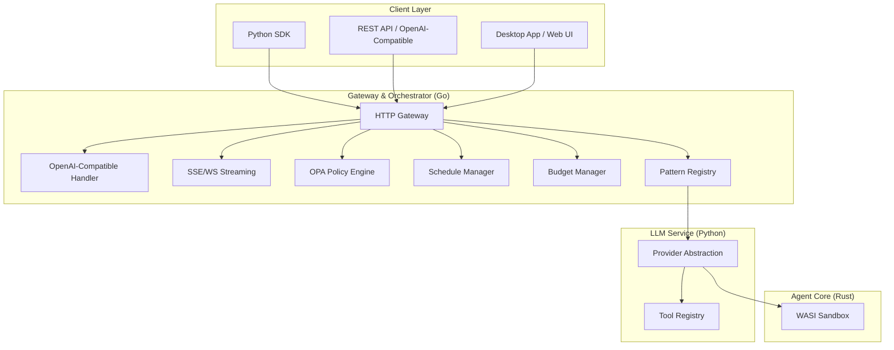
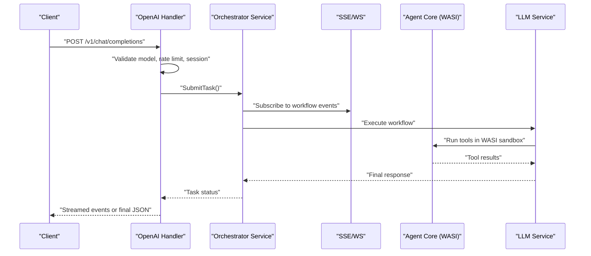
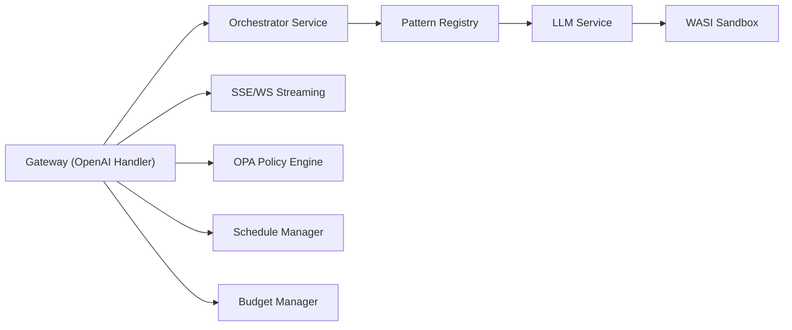

# Key Features

<cite>
**Referenced Files in This Document**
- [README.md](file://README.md)
- [ROADMAP.md](file://ROADMAP.md)
- [features.yaml](file://config/features.yaml)
- [models.yaml](file://config/models.yaml)
- [openai_models.yaml](file://config/openai_models.yaml)
- [handler.go](file://go/orchestrator/cmd/gateway/internal/openai/handler.go)
- [streaming.go](file://go/orchestrator/internal/httpapi/streaming.go)
- [registry.go](file://go/orchestrator/internal/workflows/patterns/registry.go)
- [manager.go](file://go/orchestrator/internal/budget/manager.go)
- [wasi_sandbox.rs](file://rust/agent-core/src/wasi_sandbox.rs)
- [engine.go](file://go/orchestrator/internal/policy/engine.go)
- [base.rego](file://config/opa/policies/base.rego)
- [manager.go](file://go/orchestrator/internal/schedules/manager.go)
- [schedules.go](file://go/orchestrator/cmd/gateway/internal/handlers/schedules.go)
</cite>

## Table of Contents
1. [Introduction](#introduction)
2. [Project Structure](#project-structure)
3. [Core Components](#core-components)
4. [Architecture Overview](#architecture-overview)
5. [Detailed Component Analysis](#detailed-component-analysis)
6. [Dependency Analysis](#dependency-analysis)
7. [Performance Considerations](#performance-considerations)
8. [Troubleshooting Guide](#troubleshooting-guide)
9. [Conclusion](#conclusion)
10. [Appendices](#appendices)

## Introduction
This document presents Shannon’s key features and differentiators, focusing on practical capabilities that enterprises and developers care about most: an OpenAI-compatible API drop-in replacement, real-time event streaming with SSE and WebSocket, multi-agent orchestration patterns, token budget control with automatic model fallback, secure WASI sandbox execution, time-travel debugging, OPA policy governance, scheduled task execution, and broad LLM provider support. It includes implementation insights, configuration references, and comparisons to alternatives such as LangGraph, Dify, AutoGen, and CrewAI.

## Project Structure
Shannon is a multi-language platform composed of:
- A Go-based gateway and orchestrator handling API, policy, scheduling, and streaming
- A Rust-based agent core implementing WASI sandboxing and agent-to-agent coordination
- A Python-based LLM service providing provider abstraction and tool execution
- YAML-based configuration for features, models, and OpenAI-compatible model registries
- OPA-based policy enforcement with pluggable Rego rules

**Diagram sources**
- [handler.go](file://go/orchestrator/cmd/gateway/internal/openai/handler.go#L63-L190)
- [streaming.go](file://go/orchestrator/internal/httpapi/streaming.go#L34-L367)
- [engine.go](file://go/orchestrator/internal/policy/engine.go#L85-L115)
- [manager.go](file://go/orchestrator/internal/schedules/manager.go#L34-L52)
- [manager.go](file://go/orchestrator/internal/budget/manager.go#L59-L146)
- [registry.go](file://go/orchestrator/internal/workflows/patterns/registry.go#L71-L126)
- [wasi_sandbox.rs](file://rust/agent-core/src/wasi_sandbox.rs#L15-L72)

**Section sources**
- [README.md](file://README.md#L201-L226)

## Core Components
- OpenAI-compatible API: Drop-in replacement for OpenAI endpoints with streaming and non-streaming responses, model registry, and session continuity.
- Real-time event streaming: SSE and WebSocket endpoints for workflow events, progress, and lifecycle signals.
- Multi-agent orchestration: Pattern registry supporting reflection, ReAct, chain-of-thought, debate, tree of thoughts, and ensemble strategies.
- Token budget control: Hard caps per task/session with backpressure, warnings, and automatic model fallback.
- Secure WASI sandbox: Isolated execution for code tools with strict resource limits and permission gating.
- OPA policy governance: Pluggable Rego policies for allow/deny decisions, canary rollouts, and audit tagging.
- Scheduled tasks: Cron-based scheduling with Temporal, budget enforcement, and run history.
- LLM provider support: 15+ providers with tiered selection, cost control, and automatic fallback.

**Section sources**
- [README.md](file://README.md#L227-L372)
- [features.yaml](file://config/features.yaml#L1-L270)
- [models.yaml](file://config/models.yaml#L1-L120)

## Architecture Overview
Shannon’s runtime architecture integrates a gateway, orchestrator, agent core, and LLM service. The gateway exposes REST and OpenAI-compatible endpoints, translates requests, enforces policies, budgets, and sessions, and streams events. The orchestrator coordinates workflows, applies multi-agent patterns, and manages schedules. The agent core executes tools in a WASI sandbox, and the LLM service abstracts providers and tools.

**Diagram sources**
- [handler.go](file://go/orchestrator/cmd/gateway/internal/openai/handler.go#L63-L190)
- [streaming.go](file://go/orchestrator/internal/httpapi/streaming.go#L40-L104)
- [wasi_sandbox.rs](file://rust/agent-core/src/wasi_sandbox.rs#L124-L133)

**Section sources**
- [README.md](file://README.md#L201-L226)

## Detailed Component Analysis

### OpenAI-Compatible API Drop-in Replacement
Shannon’s gateway implements OpenAI-compatible endpoints, translating requests to internal workflows, enforcing rate limits and policies, and streaming events back to clients.

- Key behaviors
  - Model validation and translation to internal workflow modes
  - Session resolution and continuity
  - Streaming via SSE with rich event types
  - Non-streaming completion polling with usage recording
  - Rate limiting and token accounting

- Practical example references
  - OpenAI-compatible chat completions handler: [handler.go](file://go/orchestrator/cmd/gateway/internal/openai/handler.go#L63-L190)
  - Streaming response mapping: [handler.go](file://go/orchestrator/cmd/gateway/internal/openai/handler.go#L192-L289)
  - SSE endpoint implementation: [streaming.go](file://go/orchestrator/internal/httpapi/streaming.go#L40-L104)

- Configuration
  - Model registry for OpenAI-compatible models: [openai_models.yaml](file://config/openai_models.yaml#L8-L92)

- Benefits
  - Zero-code migration from OpenAI clients
  - Rich event streaming for UIs and monitoring
  - Session continuity across multi-turn conversations

**Section sources**
- [handler.go](file://go/orchestrator/cmd/gateway/internal/openai/handler.go#L63-L190)
- [handler.go](file://go/orchestrator/cmd/gateway/internal/openai/handler.go#L192-L289)
- [streaming.go](file://go/orchestrator/internal/httpapi/streaming.go#L40-L104)
- [openai_models.yaml](file://config/openai_models.yaml#L8-L92)

### Real-time Event Streaming with SSE/WebSocket
Shannon provides both SSE and WebSocket endpoints for real-time visibility into agent execution, including workflow lifecycle, agent events, tool invocations, and LLM outputs.

- Key behaviors
  - SSE endpoint with resume support via Last-Event-ID and Redis stream IDs
  - Event filtering by type and heartbeat management
  - WebSocket bridge for richer client integrations
  - Terminal event handling and inactivity timers

- Practical example references
  - SSE handler with resume and filtering: [streaming.go](file://go/orchestrator/internal/httpapi/streaming.go#L40-L104)
  - Event mapping and filtering: [streaming.go](file://go/orchestrator/internal/httpapi/streaming.go#L106-L184)
  - WebSocket registration: [streaming.go](file://go/orchestrator/internal/httpapi/streaming.go#L34-L38)

- Benefits
  - Live dashboards and debugging
  - Resumable streams for late joiners
  - Comprehensive event taxonomy for UIs

**Section sources**
- [streaming.go](file://go/orchestrator/internal/httpapi/streaming.go#L40-L104)
- [streaming.go](file://go/orchestrator/internal/httpapi/streaming.go#L106-L184)
- [streaming.go](file://go/orchestrator/internal/httpapi/streaming.go#L34-L38)

### Multi-Agent Orchestration Patterns
Shannon includes a pattern registry that selects and executes multi-agent strategies such as reflection, ReAct, chain-of-thought, debate, tree of thoughts, and ensemble patterns.

- Key behaviors
  - Pattern selection based on task characteristics
  - Capability descriptors for each pattern
  - Token estimation for budget-aware planning

- Practical example references
  - Pattern registry and selection: [registry.go](file://go/orchestrator/internal/workflows/patterns/registry.go#L71-L126)
  - Pattern types and capabilities: [registry.go](file://go/orchestrator/internal/workflows/patterns/registry.go#L11-L48)

- Benefits
  - Flexible orchestration strategies
  - Consistent token and confidence reporting
  - Extensible pattern catalog

**Section sources**
- [registry.go](file://go/orchestrator/internal/workflows/patterns/registry.go#L71-L126)
- [registry.go](file://go/orchestrator/internal/workflows/patterns/registry.go#L11-L48)

### Token Budget Control with Automatic Model Fallback
Shannon enforces hard token budgets per task/session, emits warnings, applies backpressure, and can automatically switch to a fallback model when thresholds are approached.

- Key behaviors
  - Budget checks with task/session totals and warning thresholds
  - Backpressure delays proportional to usage percent
  - Estimated cost calculations using centralized pricing
  - Idempotent usage recording with retry protection

- Practical example references
  - Budget manager with backpressure: [manager.go](file://go/orchestrator/internal/budget/manager.go#L59-L146)
  - Budget check and warnings: [manager.go](file://go/orchestrator/internal/budget/manager.go#L175-L288)
  - Backpressure and pressure levels: [manager.go](file://go/orchestrator/internal/budget/manager.go#L677-L762)
  - Pricing integration: [models.yaml](file://config/models.yaml#L536-L776)

- Benefits
  - Predictable cost control
  - Operational resilience with backpressure
  - Transparent cost estimation

**Section sources**
- [manager.go](file://go/orchestrator/internal/budget/manager.go#L59-L146)
- [manager.go](file://go/orchestrator/internal/budget/manager.go#L175-L288)
- [manager.go](file://go/orchestrator/internal/budget/manager.go#L677-L762)
- [models.yaml](file://config/models.yaml#L536-L776)

### Secure WASI Sandbox Execution
Shannon executes code tools in a WASI sandbox with strict resource limits, read-only filesystem access, and epoch-interruption for timeouts.

- Key behaviors
  - Permission validation and canonical path checks
  - Read-only preopened directories
  - Memory guard size, table/memory limits, and fuel-based CPU control
  - Epoch tickers for timeout enforcement

- Practical example references
  - WASI sandbox configuration and execution: [wasi_sandbox.rs](file://rust/agent-core/src/wasi_sandbox.rs#L15-L72)
  - Execution with argv and stdin/stdout capture: [wasi_sandbox.rs](file://rust/agent-core/src/wasi_sandbox.rs#L124-L133)
  - Security-focused builder and limits: [wasi_sandbox.rs](file://rust/agent-core/src/wasi_sandbox.rs#L217-L369)

- Benefits
  - Strong isolation for untrusted code
  - Prevents network and filesystem access
  - Predictable resource consumption

**Section sources**
- [wasi_sandbox.rs](file://rust/agent-core/src/wasi_sandbox.rs#L15-L72)
- [wasi_sandbox.rs](file://rust/agent-core/src/wasi_sandbox.rs#L124-L133)
- [wasi_sandbox.rs](file://rust/agent-core/src/wasi_sandbox.rs#L217-L369)

### Time-Travel Debugging
Shannon enables deterministic replay of workflows for debugging, allowing step-by-step inspection of decisions, tool calls, and state changes.

- Key behaviors
  - Replay from Redis stream IDs or numeric sequences
  - SSE resume via Last-Event-ID and stream IDs
  - Temporal workflow introspection for validation

- Practical example references
  - SSE resume and replay logic: [streaming.go](file://go/orchestrator/internal/httpapi/streaming.go#L60-L83)
  - First-event timeout and workflow validation: [streaming.go](file://go/orchestrator/internal/httpapi/streaming.go#L286-L310)

- Benefits
  - Rapid failure investigation
  - Deterministic reproduction of issues
  - Audit-friendly execution traces

**Section sources**
- [streaming.go](file://go/orchestrator/internal/httpapi/streaming.go#L60-L83)
- [streaming.go](file://go/orchestrator/internal/httpapi/streaming.go#L286-L310)

### OPA Policy Governance
Shannon integrates OPA for fine-grained policy enforcement, including allow/deny decisions, canary rollouts, dry-run mode, and audit tagging.

- Key behaviors
  - Load and compile Rego policies from a directory
  - Evaluate policies with input context and cache
  - Canary rollout with deterministic user/agent hashing
  - Dry-run and enforce modes with divergence tracking

- Practical example references
  - OPA engine and policy loading: [engine.go](file://go/orchestrator/internal/policy/engine.go#L85-L115)
  - Policy evaluation and decision parsing: [engine.go](file://go/orchestrator/internal/policy/engine.go#L197-L282)
  - Canary mode and effective decision: [engine.go](file://go/orchestrator/internal/policy/engine.go#L458-L594)
  - Example policy rules: [base.rego](file://config/opa/policies/base.rego#L1-L272)

- Benefits
  - Pluggable, declarative governance
  - Safe canary rollouts with dry-run
  - Comprehensive audit trail

**Section sources**
- [engine.go](file://go/orchestrator/internal/policy/engine.go#L85-L115)
- [engine.go](file://go/orchestrator/internal/policy/engine.go#L197-L282)
- [engine.go](file://go/orchestrator/internal/policy/engine.go#L458-L594)
- [base.rego](file://config/opa/policies/base.rego#L1-L272)

### Scheduled Task Execution
Shannon supports cron-based scheduled tasks with Temporal, budget enforcement, and run history.

- Key behaviors
  - Create/update/delete schedules with cron expressions and timezones
  - Enforce minimum intervals and per-user limits
  - Budget validation per run and timeout configuration
  - Pause/resume and run listing with pagination

- Practical example references
  - Schedule manager and cron validation: [manager.go](file://go/orchestrator/internal/schedules/manager.go#L34-L52)
  - Create schedule with Temporal and DB persistence: [manager.go](file://go/orchestrator/internal/schedules/manager.go#L54-L169)
  - HTTP handlers for schedule CRUD: [schedules.go](file://go/orchestrator/cmd/gateway/internal/handlers/schedules.go#L31-L99)

- Benefits
  - Reliable recurring workflows
  - Budget and rate controls
  - Operational visibility into runs

**Section sources**
- [manager.go](file://go/orchestrator/internal/schedules/manager.go#L34-L52)
- [manager.go](file://go/orchestrator/internal/schedules/manager.go#L54-L169)
- [schedules.go](file://go/orchestrator/cmd/gateway/internal/handlers/schedules.go#L31-L99)

### 15+ LLM Provider Support
Shannon supports a wide range of providers and models with tiered selection, cost control, and automatic fallback.

- Key behaviors
  - Tiered model catalogs (small/medium/large)
  - Centralized pricing and cost tracking
  - Provider-specific timeouts and retries
  - Automatic fallback and priority-based selection

- Practical example references
  - Model tiers and selection strategy: [models.yaml](file://config/models.yaml#L16-L121)
  - Provider settings and timeouts: [models.yaml](file://config/models.yaml#L137-L198)
  - Pricing and cost controls: [models.yaml](file://config/models.yaml#L536-L776)
  - OpenAI-compatible model registry: [openai_models.yaml](file://config/openai_models.yaml#L8-L92)

- Benefits
  - Broad provider coverage
  - Cost-aware model selection
  - Resilient fallback behavior

**Section sources**
- [models.yaml](file://config/models.yaml#L16-L121)
- [models.yaml](file://config/models.yaml#L137-L198)
- [models.yaml](file://config/models.yaml#L536-L776)
- [openai_models.yaml](file://config/openai_models.yaml#L8-L92)

### Comparison Against Alternatives
Shannon’s key differentiators include:
- Scheduled tasks: native cron-based workflows with Temporal
- Deterministic replay: time-travel debugging for production failures
- Token budget limits: hard caps with backpressure and automatic fallback
- Security sandbox: WASI isolation for code execution
- OPA policy control: fine-grained governance with canary rollouts
- Production metrics: integrated dashboards and observability
- Multi-language core: Go/Rust/Python for robustness and performance
- Session persistence: Redis-backed memory continuity
- Multi-agent orchestration: DAG, supervisor, and advanced patterns

**Section sources**
- [README.md](file://README.md#L357-L372)

## Dependency Analysis
Shannon’s components depend on each other in a layered manner: the gateway depends on the orchestrator, which depends on the LLM service and agent core. Policies, budgets, and schedules are coordinated centrally.

**Diagram sources**
- [handler.go](file://go/orchestrator/cmd/gateway/internal/openai/handler.go#L24-L61)
- [streaming.go](file://go/orchestrator/internal/httpapi/streaming.go#L18-L38)
- [engine.go](file://go/orchestrator/internal/policy/engine.go#L85-L115)
- [manager.go](file://go/orchestrator/internal/schedules/manager.go#L34-L52)
- [manager.go](file://go/orchestrator/internal/budget/manager.go#L59-L146)
- [registry.go](file://go/orchestrator/internal/workflows/patterns/registry.go#L71-L126)
- [wasi_sandbox.rs](file://rust/agent-core/src/wasi_sandbox.rs#L15-L72)

**Section sources**
- [README.md](file://README.md#L201-L226)

## Performance Considerations
- Streaming efficiency: SSE and WebSocket minimize latency and enable real-time UI updates.
- Budget backpressure: Dynamic delays reduce overload during high usage.
- WASI limits: Guard pages and resource caps prevent runaway resource consumption.
- Policy caching: LRU cache reduces evaluation overhead for repeated inputs.
- Temporal scheduling: Efficient cron execution with bounded concurrency.

[No sources needed since this section provides general guidance]

## Troubleshooting Guide
- Health checks and logs
  - Gateway and admin health endpoints: [README.md](file://README.md#L395-L420)
- Streaming connectivity
  - SSE connection and error handling: [streaming.go](file://go/orchestrator/internal/httpapi/streaming.go#L248-L264)
- Policy evaluation
  - Fail-closed vs fail-open behavior: [engine.go](file://go/orchestrator/internal/policy/engine.go#L104-L114)
- Budget overruns
  - Warning thresholds and backpressure: [manager.go](file://go/orchestrator/internal/budget/manager.go#L259-L275)

**Section sources**
- [README.md](file://README.md#L395-L420)
- [streaming.go](file://go/orchestrator/internal/httpapi/streaming.go#L248-L264)
- [engine.go](file://go/orchestrator/internal/policy/engine.go#L104-L114)
- [manager.go](file://go/orchestrator/internal/budget/manager.go#L259-L275)

## Conclusion
Shannon delivers a production-ready AI agent platform with enterprise-grade controls: drop-in OpenAI compatibility, real-time observability, robust multi-agent orchestration, strict cost and budget controls, secure sandboxing, governance via OPA, scheduled execution, and extensive provider support. Its architecture balances performance, reliability, and operability, making it a strong choice for organizations seeking predictable, auditable, and scalable agent systems.

[No sources needed since this section summarizes without analyzing specific files]

## Appendices
- Configuration highlights
  - Feature flags and execution modes: [features.yaml](file://config/features.yaml#L1-L270)
  - Model catalogs and pricing: [models.yaml](file://config/models.yaml#L1-L776)
  - OpenAI-compatible model registry: [openai_models.yaml](file://config/openai_models.yaml#L1-L109)
- Roadmap and future capabilities: [ROADMAP.md](file://ROADMAP.md#L1-L70)

**Section sources**
- [features.yaml](file://config/features.yaml#L1-L270)
- [models.yaml](file://config/models.yaml#L1-L776)
- [openai_models.yaml](file://config/openai_models.yaml#L1-L109)
- [ROADMAP.md](file://ROADMAP.md#L1-L70)