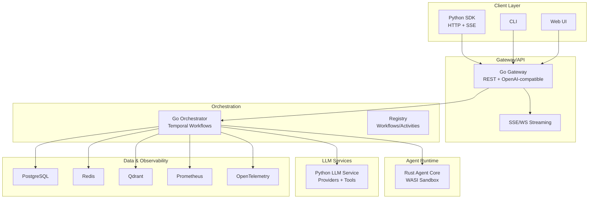
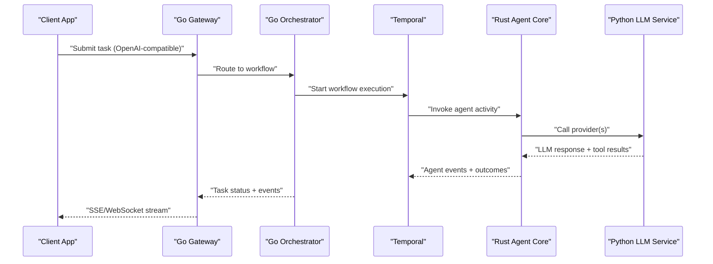
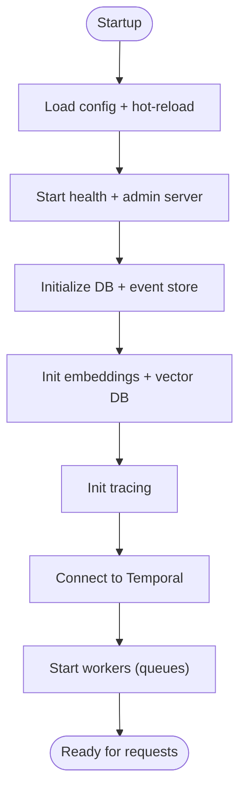
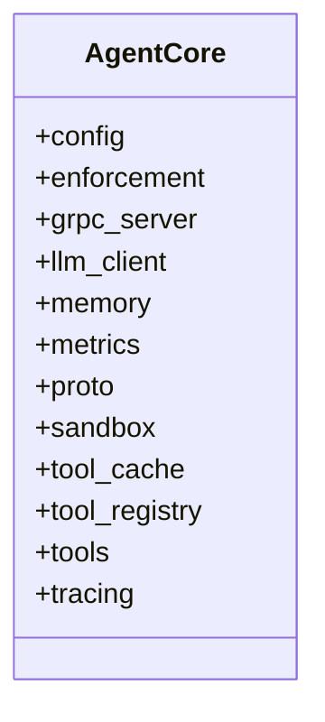
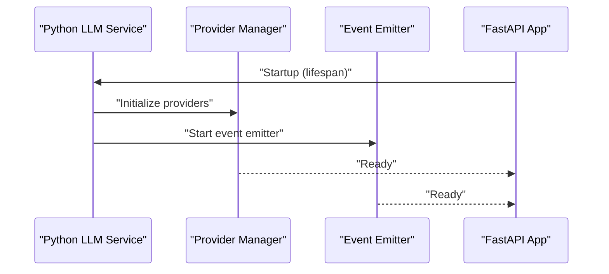
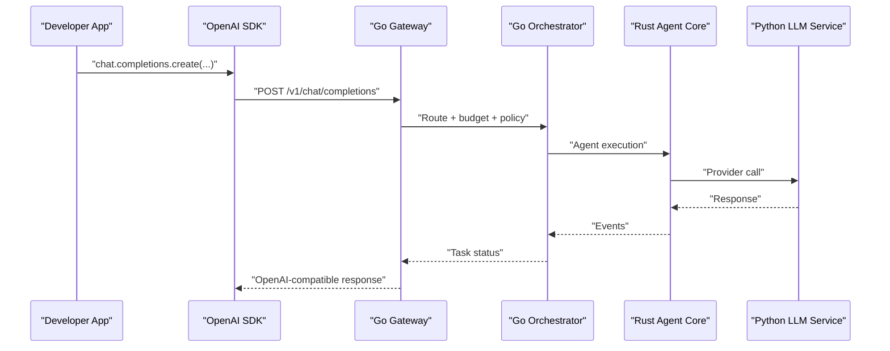
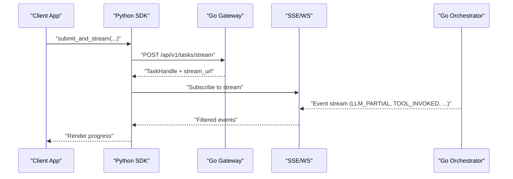
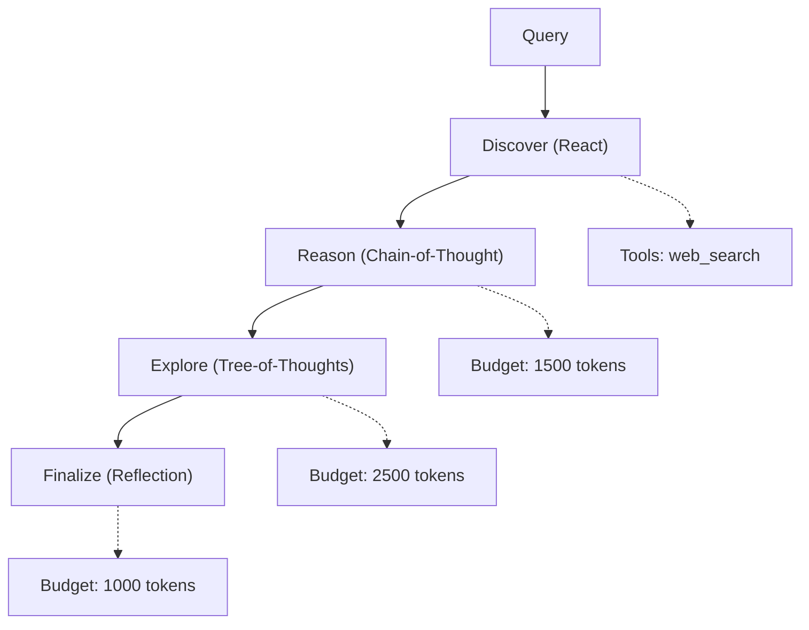
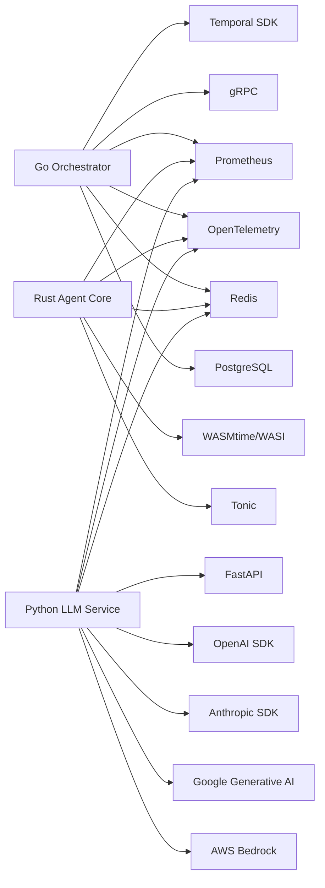

# Project Overview

<cite>
**Referenced Files in This Document**
- [README.md](file://README.md)
- [go/orchestrator/main.go](file://go/orchestrator/main.go)
- [go/orchestrator/go.mod](file://go/orchestrator/go.mod)
- [rust/agent-core/src/lib.rs](file://rust/agent-core/src/lib.rs)
- [rust/agent-core/Cargo.toml](file://rust/agent-core/Cargo.toml)
- [python/llm-service/main.py](file://python/llm-service/main.py)
- [python/llm-service/requirements.txt](file://python/llm-service/requirements.txt)
- [clients/python/src/shannon/client.py](file://clients/python/src/shannon/client.py)
- [examples/openai-sdk/python_example.py](file://examples/openai-sdk/python_example.py)
- [clients/python/examples/simple_streaming.py](file://clients/python/examples/simple_streaming.py)
- [config/README.md](file://config/README.md)
- [docs/multi-agent-workflow-architecture.md](file://docs/multi-agent-workflow-architecture.md)
- [docs/openai-api-reference.md](file://docs/openai-api-reference.md)
</cite>

## Table of Contents
1. [Introduction](#introduction)
2. [Project Structure](#project-structure)
3. [Core Components](#core-components)
4. [Architecture Overview](#architecture-overview)
5. [Detailed Component Analysis](#detailed-component-analysis)
6. [Dependency Analysis](#dependency-analysis)
7. [Performance Considerations](#performance-considerations)
8. [Troubleshooting Guide](#troubleshooting-guide)
9. [Conclusion](#conclusion)
10. [Appendices](#appendices)

## Introduction
Shannon is a production-grade AI agent orchestration platform designed to solve three major operational challenges at scale:
- Runaway costs caused by unbounded LLM usage
- Non-deterministic failures due to brittle workflows
- Security nightmares from unrestricted tool execution

Shannon achieves reliability and safety through multi-agent orchestration, deterministic replay, hard token budgets, WASI sandboxing, and fine-grained policy enforcement. It exposes an OpenAI-compatible API surface for drop-in compatibility, while offering advanced capabilities like real-time streaming, research workflows, and scheduled tasks.

## Project Structure
Shannon is organized as a polyglot, microservice-style platform:
- Go-based orchestrator manages routing, budget enforcement, sessions, approvals, and Temporal workflows
- Rust-based agent core provides WASI sandboxing, policy enforcement, and agent-to-agent coordination
- Python-based LLM service abstracts providers, caches embeddings, and emits events
- Clients and SDKs enable integration via HTTP, SSE, and OpenAI-compatible endpoints
- Configuration is layered (environment, YAML, hot-reload) for enterprise-grade operability

**Diagram sources**
- [README.md](file://README.md#L201-L218)
- [go/orchestrator/main.go](file://go/orchestrator/main.go#L49-L110)
- [python/llm-service/main.py](file://python/llm-service/main.py#L116-L151)
- [rust/agent-core/src/lib.rs](file://rust/agent-core/src/lib.rs#L1-L21)

**Section sources**
- [README.md](file://README.md#L201-L218)
- [go/orchestrator/main.go](file://go/orchestrator/main.go#L49-L110)
- [python/llm-service/main.py](file://python/llm-service/main.py#L116-L151)
- [rust/agent-core/src/lib.rs](file://rust/agent-core/src/lib.rs#L1-L21)

## Core Components
- Go Orchestrator: HTTP gateway, OpenAI-compatible endpoints, Temporal workflow routing, budget middleware, approvals, streaming, health checks, and configuration hot-reload
- Rust Agent Core: WASI sandbox, policy enforcement, tool registry, metrics, tracing, and gRPC service for agent operations
- Python LLM Service: Provider abstraction (OpenAI, Anthropic, Google, Bedrock, local), tool execution, embeddings, event emission, and OpenTelemetry instrumentation
- Configuration: Layered YAML and environment-driven settings with hot-reload and policy governance
- Clients: Python SDK with streaming, task lifecycle, and event filtering; OpenAI-compatible examples

**Section sources**
- [go/orchestrator/main.go](file://go/orchestrator/main.go#L49-L110)
- [rust/agent-core/src/lib.rs](file://rust/agent-core/src/lib.rs#L1-L21)
- [python/llm-service/main.py](file://python/llm-service/main.py#L116-L151)
- [config/README.md](file://config/README.md#L5-L11)
- [clients/python/src/shannon/client.py](file://clients/python/src/shannon/client.py#L79-L123)

## Architecture Overview
Shannon’s runtime architecture integrates three pillars:
- Orchestration: Go orchestrator coordinates tasks, applies budgets, enforces policies, and schedules workflows via Temporal
- Agent Runtime: Rust agent core executes agents in a WASI sandbox with strict resource limits and policy checks
- LLM Services: Python LLM service provides provider-agnostic inference, tool execution, and event emission

**Diagram sources**
- [README.md](file://README.md#L201-L218)
- [go/orchestrator/main.go](file://go/orchestrator/main.go#L49-L110)
- [python/llm-service/main.py](file://python/llm-service/main.py#L116-L151)
- [rust/agent-core/src/lib.rs](file://rust/agent-core/src/lib.rs#L1-L21)

## Detailed Component Analysis

### Go Orchestrator
- Responsibilities: HTTP gateway, OpenAI-compatible endpoints, budget middleware, approvals, streaming, health checks, Temporal integration, configuration hot-reload, and policy engine initialization
- Key subsystems:
  - Health manager and admin endpoints (health, approvals, events, timeline)
  - Streaming manager backed by Redis and persistent event store
  - Temporal worker with priority queues and registry of workflows/activities
  - Auth middleware and JWT management
  - Embeddings and vector DB initialization
  - Tracing and metrics endpoints

**Diagram sources**
- [go/orchestrator/main.go](file://go/orchestrator/main.go#L49-L110)
- [go/orchestrator/main.go](file://go/orchestrator/main.go#L353-L354)
- [go/orchestrator/main.go](file://go/orchestrator/main.go#L610-L779)

**Section sources**
- [go/orchestrator/main.go](file://go/orchestrator/main.go#L49-L110)
- [go/orchestrator/main.go](file://go/orchestrator/main.go#L353-L354)
- [go/orchestrator/main.go](file://go/orchestrator/main.go#L610-L779)

### Rust Agent Core
- Responsibilities: WASI sandbox, policy enforcement, tool registry, metrics, tracing, and gRPC service for agent operations
- Key modules: config, enforcement, grpc_server, llm_client, memory, metrics, proto, sandbox, tool_cache, tool_registry, tools, tracing

**Diagram sources**
- [rust/agent-core/src/lib.rs](file://rust/agent-core/src/lib.rs#L1-L21)

**Section sources**
- [rust/agent-core/src/lib.rs](file://rust/agent-core/src/lib.rs#L1-L21)
- [rust/agent-core/Cargo.toml](file://rust/agent-core/Cargo.toml#L1-L90)

### Python LLM Service
- Responsibilities: Provider abstraction, tool execution, embeddings, event emission, OpenTelemetry tracing, and Prometheus metrics
- Key features: FastAPI app, CORS, provider manager, event emitter, and routers for health, completions, embeddings, tools, evaluate, verify, context, providers, and MCP mock

**Diagram sources**
- [python/llm-service/main.py](file://python/llm-service/main.py#L71-L114)
- [python/llm-service/main.py](file://python/llm-service/main.py#L116-L151)

**Section sources**
- [python/llm-service/main.py](file://python/llm-service/main.py#L71-L114)
- [python/llm-service/main.py](file://python/llm-service/main.py#L116-L151)
- [python/llm-service/requirements.txt](file://python/llm-service/requirements.txt#L1-L62)

### Technology Stack Overview
- Go Orchestrator: Temporal SDK, gRPC, Prometheus, OpenTelemetry, Redis, Postgres, Zap logging
- Rust Agent Core: Tokio, Tonic, WASMtime/WASI, OpenTelemetry, Prometheus, Redis
- Python LLM Service: FastAPI, OpenAI/Anthropic/Google/Bedrock clients, Redis, SQLAlchemy, OpenTelemetry, Prometheus
- Configuration: YAML files with hot-reload, environment variables, and layered precedence
- Observability: Prometheus metrics, Grafana dashboards, OpenTelemetry traces, Temporal UI

**Section sources**
- [go/orchestrator/go.mod](file://go/orchestrator/go.mod#L7-L36)
- [rust/agent-core/Cargo.toml](file://rust/agent-core/Cargo.toml#L15-L81)
- [python/llm-service/requirements.txt](file://python/llm-service/requirements.txt#L1-L62)
- [config/README.md](file://config/README.md#L5-L11)

### Key Differentiators from Alternatives
- Deterministic replay via Temporal UI and time-travel debugging
- Hard token budgets with automatic model fallback
- WASI sandbox for secure code execution
- OPA policy governance with hot-reload
- Production metrics and enterprise-grade observability
- Native desktop apps and multi-language core (Go/Rust/Python)
- Multi-agent orchestration with composable patterns (DAG/Supervisor/Strategies)

**Section sources**
- [README.md](file://README.md#L357-L371)

### Enterprise-Ready Features
- Multi-tenant isolation, human-in-the-loop approvals, audit trails, on-premise deployment
- Hot-reload configuration, policy engine, and pricing updates
- Circuit breakers, degradation strategies, and graceful backpressure
- Session persistence, token budget controls, and model tiering
- OpenAI-compatible API, streaming, and scheduled tasks

**Section sources**
- [README.md](file://README.md#L373-L380)
- [config/README.md](file://config/README.md#L181-L207)

### Practical Examples

#### OpenAI-Compatible API
- Use standard OpenAI SDKs with Shannon’s base URL and API key
- Supports chat completions, streaming, models listing, and session management

**Diagram sources**
- [docs/openai-api-reference.md](file://docs/openai-api-reference.md#L30-L105)
- [examples/openai-sdk/python_example.py](file://examples/openai-sdk/python_example.py#L24-L30)

**Section sources**
- [docs/openai-api-reference.md](file://docs/openai-api-reference.md#L30-L105)
- [examples/openai-sdk/python_example.py](file://examples/openai-sdk/python_example.py#L24-L30)

#### Real-Time Streaming
- Stream events via SSE/WebSocket for agent thinking, tool invocations, and progress
- Python SDK supports filtering and consuming specific event types

**Diagram sources**
- [clients/python/src/shannon/client.py](file://clients/python/src/shannon/client.py#L252-L341)
- [clients/python/examples/simple_streaming.py](file://clients/python/examples/simple_streaming.py#L22-L36)

**Section sources**
- [clients/python/src/shannon/client.py](file://clients/python/src/shannon/client.py#L252-L341)
- [clients/python/examples/simple_streaming.py](file://clients/python/examples/simple_streaming.py#L22-L36)

#### Research Workflows
- Multi-agent research with automatic synthesis, citations, and reflection
- Template-based workflows define nodes, strategies, and budgets

**Diagram sources**
- [config/workflows/examples/research_summary.yaml](file://config/workflows/examples/research_summary.yaml#L6-L29)
- [docs/multi-agent-workflow-architecture.md](file://docs/multi-agent-workflow-architecture.md#L82-L116)

**Section sources**
- [config/workflows/examples/research_summary.yaml](file://config/workflows/examples/research_summary.yaml#L6-L29)
- [docs/multi-agent-workflow-architecture.md](file://docs/multi-agent-workflow-architecture.md#L82-L116)

#### Scheduled Tasks
- Cron-based scheduling with budget enforcement and approval gating
- Managed by Temporal and wired into the orchestrator

**Section sources**
- [go/orchestrator/main.go](file://go/orchestrator/main.go#L644-L671)

## Dependency Analysis
Shannon’s dependencies reflect a production-grade stack emphasizing reliability, observability, and composability.

**Diagram sources**
- [go/orchestrator/go.mod](file://go/orchestrator/go.mod#L7-L36)
- [rust/agent-core/Cargo.toml](file://rust/agent-core/Cargo.toml#L15-L81)
- [python/llm-service/requirements.txt](file://python/llm-service/requirements.txt#L1-L62)

**Section sources**
- [go/orchestrator/go.mod](file://go/orchestrator/go.mod#L7-L36)
- [rust/agent-core/Cargo.toml](file://rust/agent-core/Cargo.toml#L15-L81)
- [python/llm-service/requirements.txt](file://python/llm-service/requirements.txt#L1-L62)

## Performance Considerations
- Token budget enforcement and automatic model fallback prevent runaway costs
- Parallel execution patterns and semaphore-controlled concurrency maximize throughput
- Circuit breakers and degradation strategies protect downstream services
- Streaming reduces latency and improves UX for long-running tasks
- WASI sandbox limits CPU/memory to control resource usage

[No sources needed since this section provides general guidance]

## Troubleshooting Guide
- Health checks: Use gateway and admin endpoints to verify service health
- Logs: Tail orchestrator, gateway, and LLM service logs for errors
- Common issues: Missing API keys, port conflicts, memory limits, and configuration validation
- Hot-reload: Validate YAML syntax and monitor configuration manager logs

**Section sources**
- [README.md](file://README.md#L395-L420)
- [config/README.md](file://config/README.md#L267-L297)

## Conclusion
Shannon delivers a robust, enterprise-ready AI agent platform that turns multi-agent orchestration into a reliable, observable, and secure operation. Its layered architecture, strong governance, and drop-in OpenAI compatibility make it suitable for production workloads ranging from research and analytics to automated operations.

[No sources needed since this section summarizes without analyzing specific files]

## Appendices

### Quick Start Highlights
- Install prerequisites: Docker, Docker Compose, and at least one LLM API key
- Use the official Python SDK or OpenAI-compatible endpoints
- Explore the desktop app for native experience and offline history

**Section sources**
- [README.md](file://README.md#L32-L60)

### Configuration Precedence and Hot-Reload
- Environment variables override YAML; hot-reload applies to most settings without restart
- Use dedicated policy and test configurations for safe experimentation

**Section sources**
- [config/README.md](file://config/README.md#L5-L11)
- [config/README.md](file://config/README.md#L181-L207)