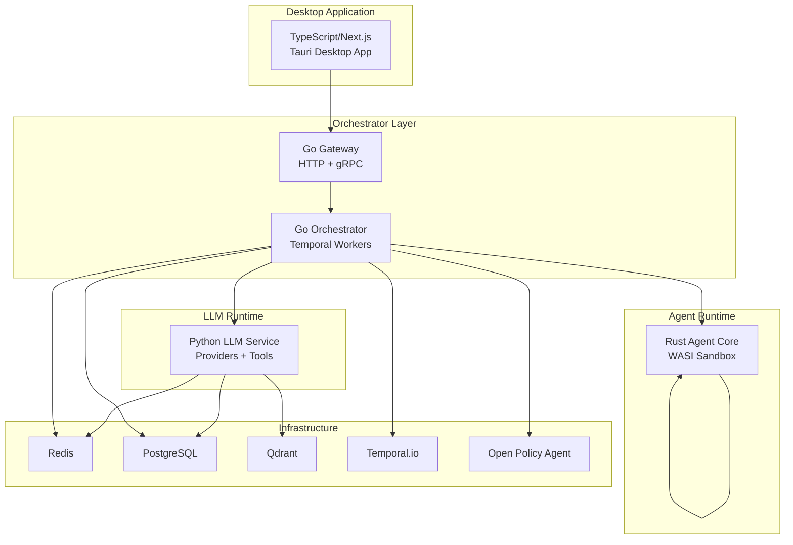
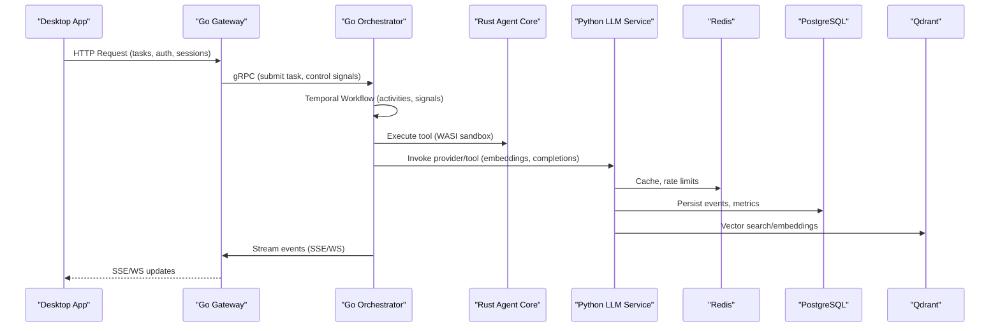
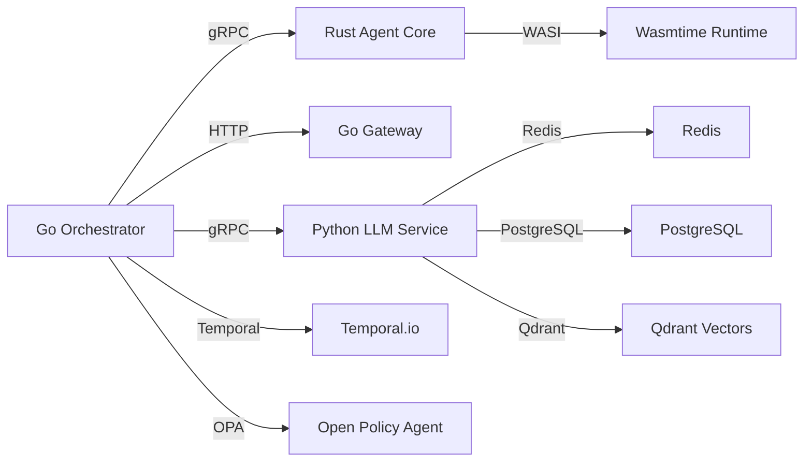

# Technology Stack

<cite>
**Referenced Files in This Document**
- [go.mod](file://go/orchestrator/go.mod)
- [Cargo.toml](file://rust/agent-core/Cargo.toml)
- [package.json](file://desktop/package.json)
- [requirements.txt](file://python/llm-service/requirements.txt)
- [docker-compose.yml](file://deploy/compose/docker-compose.yml)
- [README.md](file://config/opa/README.md)
- [wasi_sandbox.rs](file://rust/agent-core/src/wasi_sandbox.rs)
- [adapter.go](file://go/orchestrator/internal/temporal/adapter.go)
- [main.py](file://python/llm-service/main.py)
- [api.ts](file://desktop/lib/shannon/api.ts)
- [main.go](file://go/orchestrator/cmd/gateway/main.go)
- [python_wasi_executor.py](file://python/llm-service/llm_service/tools/builtin/python_wasi_executor.py)
- [Cargo.toml](file://desktop/src-tauri/Cargo.toml)
</cite>

## Table of Contents
1. [Introduction](#introduction)
2. [Project Structure](#project-structure)
3. [Core Components](#core-components)
4. [Architecture Overview](#architecture-overview)
5. [Detailed Component Analysis](#detailed-component-analysis)
6. [Dependency Analysis](#dependency-analysis)
7. [Performance Considerations](#performance-considerations)
8. [Troubleshooting Guide](#troubleshooting-guide)
9. [Conclusion](#conclusion)

## Introduction
This document describes the Shannon technology stack and its multi-language architecture. It explains the rationale for each technology choice—Go for the orchestrator service, Rust for the agent core with WASI sandbox, Python for LLM provider integration and tools, and TypeScript/Next.js for the desktop application—along with critical dependencies: Temporal.io for workflow orchestration, Open Policy Agent (OPA) for governance, Redis for caching and streaming, PostgreSQL for persistence, Qdrant for vector similarity search, and Wasmtime for WASI sandbox execution. It also covers version requirements, compatibility considerations, and integration patterns across services.

## Project Structure
Shannon is organized as a polyglot microservices architecture:
- Go-based orchestrator service with gRPC and HTTP gateway
- Rust-based agent core with WASI sandbox and tool execution
- Python-based LLM service integrating multiple providers and tools
- TypeScript/Next.js desktop application with Tauri for native builds
- Supporting infrastructure: Temporal.io, Redis, PostgreSQL, Qdrant, Grafana/Prometheus

**Diagram sources**
- [docker-compose.yml](file://deploy/compose/docker-compose.yml#L14-L411)
- [main.go](file://go/orchestrator/cmd/gateway/main.go#L30-L639)
- [main.py](file://python/llm-service/main.py#L1-L164)
- [wasi_sandbox.rs](file://rust/agent-core/src/wasi_sandbox.rs#L1-L498)

**Section sources**
- [docker-compose.yml](file://deploy/compose/docker-compose.yml#L14-L411)

## Core Components
- Go orchestrator service: Provides gRPC APIs, workflow orchestration via Temporal, policy enforcement via OPA, and persistence via PostgreSQL. It exposes an HTTP gateway for OpenAI-compatible endpoints and SSE/WS streaming.
- Rust agent core: Implements WASI sandbox execution, tool registry, and secure code execution. Integrates with OPA for enforcement and supports distributed rate limiting via Redis.
- Python LLM service: FastAPI-based service integrating multiple LLM providers, tool execution (including Python WASI executor), caching, and observability.
- TypeScript/Next.js desktop application: React-based UI with Tauri for native desktop builds, communicating with the gateway via REST and SSE.

**Section sources**
- [main.go](file://go/orchestrator/cmd/gateway/main.go#L30-L639)
- [wasi_sandbox.rs](file://rust/agent-core/src/wasi_sandbox.rs#L1-L498)
- [main.py](file://python/llm-service/main.py#L1-L164)
- [api.ts](file://desktop/lib/shannon/api.ts#L1-L717)

## Architecture Overview
Shannon’s runtime architecture integrates multiple languages and runtimes:
- Orchestration: Temporal workflows coordinate long-running tasks and retries.
- Policy: OPA evaluates allow/deny decisions and enforces safety rules.
- Sandboxing: Wasmtime/WASI isolates untrusted tool execution.
- Streaming: Redis-backed SSE and WebSocket endpoints deliver real-time updates.
- Persistence: PostgreSQL stores sessions, tasks, and audit logs.
- Vector search: Qdrant powers semantic similarity retrieval.
- Observability: Prometheus metrics and OpenTelemetry traces.

**Diagram sources**
- [docker-compose.yml](file://deploy/compose/docker-compose.yml#L14-L411)
- [main.go](file://go/orchestrator/cmd/gateway/main.go#L30-L639)
- [main.py](file://python/llm-service/main.py#L1-L164)
- [wasi_sandbox.rs](file://rust/agent-core/src/wasi_sandbox.rs#L1-L498)

## Detailed Component Analysis

### Go Orchestrator Service
- Purpose: Central coordinator for tasks, sessions, approvals, scheduling, and streaming. Exposes OpenAI-compatible endpoints and SSE/WS.
- Technologies: Go 1.24+, gRPC, HTTP mux, Redis, PostgreSQL, Temporal SDK, OpenTelemetry, OPA.
- Key integration patterns:
  - Temporal workers and logger adapter for structured logging.
  - Redis for rate limiting, idempotency, and streaming.
  - PostgreSQL for durable state and audit logs.
  - OPA for policy enforcement and governance.
  - OpenTelemetry for distributed tracing and metrics.

Version and compatibility highlights:
- Go 1.24.0 module with Temporal SDK v1.31.0 and API v1.43.0.
- OpenTelemetry SDK v1.38.0 and exporters.
- Redis client libraries v8 and v9 coexist for compatibility.

**Section sources**
- [go.mod](file://go/orchestrator/go.mod#L1-L99)
- [adapter.go](file://go/orchestrator/internal/temporal/adapter.go#L1-L90)
- [main.go](file://go/orchestrator/cmd/gateway/main.go#L30-L639)

### Rust Agent Core (WASI Sandbox)
- Purpose: Secure tool execution via Wasmtime/WASI with configurable resource limits, timeouts, and filesystem isolation.
- Technologies: Tokio, Tonic, Wasmtime 28.0, wasmtime-wasi, OpenTelemetry, Prometheus.
- Key features:
  - Epoch-interruption-based timeouts and memory guard sizing.
  - Canonicalized allowed paths and read-only preopened directories.
  - argv-based interpreter invocation for Python WASI.
  - Metrics for tool execution and durations.

Security and performance:
- Enforces memory, table, instance, and memory limits.
- Disables network access by default; strict path canonicalization.
- Uses blocking threads for WASM execution to avoid async runtime conflicts.

**Section sources**
- [Cargo.toml](file://rust/agent-core/Cargo.toml#L1-L90)
- [wasi_sandbox.rs](file://rust/agent-core/src/wasi_sandbox.rs#L1-L498)

### Python LLM Service
- Purpose: Provider-agnostic LLM integration, tool execution, caching, and observability.
- Technologies: FastAPI 0.115.5, Uvicorn, gRPC, OpenAI/Azure Anthropic/Google clients, Redis, asyncpg, SQLAlchemy, OpenTelemetry.
- Key integration patterns:
  - gRPC client to Rust agent core for WASI execution.
  - Redis for caching and rate limiting.
  - PostgreSQL for persistence and metrics.
  - SSE/WS streaming via gateway proxy.
  - OpenTelemetry instrumentation for tracing.

**Section sources**
- [requirements.txt](file://python/llm-service/requirements.txt#L1-L62)
- [main.py](file://python/llm-service/main.py#L1-L164)
- [python_wasi_executor.py](file://python/llm-service/llm_service/tools/builtin/python_wasi_executor.py#L1-L426)

### TypeScript/Next.js Desktop Application
- Purpose: Native desktop UI built with Next.js and Tauri, communicating with the gateway over REST and SSE.
- Technologies: Next.js 16.0.3, React 19.2.0, Redux/RTK, Radix UI, Tauri 2.9.2, Tailwind.
- Integration patterns:
  - Authentication via API key, JWT bearer token, or X-User-Id fallback.
  - SSE URLs constructed with API key/token parameters.
  - Native shell and logging plugins via Tauri.

**Section sources**
- [package.json](file://desktop/package.json#L1-L62)
- [api.ts](file://desktop/lib/shannon/api.ts#L1-L717)
- [Cargo.toml](file://desktop/src-tauri/Cargo.toml#L1-L27)

### Governance and Policy (Open Policy Agent)
- Purpose: Enforce allow/deny rules, user allowlists, budget limits, and deny patterns.
- Configuration: YAML-driven policy mode (off/dry-run/enforce), audit logging, caching, and kill switches.
- Metrics: Policy evaluation counts, divergence tracking, latency, and cache performance.

**Section sources**
- [README.md](file://config/opa/README.md#L1-L422)

## Dependency Analysis
Critical dependencies and their roles:
- Temporal.io: Workflow orchestration and persistence for long-running tasks.
- Open Policy Agent: Policy evaluation and enforcement with hot-reload support.
- Redis: Caching, rate limiting, idempotency, and streaming.
- PostgreSQL: Persistent storage for sessions, tasks, and audit logs.
- Qdrant: Vector similarity search for embeddings.
- Wasmtime: WASI sandbox runtime for secure tool execution.

**Diagram sources**
- [docker-compose.yml](file://deploy/compose/docker-compose.yml#L14-L411)
- [wasi_sandbox.rs](file://rust/agent-core/src/wasi_sandbox.rs#L1-L498)

**Section sources**
- [docker-compose.yml](file://deploy/compose/docker-compose.yml#L14-L411)

## Performance Considerations
- Go orchestrator leverages gRPC for low overhead and streaming; HTTP gateway adds CORS and middleware for development.
- Rust agent core uses blocking WASM execution to avoid async runtime conflicts and applies epoch-based timeouts and memory guards.
- Python LLM service employs asynchronous I/O, caching, and OpenTelemetry for observability without impacting throughput.
- Infrastructure scaling: Redis for caching and rate limiting, PostgreSQL for durability, Qdrant for vector search, and Temporal for reliable workflows.

[No sources needed since this section provides general guidance]

## Troubleshooting Guide
- Policy not enforcing:
  - Verify policy.enabled and mode in configuration; confirm path correctness and hot-reload.
- WASI sandbox failures:
  - Check allowed paths, module format, and memory/table limits; validate canonicalization.
- gRPC connectivity:
  - Ensure agent-core address and timeouts; inspect tool parameter structure and argv format.
- Streaming issues:
  - Confirm SSE/WS proxy configuration and authentication parameters (API key/token).

**Section sources**
- [README.md](file://config/opa/README.md#L356-L422)
- [wasi_sandbox.rs](file://rust/agent-core/src/wasi_sandbox.rs#L124-L447)
- [python_wasi_executor.py](file://python/llm-service/llm_service/tools/builtin/python_wasi_executor.py#L327-L386)
- [main.go](file://go/orchestrator/cmd/gateway/main.go#L540-L600)

## Conclusion
Shannon’s multi-language stack balances performance, security, and developer productivity. Go provides robust orchestration and streaming, Rust delivers secure sandboxing, Python enables flexible LLM integrations, and TypeScript/Next.js powers a modern desktop experience. Together with Temporal, OPA, Redis, PostgreSQL, Qdrant, and Wasmtime, the system achieves scalable, observable, and governed AI agent workflows.