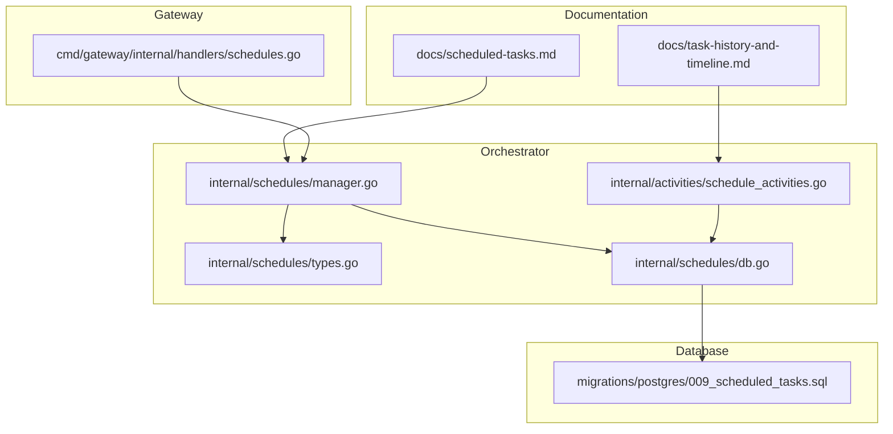
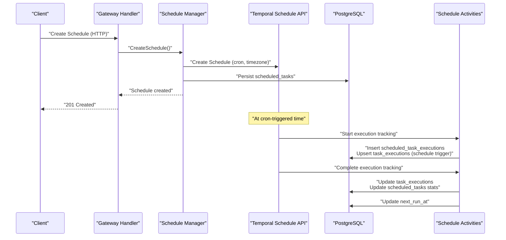
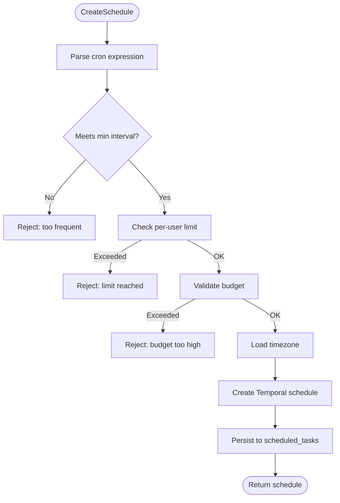
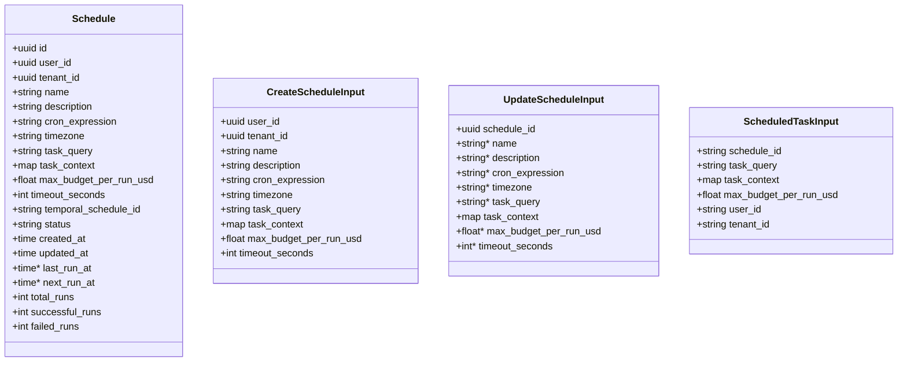
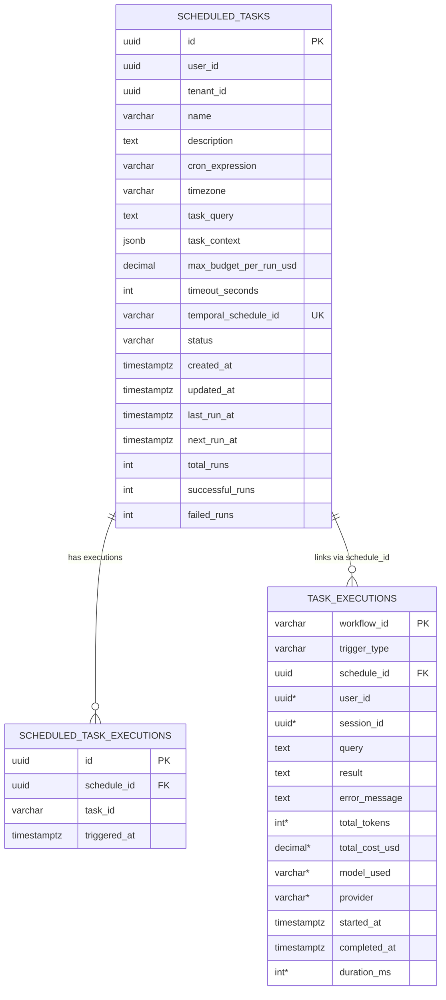
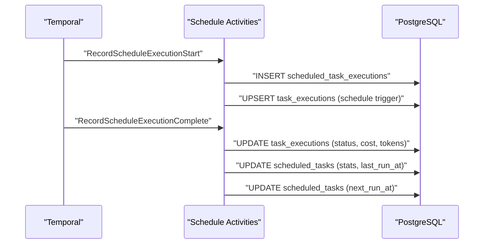
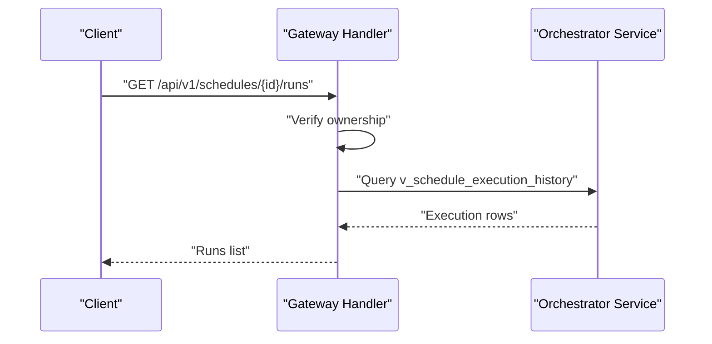
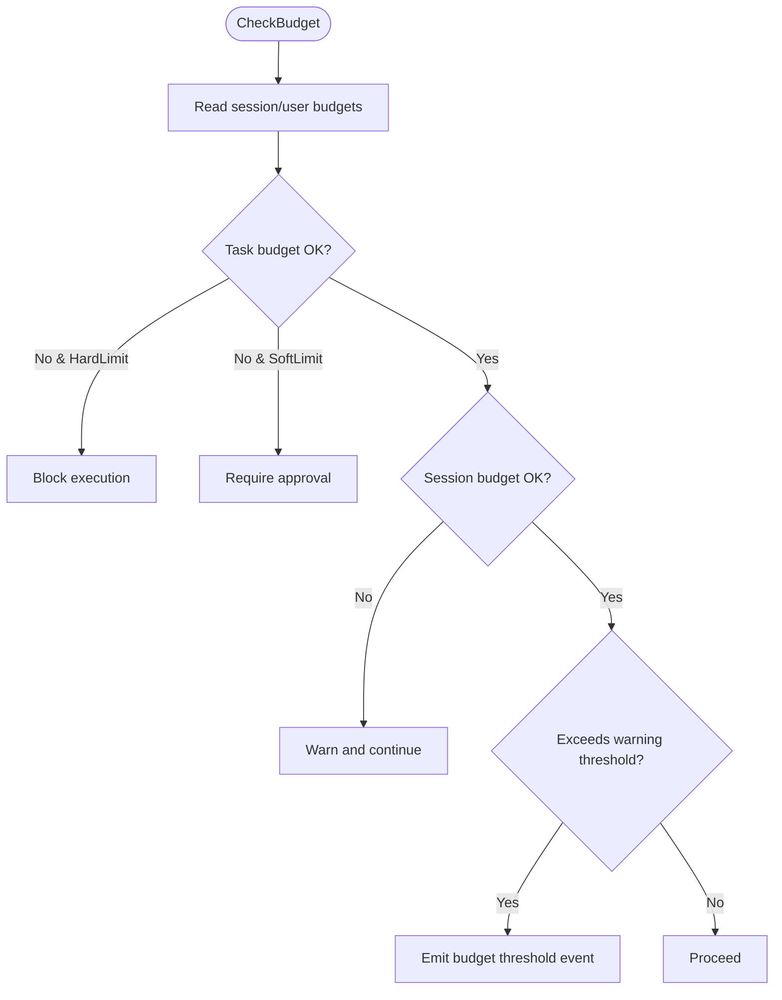
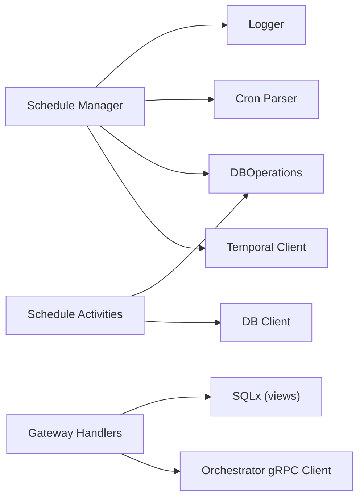

# Scheduling System

<cite>
**Referenced Files in This Document**
- [scheduled-tasks.md](file://docs/scheduled-tasks.md)
- [task-history-and-timeline.md](file://docs/task-history-and-timeline.md)
- [types.go](file://go/orchestrator/internal/schedules/types.go)
- [manager.go](file://go/orchestrator/internal/schedules/manager.go)
- [db.go](file://go/orchestrator/internal/schedules/db.go)
- [schedule_activities.go](file://go/orchestrator/internal/activities/schedule_activities.go)
- [schedules.go](file://go/orchestrator/cmd/gateway/internal/handlers/schedules.go)
- [009_scheduled_tasks.sql](file://migrations/postgres/009_scheduled_tasks.sql)
- [manager.go](file://go/orchestrator/internal/budget/manager.go)
</cite>

## Table of Contents
1. [Introduction](#introduction)
2. [Project Structure](#project-structure)
3. [Core Components](#core-components)
4. [Architecture Overview](#architecture-overview)
5. [Detailed Component Analysis](#detailed-component-analysis)
6. [Dependency Analysis](#dependency-analysis)
7. [Performance Considerations](#performance-considerations)
8. [Troubleshooting Guide](#troubleshooting-guide)
9. [Conclusion](#conclusion)
10. [Appendices](#appendices)

## Introduction
This document describes Shannon’s cron-based scheduling system for recurring workflow execution. It covers how to create and manage schedules, configure cron expressions and budgets, monitor execution history, and integrate with workflow templates. It also explains schedule persistence, failure handling, and operational best practices for high-frequency tasks.

## Project Structure
The scheduling system spans documentation, backend orchestration, database migrations, and gateway handlers:
- Documentation: scheduled task features, API, cron format, and database schema
- Backend: schedule manager, database operations, schedule activities, and workflow wrapper
- Gateway: HTTP handlers for schedule lifecycle operations
- Database: migration defining scheduled task tables and views

**Diagram sources**
- [scheduled-tasks.md](file://docs/scheduled-tasks.md#L1-L329)
- [task-history-and-timeline.md](file://docs/task-history-and-timeline.md#L1-L127)
- [schedules.go](file://go/orchestrator/cmd/gateway/internal/handlers/schedules.go#L1-L559)
- [manager.go](file://go/orchestrator/internal/schedules/manager.go#L1-L532)
- [types.go](file://go/orchestrator/internal/schedules/types.go#L1-L76)
- [db.go](file://go/orchestrator/internal/schedules/db.go#L1-L311)
- [schedule_activities.go](file://go/orchestrator/internal/activities/schedule_activities.go#L1-L327)
- [009_scheduled_tasks.sql](file://migrations/postgres/009_scheduled_tasks.sql#L1-L155)

**Section sources**
- [scheduled-tasks.md](file://docs/scheduled-tasks.md#L1-L329)
- [schedules.go](file://go/orchestrator/cmd/gateway/internal/handlers/schedules.go#L1-L559)
- [manager.go](file://go/orchestrator/internal/schedules/manager.go#L1-L532)
- [db.go](file://go/orchestrator/internal/schedules/db.go#L1-L311)
- [schedule_activities.go](file://go/orchestrator/internal/activities/schedule_activities.go#L1-L327)
- [009_scheduled_tasks.sql](file://migrations/postgres/009_scheduled_tasks.sql#L1-L155)

## Core Components
- Schedule Manager: Validates cron expressions, enforces resource limits, integrates with Temporal, persists schedules, and updates statistics.
- Schedule Types: Defines schedule model, create/update inputs, and workflow input.
- Database Operations: CRUD for schedules, listing, counting, and recording executions.
- Schedule Activities: Records start/end of scheduled runs, updates unified task execution records, and maintains schedule statistics.
- Gateway Handlers: Exposes REST endpoints for schedule lifecycle and execution history.
- Database Migration: Creates scheduled_tasks, scheduled_task_executions, and supporting indexes/views.

**Section sources**
- [manager.go](file://go/orchestrator/internal/schedules/manager.go#L1-L532)
- [types.go](file://go/orchestrator/internal/schedules/types.go#L1-L76)
- [db.go](file://go/orchestrator/internal/schedules/db.go#L1-L311)
- [schedule_activities.go](file://go/orchestrator/internal/activities/schedule_activities.go#L1-L327)
- [schedules.go](file://go/orchestrator/cmd/gateway/internal/handlers/schedules.go#L1-L559)
- [009_scheduled_tasks.sql](file://migrations/postgres/009_scheduled_tasks.sql#L1-L155)

## Architecture Overview
End-to-end flow from HTTP request to Temporal schedule and execution history:

**Diagram sources**
- [schedules.go](file://go/orchestrator/cmd/gateway/internal/handlers/schedules.go#L31-L99)
- [manager.go](file://go/orchestrator/internal/schedules/manager.go#L54-L169)
- [db.go](file://go/orchestrator/internal/schedules/db.go#L23-L39)
- [schedule_activities.go](file://go/orchestrator/internal/activities/schedule_activities.go#L39-L121)
- [schedule_activities.go](file://go/orchestrator/internal/activities/schedule_activities.go#L140-L263)

## Detailed Component Analysis

### Schedule Manager
Responsibilities:
- Validate cron expression and minimum interval
- Enforce per-user schedule limits and per-run budget caps
- Create/update/delete Temporal schedules
- Pause/resume schedules and recalculate next run
- Detect and clean orphaned schedules
- Maintain schedule statistics and next run time

Key behaviors:
- Cron parsing uses a five-field specification with minute/hour/dom/month/dow.
- Minimum interval enforcement ensures schedules meet a configurable threshold.
- Budget validation prevents overspending per run.
- Temporal schedule updates are performed atomically with database updates.

**Diagram sources**
- [manager.go](file://go/orchestrator/internal/schedules/manager.go#L54-L169)

**Section sources**
- [manager.go](file://go/orchestrator/internal/schedules/manager.go#L1-L532)

### Schedule Types
Defines the schedule model, creation/update inputs, and workflow input for scheduled tasks.

**Diagram sources**
- [types.go](file://go/orchestrator/internal/schedules/types.go#L16-L76)

**Section sources**
- [types.go](file://go/orchestrator/internal/schedules/types.go#L1-L76)

### Database Operations
Handles persistence for schedules and execution history:
- Create, get, list, update, and count schedules
- Update status and next run time
- Record execution start/end and update statistics
- Provide a convenience view for schedule execution history

**Diagram sources**
- [009_scheduled_tasks.sql](file://migrations/postgres/009_scheduled_tasks.sql#L30-L155)
- [db.go](file://go/orchestrator/internal/schedules/db.go#L23-L311)

**Section sources**
- [db.go](file://go/orchestrator/internal/schedules/db.go#L1-L311)
- [009_scheduled_tasks.sql](file://migrations/postgres/009_scheduled_tasks.sql#L1-L155)

### Schedule Activities
Records execution lifecycle and updates unified task execution records:
- Start: insert execution link and create/upsert task_executions with schedule trigger metadata
- Complete: update task_executions with status, cost, tokens, and duration; update schedule stats and next run

**Diagram sources**
- [schedule_activities.go](file://go/orchestrator/internal/activities/schedule_activities.go#L39-L121)
- [schedule_activities.go](file://go/orchestrator/internal/activities/schedule_activities.go#L140-L263)

**Section sources**
- [schedule_activities.go](file://go/orchestrator/internal/activities/schedule_activities.go#L1-L327)

### Gateway Handlers
Provides REST endpoints for schedule management and execution history:
- Create, get, list, update, pause, resume, delete schedules
- List schedule runs backed by a view joining schedule and task execution data

**Diagram sources**
- [schedules.go](file://go/orchestrator/cmd/gateway/internal/handlers/schedules.go#L421-L552)

**Section sources**
- [schedules.go](file://go/orchestrator/cmd/gateway/internal/handlers/schedules.go#L1-L559)

### Budget Management for Scheduled Tasks
While the schedule itself enforces per-run budget limits, the broader budget system tracks token usage and cost across tasks:
- Token budgets per task/session
- Warning thresholds and backpressure delays
- Cost estimation and usage reporting
- Idempotency for retry safety

**Diagram sources**
- [manager.go](file://go/orchestrator/internal/budget/manager.go#L175-L288)

**Section sources**
- [manager.go](file://go/orchestrator/internal/budget/manager.go#L1-L800)

## Dependency Analysis
- Schedule Manager depends on:
  - Temporal SDK for schedule operations
  - Database operations for persistence
  - Cron parser for validation
  - Logger for auditing
- Schedule Activities depend on:
  - Global DB client for unified task execution persistence
  - Database operations for schedule statistics
- Gateway Handlers depend on:
  - gRPC client to orchestrator service
  - SQLx for direct queries against views

**Diagram sources**
- [manager.go](file://go/orchestrator/internal/schedules/manager.go#L34-L52)
- [schedule_activities.go](file://go/orchestrator/internal/activities/schedule_activities.go#L16-L28)
- [schedules.go](file://go/orchestrator/cmd/gateway/internal/handlers/schedules.go#L17-L29)

**Section sources**
- [manager.go](file://go/orchestrator/internal/schedules/manager.go#L1-L532)
- [schedule_activities.go](file://go/orchestrator/internal/activities/schedule_activities.go#L1-L327)
- [schedules.go](file://go/orchestrator/cmd/gateway/internal/handlers/schedules.go#L1-L559)

## Performance Considerations
- High-frequency schedules:
  - Ensure minimum interval is set appropriately to avoid overwhelming the system.
  - Use budget controls to cap per-run cost and enable backpressure when nearing limits.
  - Monitor schedule statistics and execution history to detect anomalies.
- Execution history:
  - Use the unified task execution model to correlate scheduled runs with task timelines and events.
  - Leverage the view for efficient querying of schedule execution history.
- Observability:
  - Temporal UI for schedule status and recent executions.
  - Database queries for cost analysis and failure rates.

[No sources needed since this section provides general guidance]

## Troubleshooting Guide
Common issues and resolutions:
- Schedule creation failures:
  - Invalid cron expression or below-minimum interval: adjust cron or increase interval.
  - Per-user limit reached: reduce active schedules or increase limit.
  - Budget exceeds maximum: lower per-run budget.
- Execution failures:
  - Check scheduled_task_executions for error messages and status.
  - Review task_executions for model/provider/token/cost details.
- Orphaned schedules:
  - The manager detects missing Temporal schedules and marks them deleted in the database.
- Maintenance:
  - Use pause/resume endpoints to temporarily halt or restart schedules.
  - Soft-delete via delete endpoint; Temporal schedule is removed and DB status updated.

**Section sources**
- [manager.go](file://go/orchestrator/internal/schedules/manager.go#L451-L509)
- [db.go](file://go/orchestrator/internal/schedules/db.go#L275-L310)
- [schedules.go](file://go/orchestrator/cmd/gateway/internal/handlers/schedules.go#L251-L394)

## Conclusion
Shannon’s scheduling system provides robust cron-based automation with strong resource governance, unified execution tracking, and operational visibility. By combining Temporal’s native scheduling with PostgreSQL-backed persistence and a unified task execution model, operators can reliably manage recurring workflows, monitor performance, and maintain control over costs.

[No sources needed since this section summarizes without analyzing specific files]

## Appendices

### Practical Examples
- Creating a recurring task:
  - Use the create schedule endpoint with a cron expression, timezone, task query, and per-run budget.
- Configuring execution schedules:
  - Choose a five-field cron expression and timezone; ensure minimum interval compliance.
- Monitoring scheduled workflows:
  - Use the schedule runs endpoint to list executions and inspect status, cost, and tokens.
  - Query the view for aggregated history and join with task_executions for detailed insights.

**Section sources**
- [scheduled-tasks.md](file://docs/scheduled-tasks.md#L51-L188)
- [schedules.go](file://go/orchestrator/cmd/gateway/internal/handlers/schedules.go#L421-L552)
- [009_scheduled_tasks.sql](file://migrations/postgres/009_scheduled_tasks.sql#L129-L155)

### Schedule Optimization and Scaling
- Optimize cron expressions to align with workload patterns and minimize overlap.
- Use budget controls and backpressure to protect downstream systems under load.
- Scale by adjusting per-user limits and timeouts; monitor failure rates and cost trends.

**Section sources**
- [manager.go](file://go/orchestrator/internal/schedules/manager.go#L27-L32)
- [manager.go](file://go/orchestrator/internal/budget/manager.go#L677-L726)