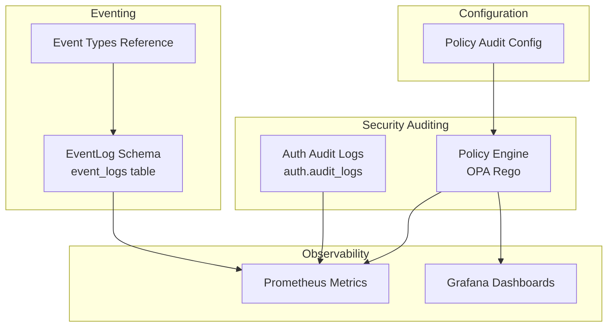
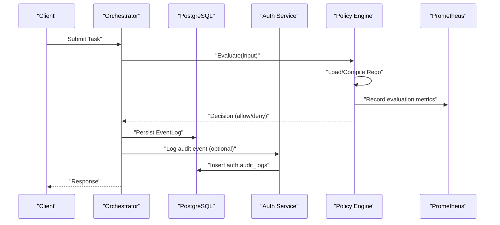
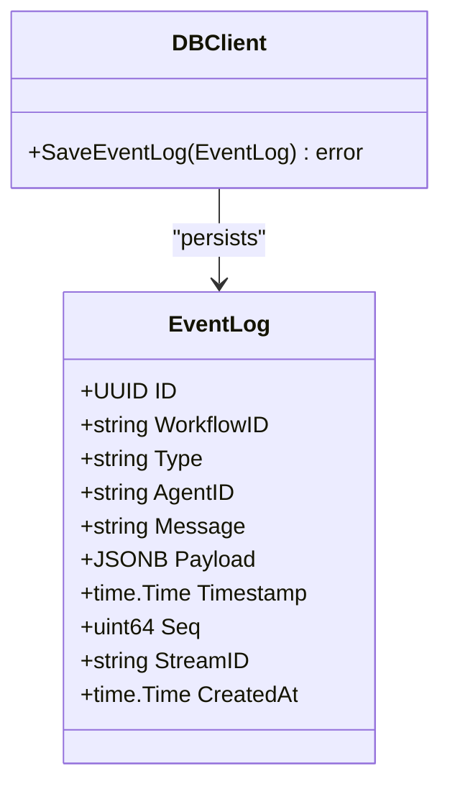
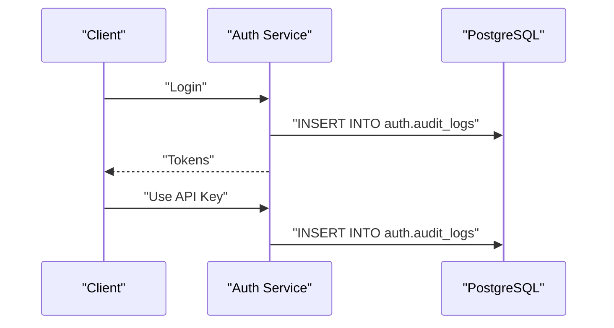
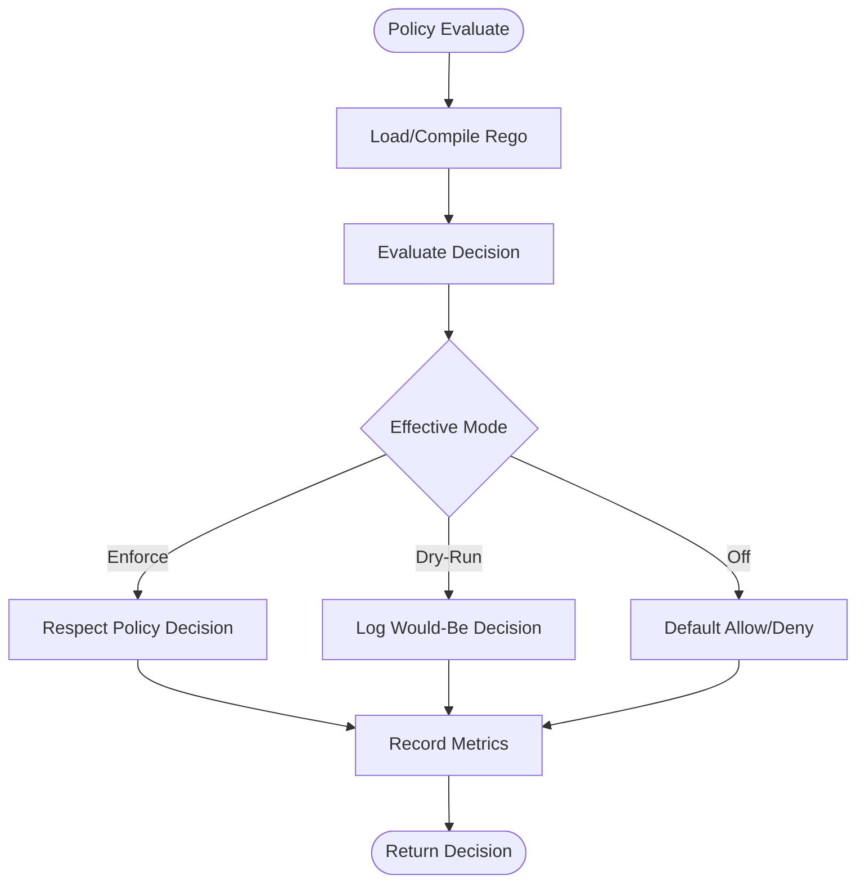
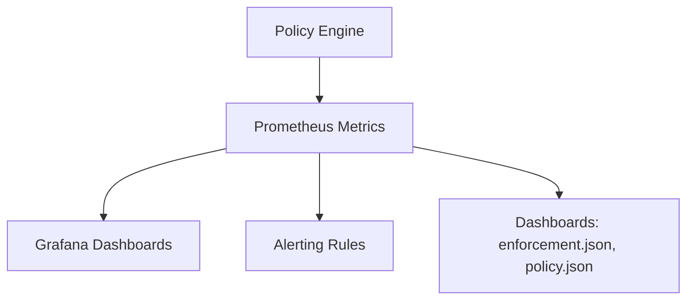
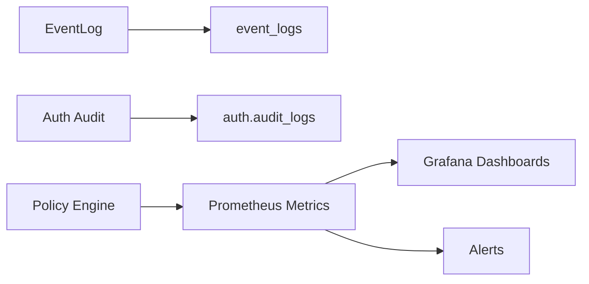

# Audit Trails and Compliance

<cite>
**Referenced Files in This Document**
- [event_log.go](file://go/orchestrator/internal/db/event_log.go)
- [models.go](file://go/orchestrator/internal/db/models.go)
- [service.go](file://go/orchestrator/internal/auth/service.go)
- [shannon.go](file://go/orchestrator/internal/config/shannon.go)
- [engine.go](file://go/orchestrator/internal/policy/engine.go)
- [metrics.go](file://go/orchestrator/internal/policy/metrics.go)
- [README.md](file://config/opa/README.md)
- [event-types.md](file://docs/event-types.md)
- [grafana.ini](file://deploy/compose/grafana/config/grafana.ini)
- [prometheus.yml](file://deploy/compose/grafana/config/provisioning/datasources/prometheus.yml)
- [dashboards/enforcement.json](file://observability/grafana/dashboards/enforcement.json)
- [dashboards/policy.json](file://observability/grafana/dashboards/policy.json)
- [alerts.yml](file://observability/prometheus/alerts.yml)
- [prometheus.yml](file://observability/prometheus/prometheus.yml)
- [tier-drift-monitoring.json](file://deploy/compose/grafana/config/provisioning/dashboards/tier-drift-monitoring.json)
- [node-exporter-1860.json](file://deploy/compose/grafana/config/provisioning/dashboards/node-exporter-1860.json)
</cite>

## Table of Contents
1. [Introduction](#introduction)
2. [Project Structure](#project-structure)
3. [Core Components](#core-components)
4. [Architecture Overview](#architecture-overview)
5. [Detailed Component Analysis](#detailed-component-analysis)
6. [Dependency Analysis](#dependency-analysis)
7. [Performance Considerations](#performance-considerations)
8. [Troubleshooting Guide](#troubleshooting-guide)
9. [Conclusion](#conclusion)
10. [Appendices](#appendices)

## Introduction
This document describes Shannon’s audit trail and compliance framework. It explains how events are generated and persisted, how long data is retained, and how compliance reporting is supported. It documents the event log schema, audit trail generation for security events, and compliance data export formats. It also covers metrics collection for security monitoring, policy enforcement tracking, and resource usage auditing, along with practical examples for configuration, reporting setup, and incident investigation workflows. Regulatory compliance and data privacy considerations are addressed alongside security monitoring dashboards, automated compliance checks, anomaly detection, and incident response procedures.

## Project Structure
Shannon’s audit and compliance capabilities span several subsystems:
- Event logging and persistence for workflow and streaming events
- Authentication audit logs for access and API key events
- Policy engine with configurable enforcement modes and audit logging
- Observability stack with Prometheus metrics and Grafana dashboards
- Configuration-driven policy audit settings

**Diagram sources**
- [event_log.go](file://go/orchestrator/internal/db/event_log.go#L10-L22)
- [event-types.md](file://docs/event-types.md#L582-L588)
- [service.go](file://go/orchestrator/internal/auth/service.go#L444-L465)
- [engine.go](file://go/orchestrator/internal/policy/engine.go#L85-L93)
- [metrics.go](file://go/orchestrator/internal/policy/metrics.go#L11-L143)
- [shannon.go](file://go/orchestrator/internal/config/shannon.go#L318-L324)

**Section sources**
- [event_log.go](file://go/orchestrator/internal/db/event_log.go#L10-L54)
- [event-types.md](file://docs/event-types.md#L582-L588)
- [service.go](file://go/orchestrator/internal/auth/service.go#L444-L465)
- [engine.go](file://go/orchestrator/internal/policy/engine.go#L85-L93)
- [metrics.go](file://go/orchestrator/internal/policy/metrics.go#L11-L143)
- [shannon.go](file://go/orchestrator/internal/config/shannon.go#L318-L324)

## Core Components
- Event log schema and persistence: Defines the event structure and PostgreSQL insertion logic for durable audit trails.
- Authentication audit logs: Records security-relevant user actions (login, API key usage, registration) with structured details.
- Policy engine with audit: Evaluates tasks against OPA policies, supports dry-run and enforce modes, and exposes comprehensive metrics for compliance and monitoring.
- Observability and dashboards: Provides Prometheus metrics and Grafana dashboards for policy decisions, cache performance, and operational insights.
- Configuration-driven policy audit: Allows enabling/disabling policy audit logging and controlling verbosity and inclusion of inputs/decisions.

**Section sources**
- [event_log.go](file://go/orchestrator/internal/db/event_log.go#L10-L54)
- [service.go](file://go/orchestrator/internal/auth/service.go#L444-L465)
- [engine.go](file://go/orchestrator/internal/policy/engine.go#L197-L282)
- [metrics.go](file://go/orchestrator/internal/policy/metrics.go#L145-L232)
- [shannon.go](file://go/orchestrator/internal/config/shannon.go#L318-L324)

## Architecture Overview
The audit and compliance architecture integrates event emission, persistence, security auditing, policy enforcement, and observability.

**Diagram sources**
- [engine.go](file://go/orchestrator/internal/policy/engine.go#L197-L282)
- [metrics.go](file://go/orchestrator/internal/policy/metrics.go#L145-L232)
- [event_log.go](file://go/orchestrator/internal/db/event_log.go#L24-L46)
- [service.go](file://go/orchestrator/internal/auth/service.go#L444-L465)

## Detailed Component Analysis

### Event Log Schema and Persistence
- EventLog structure includes identifiers, type, agent, message, payload, timestamps, sequence, and stream ID.
- SaveEventLog inserts rows into the event_logs table with conflict handling for ordered sequences.
- JSONB payload supports arbitrary structured data for richer audit contexts.
- Event types and filtering are documented in the event types reference.

**Diagram sources**
- [event_log.go](file://go/orchestrator/internal/db/event_log.go#L10-L22)
- [event_log.go](file://go/orchestrator/internal/db/event_log.go#L24-L46)

**Section sources**
- [event_log.go](file://go/orchestrator/internal/db/event_log.go#L10-L54)
- [models.go](file://go/orchestrator/internal/db/models.go#L12-L59)
- [event-types.md](file://docs/event-types.md#L582-L588)

### Authentication Audit Logs
- Security events such as login, registration, API key creation/use, and token refresh are logged into auth.audit_logs with event_type, user_id, tenant_id, and details.
- These logs support compliance by providing a tamper-evident record of access and administrative actions.

**Diagram sources**
- [service.go](file://go/orchestrator/internal/auth/service.go#L118-L168)
- [service.go](file://go/orchestrator/internal/auth/service.go#L243-L322)
- [service.go](file://go/orchestrator/internal/auth/service.go#L444-L465)

**Section sources**
- [service.go](file://go/orchestrator/internal/auth/service.go#L106-L116)
- [service.go](file://go/orchestrator/internal/auth/service.go#L118-L168)
- [service.go](file://go/orchestrator/internal/auth/service.go#L171-L241)
- [service.go](file://go/orchestrator/internal/auth/service.go#L243-L322)
- [service.go](file://go/orchestrator/internal/auth/service.go#L324-L390)
- [service.go](file://go/orchestrator/internal/auth/service.go#L444-L465)

### Policy Engine and Audit Logging
- The policy engine evaluates inputs against OPA Rego policies, supports canary rollouts, and records comprehensive metrics.
- Policy audit configuration enables logging of decisions with optional verbosity and inclusion of input/decision details.
- Metrics include evaluation counts, durations, cache performance, deny reasons, and SLO tracking.

**Diagram sources**
- [engine.go](file://go/orchestrator/internal/policy/engine.go#L197-L282)
- [engine.go](file://go/orchestrator/internal/policy/engine.go#L458-L594)
- [metrics.go](file://go/orchestrator/internal/policy/metrics.go#L145-L232)
- [shannon.go](file://go/orchestrator/internal/config/shannon.go#L318-L324)

**Section sources**
- [engine.go](file://go/orchestrator/internal/policy/engine.go#L197-L282)
- [engine.go](file://go/orchestrator/internal/policy/engine.go#L458-L594)
- [engine.go](file://go/orchestrator/internal/policy/engine.go#L609-L716)
- [metrics.go](file://go/orchestrator/internal/policy/metrics.go#L145-L232)
- [shannon.go](file://go/orchestrator/internal/config/shannon.go#L318-L324)
- [README.md](file://config/opa/README.md#L161-L232)

### Observability, Metrics, and Dashboards
- Prometheus metrics expose policy decisions, cache performance, latency SLOs, and deny reasons.
- Grafana dashboards visualize policy enforcement and cache behavior.
- Prometheus configuration and alerting rules support anomaly detection and incident response.

**Diagram sources**
- [metrics.go](file://go/orchestrator/internal/policy/metrics.go#L11-L143)
- [dashboards/enforcement.json](file://observability/grafana/dashboards/enforcement.json)
- [dashboards/policy.json](file://observability/grafana/dashboards/policy.json)
- [alerts.yml](file://observability/prometheus/alerts.yml)
- [prometheus.yml](file://observability/prometheus/prometheus.yml)

**Section sources**
- [metrics.go](file://go/orchestrator/internal/policy/metrics.go#L11-L143)
- [dashboards/enforcement.json](file://observability/grafana/dashboards/enforcement.json)
- [dashboards/policy.json](file://observability/grafana/dashboards/policy.json)
- [alerts.yml](file://observability/prometheus/alerts.yml)
- [prometheus.yml](file://observability/prometheus/prometheus.yml)

## Dependency Analysis
- Event persistence depends on the EventLog schema and SaveEventLog logic.
- Authentication audit logging depends on the auth.audit_logs table and structured details.
- Policy engine depends on OPA Rego policies and records metrics consumed by observability.
- Observability depends on Prometheus metric exports and Grafana provisioning.

**Diagram sources**
- [event_log.go](file://go/orchestrator/internal/db/event_log.go#L24-L46)
- [service.go](file://go/orchestrator/internal/auth/service.go#L444-L465)
- [engine.go](file://go/orchestrator/internal/policy/engine.go#L197-L282)
- [metrics.go](file://go/orchestrator/internal/policy/metrics.go#L145-L232)

**Section sources**
- [event_log.go](file://go/orchestrator/internal/db/event_log.go#L24-L46)
- [service.go](file://go/orchestrator/internal/auth/service.go#L444-L465)
- [engine.go](file://go/orchestrator/internal/policy/engine.go#L197-L282)
- [metrics.go](file://go/orchestrator/internal/policy/metrics.go#L145-L232)

## Performance Considerations
- Policy evaluation is optimized with an in-memory LRU cache and deterministic hashing for canary rollouts.
- Metrics are recorded with histograms and counters to track latency SLOs and error rates.
- Event persistence uses conflict resolution for ordered sequences to avoid duplicates.

[No sources needed since this section provides general guidance]

## Troubleshooting Guide
- Policy not enforcing: Verify policy.enabled and mode settings; confirm policy path and file syntax; check orchestrator logs for compilation errors.
- Unexpected denials: Review deny rules precedence and user allowlists; ensure environment labels match policy rules.
- Audit logs missing: Check auth audit logging calls and database connectivity; verify event_logs retention and indexing.
- Metrics not appearing: Confirm Prometheus scrape configuration and endpoint exposure; validate Grafana datasource and dashboard provisioning.

**Section sources**
- [README.md](file://config/opa/README.md#L356-L372)
- [service.go](file://go/orchestrator/internal/auth/service.go#L444-L465)
- [event_log.go](file://go/orchestrator/internal/db/event_log.go#L24-L46)
- [metrics.go](file://go/orchestrator/internal/policy/metrics.go#L145-L232)

## Conclusion
Shannon’s audit and compliance framework combines persistent event logging, authentication audit trails, configurable policy enforcement, and robust observability. Together, these components enable comprehensive security monitoring, compliance reporting, and incident response workflows while maintaining performance and operational simplicity.

[No sources needed since this section summarizes without analyzing specific files]

## Appendices

### Event Log Schema Reference
- Fields: workflow_id, type, agent_id, message, timestamp, seq, stream_id, payload, created_at.
- Persistence: Insert into event_logs with conflict handling on (workflow_id, type, seq) where seq is present.
- JSONB payload supports structured audit data.

**Section sources**
- [event_log.go](file://go/orchestrator/internal/db/event_log.go#L10-L54)
- [models.go](file://go/orchestrator/internal/db/models.go#L12-L59)

### Security Event Audit Coverage
- Authentication: Registration, login, API key creation/use, token refresh.
- Access attempts: Failed login events are audited.
- Administrative actions: API key lifecycle events captured.

**Section sources**
- [service.go](file://go/orchestrator/internal/auth/service.go#L106-L116)
- [service.go](file://go/orchestrator/internal/auth/service.go#L118-L168)
- [service.go](file://go/orchestrator/internal/auth/service.go#L243-L322)
- [service.go](file://go/orchestrator/internal/auth/service.go#L324-L390)
- [service.go](file://go/orchestrator/internal/auth/service.go#L444-L465)

### Policy Audit Configuration
- Enable/disable policy audit logging.
- Control log level and inclusion of input/decision details.
- Environment-specific defaults and production hardening options.

**Section sources**
- [shannon.go](file://go/orchestrator/internal/config/shannon.go#L318-L324)
- [shannon.go](file://go/orchestrator/internal/config/shannon.go#L1213-L1227)
- [README.md](file://config/opa/README.md#L161-L232)

### Compliance Reporting and Data Retention
- Event retention: Historical events are queryable via REST APIs; real-time streaming uses bounded buffers; persistent audit trail stored in PostgreSQL.
- Export formats: Event logs and audit logs are stored in structured formats suitable for SIEM ingestion and compliance reporting.
- Retention: Controlled by database policies and operational procedures; event_logs table provides durable storage.

**Section sources**
- [event-types.md](file://docs/event-types.md#L582-L588)
- [event_log.go](file://go/orchestrator/internal/db/event_log.go#L24-L46)

### Security Monitoring Dashboards
- Grafana dashboards for policy enforcement and cache performance.
- Prometheus metrics for latency SLOs, cache hits/misses, and deny reasons.
- Alerting rules for anomaly detection and incident response.

**Section sources**
- [dashboards/enforcement.json](file://observability/grafana/dashboards/enforcement.json)
- [dashboards/policy.json](file://observability/grafana/dashboards/policy.json)
- [metrics.go](file://go/orchestrator/internal/policy/metrics.go#L11-L143)
- [alerts.yml](file://observability/prometheus/alerts.yml)
- [prometheus.yml](file://observability/prometheus/prometheus.yml)

### Practical Examples

- Audit configuration example:
  - Enable policy audit logging with desired verbosity and include input/decision details.
  - Example YAML snippet path: [Policy Audit Config](file://config/opa/README.md#L161-L232)

- Compliance reporting setup:
  - Expose Prometheus metrics endpoint and provision Grafana dashboards.
  - Example paths: [Prometheus config](file://observability/prometheus/prometheus.yml), [Grafana dashboards](file://observability/grafana/dashboards/enforcement.json), [Grafana dashboards](file://observability/grafana/dashboards/policy.json)

- Security incident investigation workflow:
  - Query auth.audit_logs for suspicious access attempts.
  - Filter event_logs by workflow_id and types to reconstruct timelines.
  - Use Grafana dashboards to correlate policy decisions and cache performance anomalies.

**Section sources**
- [service.go](file://go/orchestrator/internal/auth/service.go#L126-L139)
- [event-types.md](file://docs/event-types.md#L497-L511)
- [dashboards/enforcement.json](file://observability/grafana/dashboards/enforcement.json)
- [dashboards/policy.json](file://observability/grafana/dashboards/policy.json)

### Regulatory Compliance and Privacy Considerations
- Data minimization: Policy audit logging can exclude sensitive inputs based on configuration.
- Audit completeness: Persistent event_logs and auth.audit_logs provide tamper-evident records.
- Observability hygiene: Metrics and logs should be redacted to protect privacy; environment labels help segment data by sensitivity.

**Section sources**
- [shannon.go](file://go/orchestrator/internal/config/shannon.go#L318-L324)
- [README.md](file://config/opa/README.md#L416-L422)
- [event-types.md](file://docs/event-types.md#L134-L147)

### Automated Compliance Checks and Anomaly Detection
- Policy decision metrics and SLO tracking enable automated compliance checks.
- Anomaly detection via Prometheus alerting rules and Grafana dashboards.
- Incident response: Use dashboards to triage issues, correlate policy decisions, and review audit trails.

**Section sources**
- [metrics.go](file://go/orchestrator/internal/policy/metrics.go#L145-L232)
- [alerts.yml](file://observability/prometheus/alerts.yml)
- [dashboards/enforcement.json](file://observability/grafana/dashboards/enforcement.json)
- [dashboards/policy.json](file://observability/grafana/dashboards/policy.json)