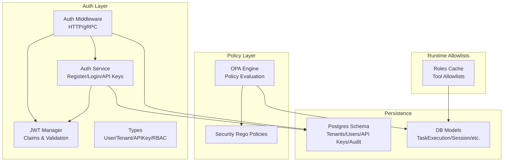
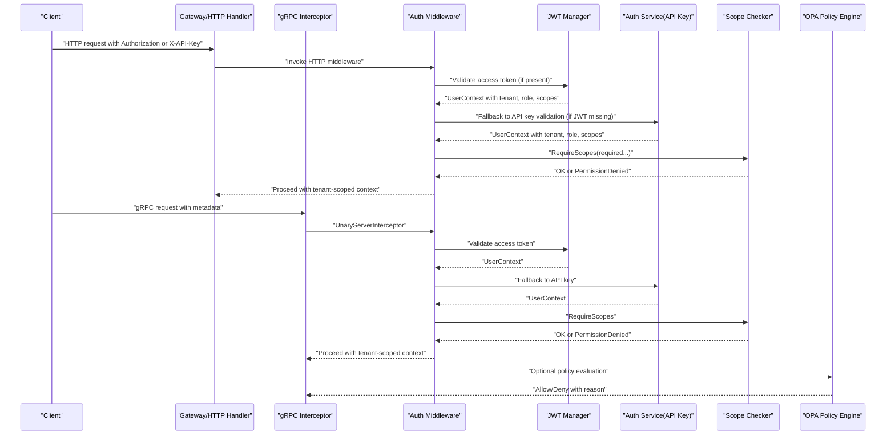
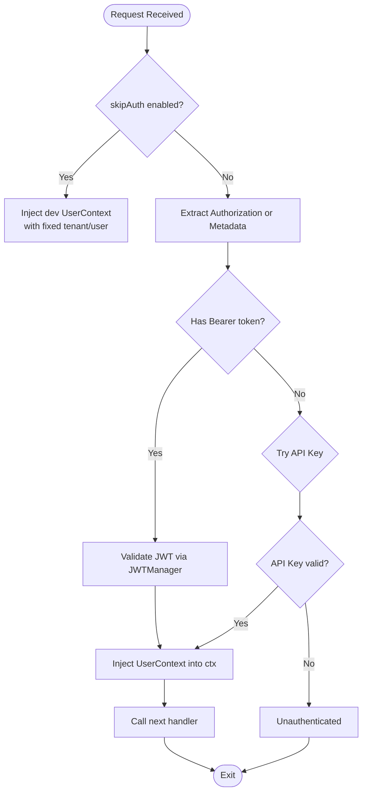
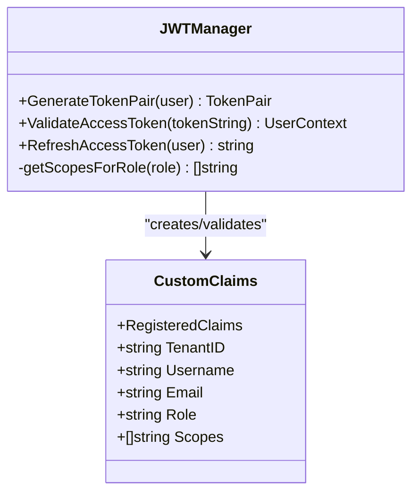
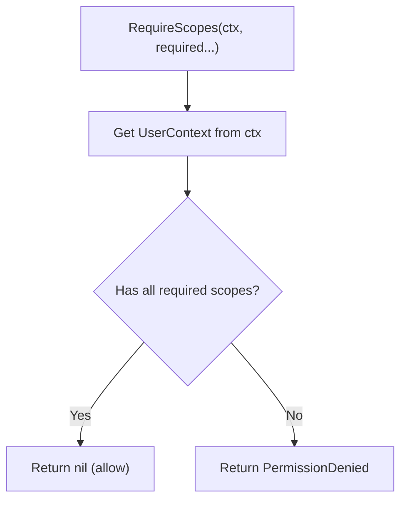
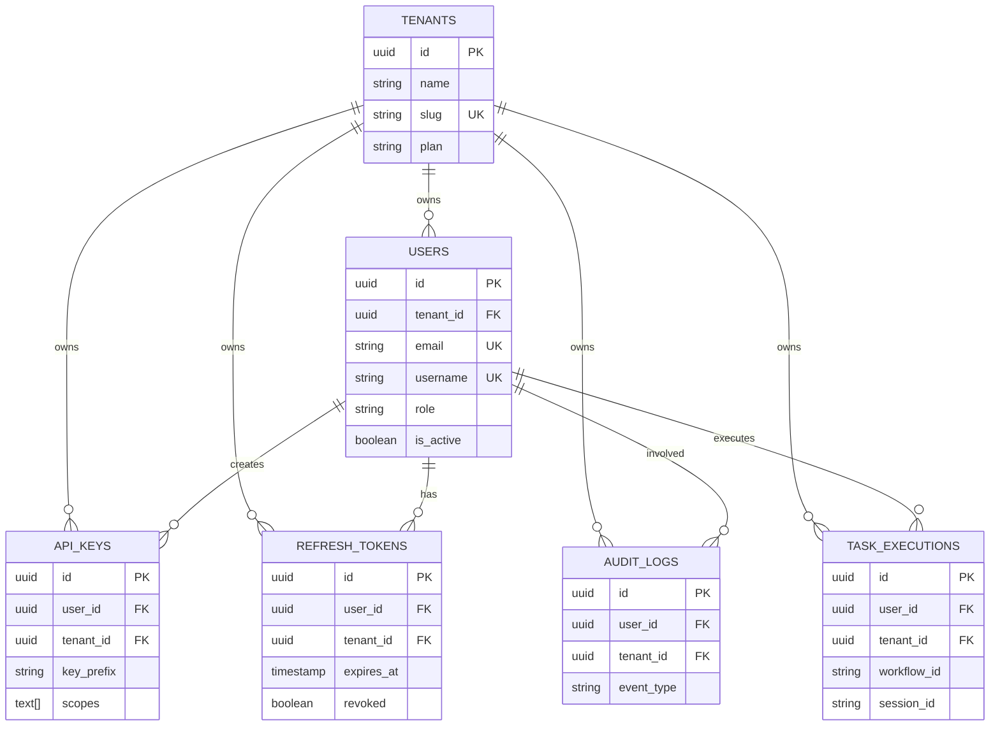
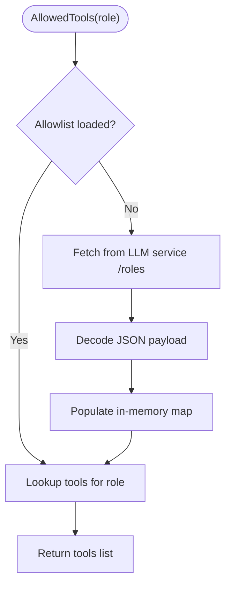
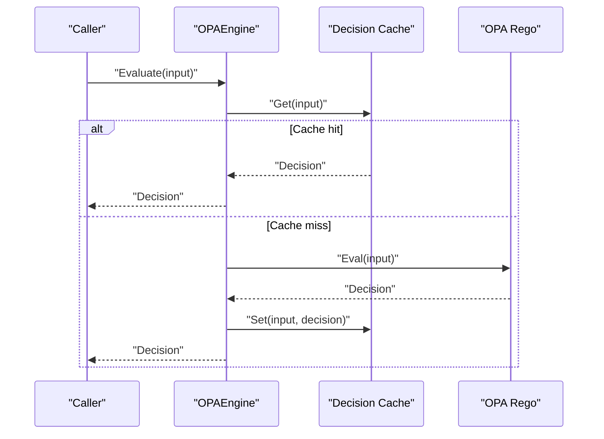
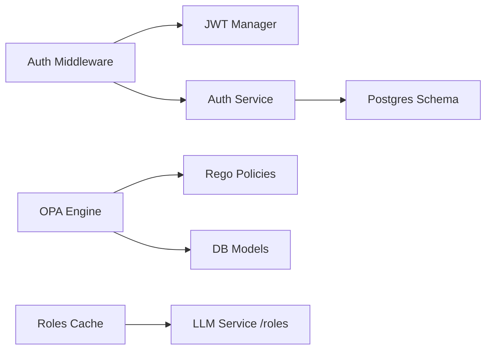

# Multi-Tenant Isolation and Security

<cite>
**Referenced Files in This Document**
- [middleware.go](file://go/orchestrator/internal/auth/middleware.go)
- [jwt.go](file://go/orchestrator/internal/auth/jwt.go)
- [types.go](file://go/orchestrator/internal/auth/types.go)
- [service.go](file://go/orchestrator/internal/auth/service.go)
- [cache.go](file://go/orchestrator/internal/roles/cache.go)
- [engine.go](file://go/orchestrator/internal/policy/engine.go)
- [security.rego](file://config/opa/policies/security.rego)
- [003_authentication.sql](file://migrations/postgres/003_authentication.sql)
- [models.go](file://go/orchestrator/internal/db/models.go)
</cite>

## Table of Contents
1. [Introduction](#introduction)
2. [Project Structure](#project-structure)
3. [Core Components](#core-components)
4. [Architecture Overview](#architecture-overview)
5. [Detailed Component Analysis](#detailed-component-analysis)
6. [Dependency Analysis](#dependency-analysis)
7. [Performance Considerations](#performance-considerations)
8. [Troubleshooting Guide](#troubleshooting-guide)
9. [Conclusion](#conclusion)
10. [Appendices](#appendices)

## Introduction
This document explains Shannon’s multi-tenant isolation and security mechanisms with a focus on:
- JWT-based authentication and token validation
- Role-based access control (RBAC) with scope-based authorization
- Tenant scoping for resource isolation
- Authentication middleware pipeline and tenant context propagation
- Cache management for tenant roles and session isolation
- Cross-tenant data protection, onboarding, permission management, compliance, monitoring, and least-privilege enforcement

## Project Structure
Shannon’s multi-tenant security spans several layers:
- Authentication and RBAC: JWT handling, API keys, user/tenant models, and scope enforcement
- Middleware: HTTP and gRPC authentication pipelines
- Policy engine: OPA-based policy evaluation for security gating
- Persistence: Postgres schema supporting tenants, users, API keys, and audit logs
- Runtime role allowlists: cached tool allowlists for agents

**Diagram sources**
- [middleware.go](file://go/orchestrator/internal/auth/middleware.go#L1-L227)
- [jwt.go](file://go/orchestrator/internal/auth/jwt.go#L1-L211)
- [service.go](file://go/orchestrator/internal/auth/service.go#L1-L485)
- [types.go](file://go/orchestrator/internal/auth/types.go#L1-L190)
- [engine.go](file://go/orchestrator/internal/policy/engine.go#L1-L748)
- [security.rego](file://config/opa/policies/security.rego#L1-L52)
- [003_authentication.sql](file://migrations/postgres/003_authentication.sql#L1-L153)
- [models.go](file://go/orchestrator/internal/db/models.go#L1-L245)
- [cache.go](file://go/orchestrator/internal/roles/cache.go#L1-L129)

**Section sources**
- [middleware.go](file://go/orchestrator/internal/auth/middleware.go#L1-L227)
- [jwt.go](file://go/orchestrator/internal/auth/jwt.go#L1-L211)
- [service.go](file://go/orchestrator/internal/auth/service.go#L1-L485)
- [types.go](file://go/orchestrator/internal/auth/types.go#L1-L190)
- [engine.go](file://go/orchestrator/internal/policy/engine.go#L1-L748)
- [security.rego](file://config/opa/policies/security.rego#L1-L52)
- [003_authentication.sql](file://migrations/postgres/003_authentication.sql#L1-L153)
- [models.go](file://go/orchestrator/internal/db/models.go#L1-L245)
- [cache.go](file://go/orchestrator/internal/roles/cache.go#L1-L129)

## Core Components
- Authentication middleware: Extracts credentials from HTTP headers or gRPC metadata, validates JWT or API keys, and injects a tenant-scoped user context into the request context.
- JWT manager: Generates signed access tokens with tenant, role, and scope claims; validates tokens and enforces issuer and signature checks.
- Auth service: Implements registration, login, refresh token rotation, and API key creation/validation with constant-time comparisons and audit logging.
- RBAC and scopes: Roles map to default scopes; scope checks are enforced at runtime.
- Policy engine: OPA-based evaluation of security policies with canary modes and caching.
- Persistence: Postgres schema with tenants, users, API keys, refresh tokens, and audit logs; tables include tenant_id for isolation.
- Roles cache: Loads and caches tool allowlists from the LLM service for agent role enforcement.

**Section sources**
- [middleware.go](file://go/orchestrator/internal/auth/middleware.go#L1-L227)
- [jwt.go](file://go/orchestrator/internal/auth/jwt.go#L1-L211)
- [service.go](file://go/orchestrator/internal/auth/service.go#L1-L485)
- [types.go](file://go/orchestrator/internal/auth/types.go#L165-L190)
- [engine.go](file://go/orchestrator/internal/policy/engine.go#L1-L748)
- [003_authentication.sql](file://migrations/postgres/003_authentication.sql#L1-L153)
- [cache.go](file://go/orchestrator/internal/roles/cache.go#L1-L129)

## Architecture Overview
The authentication and authorization pipeline ensures tenant isolation and least-privilege access:

**Diagram sources**
- [middleware.go](file://go/orchestrator/internal/auth/middleware.go#L40-L193)
- [jwt.go](file://go/orchestrator/internal/auth/jwt.go#L94-L143)
- [service.go](file://go/orchestrator/internal/auth/service.go#L243-L322)
- [engine.go](file://go/orchestrator/internal/policy/engine.go#L197-L282)

## Detailed Component Analysis

### Authentication Middleware Pipeline
- HTTP middleware supports:
  - Bearer token extraction and JWT validation
  - API key fallback via header or query param for streaming endpoints
  - Dev-mode bypass with configurable user/tenant IDs
- gRPC interceptor supports:
  - Authorization header extraction
  - API key metadata fallback
  - Health check bypass
  - Dev-mode override via x-user-id and x-tenant-id metadata

**Diagram sources**
- [middleware.go](file://go/orchestrator/internal/auth/middleware.go#L40-L193)

**Section sources**
- [middleware.go](file://go/orchestrator/internal/auth/middleware.go#L40-L193)

### JWT-Based Authentication and Token Validation
- Claims include tenant_id, username, email, role, and scopes.
- Issuer validation and HMAC signature verification.
- Access token expiry enforced; refresh tokens stored securely and rotated atomically.

**Diagram sources**
- [jwt.go](file://go/orchestrator/internal/auth/jwt.go#L17-L143)

**Section sources**
- [jwt.go](file://go/orchestrator/internal/auth/jwt.go#L17-L143)

### Role-Based Access Control (RBAC) and Scope Enforcement
- Roles map to default scopes:
  - Owner/Admin/User with progressively fewer scopes
- Scope checking performed via RequireScopes, which compares required scopes against user context scopes.
- API keys carry explicit scopes for programmatic access.

**Diagram sources**
- [middleware.go](file://go/orchestrator/internal/auth/middleware.go#L195-L217)
- [types.go](file://go/orchestrator/internal/auth/types.go#L165-L190)

**Section sources**
- [middleware.go](file://go/orchestrator/internal/auth/middleware.go#L195-L217)
- [types.go](file://go/orchestrator/internal/auth/types.go#L165-L190)

### Tenant Scoping and Cross-Tenant Data Protection
- UserContext carries TenantID, ensuring downstream services operate within the tenant boundary.
- Postgres schema includes tenant_id on users, API keys, refresh tokens, and audit logs.
- TaskExecution and session models include optional tenant_id for isolation.
- Middleware propagates tenant-scoped context; RBAC enforces scope-based access; policy engine can incorporate tenant context for decisions.

**Diagram sources**
- [003_authentication.sql](file://migrations/postgres/003_authentication.sql#L11-L104)
- [models.go](file://go/orchestrator/internal/db/models.go#L61-L102)
- [types.go](file://go/orchestrator/internal/auth/types.go#L36-L117)

**Section sources**
- [003_authentication.sql](file://migrations/postgres/003_authentication.sql#L11-L104)
- [models.go](file://go/orchestrator/internal/db/models.go#L61-L102)
- [types.go](file://go/orchestrator/internal/auth/types.go#L36-L117)

### Cache Management for Tenant Roles and Session Isolation
- Roles cache loads tool allowlists from the LLM service on demand and caches them in memory with RWMutex protection.
- Fetch timeout and retry behavior ensure resilience; refresh invalidates the cache and reloads.
- This cache is separate from tenant-scoped RBAC but informs agent-level tool usage policies.

**Diagram sources**
- [cache.go](file://go/orchestrator/internal/roles/cache.go#L33-L100)

**Section sources**
- [cache.go](file://go/orchestrator/internal/roles/cache.go#L1-L129)

### Policy Engine and Security Boundary Enforcement
- OPA-based policy engine compiles and evaluates policies from the configured directory.
- Decision cache reduces latency and avoids hot-path recomputation.
- Canary rollout and dry-run enforcement allow controlled policy activation.
- Security.rego demonstrates environment-aware gating, complexity thresholds, suspicious session detection, and token budget limits.

**Diagram sources**
- [engine.go](file://go/orchestrator/internal/policy/engine.go#L197-L282)
- [security.rego](file://config/opa/policies/security.rego#L1-L52)

**Section sources**
- [engine.go](file://go/orchestrator/internal/policy/engine.go#L1-L748)
- [security.rego](file://config/opa/policies/security.rego#L1-L52)

### Practical Examples

- Tenant configuration
  - Tenants are created with default limits and plan tiers; default dev tenant and admin user are seeded via migration.
  - Onboarding a new tenant: when registering without a tenant_id, a new tenant is provisioned automatically.

- Access control policies
  - Roles and scopes: Owner/Admin/User have distinct default scopes; API keys can be scoped to subsets.
  - Scope enforcement: Use RequireScopes to gate endpoints/methods.

- Security boundary enforcement
  - JWT issuer validation and HMAC signature verification
  - API key constant-time comparison and per-request last-used updates
  - Policy engine can enforce environment-specific rules and suspicious behavior detection

- Least-privilege access patterns
  - Default to minimal scopes for roles; grant only required scopes for API keys
  - Use canary modes to roll out stricter policies gradually

- Monitoring and compliance
  - Audit logs capture login/logout, token refresh, API key creation/deletion/usage, and permission changes
  - Policy engine emits metrics for evaluations, cache hits/misses, and mode comparisons

**Section sources**
- [003_authentication.sql](file://migrations/postgres/003_authentication.sql#L106-L133)
- [service.go](file://go/orchestrator/internal/auth/service.go#L38-L116)
- [types.go](file://go/orchestrator/internal/auth/types.go#L165-L190)
- [engine.go](file://go/orchestrator/internal/policy/engine.go#L596-L716)
- [security.rego](file://config/opa/policies/security.rego#L1-L52)

## Dependency Analysis
- Middleware depends on JWT manager and auth service for credential validation and user context injection.
- Auth service depends on Postgres schema for storing users, tenants, API keys, refresh tokens, and audit logs.
- Policy engine depends on OPA and Rego policies; integrates with runtime models for evaluation.
- Roles cache depends on LLM service endpoint and workflow HTTP transport wrapper.

**Diagram sources**
- [middleware.go](file://go/orchestrator/internal/auth/middleware.go#L23-L37)
- [jwt.go](file://go/orchestrator/internal/auth/jwt.go#L17-L33)
- [service.go](file://go/orchestrator/internal/auth/service.go#L18-L36)
- [003_authentication.sql](file://migrations/postgres/003_authentication.sql#L11-L104)
- [engine.go](file://go/orchestrator/internal/policy/engine.go#L117-L195)
- [cache.go](file://go/orchestrator/internal/roles/cache.go#L46-L84)

**Section sources**
- [middleware.go](file://go/orchestrator/internal/auth/middleware.go#L23-L37)
- [jwt.go](file://go/orchestrator/internal/auth/jwt.go#L17-L33)
- [service.go](file://go/orchestrator/internal/auth/service.go#L18-L36)
- [003_authentication.sql](file://migrations/postgres/003_authentication.sql#L11-L104)
- [engine.go](file://go/orchestrator/internal/policy/engine.go#L117-L195)
- [cache.go](file://go/orchestrator/internal/roles/cache.go#L46-L84)

## Performance Considerations
- JWT validation is lightweight; ensure issuer and algorithm checks are fast and constant-time.
- API key validation uses constant-time hash comparison and indexed prefix lookup to minimize risk and latency.
- Policy engine caches decisions with LRU eviction and TTL to reduce OPA evaluation overhead.
- Roles cache fetches allowlists with timeouts and protects against race conditions via RWMutex.
- Database queries leverage indexes on tenant_id and key_prefix to maintain performance under multi-tenant workloads.

[No sources needed since this section provides general guidance]

## Troubleshooting Guide
- Authentication failures
  - Missing or malformed Authorization header; verify Bearer token format and casing.
  - Invalid or expired JWT; confirm issuer and signing key alignment.
  - API key invalid/expired; ensure key prefix matches and key hash comparison succeeds.
- Scope denials
  - Confirm user role and associated default scopes; verify API key scopes if applicable.
- Policy evaluation issues
  - Engine disabled or no policies loaded; check configuration and policy directory.
  - Cache misses causing latency spikes; monitor cache hit ratio and TTL.
- Audit and compliance
  - Review audit logs for login/logout, token refresh, API key usage, and permission changes.
  - Investigate suspicious session patterns flagged by policy rules.

**Section sources**
- [middleware.go](file://go/orchestrator/internal/auth/middleware.go#L57-L113)
- [jwt.go](file://go/orchestrator/internal/auth/jwt.go#L94-L143)
- [service.go](file://go/orchestrator/internal/auth/service.go#L243-L322)
- [engine.go](file://go/orchestrator/internal/policy/engine.go#L197-L282)

## Conclusion
Shannon’s multi-tenant isolation combines strong authentication (JWT and API keys), strict RBAC with scope enforcement, tenant-scoped persistence, and an extensible policy engine. Together, these components enforce least-privilege access, protect cross-tenant data, and provide robust monitoring and compliance capabilities.

[No sources needed since this section summarizes without analyzing specific files]

## Appendices

### Appendix A: Tenant Onboarding and Permission Management
- Onboarding
  - New user registration without tenant_id provisions a new tenant and assigns Owner role.
  - Admin can manage users, roles, and API keys within a tenant.
- Permission management
  - Assign roles (Owner/Admin/User) and customize API key scopes for least-privilege access.
  - Monitor and audit all permission changes and sensitive actions.

**Section sources**
- [service.go](file://go/orchestrator/internal/auth/service.go#L38-L116)
- [types.go](file://go/orchestrator/internal/auth/types.go#L165-L190)
- [003_authentication.sql](file://migrations/postgres/003_authentication.sql#L106-L133)

### Appendix B: Compliance and Security Monitoring
- Audit logs capture key lifecycle events; export and retain per policy.
- Policy engine metrics track evaluation latency, cache effectiveness, and mode transitions.
- Security.rego provides environment-aware gating and anomaly detection hooks.

**Section sources**
- [003_authentication.sql](file://migrations/postgres/003_authentication.sql#L76-L86)
- [engine.go](file://go/orchestrator/internal/policy/engine.go#L609-L656)
- [security.rego](file://config/opa/policies/security.rego#L1-L52)