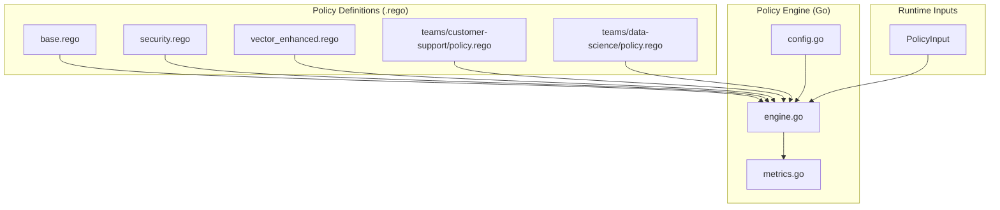
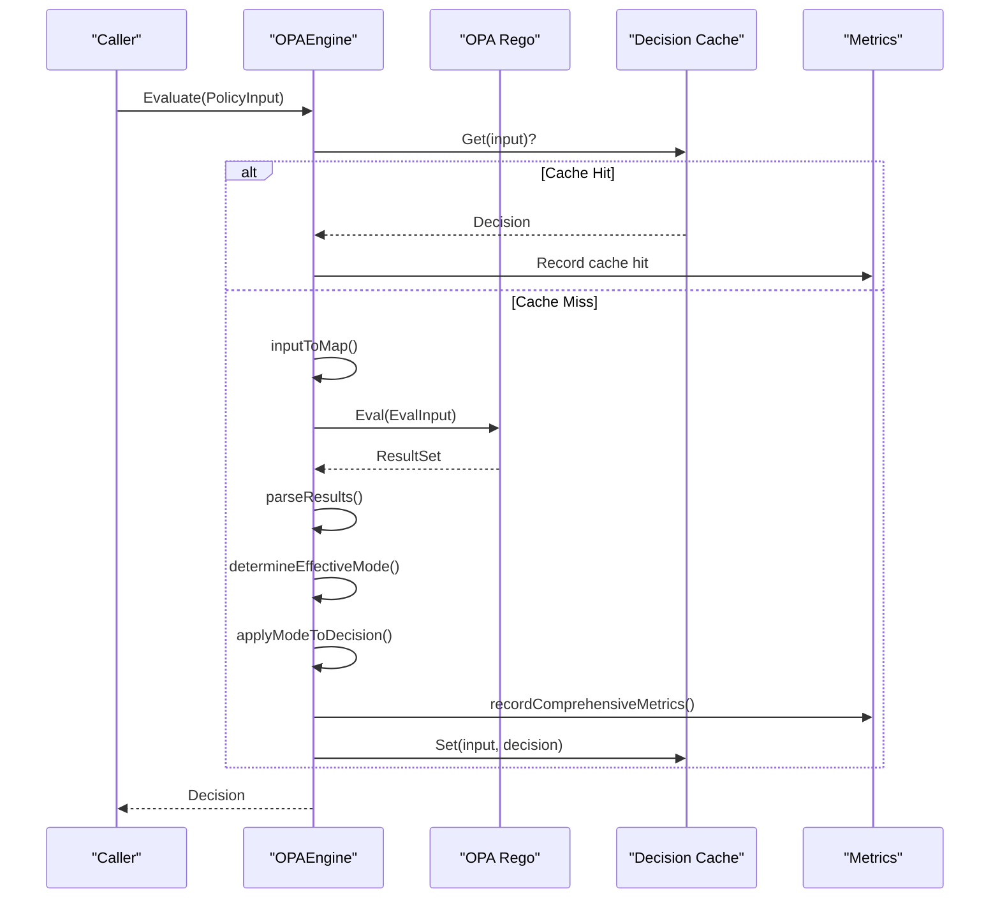
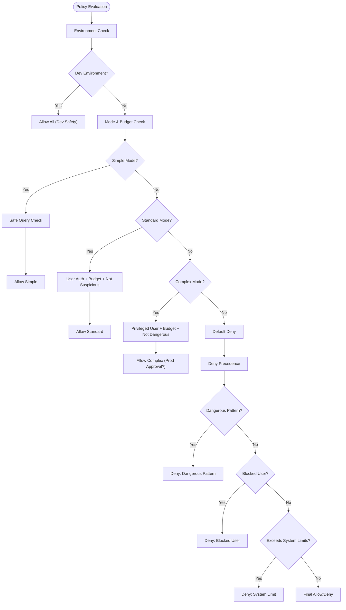
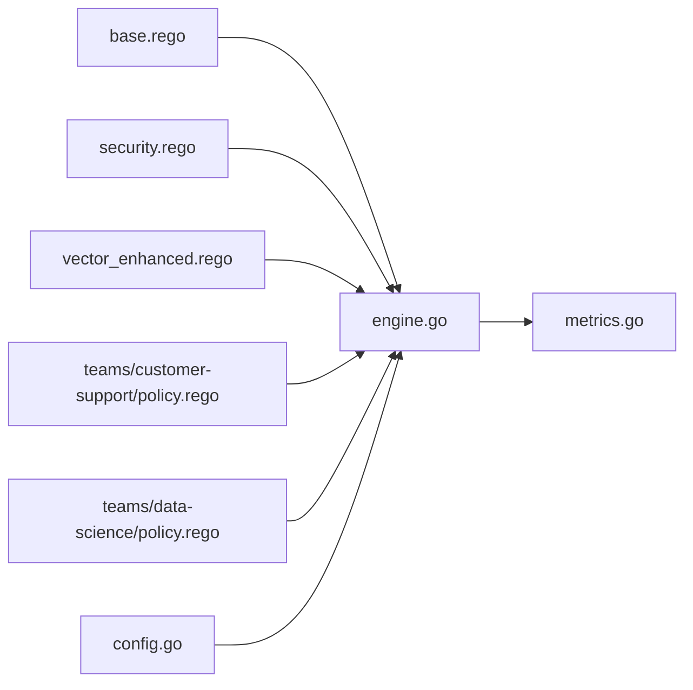

# Open Policy Agent (OPA) Integration

<cite>
**Referenced Files in This Document**
- [config/opa/README.md](file://config/opa/README.md)
- [config/opa/policies/base.rego](file://config/opa/policies/base.rego)
- [config/opa/policies/security.rego](file://config/opa/policies/security.rego)
- [config/opa/policies/vector_enhanced.rego](file://config/opa/policies/vector_enhanced.rego)
- [config/opa/policies/teams/customer-support/policy.rego](file://config/opa/policies/teams/customer-support/policy.rego)
- [config/opa/policies/teams/data-science/policy.rego](file://config/opa/policies/teams/data-science/policy.rego)
- [go/orchestrator/internal/policy/engine.go](file://go/orchestrator/internal/policy/engine.go)
- [go/orchestrator/internal/policy/config.go](file://go/orchestrator/internal/policy/config.go)
- [go/orchestrator/internal/policy/metrics.go](file://go/orchestrator/internal/policy/metrics.go)
- [go/orchestrator/internal/policy/engine_test.go](file://go/orchestrator/internal/policy/engine_test.go)
- [go/orchestrator/internal/policy/load_test.go](file://go/orchestrator/internal/policy/load_test.go)
- [config/shannon-policy-test.yaml](file://config/shannon-policy-test.yaml)
</cite>

## Table of Contents
1. [Introduction](#introduction)
2. [Project Structure](#project-structure)
3. [Core Components](#core-components)
4. [Architecture Overview](#architecture-overview)
5. [Detailed Component Analysis](#detailed-component-analysis)
6. [Dependency Analysis](#dependency-analysis)
7. [Performance Considerations](#performance-considerations)
8. [Troubleshooting Guide](#troubleshooting-guide)
9. [Conclusion](#conclusion)
10. [Appendices](#appendices)

## Introduction
This document explains the Open Policy Agent (OPA) integration and policy enforcement system in Shannon. It covers the Rego policy language implementation for access control, multi-tenant isolation, and resource governance; the policy hierarchy including base policies, team-specific policies, and security enforcement rules; policy evaluation mechanisms, decision logging, and audit trail generation; practical examples for team-based access control, tool restrictions, and resource allocation; policy testing methodologies, debugging techniques, and performance optimization; policy updates, hot-reloading capabilities, and integration with the enforcement layer.

## Project Structure
The policy system is composed of:
- Rego policy files under config/opa/policies defining allow/deny rules, user/team allowances, and resource budgets.
- A Go-based OPA engine that loads, compiles, and evaluates policies against runtime inputs.
- Configuration and metrics modules that define operational modes, canary rollouts, and observability.
- Tests validating behavior, deny precedence, and load performance.



**Diagram sources**
- [config/opa/policies/base.rego](file://config/opa/policies/base.rego#L1-L272)
- [config/opa/policies/security.rego](file://config/opa/policies/security.rego#L1-L52)
- [config/opa/policies/vector_enhanced.rego](file://config/opa/policies/vector_enhanced.rego#L1-L28)
- [config/opa/policies/teams/customer-support/policy.rego](file://config/opa/policies/teams/customer-support/policy.rego#L1-L45)
- [config/opa/policies/teams/data-science/policy.rego](file://config/opa/policies/teams/data-science/policy.rego#L1-L37)
- [go/orchestrator/internal/policy/config.go](file://go/orchestrator/internal/policy/config.go#L59-L83)
- [go/orchestrator/internal/policy/engine.go](file://go/orchestrator/internal/policy/engine.go#L85-L115)
- [go/orchestrator/internal/policy/metrics.go](file://go/orchestrator/internal/policy/metrics.go#L11-L143)

**Section sources**
- [config/opa/README.md](file://config/opa/README.md#L77-L96)
- [config/opa/policies/base.rego](file://config/opa/policies/base.rego#L1-L272)
- [go/orchestrator/internal/policy/engine.go](file://go/orchestrator/internal/policy/engine.go#L117-L195)

## Core Components
- PolicyInput: The structured input passed to the policy engine, including identifiers, request details, security context, resource constraints, optional vector enhancements, and timestamps.
- Decision: The evaluation result with allow flag, reason, optional requirement for approval, obligations, and audit tags.
- OPAEngine: Loads and compiles Rego policies, evaluates inputs, applies canary enforcement, caches decisions, and records metrics.
- Config: Defines operational modes (off/dry-run/enforce), fail-closed behavior, environment, canary rollout, and emergency kill switch.
- Metrics: Exposes Prometheus metrics for evaluations, latency, cache performance, canary routing, deny reasons, and policy versioning.

**Section sources**
- [go/orchestrator/internal/policy/engine.go](file://go/orchestrator/internal/policy/engine.go#L32-L83)
- [go/orchestrator/internal/policy/engine.go](file://go/orchestrator/internal/policy/engine.go#L197-L282)
- [go/orchestrator/internal/policy/config.go](file://go/orchestrator/internal/policy/config.go#L59-L83)
- [go/orchestrator/internal/policy/metrics.go](file://go/orchestrator/internal/policy/metrics.go#L11-L143)

## Architecture Overview
The policy engine follows a layered approach:
- Policy definition layer: Rego packages define decision rules, deny precedence, and environment-specific logic.
- Enforcement layer: OPAEngine compiles policies, evaluates inputs, applies canary mode, and returns decisions.
- Observability layer: Metrics capture evaluation outcomes, latency, cache behavior, and policy versioning.
- Configuration layer: Environment variables and YAML drive engine behavior, including canary rollouts and emergency controls.



**Diagram sources**
- [go/orchestrator/internal/policy/engine.go](file://go/orchestrator/internal/policy/engine.go#L197-L282)
- [go/orchestrator/internal/policy/engine.go](file://go/orchestrator/internal/policy/engine.go#L458-L594)
- [go/orchestrator/internal/policy/metrics.go](file://go/orchestrator/internal/policy/metrics.go#L145-L221)

## Detailed Component Analysis

### Rego Policy Hierarchy and Semantics
- Base policies (base.rego):
  - Allowlist-first approach with environment-specific rules.
  - Deny rules take precedence over allow rules.
  - Supports development, simple, standard, and complex modes with token budgets.
  - User allowlists (basic and privileged), agent allowlists, and dangerous pattern blocks.
  - System limits and blocked users.
- Security policies (security.rego):
  - Optional overrides for base allow rules, production approvals, suspicious sessions, and token budget thresholds.
- Vector-enhanced policies (vector_enhanced.rego):
  - Conditional allowance or denial based on similarity to prior queries and confidence scores.
- Team-specific policies:
  - Customer support: restricted models, limited tokens, deny-listed tools, and constrained decision obligations.
  - Data science: high-tier models, generous token budgets, and broad tool allowance.



**Diagram sources**
- [config/opa/policies/base.rego](file://config/opa/policies/base.rego#L16-L254)
- [config/opa/policies/security.rego](file://config/opa/policies/security.rego#L6-L52)
- [config/opa/policies/vector_enhanced.rego](file://config/opa/policies/vector_enhanced.rego#L6-L26)

**Section sources**
- [config/opa/policies/base.rego](file://config/opa/policies/base.rego#L16-L254)
- [config/opa/policies/security.rego](file://config/opa/policies/security.rego#L6-L52)
- [config/opa/policies/vector_enhanced.rego](file://config/opa/policies/vector_enhanced.rego#L6-L26)
- [config/opa/policies/teams/customer-support/policy.rego](file://config/opa/policies/teams/customer-support/policy.rego#L8-L44)
- [config/opa/policies/teams/data-science/policy.rego](file://config/opa/policies/teams/data-science/policy.rego#L8-L36)

### Policy Evaluation Mechanisms and Enforcement Modes
- Engine initialization:
  - Loads .rego files from the configured path, compiles them into a prepared query, and sets up an in-memory LRU cache.
- Evaluation pipeline:
  - Converts PolicyInput to map, evaluates via OPA, parses results into Decision, applies canary mode, and records metrics.
- Enforcement modes:
  - Off: Engine disabled.
  - Dry-run: Always allows but logs what would have happened; useful for validation.
  - Enforce: Respects policy decisions; can be overridden by canary rules and emergency kill switch.
- Canary rollout:
  - Percentage-based routing with explicit user/agent overrides and deterministic hashing for consistency.
- Emergency kill switch:
  - Forces all requests to dry-run mode regardless of other settings.

```mermaid
classDiagram
class PolicyInput {
+string SessionID
+string UserID
+string AgentID
+string Query
+string Mode
+map[string]interface{} Context
+string Environment
+string IPAddress
+float ComplexityScore
+int TokenBudget
+[]SimilarQuery SimilarQueries
+float ContextScore
+string SemanticCluster
+string RiskProfile
+time Timestamp
}
class Decision {
+bool Allow
+string Reason
+bool RequireApproval
+map[string]interface{} Obligations
+string PolicyVersion
+map[string]string AuditTags
}
class OPAEngine {
-Config config
-Logger logger
-PreparedEvalQuery compiled
-bool enabled
-decisionCache cache
+Evaluate(ctx, input) Decision
+LoadPolicies() error
+IsEnabled() bool
+Environment() string
+Mode() Mode
}
class Config {
+bool Enabled
+Mode Mode
+string Path
+bool FailClosed
+string Environment
+CanaryConfig Canary
+bool EmergencyKillSwitch
}
OPAEngine --> PolicyInput : "evaluates"
OPAEngine --> Decision : "produces"
OPAEngine --> Config : "uses"
```

**Diagram sources**
- [go/orchestrator/internal/policy/engine.go](file://go/orchestrator/internal/policy/engine.go#L32-L83)
- [go/orchestrator/internal/policy/engine.go](file://go/orchestrator/internal/policy/engine.go#L85-L115)
- [go/orchestrator/internal/policy/config.go](file://go/orchestrator/internal/policy/config.go#L59-L83)

**Section sources**
- [go/orchestrator/internal/policy/engine.go](file://go/orchestrator/internal/policy/engine.go#L197-L282)
- [go/orchestrator/internal/policy/engine.go](file://go/orchestrator/internal/policy/engine.go#L458-L594)
- [go/orchestrator/internal/policy/config.go](file://go/orchestrator/internal/policy/config.go#L85-L209)

### Decision Logging and Audit Trail
- Audit tags include session, agent, mode, effective mode, and canary flags.
- Dry-run mode augments reasons to indicate divergence from enforce decisions.
- Metrics capture deny reasons, mode comparisons, and SLOs for latency and error rates.
- Policy version tracking and load timestamps enable deployment visibility.

**Section sources**
- [go/orchestrator/internal/policy/engine.go](file://go/orchestrator/internal/policy/engine.go#L535-L594)
- [go/orchestrator/internal/policy/metrics.go](file://go/orchestrator/internal/policy/metrics.go#L145-L221)

### Practical Examples: Team-Based Access Control, Tool Restrictions, and Resource Allocation
- Customer support team:
  - Restricted models, limited token budget, deny-listed tools, and constrained decision obligations.
- Data science team:
  - High-tier models, generous token budget, and full tool allowance.
- Base policy examples:
  - User allowlists, agent allowlists, dangerous pattern blocks, and environment-specific rules.

**Section sources**
- [config/opa/policies/teams/customer-support/policy.rego](file://config/opa/policies/teams/customer-support/policy.rego#L8-L44)
- [config/opa/policies/teams/data-science/policy.rego](file://config/opa/policies/teams/data-science/policy.rego#L8-L36)
- [config/opa/policies/base.rego](file://config/opa/policies/base.rego#L78-L254)

### Policy Testing Methodologies and Debugging Techniques
- Unit tests validate deny precedence, dry-run behavior, and configuration parsing.
- Load tests simulate realistic concurrency, cache warming, and suspicious patterns to assess latency budgets and error rates.
- Debugging tips:
  - Start in dry-run mode, review logs for divergence indicators, and confirm policy file syntax and permissions.
  - Use metrics to track deny reasons, cache performance, and SLO adherence.

**Section sources**
- [go/orchestrator/internal/policy/engine_test.go](file://go/orchestrator/internal/policy/engine_test.go#L14-L128)
- [go/orchestrator/internal/policy/engine_test.go](file://go/orchestrator/internal/policy/engine_test.go#L243-L356)
- [go/orchestrator/internal/policy/load_test.go](file://go/orchestrator/internal/policy/load_test.go#L141-L199)
- [config/opa/README.md](file://config/opa/README.md#L356-L422)

### Performance Optimization
- Decision cache: LRU with TTL reduces repeated evaluations; keys include environment, mode, user, agent, token budget, rounded complexity, and hashed query.
- Canary routing: Deterministic hashing ensures consistent user/agent assignment; percentage rollout minimizes risk.
- Metrics-driven SLOs: Latency histograms, error counters, and cache size gauges guide tuning.

**Section sources**
- [go/orchestrator/internal/policy/engine.go](file://go/orchestrator/internal/policy/engine.go#L361-L456)
- [go/orchestrator/internal/policy/engine.go](file://go/orchestrator/internal/policy/engine.go#L596-L607)
- [go/orchestrator/internal/policy/metrics.go](file://go/orchestrator/internal/policy/metrics.go#L125-L143)

### Policy Updates and Hot-Reloading
- Policies support hot-reload: editing .rego files triggers automatic recompilation and reload without service restart.
- Version tracking and load timestamps help monitor deployments.

**Section sources**
- [config/opa/README.md](file://config/opa/README.md#L348-L355)
- [go/orchestrator/internal/policy/engine.go](file://go/orchestrator/internal/policy/engine.go#L117-L195)

## Dependency Analysis
- Policy definitions depend on the OPA decision query path and package namespace.
- Engine depends on configuration, metrics, and the OPA library for evaluation.
- Tests depend on the engine and policy files to validate behavior and performance.



**Diagram sources**
- [config/opa/policies/base.rego](file://config/opa/policies/base.rego#L1-L2)
- [config/opa/policies/security.rego](file://config/opa/policies/security.rego#L1-L2)
- [config/opa/policies/vector_enhanced.rego](file://config/opa/policies/vector_enhanced.rego#L1-L2)
- [config/opa/policies/teams/customer-support/policy.rego](file://config/opa/policies/teams/customer-support/policy.rego#L1-L2)
- [config/opa/policies/teams/data-science/policy.rego](file://config/opa/policies/teams/data-science/policy.rego#L1-L2)
- [go/orchestrator/internal/policy/engine.go](file://go/orchestrator/internal/policy/engine.go#L164-L170)
- [go/orchestrator/internal/policy/metrics.go](file://go/orchestrator/internal/policy/metrics.go#L13-L143)

**Section sources**
- [go/orchestrator/internal/policy/engine.go](file://go/orchestrator/internal/policy/engine.go#L117-L195)
- [go/orchestrator/internal/policy/metrics.go](file://go/orchestrator/internal/policy/metrics.go#L145-L221)

## Performance Considerations
- Target sub-millisecond evaluation latency; leverage cache hits for frequently repeated inputs.
- Monitor SLOs for latency and error rates; adjust canary percentages and emergency controls as needed.
- Use vector-enhanced policies judiciously to avoid unnecessary computation when context is absent.

[No sources needed since this section provides general guidance]

## Troubleshooting Guide
- Policy not loading:
  - Verify file syntax and permissions; check orchestrator logs for compilation errors.
- Unexpected denials:
  - Review deny precedence; confirm user IDs and environment alignment.
- Policy not enforcing:
  - Confirm enabled and mode settings; ensure path correctness.

**Section sources**
- [config/opa/README.md](file://config/opa/README.md#L356-L372)

## Conclusion
Shannon’s OPA integration provides a robust, extensible policy framework with deny-precedence rules, environment-aware logic, team-specific controls, and vector-enhanced decision-making. The Go-based engine supports canary rollouts, emergency kill switches, comprehensive metrics, and hot-reload capabilities, enabling safe and observable policy evolution in production.

[No sources needed since this section summarizes without analyzing specific files]

## Appendices

### Configuration Reference
- Policy configuration includes enablement, mode, path, fail-closed behavior, environment, audit settings, cache configuration, and emergency controls.
- Example YAML demonstrates enabling policy engine for testing with dry-run mode and audit logging.

**Section sources**
- [config/opa/README.md](file://config/opa/README.md#L161-L232)
- [config/shannon-policy-test.yaml](file://config/shannon-policy-test.yaml#L15-L27)