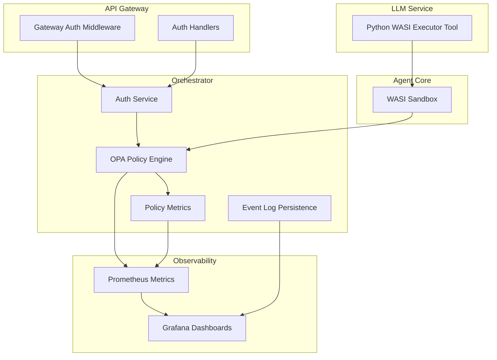
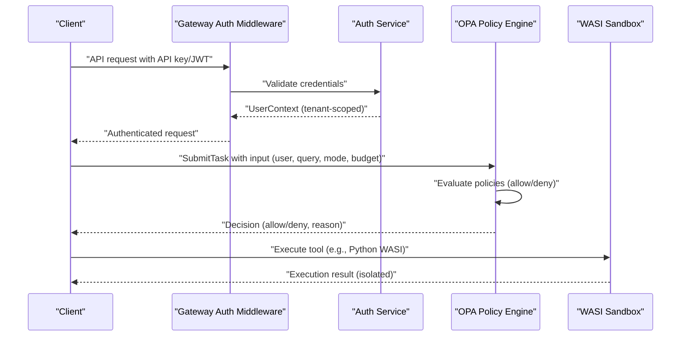
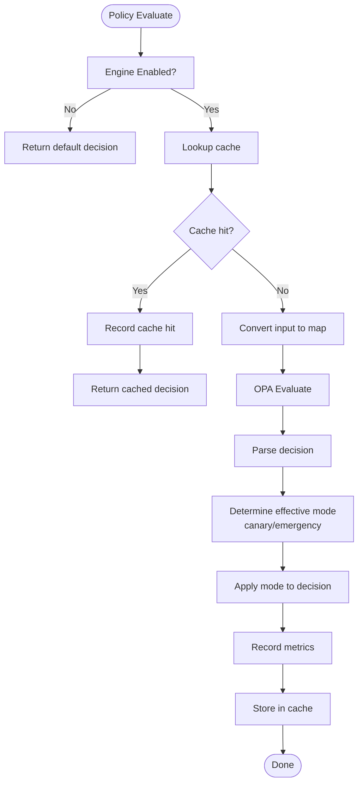
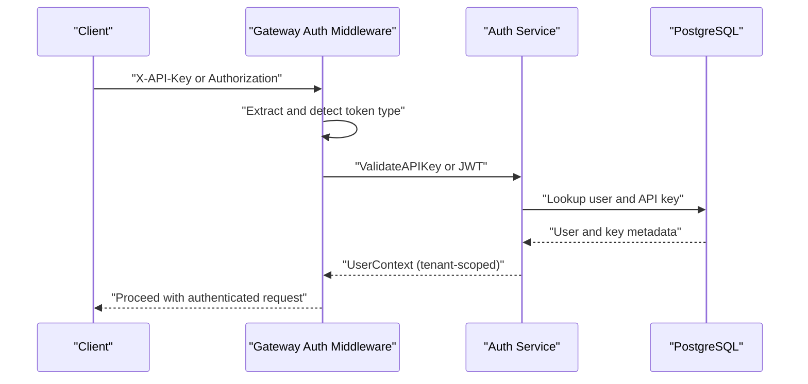
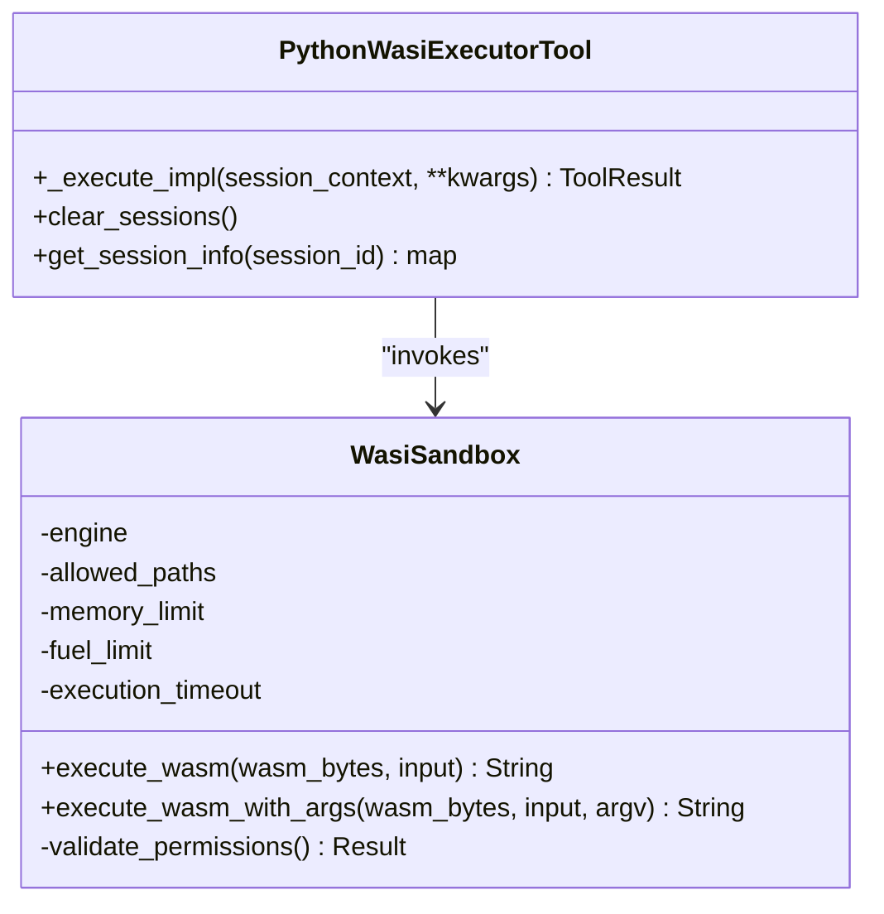
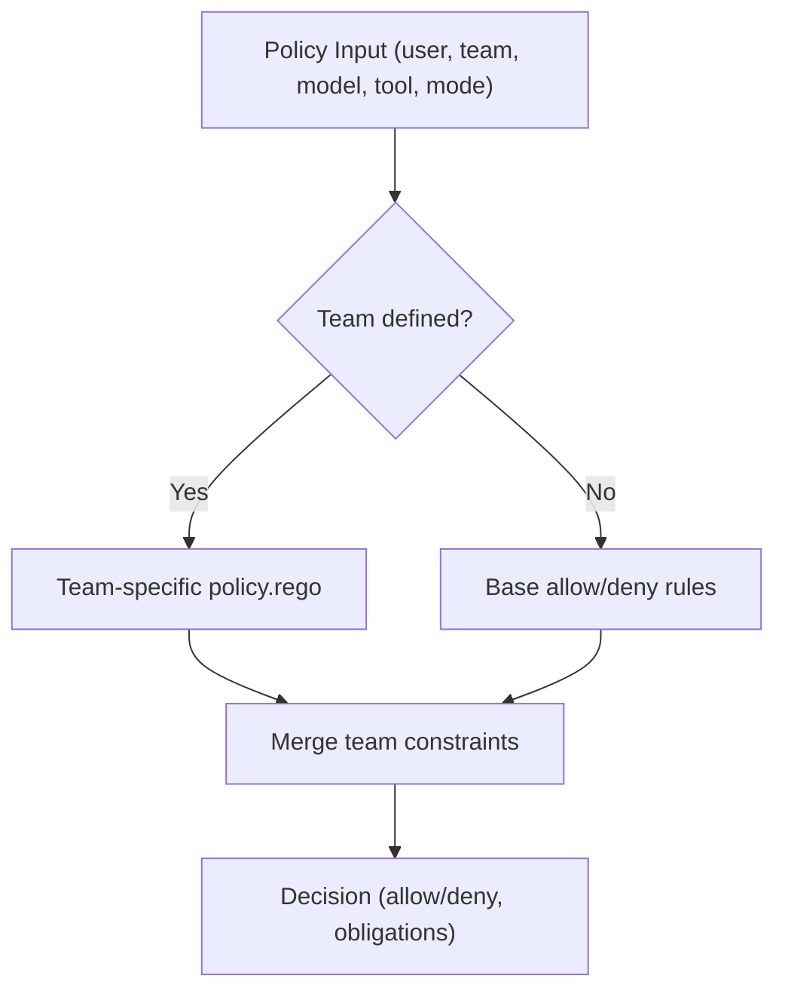
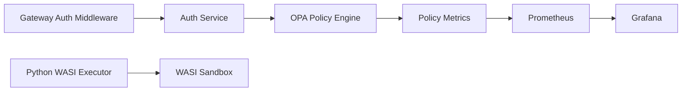

# Security and Governance

<cite>
**Referenced Files in This Document**
- [config/opa/README.md](file://config/opa/README.md)
- [config/opa/policies/base.rego](file://config/opa/policies/base.rego)
- [config/opa/policies/security.rego](file://config/opa/policies/security.rego)
- [config/opa/policies/teams/customer-support/policy.rego](file://config/opa/policies/teams/customer-support/policy.rego)
- [config/opa/policies/teams/data-science/policy.rego](file://config/opa/policies/teams/data-science/policy.rego)
- [go/orchestrator/internal/policy/engine.go](file://go/orchestrator/internal/policy/engine.go)
- [go/orchestrator/internal/policy/config.go](file://go/orchestrator/internal/policy/config.go)
- [go/orchestrator/internal/policy/metrics.go](file://go/orchestrator/internal/policy/metrics.go)
- [go/orchestrator/cmd/gateway/internal/middleware/auth.go](file://go/orchestrator/cmd/gateway/internal/middleware/auth.go)
- [go/orchestrator/cmd/gateway/internal/handlers/auth.go](file://go/orchestrator/cmd/gateway/internal/handlers/auth.go)
- [go/orchestrator/internal/auth/service.go](file://go/orchestrator/internal/auth/service.go)
- [go/orchestrator/internal/db/event_log.go](file://go/orchestrator/internal/db/event_log.go)
- [python/llm-service/llm_service/tools/builtin/python_wasi_executor.py](file://python/llm-service/llm_service/tools/builtin/python_wasi_executor.py)
- [rust/agent-core/src/wasi_sandbox.rs](file://rust/agent-core/src/wasi_sandbox.rs)
- [observability/POLICY-METRICS.md](file://observability/POLICY-METRICS.md)
</cite>

## Table of Contents
1. [Introduction](#introduction)
2. [Project Structure](#project-structure)
3. [Core Components](#core-components)
4. [Architecture Overview](#architecture-overview)
5. [Detailed Component Analysis](#detailed-component-analysis)
6. [Dependency Analysis](#dependency-analysis)
7. [Performance Considerations](#performance-considerations)
8. [Troubleshooting Guide](#troubleshooting-guide)
9. [Conclusion](#conclusion)
10. [Appendices](#appendices)

## Introduction
This document describes Shannon’s enterprise-grade security and governance model. It covers the WASI sandbox for secure code execution, Open Policy Agent (OPA) integration for fine-grained access control and policy enforcement, multi-tenant isolation, audit and compliance features, and security controls for tool execution, API access, and data protection. It also includes practical examples of policy configuration for team-based access control and tool restrictions, plus guidance for security monitoring, threat detection, and incident response.

## Project Structure
Security and governance spans several subsystems:
- Policy engine: OPA-based policy evaluation, canary rollouts, and metrics
- Authentication and authorization: API key and optional JWT support, tenant isolation, and audit logging
- Tool execution: WASI sandbox for secure Python code execution
- Observability: Prometheus metrics and Grafana dashboards for policy monitoring

**Diagram sources**
- [go/orchestrator/cmd/gateway/internal/middleware/auth.go](file://go/orchestrator/cmd/gateway/internal/middleware/auth.go#L24-L156)
- [go/orchestrator/cmd/gateway/internal/handlers/auth.go](file://go/orchestrator/cmd/gateway/internal/handlers/auth.go#L22-L456)
- [go/orchestrator/internal/auth/service.go](file://go/orchestrator/internal/auth/service.go#L18-L390)
- [go/orchestrator/internal/policy/engine.go](file://go/orchestrator/internal/policy/engine.go#L21-L282)
- [go/orchestrator/internal/policy/metrics.go](file://go/orchestrator/internal/policy/metrics.go#L11-L232)
- [python/llm-service/llm_service/tools/builtin/python_wasi_executor.py](file://python/llm-service/llm_service/tools/builtin/python_wasi_executor.py#L54-L426)
- [rust/agent-core/src/wasi_sandbox.rs](file://rust/agent-core/src/wasi_sandbox.rs#L15-L498)
- [go/orchestrator/internal/db/event_log.go](file://go/orchestrator/internal/db/event_log.go#L10-L54)
- [observability/POLICY-METRICS.md](file://observability/POLICY-METRICS.md#L1-L203)

**Section sources**
- [go/orchestrator/cmd/gateway/internal/middleware/auth.go](file://go/orchestrator/cmd/gateway/internal/middleware/auth.go#L24-L156)
- [go/orchestrator/cmd/gateway/internal/handlers/auth.go](file://go/orchestrator/cmd/gateway/internal/handlers/auth.go#L22-L456)
- [go/orchestrator/internal/auth/service.go](file://go/orchestrator/internal/auth/service.go#L18-L390)
- [go/orchestrator/internal/policy/engine.go](file://go/orchestrator/internal/policy/engine.go#L21-L282)
- [go/orchestrator/internal/policy/metrics.go](file://go/orchestrator/internal/policy/metrics.go#L11-L232)
- [python/llm-service/llm_service/tools/builtin/python_wasi_executor.py](file://python/llm-service/llm_service/tools/builtin/python_wasi_executor.py#L54-L426)
- [rust/agent-core/src/wasi_sandbox.rs](file://rust/agent-core/src/wasi_sandbox.rs#L15-L498)
- [go/orchestrator/internal/db/event_log.go](file://go/orchestrator/internal/db/event_log.go#L10-L54)
- [observability/POLICY-METRICS.md](file://observability/POLICY-METRICS.md#L1-L203)

## Core Components
- OPA Policy Engine: Loads Rego policies, evaluates inputs, supports canary rollouts, fail-closed/fail-open modes, and comprehensive metrics.
- Authentication and Multi-Tenant Isolation: API key and optional JWT validation, tenant scoping, and audit logging.
- WASI Sandbox: Secure Python execution with network isolation, read-only filesystem, memory and CPU limits, and timeout protection.
- Observability: Prometheus metrics and Grafana dashboards for policy SLOs, canary tracking, and incident response.

**Section sources**
- [go/orchestrator/internal/policy/engine.go](file://go/orchestrator/internal/policy/engine.go#L21-L282)
- [go/orchestrator/internal/policy/config.go](file://go/orchestrator/internal/policy/config.go#L59-L83)
- [go/orchestrator/cmd/gateway/internal/middleware/auth.go](file://go/orchestrator/cmd/gateway/internal/middleware/auth.go#L24-L156)
- [go/orchestrator/internal/auth/service.go](file://go/orchestrator/internal/auth/service.go#L243-L322)
- [python/llm-service/llm_service/tools/builtin/python_wasi_executor.py](file://python/llm-service/llm_service/tools/builtin/python_wasi_executor.py#L54-L426)
- [rust/agent-core/src/wasi_sandbox.rs](file://rust/agent-core/src/wasi_sandbox.rs#L15-L498)
- [observability/POLICY-METRICS.md](file://observability/POLICY-METRICS.md#L1-L203)

## Architecture Overview
The security architecture integrates authentication, policy enforcement, and sandboxed execution:

**Diagram sources**
- [go/orchestrator/cmd/gateway/internal/middleware/auth.go](file://go/orchestrator/cmd/gateway/internal/middleware/auth.go#L24-L156)
- [go/orchestrator/internal/auth/service.go](file://go/orchestrator/internal/auth/service.go#L243-L322)
- [go/orchestrator/internal/policy/engine.go](file://go/orchestrator/internal/policy/engine.go#L197-L282)
- [rust/agent-core/src/wasi_sandbox.rs](file://rust/agent-core/src/wasi_sandbox.rs#L124-L433)

## Detailed Component Analysis

### OPA Policy Engine
- Purpose: Centralized policy evaluation for task execution with allow/deny rules, environment-specific behavior, and canary rollouts.
- Inputs: User identity, tenant, agent, query, mode, context, environment, IP address, complexity score, token budget, and vector-enhanced fields.
- Evaluation flow: Deny rules override allow rules; default deny; optional dry-run mode; canary percentage-based enforcement; emergency kill switch; caching; metrics recording.
- Outputs: Decision with allow flag, reason, and optional obligations; audit tags; policy versioning and load tracking.

**Diagram sources**
- [go/orchestrator/internal/policy/engine.go](file://go/orchestrator/internal/policy/engine.go#L197-L282)
- [go/orchestrator/internal/policy/metrics.go](file://go/orchestrator/internal/policy/metrics.go#L145-L232)

**Section sources**
- [go/orchestrator/internal/policy/engine.go](file://go/orchestrator/internal/policy/engine.go#L21-L282)
- [go/orchestrator/internal/policy/config.go](file://go/orchestrator/internal/policy/config.go#L59-L83)
- [go/orchestrator/internal/policy/metrics.go](file://go/orchestrator/internal/policy/metrics.go#L11-L232)
- [observability/POLICY-METRICS.md](file://observability/POLICY-METRICS.md#L1-L203)

### Authentication and Multi-Tenant Isolation
- API key validation: Constant-time comparison, prefix-based lookup, rate limiting, and audit logging.
- JWT support: Optional, with token type detection and validation.
- Tenant scoping: UserContext includes tenant ID; gateway middleware injects user context; handlers use it for isolation.
- Audit logging: Events for registration, login, token refresh, API key creation/use/revocation.

**Diagram sources**
- [go/orchestrator/cmd/gateway/internal/middleware/auth.go](file://go/orchestrator/cmd/gateway/internal/middleware/auth.go#L159-L210)
- [go/orchestrator/internal/auth/service.go](file://go/orchestrator/internal/auth/service.go#L243-L322)
- [go/orchestrator/cmd/gateway/internal/handlers/auth.go](file://go/orchestrator/cmd/gateway/internal/handlers/auth.go#L396-L456)

**Section sources**
- [go/orchestrator/cmd/gateway/internal/middleware/auth.go](file://go/orchestrator/cmd/gateway/internal/middleware/auth.go#L24-L156)
- [go/orchestrator/cmd/gateway/internal/handlers/auth.go](file://go/orchestrator/cmd/gateway/internal/handlers/auth.go#L22-L456)
- [go/orchestrator/internal/auth/service.go](file://go/orchestrator/internal/auth/service.go#L18-L390)
- [go/orchestrator/internal/db/event_log.go](file://go/orchestrator/internal/db/event_log.go#L10-L54)

### WASI Sandbox for Secure Code Execution
- Network isolation: No network capabilities by default; socket operations fail with ENOSYS.
- Filesystem: Read-only access to explicitly allowed directories; canonicalization and symlink protections.
- Memory and CPU limits: Guard pages, memory size limits, fuel-based CPU control, and epoch-based timeouts.
- Execution: Streams stdout/stderr, captures output, emits metrics, and enforces per-execution constraints.

**Diagram sources**
- [rust/agent-core/src/wasi_sandbox.rs](file://rust/agent-core/src/wasi_sandbox.rs#L15-L498)
- [python/llm-service/llm_service/tools/builtin/python_wasi_executor.py](file://python/llm-service/llm_service/tools/builtin/python_wasi_executor.py#L54-L426)

**Section sources**
- [rust/agent-core/src/wasi_sandbox.rs](file://rust/agent-core/src/wasi_sandbox.rs#L15-L498)
- [python/llm-service/llm_service/tools/builtin/python_wasi_executor.py](file://python/llm-service/llm_service/tools/builtin/python_wasi_executor.py#L54-L426)

### Team-Based Access Control and Tool Restrictions
- Base policy: Allowlists for users and agents, mode-based budgets, environment-specific rules, and deny lists for dangerous patterns.
- Team policies: Separate Rego modules define model allowances, token budgets, and tool restrictions per team.
- Example: Customer support team restricted to mini models and read-only tools; data science team allowed broader access.

**Diagram sources**
- [config/opa/policies/base.rego](file://config/opa/policies/base.rego#L1-L272)
- [config/opa/policies/teams/customer-support/policy.rego](file://config/opa/policies/teams/customer-support/policy.rego#L1-L45)
- [config/opa/policies/teams/data-science/policy.rego](file://config/opa/policies/teams/data-science/policy.rego#L1-L37)

**Section sources**
- [config/opa/policies/base.rego](file://config/opa/policies/base.rego#L1-L272)
- [config/opa/policies/teams/customer-support/policy.rego](file://config/opa/policies/teams/customer-support/policy.rego#L1-L45)
- [config/opa/policies/teams/data-science/policy.rego](file://config/opa/policies/teams/data-science/policy.rego#L1-L37)

### Security Controls for Tool Execution, API Access, and Data Protection
- Tool execution:
  - WASI sandbox enforces network isolation, read-only filesystem, memory/CPU limits, and timeouts.
  - Python WASI executor caches the interpreter, supports persistent sessions, and streams output.
- API access:
  - API key validation with constant-time comparison and rate limiting.
  - Optional JWT validation with token type detection.
  - Tenant isolation via user context propagation.
- Data protection:
  - Audit logs for authentication and API key events.
  - Sensitive fields excluded from policy audit logs in production by default.

**Section sources**
- [rust/agent-core/src/wasi_sandbox.rs](file://rust/agent-core/src/wasi_sandbox.rs#L15-L498)
- [python/llm-service/llm_service/tools/builtin/python_wasi_executor.py](file://python/llm-service/llm_service/tools/builtin/python_wasi_executor.py#L54-L426)
- [go/orchestrator/cmd/gateway/internal/middleware/auth.go](file://go/orchestrator/cmd/gateway/internal/middleware/auth.go#L159-L210)
- [go/orchestrator/internal/auth/service.go](file://go/orchestrator/internal/auth/service.go#L243-L322)
- [go/orchestrator/internal/db/event_log.go](file://go/orchestrator/internal/db/event_log.go#L10-L54)
- [config/opa/README.md](file://config/opa/README.md#L173-L232)

### Practical Policy Configuration Examples
- Development vs Production:
  - Development: Allow all operations with budget safeguards.
  - Production: Enforce deny rules, require approvals for complex tasks, restrict models/tools by team.
- Team-based access:
  - Customer support: Mini models, limited token budget, read-only tools.
  - Data science: High-tier models, higher token budget, broad tool access.
- Danger patterns and budgets:
  - Define dangerous patterns (e.g., system commands, secrets) and token budgets per mode.

**Section sources**
- [config/opa/README.md](file://config/opa/README.md#L50-L68)
- [config/opa/policies/base.rego](file://config/opa/policies/base.rego#L29-L76)
- [config/opa/policies/teams/customer-support/policy.rego](file://config/opa/policies/teams/customer-support/policy.rego#L8-L44)
- [config/opa/policies/teams/data-science/policy.rego](file://config/opa/policies/teams/data-science/policy.rego#L8-L36)

### Security Monitoring, Threat Detection, and Incident Response
- Metrics and dashboards:
  - Policy evaluation totals, latency histograms, cache performance, canary routing, and top deny reasons.
  - SLOs for error rate, latency, and cache hit rate.
- Alerts:
  - Critical: error rate breach, latency breach, emergency kill switch activation.
  - Warning: low cache hit rate, high denial rate.
- Playbook:
  - Canary rollout phases, kill switch activation, gradual rollback, and dry-run overrides for problem users.

**Section sources**
- [go/orchestrator/internal/policy/metrics.go](file://go/orchestrator/internal/policy/metrics.go#L11-L232)
- [observability/POLICY-METRICS.md](file://observability/POLICY-METRICS.md#L1-L203)

## Dependency Analysis
- Policy engine depends on OPA for evaluation and Prometheus for metrics.
- Authentication service depends on PostgreSQL for user/key storage and JWT manager for token operations.
- Python WASI executor depends on Agent Core gRPC and WasiSandbox for execution.
- Gateway middleware depends on auth service and optionally JWT validator.

**Diagram sources**
- [go/orchestrator/internal/auth/service.go](file://go/orchestrator/internal/auth/service.go#L18-L390)
- [go/orchestrator/internal/policy/engine.go](file://go/orchestrator/internal/policy/engine.go#L21-L282)
- [go/orchestrator/internal/policy/metrics.go](file://go/orchestrator/internal/policy/metrics.go#L11-L232)
- [python/llm-service/llm_service/tools/builtin/python_wasi_executor.py](file://python/llm-service/llm_service/tools/builtin/python_wasi_executor.py#L54-L426)
- [rust/agent-core/src/wasi_sandbox.rs](file://rust/agent-core/src/wasi_sandbox.rs#L15-L498)

**Section sources**
- [go/orchestrator/internal/auth/service.go](file://go/orchestrator/internal/auth/service.go#L18-L390)
- [go/orchestrator/internal/policy/engine.go](file://go/orchestrator/internal/policy/engine.go#L21-L282)
- [python/llm-service/llm_service/tools/builtin/python_wasi_executor.py](file://python/llm-service/llm_service/tools/builtin/python_wasi_executor.py#L54-L426)
- [rust/agent-core/src/wasi_sandbox.rs](file://rust/agent-core/src/wasi_sandbox.rs#L15-L498)

## Performance Considerations
- Policy evaluation latency targets sub-millisecond performance; cache hit rate should remain high (>80%).
- Canary rollouts allow incremental enforcement; monitor SLOs before increasing enforce percentage.
- WASI sandbox guards memory growth and uses epoch interrupts for timeouts; tune fuel and memory limits per workload.

[No sources needed since this section provides general guidance]

## Troubleshooting Guide
- Policy not loading:
  - Check Rego syntax, file permissions, and orchestrator logs for compilation errors.
- Unexpected denials:
  - Review deny rules precedence, user allowlists, and environment matching.
- Policy not enforcing:
  - Confirm policy enabled, mode set to enforce, and path correct.
- Authentication bypass in non-dev environments:
  - Security warning logged when auth skip is enabled outside dev/test.
- API key validation failures:
  - Normalize external API key format, verify key prefix lookup, and check expiration.

**Section sources**
- [config/opa/README.md](file://config/opa/README.md#L356-L372)
- [go/orchestrator/cmd/gateway/internal/middleware/auth.go](file://go/orchestrator/cmd/gateway/internal/middleware/auth.go#L51-L100)
- [go/orchestrator/internal/auth/service.go](file://go/orchestrator/internal/auth/service.go#L243-L322)

## Conclusion
Shannon’s security model combines strong authentication and multi-tenant isolation, robust OPA-based policy enforcement with canary rollouts, and a secure WASI sandbox for code execution. Comprehensive observability enables SLO-driven operations, threat detection, and incident response. Teams can tailor access control and tool restrictions through modular policy configurations, ensuring both security and productivity.

[No sources needed since this section summarizes without analyzing specific files]

## Appendices

### Compliance and Audit Features
- Audit logs for authentication and API key lifecycle events.
- Policy decision logging with configurable verbosity and data minimization in production.
- Event log persistence for streaming and workflow auditing.

**Section sources**
- [go/orchestrator/internal/db/event_log.go](file://go/orchestrator/internal/db/event_log.go#L10-L54)
- [config/opa/README.md](file://config/opa/README.md#L173-L185)
- [go/orchestrator/internal/auth/service.go](file://go/orchestrator/internal/auth/service.go#L444-L465)