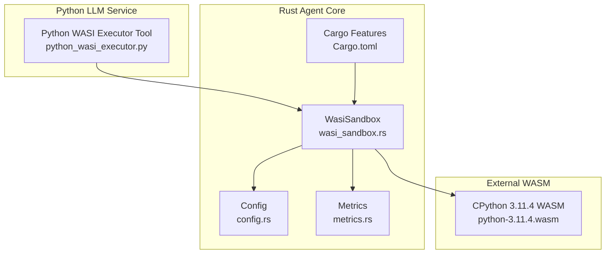
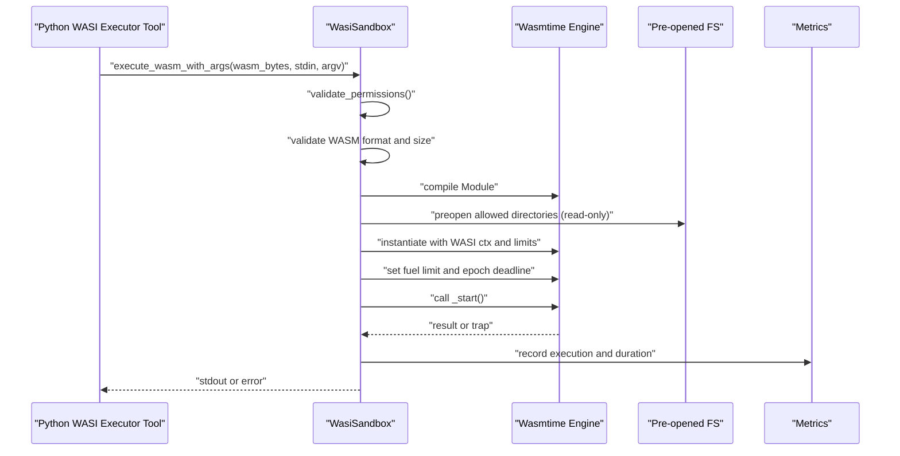
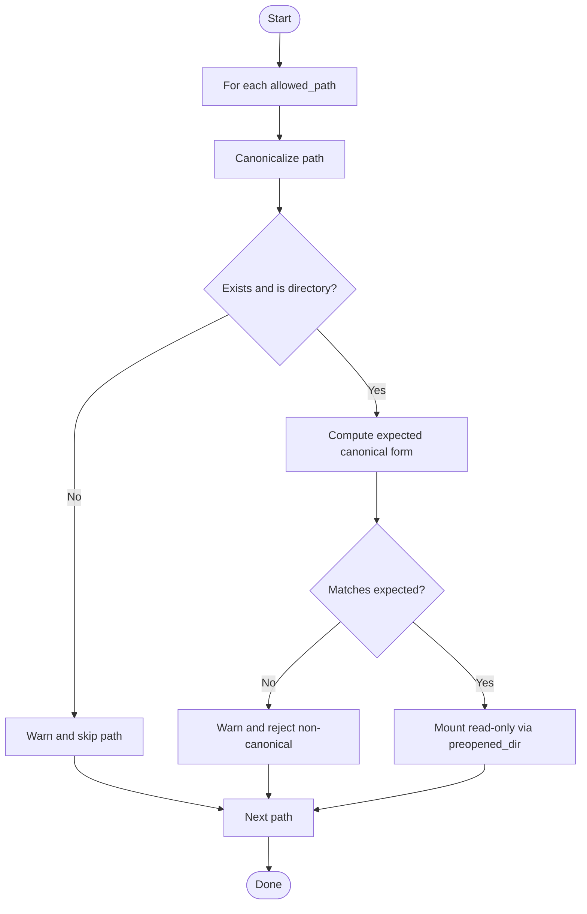
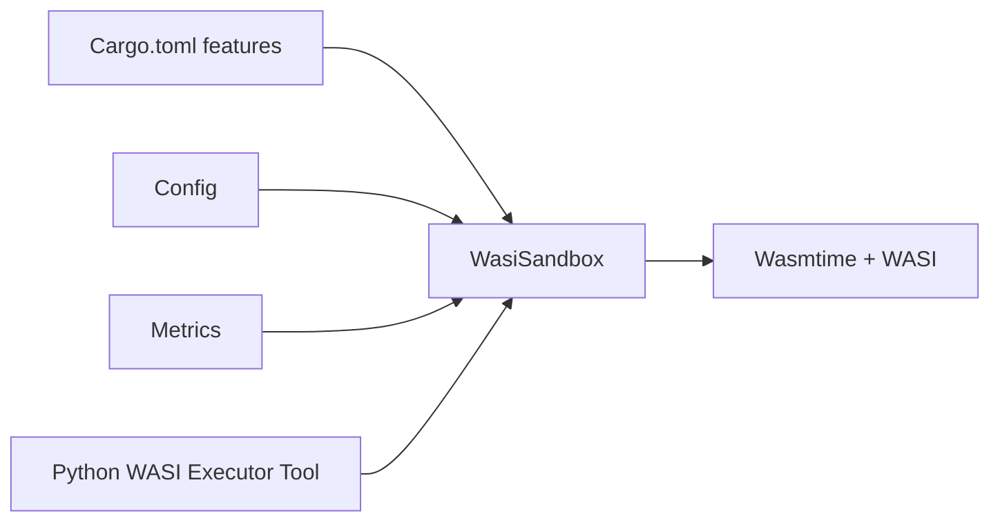

# WASI Sandbox Implementation

<cite>
**Referenced Files in This Document**
- [wasi_sandbox.rs](file://rust/agent-core/src/wasi_sandbox.rs)
- [config.rs](file://rust/agent-core/src/config.rs)
- [agent.yaml](file://rust/agent-core/config/agent.yaml)
- [Cargo.toml](file://rust/agent-core/Cargo.toml)
- [metrics.rs](file://rust/agent-core/src/metrics.rs)
- [python_wasi_executor.py](file://python/llm-service/llm_service/tools/builtin/python_wasi_executor.py)
- [wasi_hello.rs](file://rust/agent-core/examples/wasi_hello.rs)
- [lib.rs](file://rust/agent-core/src/lib.rs)
- [test_wasm_cache.rs](file://rust/agent-core/tests/test_wasm_cache.rs)
</cite>

## Table of Contents
1. [Introduction](#introduction)
2. [Project Structure](#project-structure)
3. [Core Components](#core-components)
4. [Architecture Overview](#architecture-overview)
5. [Detailed Component Analysis](#detailed-component-analysis)
6. [Dependency Analysis](#dependency-analysis)
7. [Performance Considerations](#performance-considerations)
8. [Troubleshooting Guide](#troubleshooting-guide)
9. [Conclusion](#conclusion)
10. [Appendices](#appendices)

## Introduction
This document explains Shannon’s WASI sandbox implementation for secure, isolated execution of WebAssembly modules. It covers the security model (network isolation, read-only filesystem access, memory and CPU limits), the WasiSandbox configuration, the end-to-end execution pipeline, timeout enforcement via epoch interruption, path canonicalization to prevent symlink escapes, environment variable restrictions, and pre-opened directory permissions. It also provides practical configuration examples, performance monitoring, common security scenarios, troubleshooting steps, and optimization techniques.

## Project Structure
The WASI sandbox resides in the Rust agent-core crate and integrates with the broader system via gRPC. The Python LLM service uses the sandbox to execute Python code via a CPython WASM interpreter. Configuration is centralized and supports environment overrides.

**Diagram sources**
- [wasi_sandbox.rs](file://rust/agent-core/src/wasi_sandbox.rs#L15-L29)
- [config.rs](file://rust/agent-core/src/config.rs#L14-L60)
- [metrics.rs](file://rust/agent-core/src/metrics.rs#L23-L26)
- [Cargo.toml](file://rust/agent-core/Cargo.toml#L10-L13)
- [python_wasi_executor.py](file://python/llm-service/llm_service/tools/builtin/python_wasi_executor.py#L54-L128)

**Section sources**
- [lib.rs](file://rust/agent-core/src/lib.rs#L12-L21)
- [Cargo.toml](file://rust/agent-core/Cargo.toml#L10-L13)

## Core Components
- WasiSandbox: The primary sandbox that validates permissions, compiles and instantiates WASM modules, enforces resource limits, and executes with epoch-interrupted timeouts.
- Config: Centralized configuration for WASI memory limits, timeouts, fuel budgets, and allowed filesystem paths.
- Metrics: Prometheus-backed metrics for tool executions and durations.
- Python WASI Executor Tool: Bridges the Python LLM service to the sandbox via gRPC, passing the WASM path and arguments.

Key responsibilities:
- Validate module format and size before instantiation.
- Enforce memory guard size and store limits.
- Use epoch interruption for deterministic timeouts.
- Canonicalize and restrict filesystem access to pre-opened directories.
- Control environment variables and disable network capabilities by default.

**Section sources**
- [wasi_sandbox.rs](file://rust/agent-core/src/wasi_sandbox.rs#L15-L29)
- [config.rs](file://rust/agent-core/src/config.rs#L14-L60)
- [metrics.rs](file://rust/agent-core/src/metrics.rs#L23-L26)
- [python_wasi_executor.py](file://python/llm-service/llm_service/tools/builtin/python_wasi_executor.py#L54-L128)

## Architecture Overview
The execution pipeline from request to completion:

**Diagram sources**
- [wasi_sandbox.rs](file://rust/agent-core/src/wasi_sandbox.rs#L124-L433)
- [python_wasi_executor.py](file://python/llm-service/llm_service/tools/builtin/python_wasi_executor.py#L310-L386)

## Detailed Component Analysis

### WasiSandbox Security Model
- Network isolation: WASI preview1 does not expose network capabilities by default. Socket operations will fail with function-not-implemented errors. No explicit opt-in is present in the sandbox configuration.
- Read-only filesystem: Pre-opened directories are mounted with read-only permissions. The sandbox canonicalizes paths and rejects non-canonical forms to prevent symlink escapes.
- Memory limits: Guard pages are configured at the engine level. Store limits cap memory growth and instance/table/memory counts.
- CPU limits: Fuel metering is enabled; fuel is consumed during execution and can be set per store.
- Execution timeouts: Epoch interruption is enabled. A periodic ticker increments the epoch; the store sets a deadline based on the configured timeout. Timeouts trigger traps.

Path canonicalization and symlink prevention:
- Paths are canonicalized and compared against an expected canonical form. On macOS, special handling ensures /tmp symlinks resolve consistently.
- Only directories that exist and are canonicalized are mounted read-only.

Environment variables:
- By default, environment variables are not inherited. Access can be explicitly allowed and restricted per key/value pair.

Pre-opened directory permissions:
- Only allowed directories are mounted with read-only file and directory permissions.

**Section sources**
- [wasi_sandbox.rs](file://rust/agent-core/src/wasi_sandbox.rs#L227-L242)
- [wasi_sandbox.rs](file://rust/agent-core/src/wasi_sandbox.rs#L244-L298)
- [wasi_sandbox.rs](file://rust/agent-core/src/wasi_sandbox.rs#L350-L364)
- [wasi_sandbox.rs](file://rust/agent-core/src/wasi_sandbox.rs#L435-L447)

### WasiSandbox Configuration
The WasiSandbox is constructed from global configuration and supports fluent setters for runtime overrides.

Key configuration fields:
- memory_limit: Bytes for memory guard and store limits.
- fuel_limit: CPU budget for instruction-based throttling.
- execution_timeout: Wall-clock timeout for epoch deadline.
- allowed_paths: List of directories to mount read-only.
- allow_env_access and env_vars: Controlled environment exposure.

Defaults and environment overrides:
- Defaults are defined in the configuration schema and YAML.
- Environment variables override defaults at runtime.

**Section sources**
- [wasi_sandbox.rs](file://rust/agent-core/src/wasi_sandbox.rs#L37-L72)
- [config.rs](file://rust/agent-core/src/config.rs#L40-L60)
- [agent.yaml](file://rust/agent-core/config/agent.yaml#L4-L13)
- [config.rs](file://rust/agent-core/src/config.rs#L372-L383)

### Execution Pipeline Details
- Permission validation: Ensures allowed paths exist and are directories.
- WASM validation: Size and magic-number checks.
- Early memory maximum validation: Inspects module exports to reject oversized declared memories.
- Epoch ticker: Periodically increments engine epoch; stops after execution completes.
- Store limits: Enforced via StoreLimitsBuilder for memory, tables, instances, and memories.
- Fuel limit: Set per store to bound CPU usage.
- Linker and instantiation: WASI preview1 context is attached; module is instantiated.
- Entry point: Calls _start if present; otherwise reports missing entry point.

Timeout enforcement:
- Epoch interruption is enabled in engine configuration.
- A deadline is computed from the execution timeout and set on the store.
- The epoch ticker runs concurrently; upon deadline, traps occur deterministically.

**Section sources**
- [wasi_sandbox.rs](file://rust/agent-core/src/wasi_sandbox.rs#L124-L177)
- [wasi_sandbox.rs](file://rust/agent-core/src/wasi_sandbox.rs#L195-L214)
- [wasi_sandbox.rs](file://rust/agent-core/src/wasi_sandbox.rs#L317-L375)
- [wasi_sandbox.rs](file://rust/agent-core/src/wasi_sandbox.rs#L362-L364)

### Path Canonicalization Flow

**Diagram sources**
- [wasi_sandbox.rs](file://rust/agent-core/src/wasi_sandbox.rs#L244-L298)

**Section sources**
- [wasi_sandbox.rs](file://rust/agent-core/src/wasi_sandbox.rs#L244-L298)

### Environment Variables and Network Isolation
- Environment variables: Disabled by default; enabling requires explicit allow_env_access and setting env_vars.
- Network: No network capabilities are exposed by default in WASI preview1; sockets fail with function-not-implemented.

**Section sources**
- [wasi_sandbox.rs](file://rust/agent-core/src/wasi_sandbox.rs#L236-L242)
- [wasi_sandbox.rs](file://rust/agent-core/src/wasi_sandbox.rs#L227-L232)

### Python WASI Executor Tool Integration
- The Python tool loads a cached WASM interpreter and sends a structured request to agent-core.
- argv is set to pass the code via stdin to the interpreter.
- gRPC call includes tool parameters; timeouts are enforced by the caller and agent-core.

**Section sources**
- [python_wasi_executor.py](file://python/llm-service/llm_service/tools/builtin/python_wasi_executor.py#L310-L386)
- [python_wasi_executor.py](file://python/llm-service/llm_service/tools/builtin/python_wasi_executor.py#L130-L152)

## Dependency Analysis

**Diagram sources**
- [Cargo.toml](file://rust/agent-core/Cargo.toml#L10-L13)
- [wasi_sandbox.rs](file://rust/agent-core/src/wasi_sandbox.rs#L12-L13)
- [metrics.rs](file://rust/agent-core/src/metrics.rs#L23-L26)
- [python_wasi_executor.py](file://python/llm-service/llm_service/tools/builtin/python_wasi_executor.py#L310-L386)

**Section sources**
- [Cargo.toml](file://rust/agent-core/Cargo.toml#L10-L13)
- [lib.rs](file://rust/agent-core/src/lib.rs#L12-L21)

## Performance Considerations
- Module caching: The sandbox caches compiled modules to avoid repeated compilation overhead.
- Blocking execution: WASM execution runs in a blocking task to avoid async runtime conflicts.
- Guard pages: Engine-level guard size reduces memory exhaustion risk.
- Fuel metering: Provides CPU budgeting; tune fuel_limit for workload characteristics.
- Epoch interruption: Efficient timeout mechanism with minimal overhead.

Optimization techniques:
- Increase memory_limit and fuel_limit according to workload needs.
- Adjust execution_timeout to balance safety and responsiveness.
- Use allowed_paths judiciously to minimize filesystem overhead.
- Monitor metrics to identify hotspots and tune limits.

**Section sources**
- [wasi_sandbox.rs](file://rust/agent-core/src/wasi_sandbox.rs#L216-L423)
- [metrics.rs](file://rust/agent-core/src/metrics.rs#L149-L169)
- [test_wasm_cache.rs](file://rust/agent-core/tests/test_wasm_cache.rs#L11-L64)

## Troubleshooting Guide
Common issues and resolutions:
- Invalid WASM module: Ensure the module has the correct magic number and size. The sandbox rejects modules exceeding the size limit or with invalid headers.
- Missing _start entry point: The sandbox looks for _start; modules without it will fail with a missing entry error.
- Path not allowed: Ensure allowed_paths exist and are canonicalized. Non-canonical paths are rejected to prevent symlink escapes.
- Execution timeout: Confirm epoch interruption is enabled and the deadline is set correctly. Review execution_timeout configuration.
- Fuel exhaustion: If CPU-bound tasks fail, increase fuel_limit or reduce workload complexity.
- Environment variable access: If the tool needs environment variables, enable allow_env_access and set env_vars explicitly.

Operational tips:
- Use metrics to observe tool execution counts and durations.
- Validate configuration via environment overrides for quick iteration.
- For Python WASI, confirm the interpreter path exists and is cached.

**Section sources**
- [wasi_sandbox.rs](file://rust/agent-core/src/wasi_sandbox.rs#L141-L151)
- [wasi_sandbox.rs](file://rust/agent-core/src/wasi_sandbox.rs#L377-L385)
- [wasi_sandbox.rs](file://rust/agent-core/src/wasi_sandbox.rs#L435-L447)
- [metrics.rs](file://rust/agent-core/src/metrics.rs#L149-L169)
- [python_wasi_executor.py](file://python/llm-service/llm_service/tools/builtin/python_wasi_executor.py#L130-L152)

## Conclusion
Shannon’s WASI sandbox provides robust isolation through canonicalized read-only filesystem access, guard pages, store limits, fuel metering, and epoch-interrupted timeouts. Configuration is centralized and environment-driven, enabling safe and tunable execution of WASM modules. The Python WASI executor integrates seamlessly via gRPC, enabling secure, sandboxed Python execution with session persistence and streaming output.

## Appendices

### Practical Configuration Examples
- Default configuration: Loaded from YAML with sensible defaults for memory, timeout, and fuel.
- Environment overrides: Use WASI_MEMORY_LIMIT_MB and WASI_TIMEOUT_SECONDS to adjust limits at runtime.
- Allowed paths: Configure read-only directories via allowed_paths in the YAML.

**Section sources**
- [agent.yaml](file://rust/agent-core/config/agent.yaml#L4-L13)
- [config.rs](file://rust/agent-core/src/config.rs#L372-L383)

### Security Boundary Enforcement
- Filesystem: Only pre-opened directories are accessible; all others are blocked.
- Environment: Controlled exposure via allow_env_access and env_vars.
- Network: No network capabilities by default.
- CPU and memory: Enforced via fuel and guard/store limits.

**Section sources**
- [wasi_sandbox.rs](file://rust/agent-core/src/wasi_sandbox.rs#L244-L298)
- [wasi_sandbox.rs](file://rust/agent-core/src/wasi_sandbox.rs#L236-L242)
- [wasi_sandbox.rs](file://rust/agent-core/src/wasi_sandbox.rs#L350-L364)

### Performance Monitoring
- Metrics: Tool execution counts and durations are recorded via Prometheus-backed metrics.
- Metrics server: A simple HTTP endpoint serves metrics for scraping.

**Section sources**
- [metrics.rs](file://rust/agent-core/src/metrics.rs#L149-L169)
- [metrics.rs](file://rust/agent-core/src/metrics.rs#L267-L303)

### Example Usage
- Standalone execution: The example demonstrates loading a WASM file and executing it through the sandbox.
- Python WASI: The tool prepares argv and stdin for the interpreter and communicates via gRPC.

**Section sources**
- [wasi_hello.rs](file://rust/agent-core/examples/wasi_hello.rs#L14-L29)
- [python_wasi_executor.py](file://python/llm-service/llm_service/tools/builtin/python_wasi_executor.py#L310-L386)