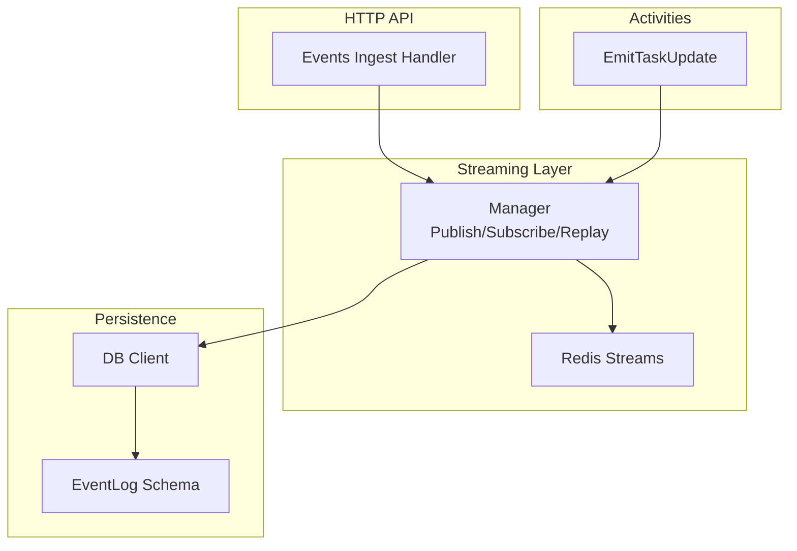
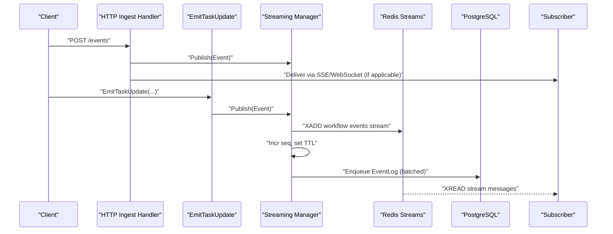
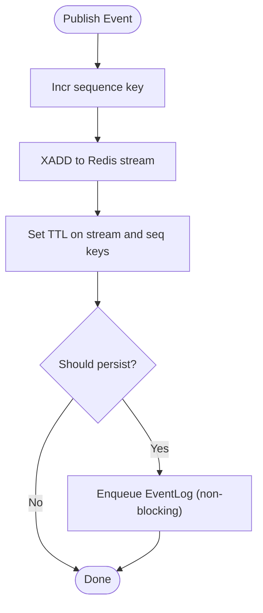
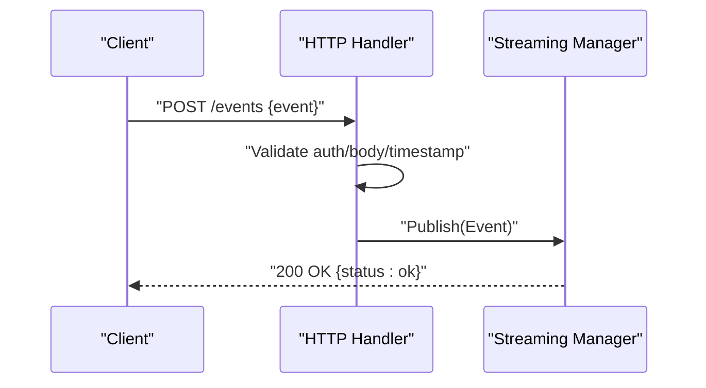
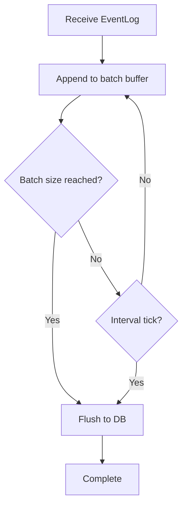
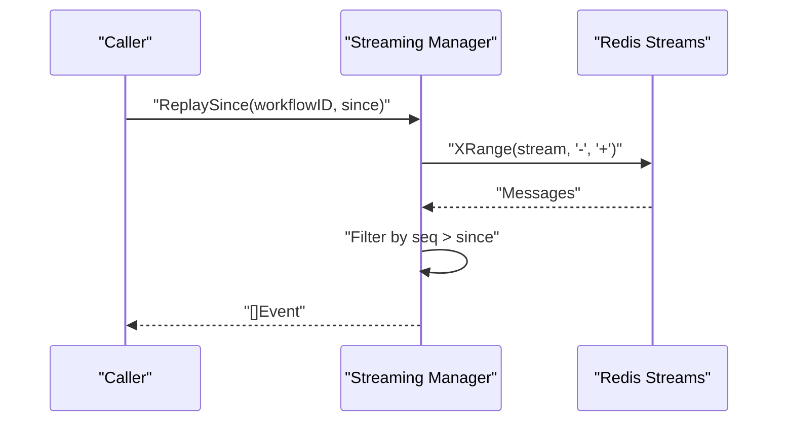
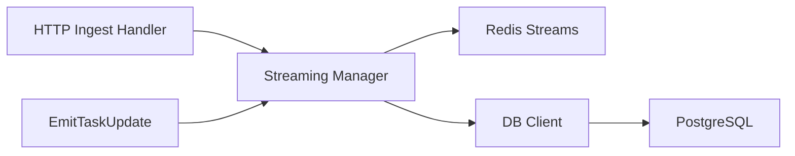

# Event Management and Storage

<cite>
**Referenced Files in This Document**
- [manager.go](file://go/orchestrator/internal/streaming/manager.go)
- [event_log.go](file://go/orchestrator/internal/db/event_log.go)
- [client.go](file://go/orchestrator/internal/db/client.go)
- [stream_events.go](file://go/orchestrator/internal/activities/stream_events.go)
- [events_ingest.go](file://go/orchestrator/internal/httpapi/events_ingest.go)
- [persistence.go](file://go/orchestrator/internal/activities/persistence.go)
- [session_events_test.go](file://go/orchestrator/cmd/gateway/internal/handlers/session_events_test.go)
- [README.md](file://README.md)
</cite>

## Table of Contents
1. [Introduction](#introduction)
2. [Project Structure](#project-structure)
3. [Core Components](#core-components)
4. [Architecture Overview](#architecture-overview)
5. [Detailed Component Analysis](#detailed-component-analysis)
6. [Dependency Analysis](#dependency-analysis)
7. [Performance Considerations](#performance-considerations)
8. [Troubleshooting Guide](#troubleshooting-guide)
9. [Conclusion](#conclusion)
10. [Appendices](#appendices)

## Introduction
This document describes Shannon’s event management and storage system. It covers the Event data structure, event types, and payload formats; Redis Streams integration for publishing and subscribing; event persistence to PostgreSQL; event filtering, critical event handling, and sanitization; the batch persistence worker; replay functionality; deduplication via Redis stream IDs; sequence numbering; and TTL management. Practical examples are included for publishing, subscription handling, and replay for debugging. Performance considerations and optimization strategies for high-throughput scenarios are also addressed.

## Project Structure
The event system spans several Go packages:
- Streaming manager and Redis integration for event publishing and subscription
- HTTP ingestion handler for external event posting
- Activity-layer event emission for workflow events
- Database client and event log persistence
- Tests validating session and event behaviors

**Diagram sources**
- [manager.go](file://go/orchestrator/internal/streaming/manager.go#L1-L120)
- [events_ingest.go](file://go/orchestrator/internal/httpapi/events_ingest.go#L1-L90)
- [stream_events.go](file://go/orchestrator/internal/activities/stream_events.go#L1-L92)
- [client.go](file://go/orchestrator/internal/db/client.go#L1-L120)
- [event_log.go](file://go/orchestrator/internal/db/event_log.go#L1-L54)

**Section sources**
- [manager.go](file://go/orchestrator/internal/streaming/manager.go#L1-L120)
- [events_ingest.go](file://go/orchestrator/internal/httpapi/events_ingest.go#L1-L90)
- [stream_events.go](file://go/orchestrator/internal/activities/stream_events.go#L1-L92)
- [client.go](file://go/orchestrator/internal/db/client.go#L1-L120)
- [event_log.go](file://go/orchestrator/internal/db/event_log.go#L1-L54)

## Core Components
- Event data structure: Minimal, structured event with identifiers, type, agent context, message, JSON payload, timestamps, sequence number, and Redis stream ID for deduplication.
- Event types: Comprehensive set covering workflow lifecycle, agent actions, UX visibility, LLM interactions, tool observations, approvals, and control signals.
- Publishing pipeline: Activities and HTTP handler publish to Redis Streams; Manager assigns sequence numbers, sets TTLs, and optionally persists selected events.
- Subscription model: Backed by Redis Streams with per-workflow keys, buffered channels, and cancellation semantics.
- Persistence: Batched asynchronous writes to PostgreSQL via a dedicated worker; only selected “important” events are persisted.
- Replay: Read from Redis Streams by sequence number or stream ID.

**Section sources**
- [manager.go](file://go/orchestrator/internal/streaming/manager.go#L19-L49)
- [stream_events.go](file://go/orchestrator/internal/activities/stream_events.go#L11-L59)
- [events_ingest.go](file://go/orchestrator/internal/httpapi/events_ingest.go#L27-L34)
- [event_log.go](file://go/orchestrator/internal/db/event_log.go#L10-L22)
- [manager.go](file://go/orchestrator/internal/streaming/manager.go#L500-L536)

## Architecture Overview
The system integrates Redis Streams for real-time event distribution and PostgreSQL for durable, queryable event logs. Activities and HTTP handlers publish events; subscribers consume via buffered channels; a background worker batches and persists selected events.

**Diagram sources**
- [events_ingest.go](file://go/orchestrator/internal/httpapi/events_ingest.go#L36-L89)
- [stream_events.go](file://go/orchestrator/internal/activities/stream_events.go#L72-L91)
- [manager.go](file://go/orchestrator/internal/streaming/manager.go#L365-L440)
- [manager.go](file://go/orchestrator/internal/streaming/manager.go#L661-L696)
- [event_log.go](file://go/orchestrator/internal/db/event_log.go#L24-L46)

## Detailed Component Analysis

### Event Data Model and Payload Formats
- Event fields:
  - workflow_id: identifies the workflow
  - type: event category/type
  - agent_id: optional agent identifier
  - message: optional human-readable text
  - payload: optional JSON object
  - timestamp: nanosecond precision
  - seq: monotonically increasing sequence number
  - stream_id: Redis stream entry ID for deduplication
- Payload sanitization:
  - Removes invalid UTF-8
  - Truncates large base64 images to protect storage and network bandwidth
- Persistence model:
  - EventLog rows include id, workflow_id, type, agent_id, message, payload, timestamp, seq, stream_id, created_at
  - Upsert behavior prevents duplicates on (workflow_id, type, seq) when seq is present

**Section sources**
- [manager.go](file://go/orchestrator/internal/streaming/manager.go#L19-L29)
- [manager.go](file://go/orchestrator/internal/streaming/manager.go#L538-L659)
- [event_log.go](file://go/orchestrator/internal/db/event_log.go#L10-L22)
- [event_log.go](file://go/orchestrator/internal/db/event_log.go#L24-L46)

### Event Types and Filtering Logic
- Event categories include workflow lifecycle, agent actions, UX events, LLM interactions, tool observations, approvals, and control signals.
- Persistence filtering:
  - Important events persisted: completion/failure markers, agent/tool lifecycle, errors, LLM final output, stream end, and specific coordination events
  - Streaming deltas and heartbeats are not persisted to reduce DB load
  - Unknown types are persisted conservatively
- Critical event handling:
  - Dropping critical events escalates logging severity to error/warn
  - Subscriber backpressure is handled with non-blocking sends and warnings

**Section sources**
- [stream_events.go](file://go/orchestrator/internal/activities/stream_events.go#L11-L59)
- [manager.go](file://go/orchestrator/internal/streaming/manager.go#L500-L536)
- [manager.go](file://go/orchestrator/internal/streaming/manager.go#L331-L343)

### Redis Streams Integration
- Publishing:
  - XADD to workflow-specific stream with values for type, agent_id, message, payload JSON, ts_nano, and seq
  - TTL set on stream and sequence key (24h and 48h respectively)
  - Deduplication supported via stream_id
- Subscription:
  - Subscribe/SubscribeFrom create buffered channels and spawn reader goroutines
  - Reader XREADs with blocking timeouts and exponential backoff on errors
  - Non-blocking delivery to subscribers; drops escalated for critical events
- Replay:
  - ReplaySince reads all stream entries and filters by sequence number
  - ReplayFromStreamID reads entries after a given stream ID

**Diagram sources**
- [manager.go](file://go/orchestrator/internal/streaming/manager.go#L387-L440)
- [manager.go](file://go/orchestrator/internal/streaming/manager.go#L500-L536)

**Section sources**
- [manager.go](file://go/orchestrator/internal/streaming/manager.go#L142-L150)
- [manager.go](file://go/orchestrator/internal/streaming/manager.go#L152-L178)
- [manager.go](file://go/orchestrator/internal/streaming/manager.go#L180-L321)
- [manager.go](file://go/orchestrator/internal/streaming/manager.go#L698-L754)
- [manager.go](file://go/orchestrator/internal/streaming/manager.go#L756-L800)

### HTTP Ingestion and Activity Emission
- HTTP ingestion handler:
  - Validates method, optional Authorization, enforces body limits
  - Accepts single event or array; parses timestamp if provided
  - Publishes to in-process streaming manager
- Activity emission:
  - Minimal input with workflow_id, event_type, agent_id, message, timestamp, payload
  - Emits to in-process streaming manager

**Diagram sources**
- [events_ingest.go](file://go/orchestrator/internal/httpapi/events_ingest.go#L36-L89)
- [stream_events.go](file://go/orchestrator/internal/activities/stream_events.go#L72-L91)

**Section sources**
- [events_ingest.go](file://go/orchestrator/internal/httpapi/events_ingest.go#L1-L90)
- [stream_events.go](file://go/orchestrator/internal/activities/stream_events.go#L61-L91)

### Event Persistence Worker and PostgreSQL Integration
- Batch persistence:
  - Background worker aggregates EventLog entries
  - Flushes on batch size or interval (configurable via environment)
  - Writes sequentially with timeout context
- DB client:
  - Async write queue with configurable workers
  - Health checks and graceful shutdown
  - Supports batch processing for multiple write types
- EventLog insertion:
  - Upsert on (workflow_id, type, seq) to avoid duplicates
  - Null-if-empty utility for optional fields

**Diagram sources**
- [manager.go](file://go/orchestrator/internal/streaming/manager.go#L661-L696)
- [client.go](file://go/orchestrator/internal/db/client.go#L148-L196)
- [client.go](file://go/orchestrator/internal/db/client.go#L238-L310)
- [event_log.go](file://go/orchestrator/internal/db/event_log.go#L24-L46)

**Section sources**
- [manager.go](file://go/orchestrator/internal/streaming/manager.go#L95-L127)
- [manager.go](file://go/orchestrator/internal/streaming/manager.go#L661-L696)
- [client.go](file://go/orchestrator/internal/db/client.go#L1-L120)
- [client.go](file://go/orchestrator/internal/db/client.go#L332-L391)
- [event_log.go](file://go/orchestrator/internal/db/event_log.go#L24-L46)

### Event Replay Functionality
- ReplaySince:
  - Reads entire stream and filters by sequence number greater than a given value
- ReplayFromStreamID:
  - Reads stream entries after a specific Redis stream ID

**Diagram sources**
- [manager.go](file://go/orchestrator/internal/streaming/manager.go#L698-L754)
- [manager.go](file://go/orchestrator/internal/streaming/manager.go#L756-L800)

**Section sources**
- [manager.go](file://go/orchestrator/internal/streaming/manager.go#L698-L754)
- [manager.go](file://go/orchestrator/internal/streaming/manager.go#L756-L800)

### Event Deduplication, Sequence Numbering, and TTL
- Deduplication:
  - stream_id from Redis XADD supports downstream deduplication
  - Upsert on (workflow_id, type, seq) prevents duplicate persistence
- Sequence numbering:
  - Atomic increment of per-workflow sequence key
  - Sequence stored in stream field and Event struct
- TTL:
  - Stream key TTL: 24 hours
  - Sequence key TTL: 48 hours

**Section sources**
- [manager.go](file://go/orchestrator/internal/streaming/manager.go#L390-L439)
- [manager.go](file://go/orchestrator/internal/streaming/manager.go#L410-L411)
- [event_log.go](file://go/orchestrator/internal/db/event_log.go#L43-L44)

### Practical Examples

#### Example: Publishing Events via HTTP
- Endpoint: POST /events
- Request body accepts either a single event object or an array
- Optional Authorization header with bearer token if configured
- Timestamp parsing supports RFC3339Nano

**Section sources**
- [events_ingest.go](file://go/orchestrator/internal/httpapi/events_ingest.go#L23-L89)

#### Example: Publishing Events from Activities
- Use EmitTaskUpdate with workflow_id, event_type, optional agent_id, message, timestamp, and payload
- Event is published to the in-process streaming manager

**Section sources**
- [stream_events.go](file://go/orchestrator/internal/activities/stream_events.go#L61-L91)

#### Example: Subscribing to Events
- Subscribe to a workflow’s stream with a buffered channel
- Optionally start from a specific stream ID
- Unsubscribe to cancel the reader and close the channel

**Section sources**
- [manager.go](file://go/orchestrator/internal/streaming/manager.go#L152-L178)
- [manager.go](file://go/orchestrator/internal/streaming/manager.go#L345-L362)

#### Example: Replaying Events for Debugging
- ReplaySince(workflowID, sinceSeq): returns events with sequence > sinceSeq
- ReplayFromStreamID(workflowID, streamID): returns events after the given stream ID

**Section sources**
- [manager.go](file://go/orchestrator/internal/streaming/manager.go#L698-L754)
- [manager.go](file://go/orchestrator/internal/streaming/manager.go#L756-L800)

## Dependency Analysis
- Streaming Manager depends on Redis client for Streams operations and on DB client for optional persistence
- HTTP handler and activities both publish to the streaming manager
- DB client encapsulates async write workers and batch processing
- EventLog schema defines persistence contract and conflict resolution

**Diagram sources**
- [events_ingest.go](file://go/orchestrator/internal/httpapi/events_ingest.go#L36-L89)
- [stream_events.go](file://go/orchestrator/internal/activities/stream_events.go#L72-L91)
- [manager.go](file://go/orchestrator/internal/streaming/manager.go#L365-L440)
- [client.go](file://go/orchestrator/internal/db/client.go#L148-L196)

**Section sources**
- [manager.go](file://go/orchestrator/internal/streaming/manager.go#L1-L120)
- [client.go](file://go/orchestrator/internal/db/client.go#L1-L120)

## Performance Considerations
- Backpressure and non-blocking delivery:
  - Subscribers receive via buffered channels; overflow escalates to warn/error for critical events
- Batching and throttling:
  - EventLog persistence uses configurable batch size and flush interval
  - DB write workers process requests asynchronously with health checks and graceful shutdown
- Stream capacity and TTL:
  - MaxLen with approx enabled on XADD controls memory footprint
  - TTLs prevent indefinite growth of streams and counters
- UTF-8 sanitization and base64 truncation:
  - Prevents malformed data and large payloads from bloating storage
- Recommendations:
  - Tune EVENTLOG_BATCH_SIZE and EVENTLOG_BATCH_INTERVAL_MS for throughput vs latency
  - Monitor subscriber lag and adjust buffer sizes
  - Use ReplayFromStreamID for incremental consumption to reduce load
  - Consider partitioning by workflow_id to scale horizontally

[No sources needed since this section provides general guidance]

## Troubleshooting Guide
- Unauthorized or invalid requests:
  - Verify Authorization header and request body format
- Slow subscribers causing drops:
  - Inspect logs for “dropped event - subscriber slow” or “CRITICAL: dropped important event”
  - Increase buffer size or reduce event rate
- Persistence failures:
  - Check DB client logs for write failures and queue saturation
  - Review batch size and flush interval settings
- Replay issues:
  - Confirm stream existence and correct stream ID or sequence number
- Redis connectivity:
  - Validate Redis client initialization and network access

**Section sources**
- [events_ingest.go](file://go/orchestrator/internal/httpapi/events_ingest.go#L36-L89)
- [manager.go](file://go/orchestrator/internal/streaming/manager.go#L304-L317)
- [manager.go](file://go/orchestrator/internal/streaming/manager.go#L462-L472)
- [client.go](file://go/orchestrator/internal/db/client.go#L332-L391)
- [manager.go](file://go/orchestrator/internal/streaming/manager.go#L698-L754)

## Conclusion
Shannon’s event system combines Redis Streams for high-throughput, low-latency event distribution with PostgreSQL-backed persistence for durable, queryable records. The Manager coordinates publishing, subscription, replay, deduplication, sequencing, and TTL management. Selective persistence and sanitization optimize storage while preserving critical event visibility. The batch persistence worker and async DB client ensure resilience under load. The provided examples and troubleshooting guidance enable effective debugging and operational control.

[No sources needed since this section summarizes without analyzing specific files]

## Appendices

### Appendix A: Event Types Reference
- Workflow lifecycle: WORKFLOW_STARTED, WORKFLOW_COMPLETED, WORKFLOW_PAUSING, WORKFLOW_PAUSED, WORKFLOW_RESUMED, WORKFLOW_CANCELLING, WORKFLOW_CANCELLED
- Agent lifecycle: AGENT_STARTED, AGENT_COMPLETED
- Errors: ERROR_OCCURRED
- Messages: MESSAGE_SENT, MESSAGE_RECEIVED
- Workspace: WORKSPACE_UPDATED
- Extended team coordination: TEAM_RECRUITED, TEAM_RETIRED, ROLE_ASSIGNED, DELEGATION, DEPENDENCY_SATISFIED, BUDGET_THRESHOLD
- UX visibility: TOOL_INVOKED, AGENT_THINKING, TEAM_STATUS, PROGRESS, DATA_PROCESSING, WAITING, ERROR_RECOVERY
- LLM: LLM_PROMPT, LLM_PARTIAL, LLM_OUTPUT, TOOL_OBSERVATION
- Stream lifecycle: STREAM_END
- Approvals: APPROVAL_REQUESTED, APPROVAL_DECISION

**Section sources**
- [stream_events.go](file://go/orchestrator/internal/activities/stream_events.go#L11-L59)

### Appendix B: Environment Variables
- EVENTLOG_BATCH_SIZE: Controls batch size for event log persistence
- EVENTLOG_BATCH_INTERVAL_MS: Controls flush interval for event log persistence

**Section sources**
- [manager.go](file://go/orchestrator/internal/streaming/manager.go#L107-L122)

### Appendix C: Session and Event Testing
- Session event tests validate event emission and subscription behavior in integration contexts

**Section sources**
- [session_events_test.go](file://go/orchestrator/cmd/gateway/internal/handlers/session_events_test.go#L1-L50)