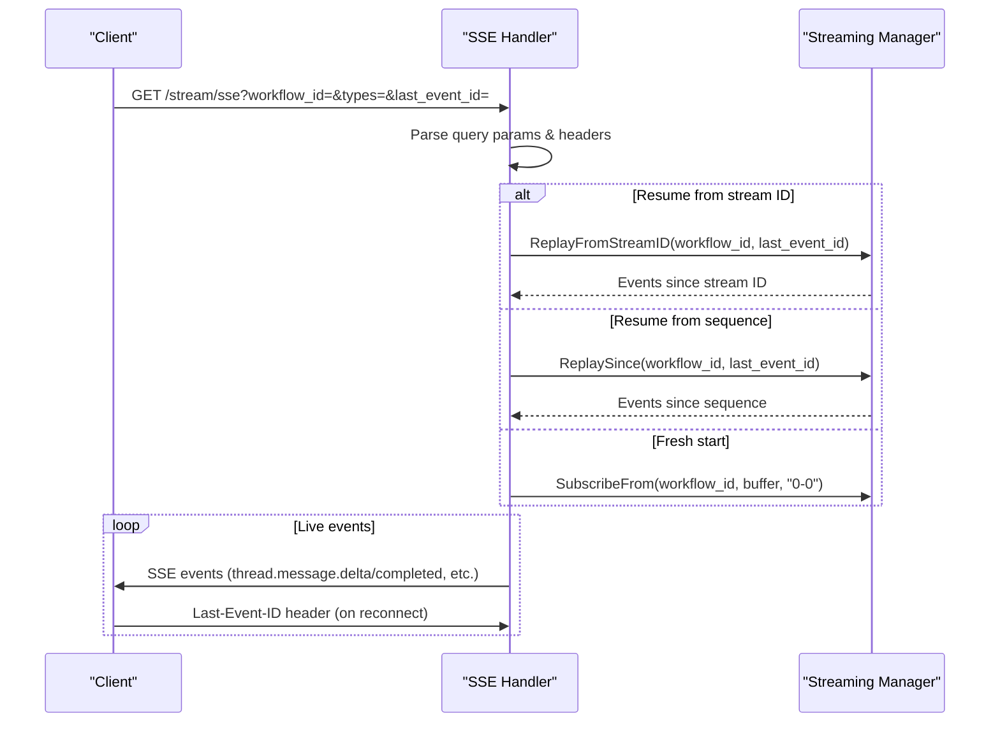

# SSE Streaming Implementation

<cite>
**Referenced Files in This Document**
- [manager.go](file://go/orchestrator/internal/streaming/manager.go)
- [streaming.go](file://go/orchestrator/internal/httpapi/streaming.go)
- [streaming.go](file://go/orchestrator/cmd/gateway/internal/proxy/streaming.go)
- [streaming_service.go](file://go/orchestrator/internal/server/streaming_service.go)
- [stream_events.go](file://go/orchestrator/internal/activities/stream_events.go)
- [streaming_workflow.go](file://go/orchestrator/internal/workflows/streaming_workflow.go)
- [stream.ts](file://desktop/lib/shannon/stream.ts)
- [streaming-api.md](file://docs/streaming-api.md)
- [event-types.md](file://docs/event-types.md)
- [events_ingest.go](file://go/orchestrator/internal/httpapi/events_ingest.go)
- [event_log.go](file://go/orchestrator/internal/db/event_log.go)
</cite>

## Table of Contents
1. [Introduction](#introduction)
2. [Project Structure](#project-structure)
3. [Core Components](#core-components)
4. [Architecture Overview](#architecture-overview)
5. [Detailed Component Analysis](#detailed-component-analysis)
6. [Dependency Analysis](#dependency-analysis)
7. [Performance Considerations](#performance-considerations)
8. [Troubleshooting Guide](#troubleshooting-guide)
9. [Conclusion](#conclusion)
10. [Appendices](#appendices)

## Introduction
This document provides comprehensive documentation for Server-Sent Events (SSE) implementation in Shannon's streaming infrastructure. It explains how the streaming manager integrates with SSE for real-time workflow monitoring, details the event format and connection lifecycle, and outlines automatic reconnection strategies. Practical examples demonstrate connecting to SSE endpoints, handling different event types, and implementing client-side event listeners. The document also covers connection limits, timeout handling, performance considerations for high-concurrency scenarios, and common client-side integration patterns with troubleshooting guidance.

## Project Structure
Shannon's SSE implementation spans multiple layers:
- Streaming Manager: In-memory pub/sub with Redis Streams backend for real-time delivery and bounded replay
- HTTP API: SSE endpoint serving workflow events with resume support and type filtering
- Gateway Proxy: Reverse proxy for SSE/WebSocket with proper headers and buffering
- Client SDKs: React hook for browser integration with automatic reconnection
- Workflows and Activities: Deterministic event emission through Temporal activities


**Diagram sources**
- [streaming.go](file://go/orchestrator/internal/httpapi/streaming.go#L34-L38)
- [manager.go](file://go/orchestrator/internal/streaming/manager.go#L47-L60)
- [streaming.go](file://go/orchestrator/cmd/gateway/internal/proxy/streaming.go#L12-L71)
- [streaming_service.go](file://go/orchestrator/internal/server/streaming_service.go#L17-L32)
- [streaming_workflow.go](file://go/orchestrator/internal/workflows/streaming_workflow.go#L21-L33)

**Section sources**
- [streaming.go](file://go/orchestrator/internal/httpapi/streaming.go#L34-L38)
- [manager.go](file://go/orchestrator/internal/streaming/manager.go#L47-L60)
- [streaming.go](file://go/orchestrator/cmd/gateway/internal/proxy/streaming.go#L12-L71)
- [streaming_service.go](file://go/orchestrator/internal/server/streaming_service.go#L17-L32)
- [streaming_workflow.go](file://go/orchestrator/internal/workflows/streaming_workflow.go#L21-L33)

## Core Components
This section documents the core components involved in SSE streaming:

- Streaming Manager: Manages Redis Streams, maintains per-workflow subscriber channels, and publishes events with sequence numbering and deduplication
- SSE Handler: Implements the HTTP SSE endpoint with resume support, type filtering, heartbeat, and timeout detection
- Gateway Streaming Proxy: Handles reverse proxying for SSE and WebSocket with proper headers and buffering
- Client Integration: React hook that connects via EventSource, manages reconnection, and parses events
- Workflow Activities: Emit deterministic events through Temporal activities for replay safety

Key implementation references:
- Streaming Manager initialization, subscription/unsubscription, and publishing
- SSE endpoint configuration, resume logic, and event mapping
- Gateway proxy configuration for SSE headers and buffering
- Client-side EventSource integration with automatic reconnection

**Section sources**
- [manager.go](file://go/orchestrator/internal/streaming/manager.go#L68-L127)
- [manager.go](file://go/orchestrator/internal/streaming/manager.go#L152-L178)
- [manager.go](file://go/orchestrator/internal/streaming/manager.go#L364-L492)
- [streaming.go](file://go/orchestrator/internal/httpapi/streaming.go#L40-L366)
- [streaming.go](file://go/orchestrator/cmd/gateway/internal/proxy/streaming.go#L12-L71)
- [stream.ts](file://desktop/lib/shannon/stream.ts#L12-L196)

## Architecture Overview
Shannon's streaming architecture ensures deterministic event emission, efficient real-time delivery, and robust replay capabilities:

- Deterministic Emission: All events are emitted through Temporal activities, ensuring replay safety and consistent ordering
- Real-time Delivery: Streaming Manager publishes events to Redis Streams and local subscribers for immediate delivery
- Replay Safety: Bounded Redis Streams (default ~256 events) enable deterministic replay using stream IDs or sequence numbers
- Protocol Support: SSE, WebSocket, and gRPC endpoints share the same underlying event source for unified monitoring
- Persistence Strategy: Redis for all events, PostgreSQL for important events only (reducing DB load by ~95%)


**Diagram sources**
- [streaming_workflow.go](file://go/orchestrator/internal/workflows/streaming_workflow.go#L282-L295)
- [stream_events.go](file://go/orchestrator/internal/activities/stream_events.go#L72-L91)
- [manager.go](file://go/orchestrator/internal/streaming/manager.go#L364-L440)
- [manager.go](file://go/orchestrator/internal/streaming/manager.go#L698-L754)
- [streaming.go](file://go/orchestrator/internal/httpapi/streaming.go#L209-L244)
- [streaming.go](file://go/orchestrator/internal/httpapi/streaming.go#L186-L199)

**Section sources**
- [streaming-api.md](file://docs/streaming-api.md#L5-L28)
- [streaming-api.md](file://docs/streaming-api.md#L299-L319)
- [streaming_workflow.go](file://go/orchestrator/internal/workflows/streaming_workflow.go#L282-L295)
- [stream_events.go](file://go/orchestrator/internal/activities/stream_events.go#L72-L91)
- [manager.go](file://go/orchestrator/internal/streaming/manager.go#L364-L440)

## Detailed Component Analysis

### Streaming Manager
The Streaming Manager is the central component responsible for:
- Maintaining Redis Streams per workflow with bounded length (~256 events)
- Managing subscriber channels with cancellation and graceful shutdown
- Publishing events with sequence numbering and deduplication via Redis stream IDs
- Persisting important events to PostgreSQL asynchronously
- Providing replay capabilities using Redis stream IDs or sequence numbers

Key behaviors:
- Subscription lifecycle: Subscribe() creates channels and starts background readers; Unsubscribe() cancels contexts and closes channels
- Backpressure handling: Non-blocking sends to subscribers; critical events are logged when dropped
- Persistence: Batched asynchronous writes to PostgreSQL for important events only
- Replay: Supports resume from Redis stream IDs or numeric sequences

```mermaid
classDiagram
class Manager {
-redis : redis.Client
-dbClient : db.Client
-subscribers : map[string]map[chan Event]*subscription
-persistCh : chan EventLog
-batchSize : int
-flushEvery : time.Duration
-capacity : int
+Subscribe(workflowID, buffer) chan Event
+SubscribeFrom(workflowID, buffer, startID) chan Event
+Unsubscribe(workflowID, ch) void
+Publish(workflowID, Event) void
+ReplaySince(workflowID, since) []Event
+ReplayFromStreamID(workflowID, streamID) []Event
}
class subscription {
+cancel : CancelFunc
}
class Event {
+workflow_id : string
+type : string
+agent_id : string
+message : string
+payload : map[string]interface{}
+timestamp : time.Time
+seq : uint64
+stream_id : string
}
Manager --> subscription : "manages"
Manager --> Event : "publishes"
```

**Diagram sources**
- [manager.go](file://go/orchestrator/internal/streaming/manager.go#L47-L60)
- [manager.go](file://go/orchestrator/internal/streaming/manager.go#L152-L178)
- [manager.go](file://go/orchestrator/internal/streaming/manager.go#L364-L492)

**Section sources**
- [manager.go](file://go/orchestrator/internal/streaming/manager.go#L36-L60)
- [manager.go](file://go/orchestrator/internal/streaming/manager.go#L152-L178)
- [manager.go](file://go/orchestrator/internal/streaming/manager.go#L364-L492)
- [manager.go](file://go/orchestrator/internal/streaming/manager.go#L698-L754)

### SSE Endpoint Configuration
The SSE endpoint (/stream/sse) provides:
- Query parameters: workflow_id (required), types (optional CSV filter), last_event_id (optional resume)
- Headers: Last-Event-ID support for browser auto-resume
- Event mapping: Converts internal event types to SSE event names (e.g., LLM_PARTIAL → thread.message.delta)
- Heartbeats: Periodic comments to keep connections alive
- Timeout detection: Validates workflow existence within 30 seconds; emits ERROR_OCCURRED before closing if invalid



**Diagram sources**
- [streaming.go](file://go/orchestrator/internal/httpapi/streaming.go#L40-L366)
- [manager.go](file://go/orchestrator/internal/streaming/manager.go#L698-L754)

**Section sources**
- [streaming.go](file://go/orchestrator/internal/httpapi/streaming.go#L40-L366)
- [streaming-api.md](file://docs/streaming-api.md#L136-L163)

### Connection Handling and Lifecycle
Connection lifecycle includes:
- Initial connection: Establishes SSE stream with workflow validation
- Resume support: Uses Last-Event-ID header or last_event_id query param to resume from Redis stream ID or sequence
- Heartbeats: Periodic comments every ~10 seconds to keep connections alive
- Timeout handling: First-event timeout after 30 seconds; validates workflow existence via Temporal
- Graceful closure: Emits done/error events and closes connection on completion or errors


**Diagram sources**
- [streaming.go](file://go/orchestrator/internal/httpapi/streaming.go#L263-L365)

**Section sources**
- [streaming.go](file://go/orchestrator/internal/httpapi/streaming.go#L263-L365)
- [streaming-api.md](file://docs/streaming-api.md#L179-L230)

### Event Delivery Mechanisms
Event delivery uses Redis Streams with:
- Bounded retention (~256 events per workflow) for deterministic replay
- Sequence numbering and Redis stream IDs for deduplication
- Asynchronous persistence of important events to PostgreSQL
- Client-side resume using Last-Event-ID or last_event_id

Important event types and mappings:
- LLM_PARTIAL → thread.message.delta (delta field)
- LLM_OUTPUT → thread.message.completed (response + metadata)
- WORKFLOW_* → workflow.* events (pausing/paused/resumed/cancelling/cancelled)
- Standard types → unchanged event names

**Section sources**
- [streaming.go](file://go/orchestrator/internal/httpapi/streaming.go#L106-L184)
- [streaming-api.md](file://docs/streaming-api.md#L41-L84)
- [event-types.md](file://docs/event-types.md#L149-L178)

### Automatic Reconnection Strategies
Automatic reconnection is implemented in the client:
- Uses Last-Event-ID header or last_event_id query param to resume from the last received event
- Exponential backoff with maximum delay (base 1s, cap 10s)
- Tracks last event ID from SSE event IDs, sequence numbers, or stream IDs
- Closes connection on done/STREAM_END events and stops reconnecting


**Diagram sources**
- [stream.ts](file://desktop/lib/shannon/stream.ts#L30-L182)

**Section sources**
- [stream.ts](file://desktop/lib/shannon/stream.ts#L12-L196)
- [streaming-api.md](file://docs/streaming-api.md#L158-L160)

### Client-Side Integration Examples
Practical examples for connecting to SSE endpoints and handling events:

- Browser JavaScript with EventSource:
  - Connect to /stream/sse with workflow_id and optional types filter
  - Listen for specific event types (thread.message.delta, thread.message.completed, workflow.*)
  - Handle done/STREAM_END to close connection
  - Parse JSON data payloads and dispatch to application state

- React integration:
  - useRunStream hook manages connection lifecycle, reconnection, and Redux dispatch
  - Automatically applies resume logic using lastEventId
  - Supports multiple event types for comprehensive monitoring

**Section sources**
- [stream.ts](file://desktop/lib/shannon/stream.ts#L12-L196)
- [streaming-api.md](file://docs/streaming-api.md#L340-L400)

## Dependency Analysis
The SSE implementation exhibits clear separation of concerns with well-defined dependencies:


**Diagram sources**
- [streaming_workflow.go](file://go/orchestrator/internal/workflows/streaming_workflow.go#L282-L295)
- [stream_events.go](file://go/orchestrator/internal/activities/stream_events.go#L72-L91)
- [manager.go](file://go/orchestrator/internal/streaming/manager.go#L364-L440)
- [streaming.go](file://go/orchestrator/internal/httpapi/streaming.go#L40-L366)
- [streaming.go](file://go/orchestrator/cmd/gateway/internal/proxy/streaming.go#L12-L71)
- [stream.ts](file://desktop/lib/shannon/stream.ts#L12-L196)

**Section sources**
- [streaming_workflow.go](file://go/orchestrator/internal/workflows/streaming_workflow.go#L282-L295)
- [stream_events.go](file://go/orchestrator/internal/activities/stream_events.go#L72-L91)
- [manager.go](file://go/orchestrator/internal/streaming/manager.go#L364-L440)
- [streaming.go](file://go/orchestrator/internal/httpapi/streaming.go#L40-L366)
- [streaming.go](file://go/orchestrator/cmd/gateway/internal/proxy/streaming.go#L12-L71)
- [stream.ts](file://desktop/lib/shannon/stream.ts#L12-L196)

## Performance Considerations
Performance characteristics and optimization opportunities:

- Redis Streams Performance:
  - Bounded retention (~256 events) prevents memory growth
  - Approximate MaxLen ensures efficient eviction
  - TTL management (24h for streams, 48h for counters) balances persistence vs. memory

- Backpressure Handling:
  - Non-blocking channel sends prevent slow subscribers from blocking publishers
  - Critical events are logged when dropped to avoid silent data loss
  - Subscriber buffers sized (default 256) balance latency vs. memory usage

- Persistence Strategy:
  - PostgreSQL batched writes (configurable batch size and interval)
  - Important events only (reduces DB load by ~95%)
  - UTF-8 sanitization and base64 image truncation prevent storage bloat

- Concurrency Considerations:
  - Goroutine-per-subscriber model scales with concurrent clients
  - Reader goroutines terminate on context cancellation or shutdown
  - No global locks during hot-path delivery

[No sources needed since this section provides general guidance]

## Troubleshooting Guide
Common issues and resolutions:

- "No events received":
  - Verify workflow_id exists and is running
  - Check that streaming_v1 version gate is enabled
  - Ensure admin HTTP port (8081) is accessible
  - Confirm types filter matches actual emitted event types

- "Events missing after reconnect":
  - Use last_event_id parameter or Last-Event-ID header
  - Replay reads from bounded Redis Stream; very old events may be pruned once the stream evicts them

- "High memory usage":
  - Reduce ring buffer capacity in config
  - Implement client-side filtering to reduce event volume
  - Use connection pooling for multiple concurrent streams

- "Connection drops frequently":
  - Client uses exponential backoff with 10s cap
  - Server sends periodic heartbeats to keep connections alive
  - Ensure network proxies support long-lived connections

- "Invalid workflow detection timeouts":
  - Server validates workflow existence within 30 seconds
  - Emits ERROR_OCCURRED event before closing if invalid
  - Heartbeats keep connections alive during validation period

**Section sources**
- [streaming-api.md](file://docs/streaming-api.md#L402-L446)
- [streaming.go](file://go/orchestrator/internal/httpapi/streaming.go#L284-L312)

## Conclusion
Shannon's SSE implementation provides a robust, deterministic, and scalable streaming infrastructure for real-time workflow monitoring. The combination of Redis Streams, bounded replay, and automatic reconnection delivers reliable event delivery while maintaining operational efficiency. The architecture supports multiple protocols (SSE, WebSocket, gRPC) with a unified event source, enabling flexible client integrations and comprehensive observability.

## Appendices

### Event Format Reference
Standard event structure:
- workflow_id (string): Unique workflow identifier
- type (string): Event type (e.g., WORKFLOW_STARTED, LLM_OUTPUT)
- agent_id (string, optional): Agent that emitted the event
- message (string, optional): Human-readable description
- timestamp (RFC3339): Event timestamp
- seq (integer): Monotonic sequence number
- stream_id (string, optional): Stream identifier for grouping

Important event types and mappings:
- LLM_PARTIAL → thread.message.delta (delta field)
- LLM_OUTPUT → thread.message.completed (response + metadata)
- WORKFLOW_* → workflow.* events (pausing/paused/resumed/cancelling/cancelled)

**Section sources**
- [event-types.md](file://docs/event-types.md#L11-L33)
- [streaming.go](file://go/orchestrator/internal/httpapi/streaming.go#L106-L184)
- [streaming-api.md](file://docs/streaming-api.md#L41-L84)

### Connection Limits and Timeouts
- First-event timeout: 30 seconds from connection start
- Heartbeat interval: ~10 seconds to keep connections alive
- Maximum reconnect delay: 10 seconds (exponential backoff)
- Subscriber buffer: 256 events (configurable)
- Redis stream capacity: ~256 events per workflow (configurable)

**Section sources**
- [streaming.go](file://go/orchestrator/internal/httpapi/streaming.go#L259-L276)
- [stream.ts](file://desktop/lib/shannon/stream.ts#L9-L10)
- [streaming-api.md](file://docs/streaming-api.md#L280-L286)