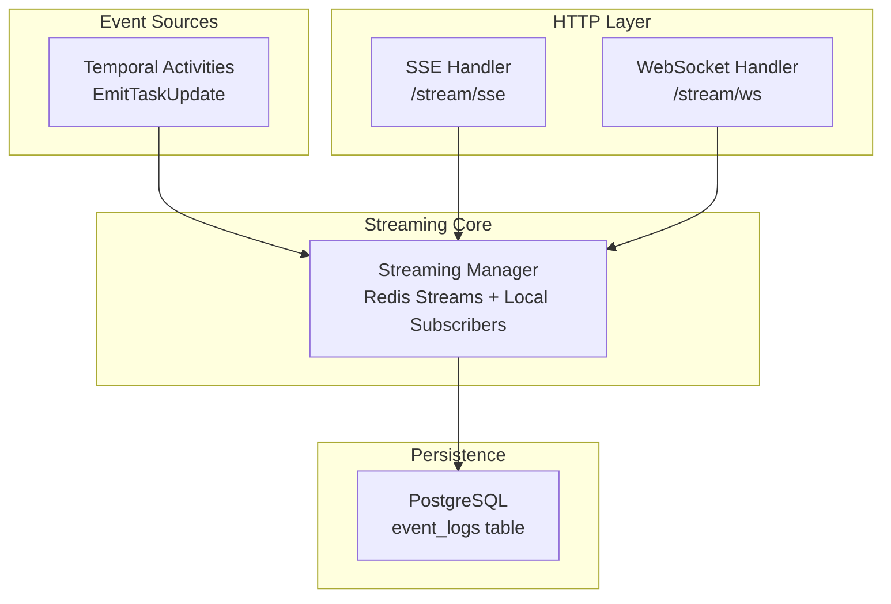
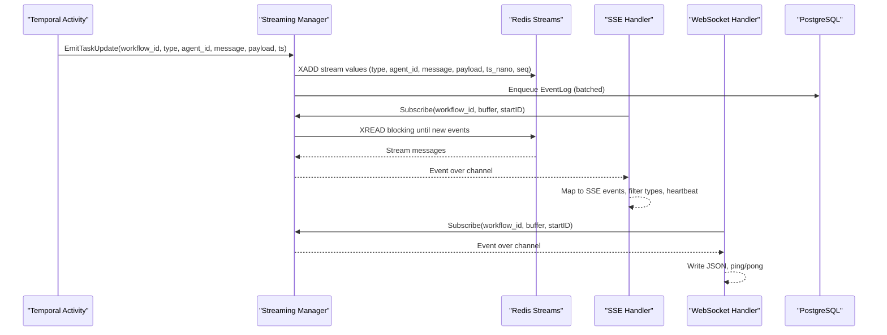
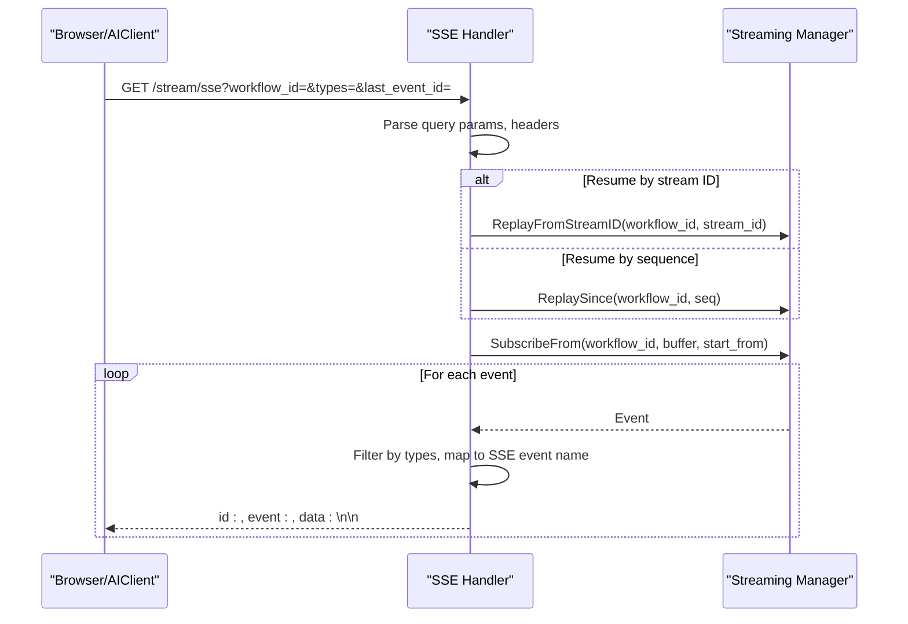
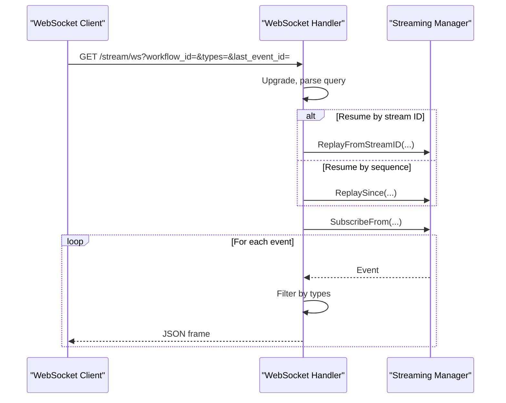
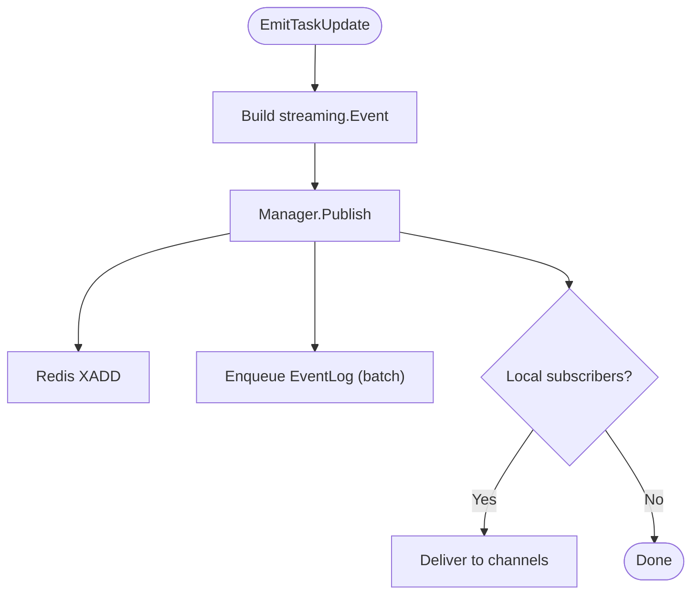
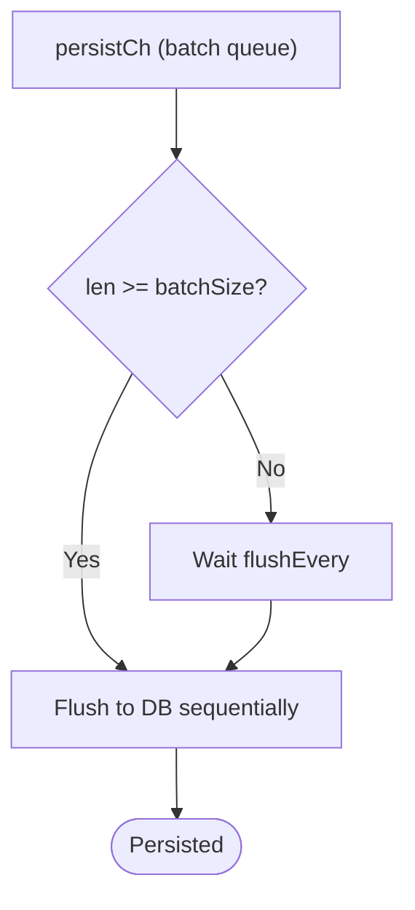
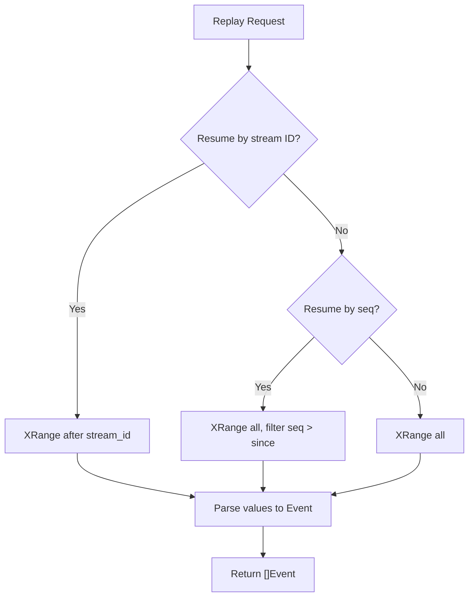
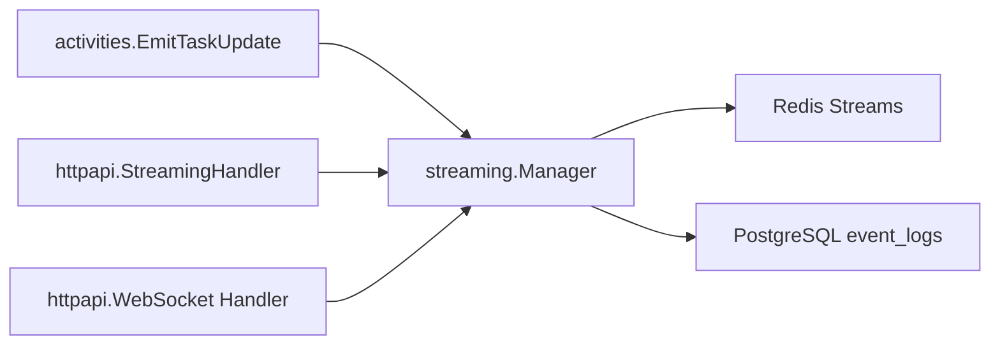

# Streaming Infrastructure

<cite>
**Referenced Files in This Document**
- [manager.go](file://go/orchestrator/internal/streaming/manager.go)
- [streaming.go](file://go/orchestrator/internal/httpapi/streaming.go)
- [websocket.go](file://go/orchestrator/internal/httpapi/websocket.go)
- [stream_events.go](file://go/orchestrator/internal/activities/stream_events.go)
- [event_log.go](file://go/orchestrator/internal/db/event_log.go)
- [event-types.md](file://docs/event-types.md)
- [streaming.go](file://go/orchestrator/internal/activities/streaming.go)
</cite>

## Table of Contents
1. [Introduction](#introduction)
2. [Project Structure](#project-structure)
3. [Core Components](#core-components)
4. [Architecture Overview](#architecture-overview)
5. [Detailed Component Analysis](#detailed-component-analysis)
6. [Dependency Analysis](#dependency-analysis)
7. [Performance Considerations](#performance-considerations)
8. [Troubleshooting Guide](#troubleshooting-guide)
9. [Conclusion](#conclusion)
10. [Appendices](#appendices)

## Introduction
This document describes Shannon’s real-time event streaming infrastructure for monitoring agent execution and workflow lifecycle. It covers:
- Server-Sent Events (SSE) and WebSocket streaming endpoints
- Redis Streams-based event publishing and replay
- Event persistence to PostgreSQL
- Event types (workflow lifecycle, agent execution, tool invocations, LLM outputs)
- Streaming manager architecture and event filtering
- Practical examples for connecting to streaming endpoints and building real-time dashboards
- Event replay for debugging and analysis
- Performance, connection management, and scaling guidance

## Project Structure
The streaming system spans Go backend components, HTTP handlers, Redis-backed event storage, and PostgreSQL persistence:
- Streaming manager: Redis Streams pub/sub, replay, persistence batching
- HTTP API: SSE and WebSocket handlers with resume and filtering
- Activities: Deterministic event emission via Temporal
- Persistence: PostgreSQL event_logs table



**Diagram sources**
- [streaming.go](file://go/orchestrator/internal/httpapi/streaming.go#L18-L38)
- [websocket.go](file://go/orchestrator/internal/httpapi/websocket.go#L18-L21)
- [manager.go](file://go/orchestrator/internal/streaming/manager.go#L36-L60)
- [event_log.go](file://go/orchestrator/internal/db/event_log.go#L10-L22)
- [stream_events.go](file://go/orchestrator/internal/activities/stream_events.go#L72-L91)

**Section sources**
- [streaming.go](file://go/orchestrator/internal/httpapi/streaming.go#L18-L38)
- [websocket.go](file://go/orchestrator/internal/httpapi/websocket.go#L18-L21)
- [manager.go](file://go/orchestrator/internal/streaming/manager.go#L36-L60)
- [event_log.go](file://go/orchestrator/internal/db/event_log.go#L10-L22)
- [stream_events.go](file://go/orchestrator/internal/activities/stream_events.go#L72-L91)

## Core Components
- Streaming Manager
  - Redis Streams-backed pub/sub for workflow events
  - In-memory ring buffer for live subscribers
  - Batching and async persistence to PostgreSQL
  - Replay by sequence or Redis stream ID
- HTTP Handlers
  - SSE: Server-Sent Events with resume, filtering, and heartbeat
  - WebSocket: JSON events with ping/pong and resume
- Event Emission
  - Deterministic events via Temporal activities
  - Minimal event model with type, message, payload, timestamps, and sequence

**Section sources**
- [manager.go](file://go/orchestrator/internal/streaming/manager.go#L19-L29)
- [manager.go](file://go/orchestrator/internal/streaming/manager.go#L36-L60)
- [streaming.go](file://go/orchestrator/internal/httpapi/streaming.go#L18-L38)
- [websocket.go](file://go/orchestrator/internal/httpapi/websocket.go#L18-L21)
- [stream_events.go](file://go/orchestrator/internal/activities/stream_events.go#L61-L91)

## Architecture Overview
The streaming pipeline:
1. Activities emit events deterministically using EmitTaskUpdate
2. Streaming Manager publishes to Redis Streams and optionally persists to PostgreSQL
3. HTTP handlers subscribe to live events and replay missed events
4. Clients consume via SSE or WebSocket with optional type filtering and resume



**Diagram sources**
- [stream_events.go](file://go/orchestrator/internal/activities/stream_events.go#L72-L91)
- [manager.go](file://go/orchestrator/internal/streaming/manager.go#L364-L492)
- [streaming.go](file://go/orchestrator/internal/httpapi/streaming.go#L40-L366)
- [websocket.go](file://go/orchestrator/internal/httpapi/websocket.go#L23-L154)
- [event_log.go](file://go/orchestrator/internal/db/event_log.go#L24-L46)

## Detailed Component Analysis

### Streaming Manager
Responsibilities:
- Publish events to Redis Streams and local subscribers
- Subscribe/unsubscribe with buffered channels and background readers
- Replay events by sequence number or Redis stream ID
- Persist selected events to PostgreSQL via a batching worker
- Manage capacity and cleanup on shutdown

Key behaviors:
- Redis keys: per-workflow stream key and a sequence counter key
- Backpressure: non-blocking send to subscribers; drops events for slow consumers
- Persistence: only important events are persisted; streaming deltas are not persisted
- Replay: supports resume from Redis stream ID or numeric sequence

```mermaid
classDiagram
class Manager {
-redis : redis.Client
-dbClient : db.Client
-persistCh : chan EventLog
-batchSize : int
-flushEvery : time.Duration
-subscribers : map[string]map[chan Event]*subscription
-capacity : int
-logger : Logger
-shutdownCh : chan
-wg : WaitGroup
-persistWg : WaitGroup
+Subscribe(workflowID, buffer) chan Event
+SubscribeFrom(workflowID, buffer, startID) chan Event
+Unsubscribe(workflowID, ch) void
+Publish(workflowID, Event) void
+ReplaySince(workflowID, since) []Event
+ReplayFromStreamID(workflowID, streamID) []Event
+GetLastStreamID(workflowID) string
+HasEmittedCompletion(ctx, workflowID) bool
+Shutdown(ctx) error
}
class Event {
+string WorkflowID
+string Type
+string AgentID
+string Message
+map[string]interface{} Payload
+time.Time Timestamp
+uint64 Seq
+string StreamID
+Marshal() []byte
}
Manager --> Event : "publishes"
```

**Diagram sources**
- [manager.go](file://go/orchestrator/internal/streaming/manager.go#L36-L60)
- [manager.go](file://go/orchestrator/internal/streaming/manager.go#L19-L29)

**Section sources**
- [manager.go](file://go/orchestrator/internal/streaming/manager.go#L36-L60)
- [manager.go](file://go/orchestrator/internal/streaming/manager.go#L142-L150)
- [manager.go](file://go/orchestrator/internal/streaming/manager.go#L152-L178)
- [manager.go](file://go/orchestrator/internal/streaming/manager.go#L180-L321)
- [manager.go](file://go/orchestrator/internal/streaming/manager.go#L364-L492)
- [manager.go](file://go/orchestrator/internal/streaming/manager.go#L698-L754)
- [manager.go](file://go/orchestrator/internal/streaming/manager.go#L756-L807)
- [manager.go](file://go/orchestrator/internal/streaming/manager.go#L809-L825)
- [manager.go](file://go/orchestrator/internal/streaming/manager.go#L827-L862)
- [manager.go](file://go/orchestrator/internal/streaming/manager.go#L864-L921)

### SSE Handler
Features:
- Accepts workflow_id and optional types filter
- Supports resume via Last-Event-ID or last_event_id (Redis stream ID or numeric)
- Maps internal event types to SSE event names (e.g., LLM_PARTIAL -> thread.message.delta)
- Writes comments, id, event, and data lines; flushes after each event
- Sends periodic heartbeat comments
- Closes on STREAM_END or terminal events when filtered



**Diagram sources**
- [streaming.go](file://go/orchestrator/internal/httpapi/streaming.go#L40-L366)
- [manager.go](file://go/orchestrator/internal/streaming/manager.go#L698-L754)
- [manager.go](file://go/orchestrator/internal/streaming/manager.go#L756-L807)

**Section sources**
- [streaming.go](file://go/orchestrator/internal/httpapi/streaming.go#L40-L366)

### WebSocket Handler
Features:
- Upgrades to WebSocket with permissive origin in development
- Supports resume and type filtering similar to SSE
- Writes JSON frames for each event
- Ping/Pong handling with read deadlines
- Reader goroutine discards inbound messages



**Diagram sources**
- [websocket.go](file://go/orchestrator/internal/httpapi/websocket.go#L23-L154)
- [manager.go](file://go/orchestrator/internal/streaming/manager.go#L698-L754)
- [manager.go](file://go/orchestrator/internal/streaming/manager.go#L756-L807)

**Section sources**
- [websocket.go](file://go/orchestrator/internal/httpapi/websocket.go#L23-L154)

### Event Emission and Types
Activities emit events deterministically via EmitTaskUpdate. The event types include:
- Workflow lifecycle: WORKFLOW_STARTED, WORKFLOW_COMPLETED, WORKFLOW_PAUSING, WORKFLOW_PAUSED, WORKFLOW_RESUMED, WORKFLOW_CANCELLING, WORKFLOW_CANCELLED
- Agent lifecycle: AGENT_STARTED, AGENT_COMPLETED, AGENT_THINKING
- LLM: LLM_PROMPT, LLM_PARTIAL, LLM_OUTPUT, TOOL_OBSERVATION
- Tools: TOOL_INVOKED
- Progress/status: PROGRESS, DATA_PROCESSING, TEAM_STATUS, WAITING, WORKSPACE_UPDATED
- Multi-agent: DELEGATION, MESSAGE_SENT, MESSAGE_RECEIVED, TEAM_RECRUITED, TEAM_RETIRED, ROLE_ASSIGNED
- Human interaction: APPROVAL_REQUESTED, APPROVAL_DECISION
- Advanced: DEPENDENCY_SATISFIED, ERROR_RECOVERY, BUDGET_THRESHOLD
- Stream lifecycle: STREAM_END



**Diagram sources**
- [stream_events.go](file://go/orchestrator/internal/activities/stream_events.go#L72-L91)
- [manager.go](file://go/orchestrator/internal/streaming/manager.go#L364-L492)

**Section sources**
- [stream_events.go](file://go/orchestrator/internal/activities/stream_events.go#L11-L59)
- [event-types.md](file://docs/event-types.md#L34-L681)

### Event Persistence
- PostgreSQL table: event_logs with fields for id, workflow_id, type, agent_id, message, payload, timestamp, seq, stream_id, created_at
- Manager persists only important events (not streaming deltas)
- Batching: configurable batch size and interval; async flush worker
- Conflict handling: upsert with conflict on (workflow_id, type, seq) when seq is present



**Diagram sources**
- [manager.go](file://go/orchestrator/internal/streaming/manager.go#L95-L127)
- [manager.go](file://go/orchestrator/internal/streaming/manager.go#L661-L696)
- [event_log.go](file://go/orchestrator/internal/db/event_log.go#L24-L46)

**Section sources**
- [event_log.go](file://go/orchestrator/internal/db/event_log.go#L10-L22)
- [manager.go](file://go/orchestrator/internal/streaming/manager.go#L500-L536)
- [manager.go](file://go/orchestrator/internal/streaming/manager.go#L661-L696)

### Event Replay
- ReplaySince: returns events with seq > since
- ReplayFromStreamID: returns events after a given Redis stream ID
- SSE/WS handlers use resume points to replay missed events before subscribing to live



**Diagram sources**
- [manager.go](file://go/orchestrator/internal/streaming/manager.go#L698-L754)
- [manager.go](file://go/orchestrator/internal/streaming/manager.go#L756-L807)

**Section sources**
- [manager.go](file://go/orchestrator/internal/streaming/manager.go#L698-L807)

## Dependency Analysis
- Streaming Manager depends on Redis client and optional PostgreSQL client
- HTTP handlers depend on Streaming Manager for subscription and replay
- Activities depend on Streaming Manager via EmitTaskUpdate
- Persistence depends on DB client and event_log schema



**Diagram sources**
- [stream_events.go](file://go/orchestrator/internal/activities/stream_events.go#L72-L91)
- [streaming.go](file://go/orchestrator/internal/httpapi/streaming.go#L18-L38)
- [websocket.go](file://go/orchestrator/internal/httpapi/websocket.go#L18-L21)
- [manager.go](file://go/orchestrator/internal/streaming/manager.go#L36-L60)
- [event_log.go](file://go/orchestrator/internal/db/event_log.go#L10-L22)

**Section sources**
- [stream_events.go](file://go/orchestrator/internal/activities/stream_events.go#L72-L91)
- [streaming.go](file://go/orchestrator/internal/httpapi/streaming.go#L18-L38)
- [websocket.go](file://go/orchestrator/internal/httpapi/websocket.go#L18-L21)
- [manager.go](file://go/orchestrator/internal/streaming/manager.go#L36-L60)
- [event_log.go](file://go/orchestrator/internal/db/event_log.go#L10-L22)

## Performance Considerations
- Redis Streams
  - MaxLen with approximate trimming to bound memory usage
  - Blocking XRead with small counts and short blocks to balance latency and CPU
  - TTL on stream and sequence keys to prevent unbounded growth
- Backpressure
  - Non-blocking send to subscribers; slow consumers risk dropped events
  - Critical events are logged at higher severity when dropped
- Batching persistence
  - Configurable batch size and flush interval
  - Sequential writes per batch; could be optimized to bulk insert if needed
- Capacity tuning
  - Default ring buffer capacity is 256; configurable via Configure
  - Adjust based on workflow duration and event volume
- Network
  - SSE: flush after each event; heartbeat comments keep connections alive
  - WebSocket: ping/pong with read deadlines; discard inbound messages

[No sources needed since this section provides general guidance]

## Troubleshooting Guide
Common issues and remedies:
- Slow subscribers
  - Symptom: warnings about dropped events
  - Action: increase subscriber buffer, reduce event volume, or filter types
- Missing resume continuity
  - Symptom: gaps after reconnect
  - Action: use Redis stream ID or numeric sequence in last_event_id; handlers replay before live subscription
- No events despite workflow running
  - Symptom: SSE/WS connects but no data
  - Action: verify workflow_id; check first-event timeout and Temporal availability; confirm event emission in activities
- Persistence backlog
  - Symptom: DB write lag
  - Action: tune batch size and flush interval; monitor persistCh saturation logs
- Redis connectivity
  - Symptom: errors reading from Redis stream
  - Action: verify Redis client initialization; check network and credentials

**Section sources**
- [manager.go](file://go/orchestrator/internal/streaming/manager.go#L306-L317)
- [streaming.go](file://go/orchestrator/internal/httpapi/streaming.go#L284-L312)
- [manager.go](file://go/orchestrator/internal/streaming/manager.go#L661-L696)

## Conclusion
Shannon’s streaming infrastructure combines Redis Streams for low-latency, bounded real-time delivery with PostgreSQL persistence for reliable historical queries. The SSE and WebSocket endpoints offer flexible, filterable, and resumable streams suitable for dashboards and monitoring. The Streaming Manager centralizes event publishing, replay, and persistence, while activities ensure deterministic event emission. With proper configuration and filtering, the system scales to high-throughput scenarios.

[No sources needed since this section summarizes without analyzing specific files]

## Appendices

### Practical Examples

- Connect via Server-Sent Events
  - Basic: GET /stream/sse?workflow_id={id}
  - Filter types: GET /stream/sse?workflow_id={id}&types=WORKFLOW_STARTED,AGENT_COMPLETED
  - Resume: GET /stream/sse?workflow_id={id}&last_event_id={1700000000000-0}
  - Resume by sequence: GET /stream/sse?workflow_id={id}&last_event_id=123

- Connect via WebSocket
  - Basic: GET /stream/ws?workflow_id={id}
  - Filter types: GET /stream/ws?workflow_id={id}&types=LLM_OUTPUT,ERROR_OCCURRED
  - Resume: GET /stream/ws?workflow_id={id}&last_event_id={1700000000000-0}

- Handling event types in UI
  - Chat UI: exclude LLM_PARTIAL; include LLM_OUTPUT, AGENT_THINKING, PROGRESS
  - Progress dashboard: include WORKFLOW_STARTED, PROGRESS, WORKFLOW_COMPLETED
  - Error monitoring: include ERROR_OCCURRED, ERROR_RECOVERY

- Building a real-time dashboard
  - Subscribe to SSE or WebSocket with desired types
  - Maintain a timeline keyed by workflow_id
  - Render LLM_OUTPUT as final messages; ignore LLM_PARTIAL for cleaner UI
  - Use resume to recover from disconnections

- Event replay for debugging
  - ReplaySince(workflow_id, seq) to fetch events after a known sequence
  - ReplayFromStreamID(workflow_id, stream_id) to replay after a Redis stream ID
  - Use in combination with SSE/WS resume to reconstruct timelines

**Section sources**
- [event-types.md](file://docs/event-types.md#L456-L511)
- [streaming.go](file://go/orchestrator/internal/httpapi/streaming.go#L40-L366)
- [websocket.go](file://go/orchestrator/internal/httpapi/websocket.go#L23-L154)
- [manager.go](file://go/orchestrator/internal/streaming/manager.go#L698-L807)

### Scaling Recommendations
- Horizontal scale-out
  - Run multiple gateway instances behind a load balancer
  - Ensure Redis is highly available and sized for peak concurrency
- Backpressure management
  - Increase subscriber buffer sizes; consider fan-out to multiple channels
  - Apply type filtering at the client to reduce bandwidth
- Persistence scaling
  - Tune batch size and flush interval for throughput vs. latency
  - Consider bulk insert optimization for PostgreSQL writes
- Capacity planning
  - Monitor ring buffer drops and adjust capacity
  - Track Redis memory usage and stream retention policies

[No sources needed since this section provides general guidance]