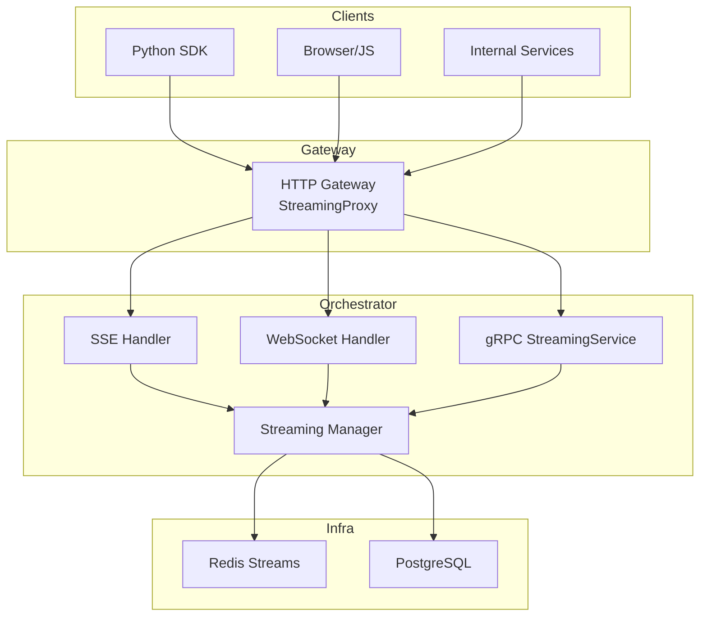
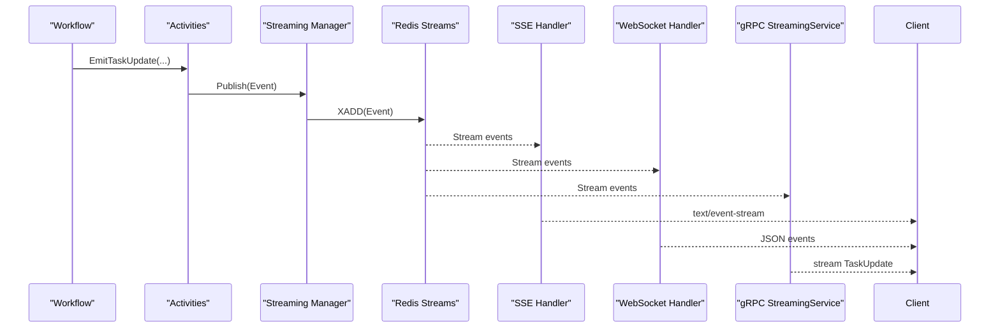
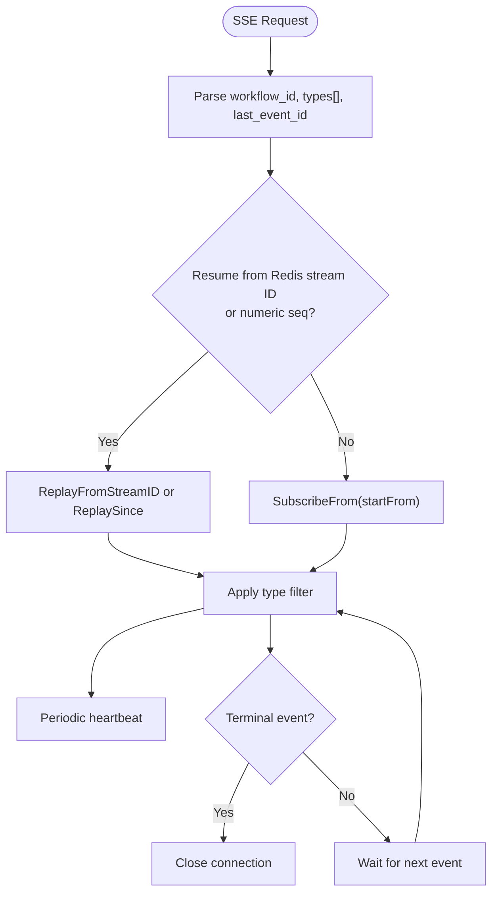
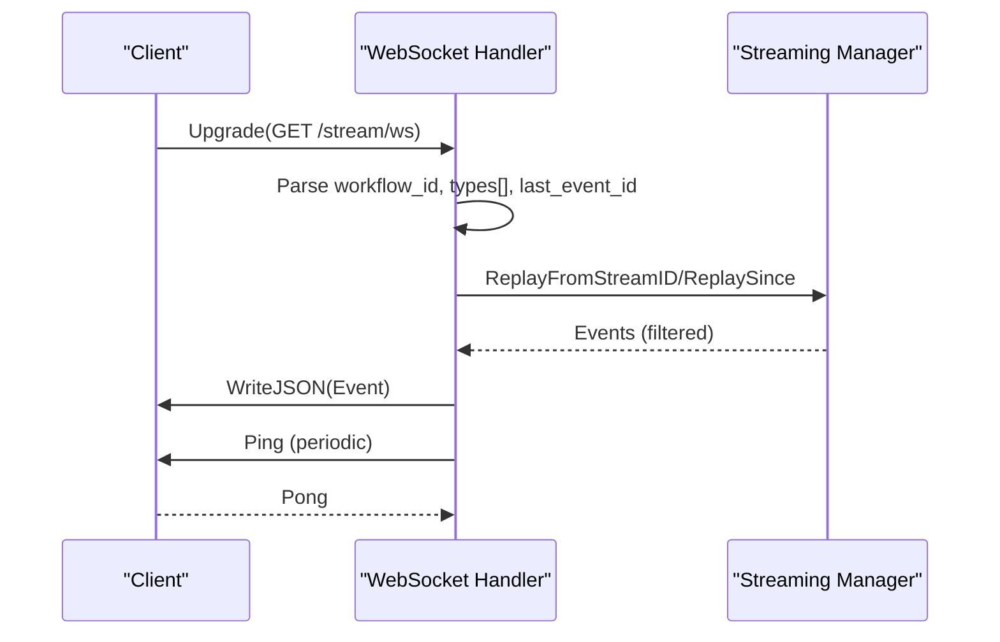
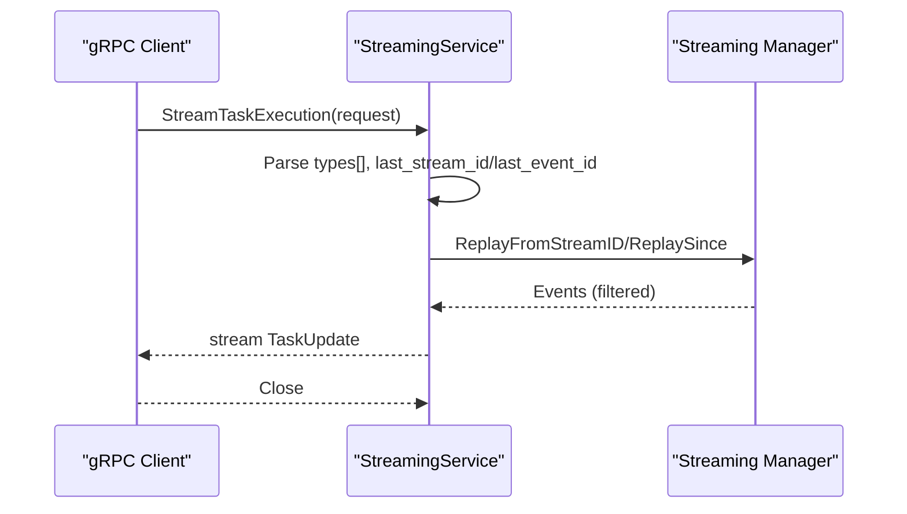
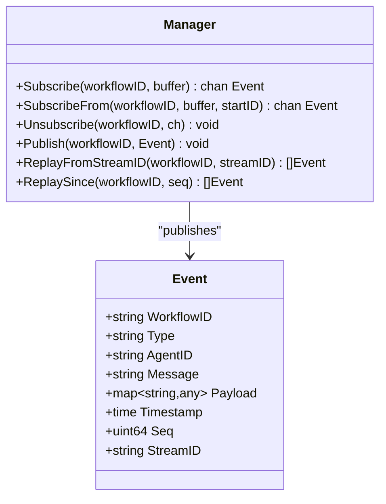
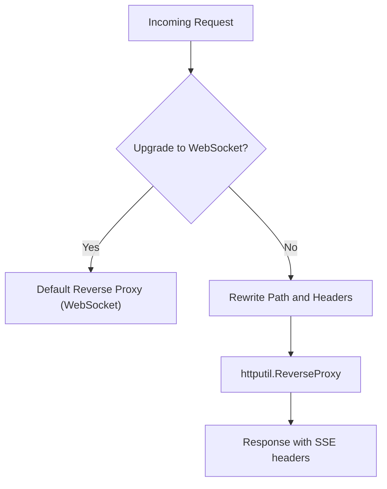
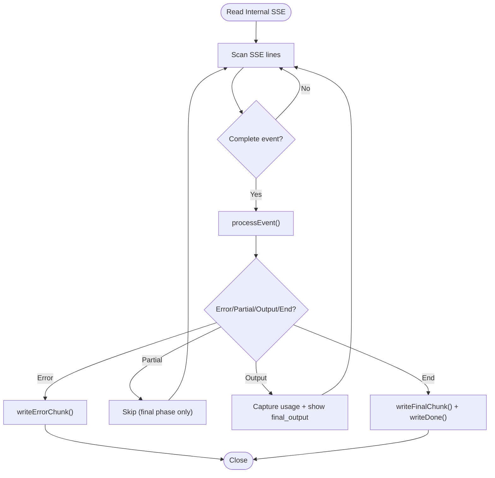
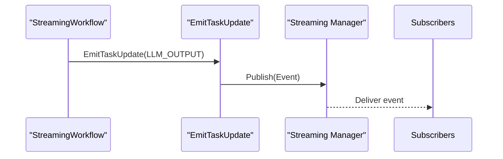
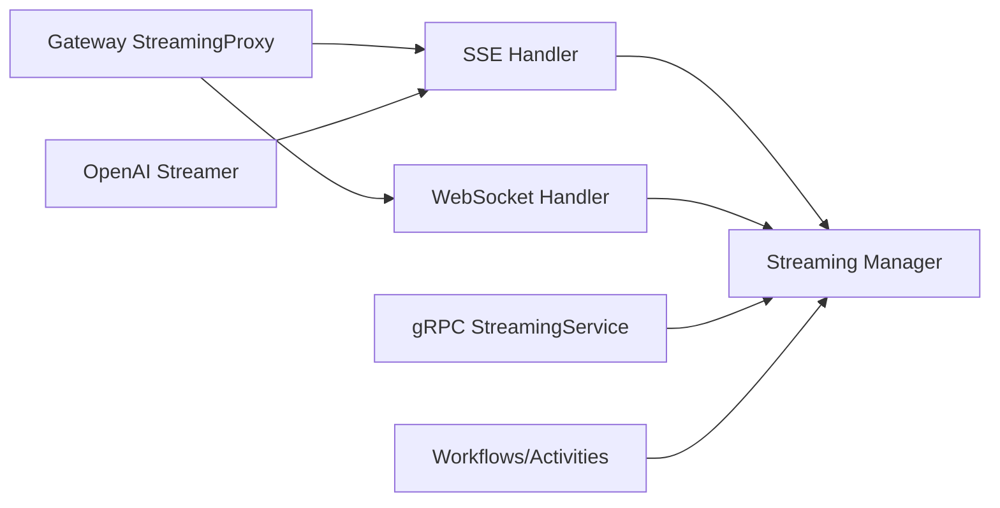

# Streaming Protocols and Integration

<cite>
**Referenced Files in This Document**
- [docs/streaming-api.md](file://docs/streaming-api.md)
- [go/orchestrator/internal/httpapi/streaming.go](file://go/orchestrator/internal/httpapi/streaming.go)
- [go/orchestrator/internal/httpapi/websocket.go](file://go/orchestrator/internal/httpapi/websocket.go)
- [go/orchestrator/internal/server/streaming_service.go](file://go/orchestrator/internal/server/streaming_service.go)
- [go/orchestrator/internal/streaming/manager.go](file://go/orchestrator/internal/streaming/manager.go)
- [go/orchestrator/cmd/gateway/internal/proxy/streaming.go](file://go/orchestrator/cmd/gateway/internal/proxy/streaming.go)
- [go/orchestrator/cmd/gateway/internal/openai/streamer.go](file://go/orchestrator/cmd/gateway/internal/openai/streamer.go)
- [go/orchestrator/internal/workflows/streaming_workflow.go](file://go/orchestrator/internal/workflows/streaming_workflow.go)
- [go/orchestrator/internal/activities/stream_events.go](file://go/orchestrator/internal/activities/stream_events.go)
- [protos/orchestrator/streaming.proto](file://protos/orchestrator/streaming.proto)
- [clients/python/src/shannon/client.py](file://clients/python/src/shannon/client.py)
</cite>

## Table of Contents
1. [Introduction](#introduction)
2. [Project Structure](#project-structure)
3. [Core Components](#core-components)
4. [Architecture Overview](#architecture-overview)
5. [Detailed Component Analysis](#detailed-component-analysis)
6. [Dependency Analysis](#dependency-analysis)
7. [Performance Considerations](#performance-considerations)
8. [Troubleshooting Guide](#troubleshooting-guide)
9. [Conclusion](#conclusion)
10. [Appendices](#appendices)

## Introduction
This document explains Shannon’s dual-protocol streaming architecture that supports both Server-Sent Events (SSE) and WebSocket transports alongside a native gRPC streaming service. It covers protocol selection criteria, performance characteristics, event propagation across services, protocol-specific optimizations, interoperability, migration strategies, monitoring approaches, edge cases, and production best practices.

## Project Structure
Shannon’s streaming stack spans orchestrator services, HTTP gateways, and client SDKs:
- HTTP API handlers expose SSE and WebSocket endpoints for real-time event delivery.
- A gRPC StreamingService provides enterprise-grade streaming for internal clients.
- An in-process streaming manager coordinates Redis-backed event publishing, replay, and subscription.
- A gateway proxy rewrites paths and preserves streaming semantics for SSE/WebSocket.
- An OpenAI-compatible streamer transforms internal events into OpenAI-compatible SSE chunks.
- Workflows emit deterministic events that are published to the stream manager.
- Clients (Python SDK) consume SSE/WebSocket or gRPC streams.

**Diagram sources**
- [go/orchestrator/internal/httpapi/streaming.go](file://go/orchestrator/internal/httpapi/streaming.go#L40-L366)
- [go/orchestrator/internal/httpapi/websocket.go](file://go/orchestrator/internal/httpapi/websocket.go#L23-L154)
- [go/orchestrator/internal/server/streaming_service.go](file://go/orchestrator/internal/server/streaming_service.go#L34-L162)
- [go/orchestrator/internal/streaming/manager.go](file://go/orchestrator/internal/streaming/manager.go#L152-L321)
- [go/orchestrator/cmd/gateway/internal/proxy/streaming.go](file://go/orchestrator/cmd/gateway/internal/proxy/streaming.go#L12-L95)

**Section sources**
- [docs/streaming-api.md](file://docs/streaming-api.md#L1-L554)

## Core Components
- Streaming Manager: Manages Redis Streams, publishes events, replays historical events, and maintains in-memory subscriptions with backpressure.
- SSE Handler: Implements Server-Sent Events with resume semantics, heartbeat, and event mapping.
- WebSocket Handler: Implements bidirectional WebSocket transport with ping/pong and resume semantics.
- gRPC StreamingService: Provides a strongly-typed, streaming RPC with resume and type filtering.
- Gateway StreamingProxy: Rewrites paths and preserves streaming headers for SSE/WebSocket.
- OpenAI Streamer: Transforms internal events into OpenAI-compatible SSE chunks for API compatibility.
- Workflow and Activities: Emit deterministic events that are published to the stream manager.

**Section sources**
- [go/orchestrator/internal/streaming/manager.go](file://go/orchestrator/internal/streaming/manager.go#L19-L140)
- [go/orchestrator/internal/httpapi/streaming.go](file://go/orchestrator/internal/httpapi/streaming.go#L40-L366)
- [go/orchestrator/internal/httpapi/websocket.go](file://go/orchestrator/internal/httpapi/websocket.go#L23-L154)
- [go/orchestrator/internal/server/streaming_service.go](file://go/orchestrator/internal/server/streaming_service.go#L34-L162)
- [go/orchestrator/cmd/gateway/internal/proxy/streaming.go](file://go/orchestrator/cmd/gateway/internal/proxy/streaming.go#L12-L95)
- [go/orchestrator/cmd/gateway/internal/openai/streamer.go](file://go/orchestrator/cmd/gateway/internal/openai/streamer.go#L94-L227)
- [go/orchestrator/internal/workflows/streaming_workflow.go](file://go/orchestrator/internal/workflows/streaming_workflow.go#L281-L295)
- [go/orchestrator/internal/activities/stream_events.go](file://go/orchestrator/internal/activities/stream_events.go#L72-L91)

## Architecture Overview
Shannon’s streaming architecture is designed around deterministic event emission, Redis-backed replay, and multi-transport delivery:
- Workflows emit typed events via activities.
- Events are published to Redis Streams and optionally persisted to PostgreSQL.
- Subscribers (SSE, WebSocket, gRPC) receive live events and can resume from Redis stream IDs or numeric sequence IDs.
- The gateway preserves streaming semantics and rewrites paths for SSE/WebSocket.

**Diagram sources**
- [go/orchestrator/internal/workflows/streaming_workflow.go](file://go/orchestrator/internal/workflows/streaming_workflow.go#L281-L295)
- [go/orchestrator/internal/activities/stream_events.go](file://go/orchestrator/internal/activities/stream_events.go#L72-L91)
- [go/orchestrator/internal/streaming/manager.go](file://go/orchestrator/internal/streaming/manager.go#L365-L440)
- [go/orchestrator/internal/httpapi/streaming.go](file://go/orchestrator/internal/httpapi/streaming.go#L186-L200)
- [go/orchestrator/internal/httpapi/websocket.go](file://go/orchestrator/internal/httpapi/websocket.go#L135-L152)
- [go/orchestrator/internal/server/streaming_service.go](file://go/orchestrator/internal/server/streaming_service.go#L152-L161)

## Detailed Component Analysis

### SSE Handler: Real-time Delivery and Resume Semantics
- Supports Last-Event-ID header and last_event_id query parameter for resume.
- Maps internal event types to SSE event names (e.g., thread.message.delta, thread.message.completed).
- Sends periodic heartbeat comments to keep connections alive.
- Applies type filters and closes on terminal events.

**Diagram sources**
- [go/orchestrator/internal/httpapi/streaming.go](file://go/orchestrator/internal/httpapi/streaming.go#L40-L366)

**Section sources**
- [go/orchestrator/internal/httpapi/streaming.go](file://go/orchestrator/internal/httpapi/streaming.go#L40-L366)

### WebSocket Handler: Bidirectional Transport with Ping/Pong
- Upgrades HTTP to WebSocket with permissive origin in development.
- Supports resume via Redis stream ID or numeric sequence.
- Heartbeat ping/pong keeps connections alive; reader goroutine discards client messages.
- Writes JSON events to clients.

**Diagram sources**
- [go/orchestrator/internal/httpapi/websocket.go](file://go/orchestrator/internal/httpapi/websocket.go#L23-L154)

**Section sources**
- [go/orchestrator/internal/httpapi/websocket.go](file://go/orchestrator/internal/httpapi/websocket.go#L23-L154)

### gRPC StreamingService: Strongly-Typed Enterprise Streaming
- StreamTaskExecution RPC supports resume via last_stream_id (preferred) or last_event_id.
- Applies type filters and closes on WORKFLOW_COMPLETED.
- Validates workflow existence using Temporal DescribeWorkflowExecution with a first-event timeout.

**Diagram sources**
- [go/orchestrator/internal/server/streaming_service.go](file://go/orchestrator/internal/server/streaming_service.go#L34-L162)
- [protos/orchestrator/streaming.proto](file://protos/orchestrator/streaming.proto#L12-L27)

**Section sources**
- [go/orchestrator/internal/server/streaming_service.go](file://go/orchestrator/internal/server/streaming_service.go#L34-L162)
- [protos/orchestrator/streaming.proto](file://protos/orchestrator/streaming.proto#L8-L27)

### Streaming Manager: Redis Streams, Replay, and Backpressure
- Publishes events to Redis Streams with MaxLen and TTL.
- Maintains in-memory subscribers with bounded channels and non-blocking delivery.
- Provides ReplayFromStreamID and ReplaySince for deterministic resume.
- Persists important events to PostgreSQL via a batching worker.

**Diagram sources**
- [go/orchestrator/internal/streaming/manager.go](file://go/orchestrator/internal/streaming/manager.go#L19-L140)
- [go/orchestrator/internal/streaming/manager.go](file://go/orchestrator/internal/streaming/manager.go#L365-L492)

**Section sources**
- [go/orchestrator/internal/streaming/manager.go](file://go/orchestrator/internal/streaming/manager.go#L152-L321)
- [go/orchestrator/internal/streaming/manager.go](file://go/orchestrator/internal/streaming/manager.go#L698-L800)

### Gateway StreamingProxy: Path Rewriting and Streaming Headers
- Rewrites /api/v1/stream/* to /stream/* for SSE/WebSocket.
- Preserves streaming headers and ensures immediate flush for SSE.
- Delegates WebSocket upgrades to the default reverse proxy.

**Diagram sources**
- [go/orchestrator/cmd/gateway/internal/proxy/streaming.go](file://go/orchestrator/cmd/gateway/internal/proxy/streaming.go#L74-L95)

**Section sources**
- [go/orchestrator/cmd/gateway/internal/proxy/streaming.go](file://go/orchestrator/cmd/gateway/internal/proxy/streaming.go#L12-L95)

### OpenAI-Compatible Streamer: SSE Transformation
- Reads internal SSE and writes OpenAI-compatible SSE chunks.
- Filters and aggregates usage metadata; writes final chunk with finish_reason.
- Implements keepalive heartbeat to maintain client connections.

**Diagram sources**
- [go/orchestrator/cmd/gateway/internal/openai/streamer.go](file://go/orchestrator/cmd/gateway/internal/openai/streamer.go#L94-L227)

**Section sources**
- [go/orchestrator/cmd/gateway/internal/openai/streamer.go](file://go/orchestrator/cmd/gateway/internal/openai/streamer.go#L94-L227)

### Event Emission and Workflow Integration
- Workflows emit typed events (e.g., LLM_OUTPUT, WORKFLOW_COMPLETED) via EmitTaskUpdate.
- These events are published to the streaming manager and delivered to all transports.

**Diagram sources**
- [go/orchestrator/internal/workflows/streaming_workflow.go](file://go/orchestrator/internal/workflows/streaming_workflow.go#L281-L295)
- [go/orchestrator/internal/activities/stream_events.go](file://go/orchestrator/internal/activities/stream_events.go#L72-L91)

**Section sources**
- [go/orchestrator/internal/workflows/streaming_workflow.go](file://go/orchestrator/internal/workflows/streaming_workflow.go#L281-L295)
- [go/orchestrator/internal/activities/stream_events.go](file://go/orchestrator/internal/activities/stream_events.go#L72-L91)

## Dependency Analysis
- SSE and WebSocket handlers depend on the Streaming Manager for replay and subscription.
- gRPC StreamingService depends on the Streaming Manager and Temporal client for workflow validation.
- Gateway StreamingProxy depends on the SSE/WS handlers and the admin server.
- OpenAI Streamer depends on internal SSE events and transforms them to OpenAI-compatible chunks.
- Workflows and activities depend on the Streaming Manager for event publication.

**Diagram sources**
- [go/orchestrator/internal/httpapi/streaming.go](file://go/orchestrator/internal/httpapi/streaming.go#L40-L366)
- [go/orchestrator/internal/httpapi/websocket.go](file://go/orchestrator/internal/httpapi/websocket.go#L23-L154)
- [go/orchestrator/internal/server/streaming_service.go](file://go/orchestrator/internal/server/streaming_service.go#L34-L162)
- [go/orchestrator/cmd/gateway/internal/proxy/streaming.go](file://go/orchestrator/cmd/gateway/internal/proxy/streaming.go#L12-L95)
- [go/orchestrator/cmd/gateway/internal/openai/streamer.go](file://go/orchestrator/cmd/gateway/internal/openai/streamer.go#L94-L227)
- [go/orchestrator/internal/streaming/manager.go](file://go/orchestrator/internal/streaming/manager.go#L152-L321)

**Section sources**
- [go/orchestrator/internal/streaming/manager.go](file://go/orchestrator/internal/streaming/manager.go#L152-L321)

## Performance Considerations
- Redis Streams: bounded length (default ~256 events) with 24-hour TTL for replay and debugging.
- Backpressure: non-blocking delivery to subscribers; slow clients risk dropped events.
- Batch persistence: PostgreSQL writes are batched and flushed periodically to reduce DB load.
- Heartbeats: SSE pings every ~10s; WebSocket pings every ~20s; OpenAI streamer sends keepalive comments.
- Fan-out: for high fan-out scenarios, place an external event gateway (e.g., NGINX) in front of the orchestrator.

**Section sources**
- [docs/streaming-api.md](file://docs/streaming-api.md#L280-L298)
- [go/orchestrator/internal/streaming/manager.go](file://go/orchestrator/internal/streaming/manager.go#L661-L696)

## Troubleshooting Guide
Common issues and resolutions:
- No events received: verify workflow_id, streaming_v1 gate, admin HTTP accessibility, and event types.
- Events missing after reconnect: use last_event_id (Redis stream ID preferred) or Last-Event-ID header.
- High memory usage: reduce ring buffer capacity, implement client-side filtering, and use connection pooling.
- Python async runtime error: avoid awaiting other client calls inside async-for; break out first, then await.
- Invalid workflow detection: SSE/WS emit ERROR_OCCURRED before closing; gRPC returns NotFound; both paths include heartbeats to keep connections alive.

**Section sources**
- [docs/streaming-api.md](file://docs/streaming-api.md#L402-L445)
- [go/orchestrator/internal/httpapi/streaming.go](file://go/orchestrator/internal/httpapi/streaming.go#L284-L312)
- [go/orchestrator/internal/server/streaming_service.go](file://go/orchestrator/internal/server/streaming_service.go#L108-L126)

## Conclusion
Shannon’s streaming architecture provides a robust, deterministic, and multi-transport solution for real-time event delivery. SSE and WebSocket offer broad browser and client compatibility, while gRPC suits enterprise clients requiring strong typing and resilience. The design emphasizes replay safety, backpressure handling, and operational simplicity, with clear guidance for monitoring, migration, and production hardening.

## Appendices

### Protocol Selection Criteria and Recommendations
- Choose SSE for:
  - Browser-native real-time dashboards and logs.
  - Simple consumers that do not need bidirectional messaging.
  - Environments where WebSocket proxies are constrained.
- Choose WebSocket for:
  - Interactive applications requiring bidirectional control messages.
  - Low-latency client-server interactions.
- Choose gRPC for:
  - Internal microservices and enterprise clients.
  - Strong typing, built-in resume semantics, and seamless integration with Temporal.

**Section sources**
- [docs/streaming-api.md](file://docs/streaming-api.md#L293-L298)

### Protocol Interoperability and Migration Strategies
- SSE/WS to gRPC: migrate clients to use StreamTaskExecution with resume semantics; maintain SSE/WS for browser dashboards.
- OpenAI-compatible SSE: use the OpenAI Streamer to expose SSE endpoints compatible with OpenAI clients.
- Migration steps:
  - Enable both transports during transition.
  - Update clients to use last_stream_id for resume.
  - Monitor latency and throughput for each transport.
  - Decommission legacy transports after validation.

**Section sources**
- [go/orchestrator/cmd/gateway/internal/openai/streamer.go](file://go/orchestrator/cmd/gateway/internal/openai/streamer.go#L94-L227)
- [docs/streaming-api.md](file://docs/streaming-api.md#L136-L177)

### Monitoring Approaches
- SSE/WS:
  - Observe heartbeat intervals and dropped events.
  - Track connection churn and reconnect rates.
- gRPC:
  - Monitor stream durations, error codes (NotFound, Internal), and first-event timeout behavior.
- Infrastructure:
  - Monitor Redis stream length, TTL, and persistence batch sizes.
  - Track PostgreSQL write throughput and batch flush intervals.

**Section sources**
- [go/orchestrator/internal/httpapi/streaming.go](file://go/orchestrator/internal/httpapi/streaming.go#L360-L363)
- [go/orchestrator/internal/httpapi/websocket.go](file://go/orchestrator/internal/httpapi/websocket.go#L148-L151)
- [go/orchestrator/internal/server/streaming_service.go](file://go/orchestrator/internal/server/streaming_service.go#L108-L126)
- [go/orchestrator/internal/streaming/manager.go](file://go/orchestrator/internal/streaming/manager.go#L661-L696)

### Practical Examples: Choosing Between SSE and WebSocket
- SSE example (curl): watch agent lifecycle and LLM output.
- WebSocket example (JS): subscribe to JSON events and handle pongs.
- Choose SSE for simple dashboards and logs; choose WebSocket for interactive control.

**Section sources**
- [docs/streaming-api.md](file://docs/streaming-api.md#L142-L177)

### Client SDK Integration (Python)
- AsyncShannonClient supports submitting tasks and retrieving stream URLs.
- Use stream URLs for SSE/WebSocket or integrate with gRPC StreamingService for enterprise clients.

**Section sources**
- [clients/python/src/shannon/client.py](file://clients/python/src/shannon/client.py#L252-L341)