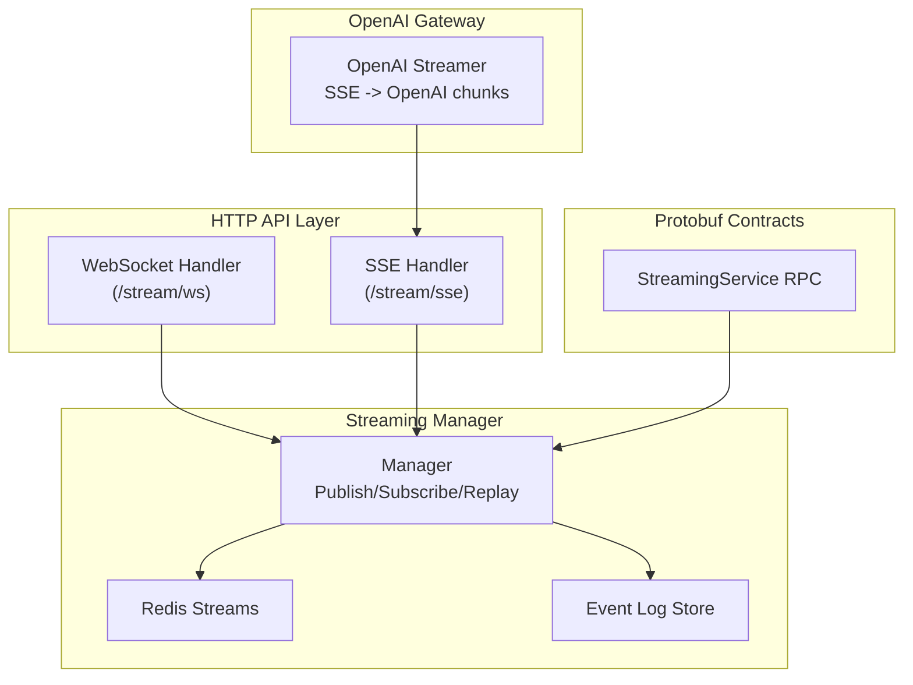
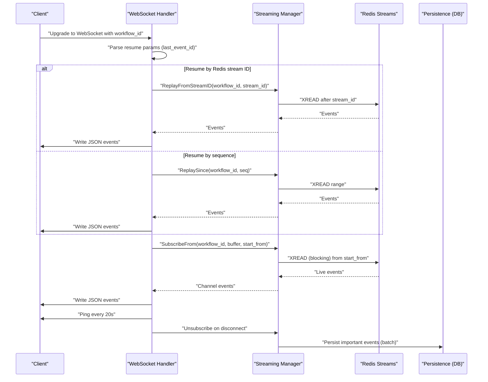
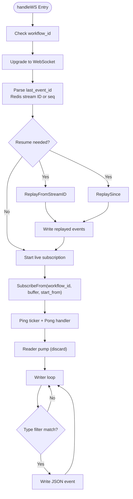
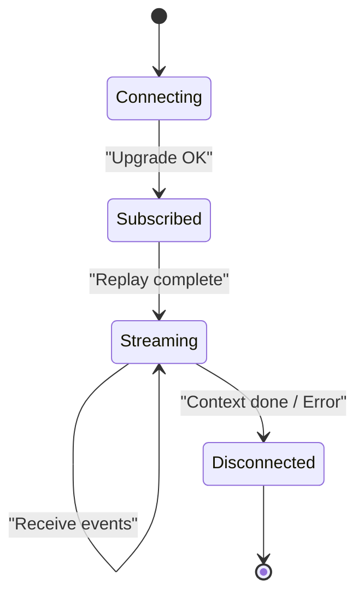
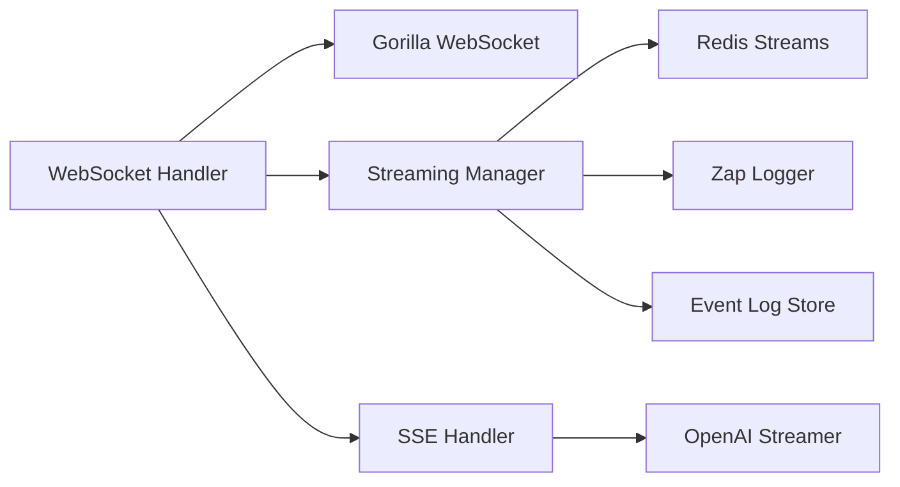

# WebSocket Streaming Implementation

<cite>
**Referenced Files in This Document**
- [websocket.go](file://go/orchestrator/internal/httpapi/websocket.go)
- [streaming.go](file://go/orchestrator/internal/httpapi/streaming.go)
- [manager.go](file://go/orchestrator/internal/streaming/manager.go)
- [streaming.proto](file://protos/orchestrator/streaming.proto)
- [streamer.go](file://go/orchestrator/cmd/gateway/internal/openai/streamer.go)
- [auth.go](file://go/orchestrator/internal/httpapi/auth.go)
</cite>

## Table of Contents
1. [Introduction](#introduction)
2. [Project Structure](#project-structure)
3. [Core Components](#core-components)
4. [Architecture Overview](#architecture-overview)
5. [Detailed Component Analysis](#detailed-component-analysis)
6. [Dependency Analysis](#dependency-analysis)
7. [Performance Considerations](#performance-considerations)
8. [Troubleshooting Guide](#troubleshooting-guide)
9. [Conclusion](#conclusion)

## Introduction
This document explains the WebSocket streaming implementation in Shannon's real-time event system. It covers connection establishment, message framing, bidirectional communication patterns, handler implementation, connection management, message routing, event broadcasting to multiple subscribers, and lifecycle management. It also documents authentication integration points, message queuing, performance optimization techniques, ping/pong handling, connection recovery, and scaling considerations for WebSocket connections.

## Project Structure
The WebSocket streaming feature spans three primary areas:
- HTTP API layer: WebSocket upgrade and handler logic
- Streaming manager: Redis Streams-based event publishing, subscription, replay, and persistence
- Protocol buffers: gRPC streaming contract for task execution updates



**Diagram sources**
- [websocket.go](file://go/orchestrator/internal/httpapi/websocket.go#L18-L21)
- [streaming.go](file://go/orchestrator/internal/httpapi/streaming.go#L34-L38)
- [manager.go](file://go/orchestrator/internal/streaming/manager.go#L36-L60)
- [streaming.proto](file://protos/orchestrator/streaming.proto#L8-L10)
- [streamer.go](file://go/orchestrator/cmd/gateway/internal/openai/streamer.go#L94-L227)

**Section sources**
- [websocket.go](file://go/orchestrator/internal/httpapi/websocket.go#L1-L155)
- [streaming.go](file://go/orchestrator/internal/httpapi/streaming.go#L1-L367)
- [manager.go](file://go/orchestrator/internal/streaming/manager.go#L1-L921)
- [streaming.proto](file://protos/orchestrator/streaming.proto#L1-L29)
- [streamer.go](file://go/orchestrator/cmd/gateway/internal/openai/streamer.go#L1-L568)

## Core Components
- WebSocket Handler: Upgrades HTTP requests to WebSocket, parses resume parameters, replays missed events, subscribes to live events, manages ping/pong, and writes JSON events.
- Streaming Manager: Manages Redis Streams, publishes events, maintains subscribers, replays from sequence or stream ID, persists selected events to the database, and supports graceful shutdown.
- SSE Handler: Provides Server-Sent Events as a reference implementation for comparison and gateway transformations.
- OpenAI Streamer: Transforms SSE events into OpenAI-compatible streaming chunks for gateway scenarios.
- Protobuf StreamingService: Defines the gRPC streaming contract for task execution updates.

**Section sources**
- [websocket.go](file://go/orchestrator/internal/httpapi/websocket.go#L18-L21)
- [manager.go](file://go/orchestrator/internal/streaming/manager.go#L36-L60)
- [streaming.go](file://go/orchestrator/internal/httpapi/streaming.go#L18-L38)
- [streamer.go](file://go/orchestrator/cmd/gateway/internal/openai/streamer.go#L41-L81)
- [streaming.proto](file://protos/orchestrator/streaming.proto#L8-L10)

## Architecture Overview
WebSocket streaming integrates with Redis Streams for durable event delivery and optional PostgreSQL persistence for important events. The WebSocket handler upgrades connections, applies resume semantics, replays missed events, and streams live updates to subscribed clients. Ping/pong keeps connections alive through proxies and load balancers.



**Diagram sources**
- [websocket.go](file://go/orchestrator/internal/httpapi/websocket.go#L23-L154)
- [manager.go](file://go/orchestrator/internal/streaming/manager.go#L157-L321)
- [manager.go](file://go/orchestrator/internal/streaming/manager.go#L698-L807)
- [manager.go](file://go/orchestrator/internal/streaming/manager.go#L661-L696)

## Detailed Component Analysis

### WebSocket Handler Implementation
The WebSocket handler:
- Registers the "/stream/ws" endpoint and upgrades HTTP requests to WebSocket.
- Validates presence of workflow_id and optional type filters.
- Parses resume parameters (last_event_id) supporting both Redis stream IDs and numeric sequences.
- Replays missed events before subscribing to live updates.
- Subscribes to live events from Redis Streams with configurable buffer size.
- Implements ping/pong with periodic ping frames and pong handler resetting read deadlines.
- Discards inbound client messages (reader pump) to enforce unidirectional live streaming.
- Applies type filtering to outgoing events.



**Diagram sources**
- [websocket.go](file://go/orchestrator/internal/httpapi/websocket.go#L23-L154)

**Section sources**
- [websocket.go](file://go/orchestrator/internal/httpapi/websocket.go#L18-L21)
- [websocket.go](file://go/orchestrator/internal/httpapi/websocket.go#L23-L154)

### Connection Management and Lifecycle
- Connection establishment: Upgrade via Gorilla WebSocket with configured buffer sizes and origin policy.
- Resume semantics: Supports Redis stream ID and numeric sequence resume points to avoid missing events.
- Live subscription: Uses SubscribeFrom with a bounded channel buffer to prevent unbounded memory growth.
- Graceful closure: Reader goroutine exits on context cancellation; writer loop returns on context done; Unsubscribe cleans up subscription and channel.
- Shutdown: Manager supports graceful shutdown signaling readers and flushing persistence.



**Diagram sources**
- [websocket.go](file://go/orchestrator/internal/httpapi/websocket.go#L29-L33)
- [websocket.go](file://go/orchestrator/internal/httpapi/websocket.go#L101-L112)
- [websocket.go](file://go/orchestrator/internal/httpapi/websocket.go#L135-L153)

**Section sources**
- [websocket.go](file://go/orchestrator/internal/httpapi/websocket.go#L12-L16)
- [websocket.go](file://go/orchestrator/internal/httpapi/websocket.go#L23-L33)
- [websocket.go](file://go/orchestrator/internal/httpapi/websocket.go#L101-L112)
- [websocket.go](file://go/orchestrator/internal/httpapi/websocket.go#L125-L132)
- [websocket.go](file://go/orchestrator/internal/httpapi/websocket.go#L135-L153)
- [manager.go](file://go/orchestrator/internal/streaming/manager.go#L345-L362)
- [manager.go](file://go/orchestrator/internal/streaming/manager.go#L864-L920)

### Message Routing and Broadcasting
- Event publishing: Manager publishes to Redis Streams and increments sequence numbers; stores stream IDs for deduplication and resume.
- Subscription model: Each workflow maintains a map of subscriber channels with cancellation contexts; reader goroutines forward events to channels.
- Broadcasting: Multiple subscribers receive the same event stream; each channel is independent and buffered.
- Replay: Manager supports replay from either Redis stream ID or numeric sequence to ensure clients can resume without gaps.

```mermaid
classDiagram
class Manager {
+Publish(workflow_id, event)
+Subscribe(workflow_id, buffer) chan Event
+SubscribeFrom(workflow_id, buffer, start_id) chan Event
+Unsubscribe(workflow_id, ch)
+ReplaySince(workflow_id, since) []Event
+ReplayFromStreamID(workflow_id, stream_id) []Event
+Shutdown(ctx) error
}
class subscription {
-cancel context.CancelFunc
}
class Event {
+string workflow_id
+string type
+string agent_id
+string message
+map[string]interface{} payload
+time timestamp
+uint64 seq
+string stream_id
}
Manager --> subscription : "tracks"
Manager --> Event : "publishes"
```

**Diagram sources**
- [manager.go](file://go/orchestrator/internal/streaming/manager.go#L36-L60)
- [manager.go](file://go/orchestrator/internal/streaming/manager.go#L152-L178)
- [manager.go](file://go/orchestrator/internal/streaming/manager.go#L364-L492)
- [manager.go](file://go/orchestrator/internal/streaming/manager.go#L698-L807)

**Section sources**
- [manager.go](file://go/orchestrator/internal/streaming/manager.go#L36-L60)
- [manager.go](file://go/orchestrator/internal/streaming/manager.go#L152-L178)
- [manager.go](file://go/orchestrator/internal/streaming/manager.go#L364-L492)
- [manager.go](file://go/orchestrator/internal/streaming/manager.go#L698-L807)

### Authentication Integration
- Authentication endpoints exist for registration, login, and refresh tokens.
- While WebSocket handler itself does not enforce auth, the gateway and SSE handlers demonstrate auth patterns that can be adapted for WebSocket.
- Recommended approach: Integrate JWT middleware to validate tokens before upgrading to WebSocket and attach tenant/user context to the request context.

**Section sources**
- [auth.go](file://go/orchestrator/internal/httpapi/auth.go#L11-L31)
- [auth.go](file://go/orchestrator/internal/httpapi/auth.go#L33-L94)

### Message Framing and Formats
- WebSocket messages: JSON-encoded events with fields including workflow_id, type, agent_id, message, payload, timestamp, seq, and stream_id.
- SSE events: Server-Sent Events with event names mapped for OpenAI compatibility; WebSocket handler writes JSON directly, while SSE handler maps types to SSE event names and data payloads.
- OpenAI gateway: Transforms SSE events into OpenAI-compatible chunks with role emission, content chunks, and usage metadata.

**Section sources**
- [websocket.go](file://go/orchestrator/internal/httpapi/websocket.go#L19-L21)
- [websocket.go](file://go/orchestrator/internal/httpapi/websocket.go#L78-L80)
- [streaming.go](file://go/orchestrator/internal/httpapi/streaming.go#L106-L184)
- [streamer.go](file://go/orchestrator/cmd/gateway/internal/openai/streamer.go#L232-L312)

### Bidirectional Communication Patterns
- Current WebSocket implementation is unidirectional: clients send no meaningful messages; the server pushes events.
- Reader pump discards inbound messages to maintain unidirectionality and reduce complexity.
- Future enhancements could add a separate input channel or dual-mode WebSocket with explicit command frames.

**Section sources**
- [websocket.go](file://go/orchestrator/internal/httpapi/websocket.go#L125-L132)
- [websocket.go](file://go/orchestrator/internal/httpapi/websocket.go#L135-L153)

### Practical Examples

#### WebSocket Client Implementation (Conceptual)
- Connect to "/stream/ws?workflow_id={id}&last_event_id={resume_point}&types={comma,separated,types}"
- Implement ping/pong handling using the built-in pong handler and periodic ping frames.
- Apply type filtering client-side if needed; server-side filtering is also supported.

#### Message Handling and Connection State Management (Conceptual)
- On connection: parse query parameters for resume and type filtering.
- On event: apply client-side filtering if desired; render message or payload accordingly.
- On disconnect: attempt reconnect with last received stream_id or seq to resume seamlessly.

#### Authentication Integration (Conceptual)
- For protected streams, require JWT tokens and validate them before upgrading.
- Attach user/tenant context to the request context for authorization checks.

[No sources needed since this section provides conceptual guidance]

### Scaling WebSocket Connections
- Horizontal scaling: Use sticky sessions or external state to coordinate resume points; Redis Streams ensures clients can resume from the correct position.
- Backpressure: Manager uses buffered channels per subscriber; slow consumers risk dropped events; configure appropriate buffer sizes and monitor drops.
- Load balancing: Place WebSocket behind a reverse proxy that supports WebSocket and long-lived connections; enable ping/pong to detect dead peers.

[No sources needed since this section provides general guidance]

## Dependency Analysis
The WebSocket streaming implementation depends on:
- Gorilla WebSocket for transport upgrade and framing
- Redis Streams for durable event storage and replay
- Zanzibar-style logging and context propagation
- Optional PostgreSQL persistence for important events



**Diagram sources**
- [websocket.go](file://go/orchestrator/internal/httpapi/websocket.go#L3-L16)
- [manager.go](file://go/orchestrator/internal/streaming/manager.go#L3-L17)
- [streaming.go](file://go/orchestrator/internal/httpapi/streaming.go#L3-L16)
- [streamer.go](file://go/orchestrator/cmd/gateway/internal/openai/streamer.go#L3-L17)

**Section sources**
- [websocket.go](file://go/orchestrator/internal/httpapi/websocket.go#L3-L16)
- [manager.go](file://go/orchestrator/internal/streaming/manager.go#L3-L17)
- [streaming.go](file://go/orchestrator/internal/httpapi/streaming.go#L3-L16)
- [streamer.go](file://go/orchestrator/cmd/gateway/internal/openai/streamer.go#L3-L17)

## Performance Considerations
- Buffer sizing: Use appropriate channel buffer sizes to balance latency and memory usage; monitor dropped events for critical types.
- Replay efficiency: Prefer Redis stream ID resume for precise positioning; numeric sequence resume scans the stream.
- Persistence batching: Manager batches and flushes event logs periodically; tune batch size and interval via environment variables.
- UTF-8 and base64 sanitization: Prevents invalid characters and large binary payloads from bloating storage.
- Heartbeat and ping/pong: Keeps connections alive and detects dead peers promptly.

**Section sources**
- [manager.go](file://go/orchestrator/internal/streaming/manager.go#L107-L127)
- [manager.go](file://go/orchestrator/internal/streaming/manager.go#L538-L556)
- [manager.go](file://go/orchestrator/internal/streaming/manager.go#L558-L610)
- [websocket.go](file://go/orchestrator/internal/httpapi/websocket.go#L114-L120)
- [websocket.go](file://go/orchestrator/internal/httpapi/websocket.go#L148-L151)

## Troubleshooting Guide
- Connection fails: Verify workflow_id query parameter and that the handler is registered.
- No events received: Check type filters and resume parameters; ensure Redis Streams contains events for the workflow.
- Frequent drops: Increase subscriber buffer or address slow consumers; monitor critical event drops.
- Stuck connections: Confirm ping/pong is functioning; adjust read deadlines and heartbeat intervals.
- Persistence issues: Review batcher configuration and DB connectivity; check for oversized payloads.

**Section sources**
- [websocket.go](file://go/orchestrator/internal/httpapi/websocket.go#L24-L28)
- [websocket.go](file://go/orchestrator/internal/httpapi/websocket.go#L114-L120)
- [manager.go](file://go/orchestrator/internal/streaming/manager.go#L304-L317)
- [manager.go](file://go/orchestrator/internal/streaming/manager.go#L661-L696)

## Conclusion
Shannon’s WebSocket streaming leverages Redis Streams for reliable, resumeable event delivery with efficient replay and optional persistence. The handler provides a clean upgrade path, robust ping/pong, and straightforward subscription semantics. By tuning buffers, filters, and persistence, teams can scale WebSocket connections effectively while maintaining low-latency, real-time updates for clients.