# Session Management

<cite>
**Referenced Files in This Document**
- [types.go](file://go/orchestrator/internal/session/types.go)
- [manager.go](file://go/orchestrator/internal/session/manager.go)
- [session_service.go](file://go/orchestrator/internal/server/session_service.go)
- [session.go](file://go/orchestrator/cmd/gateway/internal/handlers/session.go)
- [session.go](file://go/orchestrator/internal/activities/session.go)
- [session_title.go](file://go/orchestrator/internal/activities/session_title.go)
- [session.go](file://go/orchestrator/cmd/gateway/internal/openai/session.go)
- [007_session_soft_delete.sql](file://migrations/postgres/007_session_soft_delete.sql)
- [session_file.py](file://python/llm-service/llm_service/tools/builtin/session_file.py)
- [session.proto](file://protos/session/session.proto)
</cite>

## Table of Contents
1. [Introduction](#introduction)
2. [Project Structure](#project-structure)
3. [Core Components](#core-components)
4. [Architecture Overview](#architecture-overview)
5. [Detailed Component Analysis](#detailed-component-analysis)
6. [Dependency Analysis](#dependency-analysis)
7. [Performance Considerations](#performance-considerations)
8. [Troubleshooting Guide](#troubleshooting-guide)
9. [Conclusion](#conclusion)
10. [Appendices](#appendices)

## Introduction
This document explains session management across the system, focusing on session continuity and persistence. It covers the lifecycle from creation to termination, including session IDs, user and tenant associations, and tenant isolation. It documents memory storage and retrieval, context preservation across tasks, metadata and title generation, token usage tracking and budget management, multi-turn conversations, context switching, session recovery after failures, expiration and cleanup, and practical debugging and optimization guidance.

## Project Structure
Session management spans Go services, HTTP handlers, gRPC services, Redis-backed persistence, and database schema with soft-delete and dual-ID support. The Python LLM service includes session-aware tools for file operations.

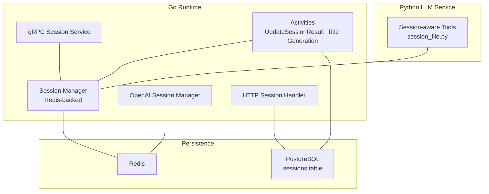

**Diagram sources**
- [manager.go](file://go/orchestrator/internal/session/manager.go#L20-L95)
- [session_service.go](file://go/orchestrator/internal/server/session_service.go#L19-L82)
- [session.go](file://go/orchestrator/cmd/gateway/internal/handlers/session.go#L25-L111)
- [session.go](file://go/orchestrator/cmd/gateway/internal/openai/session.go#L38-L52)
- [session.go](file://go/orchestrator/internal/activities/session.go#L15-L142)
- [session_file.py](file://python/llm-service/llm_service/tools/builtin/session_file.py#L19-L111)

**Section sources**
- [manager.go](file://go/orchestrator/internal/session/manager.go#L20-L95)
- [session_service.go](file://go/orchestrator/internal/server/session_service.go#L19-L82)
- [session.go](file://go/orchestrator/cmd/gateway/internal/handlers/session.go#L25-L111)
- [session.go](file://go/orchestrator/cmd/gateway/internal/openai/session.go#L38-L52)
- [session.go](file://go/orchestrator/internal/activities/session.go#L15-L142)
- [session_file.py](file://python/llm-service/llm_service/tools/builtin/session_file.py#L19-L111)

## Core Components
- Session model: Holds identity, user/tenant association, timestamps, metadata/context, history, agent states, and token/cost accounting.
- Session Manager: Creates, retrieves, updates, deletes, extends TTL, and cleans up sessions; uses Redis with local LRU cache and tenant isolation.
- gRPC Session Service: Exposes Create/Get/Update/Delete/AddMessage/ClearHistory RPCs backed by the Manager.
- HTTP Session Handler: Provides REST endpoints to fetch session metadata, history, and events; aggregates token usage from Redis or DB.
- Activities: Update session results (token usage, cost, history), maintain context, and generate titles.
- OpenAI Session Manager: Derives or resolves OpenAI-compatible session IDs mapped to Shannon sessions, with collision detection.
- Database Schema: Supports soft delete and dual-ID (UUID + external_id) with indexes for efficient lookups.
- Session-aware Tools: Python tools track files created during a session and expose them in context.

**Section sources**
- [types.go](file://go/orchestrator/internal/session/types.go#L19-L145)
- [manager.go](file://go/orchestrator/internal/session/manager.go#L97-L283)
- [session_service.go](file://go/orchestrator/internal/server/session_service.go#L34-L278)
- [session.go](file://go/orchestrator/cmd/gateway/internal/handlers/session.go#L132-L337)
- [session.go](file://go/orchestrator/internal/activities/session.go#L15-L142)
- [session_title.go](file://go/orchestrator/internal/activities/session_title.go#L35-L194)
- [session.go](file://go/orchestrator/cmd/gateway/internal/openai/session.go#L62-L133)
- [007_session_soft_delete.sql](file://migrations/postgres/007_session_soft_delete.sql#L7-L41)
- [session_file.py](file://python/llm-service/llm_service/tools/builtin/session_file.py#L19-L111)

## Architecture Overview
The session subsystem integrates HTTP/gRPC APIs, Redis-backed persistence, PostgreSQL for durable metadata and history, and activity-driven updates.

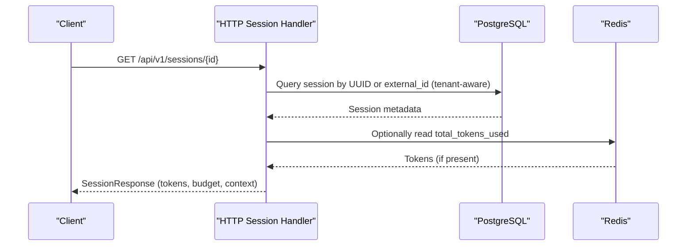

**Diagram sources**
- [session.go](file://go/orchestrator/cmd/gateway/internal/handlers/session.go#L132-L337)

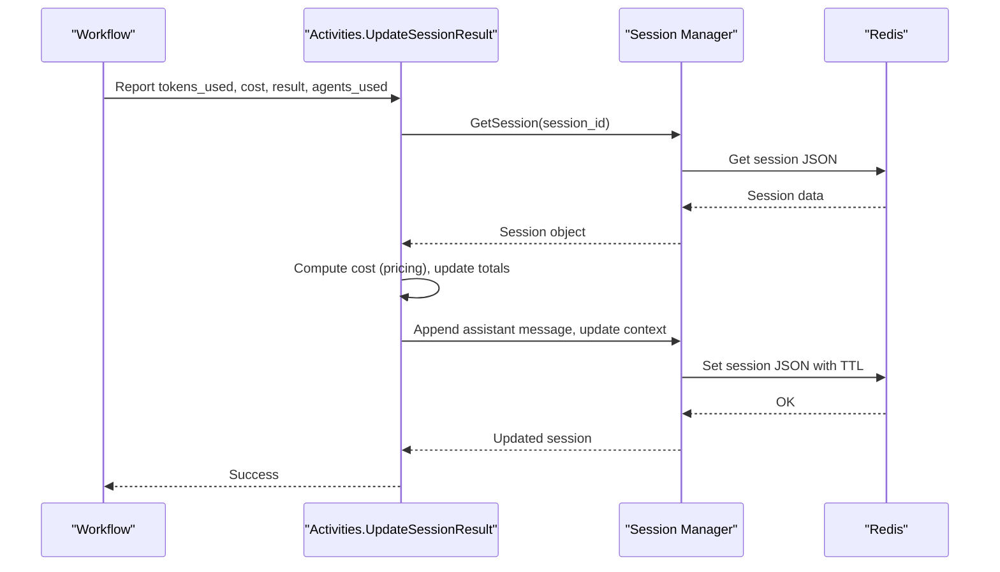

**Diagram sources**
- [session.go](file://go/orchestrator/internal/activities/session.go#L15-L142)
- [manager.go](file://go/orchestrator/internal/session/manager.go#L186-L243)

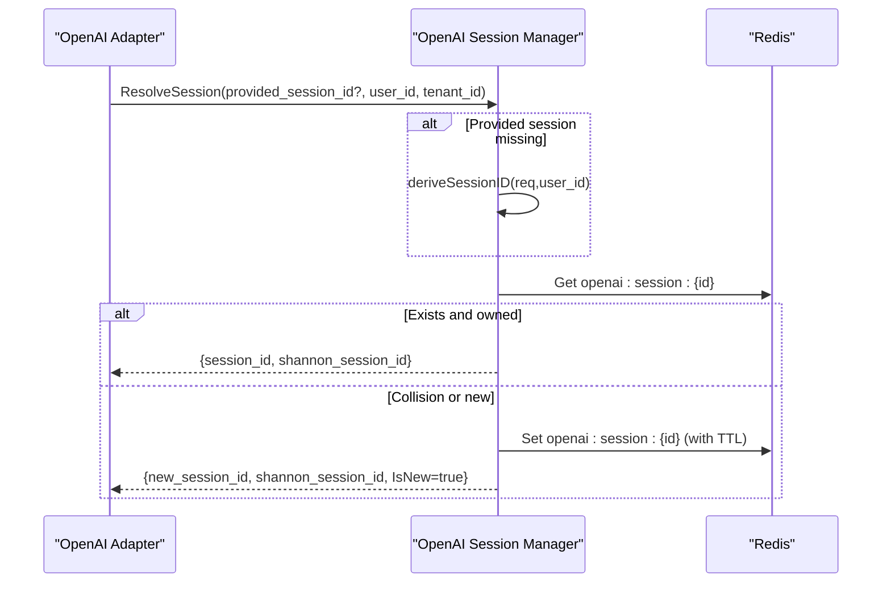

**Diagram sources**
- [session.go](file://go/orchestrator/cmd/gateway/internal/openai/session.go#L62-L133)

## Detailed Component Analysis

### Session Model and Lifecycle
- Identity and associations: Session carries a unique ID, associated user_id and tenant_id, creation/update/expiry timestamps, and metadata/context.
- History and agent states: Maintains a bounded message history and per-agent state snapshots.
- Token and cost tracking: Tracks total tokens used and total cost in USD; supports per-message token/cost fields.
- Expiration: Provides IsExpired() and TTL management via manager configuration and Redis TTL.

```mermaid
classDiagram
class Session {
+string ID
+string UserID
+string TenantID
+time.Time CreatedAt
+time.Time UpdatedAt
+time.Time ExpiresAt
+map[string]interface{} Metadata
+map[string]interface{} Context
+[]Message History
+map[string]*AgentState AgentStates
+int TotalTokensUsed
+float64 TotalCostUSD
+IsExpired() bool
+GetContextValue(key) (interface{}, bool)
+SetContextValue(key, value) void
+GetAgentState(agentID) (*AgentState, bool)
+SetAgentState(agentID, state) void
+GetRecentHistory(n) []Message
+GetHistorySummary(maxTokens) string
+UpdateTokenUsage(tokens, cost) void
}
class Message {
+string ID
+string Role
+string Content
+time.Time Timestamp
+map[string]interface{} Metadata
+int TokensUsed
+float64 CostUSD
}
class AgentState {
+string AgentID
+time.Time LastActive
+string State
+map[string]interface{} Memory
+[]string ToolsUsed
+int TokensUsed
}
Session --> Message : "has many"
Session --> AgentState : "has many"
```

**Diagram sources**
- [types.go](file://go/orchestrator/internal/session/types.go#L19-L145)

**Section sources**
- [types.go](file://go/orchestrator/internal/session/types.go#L19-L145)

### Session Manager: Creation, Retrieval, Updates, Cleanup
- Creation: Generates a UUID, applies TTL, initializes context/history, persists to Redis, caches locally, emits metrics.
- Retrieval: Checks local cache (LRU access tracking), otherwise loads from Redis, enforces expiration and tenant isolation, updates cache.
- Updates: Persists session JSON with computed TTL, updates local cache.
- Deletion: Removes from Redis and local cache.
- TTL extension: Loads session, updates ExpiresAt, persists.
- History management: Appends messages and enforces max history bound.
- Context updates: Sets key-value pairs in context.
- Listing: Scans Redis keyspace (pattern-based) and filters by user/tenant and expiry.
- Cleanup: Iterates keyspace, unmarshals, checks expiry, deletes expired entries.

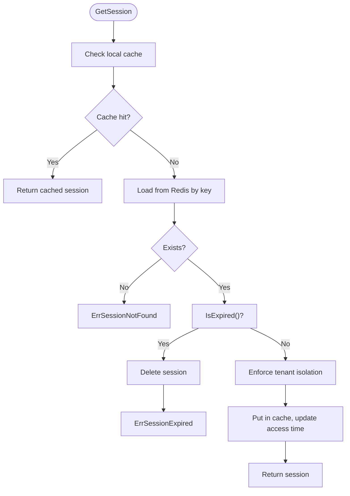

**Diagram sources**
- [manager.go](file://go/orchestrator/internal/session/manager.go#L186-L243)

**Section sources**
- [manager.go](file://go/orchestrator/internal/session/manager.go#L97-L283)
- [manager.go](file://go/orchestrator/internal/session/manager.go#L328-L392)

### gRPC Session Service
- CreateSession: Accepts user_id, optional initial context, optional max_history and TTL; derives tenant from auth context; returns session_id and expires_at.
- GetSession: Retrieves session; optionally includes history; converts to protobuf.
- UpdateSession: Merges context updates; optionally extends TTL; persists and returns new expiry.
- DeleteSession: Deletes session.
- AddMessage: Appends a message to history; returns updated history size.
- ClearHistory: Clears history; optionally keeps context; persists.

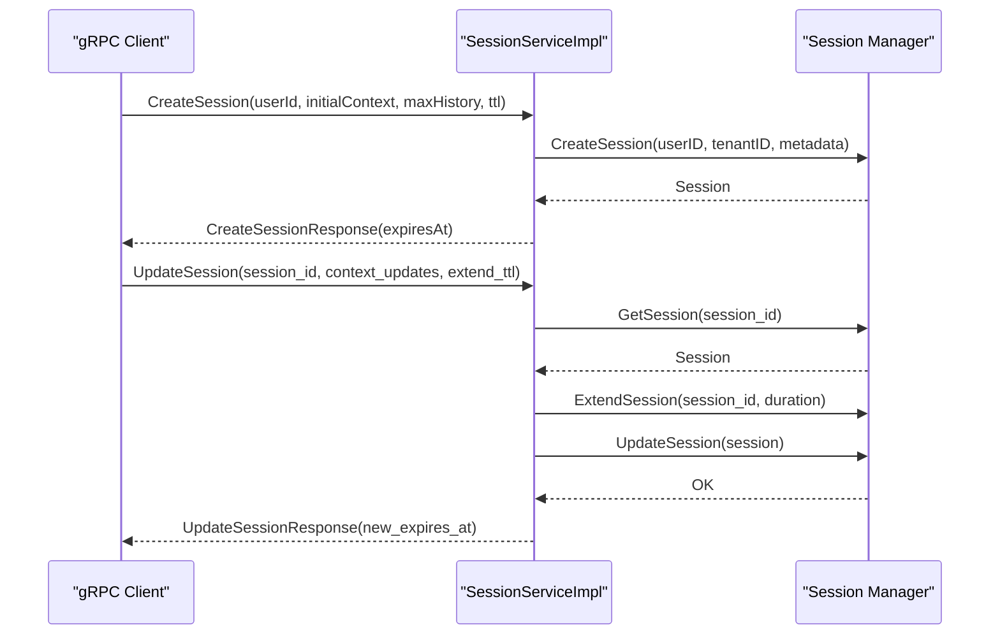

**Diagram sources**
- [session_service.go](file://go/orchestrator/internal/server/session_service.go#L34-L185)
- [manager.go](file://go/orchestrator/internal/session/manager.go#L97-L184)

**Section sources**
- [session_service.go](file://go/orchestrator/internal/server/session_service.go#L34-L278)

### HTTP Session Handler: Metadata, History, Events
- GetSession: Queries sessions table by UUID or external_id, enforces user/tenant filters and soft-delete; reads tokens_used from Redis if available, otherwise aggregates from task_executions; detects research session and strategy from context or first task metadata; returns SessionResponse.
- GetSessionHistory: Lists tasks for a session (both UUID and external_id), ordered by started_at.
- GetSessionEvents: Groups events by task (turns), computes metadata (tokens, execution time, agents), supports pagination and payload inclusion.

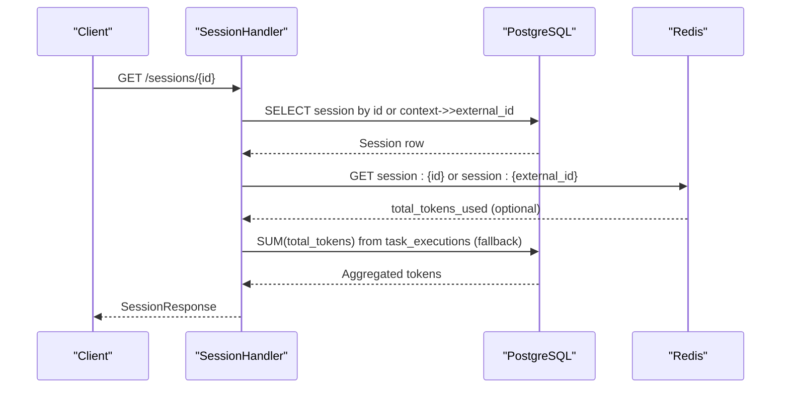

**Diagram sources**
- [session.go](file://go/orchestrator/cmd/gateway/internal/handlers/session.go#L132-L337)

**Section sources**
- [session.go](file://go/orchestrator/cmd/gateway/internal/handlers/session.go#L132-L518)

### Activities: Results, Token Usage, Context Preservation
- UpdateSessionResult: Validates input, fetches session, computes cost (per-agent/model/default), updates token totals and cost, appends assistant message, maintains context fields (last_updated_at, totals, last_*), persists session.
- Session Title Generation: Generates a concise title via LLM with fallback to query truncation; stores title in Redis via session manager and also updates Postgres sessions.context to ensure HTTP APIs can read it.

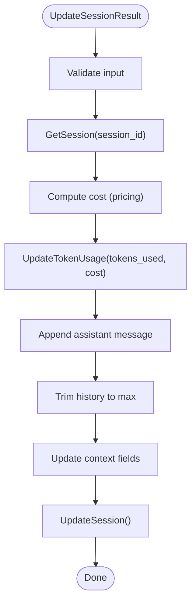

**Diagram sources**
- [session.go](file://go/orchestrator/internal/activities/session.go#L15-L142)

**Section sources**
- [session.go](file://go/orchestrator/internal/activities/session.go#L15-L142)
- [session_title.go](file://go/orchestrator/internal/activities/session_title.go#L35-L194)

### OpenAI Session Manager: Deterministic ID Resolution and Collision Handling
- ResolveSession: If no session provided, derives a deterministic ID from request content and user_id; if provided, checks ownership; on collision, generates a new session; otherwise uses existing; updates last_used and message_count.
- deriveSessionID: Hashes user_id plus selected portions of system/user messages to form a short session identifier.
- getOrCreateSession: Creates mapping from OpenAI session ID to Shannon session ID with TTL.

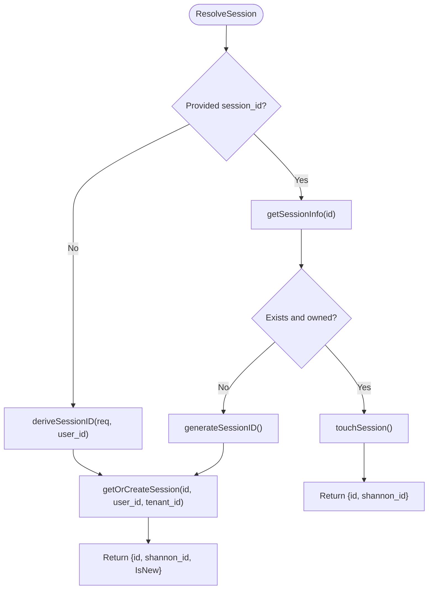

**Diagram sources**
- [session.go](file://go/orchestrator/cmd/gateway/internal/openai/session.go#L62-L133)

**Section sources**
- [session.go](file://go/orchestrator/cmd/gateway/internal/openai/session.go#L62-L133)

### Database Schema: Soft Delete and Dual-ID Support
- Soft delete columns: deleted_at and deleted_by enable soft deletion with partial index.
- Dual-ID support: Functional index on context->>'external_id' and unique constraint per user ensure external_id uniqueness and efficient lookups.
- Additional indexes: Improve non-deleted session queries and task_executions session_id lookups.

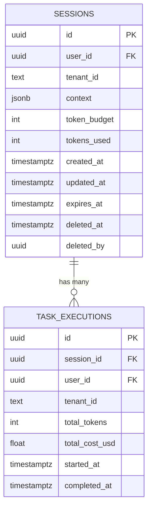

**Diagram sources**
- [007_session_soft_delete.sql](file://migrations/postgres/007_session_soft_delete.sql#L7-L41)

**Section sources**
- [007_session_soft_delete.sql](file://migrations/postgres/007_session_soft_delete.sql#L1-L50)

### Session-Aware Tools: File Operations Tracking
- SessionFileWriteTool: Writes files asynchronously, tracks paths in session context, and reports session-aware metadata.
- SessionFileListTool: Lists files created/modified during the session, optionally filtered by pattern.

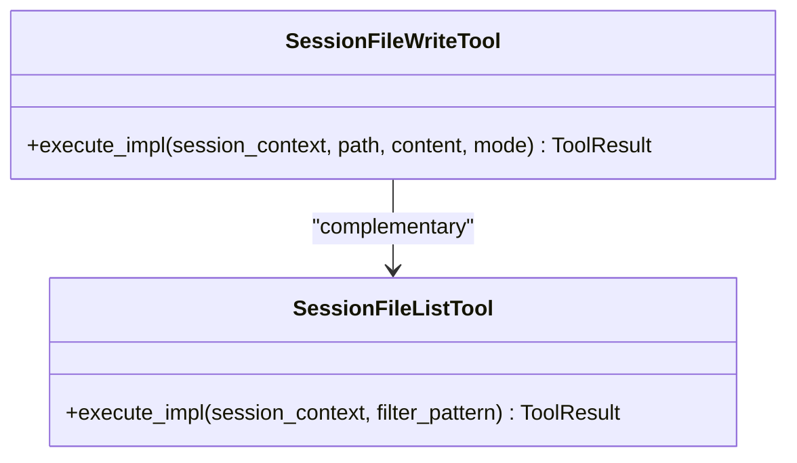

**Diagram sources**
- [session_file.py](file://python/llm-service/llm_service/tools/builtin/session_file.py#L19-L193)

**Section sources**
- [session_file.py](file://python/llm-service/llm_service/tools/builtin/session_file.py#L19-L193)

## Dependency Analysis
- Coupling: HTTP handler depends on DB and Redis; gRPC service depends on Manager; Activities depend on Manager and pricing; OpenAI manager depends on Redis; tools depend on session context.
- Cohesion: Each component encapsulates a clear responsibility (persistence, API, orchestration, tooling).
- External dependencies: Redis for caching/persistence, PostgreSQL for durable metadata/history, pricing service for cost computation, LLM service for title generation.

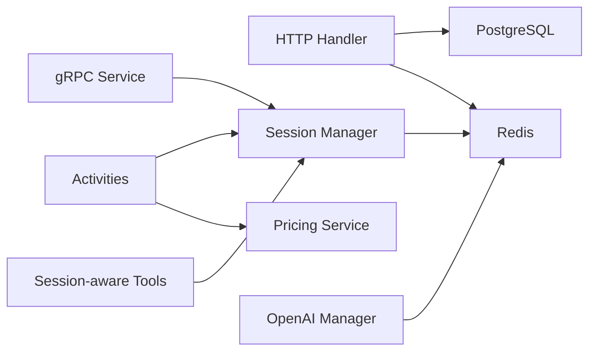

**Diagram sources**
- [session.go](file://go/orchestrator/cmd/gateway/internal/handlers/session.go#L132-L337)
- [session_service.go](file://go/orchestrator/internal/server/session_service.go#L34-L185)
- [manager.go](file://go/orchestrator/internal/session/manager.go#L97-L283)
- [session.go](file://go/orchestrator/internal/activities/session.go#L15-L142)
- [session.go](file://go/orchestrator/cmd/gateway/internal/openai/session.go#L62-L133)
- [session_file.py](file://python/llm-service/llm_service/tools/builtin/session_file.py#L19-L193)

**Section sources**
- [session.go](file://go/orchestrator/cmd/gateway/internal/handlers/session.go#L132-L337)
- [session_service.go](file://go/orchestrator/internal/server/session_service.go#L34-L185)
- [manager.go](file://go/orchestrator/internal/session/manager.go#L97-L283)
- [session.go](file://go/orchestrator/internal/activities/session.go#L15-L142)
- [session.go](file://go/orchestrator/cmd/gateway/internal/openai/session.go#L62-L133)
- [session_file.py](file://python/llm-service/llm_service/tools/builtin/session_file.py#L19-L193)

## Performance Considerations
- Redis caching: Local LRU cache reduces hot-path Redis calls; eviction trims half of the cache when exceeding max size. Monitor cache hits/misses and evictions.
- TTL alignment: Session JSON TTL matches ExpiresAt; ensure clock skew is acceptable; fallback to default TTL if negative.
- History bounds: Manager enforces max history; Activities also enforce a fixed upper bound when appending assistant messages.
- Indexing: Database indexes on external_id and non-deleted sessions improve query performance for dual-ID lookups and listing.
- Token aggregation: Prefer Redis for live token counts; fall back to DB aggregation for accuracy.
- Concurrency: Manager uses RWMutex around cache operations; minimize contention by avoiding frequent writes to the same session.

[No sources needed since this section provides general guidance]

## Troubleshooting Guide
Common issues and remedies:
- Session not found: Ensure correct session_id and tenant association; verify soft-deleted sessions are excluded; confirm dual-ID (external_id) usage.
- Session expired: Extend TTL via UpdateSession or CreateSession with explicit TTL; verify ExpiresAt and local cache eviction.
- Tenant isolation failure: Confirm auth context extraction and WHERE clauses in queries; ensure tenant_id matches.
- Token mismatch: Use Redis for live counts; if unavailable, aggregate from task_executions; verify pricing fallbacks.
- Title generation failures: LLM call failures trigger fallback truncation; check LLM service availability and environment overrides.
- OpenAI session collision: When provided session belongs to another user/tenant, a new session is created; inspect ResolveSession logs.

**Section sources**
- [manager.go](file://go/orchestrator/internal/session/manager.go#L186-L243)
- [session.go](file://go/orchestrator/cmd/gateway/internal/handlers/session.go#L162-L180)
- [session.go](file://go/orchestrator/internal/activities/session_title.go#L96-L105)
- [session.go](file://go/orchestrator/cmd/gateway/internal/openai/session.go#L94-L112)

## Conclusion
The session subsystem provides robust, tenant-aware continuity with Redis-backed persistence, comprehensive token/cost tracking, and rich metadata/context handling. It supports multi-turn conversations, context switching, and resilient recovery via TTL extension and soft delete. The design balances performance with correctness, leveraging caching, indexing, and activity-driven updates.

[No sources needed since this section summarizes without analyzing specific files]

## Appendices

### Practical Examples

- Multi-turn conversation with context preservation
  - Create a session via gRPC or HTTP.
  - For each turn, call UpdateSessionResult to append assistant message and update totals.
  - Use GetSession to retrieve context and metrics; use GetSessionHistory for audit trails.

- Context switching across tasks
  - Use UpdateContext to switch focus (e.g., change topic or persona).
  - Maintain agent states via AgentState fields in session context.

- Session recovery after failures
  - On error, call GetSession to reload session; if expired, recreate with CreateSession or extend TTL via UpdateSession.
  - Use CleanupExpired periodically to remove stale sessions.

- Session recovery with external IDs
  - Use context->>'external_id' to link sessions to external systems; queries support both UUID and external_id.

- Soft deletion and cleanup
  - Soft delete sessions with deleted_at; queries filter by deleted_at IS NULL; periodic cleanup removes expired sessions.

**Section sources**
- [session_service.go](file://go/orchestrator/internal/server/session_service.go#L34-L185)
- [session.go](file://go/orchestrator/internal/activities/session.go#L15-L142)
- [session.go](file://go/orchestrator/cmd/gateway/internal/handlers/session.go#L132-L337)
- [007_session_soft_delete.sql](file://migrations/postgres/007_session_soft_delete.sql#L7-L41)

### API and Protobuf Notes
- Session service RPCs: CreateSession, GetSession, UpdateSession, DeleteSession, AddMessage, ClearHistory.
- Protobuf fields: Session includes ID, user_id, timestamps, context, history, and metrics.

**Section sources**
- [session_service.go](file://go/orchestrator/internal/server/session_service.go#L34-L278)
- [session.proto](file://protos/session/session.proto)