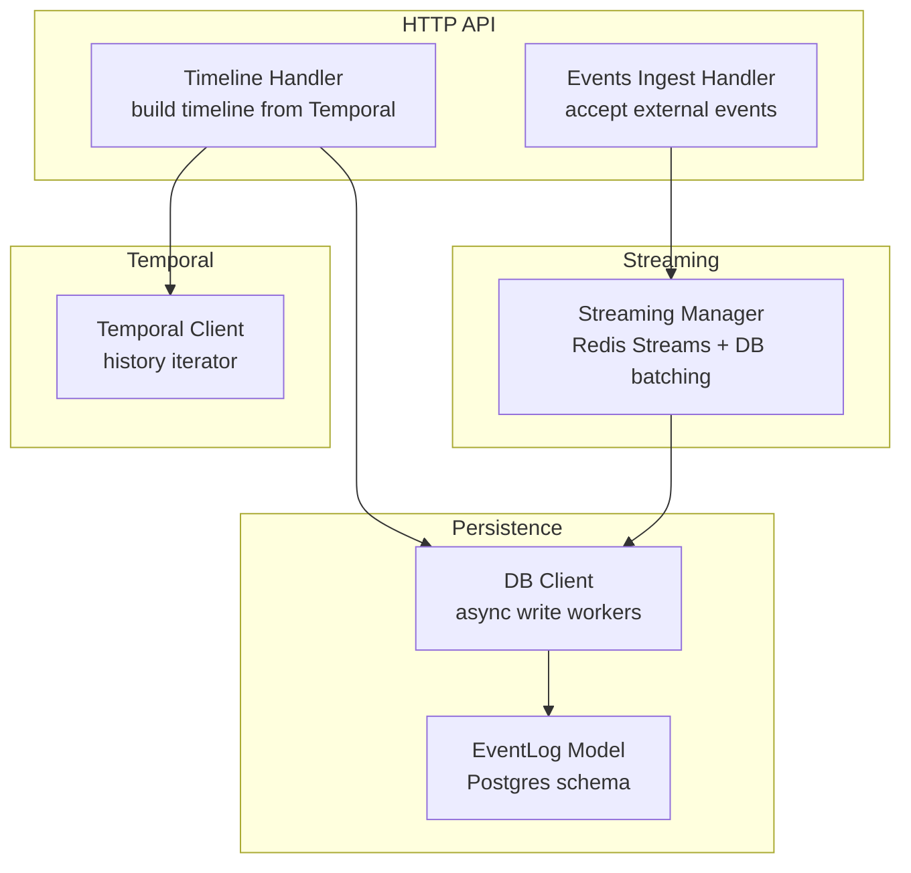
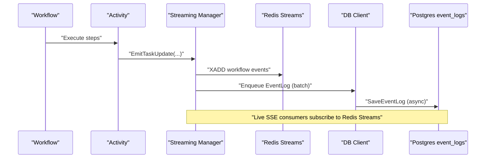
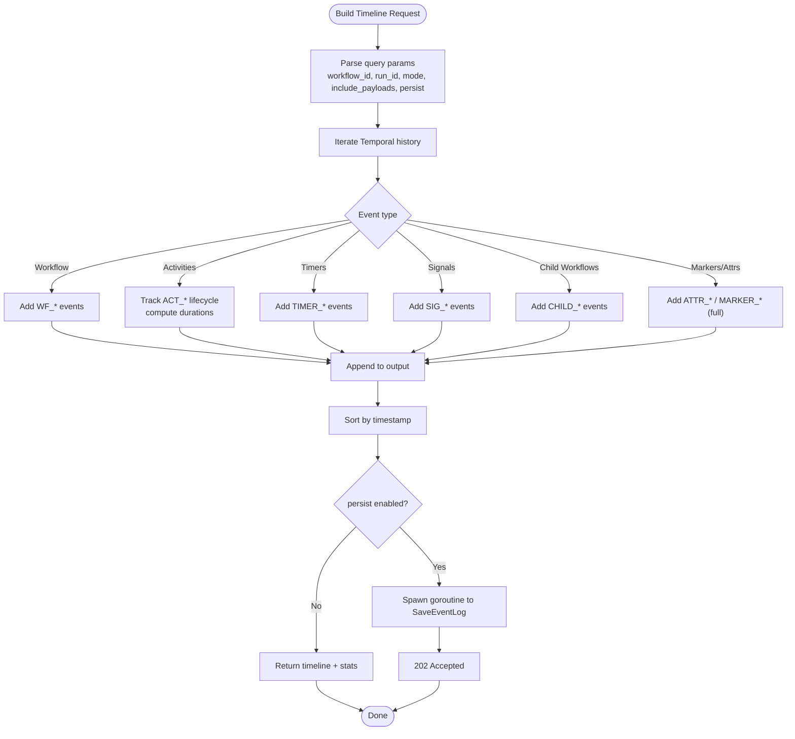
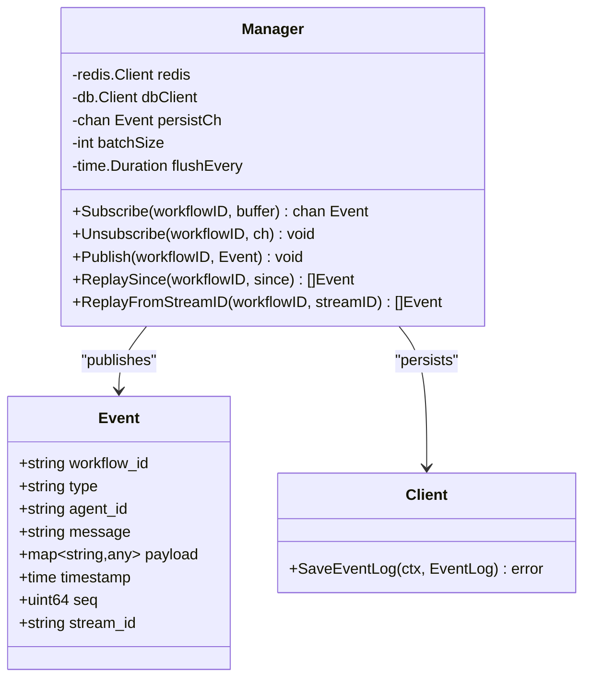
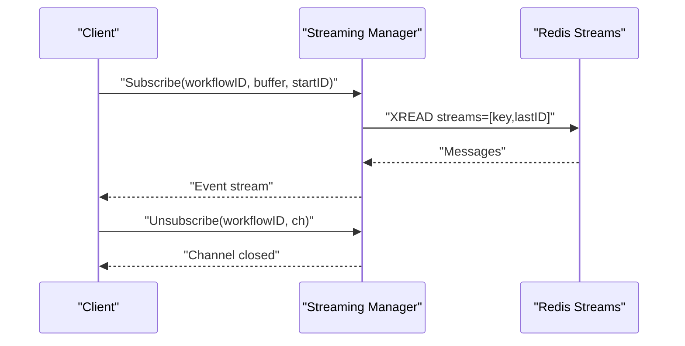
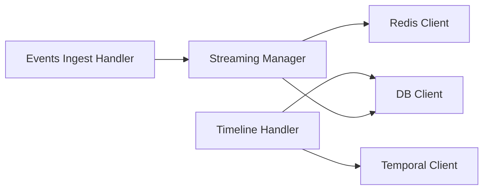

# Task History and Timeline

<cite>
**Referenced Files in This Document**
- [task-history-and-timeline.md](file://docs/task-history-and-timeline.md)
- [timeline.go](file://go/orchestrator/internal/httpapi/timeline.go)
- [stream_events.go](file://go/orchestrator/internal/activities/stream_events.go)
- [events_ingest.go](file://go/orchestrator/internal/httpapi/events_ingest.go)
- [manager.go](file://go/orchestrator/internal/streaming/manager.go)
- [event_log.go](file://go/orchestrator/internal/db/event_log.go)
- [models.go](file://go/orchestrator/internal/db/models.go)
- [client.go](file://go/orchestrator/internal/db/client.go)
</cite>

## Table of Contents
1. [Introduction](#introduction)
2. [Project Structure](#project-structure)
3. [Core Components](#core-components)
4. [Architecture Overview](#architecture-overview)
5. [Detailed Component Analysis](#detailed-component-analysis)
6. [Dependency Analysis](#dependency-analysis)
7. [Performance Considerations](#performance-considerations)
8. [Troubleshooting Guide](#troubleshooting-guide)
9. [Conclusion](#conclusion)
10. [Appendices](#appendices)

## Introduction
This document explains the task history and timeline system: how events are emitted and streamed in real time, how persistent event logs are maintained, and how deterministically reconstructed timelines are produced from Temporal history. It covers event types, metadata, payload structures, ordering, filtering, historical analysis, replay, and performance characteristics. Practical examples show how to query timelines, filter events, and reconstruct histories for debugging and auditing.

## Project Structure
The timeline and history system spans several layers:
- HTTP API handlers for timeline building and event ingestion
- Streaming manager backed by Redis Streams for live event delivery
- Persistence layer for event logs and task execution records
- Temporal client integration to derive deterministic timelines

**Diagram sources**
- [timeline.go](file://go/orchestrator/internal/httpapi/timeline.go#L22-L56)
- [events_ingest.go](file://go/orchestrator/internal/httpapi/events_ingest.go#L14-L25)
- [manager.go](file://go/orchestrator/internal/streaming/manager.go#L47-L60)
- [event_log.go](file://go/orchestrator/internal/db/event_log.go#L10-L22)
- [client.go](file://go/orchestrator/internal/db/client.go#L29-L40)

**Section sources**
- [task-history-and-timeline.md](file://docs/task-history-and-timeline.md#L1-L127)

## Core Components
- Timeline handler: Builds human-readable timelines from Temporal history, supports modes (summary/full), payload inclusion, and optional asynchronous persistence.
- Streaming manager: Publishes events to Redis Streams, maintains per-workflow sequence counters, buffers and flushes event logs to Postgres, and supports replay.
- Event ingestion handler: Accepts external events via HTTP, validates and publishes them to the streaming manager.
- Event log model and DB client: Define the Postgres schema for event_logs and provide asynchronous persistence with batching and circuit-breaker protection.

**Section sources**
- [timeline.go](file://go/orchestrator/internal/httpapi/timeline.go#L22-L56)
- [manager.go](file://go/orchestrator/internal/streaming/manager.go#L47-L60)
- [events_ingest.go](file://go/orchestrator/internal/httpapi/events_ingest.go#L14-L25)
- [event_log.go](file://go/orchestrator/internal/db/event_log.go#L10-L22)
- [models.go](file://go/orchestrator/internal/db/models.go#L12-L36)
- [client.go](file://go/orchestrator/internal/db/client.go#L29-L40)

## Architecture Overview
The system separates concerns across live streaming, persistent audit logs, and deterministic timeline reconstruction:
- Live events: Emitted by workflows and activities, published to Redis Streams, and optionally persisted to Postgres.
- Persistent events: Stored in Postgres event_logs for long-term audit and retrieval.
- Deterministic timeline: Derived from Temporal history, optionally persisted asynchronously.

**Diagram sources**
- [stream_events.go](file://go/orchestrator/internal/activities/stream_events.go#L72-L91)
- [manager.go](file://go/orchestrator/internal/streaming/manager.go#L364-L492)
- [event_log.go](file://go/orchestrator/internal/db/event_log.go#L24-L46)

## Detailed Component Analysis

### Timeline Builder
The timeline builder translates Temporal history into a compact, human-readable sequence of events. It supports:
- Modes: summary (collapses activity lifecycle events) and full (granular events including markers).
- Payload handling: optional inclusion of failure details; sensitive data redacted by default.
- Persistence: optional asynchronous persistence of the generated timeline to event_logs.

**Diagram sources**
- [timeline.go](file://go/orchestrator/internal/httpapi/timeline.go#L58-L120)
- [timeline.go](file://go/orchestrator/internal/httpapi/timeline.go#L127-L323)

**Section sources**
- [timeline.go](file://go/orchestrator/internal/httpapi/timeline.go#L58-L120)
- [timeline.go](file://go/orchestrator/internal/httpapi/timeline.go#L127-L323)

### Streaming Manager and Event Persistence
The streaming manager:
- Publishes events to Redis Streams with per-workflow sequence numbers and TTLs.
- Maintains a non-blocking in-memory channel for local subscribers when Redis is unavailable.
- Asynchronously batches and persists selected events to Postgres event_logs.
- Provides replay APIs for resuming consumption from a sequence or stream ID.

**Diagram sources**
- [manager.go](file://go/orchestrator/internal/streaming/manager.go#L19-L29)
- [manager.go](file://go/orchestrator/internal/streaming/manager.go#L47-L60)
- [event_log.go](file://go/orchestrator/internal/db/event_log.go#L24-L46)

**Section sources**
- [manager.go](file://go/orchestrator/internal/streaming/manager.go#L142-L178)
- [manager.go](file://go/orchestrator/internal/streaming/manager.go#L180-L321)
- [manager.go](file://go/orchestrator/internal/streaming/manager.go#L364-L492)
- [manager.go](file://go/orchestrator/internal/streaming/manager.go#L661-L696)
- [manager.go](file://go/orchestrator/internal/streaming/manager.go#L698-L754)
- [manager.go](file://go/orchestrator/internal/streaming/manager.go#L756-L800)

### Event Types, Metadata, and Payloads
- Event types include workflow lifecycle, activity lifecycle, timers, signals, child workflows, and markers/attributes (full mode).
- Human-friendly UX events capture tool invocations, agent thinking, progress, and data processing.
- Metadata and payloads are sanitized to remove large binary content and malformed UTF-8 before persistence.

Practical examples of event types:
- Workflow: WORKFLOW_STARTED, WORKFLOW_COMPLETED, WORKFLOW_FAILED
- Activities: ACT_SCHEDULED, ACT_STARTED, ACT_COMPLETED, ACT_FAILED, ACT_TIMEOUT, ACT_CANCEL_REQUESTED, ACT_CANCELLED
- Timers: TIMER_STARTED, TIMER_FIRED, TIMER_CANCELLED
- Signals: SIG_RECEIVED, SIG_SENT, SIG_SENT_CONFIRMED, SIG_SENT_FAILED
- Child workflows: CHILD_INITIATED, CHILD_STARTED, CHILD_COMPLETED, CHILD_FAILED, CHILD_TIMEOUT, CHILD_CANCELLED, CHILD_TERMINATED
- UX: TOOL_INVOKED, AGENT_THINKING, TEAM_STATUS, PROGRESS, DATA_PROCESSING, WAITING, ERROR_RECOVERY
- LLM: LLM_PROMPT, LLM_PARTIAL, LLM_OUTPUT, TOOL_OBSERVATION
- Control: WORKFLOW_PAUSING, WORKFLOW_PAUSED, WORKFLOW_RESUMED, WORKFLOW_CANCELLING, WORKFLOW_CANCELLED
- Approval: APPROVAL_REQUESTED, APPROVAL_DECISION

**Section sources**
- [stream_events.go](file://go/orchestrator/internal/activities/stream_events.go#L14-L59)
- [manager.go](file://go/orchestrator/internal/streaming/manager.go#L500-L536)

### Historical Analysis and Replay
- Deterministic timeline: Rebuilt from Temporal history to ensure completeness even if live streaming was interrupted.
- Replay: Consumers can resume from a Last-Event-ID or a specific sequence number; the streaming manager supports replay from a Redis stream ID or since a sequence.
- Filtering: Timeline mode controls granularity; include_payloads toggles failure detail inclusion; persist controls whether the timeline is asynchronously stored.

**Diagram sources**
- [manager.go](file://go/orchestrator/internal/streaming/manager.go#L157-L178)
- [manager.go](file://go/orchestrator/internal/streaming/manager.go#L180-L321)

**Section sources**
- [timeline.go](file://go/orchestrator/internal/httpapi/timeline.go#L58-L120)
- [manager.go](file://go/orchestrator/internal/streaming/manager.go#L698-L754)
- [manager.go](file://go/orchestrator/internal/streaming/manager.go#L756-L800)

### Event Persistence and Data Retention
- Postgres schema: event_logs stores workflow_id, type, agent_id, message, payload, timestamp, seq, stream_id, created_at.
- Batching and async writes: The DB client queues writes and processes them with workers; batching reduces DB load.
- Retention: Redis Streams have a ~24h TTL; long-term retention is managed by persisting to event_logs.

**Section sources**
- [event_log.go](file://go/orchestrator/internal/db/event_log.go#L10-L22)
- [event_log.go](file://go/orchestrator/internal/db/event_log.go#L24-L46)
- [models.go](file://go/orchestrator/internal/db/models.go#L12-L36)
- [client.go](file://go/orchestrator/internal/db/client.go#L148-L196)
- [client.go](file://go/orchestrator/internal/db/client.go#L238-L310)

## Dependency Analysis
The timeline and streaming components depend on:
- Temporal client for history iteration
- Redis client for streaming
- Postgres client for durable event logs
- Circuit breaker wrapper for DB resilience

**Diagram sources**
- [timeline.go](file://go/orchestrator/internal/httpapi/timeline.go#L22-L27)
- [manager.go](file://go/orchestrator/internal/streaming/manager.go#L47-L60)
- [events_ingest.go](file://go/orchestrator/internal/httpapi/events_ingest.go#L14-L21)

**Section sources**
- [timeline.go](file://go/orchestrator/internal/httpapi/timeline.go#L22-L27)
- [manager.go](file://go/orchestrator/internal/streaming/manager.go#L47-L60)
- [events_ingest.go](file://go/orchestrator/internal/httpapi/events_ingest.go#L14-L21)

## Performance Considerations
- Streaming throughput: Redis Streams with MaxLen and TTL prevents unbounded growth; sequence counters enable resume-friendly consumption.
- Persistence overhead: Non-blocking enqueue to a bounded channel; batching reduces DB write frequency; circuit breaker protects against cascading failures.
- Timeline building: History iteration is paginated; request timeout limits ensure responsiveness.
- Payload safety: Sanitization avoids storing large base64 images and malformed UTF-8, reducing storage and query costs.

[No sources needed since this section provides general guidance]

## Troubleshooting Guide
Common issues and remedies:
- Missing events in live stream: Verify Redis connectivity and stream key existence; check for subscriber backpressure and critical event drops.
- Timeline not persisted: Confirm persist flag and DB client initialization; inspect async persist worker logs.
- Large payloads causing storage bloat: Review sanitization logic for base64 images and ensure include_payloads is disabled for sensitive contexts.
- Slow consumers: Increase subscriber buffer capacity and tune streaming manager capacity; consider replay from a specific sequence.

**Section sources**
- [manager.go](file://go/orchestrator/internal/streaming/manager.go#L331-L343)
- [manager.go](file://go/orchestrator/internal/streaming/manager.go#L442-L473)
- [manager.go](file://go/orchestrator/internal/streaming/manager.go#L538-L556)
- [timeline.go](file://go/orchestrator/internal/httpapi/timeline.go#L79-L87)

## Conclusion
The timeline and history system combines real-time streaming with durable audit logs and deterministic reconstruction from Temporal history. It offers flexible modes, robust persistence, and replay capabilities suitable for debugging, monitoring, and compliance.

[No sources needed since this section summarizes without analyzing specific files]

## Appendices

### API Reference and Examples
- Timeline endpoints:
  - GET /api/v1/tasks/{id}/timeline with query parameters mode, include_payloads, persist
  - GET /timeline for direct timeline building
- Persistent events:
  - GET /api/v1/tasks/{id}/events with limit, offset
- Live streaming:
  - GET /api/v1/stream/sse?workflow_id=...
- Event ingestion:
  - POST /events with Authorization Bearer token

Examples:
- Build and persist a summary timeline asynchronously
- Preview a full timeline without persisting
- Retrieve persistent events for a task

**Section sources**
- [task-history-and-timeline.md](file://docs/task-history-and-timeline.md#L17-L93)

### Timeline Data Structures and Ordering
- EventLog fields: id, workflow_id, type, agent_id, message, payload, timestamp, seq, stream_id, created_at
- Ordering: Events are sorted by timestamp; sequences ensure monotonic ordering within a run
- Filtering: Summary mode collapses activity lifecycle events; full mode includes markers and attributes

**Section sources**
- [event_log.go](file://go/orchestrator/internal/db/event_log.go#L10-L22)
- [timeline.go](file://go/orchestrator/internal/httpapi/timeline.go#L319-L322)

### Building Custom Timeline Visualizations
- Use the timeline endpoint to fetch structured events and stats
- Integrate with external monitoring systems by exposing the timeline and event endpoints
- Apply filters (mode, include_payloads) to tailor visualizations for different audiences

**Section sources**
- [timeline.go](file://go/orchestrator/internal/httpapi/timeline.go#L58-L120)
- [task-history-and-timeline.md](file://docs/task-history-and-timeline.md#L48-L56)