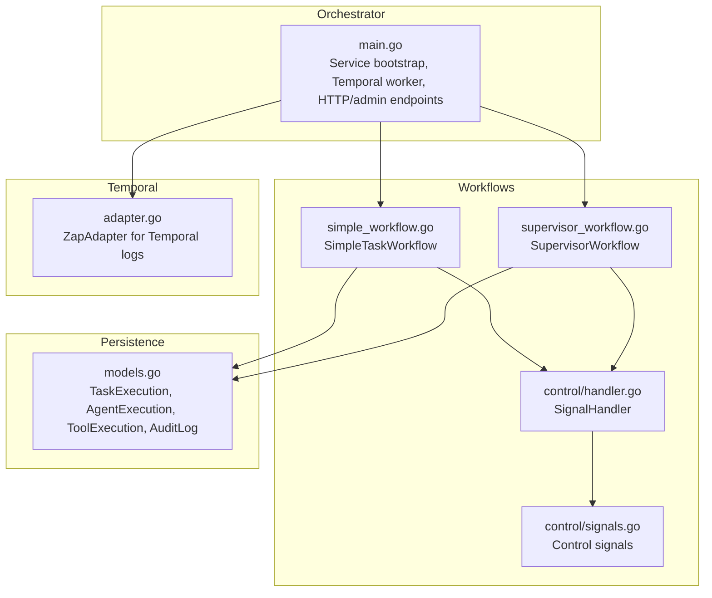
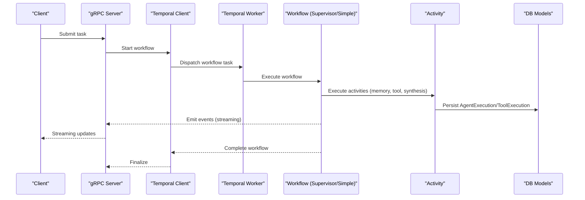
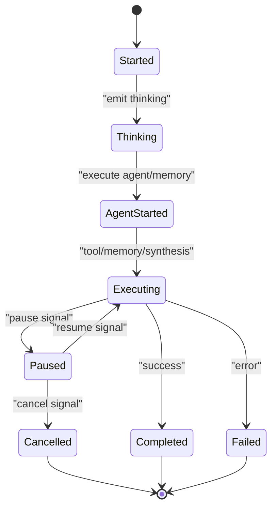
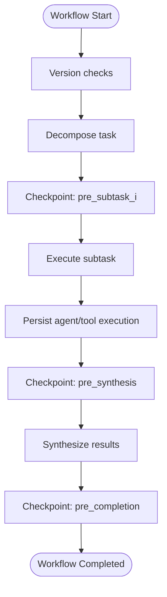
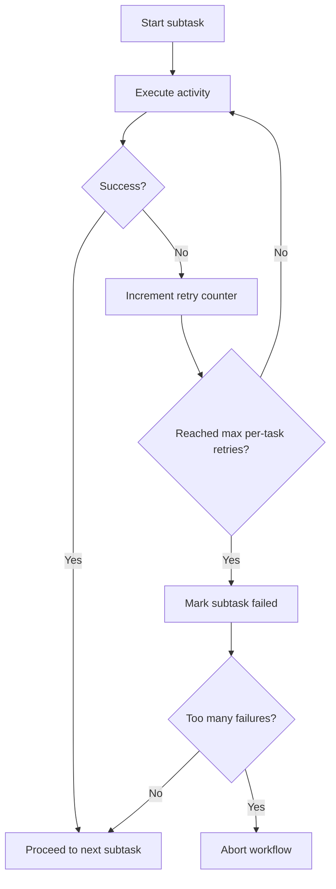
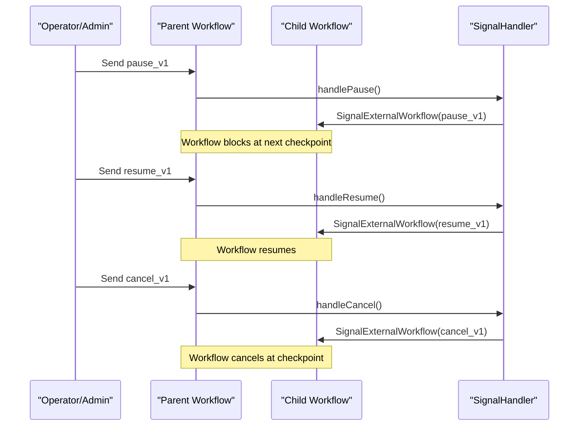
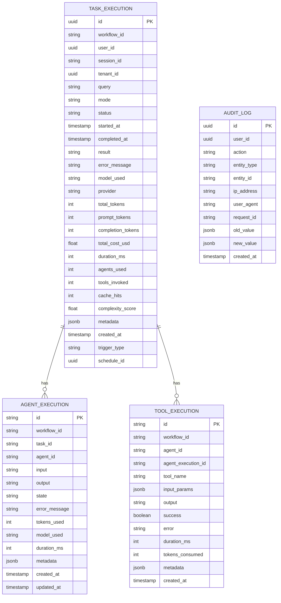
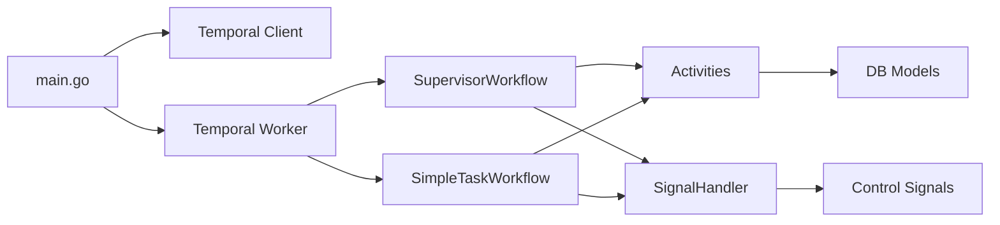

# Task Lifecycle

<cite>
**Referenced Files in This Document**
- [main.go](file://go/orchestrator/main.go)
- [types.go](file://go/orchestrator/internal/workflows/types.go)
- [models.go](file://go/orchestrator/internal/db/models.go)
- [adapter.go](file://go/orchestrator/internal/temporal/adapter.go)
- [simple_workflow.go](file://go/orchestrator/internal/workflows/simple_workflow.go)
- [supervisor_workflow.go](file://go/orchestrator/internal/workflows/supervisor_workflow.go)
- [handler.go](file://go/orchestrator/internal/workflows/control/handler.go)
- [signals.go](file://go/orchestrator/internal/workflows/control/signals.go)
- [control_signals.go](file://go/orchestrator/internal/workflows/control_signals.go)
</cite>

## Table of Contents
1. [Introduction](#introduction)
2. [Project Structure](#project-structure)
3. [Core Components](#core-components)
4. [Architecture Overview](#architecture-overview)
5. [Detailed Component Analysis](#detailed-component-analysis)
6. [Dependency Analysis](#dependency-analysis)
7. [Performance Considerations](#performance-considerations)
8. [Troubleshooting Guide](#troubleshooting-guide)
9. [Conclusion](#conclusion)
10. [Appendices](#appendices)

## Introduction
This document describes the complete task lifecycle in the system, from submission to completion. It explains task states, transitions, and checkpoints during workflow execution; temporal workflow integration for deterministic execution; retry mechanisms and failure recovery; control signals for pause/resume/cancel; task metadata, timestamps, and audit trails; practical examples for monitoring progress, handling timeouts, and managing concurrent executions; and guidance for debugging workflow issues and understanding execution statistics.

## Project Structure
The task lifecycle spans several layers:
- Orchestration entrypoint initializes services, workers, and Temporal client.
- Workflows define deterministic execution plans and checkpoints.
- Activities implement atomic units of work.
- Database models capture task execution, agent/tool execution, and audit logs.
- Control signals enable pause/resume/cancel propagation across parent and child workflows.

**Diagram sources**
- [main.go](file://go/orchestrator/main.go#L49-L799)
- [simple_workflow.go](file://go/orchestrator/internal/workflows/simple_workflow.go#L19-L664)
- [supervisor_workflow.go](file://go/orchestrator/internal/workflows/supervisor_workflow.go#L40-L1635)
- [handler.go](file://go/orchestrator/internal/workflows/control/handler.go#L14-L279)
- [signals.go](file://go/orchestrator/internal/workflows/control/signals.go#L5-L41)
- [adapter.go](file://go/orchestrator/internal/temporal/adapter.go#L11-L90)
- [models.go](file://go/orchestrator/internal/db/models.go#L61-L219)

**Section sources**
- [main.go](file://go/orchestrator/main.go#L49-L799)

## Core Components
- TaskInput and TaskResult define the shape of task submissions and results.
- TaskExecution, AgentExecution, ToolExecution, and AuditLog represent persisted state and audit trails.
- SimpleTaskWorkflow and SupervisorWorkflow implement deterministic execution with checkpoints and retries.
- SignalHandler coordinates pause/resume/cancel across parent and child workflows.

**Section sources**
- [types.go](file://go/orchestrator/internal/workflows/types.go#L8-L59)
- [models.go](file://go/orchestrator/internal/db/models.go#L61-L219)
- [simple_workflow.go](file://go/orchestrator/internal/workflows/simple_workflow.go#L19-L664)
- [supervisor_workflow.go](file://go/orchestrator/internal/workflows/supervisor_workflow.go#L40-L1635)
- [handler.go](file://go/orchestrator/internal/workflows/control/handler.go#L14-L279)

## Architecture Overview
The system integrates gRPC, HTTP admin endpoints, Temporal workers, and persistence. Workflows emit structured events for streaming and dashboards, and activities persist execution artifacts.

**Diagram sources**
- [main.go](file://go/orchestrator/main.go#L396-L799)
- [supervisor_workflow.go](file://go/orchestrator/internal/workflows/supervisor_workflow.go#L40-L1635)
- [simple_workflow.go](file://go/orchestrator/internal/workflows/simple_workflow.go#L19-L664)
- [models.go](file://go/orchestrator/internal/db/models.go#L61-L152)

## Detailed Component Analysis

### Task States and Transitions
- Workflow lifecycle events are emitted at key transitions:
  - Workflow started
  - Agent thinking/started/completed
  - Progress updates (subtasks, dependencies, budget)
  - Data processing (compression, synthesis)
  - LLM output (final answer)
  - Workflow completed
  - Pausing/resuming/cancelling (with checkpoints)
- Control signals:
  - Pause: blocks at checkpoints until resumed or cancelled.
  - Resume: clears paused state and continues.
  - Cancel: sets cancelled state and propagates to children.

**Diagram sources**
- [simple_workflow.go](file://go/orchestrator/internal/workflows/simple_workflow.go#L38-L621)
- [supervisor_workflow.go](file://go/orchestrator/internal/workflows/supervisor_workflow.go#L62-L1485)
- [handler.go](file://go/orchestrator/internal/workflows/control/handler.go#L92-L244)

**Section sources**
- [simple_workflow.go](file://go/orchestrator/internal/workflows/simple_workflow.go#L38-L621)
- [supervisor_workflow.go](file://go/orchestrator/internal/workflows/supervisor_workflow.go#L62-L1485)
- [handler.go](file://go/orchestrator/internal/workflows/control/handler.go#L92-L244)

### Deterministic Execution and Checkpoints
- Version gating ensures replay determinism for memory, compression, P2P, and supervisor enhancements.
- Checkpoints are placed around decomposition, subtask execution, synthesis, and completion.
- ControlHandler.CheckPausePoint yields to process signals and blocks when paused.

**Diagram sources**
- [supervisor_workflow.go](file://go/orchestrator/internal/workflows/supervisor_workflow.go#L420-L1027)
- [simple_workflow.go](file://go/orchestrator/internal/workflows/simple_workflow.go#L281-L582)
- [handler.go](file://go/orchestrator/internal/workflows/control/handler.go#L187-L244)

**Section sources**
- [supervisor_workflow.go](file://go/orchestrator/internal/workflows/supervisor_workflow.go#L420-L1027)
- [simple_workflow.go](file://go/orchestrator/internal/workflows/simple_workflow.go#L281-L582)
- [handler.go](file://go/orchestrator/internal/workflows/control/handler.go#L187-L244)

### Retry Mechanisms and Failure Recovery
- SimpleTaskWorkflow:
  - Fewer retries for simple tasks; consolidation activity retries once.
- SupervisorWorkflow:
  - Per-subtask retry with a maximum per-task limit.
  - Global failure threshold: allow up to half the subtasks plus one to fail before aborting.
  - Emits progress/budget events during retries.
- Intelligent retry strategy prevents infinite loops while supporting complex tasks.

**Diagram sources**
- [supervisor_workflow.go](file://go/orchestrator/internal/workflows/supervisor_workflow.go#L962-L993)

**Section sources**
- [simple_workflow.go](file://go/orchestrator/internal/workflows/simple_workflow.go#L71-L77)
- [supervisor_workflow.go](file://go/orchestrator/internal/workflows/supervisor_workflow.go#L962-L993)

### Control Signals: Pause/Resume/Cancel
- Signal names and payloads are defined for pause, resume, and cancel.
- SignalHandler registers channels and a query handler for control state.
- Propagation to child workflows ensures coordinated control across nested workflows.

**Diagram sources**
- [signals.go](file://go/orchestrator/internal/workflows/control/signals.go#L5-L41)
- [handler.go](file://go/orchestrator/internal/workflows/control/handler.go#L31-L185)
- [control_signals.go](file://go/orchestrator/internal/workflows/control_signals.go#L7-L9)

**Section sources**
- [signals.go](file://go/orchestrator/internal/workflows/control/signals.go#L5-L41)
- [handler.go](file://go/orchestrator/internal/workflows/control/handler.go#L31-L185)
- [control_signals.go](file://go/orchestrator/internal/workflows/control_signals.go#L7-L9)

### Task Metadata, Timestamps, and Audit Trails
- TaskExecution captures status, timestamps, model/provider, token usage, performance metrics, and metadata.
- AgentExecution and ToolExecution persist per-agent and per-tool details.
- AuditLog stores actions, IP/user-agent, request ID, and value diffs.
- Workflows emit structured events with timestamps and payloads for observability.

**Diagram sources**
- [models.go](file://go/orchestrator/internal/db/models.go#L61-L219)

**Section sources**
- [models.go](file://go/orchestrator/internal/db/models.go#L61-L219)

### Practical Examples

- Monitoring task progress:
  - Subscribe to SSE/WS endpoints exposed by the admin HTTP server to receive structured events (progress, dependency satisfied, budget usage).
  - Use the control state query handler to poll current pause/cancel state.

- Handling timeouts:
  - SupervisorWorkflow implements P2P dependency waits with configurable timeouts and exponential backoff.
  - Activities specify StartToCloseTimeouts to bound execution time.

- Managing concurrent executions:
  - Workers run on multiple queues (priority or single) with configurable concurrency.
  - SupervisorWorkflow coordinates child workflows with parent-close policy to request cancellation on parent termination.

- Task cancellation and graceful shutdown:
  - SignalHandler propagates cancel to children and returns a CanceledError to mark workflow status correctly.
  - Orchestrator main process handles OS signals and gracefully stops gRPC and Temporal workers.

- Resource cleanup:
  - Persistence activities ensure agent/tool execution records are written reliably.
  - Session updates aggregate token usage and maintain budgets.

**Section sources**
- [main.go](file://go/orchestrator/main.go#L610-L799)
- [supervisor_workflow.go](file://go/orchestrator/internal/workflows/supervisor_workflow.go#L642-L763)
- [handler.go](file://go/orchestrator/internal/workflows/control/handler.go#L144-L185)

### Debugging Workflow Issues
- Use control state query handler to inspect pause/cancel state.
- Inspect emitted events around checkpoints to locate where a workflow paused or cancelled.
- Review TaskExecution/AgentExecution/ToolExecution records for token usage, durations, and errors.
- Temporal logs are bridged via ZapAdapter for consistent logging.

**Section sources**
- [handler.go](file://go/orchestrator/internal/workflows/control/handler.go#L42-L44)
- [models.go](file://go/orchestrator/internal/db/models.go#L61-L152)
- [adapter.go](file://go/orchestrator/internal/temporal/adapter.go#L11-L90)

## Dependency Analysis
- Orchestrator main initializes Temporal client, workers, and HTTP/admin endpoints.
- Workflows depend on activities for memory retrieval, tool execution, synthesis, and persistence.
- SignalHandler depends on control signal definitions and Temporal channels.

**Diagram sources**
- [main.go](file://go/orchestrator/main.go#L610-L799)
- [supervisor_workflow.go](file://go/orchestrator/internal/workflows/supervisor_workflow.go#L40-L1635)
- [simple_workflow.go](file://go/orchestrator/internal/workflows/simple_workflow.go#L19-L664)
- [handler.go](file://go/orchestrator/internal/workflows/control/handler.go#L14-L279)
- [signals.go](file://go/orchestrator/internal/workflows/control/signals.go#L5-L41)
- [models.go](file://go/orchestrator/internal/db/models.go#L61-L152)

**Section sources**
- [main.go](file://go/orchestrator/main.go#L610-L799)
- [supervisor_workflow.go](file://go/orchestrator/internal/workflows/supervisor_workflow.go#L40-L1635)
- [simple_workflow.go](file://go/orchestrator/internal/workflows/simple_workflow.go#L19-L664)
- [handler.go](file://go/orchestrator/internal/workflows/control/handler.go#L14-L279)
- [signals.go](file://go/orchestrator/internal/workflows/control/signals.go#L5-L41)
- [models.go](file://go/orchestrator/internal/db/models.go#L61-L152)

## Performance Considerations
- Deterministic version gates minimize replay overhead.
- Compression and context shaping reduce token usage and improve throughput.
- Budget-aware agent execution and per-agent token tracking help control costs.
- Parallel signal propagation to children avoids sequential blocking.

[No sources needed since this section provides general guidance]

## Troubleshooting Guide
- If a workflow appears stuck, check control state query handler and emitted events around checkpoints.
- Verify activity timeouts and retry policies; adjust StartToCloseTimeouts as needed.
- Confirm child workflow registration for signal propagation when debugging nested workflows.
- Review TaskExecution and AgentExecution records for token usage anomalies.

**Section sources**
- [handler.go](file://go/orchestrator/internal/workflows/control/handler.go#L42-L44)
- [simple_workflow.go](file://go/orchestrator/internal/workflows/simple_workflow.go#L71-L77)
- [supervisor_workflow.go](file://go/orchestrator/internal/workflows/supervisor_workflow.go#L962-L993)
- [models.go](file://go/orchestrator/internal/db/models.go#L61-L152)

## Conclusion
The task lifecycle integrates deterministic workflows, structured checkpoints, robust retry and failure handling, and comprehensive control signals. Persistence models and event streams provide rich observability and auditability, enabling effective monitoring, debugging, and operational control.

[No sources needed since this section summarizes without analyzing specific files]

## Appendices

### Appendix A: Control Signals Reference
- pause_v1: Payload includes reason and requested_by.
- resume_v1: Payload includes reason and requested_by.
- cancel_v1: Payload includes reason and requested_by.
- control_state_v1: Query handler returns current pause/cancel state.

**Section sources**
- [signals.go](file://go/orchestrator/internal/workflows/control/signals.go#L5-L41)