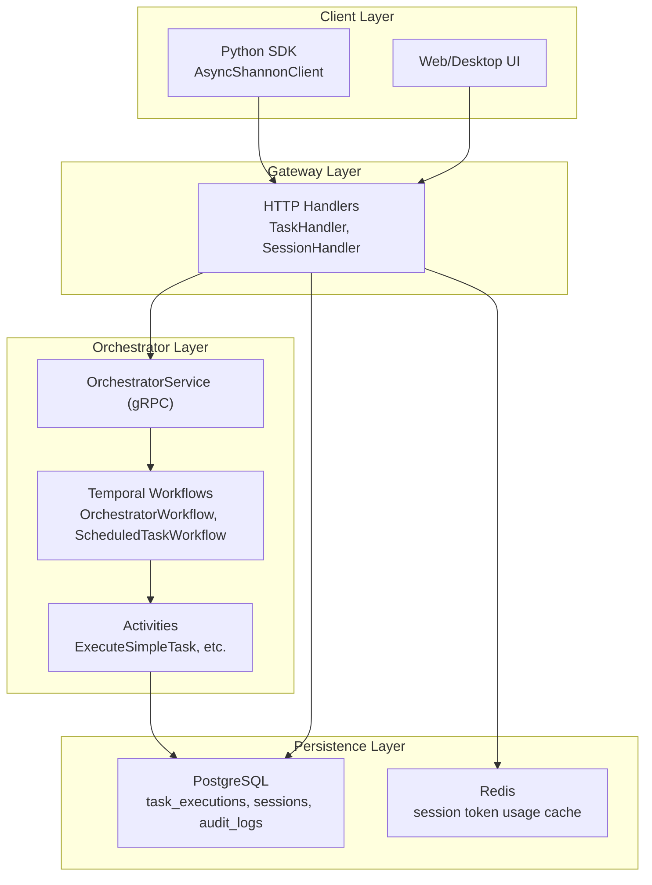
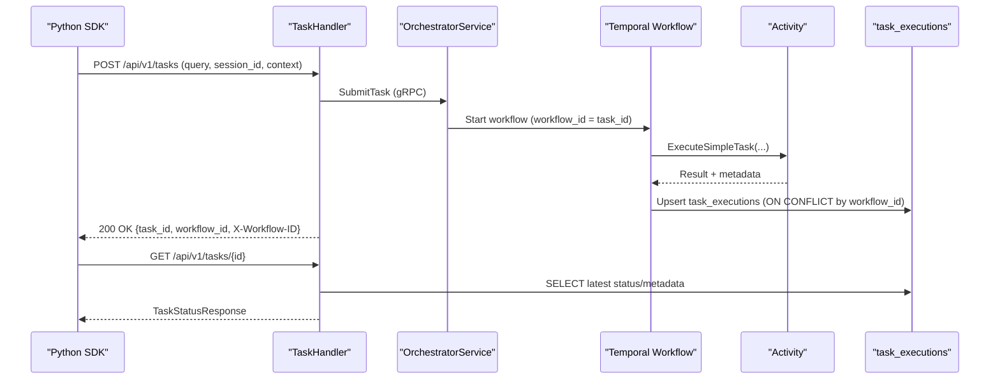
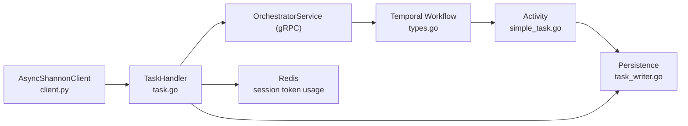

# Task Management

<cite>
**Referenced Files in This Document**
- [task.go](file://go/orchestrator/cmd/gateway/internal/handlers/task.go)
- [session.go](file://go/orchestrator/cmd/gateway/internal/handlers/session.go)
- [client.py](file://clients/python/src/shannon/client.py)
- [types.go](file://go/orchestrator/internal/workflows/types.go)
- [task_writer.go](file://go/orchestrator/internal/db/task_writer.go)
- [simple_task.go](file://go/orchestrator/internal/activities/simple_task.go)
- [scheduled_task_workflow.go](file://go/orchestrator/internal/workflows/scheduled/scheduled_task_workflow.go)
- [adapter.go](file://go/orchestrator/internal/temporal/adapter.go)
- [task_submission_api.md](file://docs/task-submission-api.md)
- [task-history-and-timeline.md](file://docs/task-history-and-timeline.md)
- [streaming-api.md](file://docs/streaming-api.md)
- [python-code-execution.md](file://docs/python-code-execution.md)
- [multi-agent-workflow-architecture.md](file://docs/multi-agent-workflow-architecture.md)
- [scheduled-tasks.md](file://docs/scheduled-tasks.md)
- [authentication-and-multitenancy.md](file://docs/authentication-and-multitenancy.md)
- [shannon-default-timeout-configuration.md](file://docs/shannon-default-timeout-configuration.md)
- [simple_task.py](file://clients/python/examples/simple_task.py)
- [session_continuity.py](file://clients/python/examples/session_continuity.py)
- [simple_streaming.py](file://clients/python/examples/simple_streaming.py)
- [workflow_routing.py](file://clients/python/examples/workflow_routing.py)
</cite>

## Table of Contents
1. [Introduction](#introduction)
2. [Project Structure](#project-structure)
3. [Core Components](#core-components)
4. [Architecture Overview](#architecture-overview)
5. [Detailed Component Analysis](#detailed-component-analysis)
6. [Dependency Analysis](#dependency-analysis)
7. [Performance Considerations](#performance-considerations)
8. [Troubleshooting Guide](#troubleshooting-guide)
9. [Conclusion](#conclusion)
10. [Appendices](#appendices)

## Introduction
This document explains Shannon’s core task management system: how tasks are submitted via REST API and Python SDK, how session continuity and persistence maintain multi-turn conversations, how tasks move through their lifecycle from submission to completion, and how temporal workflow integration enables deterministic execution and time-travel debugging. It also covers task history/timeline for audit and debugging, error handling, retries, timeouts, monitoring, and concurrency management.

## Project Structure
Shannon’s task management spans three layers:
- HTTP Gateway: REST endpoints for task submission, status, listing, and streaming
- Orchestrator: gRPC service and Temporal workflows that execute tasks deterministically
- Persistence: PostgreSQL-backed storage for task executions, sessions, and audit logs

**Diagram sources**
- [task.go](file://go/orchestrator/cmd/gateway/internal/handlers/task.go#L377-L466)
- [session.go](file://go/orchestrator/cmd/gateway/internal/handlers/session.go#L132-L336)
- [client.py](file://clients/python/src/shannon/client.py#L163-L251)
- [types.go](file://go/orchestrator/internal/workflows/types.go#L8-L59)
- [task_writer.go](file://go/orchestrator/internal/db/task_writer.go#L61-L159)

**Section sources**
- [task.go](file://go/orchestrator/cmd/gateway/internal/handlers/task.go#L28-L35)
- [session.go](file://go/orchestrator/cmd/gateway/internal/handlers/session.go#L25-L43)
- [client.py](file://clients/python/src/shannon/client.py#L79-L108)
- [types.go](file://go/orchestrator/internal/workflows/types.go#L8-L59)
- [task_writer.go](file://go/orchestrator/internal/db/task_writer.go#L61-L159)

## Core Components
- TaskHandler: REST endpoints for task submission, status, listing, and streaming; applies context and model overrides; forwards to OrchestratorService
- SessionHandler: session metadata, history, and event grouping for multi-turn conversations
- AsyncShannonClient: Python SDK client with submit_task, submit_and_stream, get_status, wait, list_tasks, get_task_events, get_task_timeline, and control APIs
- OrchestratorService (gRPC): routes tasks to workflows, manages control signals, and persists results
- Temporal Workflows: deterministic orchestration of multi-agent tasks, with scheduled execution wrapper
- Activities: low-level execution steps (e.g., ExecuteSimpleTask)
- Persistence: task_executions, sessions, audit_logs; idempotent updates by workflow_id

**Section sources**
- [task.go](file://go/orchestrator/cmd/gateway/internal/handlers/task.go#L28-L35)
- [session.go](file://go/orchestrator/cmd/gateway/internal/handlers/session.go#L25-L43)
- [client.py](file://clients/python/src/shannon/client.py#L79-L108)
- [types.go](file://go/orchestrator/internal/workflows/types.go#L8-L59)
- [simple_task.go](file://go/orchestrator/internal/activities/simple_task.go#L10-L35)
- [task_writer.go](file://go/orchestrator/internal/db/task_writer.go#L61-L159)

## Architecture Overview
End-to-end flow from client to completion:

**Diagram sources**
- [task.go](file://go/orchestrator/cmd/gateway/internal/handlers/task.go#L377-L466)
- [client.py](file://clients/python/src/shannon/client.py#L163-L251)
- [simple_task.go](file://go/orchestrator/internal/activities/simple_task.go#L40-L106)
- [task_writer.go](file://go/orchestrator/internal/db/task_writer.go#L61-L159)

## Detailed Component Analysis

### REST API: Task Submission and Streaming
- Endpoint: POST /api/v1/tasks
  - Accepts: query, optional session_id, context, mode, model_tier, model_override, provider_override, research_strategy, max_iterations, max_concurrent_agents, enable_verification
  - Applies strategy presets and validates model/provider overrides
  - Generates workflow_id = task_id, sets X-Workflow-ID/X-Session-ID headers
- Endpoint: POST /api/v1/tasks/stream
  - Returns stream_url for SSE; Link header points to /api/v1/stream/sse?workflow_id={workflow_id}
- Endpoint: GET /api/v1/tasks/{id}
  - Returns TaskStatusResponse with result, error, usage, model/provider, metadata, and enriched fields from task_executions
- Endpoint: GET /api/v1/tasks
  - Lists tasks with pagination and status filter

Validation and routing:
- Invalid model_tier/provider_override produce 400
- Rate limit exceeded returns 429
- Not found returns 404
- Unauthorized returns 401

**Section sources**
- [task.go](file://go/orchestrator/cmd/gateway/internal/handlers/task.go#L308-L358)
- [task.go](file://go/orchestrator/cmd/gateway/internal/handlers/task.go#L377-L466)
- [task.go](file://go/orchestrator/cmd/gateway/internal/handlers/task.go#L468-L558)
- [task.go](file://go/orchestrator/cmd/gateway/internal/handlers/task.go#L560-L715)
- [task.go](file://go/orchestrator/cmd/gateway/internal/handlers/task.go#L717-L800)

### Python SDK: Client Operations
- submit_task: sends JSON payload, supports idempotency_key and traceparent
- submit_and_stream: returns TaskHandle and stream_url
- get_status: parses result/response, timestamps, usage, metadata
- wait: polls until terminal state
- list_tasks: paginated with status/session filters
- get_task_events: persistent event history
- get_task_timeline: Temporal deterministic timeline
- Control APIs: cancel, pause, resume, get_control_state

Error handling:
- Maps HTTP status to SDK-specific exceptions (ValidationError, AuthenticationError, RateLimitError, TaskNotFoundError, etc.)

**Section sources**
- [client.py](file://clients/python/src/shannon/client.py#L163-L251)
- [client.py](file://clients/python/src/shannon/client.py#L252-L342)
- [client.py](file://clients/python/src/shannon/client.py#L343-L431)
- [client.py](file://clients/python/src/shannon/client.py#L432-L505)
- [client.py](file://clients/python/src/shannon/client.py#L507-L591)
- [client.py](file://clients/python/src/shannon/client.py#L593-L765)
- [client.py](file://clients/python/src/shannon/client.py#L767-L800)

### Session Continuity and Persistence
- SessionHandler.GET /api/v1/sessions/{sessionId}
  - Returns session metadata, token usage (Redis or fallback aggregation), research flags, and task count
- SessionHandler.GET /api/v1/sessions/{sessionId}/history
  - Returns TaskHistory items with tokens, cost, duration, agents, tools, and metadata
- SessionHandler.GET /api/v1/sessions/{sessionId}/events
  - Groups events by turn (task), with optional payload, capped for safety

Persistence:
- task_executions: idempotent upsert by workflow_id; stores query, mode, status, timestamps, result/error, model/provider, token usage, cost, duration, agents/tools, metadata
- sessions: stores context (including external_id mapping), token budget/usage, TTL
- audit_logs: audit trail entries

**Section sources**
- [session.go](file://go/orchestrator/cmd/gateway/internal/handlers/session.go#L132-L336)
- [session.go](file://go/orchestrator/cmd/gateway/internal/handlers/session.go#L339-L518)
- [session.go](file://go/orchestrator/cmd/gateway/internal/handlers/session.go#L520-L800)
- [task_writer.go](file://go/orchestrator/internal/db/task_writer.go#L61-L159)
- [task_writer.go](file://go/orchestrator/internal/db/task_writer.go#L446-L537)

### Task Lifecycle and Deterministic Execution
- Submission: TaskHandler forwards to OrchestratorService; workflow_id = task_id
- Execution: Temporal Workflow orchestrates agents and activities; ExecuteSimpleTask performs agent execution
- Persistence: Workflow writes/upserts task_executions; metadata includes model/provider, tokens, cost, duration, agents/tools, and structured metadata
- Completion: Status becomes COMPLETED/FAILED/CANCELLED/TIMEOUT; client can retrieve result or timeline

Temporal integration:
- ZapAdapter bridges zap logs to Temporal logger
- ScheduledTaskWorkflow wraps regular workflows for scheduled runs and records execution start/end

**Section sources**
- [simple_task.go](file://go/orchestrator/internal/activities/simple_task.go#L40-L106)
- [task_writer.go](file://go/orchestrator/internal/db/task_writer.go#L61-L159)
- [adapter.go](file://go/orchestrator/internal/temporal/adapter.go#L11-L90)
- [scheduled_task_workflow.go](file://go/orchestrator/internal/workflows/scheduled/scheduled_task_workflow.go#L15-L195)

### Task History and Timeline
- Task history: SessionHandler.GET /api/v1/sessions/{sessionId}/history returns chronological TaskHistory items
- Task events: GET /api/v1/tasks/{id}/events returns persistent event logs
- Timeline: GET /api/v1/tasks/{id}/timeline returns Temporal deterministic timeline for time-travel debugging

**Section sources**
- [session.go](file://go/orchestrator/cmd/gateway/internal/handlers/session.go#L339-L518)
- [client.py](file://clients/python/src/shannon/client.py#L507-L591)

### Practical Examples
- Basic task submission: see [simple_task.py](file://clients/python/examples/simple_task.py)
- Session-based conversation: see [session_continuity.py](file://clients/python/examples/session_continuity.py)
- Streaming task: see [simple_streaming.py](file://clients/python/examples/simple_streaming.py)
- Multi-agent workflow routing: see [workflow_routing.py](file://clients/python/examples/workflow_routing.py)

**Section sources**
- [simple_task.py](file://clients/python/examples/simple_task.py)
- [session_continuity.py](file://clients/python/examples/session_continuity.py)
- [simple_streaming.py](file://clients/python/examples/simple_streaming.py)
- [workflow_routing.py](file://clients/python/examples/workflow_routing.py)

## Dependency Analysis
Key dependencies and relationships:

**Diagram sources**
- [client.py](file://clients/python/src/shannon/client.py#L163-L251)
- [task.go](file://go/orchestrator/cmd/gateway/internal/handlers/task.go#L377-L466)
- [types.go](file://go/orchestrator/internal/workflows/types.go#L8-L59)
- [simple_task.go](file://go/orchestrator/internal/activities/simple_task.go#L40-L106)
- [task_writer.go](file://go/orchestrator/internal/db/task_writer.go#L61-L159)

**Section sources**
- [client.py](file://clients/python/src/shannon/client.py#L163-L251)
- [task.go](file://go/orchestrator/cmd/gateway/internal/handlers/task.go#L377-L466)
- [types.go](file://go/orchestrator/internal/workflows/types.go#L8-L59)
- [simple_task.go](file://go/orchestrator/internal/activities/simple_task.go#L40-L106)
- [task_writer.go](file://go/orchestrator/internal/db/task_writer.go#L61-L159)

## Performance Considerations
- Idempotent persistence: task_executions upsert by workflow_id avoids duplicate writes
- Redis caching: session token usage can be read from Redis for near-real-time stats; falls back to DB aggregation
- Streaming: SSE endpoint reduces latency for long-running tasks
- Batch writes: BatchSaveTaskExecutions and BatchSaveAgentExecutions minimize DB round trips
- Pagination: Session events capped to prevent oversized responses

[No sources needed since this section provides general guidance]

## Troubleshooting Guide
Common issues and resolutions:
- Authentication failures: ensure X-API-Key or Authorization: Bearer headers are set
- Rate limit exceeded: retry with backoff; reduce concurrent submissions
- Task not found: verify task_id/workflow_id; ensure correct tenant/user context
- Validation errors: check query length, session_id format, and allowed model/provider values
- Timeouts: adjust client default_timeout or per-call timeout; use wait() with poll_interval
- Control operations: cancel/pause/resume return 202 Accepted; confirm with get_status

**Section sources**
- [client.py](file://clients/python/src/shannon/client.py#L124-L160)
- [task.go](file://go/orchestrator/cmd/gateway/internal/handlers/task.go#L426-L441)

## Conclusion
Shannon’s task management system combines REST-friendly HTTP endpoints with a robust Temporal-based execution engine. Clients can submit tasks, monitor progress, and retrieve deterministic timelines for debugging. Sessions persist conversation state across turns, while idempotent persistence ensures reliable state updates. The Python SDK simplifies integration with streaming, control signals, and audit-ready history.

[No sources needed since this section summarizes without analyzing specific files]

## Appendices

### API Reference Summary
- POST /api/v1/tasks: submit task with optional session_id, context, and model controls
- POST /api/v1/tasks/stream: submit and receive stream_url for SSE
- GET /api/v1/tasks/{id}: retrieve status and metadata
- GET /api/v1/tasks: list tasks with pagination and filters
- GET /api/v1/sessions/{sessionId}: session metadata and token usage
- GET /api/v1/sessions/{sessionId}/history: session task history
- GET /api/v1/sessions/{sessionId}/events: grouped turn events
- GET /api/v1/tasks/{id}/events: persistent event logs
- GET /api/v1/tasks/{id}/timeline: Temporal deterministic timeline

**Section sources**
- [task.go](file://go/orchestrator/cmd/gateway/internal/handlers/task.go#L377-L466)
- [task.go](file://go/orchestrator/cmd/gateway/internal/handlers/task.go#L468-L558)
- [task.go](file://go/orchestrator/cmd/gateway/internal/handlers/task.go#L560-L715)
- [session.go](file://go/orchestrator/cmd/gateway/internal/handlers/session.go#L132-L336)
- [session.go](file://go/orchestrator/cmd/gateway/internal/handlers/session.go#L339-L518)
- [session.go](file://go/orchestrator/cmd/gateway/internal/handlers/session.go#L520-L800)
- [client.py](file://clients/python/src/shannon/client.py#L507-L591)

### Temporal and Scheduling Notes
- Deterministic logging via ZapAdapter
- Scheduled tasks wrap workflows and record execution start/end in task_executions
- Workflow run/task timeouts inherit from parent context

**Section sources**
- [adapter.go](file://go/orchestrator/internal/temporal/adapter.go#L11-L90)
- [scheduled_task_workflow.go](file://go/orchestrator/internal/workflows/scheduled/scheduled_task_workflow.go#L15-L195)