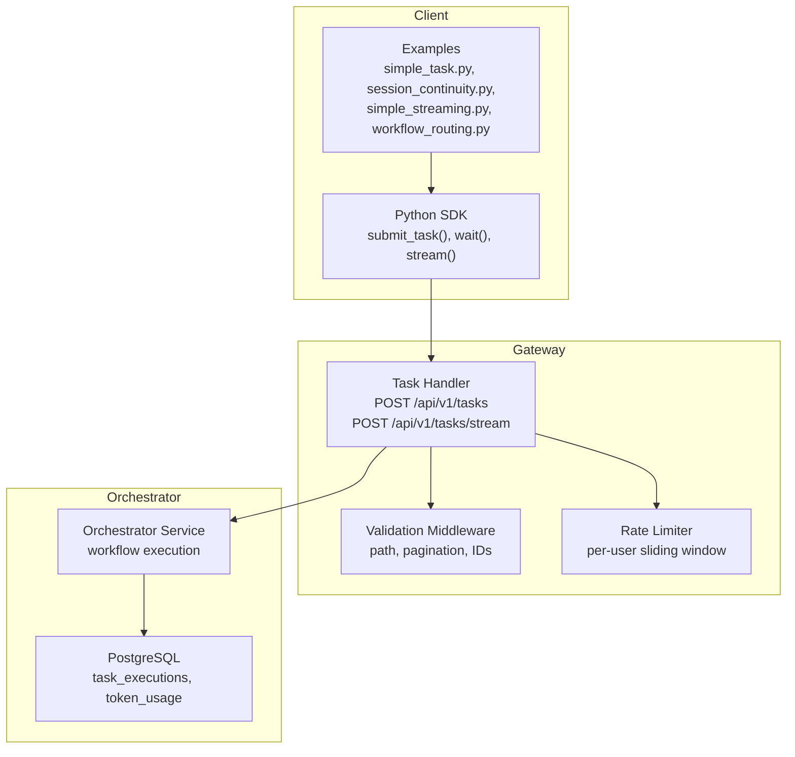
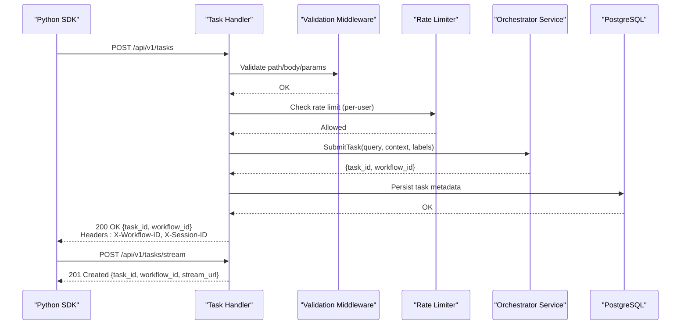
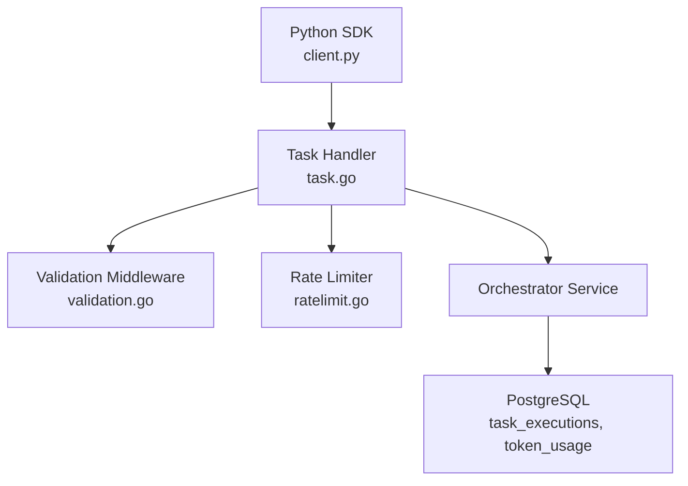

# Task Submission

<cite>
**Referenced Files in This Document**
- [task-submission-api.md](file://docs/task-submission-api.md)
- [authentication-and-multitenancy.md](file://docs/authentication-and-multitenancy.md)
- [shannon-default-timeout-configuration.md](file://docs/shannon-default-timeout-configuration.md)
- [client.py](file://clients/python/src/shannon/client.py)
- [models.py](file://clients/python/src/shannon/models.py)
- [errors.py](file://clients/python/src/shannon/errors.py)
- [simple_task.py](file://clients/python/examples/simple_task.py)
- [session_continuity.py](file://clients/python/examples/session_continuity.py)
- [simple_streaming.py](file://clients/python/examples/simple_streaming.py)
- [workflow_routing.py](file://clients/python/examples/workflow_routing.py)
- [task.go](file://go/orchestrator/cmd/gateway/internal/handlers/task.go)
- [validation.go](file://go/orchestrator/cmd/gateway/internal/middleware/validation.go)
- [ratelimit.go](file://go/orchestrator/cmd/gateway/internal/middleware/ratelimit.go)
- [auth.go](file://go/orchestrator/cmd/gateway/internal/handlers/auth.go)
</cite>

## Table of Contents
1. [Introduction](#introduction)
2. [Project Structure](#project-structure)
3. [Core Components](#core-components)
4. [Architecture Overview](#architecture-overview)
5. [Detailed Component Analysis](#detailed-component-analysis)
6. [Dependency Analysis](#dependency-analysis)
7. [Performance Considerations](#performance-considerations)
8. [Troubleshooting Guide](#troubleshooting-guide)
9. [Conclusion](#conclusion)
10. [Appendices](#appendices)

## Introduction
This document explains how to submit tasks to the Shannon platform via HTTP and integrate with the Python SDK. It covers:
- REST API endpoints and request/response formats
- Required and optional parameters
- Differences between simple tasks and complex multi-agent workflows
- Authentication and tenant isolation
- Request validation and error handling
- Practical examples for basic submission, session-based conversations, and streaming
- Rate limiting, timeouts, and payload considerations
- Monitoring success and handling network failures

## Project Structure
The task submission pipeline spans three layers:
- HTTP Gateway: Validates requests, applies routing labels, enforces rate limits, and forwards to the orchestrator
- Orchestrator: Executes workflows (simple, standard, complex, supervisor) and persists task metadata
- Python SDK: Provides a convenient client for submitting tasks, polling status, streaming events, and managing sessions

**Diagram sources**
- [task.go](file://go/orchestrator/cmd/gateway/internal/handlers/task.go#L377-L558)
- [validation.go](file://go/orchestrator/cmd/gateway/internal/middleware/validation.go#L22-L86)
- [ratelimit.go](file://go/orchestrator/cmd/gateway/internal/middleware/ratelimit.go#L35-L74)
- [client.py](file://clients/python/src/shannon/client.py#L163-L251)

**Section sources**
- [task-submission-api.md](file://docs/task-submission-api.md#L5-L11)
- [task.go](file://go/orchestrator/cmd/gateway/internal/handlers/task.go#L377-L558)
- [validation.go](file://go/orchestrator/cmd/gateway/internal/middleware/validation.go#L22-L86)
- [ratelimit.go](file://go/orchestrator/cmd/gateway/internal/middleware/ratelimit.go#L35-L74)

## Core Components
- HTTP Task Submission API
  - POST /api/v1/tasks: Submit a task and receive a task_id
  - POST /api/v1/tasks/stream: Submit and receive a stream URL (201)
  - Response headers include X-Workflow-ID and X-Session-ID
- Python SDK
  - AsyncShannonClient: submit_task(), submit_and_stream(), get_status(), list_tasks(), stream(), wait(), cancel(), pause(), resume(), get_control_state()
  - Models: TaskHandle, TaskStatus, Event, Session, TokenUsage, etc.
  - Errors: AuthenticationError, ValidationError, RateLimitError, TaskTimeoutError, etc.
- Gateway Handlers and Middleware
  - TaskHandler: request validation, context injection, mode labels, response shaping
  - ValidationMiddleware: path, pagination, ID, status, types, last_event_id validation
  - RateLimiter: per-user sliding window with Redis-backed counters

**Section sources**
- [task-submission-api.md](file://docs/task-submission-api.md#L5-L11)
- [client.py](file://clients/python/src/shannon/client.py#L163-L251)
- [models.py](file://clients/python/src/shannon/models.py#L69-L191)
- [errors.py](file://clients/python/src/shannon/errors.py#L6-L110)
- [task.go](file://go/orchestrator/cmd/gateway/internal/handlers/task.go#L377-L558)
- [validation.go](file://go/orchestrator/cmd/gateway/internal/middleware/validation.go#L22-L86)
- [ratelimit.go](file://go/orchestrator/cmd/gateway/internal/middleware/ratelimit.go#L35-L74)

## Architecture Overview
End-to-end flow for task submission and streaming:

**Diagram sources**
- [task.go](file://go/orchestrator/cmd/gateway/internal/handlers/task.go#L377-L558)
- [validation.go](file://go/orchestrator/cmd/gateway/internal/middleware/validation.go#L22-L86)
- [ratelimit.go](file://go/orchestrator/cmd/gateway/internal/middleware/ratelimit.go#L35-L74)

## Detailed Component Analysis

### REST API Endpoints and Request/Response Formats
- POST /api/v1/tasks
  - Request body: query (required), session_id (optional), context (optional), mode (optional), model_tier (optional), model_override (optional), provider_override (optional)
  - Response: task_id, status, created_at; headers include X-Workflow-ID and X-Session-ID
- POST /api/v1/tasks/stream
  - Request body: same as above
  - Response: 201 Created with workflow_id, task_id, stream_url; headers include X-Workflow-ID, X-Session-ID, Link to stream
- GET /api/v1/tasks/{id}
  - Response: includes result (raw LLM output), response (parsed JSON if applicable), usage, metadata, model_used, provider, context, timestamps
- GET /api/v1/tasks
  - Query params: limit (1-100), offset (>=0), status (QUEUED/RUNNING/COMPLETED/FAILED/CANCELLED/TIMEOUT), session_id
- GET /api/v1/tasks/{id}/events
  - Query params: limit (1-200), offset (>=0)
- GET /api/v1/tasks/{id}/timeline
  - Deterministic event history for the workflow
- Control endpoints: POST /api/v1/tasks/{id}/cancel, POST /api/v1/tasks/{id}/pause, POST /api/v1/tasks/{id}/resume, GET /api/v1/tasks/{id}/control-state

Validation and priority rules:
- model_tier: only small|medium|large
- mode: only simple|standard|complex|supervisor
- Top-level model_tier overrides context.model_tier
- Top-level model_override overrides context.model_override
- Top-level provider_override overrides context.provider_override
- template_name is accepted as an alias for template
- disable_ai=true cannot be combined with model_tier, model_override, or provider_override

**Section sources**
- [task-submission-api.md](file://docs/task-submission-api.md#L5-L11)
- [task-submission-api.md](file://docs/task-submission-api.md#L12-L303)
- [task.go](file://go/orchestrator/cmd/gateway/internal/handlers/task.go#L377-L715)
- [task.go](file://go/orchestrator/cmd/gateway/internal/handlers/task.go#L717-L815)
- [task.go](file://go/orchestrator/cmd/gateway/internal/handlers/task.go#L817-L880)
- [task.go](file://go/orchestrator/cmd/gateway/internal/handlers/task.go#L917-L1124)
- [task.go](file://go/orchestrator/cmd/gateway/internal/handlers/task.go#L1126-L1178)
- [validation.go](file://go/orchestrator/cmd/gateway/internal/middleware/validation.go#L22-L86)

### Python SDK Integration
Key methods:
- submit_task(query, session_id=None, context=None, mode=None, model_tier=None, model_override=None, provider_override=None, idempotency_key=None, traceparent=None, timeout=None)
- submit_and_stream(...): returns (TaskHandle, stream_url)
- get_status(task_id, timeout=None): returns TaskStatus
- list_tasks(limit=20, offset=0, status=None, session_id=None, timeout=None): returns (tasks, total_count)
- wait(task_id, timeout=None, poll_interval=2.0): returns TaskStatus when completed
- stream(workflow_id, types=None): yields Event objects
- cancel(task_id, reason=None, timeout=None), pause(task_id, reason=None, timeout=None), resume(task_id, reason=None, timeout=None)
- get_control_state(task_id, timeout=None)

Models:
- TaskHandle: holds task_id, workflow_id, session_id; convenience methods to wait(), result(), stream(), cancel()
- TaskStatus: status, progress, result, error_message, timestamps, query, session_id, mode, context, model_used, provider, usage, metadata
- Event: type, workflow_id, message, timestamp, agent_id, seq, stream_id
- Session, TokenUsage, TaskSummary, etc.

Error handling:
- AuthenticationError, PermissionDeniedError, ValidationError, RateLimitError, TaskTimeoutError, TaskNotFoundError, SessionNotFoundError, ServerError

**Section sources**
- [client.py](file://clients/python/src/shannon/client.py#L163-L251)
- [client.py](file://clients/python/src/shannon/client.py#L252-L342)
- [client.py](file://clients/python/src/shannon/client.py#L343-L431)
- [client.py](file://clients/python/src/shannon/client.py#L432-L505)
- [client.py](file://clients/python/src/shannon/client.py#L507-L592)
- [client.py](file://clients/python/src/shannon/client.py#L593-L677)
- [client.py](file://clients/python/src/shannon/client.py#L678-L766)
- [client.py](file://clients/python/src/shannon/client.py#L767-L800)
- [models.py](file://clients/python/src/shannon/models.py#L69-L191)
- [errors.py](file://clients/python/src/shannon/errors.py#L6-L110)

### Authentication and Tenant Isolation
- Authentication methods: X-API-Key header or Authorization: Bearer <api_key>
- API keys normalized: sk_live_... or sk-shannon-... (converted to sk_...)
- Multi-tenancy: every request carries user_id and tenant_id; all data stores filter by tenant_id; silent failures ("not found") prevent data leakage
- Rate limiting: per-user sliding window enforced by Redis; headers include X-RateLimit-Limit, X-RateLimit-Remaining, X-RateLimit-Reset; Retry-After on 429

**Section sources**
- [authentication-and-multitenancy.md](file://docs/authentication-and-multitenancy.md#L149-L202)
- [authentication-and-multitenancy.md](file://docs/authentication-and-multitenancy.md#L204-L240)
- [auth.go](file://go/orchestrator/cmd/gateway/internal/handlers/auth.go#L166-L274)
- [ratelimit.go](file://go/orchestrator/cmd/gateway/internal/middleware/ratelimit.go#L35-L74)

### Request Validation and Priority Rules
- ValidationMiddleware enforces:
  - GET /api/v1/tasks: limit (1-100), offset (>=0), status from allowed set
  - GET /api/v1/tasks/{id}/events: limit (1-200), offset (>=0)
  - GET /api/v1/tasks/{id}/stream: workflow_id required, optional types, optional last_event_id
  - Path IDs and workflow IDs: alphanumeric, underscore, hyphen, dot, colon, length up to 128
- TaskHandler validation:
  - query required
  - model_tier: small|medium|large
  - mode: simple|standard|complex|supervisor
  - provider_override: must be in allowed list
  - conflict: disable_ai=true cannot coexist with model_tier/model_override/provider_override
  - template_name alias normalization to template

**Section sources**
- [validation.go](file://go/orchestrator/cmd/gateway/internal/middleware/validation.go#L22-L86)
- [task.go](file://go/orchestrator/cmd/gateway/internal/handlers/task.go#L139-L291)

### Task Status Response and Usage/Metadata
- GET /api/v1/tasks/{id} returns:
  - result (raw LLM output)
  - response (parsed JSON if result is valid JSON)
  - usage (total_tokens, input_tokens, output_tokens, estimated_cost)
  - metadata (including model_breakdown for multi-model tasks)
  - model_used, provider, context, timestamps
- model_breakdown provides per-model execution counts, tokens, cost, and percentage share

**Section sources**
- [task-submission-api.md](file://docs/task-submission-api.md#L304-L367)
- [task.go](file://go/orchestrator/cmd/gateway/internal/handlers/task.go#L600-L715)
- [task.go](file://go/orchestrator/cmd/gateway/internal/handlers/task.go#L1180-L1248)

### Practical Examples
- Basic task submission and polling
  - [simple_task.py](file://clients/python/examples/simple_task.py#L14-L47)
- Session continuity for multi-turn conversations
  - [session_continuity.py](file://clients/python/examples/session_continuity.py#L22-L56)
- Streaming events for progress and tool invocations
  - [simple_streaming.py](file://clients/python/examples/simple_streaming.py#L12-L42)
- Workflow routing and delegation events
  - [workflow_routing.py](file://clients/python/examples/workflow_routing.py#L16-L61)

**Section sources**
- [simple_task.py](file://clients/python/examples/simple_task.py#L14-L47)
- [session_continuity.py](file://clients/python/examples/session_continuity.py#L22-L56)
- [simple_streaming.py](file://clients/python/examples/simple_streaming.py#L12-L42)
- [workflow_routing.py](file://clients/python/examples/workflow_routing.py#L16-L61)

### Batch Processing and Idempotency
- Idempotency: use Idempotency-Key header to safely retry submissions; gateway caches 2xx responses for 24h
- Batch processing: submit multiple tasks sequentially or in parallel; track results via list_tasks() and per-task status polling

**Section sources**
- [task-submission-api.md](file://docs/task-submission-api.md#L424-L427)
- [client.py](file://clients/python/src/shannon/client.py#L163-L251)

### Error Handling and Status Codes
Common HTTP responses:
- 200 OK: submit_task()
- 201 Created: submit_and_stream()
- 400 Bad Request: invalid parameters, validation errors
- 401 Unauthorized: missing/invalid auth
- 403 Forbidden: permission denied
- 404 Not Found: task/session not found
- 429 Too Many Requests: rate limit exceeded
- 5xx Server Error: upstream failures

SDK exceptions:
- AuthenticationError, PermissionDeniedError, ValidationError, RateLimitError, TaskTimeoutError, TaskNotFoundError, SessionNotFoundError, ServerError

**Section sources**
- [task.go](file://go/orchestrator/cmd/gateway/internal/handlers/task.go#L377-L466)
- [task.go](file://go/orchestrator/cmd/gateway/internal/handlers/task.go#L468-L558)
- [client.py](file://clients/python/src/shannon/client.py#L124-L159)
- [errors.py](file://clients/python/src/shannon/errors.py#L6-L110)

### Rate Limiting, Timeouts, and Payload Size Limits
- Rate limiting: per-user sliding window (default 60/min), headers X-RateLimit-Limit/Remaining/Reset, Retry-After on 429
- Timeouts:
  - Agent execution default 30s (compose default 600s)
  - Provider timeouts vary (OpenAI/Anthropic/Google: 300s; others 60–120s)
  - HTTP client timeouts for internal operations (e.g., tool metadata fetch 2s, agent gRPC agent timeout + 30s buffer)
  - SDK default timeout configurable per call
- Payload size: query length limited to 10,000 characters in SDK; gateway validates presence and format

**Section sources**
- [shannon-default-timeout-configuration.md](file://docs/shannon-default-timeout-configuration.md#L7-L54)
- [client.py](file://clients/python/src/shannon/client.py#L18-L19)
- [client.py](file://clients/python/src/shannon/client.py#L196-L202)
- [ratelimit.go](file://go/orchestrator/cmd/gateway/internal/middleware/ratelimit.go#L35-L74)

## Dependency Analysis
Relationships among components:

**Diagram sources**
- [client.py](file://clients/python/src/shannon/client.py#L163-L251)
- [task.go](file://go/orchestrator/cmd/gateway/internal/handlers/task.go#L377-L558)
- [validation.go](file://go/orchestrator/cmd/gateway/internal/middleware/validation.go#L22-L86)
- [ratelimit.go](file://go/orchestrator/cmd/gateway/internal/middleware/ratelimit.go#L35-L74)

**Section sources**
- [client.py](file://clients/python/src/shannon/client.py#L163-L251)
- [task.go](file://go/orchestrator/cmd/gateway/internal/handlers/task.go#L377-L558)
- [validation.go](file://go/orchestrator/cmd/gateway/internal/middleware/validation.go#L22-L86)
- [ratelimit.go](file://go/orchestrator/cmd/gateway/internal/middleware/ratelimit.go#L35-L74)

## Performance Considerations
- Use streaming for long-running tasks to reduce polling overhead
- Prefer submit_and_stream() to avoid extra round-trips
- Tune poll_interval in wait() based on expected task duration
- Leverage model_tier and provider_override judiciously to balance cost and speed
- Monitor usage via list_tasks() and per-task status for cost control

[No sources needed since this section provides general guidance]

## Troubleshooting Guide
Common issues and resolutions:
- Authentication failures (401/403): verify X-API-Key or Authorization header format; ensure API key normalization
- Rate limit exceeded (429): respect X-RateLimit-* headers and Retry-After; consider backoff
- Validation errors (400): check model_tier, mode, provider_override values; avoid disable_ai with model parameters
- Task not found (404): confirm tenant ownership; verify workflow_id vs task_id usage
- Network failures: wrap SDK calls with retries; use idempotency_key for idempotent resubmissions
- Streaming interruptions: reconnect using last_event_id if provided; use stream() with types filter

**Section sources**
- [client.py](file://clients/python/src/shannon/client.py#L124-L159)
- [task.go](file://go/orchestrator/cmd/gateway/internal/handlers/task.go#L377-L466)
- [task.go](file://go/orchestrator/cmd/gateway/internal/handlers/task.go#L468-L558)
- [validation.go](file://go/orchestrator/cmd/gateway/internal/middleware/validation.go#L22-L86)
- [ratelimit.go](file://go/orchestrator/cmd/gateway/internal/middleware/ratelimit.go#L106-L117)

## Conclusion
Shannon’s task submission system provides a robust, authenticated, and tenant-isolated pathway for both simple and complex workflows. The Python SDK simplifies integration with convenient methods for submission, polling, streaming, and control. By following the validation rules, respecting rate limits, and leveraging streaming and idempotency, you can build reliable automation and research pipelines.

[No sources needed since this section summarizes without analyzing specific files]

## Appendices

### API Definition Summary
- POST /api/v1/tasks
  - Required: query
  - Optional: session_id, context, mode, model_tier, model_override, provider_override
  - Response: task_id, status, created_at; headers X-Workflow-ID, X-Session-ID
- POST /api/v1/tasks/stream
  - Response: 201 Created with workflow_id, task_id, stream_url; headers X-Workflow-ID, X-Session-ID, Link
- GET /api/v1/tasks/{id}
  - Response: result, response, usage, metadata, model_used, provider, context, timestamps
- GET /api/v1/tasks
  - Query: limit (1-100), offset (>=0), status, session_id

**Section sources**
- [task-submission-api.md](file://docs/task-submission-api.md#L5-L11)
- [task.go](file://go/orchestrator/cmd/gateway/internal/handlers/task.go#L377-L715)
- [task.go](file://go/orchestrator/cmd/gateway/internal/handlers/task.go#L717-L815)

### Python SDK Methods Reference
- submit_task(), submit_and_stream(), get_status(), list_tasks(), stream(), wait(), cancel(), pause(), resume(), get_control_state()

**Section sources**
- [client.py](file://clients/python/src/shannon/client.py#L163-L251)
- [client.py](file://clients/python/src/shannon/client.py#L252-L342)
- [client.py](file://clients/python/src/shannon/client.py#L343-L431)
- [client.py](file://clients/python/src/shannon/client.py#L432-L505)
- [client.py](file://clients/python/src/shannon/client.py#L507-L592)
- [client.py](file://clients/python/src/shannon/client.py#L593-L677)
- [client.py](file://clients/python/src/shannon/client.py#L678-L766)
- [client.py](file://clients/python/src/shannon/client.py#L767-L800)