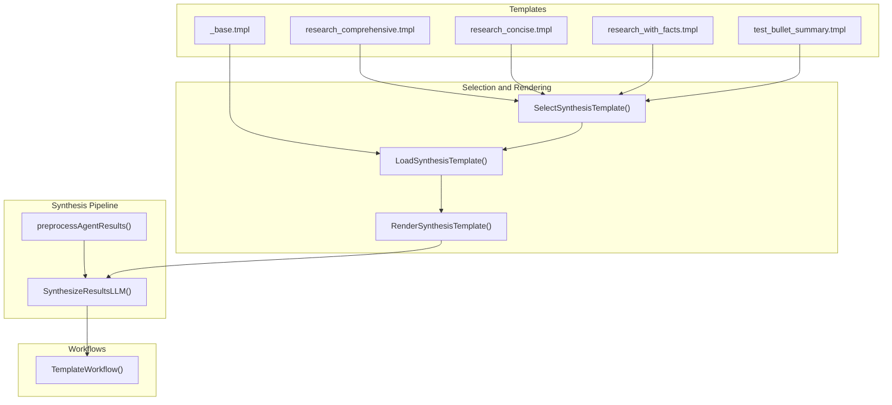
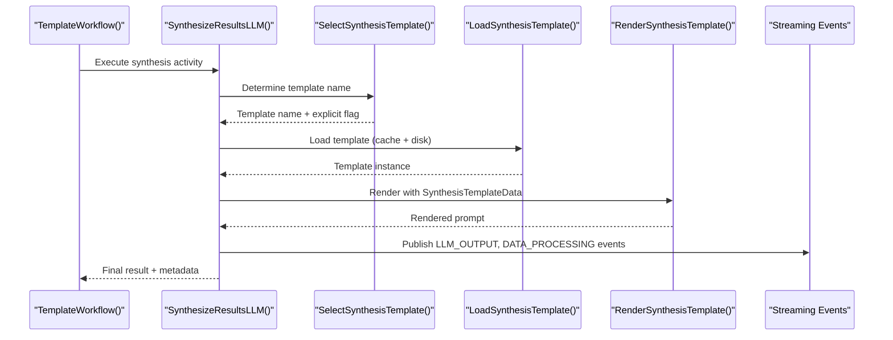
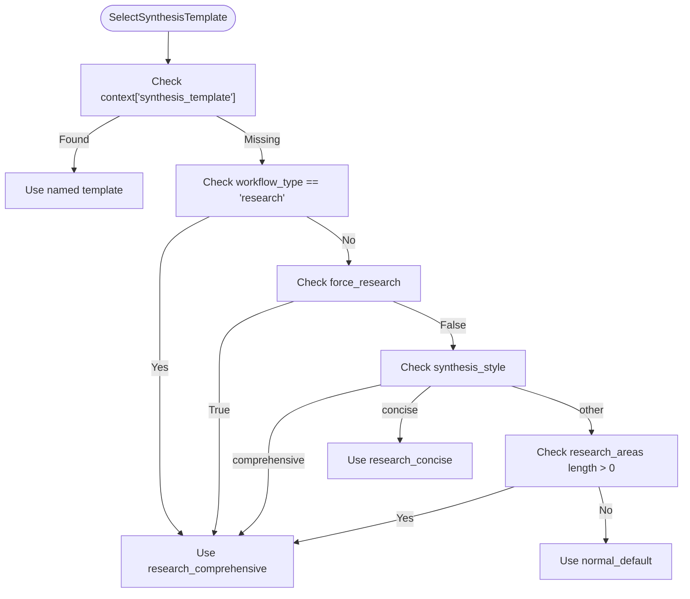
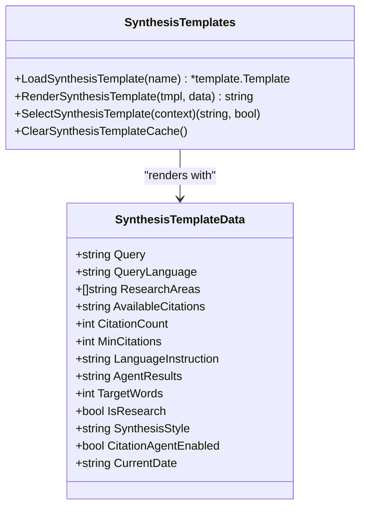
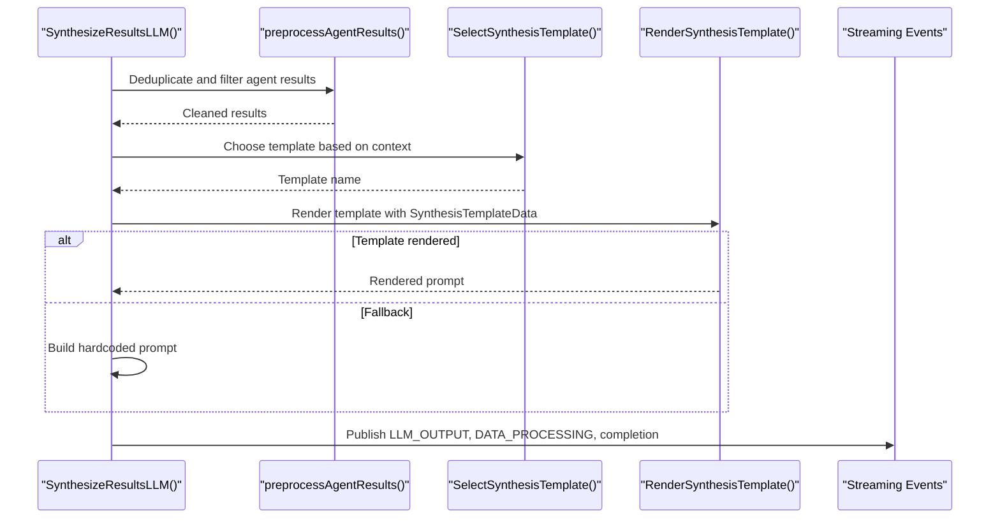
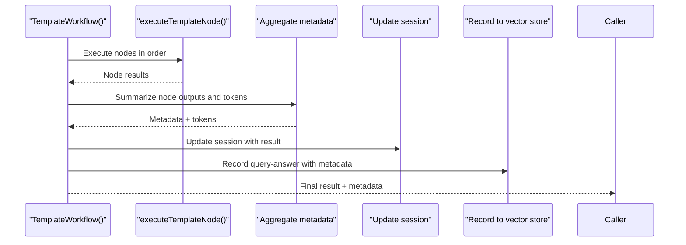
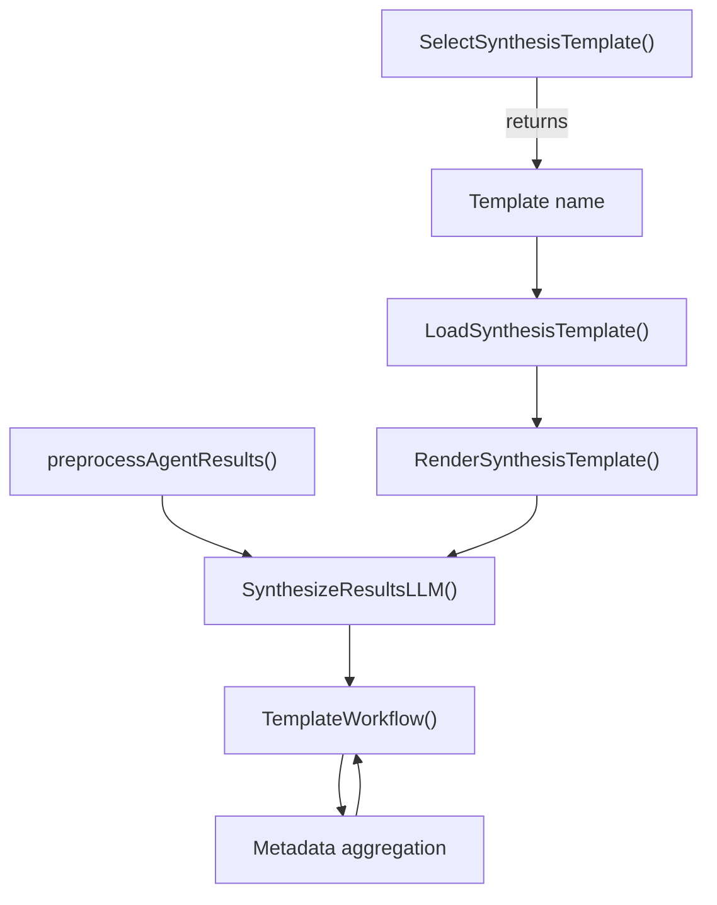

# Synthesis Templates

<cite>
**Referenced Files in This Document**
- [README.md](file://config/templates/synthesis/README.md)
- [_base.tmpl](file://config/templates/synthesis/_base.tmpl)
- [research_comprehensive.tmpl](file://config/templates/synthesis/research_comprehensive.tmpl)
- [research_concise.tmpl](file://config/templates/synthesis/research_concise.tmpl)
- [research_with_facts.tmpl](file://config/templates/synthesis/research_with_facts.tmpl)
- [test_bullet_summary.tmpl](file://config/templates/synthesis/test_bullet_summary.tmpl)
- [synthesis_templates.go](file://go/orchestrator/internal/activities/synthesis_templates.go)
- [synthesis.go](file://go/orchestrator/internal/activities/synthesis.go)
- [template_workflow.go](file://go/orchestrator/internal/workflows/template_workflow.go)
- [compiler.go](file://go/orchestrator/internal/templates/compiler.go)
- [registry.go](file://go/orchestrator/internal/templates/registry.go)
- [loader.go](file://go/orchestrator/internal/templates/loader.go)
</cite>

## Table of Contents
1. [Introduction](#introduction)
2. [Project Structure](#project-structure)
3. [Core Components](#core-components)
4. [Architecture Overview](#architecture-overview)
5. [Detailed Component Analysis](#detailed-component-analysis)
6. [Dependency Analysis](#dependency-analysis)
7. [Performance Considerations](#performance-considerations)
8. [Troubleshooting Guide](#troubleshooting-guide)
9. [Conclusion](#conclusion)
10. [Appendices](#appendices)

## Introduction
This document explains the synthesis templates system used in research and report generation workflows. It covers the template architecture, variant styles (comprehensive, concise, with facts), parameterization, content generation patterns, and output formatting. It also documents the synthesis process workflow, intermediate result aggregation, and final report compilation. Practical examples show how to configure templates for different research domains, customize output formats, and integrate with external data sources. Finally, it addresses performance optimization, memory management, and quality control mechanisms.

## Project Structure
The synthesis templates are authored in Go’s text/template format and organized under a dedicated directory. They are consumed by the synthesis pipeline, which selects a template based on context, renders it, and appends agent outputs to produce the final report.

**Diagram sources**
- [synthesis_templates.go](file://go/orchestrator/internal/activities/synthesis_templates.go#L171-L228)
- [synthesis_templates.go](file://go/orchestrator/internal/activities/synthesis_templates.go#L74-L153)
- [synthesis.go](file://go/orchestrator/internal/activities/synthesis.go#L377-L725)
- [template_workflow.go](file://go/orchestrator/internal/workflows/template_workflow.go#L31-L172)

**Section sources**
- [README.md](file://config/templates/synthesis/README.md#L1-L109)
- [synthesis_templates.go](file://go/orchestrator/internal/activities/synthesis_templates.go#L1-L236)

## Core Components
- Template catalog: Located under config/templates/synthesis, containing named templates and a protected base contract.
- Template selection: Chooses a template based on context flags such as workflow type, synthesis style, and research areas.
- Template rendering: Loads templates, merges base contract, and renders with a strongly typed data bag.
- Synthesis pipeline: Preprocesses agent results, optionally uses template rendering, and emits streaming events.
- Workflow orchestration: Executes nodes deterministically and aggregates results for final report compilation.

Key responsibilities:
- Template selection and rendering: synthesis_templates.go
- Synthesis logic and fallbacks: synthesis.go
- Workflow orchestration and result aggregation: template_workflow.go
- Template compilation and registry: compiler.go, registry.go, loader.go

**Section sources**
- [synthesis_templates.go](file://go/orchestrator/internal/activities/synthesis_templates.go#L15-L30)
- [synthesis_templates.go](file://go/orchestrator/internal/activities/synthesis_templates.go#L171-L228)
- [synthesis.go](file://go/orchestrator/internal/activities/synthesis.go#L290-L374)
- [template_workflow.go](file://go/orchestrator/internal/workflows/template_workflow.go#L31-L172)

## Architecture Overview
The synthesis pipeline integrates template selection, rendering, and result aggregation into a cohesive workflow. The diagram below maps the actual code components involved in a typical synthesis run.

**Diagram sources**
- [template_workflow.go](file://go/orchestrator/internal/workflows/template_workflow.go#L31-L172)
- [synthesis.go](file://go/orchestrator/internal/activities/synthesis.go#L377-L725)
- [synthesis_templates.go](file://go/orchestrator/internal/activities/synthesis_templates.go#L171-L228)
- [synthesis_templates.go](file://go/orchestrator/internal/activities/synthesis_templates.go#L74-L153)

## Detailed Component Analysis

### Template Catalog and Variants
The synthesis template catalog defines three primary research variants and a default template, plus a protected base contract that enforces citation and output formatting standards.

- Base contract (_base.tmpl): Defines the protected synthesis contract, citation handling, language requirements, and reusable partials for citation integration and coverage checks.
- research_comprehensive.tmpl: Full deep research synthesis with strict section structure, per-area subsections, citation integration rules, and quantitative synthesis guidelines.
- research_concise.tmpl: Shorter research synthesis with the same section structure but lighter word requirements and less strict per-area coverage.
- research_with_facts.tmpl: Comprehensive report plus a structured facts JSON appendix for downstream extraction and analysis.
- test_bullet_summary.tmpl: Example custom template for bullet-point summaries, demonstrating how to embed a custom output structure.

Template variables available to all synthesis templates:
- Query, QueryLanguage, ResearchAreas, AvailableCitations, CitationCount, MinCitations, LanguageInstruction, AgentResults, TargetWords, IsResearch, SynthesisStyle, CitationAgentEnabled, CurrentDate.

Protected contract highlights:
- Inline citation format and automatic Sources section handling.
- Source priority and conflict resolution rules.
- Preservation of structured artifacts from agent outputs.

**Section sources**
- [README.md](file://config/templates/synthesis/README.md#L35-L109)
- [_base.tmpl](file://config/templates/synthesis/_base.tmpl#L13-L143)
- [research_comprehensive.tmpl](file://config/templates/synthesis/research_comprehensive.tmpl#L1-L130)
- [research_concise.tmpl](file://config/templates/synthesis/research_concise.tmpl#L1-L69)
- [research_with_facts.tmpl](file://config/templates/synthesis/research_with_facts.tmpl#L1-L128)
- [test_bullet_summary.tmpl](file://config/templates/synthesis/test_bullet_summary.tmpl#L1-L44)

### Template Selection Logic
Template selection follows a precedence order controlled by context flags:
1. Explicit template override via context["synthesis_template"].
2. Workflow type equals "research".
3. force_research flag is true.
4. synthesis_style equals "comprehensive" or "concise".
5. Presence of research_areas.
6. Default fallback to normal_default.

This logic resides in SelectSynthesisTemplate and is used by the synthesis activity to decide whether to render a template or fall back to a hardcoded prompt.

**Diagram sources**
- [synthesis_templates.go](file://go/orchestrator/internal/activities/synthesis_templates.go#L171-L228)

**Section sources**
- [synthesis_templates.go](file://go/orchestrator/internal/activities/synthesis_templates.go#L171-L228)

### Template Loading and Rendering
Template loading and rendering are implemented with caching and deterministic behavior:
- LoadSynthesisTemplate: Checks cache, loads base and named templates, merges them, and caches the result. Supports environment override for template directory.
- RenderSynthesisTemplate: Executes the template with a strongly typed data bag.
- SynthesisTemplateData: Defines the schema of variables passed to templates.

**Diagram sources**
- [synthesis_templates.go](file://go/orchestrator/internal/activities/synthesis_templates.go#L15-L30)
- [synthesis_templates.go](file://go/orchestrator/internal/activities/synthesis_templates.go#L74-L153)
- [synthesis_templates.go](file://go/orchestrator/internal/activities/synthesis_templates.go#L155-L169)

**Section sources**
- [synthesis_templates.go](file://go/orchestrator/internal/activities/synthesis_templates.go#L38-L45)
- [synthesis_templates.go](file://go/orchestrator/internal/activities/synthesis_templates.go#L47-L64)
- [synthesis_templates.go](file://go/orchestrator/internal/activities/synthesis_templates.go#L155-L169)

### Synthesis Pipeline and Fallbacks
The synthesis activity performs preprocessing of agent results, selects a template, renders it, and emits streaming events. If template rendering fails or is not applicable, it falls back to a hardcoded prompt tailored to the synthesis style and research context.

Key steps:
- Preprocess agent results to remove duplicates and low-quality outputs.
- Detect language and construct language instruction.
- Determine synthesis style and research mode.
- Compute target words and minimum citations.
- Select and render template or fallback prompt.
- Emit streaming events for LLM output, token summary, and completion status.

**Diagram sources**
- [synthesis.go](file://go/orchestrator/internal/activities/synthesis.go#L290-L374)
- [synthesis.go](file://go/orchestrator/internal/activities/synthesis.go#L377-L725)
- [synthesis_templates.go](file://go/orchestrator/internal/activities/synthesis_templates.go#L171-L228)

**Section sources**
- [synthesis.go](file://go/orchestrator/internal/activities/synthesis.go#L172-L288)
- [synthesis.go](file://go/orchestrator/internal/activities/synthesis.go#L377-L800)

### Workflow Orchestration and Report Compilation
TemplateWorkflow executes a compiled plan deterministically, records node results, aggregates agent metadata, and compiles the final result. It also updates sessions and records results to a vector store.

Highlights:
- Executes nodes in topological order.
- Aggregates agent metadata and computes cost estimates.
- Emits workflow completion events.
- Records final result and metadata to vector store.

**Diagram sources**
- [template_workflow.go](file://go/orchestrator/internal/workflows/template_workflow.go#L31-L172)
- [template_workflow.go](file://go/orchestrator/internal/workflows/template_workflow.go#L788-L851)

**Section sources**
- [template_workflow.go](file://go/orchestrator/internal/workflows/template_workflow.go#L31-L172)
- [template_workflow.go](file://go/orchestrator/internal/workflows/template_workflow.go#L174-L227)
- [template_workflow.go](file://go/orchestrator/internal/workflows/template_workflow.go#L788-L851)

### Template Compilation and Registry (YAML Templates)
While the synthesis templates are text/template files, the system also includes a separate template compilation and registry for workflow YAML templates. These are compiled into executable plans and managed in a registry.

- Compiler: Converts validated templates into ExecutablePlan with topological ordering.
- Registry: Loads YAML templates from disk, validates, and stores keyed by name@version.
- Loader: Reads and decodes YAML templates.

These components are orthogonal to synthesis templates but demonstrate the broader templating infrastructure.

**Section sources**
- [compiler.go](file://go/orchestrator/internal/templates/compiler.go#L31-L122)
- [registry.go](file://go/orchestrator/internal/templates/registry.go#L51-L87)
- [loader.go](file://go/orchestrator/internal/templates/loader.go#L11-L42)

## Dependency Analysis
The synthesis system exhibits clear separation of concerns:
- Template selection and rendering are decoupled from synthesis logic.
- Synthesis activity depends on preprocessing and template rendering utilities.
- Workflow orchestration depends on compiled plans and metadata aggregation.

**Diagram sources**
- [synthesis_templates.go](file://go/orchestrator/internal/activities/synthesis_templates.go#L171-L228)
- [synthesis_templates.go](file://go/orchestrator/internal/activities/synthesis_templates.go#L74-L153)
- [synthesis.go](file://go/orchestrator/internal/activities/synthesis.go#L290-L374)
- [template_workflow.go](file://go/orchestrator/internal/workflows/template_workflow.go#L129-L144)

**Section sources**
- [synthesis_templates.go](file://go/orchestrator/internal/activities/synthesis_templates.go#L171-L228)
- [synthesis.go](file://go/orchestrator/internal/activities/synthesis.go#L290-L374)
- [template_workflow.go](file://go/orchestrator/internal/workflows/template_workflow.go#L129-L144)

## Performance Considerations
- Template caching: LoadSynthesisTemplate caches parsed templates to avoid repeated disk reads and parsing overhead.
- Deterministic rendering: Template rendering occurs in activities with caching, minimizing repeated work.
- Preprocessing: Deduplication and similarity filtering reduce redundant agent outputs and improve synthesis quality.
- Streaming events: Emitting incremental events avoids large payloads and improves responsiveness.
- Memory management: The synthesis activity truncates outputs and sanitizes agent outputs to prevent oversized prompts and duplicate citations.

Recommendations:
- Use environment variable to override template directory for testing or deployment customization.
- Prefer concise templates for time-sensitive tasks and comprehensive templates for deep research.
- Monitor token usage and adjust model tiers to balance quality and cost.

**Section sources**
- [synthesis_templates.go](file://go/orchestrator/internal/activities/synthesis_templates.go#L38-L45)
- [synthesis.go](file://go/orchestrator/internal/activities/synthesis.go#L172-L288)
- [synthesis.go](file://go/orchestrator/internal/activities/synthesis.go#L290-L374)

## Troubleshooting Guide
Common issues and resolutions:
- Template not found: LoadSynthesisTemplate returns nil when a named template does not exist; the system falls back to a hardcoded prompt. Verify template name and directory.
- Template rendering errors: RenderSynthesisTemplate returns an error; check template variables and base contract compliance.
- Citation conflicts: The base contract requires inline citations to match Available Citations indices. Ensure citations are properly formatted and indexed.
- Language mismatches: The synthesis activity detects language and emits a strong language requirement; use context flags to enforce language consistency.
- Streaming delays: Ensure streaming events are published after synthesis completes to maintain correct sequencing.

Operational tips:
- Clear template cache when hot-reloading templates for testing.
- Validate context variables passed to synthesis to ensure correct template selection.
- Review preprocessing logs to identify low-quality or duplicated agent outputs.

**Section sources**
- [synthesis_templates.go](file://go/orchestrator/internal/activities/synthesis_templates.go#L74-L153)
- [synthesis.go](file://go/orchestrator/internal/activities/synthesis.go#L377-L725)
- [_base.tmpl](file://config/templates/synthesis/_base.tmpl#L21-L46)

## Conclusion
The synthesis templates system provides a robust, extensible framework for generating research reports and summaries. By combining a protected base contract, flexible template variants, and a deterministic synthesis pipeline, it ensures consistent output formatting, reliable citation handling, and efficient resource utilization. The modular design allows customization for diverse research domains and integration with external data sources, while built-in quality controls and performance optimizations support scalable deployments.

## Appendices

### Practical Configuration Examples
- Research synthesis (comprehensive): Set context["synthesis_style"] = "comprehensive" or provide research_areas to trigger research_comprehensive.tmpl.
- Research synthesis (concise): Set context["synthesis_style"] = "concise" to use research_concise.tmpl.
- With facts appendix: Enable fact extraction and use research_with_facts.tmpl.
- Custom template: Provide context["synthesis_template"] = "your_custom" and include the base contract and citation list in your template.
- Verbatim override: Use context["synthesis_template_override"] to bypass template rendering entirely (advanced users).

**Section sources**
- [README.md](file://config/templates/synthesis/README.md#L19-L34)
- [synthesis_templates.go](file://go/orchestrator/internal/activities/synthesis_templates.go#L171-L228)
- [research_with_facts.tmpl](file://config/templates/synthesis/research_with_facts.tmpl#L6-L7)

### Output Formatting Options
- Section structure: Executive Summary, Detailed Findings, Limitations and Uncertainties (and Structured Facts for research_with_facts.tmpl).
- Citation handling: Inline citations [n] or natural citation references depending on CitationAgentEnabled.
- Language requirement: Enforced to match the query language.
- Structured artifacts: Tables, checklists, code blocks, and JSON/YAML preserved when present in agent outputs.

**Section sources**
- [research_comprehensive.tmpl](file://config/templates/synthesis/research_comprehensive.tmpl#L61-L98)
- [research_concise.tmpl](file://config/templates/synthesis/research_concise.tmpl#L30-L53)
- [research_with_facts.tmpl](file://config/templates/synthesis/research_with_facts.tmpl#L75-L99)
- [_base.tmpl](file://config/templates/synthesis/_base.tmpl#L21-L34)