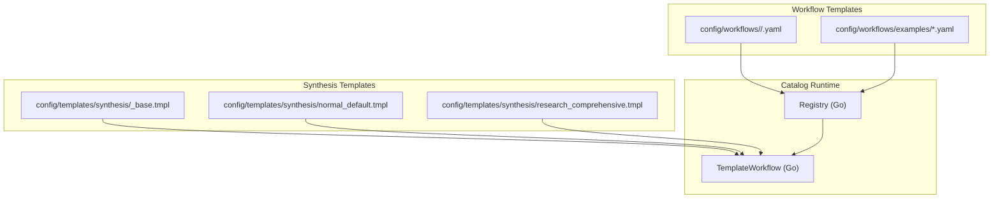
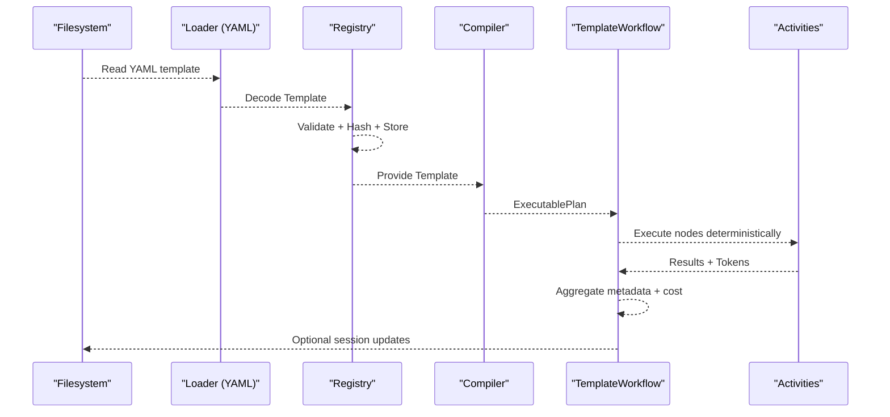
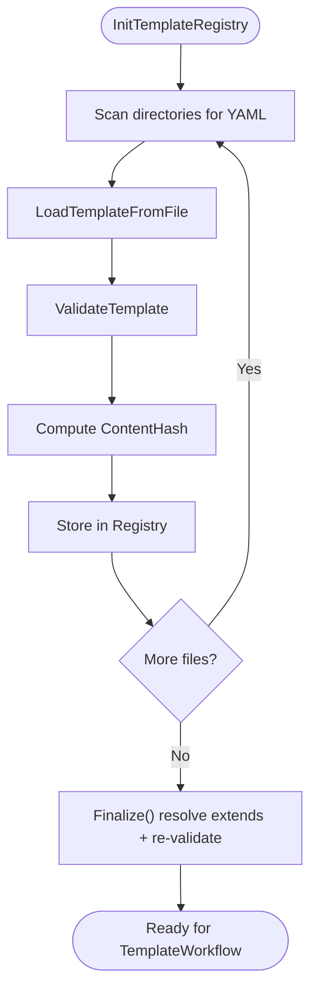
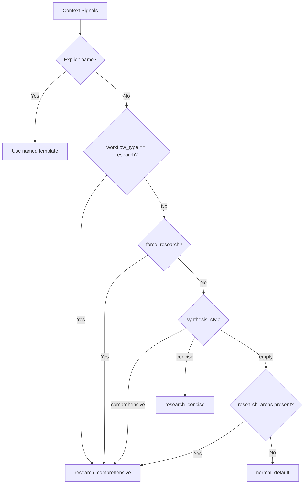
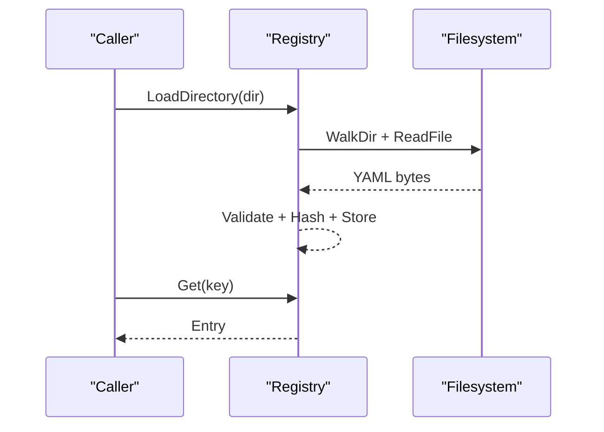
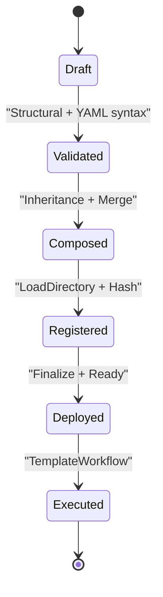
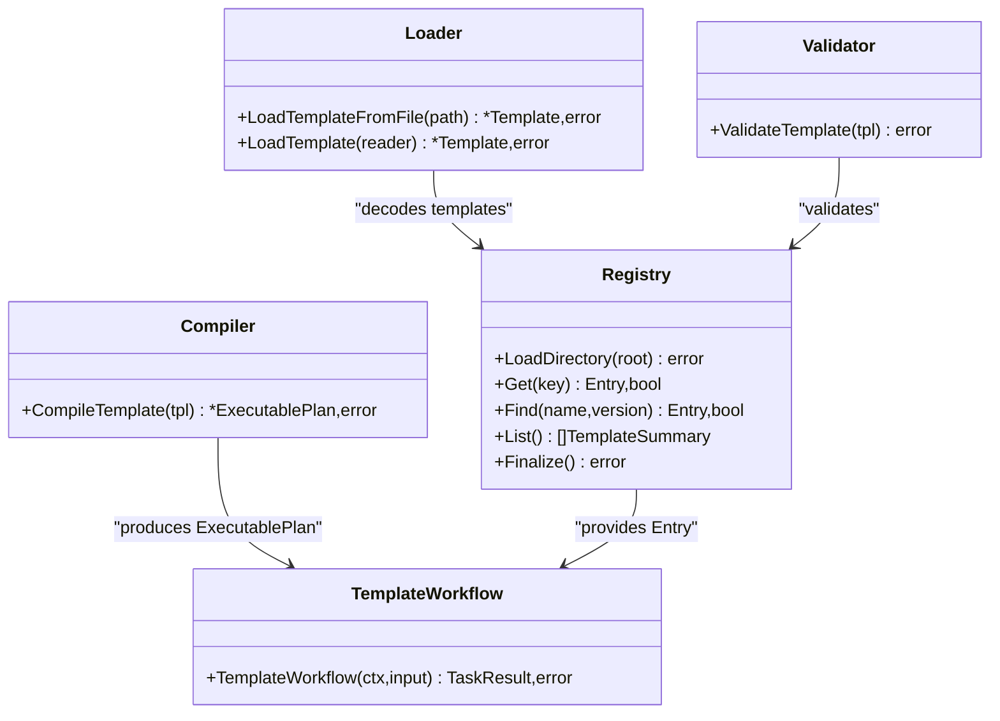

# Template Catalog Management

<cite>
**Referenced Files in This Document**
- [README.md](file://README.md)
- [config/templates/synthesis/README.md](file://config/templates/synthesis/README.md)
- [config/templates/synthesis/_base.tmpl](file://config/templates/synthesis/_base.tmpl)
- [config/templates/synthesis/normal_default.tmpl](file://config/templates/synthesis/normal_default.tmpl)
- [config/templates/synthesis/research_comprehensive.tmpl](file://config/templates/synthesis/research_comprehensive.tmpl)
- [scripts/validate-templates.sh](file://scripts/validate-templates.sh)
- [go/orchestrator/internal/templates/loader.go](file://go/orchestrator/internal/templates/loader.go)
- [go/orchestrator/internal/templates/registry.go](file://go/orchestrator/internal/templates/registry.go)
- [go/orchestrator/internal/templates/validation.go](file://go/orchestrator/internal/templates/validation.go)
- [go/orchestrator/internal/templates/compiler.go](file://go/orchestrator/internal/templates/compiler.go)
- [go/orchestrator/internal/templates/types.go](file://go/orchestrator/internal/templates/types.go)
- [go/orchestrator/internal/activities/synthesis_templates.go](file://go/orchestrator/internal/activities/synthesis_templates.go)
- [go/orchestrator/internal/workflows/template_catalog.go](file://go/orchestrator/internal/workflows/template_catalog.go)
- [go/orchestrator/internal/workflows/template_workflow.go](file://go/orchestrator/internal/workflows/template_workflow.go)
- [go/orchestrator/internal/workflows/template_workflow_test.go](file://go/orchestrator/internal/workflows/template_workflow_test.go)
</cite>

## Table of Contents
1. [Introduction](#introduction)
2. [Project Structure](#project-structure)
3. [Core Components](#core-components)
4. [Architecture Overview](#architecture-overview)
5. [Detailed Component Analysis](#detailed-component-analysis)
6. [Dependency Analysis](#dependency-analysis)
7. [Performance Considerations](#performance-considerations)
8. [Troubleshooting Guide](#troubleshooting-guide)
9. [Conclusion](#conclusion)
10. [Appendices](#appendices)

## Introduction
This document explains template catalog management and distribution in Shannon. It covers the template registry system, catalog organization, and discovery mechanisms; template loading strategies, hot-reloading capabilities, and catalog synchronization; categorization and metadata management; search and validation; lifecycle from creation to deployment; governance and quality assurance; and practical examples for teams.

## Project Structure
Shannon organizes templates into two primary categories:
- Workflow templates: YAML-based, compiled into executable plans and orchestrated by Temporal workflows.
- Synthesis templates: Go text/template files used for prompt synthesis and citation handling.

**Diagram sources**
- [go/orchestrator/internal/workflows/template_catalog.go](file://go/orchestrator/internal/workflows/template_catalog.go#L18-L62)
- [go/orchestrator/internal/workflows/template_workflow.go](file://go/orchestrator/internal/workflows/template_workflow.go#L58-L87)
- [config/templates/synthesis/README.md](file://config/templates/synthesis/README.md#L1-L109)

**Section sources**
- [README.md](file://README.md)
- [config/templates/synthesis/README.md](file://config/templates/synthesis/README.md#L1-L109)

## Core Components
- Template Loader: Reads YAML templates from disk and decodes them into typed structures.
- Template Registry: Loads, validates, merges inheritance, and stores templates in memory with content hashing and timestamps.
- Template Compiler: Validates and compiles templates into deterministic execution plans with topological ordering.
- Template Catalog Manager: Initializes registries from one or more directories and exposes them to workflows.
- Synthesis Template Loader: Loads and caches Go text/template files, with base contract enforcement and selection logic.
- Template Workflow: Executes compiled templates deterministically in Temporal, enforcing content hash verification and emitting structured metadata.

**Section sources**
- [go/orchestrator/internal/templates/loader.go](file://go/orchestrator/internal/templates/loader.go#L11-L42)
- [go/orchestrator/internal/templates/registry.go](file://go/orchestrator/internal/templates/registry.go#L19-L49)
- [go/orchestrator/internal/templates/validation.go](file://go/orchestrator/internal/templates/validation.go#L68-L196)
- [go/orchestrator/internal/templates/compiler.go](file://go/orchestrator/internal/templates/compiler.go#L31-L122)
- [go/orchestrator/internal/workflows/template_catalog.go](file://go/orchestrator/internal/workflows/template_catalog.go#L18-L80)
- [go/orchestrator/internal/activities/synthesis_templates.go](file://go/orchestrator/internal/activities/synthesis_templates.go#L74-L153)
- [go/orchestrator/internal/workflows/template_workflow.go](file://go/orchestrator/internal/workflows/template_workflow.go#L58-L87)

## Architecture Overview
The template catalog pipeline integrates file-based template sources with runtime orchestration:

**Diagram sources**
- [go/orchestrator/internal/templates/loader.go](file://go/orchestrator/internal/templates/loader.go#L11-L42)
- [go/orchestrator/internal/templates/registry.go](file://go/orchestrator/internal/templates/registry.go#L116-L162)
- [go/orchestrator/internal/templates/compiler.go](file://go/orchestrator/internal/templates/compiler.go#L31-L122)
- [go/orchestrator/internal/workflows/template_workflow.go](file://go/orchestrator/internal/workflows/template_workflow.go#L32-L172)

## Detailed Component Analysis

### Template Registry and Catalog Organization
- Directory scanning: Loads all YAML files under configured directories, ignoring non-YAML entries.
- Validation: Performs structural validation and records metrics for validation failures.
- Inheritance resolution: Supports template composition via extends, merging defaults, nodes, edges, and metadata.
- Finalization: Resolves inheritance, re-validates, and cleans up extended references.
- Listing and lookup: Provides summaries, keyed by name@version, with sorting and fuzzy matching for latest versions.

**Diagram sources**
- [go/orchestrator/internal/workflows/template_catalog.go](file://go/orchestrator/internal/workflows/template_catalog.go#L18-L62)
- [go/orchestrator/internal/templates/registry.go](file://go/orchestrator/internal/templates/registry.go#L51-L87)
- [go/orchestrator/internal/templates/registry.go](file://go/orchestrator/internal/templates/registry.go#L219-L242)

**Section sources**
- [go/orchestrator/internal/workflows/template_catalog.go](file://go/orchestrator/internal/workflows/template_catalog.go#L18-L80)
- [go/orchestrator/internal/templates/registry.go](file://go/orchestrator/internal/templates/registry.go#L51-L87)
- [go/orchestrator/internal/templates/registry.go](file://go/orchestrator/internal/templates/registry.go#L116-L162)
- [go/orchestrator/internal/templates/registry.go](file://go/orchestrator/internal/templates/registry.go#L179-L205)
- [go/orchestrator/internal/templates/registry.go](file://go/orchestrator/internal/templates/registry.go#L219-L288)

### Template Discovery and Selection
- Workflow templates: Discovered by scanning directories and keyed by name@version. Lookup supports exact key or latest version by name.
- Synthesis templates: Selected by context signals (explicit template name, workflow type, research flags, style hints). A protected base template enforces citation contracts and reusable partials.

**Diagram sources**
- [go/orchestrator/internal/activities/synthesis_templates.go](file://go/orchestrator/internal/activities/synthesis_templates.go#L171-L228)
- [config/templates/synthesis/README.md](file://config/templates/synthesis/README.md#L5-L31)

**Section sources**
- [go/orchestrator/internal/activities/synthesis_templates.go](file://go/orchestrator/internal/activities/synthesis_templates.go#L171-L228)
- [config/templates/synthesis/README.md](file://config/templates/synthesis/README.md#L5-L31)

### Template Loading Strategies and Hot-Reload
- Workflow templates: Loaded on demand by the catalog initializer; cache cleared via registry reset APIs. Hot-reload is not implemented in the MVP; use process restart or external watchers to refresh.
- Synthesis templates: Loaded lazily on cache miss, cached by name, with a global mutex. Clearing the cache enables hot-reload for synthesis prompts.

**Diagram sources**
- [go/orchestrator/internal/workflows/template_catalog.go](file://go/orchestrator/internal/workflows/template_catalog.go#L18-L62)
- [go/orchestrator/internal/templates/registry.go](file://go/orchestrator/internal/templates/registry.go#L51-L87)
- [go/orchestrator/internal/templates/registry.go](file://go/orchestrator/internal/templates/registry.go#L116-L162)

**Section sources**
- [go/orchestrator/internal/templates/registry.go](file://go/orchestrator/internal/templates/registry.go#L24-L25)
- [go/orchestrator/internal/activities/synthesis_templates.go](file://go/orchestrator/internal/activities/synthesis_templates.go#L230-L236)

### Catalog Synchronization
- Synchronization occurs when initializing registries from directories. Failures are aggregated and surfaced to callers. After successful load, Finalize resolves inheritance and prepares templates for execution.

**Section sources**
- [go/orchestrator/internal/workflows/template_catalog.go](file://go/orchestrator/internal/workflows/template_catalog.go#L18-L62)
- [go/orchestrator/internal/templates/registry.go](file://go/orchestrator/internal/templates/registry.go#L219-L242)

### Template Categorization and Metadata Management
- Workflow templates support:
  - Name, Version, Description, Metadata
  - Defaults: model tier, per-agent budget, approval requirement
  - Nodes: ID, Type, Strategy, BudgetMax, ToolsAllowlist, DependsOn, OnFail, Metadata
  - Edges: explicit graph edges
- Synthesis templates:
  - Protected base contract defines citation handling and reusable partials.
  - Context variables drive synthesis behavior (query, language, citations, style).

**Section sources**
- [go/orchestrator/internal/templates/types.go](file://go/orchestrator/internal/templates/types.go#L24-L77)
- [config/templates/synthesis/_base.tmpl](file://config/templates/synthesis/_base.tmpl#L13-L66)
- [config/templates/synthesis/README.md](file://config/templates/synthesis/README.md#L59-L77)

### Search Functionality
- Registry provides:
  - List(): summaries sorted by name and version
  - Find(name, version): exact match or latest version when version is empty
- CLI-like listing is supported via the registry’s summary listing.

**Section sources**
- [go/orchestrator/internal/templates/registry.go](file://go/orchestrator/internal/templates/registry.go#L97-L114)
- [go/orchestrator/internal/templates/registry.go](file://go/orchestrator/internal/templates/registry.go#L179-L205)

### Template Lifecycle: Creation to Deployment
- Authoring:
  - Workflow templates: define nodes, edges, defaults, metadata; use extends for composition.
  - Synthesis templates: include the base contract and define reusable partials.
- Validation:
  - Structural validation catches missing names, duplicate IDs, invalid node types, budgets, dependencies, cycles, and edge issues.
  - Automated shell script validates YAML syntax and detects duplicates.
- Testing:
  - Unit tests validate compilation, cycle detection, DAG metadata parsing, and validation errors.
- Release:
  - Registry loads templates, computes hashes, and finalizes inheritance.
  - TemplateWorkflow verifies content hash before execution and emits structured metadata.

**Diagram sources**
- [go/orchestrator/internal/templates/validation.go](file://go/orchestrator/internal/templates/validation.go#L68-L196)
- [scripts/validate-templates.sh](file://scripts/validate-templates.sh#L47-L114)
- [go/orchestrator/internal/templates/registry.go](file://go/orchestrator/internal/templates/registry.go#L116-L162)
- [go/orchestrator/internal/templates/registry.go](file://go/orchestrator/internal/templates/registry.go#L219-L242)
- [go/orchestrator/internal/workflows/template_workflow.go](file://go/orchestrator/internal/workflows/template_workflow.go#L58-L87)

**Section sources**
- [go/orchestrator/internal/templates/validation.go](file://go/orchestrator/internal/templates/validation.go#L68-L196)
- [scripts/validate-templates.sh](file://scripts/validate-templates.sh#L47-L114)
- [go/orchestrator/internal/workflows/template_workflow_test.go](file://go/orchestrator/internal/workflows/template_workflow_test.go#L12-L76)
- [go/orchestrator/internal/workflows/template_workflow.go](file://go/orchestrator/internal/workflows/template_workflow.go#L58-L87)

### Examples: Managing Collections, Sharing, Governance
- Managing collections:
  - Organize templates under team-specific directories under the workflows catalog. Use extends to compose common defaults and nodes.
- Sharing across teams:
  - Publish shared templates under a common path; consumers reference by name@version. Use Find(name, "") to resolve latest.
- Governance:
  - Enforce naming/versioning discipline and disallow cycles. Use validation and duplication checks in CI.
  - Synthesis templates enforce a protected base contract to maintain consistent citation handling across teams.

**Section sources**
- [go/orchestrator/internal/templates/registry.go](file://go/orchestrator/internal/templates/registry.go#L179-L205)
- [config/templates/synthesis/_base.tmpl](file://config/templates/synthesis/_base.tmpl#L13-L46)
- [scripts/validate-templates.sh](file://scripts/validate-templates.sh#L91-L114)

### Template Documentation Standards and Version Control Integration
- Documentation standards:
  - Include name, version, description, defaults, nodes, edges, and metadata in YAML templates.
  - Synthesis templates must include the base contract and clearly document variables and behavior.
- Version control integration:
  - Use name@version keys to track changes; leverage git tags/releases for template versions.
  - Automate validation in CI to prevent invalid or duplicate templates from being merged.

**Section sources**
- [go/orchestrator/internal/templates/types.go](file://go/orchestrator/internal/templates/types.go#L24-L77)
- [config/templates/synthesis/README.md](file://config/templates/synthesis/README.md#L59-L109)
- [scripts/validate-templates.sh](file://scripts/validate-templates.sh#L72-L114)

### Automated Testing Workflows for Quality Assurance
- Unit tests:
  - Validate compilation, cycle detection, DAG tasks parsing, and validation errors.
- Shell validation:
  - Script checks YAML syntax and duplicates across the workflows catalog.

**Section sources**
- [go/orchestrator/internal/workflows/template_workflow_test.go](file://go/orchestrator/internal/workflows/template_workflow_test.go#L12-L167)
- [scripts/validate-templates.sh](file://scripts/validate-templates.sh#L47-L114)

## Dependency Analysis
Template runtime dependencies and relationships:

**Diagram sources**
- [go/orchestrator/internal/templates/registry.go](file://go/orchestrator/internal/templates/registry.go#L51-L87)
- [go/orchestrator/internal/templates/loader.go](file://go/orchestrator/internal/templates/loader.go#L11-L42)
- [go/orchestrator/internal/templates/validation.go](file://go/orchestrator/internal/templates/validation.go#L68-L196)
- [go/orchestrator/internal/templates/compiler.go](file://go/orchestrator/internal/templates/compiler.go#L31-L122)
- [go/orchestrator/internal/workflows/template_workflow.go](file://go/orchestrator/internal/workflows/template_workflow.go#L32-L172)

**Section sources**
- [go/orchestrator/internal/templates/registry.go](file://go/orchestrator/internal/templates/registry.go#L19-L49)
- [go/orchestrator/internal/templates/compiler.go](file://go/orchestrator/internal/templates/compiler.go#L31-L122)
- [go/orchestrator/internal/workflows/template_workflow.go](file://go/orchestrator/internal/workflows/template_workflow.go#L32-L172)

## Performance Considerations
- Template loading:
  - Registry scans directories and decodes YAML; consider batching loads and avoiding redundant scans.
- Compilation:
  - Topological sort and adjacency building are O(V+E); keep templates reasonably sized.
- Execution:
  - TemplateWorkflow executes deterministically; ensure node budgets and strategies align with cost targets.
- Synthesis templates:
  - Cache reduces repeated disk reads; clearing cache enables hot-reload for development.

[No sources needed since this section provides general guidance]

## Troubleshooting Guide
- Template load errors:
  - Directory not found or not a directory; non-YAML files ignored; failures aggregated.
- Validation errors:
  - Missing name, duplicate node IDs, unknown node types, invalid budgets, cycles, unknown dependencies, or edge issues.
- Execution mismatches:
  - Template hash mismatch indicates content drift; recompile and redeploy the template.
- Synthesis template issues:
  - Base contract violations or missing named templates; verify context flags and overrides.

**Section sources**
- [go/orchestrator/internal/workflows/template_catalog.go](file://go/orchestrator/internal/workflows/template_catalog.go#L22-L61)
- [go/orchestrator/internal/templates/validation.go](file://go/orchestrator/internal/templates/validation.go#L68-L196)
- [go/orchestrator/internal/workflows/template_workflow.go](file://go/orchestrator/internal/workflows/template_workflow.go#L64-L70)
- [go/orchestrator/internal/activities/synthesis_templates.go](file://go/orchestrator/internal/activities/synthesis_templates.go#L100-L141)

## Conclusion
Shannon’s template catalog system combines robust YAML-based workflow templates with a protected synthesis template contract. The registry provides discovery, validation, composition, and deterministic execution, while synthesis templates ensure consistent citation handling. With clear governance, automated validation, and deterministic workflows, teams can safely manage, share, and evolve templates at scale.

[No sources needed since this section summarizes without analyzing specific files]

## Appendices

### Appendix A: Template Types and Execution Model
- Workflow template types and node types are defined and validated.
- ExecutablePlan encodes deterministic execution order and adjacency.

**Section sources**
- [go/orchestrator/internal/templates/types.go](file://go/orchestrator/internal/templates/types.go#L3-L22)
- [go/orchestrator/internal/templates/compiler.go](file://go/orchestrator/internal/templates/compiler.go#L20-L122)

### Appendix B: Synthesis Template Contract
- Base template defines system contract and reusable partials for citation handling and language instructions.
- Example synthesis templates demonstrate comprehensive and concise styles.

**Section sources**
- [config/templates/synthesis/_base.tmpl](file://config/templates/synthesis/_base.tmpl#L13-L143)
- [config/templates/synthesis/normal_default.tmpl](file://config/templates/synthesis/normal_default.tmpl#L1-L45)
- [config/templates/synthesis/research_comprehensive.tmpl](file://config/templates/synthesis/research_comprehensive.tmpl#L1-L130)