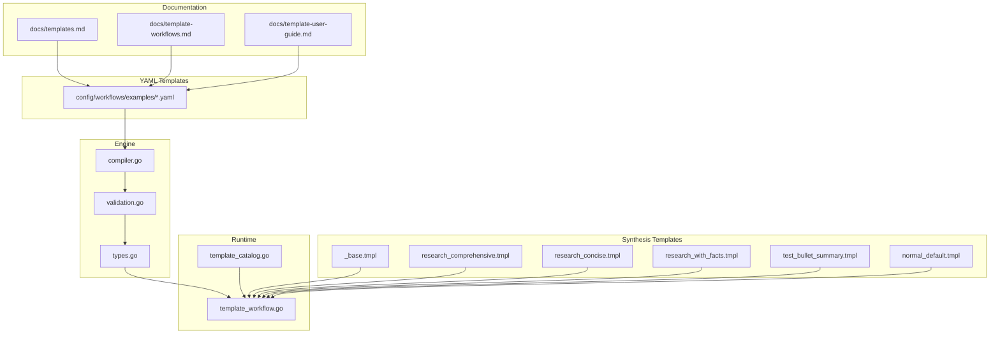
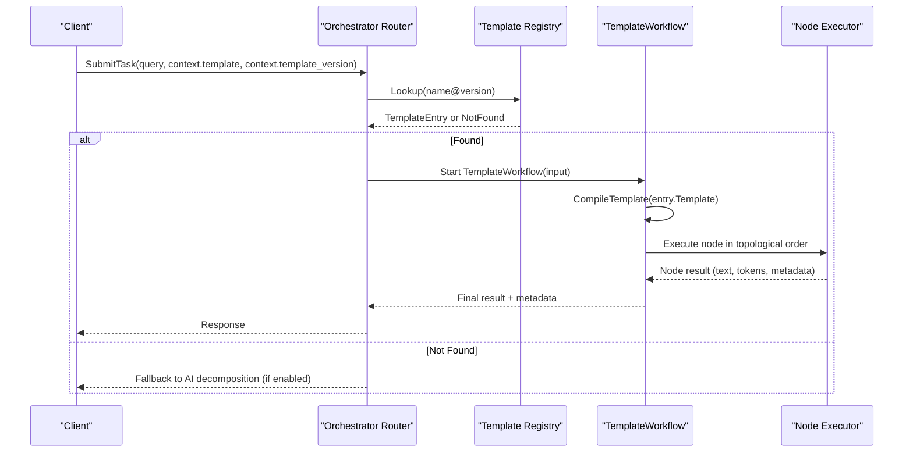
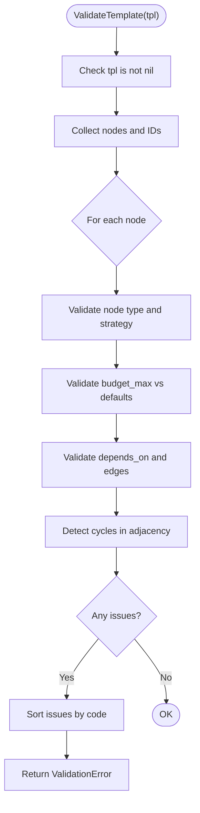
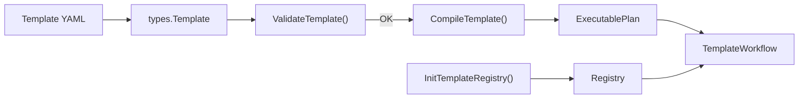

# Template Development

<cite>
**Referenced Files in This Document**
- [templates.md](file://docs/templates.md)
- [template-workflows.md](file://docs/template-workflows.md)
- [template-user-guide.md](file://docs/template-user-guide.md)
- [_base.tmpl](file://config/templates/synthesis/_base.tmpl)
- [research_comprehensive.tmpl](file://config/templates/synthesis/research_comprehensive.tmpl)
- [research_concise.tmpl](file://config/templates/synthesis/research_concise.tmpl)
- [research_with_facts.tmpl](file://config/templates/synthesis/research_with_facts.tmpl)
- [test_bullet_summary.tmpl](file://config/templates/synthesis/test_bullet_summary.tmpl)
- [normal_default.tmpl](file://config/templates/synthesis/normal_default.tmpl)
- [compiler.go](file://go/orchestrator/internal/templates/compiler.go)
- [validation.go](file://go/orchestrator/internal/templates/validation.go)
- [types.go](file://go/orchestrator/internal/templates/types.go)
- [template_workflow.go](file://go/orchestrator/internal/workflows/template_workflow.go)
- [template_catalog.go](file://go/orchestrator/internal/workflows/template_catalog.go)
</cite>

## Table of Contents
1. [Introduction](#introduction)
2. [Project Structure](#project-structure)
3. [Core Components](#core-components)
4. [Architecture Overview](#architecture-overview)
5. [Detailed Component Analysis](#detailed-component-analysis)
6. [Dependency Analysis](#dependency-analysis)
7. [Performance Considerations](#performance-considerations)
8. [Troubleshooting Guide](#troubleshooting-guide)
9. [Conclusion](#conclusion)
10. [Appendices](#appendices)

## Introduction
This document explains how to develop, compose, and manage templates in Shannon’s workflow system. It covers template syntax and structure, compilation and validation, parameter substitution and context propagation, conditional logic patterns, and practical examples for research, synthesis, and custom cognitive workflows. It also documents inheritance and reuse, versioning and backward compatibility, and enterprise-grade migration strategies.

## Project Structure
Shannon separates user-facing template documentation from the internal template engine and execution runtime:
- User documentation describes template YAML structure, best practices, and examples.
- Synthesis templates are Jinja-style templates that define system prompts and synthesis behavior.
- The Go engine compiles YAML templates into executable plans, validates them, and executes them deterministically in workflows.

**Diagram sources**
- [templates.md](file://docs/templates.md#L1-L389)
- [template-workflows.md](file://docs/template-workflows.md#L1-L573)
- [template-user-guide.md](file://docs/template-user-guide.md#L1-L71)
- [_base.tmpl](file://config/templates/synthesis/_base.tmpl#L1-L143)
- [research_comprehensive.tmpl](file://config/templates/synthesis/research_comprehensive.tmpl#L1-L130)
- [research_concise.tmpl](file://config/templates/synthesis/research_concise.tmpl#L1-L69)
- [research_with_facts.tmpl](file://config/templates/synthesis/research_with_facts.tmpl#L1-L128)
- [test_bullet_summary.tmpl](file://config/templates/synthesis/test_bullet_summary.tmpl#L1-L44)
- [normal_default.tmpl](file://config/templates/synthesis/normal_default.tmpl#L1-L45)
- [compiler.go](file://go/orchestrator/internal/templates/compiler.go#L1-L172)
- [validation.go](file://go/orchestrator/internal/templates/validation.go#L1-L256)
- [types.go](file://go/orchestrator/internal/templates/types.go#L1-L77)
- [template_workflow.go](file://go/orchestrator/internal/workflows/template_workflow.go#L1-L851)
- [template_catalog.go](file://go/orchestrator/internal/workflows/template_catalog.go#L1-L81)

**Section sources**
- [templates.md](file://docs/templates.md#L1-L389)
- [template-workflows.md](file://docs/template-workflows.md#L1-L573)
- [template-user-guide.md](file://docs/template-user-guide.md#L1-L71)

## Core Components
- Template YAML: Defines nodes, edges, defaults, and optional inheritance via extends.
- Synthesis templates: Jinja-style templates that enforce system contracts, citation handling, and output formatting.
- Engine: Validates and compiles YAML into an ExecutablePlan, builds a topological order, and enforces DAG acyclicity.
- Runtime: Executes nodes deterministically, applies budget-based pattern degradation, and aggregates metadata and tokens.

Key implementation references:
- Template types and structures: [types.go](file://go/orchestrator/internal/templates/types.go#L24-L77)
- Validation rules and error model: [validation.go](file://go/orchestrator/internal/templates/validation.go#L68-L196)
- Compilation and topological sort: [compiler.go](file://go/orchestrator/internal/templates/compiler.go#L31-L152)
- Template execution workflow: [template_workflow.go](file://go/orchestrator/internal/workflows/template_workflow.go#L31-L172)

**Section sources**
- [types.go](file://go/orchestrator/internal/templates/types.go#L1-L77)
- [validation.go](file://go/orchestrator/internal/templates/validation.go#L1-L256)
- [compiler.go](file://go/orchestrator/internal/templates/compiler.go#L1-L172)
- [template_workflow.go](file://go/orchestrator/internal/workflows/template_workflow.go#L1-L851)

## Architecture Overview
Shannon’s template system sits behind the Orchestrator Router. The router selects a deterministic template execution (System 1) when available, otherwise falls back to AI decomposition (System 2). Templates are version-gated and executed deterministically within Temporal workflows.

**Diagram sources**
- [template_workflow.go](file://go/orchestrator/internal/workflows/template_workflow.go#L31-L172)
- [template_catalog.go](file://go/orchestrator/internal/workflows/template_catalog.go#L18-L81)
- [compiler.go](file://go/orchestrator/internal/templates/compiler.go#L31-L122)

## Detailed Component Analysis

### Template Syntax and Structure
- Template YAML fields:
  - name, description, version
  - defaults: model_tier, budget_agent_max, require_approval
  - nodes: id, type, strategy, budget_max, tools_allowlist, depends_on, on_fail, metadata
  - edges: explicit from/to relationships
  - metadata: free-form for advanced features
- Node types:
  - simple: single-task, direct tool invocation
  - cognitive: multi-step reasoning with automatic budget-based degradation
  - dag: parallel tasks with dependency graphs
  - supervisor: coordinates child workflows
- Strategy types:
  - react, chain_of_thought, tree_of_thoughts, debate, reflection

References:
- Basic YAML structure and node types: [templates.md](file://docs/templates.md#L120-L170)
- Strategy types and degradation: [template-workflows.md](file://docs/template-workflows.md#L182-L242)

**Section sources**
- [templates.md](file://docs/templates.md#L120-L170)
- [template-workflows.md](file://docs/template-workflows.md#L182-L242)

### Template Inheritance and Reuse
- Use extends to inherit defaults, nodes, edges, and metadata from parent templates.
- Parents are merged in listed order; derived template edges replace parent edges unless explicitly redefined.
- Use Finalize() during registry initialization to validate merged templates.

References:
- Inheritance and merging behavior: [template-workflows.md](file://docs/template-workflows.md#L148-L181)
- Registry loading and finalization: [template_catalog.go](file://go/orchestrator/internal/workflows/template_catalog.go#L18-L62)

**Section sources**
- [template-workflows.md](file://docs/template-workflows.md#L148-L181)
- [template_catalog.go](file://go/orchestrator/internal/workflows/template_catalog.go#L18-L62)

### Parameter Substitution and Context Propagation
- Node-level metadata merges into the node execution context.
- Context keys passed to downstream nodes include template_node_id, template_node_type, and template_results.
- Query can be overridden per node via metadata.query.
- Model tier can be overridden per node via metadata.model_tier.

References:
- Context merging and node execution: [template_workflow.go](file://go/orchestrator/internal/workflows/template_workflow.go#L229-L250)
- Query override and model tier resolution: [template_workflow.go](file://go/orchestrator/internal/workflows/template_workflow.go#L252-L521)

**Section sources**
- [template_workflow.go](file://go/orchestrator/internal/workflows/template_workflow.go#L229-L521)

### Conditional Logic Implementation
- Conditional rendering in synthesis templates uses Go template conditionals (e.g., if/else) to adapt citation handling, language instructions, and output structure.
- Examples:
  - Citation handling toggles based on CitationAgentEnabled.
  - Language instruction inclusion depends on presence of language context.
  - Coverage checklist adapts to whether citations are available.

References:
- Base synthesis contract and conditionals: [_base.tmpl](file://config/templates/synthesis/_base.tmpl#L13-L143)
- Research templates with conditionals: [research_comprehensive.tmpl](file://config/templates/synthesis/research_comprehensive.tmpl#L1-L130), [research_concise.tmpl](file://config/templates/synthesis/research_concise.tmpl#L1-L69), [research_with_facts.tmpl](file://config/templates/synthesis/research_with_facts.tmpl#L1-L128)
- Test template with conditional formatting: [test_bullet_summary.tmpl](file://config/templates/synthesis/test_bullet_summary.tmpl#L1-L44)

**Section sources**
- [_base.tmpl](file://config/templates/synthesis/_base.tmpl#L1-L143)
- [research_comprehensive.tmpl](file://config/templates/synthesis/research_comprehensive.tmpl#L1-L130)
- [research_concise.tmpl](file://config/templates/synthesis/research_concise.tmpl#L1-L69)
- [research_with_facts.tmpl](file://config/templates/synthesis/research_with_facts.tmpl#L1-L128)
- [test_bullet_summary.tmpl](file://config/templates/synthesis/test_bullet_summary.tmpl#L1-L44)

### Template Compilation and Validation
- Compilation:
  - Converts YAML Template into ExecutablePlan.
  - Builds adjacency lists and computes topological order.
  - Enforces DAG acyclicity and edge validity.
- Validation:
  - Structural checks: required fields, valid YAML.
  - DAG checks: no cycles, valid dependencies.
  - Budget checks: node budgets ≤ defaults.
  - Tool checks: tools exist in registry.
  - Reference checks: variables resolve.

References:
- Compilation pipeline: [compiler.go](file://go/orchestrator/internal/templates/compiler.go#L31-L152)
- Validation rules and error model: [validation.go](file://go/orchestrator/internal/templates/validation.go#L68-L196)
- Data structures: [types.go](file://go/orchestrator/internal/templates/types.go#L24-L77)

**Diagram sources**
- [validation.go](file://go/orchestrator/internal/templates/validation.go#L68-L196)

**Section sources**
- [compiler.go](file://go/orchestrator/internal/templates/compiler.go#L31-L152)
- [validation.go](file://go/orchestrator/internal/templates/validation.go#L68-L196)
- [types.go](file://go/orchestrator/internal/templates/types.go#L24-L77)

### Template Execution and Pattern Degradation
- Deterministic execution: nodes run in topological order.
- Cognitive nodes apply automatic budget-based degradation (e.g., Tree of Thoughts → Chain of Thought → ReAct).
- Context propagation: node results are aggregated and passed to subsequent nodes.

References:
- Execution loop and node dispatch: [template_workflow.go](file://go/orchestrator/internal/workflows/template_workflow.go#L31-L172)
- Cognitive degradation and context: [template_workflow.go](file://go/orchestrator/internal/workflows/template_workflow.go#L294-L368)

**Section sources**
- [template_workflow.go](file://go/orchestrator/internal/workflows/template_workflow.go#L31-L172)
- [template_workflow.go](file://go/orchestrator/internal/workflows/template_workflow.go#L294-L368)

### Practical Examples

#### Research Summary Template
- Purpose: Discover → Expand → Synthesize with sequential dependencies.
- Structure: Three nodes with increasing budget and strategy complexity.
- Edges: Define DAG ordering.

References:
- Example definition: [template-workflows.md](file://docs/template-workflows.md#L317-L354)

**Section sources**
- [template-workflows.md](file://docs/template-workflows.md#L317-L354)

#### Complex DAG Workflow
- Purpose: Parallel competitor analysis plus synthesis.
- Structure: DAG node with multiple tasks and supervisor aggregation.

References:
- Example definition: [template-workflows.md](file://docs/template-workflows.md#L355-L392)

**Section sources**
- [template-workflows.md](file://docs/template-workflows.md#L355-L392)

#### Derived Template: Enterprise Research
- Purpose: Extend base research with higher budgets, approvals, and specialized metadata.

References:
- Example definition: [template-workflows.md](file://docs/template-workflows.md#L393-L416)

**Section sources**
- [template-workflows.md](file://docs/template-workflows.md#L393-L416)

#### Playbook Workflow with Compliance
- Purpose: Add compliance review and templated reporting after synthesis.

References:
- Example definition: [template-workflows.md](file://docs/template-workflows.md#L417-L444)

**Section sources**
- [template-workflows.md](file://docs/template-workflows.md#L417-L444)

### Synthesis Templates: Composition Patterns
- System contract: Ensures consistent citation handling and output structure.
- Reusable partials: Citation handling and coverage checklist.
- Style variations: Comprehensive, concise, facts appendix, default synthesis, and test bullet summary.

References:
- Base contract and partials: [_base.tmpl](file://config/templates/synthesis/_base.tmpl#L1-L143)
- Comprehensive research: [research_comprehensive.tmpl](file://config/templates/synthesis/research_comprehensive.tmpl#L1-L130)
- Concise research: [research_concise.tmpl](file://config/templates/synthesis/research_concise.tmpl#L1-L69)
- Facts appendix: [research_with_facts.tmpl](file://config/templates/synthesis/research_with_facts.tmpl#L1-L128)
- Default synthesis: [normal_default.tmpl](file://config/templates/synthesis/normal_default.tmpl#L1-L45)
- Test bullet summary: [test_bullet_summary.tmpl](file://config/templates/synthesis/test_bullet_summary.tmpl#L1-L44)

**Section sources**
- [_base.tmpl](file://config/templates/synthesis/_base.tmpl#L1-L143)
- [research_comprehensive.tmpl](file://config/templates/synthesis/research_comprehensive.tmpl#L1-L130)
- [research_concise.tmpl](file://config/templates/synthesis/research_concise.tmpl#L1-L69)
- [research_with_facts.tmpl](file://config/templates/synthesis/research_with_facts.tmpl#L1-L128)
- [normal_default.tmpl](file://config/templates/synthesis/normal_default.tmpl#L1-L45)
- [test_bullet_summary.tmpl](file://config/templates/synthesis/test_bullet_summary.tmpl#L1-L44)

## Dependency Analysis
- Template YAML → ExecutablePlan: Compiled by the engine, validated by validation rules.
- ExecutablePlan → Runtime: Executed deterministically in TemplateWorkflow.
- Registry: Loads templates from configured directories and finalizes them before use.

**Diagram sources**
- [types.go](file://go/orchestrator/internal/templates/types.go#L24-L77)
- [validation.go](file://go/orchestrator/internal/templates/validation.go#L68-L196)
- [compiler.go](file://go/orchestrator/internal/templates/compiler.go#L31-L122)
- [template_workflow.go](file://go/orchestrator/internal/workflows/template_workflow.go#L31-L172)
- [template_catalog.go](file://go/orchestrator/internal/workflows/template_catalog.go#L18-L62)

**Section sources**
- [types.go](file://go/orchestrator/internal/templates/types.go#L1-L77)
- [validation.go](file://go/orchestrator/internal/templates/validation.go#L1-L256)
- [compiler.go](file://go/orchestrator/internal/templates/compiler.go#L1-L172)
- [template_workflow.go](file://go/orchestrator/internal/workflows/template_workflow.go#L1-L851)
- [template_catalog.go](file://go/orchestrator/internal/workflows/template_catalog.go#L1-L81)

## Performance Considerations
- Prefer small, deterministic nodes and minimize sequential dependencies to enable parallelism.
- Use DAG nodes for independent tasks and supervisors for orchestration.
- Set realistic budgets; rely on automatic pattern degradation to reduce token usage.
- Restrict tools per node to reduce overhead.
- Monitor token usage and degradation frequency to tune budgets and strategies.

[No sources needed since this section provides general guidance]

## Troubleshooting Guide
Common issues and remedies:
- Templates not loading:
  - Verify TEMPLATES_PATH environment variable and YAML syntax.
  - Check orchestrator logs for validation errors.
- Budget exceeded:
  - Rebalance node budgets; rely on automatic pattern degradation.
  - Review DAG for unnecessary sequential dependencies.
- Poor learning router performance:
  - Adjust exploration rate and confidence thresholds.
- Enable debug logging:
  - Set DEBUG_TEMPLATES and LOG_LEVEL, then inspect orchestrator logs.

References:
- Troubleshooting steps: [templates.md](file://docs/templates.md#L356-L389), [template-workflows.md](file://docs/template-workflows.md#L524-L556)

**Section sources**
- [templates.md](file://docs/templates.md#L356-L389)
- [template-workflows.md](file://docs/template-workflows.md#L524-L556)

## Conclusion
Shannon’s template system provides a robust, deterministic way to encode common workflows and synthesis patterns. By combining YAML-based template definitions with a powerful engine that validates, compiles, and executes them deterministically, teams can achieve predictable performance, strong versioning guarantees, and maintainable, reusable patterns. Synthesis templates further enhance consistency and quality by enforcing system contracts and conditional logic.

[No sources needed since this section summarizes without analyzing specific files]

## Appendices

### API and Execution Reference
- Registration and listing:
  - Load templates from directories and finalize the registry.
  - Retrieve specific templates and list all entries.
- Execution:
  - Submit tasks with context.template and context.template_version.
  - Optionally disable AI to enforce deterministic execution.

References:
- Registration and listing APIs: [template-workflows.md](file://docs/template-workflows.md#L470-L484)
- Execution API usage: [template-workflows.md](file://docs/template-workflows.md#L485-L494), [templates.md](file://docs/templates.md#L330-L353)

**Section sources**
- [template-workflows.md](file://docs/template-workflows.md#L470-L494)
- [templates.md](file://docs/templates.md#L330-L353)

### Versioning, Backward Compatibility, and Migration
- Version-gating:
  - Templates are identified by name@version; workflows are versioned to ensure backward compatibility.
- Migration strategies:
  - Convert repeated patterns into templates.
  - Test locally, monitor token usage, and iterate.
  - Use rollback strategies via workflow version checks.

References:
- Versioning and rollback guidance: [template-workflows.md](file://docs/template-workflows.md#L500-L523)

**Section sources**
- [template-workflows.md](file://docs/template-workflows.md#L500-L523)