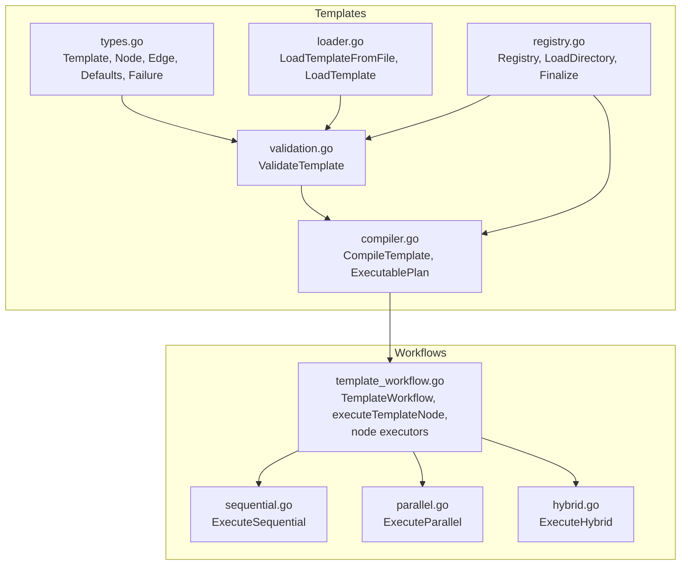
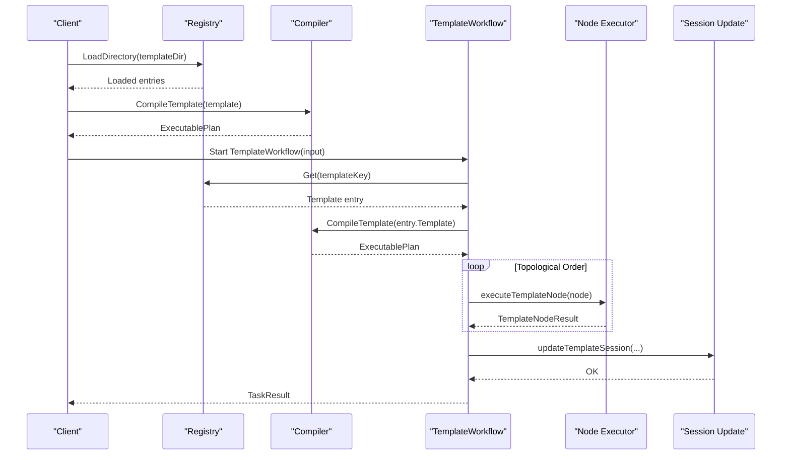
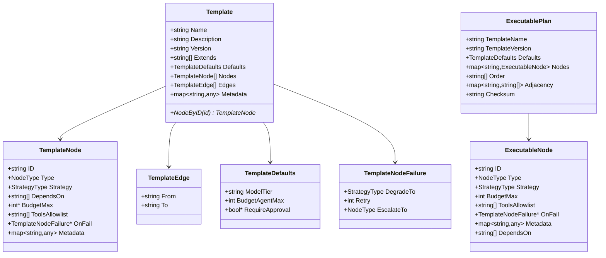
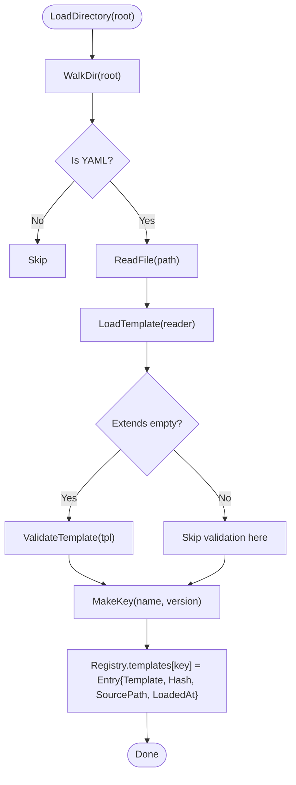
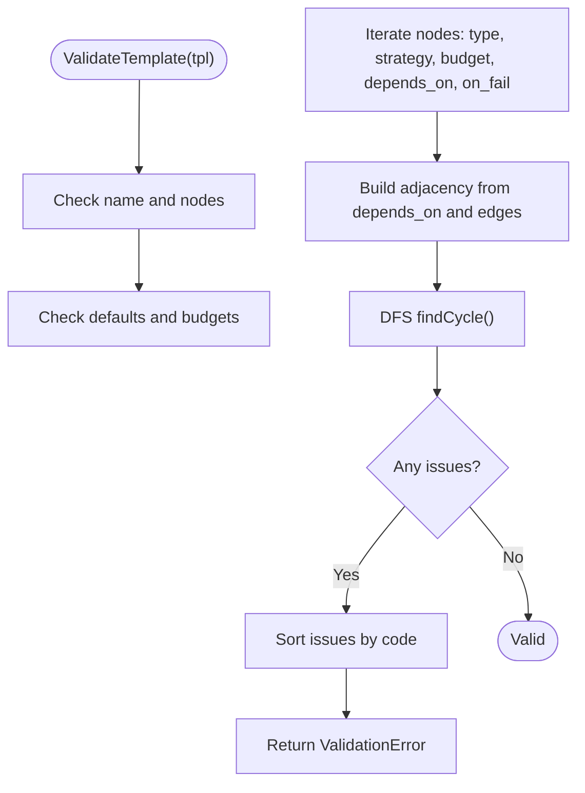
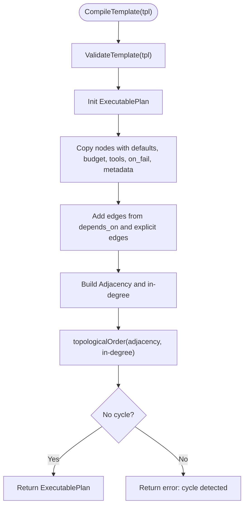
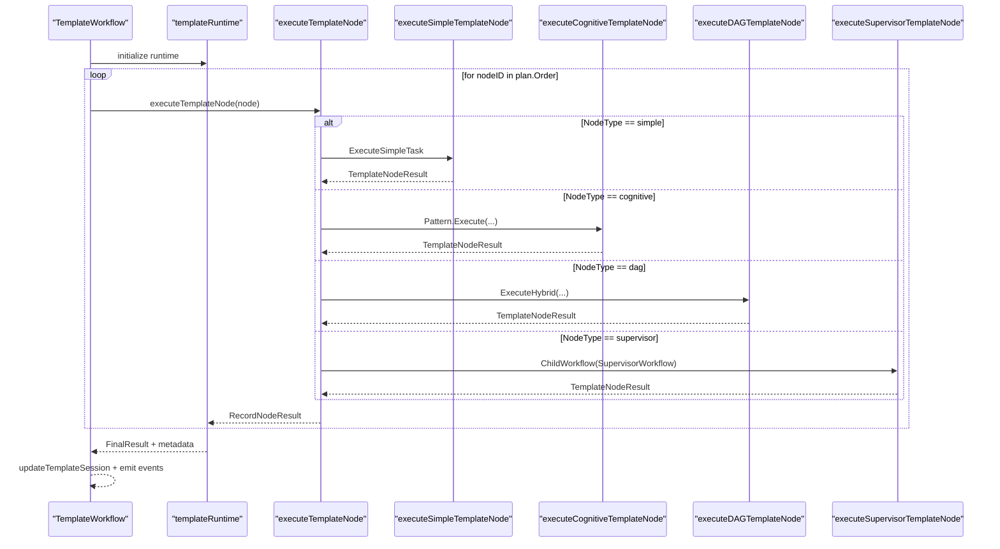
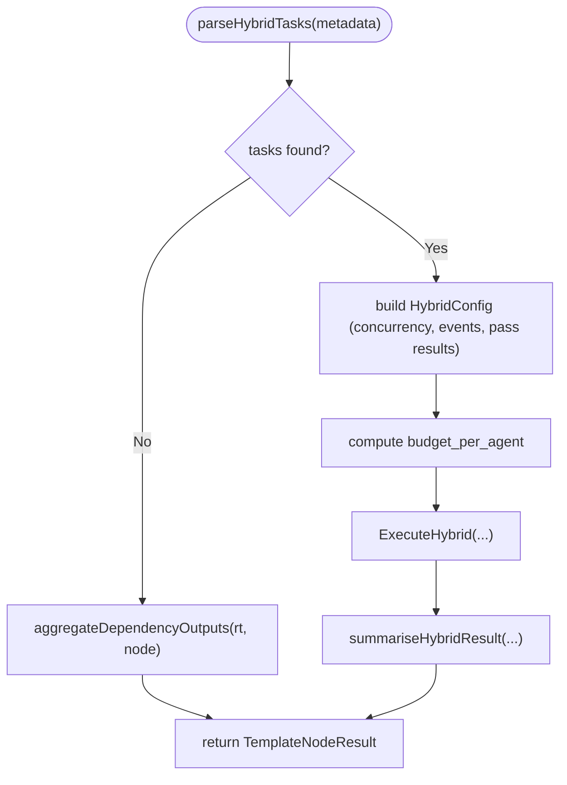
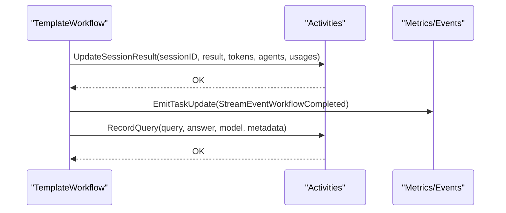
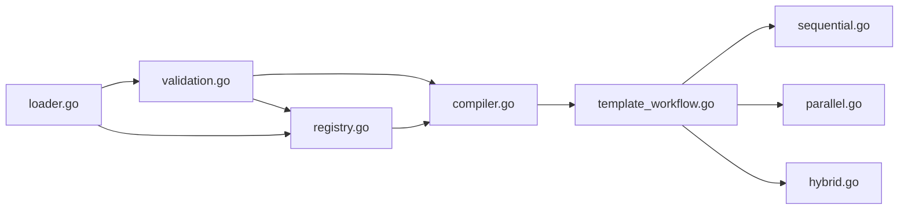

# Template Execution Engine

<cite>
**Referenced Files in This Document**
- [types.go](file://go/orchestrator/internal/templates/types.go)
- [compiler.go](file://go/orchestrator/internal/templates/compiler.go)
- [validation.go](file://go/orchestrator/internal/templates/validation.go)
- [loader.go](file://go/orchestrator/internal/templates/loader.go)
- [registry.go](file://go/orchestrator/internal/templates/registry.go)
- [template_workflow.go](file://go/orchestrator/internal/workflows/template_workflow.go)
- [sequential.go](file://go/orchestrator/internal/workflows/patterns/execution/sequential.go)
- [parallel.go](file://go/orchestrator/internal/workflows/patterns/execution/parallel.go)
- [hybrid.go](file://go/orchestrator/internal/workflows/patterns/execution/hybrid.go)
</cite>

## Table of Contents
1. [Introduction](#introduction)
2. [Project Structure](#project-structure)
3. [Core Components](#core-components)
4. [Architecture Overview](#architecture-overview)
5. [Detailed Component Analysis](#detailed-component-analysis)
6. [Dependency Analysis](#dependency-analysis)
7. [Performance Considerations](#performance-considerations)
8. [Troubleshooting Guide](#troubleshooting-guide)
9. [Conclusion](#conclusion)

## Introduction
This document describes the template execution engine that powers workflow automation in Shannon. It explains the template runtime architecture, node execution strategies, and workflow orchestration patterns. It documents the template registry system, template loading mechanisms, and execution context management. It covers different node types (simple, cognitive, DAG, supervisor) and their execution behaviors, details the template compilation pipeline, executable plan generation, and runtime parameter resolution, and provides examples of template execution flow, error handling, performance optimization, template session management, state persistence, and execution monitoring.

## Project Structure
The template execution engine spans two primary areas:
- Template definition, validation, compilation, and registry
- Workflow orchestration that executes compiled templates with deterministic node strategies

**Diagram sources**
- [types.go](file://go/orchestrator/internal/templates/types.go#L24-L76)
- [loader.go](file://go/orchestrator/internal/templates/loader.go#L11-L42)
- [validation.go](file://go/orchestrator/internal/templates/validation.go#L68-L196)
- [compiler.go](file://go/orchestrator/internal/templates/compiler.go#L31-L122)
- [registry.go](file://go/orchestrator/internal/templates/registry.go#L51-L162)
- [template_workflow.go](file://go/orchestrator/internal/workflows/template_workflow.go#L31-L172)
- [sequential.go](file://go/orchestrator/internal/workflows/patterns/execution/sequential.go#L47-L395)
- [parallel.go](file://go/orchestrator/internal/workflows/patterns/execution/parallel.go#L48-L450)
- [hybrid.go](file://go/orchestrator/internal/workflows/patterns/execution/hybrid.go#L45-L161)

**Section sources**
- [types.go](file://go/orchestrator/internal/templates/types.go#L1-L77)
- [compiler.go](file://go/orchestrator/internal/templates/compiler.go#L1-L172)
- [validation.go](file://go/orchestrator/internal/templates/validation.go#L1-L256)
- [loader.go](file://go/orchestrator/internal/templates/loader.go#L1-L43)
- [registry.go](file://go/orchestrator/internal/templates/registry.go#L1-L478)
- [template_workflow.go](file://go/orchestrator/internal/workflows/template_workflow.go#L1-L851)
- [sequential.go](file://go/orchestrator/internal/workflows/patterns/execution/sequential.go#L1-L475)
- [parallel.go](file://go/orchestrator/internal/workflows/patterns/execution/parallel.go#L1-L520)
- [hybrid.go](file://go/orchestrator/internal/workflows/patterns/execution/hybrid.go#L1-L408)

## Core Components
- Template data model: nodes, edges, defaults, and failure policies
- Validation: structural and semantic checks, cycle detection
- Compilation: transform validated templates into deterministic executable plans
- Registry: load, deduplicate, merge inheritance, and serve templates
- Workflow orchestration: compile plan, resolve runtime context, execute nodes, aggregate results, update sessions, and emit events

**Section sources**
- [types.go](file://go/orchestrator/internal/templates/types.go#L24-L76)
- [validation.go](file://go/orchestrator/internal/templates/validation.go#L68-L196)
- [compiler.go](file://go/orchestrator/internal/templates/compiler.go#L31-L122)
- [registry.go](file://go/orchestrator/internal/templates/registry.go#L51-L162)
- [template_workflow.go](file://go/orchestrator/internal/workflows/template_workflow.go#L31-L172)

## Architecture Overview
The engine follows a layered design:
- Templates define workflows as YAML with nodes and edges
- Validation ensures correctness and acyclicity
- Compilation builds an ExecutablePlan with adjacency, in-degree, and topological order
- Registry manages template lifecycle and inheritance composition
- Workflow orchestrator executes nodes deterministically, applying strategies and managing context, budgets, and session updates

**Diagram sources**
- [registry.go](file://go/orchestrator/internal/templates/registry.go#L51-L162)
- [compiler.go](file://go/orchestrator/internal/templates/compiler.go#L31-L122)
- [template_workflow.go](file://go/orchestrator/internal/workflows/template_workflow.go#L31-L172)
- [sequential.go](file://go/orchestrator/internal/workflows/patterns/execution/sequential.go#L47-L395)
- [parallel.go](file://go/orchestrator/internal/workflows/patterns/execution/parallel.go#L48-L450)
- [hybrid.go](file://go/orchestrator/internal/workflows/patterns/execution/hybrid.go#L45-L161)

## Detailed Component Analysis

### Template Data Model and Types
- Node types: simple, cognitive, DAG, supervisor
- Strategy types: react, chain_of_thought, tree_of_thoughts, debate, reflection
- Template structure includes defaults, nodes, edges, metadata
- Node-level failure policy supports degrade-to strategy, retry count, escalate-to node type

**Diagram sources**
- [types.go](file://go/orchestrator/internal/templates/types.go#L24-L76)
- [compiler.go](file://go/orchestrator/internal/templates/compiler.go#L8-L29)

**Section sources**
- [types.go](file://go/orchestrator/internal/templates/types.go#L3-L11)
- [types.go](file://go/orchestrator/internal/templates/types.go#L13-L22)
- [types.go](file://go/orchestrator/internal/templates/types.go#L24-L76)
- [compiler.go](file://go/orchestrator/internal/templates/compiler.go#L8-L29)

### Template Loading and Registry
- LoadDirectory walks a directory, filters YAML files, and loads each template
- LoadTemplateFromFile and LoadTemplate decode YAML into Template structs
- Registry stores entries keyed by normalized name@version, tracks content hash, and supports listing and lookup
- Finalize resolves inheritance chains and merges overlays into base templates, validating after composition

**Diagram sources**
- [registry.go](file://go/orchestrator/internal/templates/registry.go#L51-L162)
- [loader.go](file://go/orchestrator/internal/templates/loader.go#L11-L42)
- [validation.go](file://go/orchestrator/internal/templates/validation.go#L68-L196)

**Section sources**
- [registry.go](file://go/orchestrator/internal/templates/registry.go#L51-L162)
- [registry.go](file://go/orchestrator/internal/templates/registry.go#L219-L242)
- [registry.go](file://go/orchestrator/internal/templates/registry.go#L244-L288)
- [registry.go](file://go/orchestrator/internal/templates/registry.go#L290-L317)
- [registry.go](file://go/orchestrator/internal/templates/registry.go#L319-L359)
- [loader.go](file://go/orchestrator/internal/templates/loader.go#L11-L42)

### Template Validation
- Validates presence of name, nodes, defaults, and budgets
- Enforces allowed node and strategy types
- Detects cycles in the graph using DFS-based cycle detection
- Ensures dependency integrity and edge validity

**Diagram sources**
- [validation.go](file://go/orchestrator/internal/templates/validation.go#L68-L196)
- [validation.go](file://go/orchestrator/internal/templates/validation.go#L198-L255)

**Section sources**
- [validation.go](file://go/orchestrator/internal/templates/validation.go#L68-L196)
- [validation.go](file://go/orchestrator/internal/templates/validation.go#L198-L255)

### Template Compilation Pipeline
- Compiles a validated Template into an ExecutablePlan
- Copies node-level attributes with cloning to avoid mutation
- Builds adjacency lists and computes in-degree
- Computes topological order; detects cycles
- Produces a stable execution order and adjacency map

**Diagram sources**
- [compiler.go](file://go/orchestrator/internal/templates/compiler.go#L31-L122)
- [compiler.go](file://go/orchestrator/internal/templates/compiler.go#L124-L152)

**Section sources**
- [compiler.go](file://go/orchestrator/internal/templates/compiler.go#L31-L122)
- [compiler.go](file://go/orchestrator/internal/templates/compiler.go#L124-L152)

### Workflow Orchestration and Node Execution Strategies
- TemplateWorkflow loads the template from the registry, compiles it, and executes nodes in topological order
- Runtime context is merged from task context and node metadata, with node outputs propagated
- Node execution strategies:
  - Simple: executes a single agent task with suggested tools
  - Cognitive: applies pattern execution with budget-aware degradation
  - DAG: hybrid execution supporting parallelism, dependencies, and aggregation
  - Supervisor: spawns a child workflow with isolated context and parameters
- Aggregates agent metadata, computes cost estimates, and updates session state

**Diagram sources**
- [template_workflow.go](file://go/orchestrator/internal/workflows/template_workflow.go#L31-L172)
- [template_workflow.go](file://go/orchestrator/internal/workflows/template_workflow.go#L229-L250)
- [template_workflow.go](file://go/orchestrator/internal/workflows/template_workflow.go#L252-L292)
- [template_workflow.go](file://go/orchestrator/internal/workflows/template_workflow.go#L294-L368)
- [template_workflow.go](file://go/orchestrator/internal/workflows/template_workflow.go#L370-L445)
- [template_workflow.go](file://go/orchestrator/internal/workflows/template_workflow.go#L447-L506)

**Section sources**
- [template_workflow.go](file://go/orchestrator/internal/workflows/template_workflow.go#L31-L172)
- [template_workflow.go](file://go/orchestrator/internal/workflows/template_workflow.go#L229-L250)
- [template_workflow.go](file://go/orchestrator/internal/workflows/template_workflow.go#L252-L292)
- [template_workflow.go](file://go/orchestrator/internal/workflows/template_workflow.go#L294-L368)
- [template_workflow.go](file://go/orchestrator/internal/workflows/template_workflow.go#L370-L445)
- [template_workflow.go](file://go/orchestrator/internal/workflows/template_workflow.go#L447-L506)

### Simple Node Execution
- Merges context and passes query/history/session context
- Executes a single agent task with suggested tools
- Records agent results and returns node result with tokens and metadata

**Section sources**
- [template_workflow.go](file://go/orchestrator/internal/workflows/template_workflow.go#L252-L292)

### Cognitive Node Execution
- Determines effective strategy considering budget thresholds and degrades when needed
- Resolves model tier from defaults or node metadata
- Executes registered pattern and aggregates agent results

**Section sources**
- [template_workflow.go](file://go/orchestrator/internal/workflows/template_workflow.go#L294-L368)
- [template_workflow.go](file://go/orchestrator/internal/workflows/template_workflow.go#L508-L521)

### DAG Node Execution (Hybrid)
- Parses tasks from node metadata or falls back to dependency aggregation
- Supports parallel execution with configurable concurrency and budget per agent
- Supports dependency wait with incremental timeouts and optional passing of dependency results
- Summarizes results and metadata for downstream consumption

**Diagram sources**
- [template_workflow.go](file://go/orchestrator/internal/workflows/template_workflow.go#L606-L640)
- [template_workflow.go](file://go/orchestrator/internal/workflows/template_workflow.go#L370-L445)
- [template_workflow.go](file://go/orchestrator/internal/workflows/template_workflow.go#L754-L786)
- [hybrid.go](file://go/orchestrator/internal/workflows/patterns/execution/hybrid.go#L45-L161)
- [parallel.go](file://go/orchestrator/internal/workflows/patterns/execution/parallel.go#L48-L450)

**Section sources**
- [template_workflow.go](file://go/orchestrator/internal/workflows/template_workflow.go#L606-L640)
- [template_workflow.go](file://go/orchestrator/internal/workflows/template_workflow.go#L370-L445)
- [template_workflow.go](file://go/orchestrator/internal/workflows/template_workflow.go#L754-L786)
- [hybrid.go](file://go/orchestrator/internal/workflows/patterns/execution/hybrid.go#L45-L161)
- [parallel.go](file://go/orchestrator/internal/workflows/patterns/execution/parallel.go#L48-L450)

### Supervisor Node Execution
- Spawns a child workflow with isolated context and parameters
- Propagates tools, tool parameters, mode, and approval settings from node metadata
- Returns child result with merged metadata

**Section sources**
- [template_workflow.go](file://go/orchestrator/internal/workflows/template_workflow.go#L447-L506)

### Execution Context Management and Parameter Resolution
- Runtime context merging: task context + node metadata
- Node outputs passed to subsequent nodes for dependency-driven workflows
- Query determination: metadata.query overrides default query
- Model tier resolution: node metadata overrides defaults
- Numeric metadata helpers: booleans, integers, string slices, and maps are parsed from metadata

**Section sources**
- [template_workflow.go](file://go/orchestrator/internal/workflows/template_workflow.go#L229-L250)
- [template_workflow.go](file://go/orchestrator/internal/workflows/template_workflow.go#L230-L234)
- [template_workflow.go](file://go/orchestrator/internal/workflows/template_workflow.go#L523-L532)
- [template_workflow.go](file://go/orchestrator/internal/workflows/template_workflow.go#L508-L521)
- [template_workflow.go](file://go/orchestrator/internal/workflows/template_workflow.go#L586-L730)

### Template Session Management, State Persistence, and Monitoring
- Session updates: after workflow completion, updates result, tokens, and agent usage
- Vector store recording: records query-answer pairs with template metadata
- Streaming events: emits workflow started/completed and agent events during execution
- Token usage recording: standardized activity for billing and observability

**Diagram sources**
- [template_workflow.go](file://go/orchestrator/internal/workflows/template_workflow.go#L146-L171)
- [template_workflow.go](file://go/orchestrator/internal/workflows/template_workflow.go#L788-L850)

**Section sources**
- [template_workflow.go](file://go/orchestrator/internal/workflows/template_workflow.go#L146-L171)
- [template_workflow.go](file://go/orchestrator/internal/workflows/template_workflow.go#L788-L850)

## Dependency Analysis
- Templates depend on validation and compilation
- Registry depends on loader and validation
- Workflow orchestration depends on templates and execution patterns
- Execution patterns depend on activities and agent execution

**Diagram sources**
- [loader.go](file://go/orchestrator/internal/templates/loader.go#L11-L42)
- [validation.go](file://go/orchestrator/internal/templates/validation.go#L68-L196)
- [compiler.go](file://go/orchestrator/internal/templates/compiler.go#L31-L122)
- [registry.go](file://go/orchestrator/internal/templates/registry.go#L51-L162)
- [template_workflow.go](file://go/orchestrator/internal/workflows/template_workflow.go#L31-L172)
- [sequential.go](file://go/orchestrator/internal/workflows/patterns/execution/sequential.go#L47-L395)
- [parallel.go](file://go/orchestrator/internal/workflows/patterns/execution/parallel.go#L48-L450)
- [hybrid.go](file://go/orchestrator/internal/workflows/patterns/execution/hybrid.go#L45-L161)

**Section sources**
- [loader.go](file://go/orchestrator/internal/templates/loader.go#L11-L42)
- [validation.go](file://go/orchestrator/internal/templates/validation.go#L68-L196)
- [compiler.go](file://go/orchestrator/internal/templates/compiler.go#L31-L122)
- [registry.go](file://go/orchestrator/internal/templates/registry.go#L51-L162)
- [template_workflow.go](file://go/orchestrator/internal/workflows/template_workflow.go#L31-L172)
- [sequential.go](file://go/orchestrator/internal/workflows/patterns/execution/sequential.go#L47-L395)
- [parallel.go](file://go/orchestrator/internal/workflows/patterns/execution/parallel.go#L48-L450)
- [hybrid.go](file://go/orchestrator/internal/workflows/patterns/execution/hybrid.go#L45-L161)

## Performance Considerations
- Deterministic topological ordering ensures predictable execution and replayability
- Budget-aware strategy degradation prevents expensive cognitive patterns from exceeding limits
- Concurrency control via semaphores and child workflow options balances throughput and resource usage
- Incremental dependency waiting avoids long single timeouts and improves UI responsiveness
- Token usage recording and cost estimation enable observability and cost control

[No sources needed since this section provides general guidance]

## Troubleshooting Guide
Common issues and diagnostics:
- Template load failures: registry aggregates load errors; inspect failures list and content hash mismatches
- Validation errors: ValidationError with structured issues; check for missing names, invalid node types, cycles, and budget constraints
- Compilation errors: cycle detection in topological sort; fix edges/depends_on
- Node execution failures: per-node result includes success/error; review node type and strategy configuration
- Session update failures: activity errors during session persistence; verify session ID and agent usage inputs

**Section sources**
- [registry.go](file://go/orchestrator/internal/templates/registry.go#L460-L477)
- [validation.go](file://go/orchestrator/internal/templates/validation.go#L15-L50)
- [compiler.go](file://go/orchestrator/internal/templates/compiler.go#L148-L151)
- [template_workflow.go](file://go/orchestrator/internal/workflows/template_workflow.go#L115-L124)
- [template_workflow.go](file://go/orchestrator/internal/workflows/template_workflow.go#L807-L820)

## Conclusion
The template execution engine provides a robust, deterministic framework for defining and executing automated workflows. It combines YAML-based template authoring with strong validation, inheritance composition, and executable plan compilation. The workflow orchestrator applies node-specific strategies, manages context and budgets, and integrates tightly with session management, monitoring, and cost tracking. This design enables scalable, observable, and maintainable automation across diverse domains.