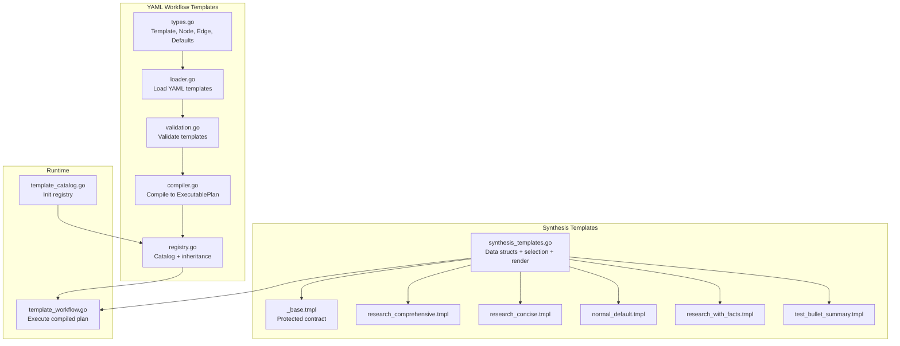
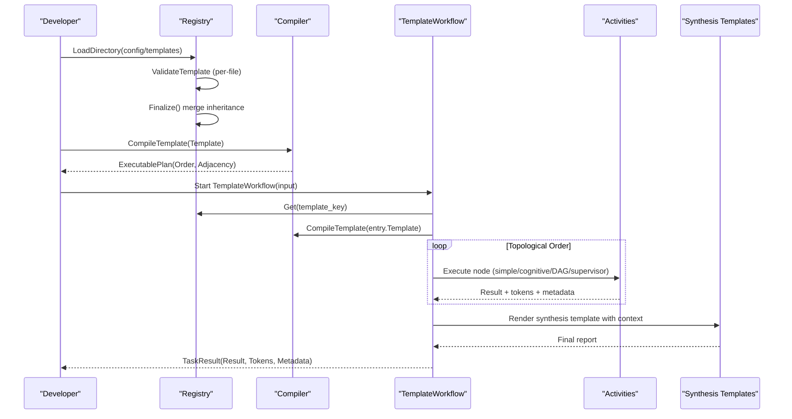
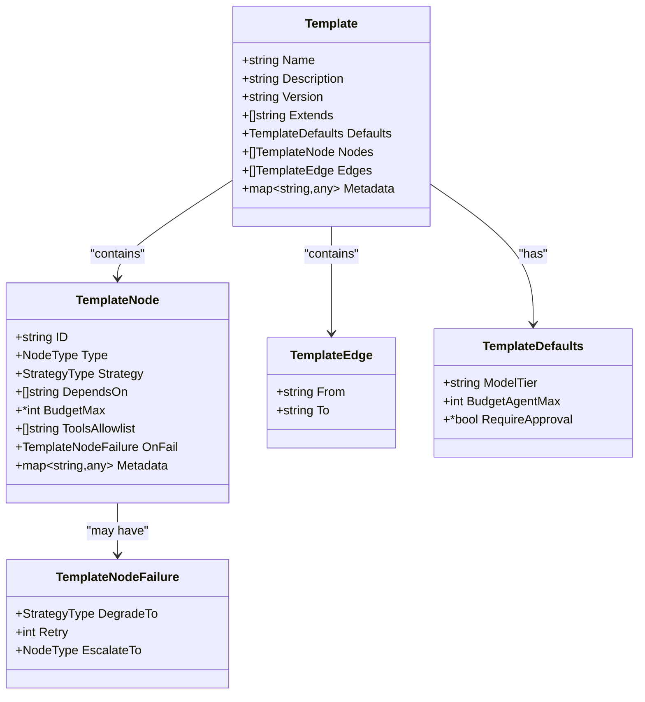
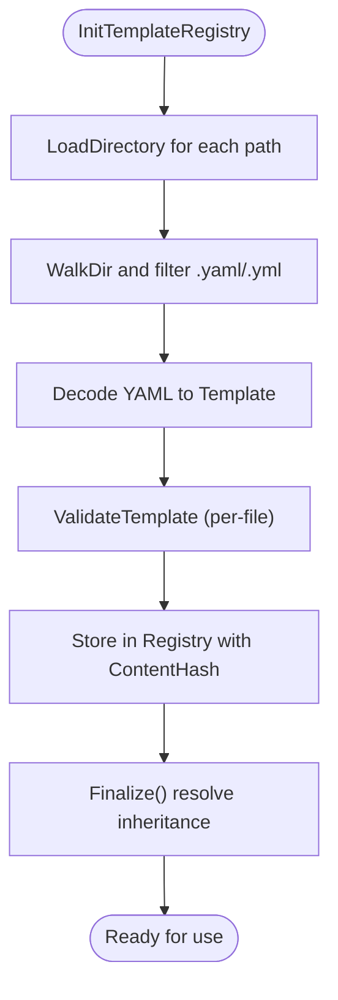
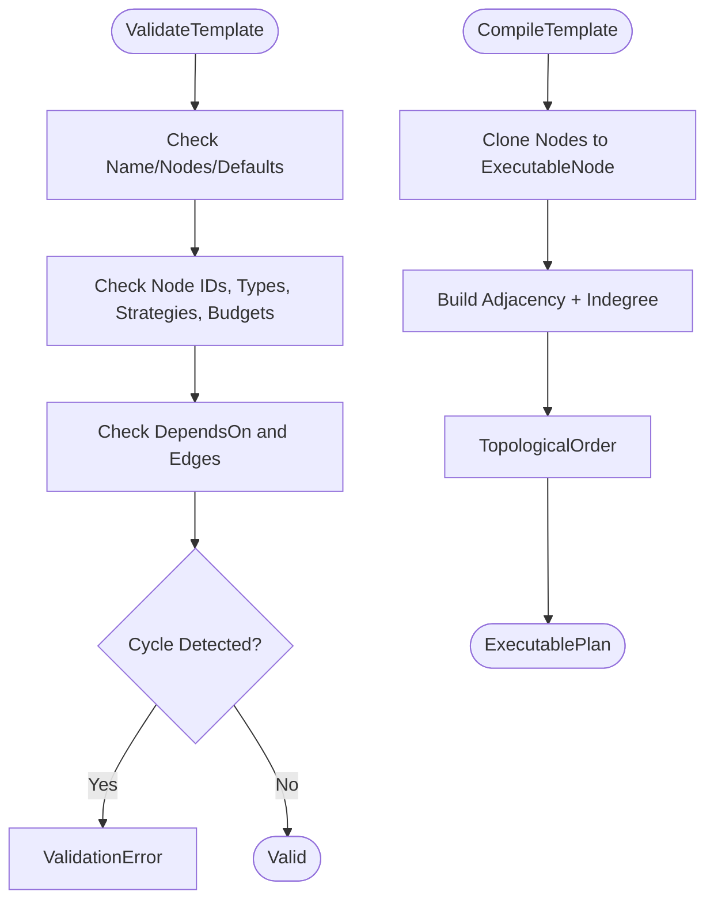
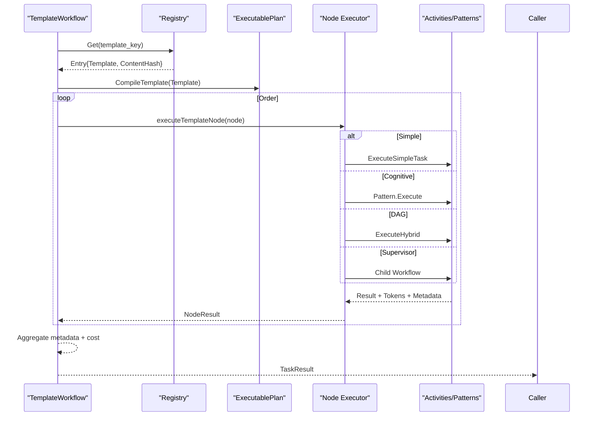
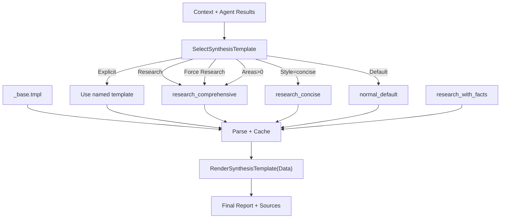
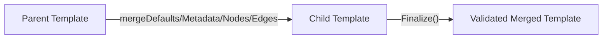
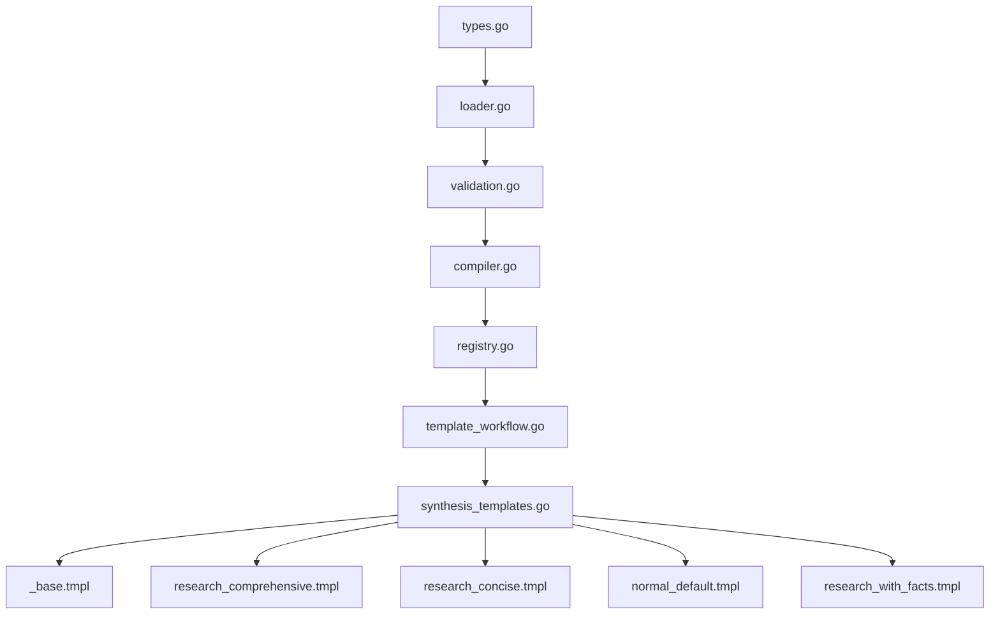

# Template System

<cite>
**Referenced Files in This Document**
- [README.md](file://config/templates/synthesis/README.md)
- [_base.tmpl](file://config/templates/synthesis/_base.tmpl)
- [research_comprehensive.tmpl](file://config/templates/synthesis/research_comprehensive.tmpl)
- [research_concise.tmpl](file://config/templates/synthesis/research_concise.tmpl)
- [research_with_facts.tmpl](file://config/templates/synthesis/research_with_facts.tmpl)
- [test_bullet_summary.tmpl](file://config/templates/synthesis/test_bullet_summary.tmpl)
- [normal_default.tmpl](file://config/templates/synthesis/normal_default.tmpl)
- [compiler.go](file://go/orchestrator/internal/templates/compiler.go)
- [validation.go](file://go/orchestrator/internal/templates/validation.go)
- [loader.go](file://go/orchestrator/internal/templates/loader.go)
- [registry.go](file://go/orchestrator/internal/templates/registry.go)
- [types.go](file://go/orchestrator/internal/templates/types.go)
- [template_workflow.go](file://go/orchestrator/internal/workflows/template_workflow.go)
- [template_catalog.go](file://go/orchestrator/internal/workflows/template_catalog.go)
- [synthesis_templates.go](file://go/orchestrator/internal/activities/synthesis_templates.go)
</cite>

## Table of Contents
1. [Introduction](#introduction)
2. [Project Structure](#project-structure)
3. [Core Components](#core-components)
4. [Architecture Overview](#architecture-overview)
5. [Detailed Component Analysis](#detailed-component-analysis)
6. [Dependency Analysis](#dependency-analysis)
7. [Performance Considerations](#performance-considerations)
8. [Troubleshooting Guide](#troubleshooting-guide)
9. [Conclusion](#conclusion)
10. [Appendices](#appendices)

## Introduction
This document explains Shannon’s template system for building and executing repeatable workflows. It covers:
- Template-based workflow development for rapid deployment of common patterns
- Template compilation and validation processes
- Parameter substitution and conditional logic in synthesis templates
- The synthesis template system for research summaries and report generation
- Template catalog management and custom template creation workflows
- Practical examples for using built-in templates, creating custom templates, and parameterization
- Template inheritance, reuse patterns, and best practices
- Versioning, testing, and deployment strategies for enterprise template management

## Project Structure
Shannon’s template system spans two complementary subsystems:
- YAML-based workflow templates (compiled into executable plans)
- Go text/template-based synthesis templates (rendered during LLM synthesis)

**Diagram sources**
- [types.go](file://go/orchestrator/internal/templates/types.go#L24-L77)
- [loader.go](file://go/orchestrator/internal/templates/loader.go#L11-L42)
- [validation.go](file://go/orchestrator/internal/templates/validation.go#L68-L196)
- [compiler.go](file://go/orchestrator/internal/templates/compiler.go#L31-L122)
- [registry.go](file://go/orchestrator/internal/templates/registry.go#L19-L242)
- [synthesis_templates.go](file://go/orchestrator/internal/activities/synthesis_templates.go#L15-L236)
- [_base.tmpl](file://config/templates/synthesis/_base.tmpl#L1-L143)
- [research_comprehensive.tmpl](file://config/templates/synthesis/research_comprehensive.tmpl#L1-L130)
- [research_concise.tmpl](file://config/templates/synthesis/research_concise.tmpl#L1-L69)
- [normal_default.tmpl](file://config/templates/synthesis/normal_default.tmpl#L1-L45)
- [research_with_facts.tmpl](file://config/templates/synthesis/research_with_facts.tmpl#L1-L128)
- [test_bullet_summary.tmpl](file://config/templates/synthesis/test_bullet_summary.tmpl#L1-L44)
- [template_workflow.go](file://go/orchestrator/internal/workflows/template_workflow.go#L31-L172)
- [template_catalog.go](file://go/orchestrator/internal/workflows/template_catalog.go#L18-L80)

**Section sources**
- [types.go](file://go/orchestrator/internal/templates/types.go#L24-L77)
- [loader.go](file://go/orchestrator/internal/templates/loader.go#L11-L42)
- [validation.go](file://go/orchestrator/internal/templates/validation.go#L68-L196)
- [compiler.go](file://go/orchestrator/internal/templates/compiler.go#L31-L122)
- [registry.go](file://go/orchestrator/internal/templates/registry.go#L19-L242)
- [synthesis_templates.go](file://go/orchestrator/internal/activities/synthesis_templates.go#L15-L236)
- [README.md](file://config/templates/synthesis/README.md#L1-L109)

## Core Components
- YAML Template Types: Define nodes, edges, defaults, and metadata for workflow orchestration.
- Loader: Reads YAML templates from disk.
- Validator: Enforces structural and semantic rules (cycles, unknown types, budgets).
- Compiler: Converts validated templates into deterministic execution plans with topological ordering.
- Registry: Loads templates from directories, supports inheritance merging, and validates final merged templates.
- Template Workflow Runtime: Executes compiled plans against Temporal, collecting node results and metadata.
- Synthesis Templates: Go text/template set for report generation, with selection logic and variable injection.

**Section sources**
- [types.go](file://go/orchestrator/internal/templates/types.go#L24-L77)
- [loader.go](file://go/orchestrator/internal/templates/loader.go#L11-L42)
- [validation.go](file://go/orchestrator/internal/templates/validation.go#L68-L196)
- [compiler.go](file://go/orchestrator/internal/templates/compiler.go#L31-L122)
- [registry.go](file://go/orchestrator/internal/templates/registry.go#L19-L242)
- [template_workflow.go](file://go/orchestrator/internal/workflows/template_workflow.go#L31-L172)
- [synthesis_templates.go](file://go/orchestrator/internal/activities/synthesis_templates.go#L15-L236)

## Architecture Overview
The system separates concerns:
- Template definition and lifecycle (YAML) handled by the template engine
- Execution orchestration handled by the workflow runtime
- Report synthesis handled by synthesis templates

**Diagram sources**
- [registry.go](file://go/orchestrator/internal/templates/registry.go#L51-L87)
- [validation.go](file://go/orchestrator/internal/templates/validation.go#L68-L196)
- [compiler.go](file://go/orchestrator/internal/templates/compiler.go#L31-L122)
- [template_workflow.go](file://go/orchestrator/internal/workflows/template_workflow.go#L31-L172)
- [synthesis_templates.go](file://go/orchestrator/internal/activities/synthesis_templates.go#L155-L228)

## Detailed Component Analysis

### YAML Template Engine
- Types define the structure of templates, nodes, edges, defaults, and failure handling.
- Loader reads YAML and enforces known-fields decoding.
- Validator checks names, node uniqueness, allowed types/strategies, budgets, dependencies, cycles, and edge validity.
- Compiler builds adjacency lists, computes in-degrees, and derives a topological order for deterministic execution.
- Registry loads templates from directories, tracks content hashes, and supports inheritance resolution and merging.

**Diagram sources**
- [types.go](file://go/orchestrator/internal/templates/types.go#L24-L77)

**Section sources**
- [types.go](file://go/orchestrator/internal/templates/types.go#L24-L77)
- [loader.go](file://go/orchestrator/internal/templates/loader.go#L11-L42)
- [validation.go](file://go/orchestrator/internal/templates/validation.go#L68-L196)
- [compiler.go](file://go/orchestrator/internal/templates/compiler.go#L31-L122)
- [registry.go](file://go/orchestrator/internal/templates/registry.go#L19-L242)

### Template Catalog Management
- Initialize registry from one or more directories.
- LoadDirectory walks the directory, filters YAML files, and loads each template.
- Finalize resolves inheritance chains, merges overlays, and re-validates merged templates.
- Provides listing, lookup by name/version, and content hashing for integrity.

**Diagram sources**
- [template_catalog.go](file://go/orchestrator/internal/workflows/template_catalog.go#L18-L80)
- [registry.go](file://go/orchestrator/internal/templates/registry.go#L51-L87)
- [registry.go](file://go/orchestrator/internal/templates/registry.go#L219-L242)

**Section sources**
- [template_catalog.go](file://go/orchestrator/internal/workflows/template_catalog.go#L18-L80)
- [registry.go](file://go/orchestrator/internal/templates/registry.go#L51-L87)
- [registry.go](file://go/orchestrator/internal/templates/registry.go#L219-L242)

### Template Compilation and Validation
- Validation catches structural issues early (missing names, cycles, invalid types/strategies, budget misuse).
- Compilation transforms templates into ExecutablePlan with:
  - Nodes mapped to ExecutableNode (cloned metadata, tools allowlist, failure policy)
  - Adjacency derived from depends_on and explicit edges
  - Topological order computed for deterministic execution
- Cycle detection prevents deadlocks and undefined execution.

**Diagram sources**
- [validation.go](file://go/orchestrator/internal/templates/validation.go#L68-L196)
- [compiler.go](file://go/orchestrator/internal/templates/compiler.go#L31-L122)
- [compiler.go](file://go/orchestrator/internal/templates/compiler.go#L124-L152)

**Section sources**
- [validation.go](file://go/orchestrator/internal/templates/validation.go#L68-L196)
- [compiler.go](file://go/orchestrator/internal/templates/compiler.go#L31-L122)
- [compiler.go](file://go/orchestrator/internal/templates/compiler.go#L124-L152)

### Template Workflow Execution
- TemplateWorkflow loads a compiled plan from the registry, verifies content hash, and executes nodes in topological order.
- Node execution supports:
  - Simple tasks
  - Cognitive patterns (with budget-based degrading)
  - DAG hybrid tasks (parallel/constrained)
  - Supervisor child workflows
- Aggregates tokens, metadata, and emits completion events.

**Diagram sources**
- [template_workflow.go](file://go/orchestrator/internal/workflows/template_workflow.go#L31-L172)
- [template_workflow.go](file://go/orchestrator/internal/workflows/template_workflow.go#L229-L506)

**Section sources**
- [template_workflow.go](file://go/orchestrator/internal/workflows/template_workflow.go#L31-L172)
- [template_workflow.go](file://go/orchestrator/internal/workflows/template_workflow.go#L229-L506)

### Synthesis Template System
- Purpose: Generate structured research reports and summaries using Go text/template.
- Selection logic: Chooses among research_comprehensive, research_concise, research_with_facts, normal_default, or a custom template based on context.
- Variables: Query, QueryLanguage, ResearchAreas, AvailableCitations, CitationCount, MinCitations, LanguageInstruction, AgentResults, TargetWords, IsResearch, SynthesisStyle, CitationAgentEnabled, CurrentDate.
- Base contract: _base.tmpl defines citation format, language requirements, and conflict resolution rules; all synthesis templates include this via template composition.
- Rendering: LoadSynthesisTemplate caches parsed templates; RenderSynthesisTemplate executes with data; SelectSynthesisTemplate chooses the right template based on context.

**Diagram sources**
- [synthesis_templates.go](file://go/orchestrator/internal/activities/synthesis_templates.go#L171-L228)
- [synthesis_templates.go](file://go/orchestrator/internal/activities/synthesis_templates.go#L74-L153)
- [synthesis_templates.go](file://go/orchestrator/internal/activities/synthesis_templates.go#L155-L169)
- [_base.tmpl](file://config/templates/synthesis/_base.tmpl#L1-L143)
- [research_comprehensive.tmpl](file://config/templates/synthesis/research_comprehensive.tmpl#L1-L130)
- [research_concise.tmpl](file://config/templates/synthesis/research_concise.tmpl#L1-L69)
- [normal_default.tmpl](file://config/templates/synthesis/normal_default.tmpl#L1-L45)
- [research_with_facts.tmpl](file://config/templates/synthesis/research_with_facts.tmpl#L1-L128)
- [README.md](file://config/templates/synthesis/README.md#L1-L109)

**Section sources**
- [synthesis_templates.go](file://go/orchestrator/internal/activities/synthesis_templates.go#L15-L236)
- [README.md](file://config/templates/synthesis/README.md#L1-L109)
- [_base.tmpl](file://config/templates/synthesis/_base.tmpl#L1-L143)
- [research_comprehensive.tmpl](file://config/templates/synthesis/research_comprehensive.tmpl#L1-L130)
- [research_concise.tmpl](file://config/templates/synthesis/research_concise.tmpl#L1-L69)
- [normal_default.tmpl](file://config/templates/synthesis/normal_default.tmpl#L1-L45)
- [research_with_facts.tmpl](file://config/templates/synthesis/research_with_facts.tmpl#L1-L128)
- [test_bullet_summary.tmpl](file://config/templates/synthesis/test_bullet_summary.tmpl#L1-L44)

### Template Inheritance and Reuse
- YAML templates support extends to inherit and overlay configurations.
- Registry resolves inheritance depth-first, merges defaults, metadata, nodes, and edges, then re-validates.
- Best practice: Put shared defaults and node definitions in parent templates; override selectively in children.

**Diagram sources**
- [registry.go](file://go/orchestrator/internal/templates/registry.go#L219-L242)
- [registry.go](file://go/orchestrator/internal/templates/registry.go#L244-L288)
- [registry.go](file://go/orchestrator/internal/templates/registry.go#L290-L317)
- [registry.go](file://go/orchestrator/internal/templates/registry.go#L319-L359)

**Section sources**
- [registry.go](file://go/orchestrator/internal/templates/registry.go#L219-L242)
- [registry.go](file://go/orchestrator/internal/templates/registry.go#L244-L288)
- [registry.go](file://go/orchestrator/internal/templates/registry.go#L290-L317)
- [registry.go](file://go/orchestrator/internal/templates/registry.go#L319-L359)

### Practical Examples

- Using built-in synthesis templates:
  - Research comprehensive: set context workflow_type to research or synthesis_style to comprehensive, or provide research_areas.
  - Research concise: set synthesis_style to concise.
  - Normal default: used when no research context is present.
  - See selection rules and precedence in the synthesis README and selection logic.

- Creating a custom synthesis template:
  - Place a .tmpl file in the synthesis directory.
  - Include the base contract at the top and the citation list where appropriate.
  - Choose it via context synthesis_template.
  - Optionally override minimum length threshold via synthesis_min_length.

- Parameterizing templates:
  - For synthesis: pass variables like Query, QueryLanguage, ResearchAreas, AvailableCitations, MinCitations, LanguageInstruction, TargetWords, IsResearch, SynthesisStyle, CitationAgentEnabled, CurrentDate.
  - For YAML templates: configure nodes with metadata, depends_on, tools_allowlist, on_fail, and budget_max.

- Template inheritance:
  - Extend a parent template and override defaults, nodes, and edges; Finalize merges and validates.

**Section sources**
- [README.md](file://config/templates/synthesis/README.md#L1-L109)
- [synthesis_templates.go](file://go/orchestrator/internal/activities/synthesis_templates.go#L171-L228)
- [synthesis_templates.go](file://go/orchestrator/internal/activities/synthesis_templates.go#L74-L153)
- [types.go](file://go/orchestrator/internal/templates/types.go#L24-L77)
- [registry.go](file://go/orchestrator/internal/templates/registry.go#L219-L242)

## Dependency Analysis
- YAML Template Engine depends on:
  - Types for structure
  - Loader for parsing
  - Validation for correctness
  - Compiler for execution plan
  - Registry for catalog and inheritance
- Template Workflow depends on:
  - Registry for template lookup
  - Compiler for plan generation
  - Activities/Patterns for node execution
- Synthesis Templates depend on:
  - Data structs and selection/rendering logic
  - Base template for contract compliance

**Diagram sources**
- [types.go](file://go/orchestrator/internal/templates/types.go#L24-L77)
- [loader.go](file://go/orchestrator/internal/templates/loader.go#L11-L42)
- [validation.go](file://go/orchestrator/internal/templates/validation.go#L68-L196)
- [compiler.go](file://go/orchestrator/internal/templates/compiler.go#L31-L122)
- [registry.go](file://go/orchestrator/internal/templates/registry.go#L19-L242)
- [template_workflow.go](file://go/orchestrator/internal/workflows/template_workflow.go#L31-L172)
- [synthesis_templates.go](file://go/orchestrator/internal/activities/synthesis_templates.go#L15-L236)
- [_base.tmpl](file://config/templates/synthesis/_base.tmpl#L1-L143)
- [research_comprehensive.tmpl](file://config/templates/synthesis/research_comprehensive.tmpl#L1-L130)
- [research_concise.tmpl](file://config/templates/synthesis/research_concise.tmpl#L1-L69)
- [normal_default.tmpl](file://config/templates/synthesis/normal_default.tmpl#L1-L45)
- [research_with_facts.tmpl](file://config/templates/synthesis/research_with_facts.tmpl#L1-L128)

**Section sources**
- [types.go](file://go/orchestrator/internal/templates/types.go#L24-L77)
- [loader.go](file://go/orchestrator/internal/templates/loader.go#L11-L42)
- [validation.go](file://go/orchestrator/internal/templates/validation.go#L68-L196)
- [compiler.go](file://go/orchestrator/internal/templates/compiler.go#L31-L122)
- [registry.go](file://go/orchestrator/internal/templates/registry.go#L19-L242)
- [template_workflow.go](file://go/orchestrator/internal/workflows/template_workflow.go#L31-L172)
- [synthesis_templates.go](file://go/orchestrator/internal/activities/synthesis_templates.go#L15-L236)

## Performance Considerations
- Template loading and parsing:
  - YAML loader uses known-fields decoding to prevent silent misconfigurations.
  - Synthesis template loading caches parsed templates to avoid repeated disk I/O.
- Validation overhead:
  - ValidateTemplate runs once per file during load; Finalize re-validates merged templates.
- Execution:
  - Topological ordering ensures minimal recomputation and predictable scheduling.
  - DAG hybrid execution supports concurrency and dependency waits to balance throughput and correctness.
- Memory:
  - ExecutablePlan clones node metadata and allowlists; keep metadata lean.

[No sources needed since this section provides general guidance]

## Troubleshooting Guide
- Template load errors:
  - Directory not found or not a directory; errors aggregated into a LoadError.
- Validation errors:
  - Missing name, empty nodes without extends, negative budgets, unknown node types/strategies, cycles, invalid dependencies, or edge issues.
- Compilation errors:
  - Cycle detected in template graph; fix depends_on or edges.
- Synthesis template issues:
  - Template not found by name; base template missing; rendering errors; ensure context variables are provided and synthesis_template is set appropriately.
- Workflow execution:
  - Template key not found; content hash mismatch; node execution failures; review node metadata and tool allowlists.

**Section sources**
- [registry.go](file://go/orchestrator/internal/templates/registry.go#L460-L478)
- [validation.go](file://go/orchestrator/internal/templates/validation.go#L68-L196)
- [compiler.go](file://go/orchestrator/internal/templates/compiler.go#L124-L152)
- [synthesis_templates.go](file://go/orchestrator/internal/activities/synthesis_templates.go#L74-L153)
- [synthesis_templates.go](file://go/orchestrator/internal/activities/synthesis_templates.go#L155-L169)
- [template_workflow.go](file://go/orchestrator/internal/workflows/template_workflow.go#L58-L76)

## Conclusion
Shannon’s template system combines robust YAML-based workflow templates with flexible synthesis templates to enable rapid, reliable deployment of common patterns. The engine enforces correctness via validation and compilation, supports inheritance and reuse, and integrates seamlessly with the workflow runtime. By following the provided selection and parameterization patterns, teams can build enterprise-grade template catalogs with strong versioning, testing, and deployment practices.

[No sources needed since this section summarizes without analyzing specific files]

## Appendices

### Best Practices for Template Development
- Keep node IDs unique and descriptive.
- Prefer explicit edges only when necessary; rely on depends_on for clarity.
- Use extends to factor out shared defaults and node sets.
- Validate templates locally before deploying to production.
- Pin versions in registry lookups to ensure reproducibility.
- For synthesis templates, always include the base contract and citation list; tailor structure and guidance to the use case.

**Section sources**
- [validation.go](file://go/orchestrator/internal/templates/validation.go#L68-L196)
- [registry.go](file://go/orchestrator/internal/templates/registry.go#L219-L242)
- [README.md](file://config/templates/synthesis/README.md#L1-L109)
- [_base.tmpl](file://config/templates/synthesis/_base.tmpl#L1-L143)

### Enterprise Deployment Strategies
- Versioning:
  - Use TemplateRegistry.Find(name, version) to resolve templates by version; fall back to latest when version is empty.
  - Track content hashes to detect drift and enforce integrity.
- Testing:
  - Run validation and compilation tests in CI; use ClearSynthesisTemplateCache for isolated tests.
  - Validate synthesized outputs against expected structure and citation patterns.
- Rollout:
  - Gradually introduce new templates; monitor validation metrics and template load errors.
  - Use Finalize to catch inheritance merge issues before runtime.

**Section sources**
- [registry.go](file://go/orchestrator/internal/templates/registry.go#L179-L205)
- [synthesis_templates.go](file://go/orchestrator/internal/activities/synthesis_templates.go#L230-L236)
- [template_workflow.go](file://go/orchestrator/internal/workflows/template_workflow.go#L64-L70)