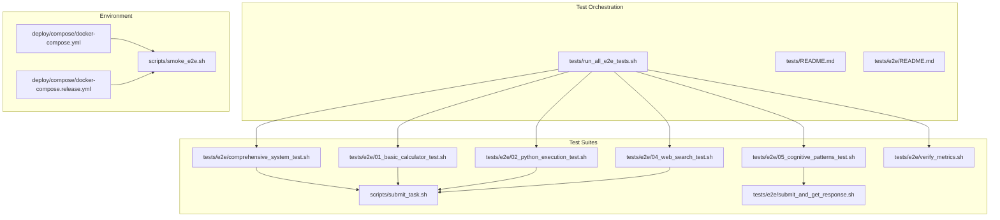
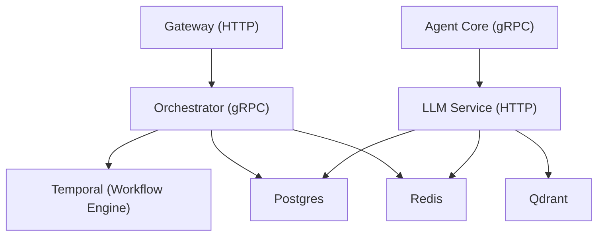
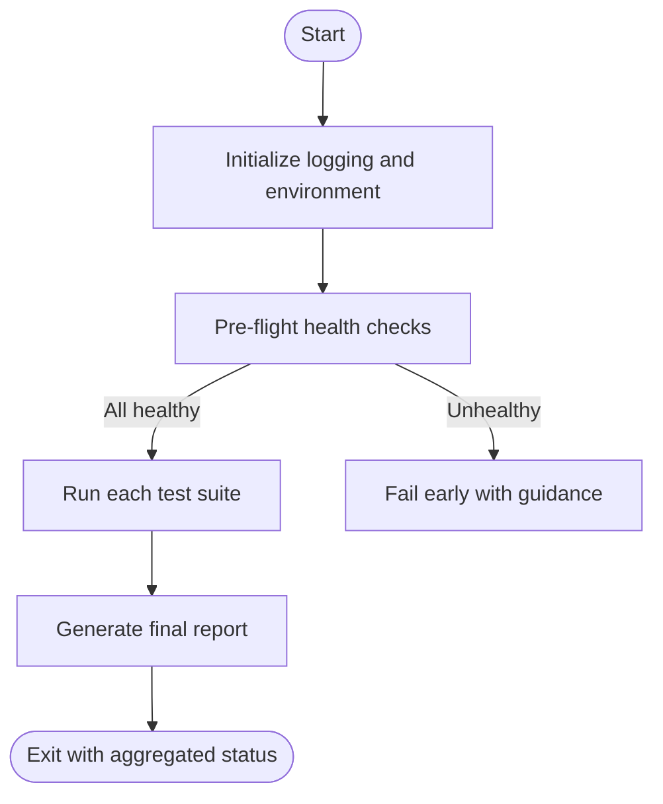
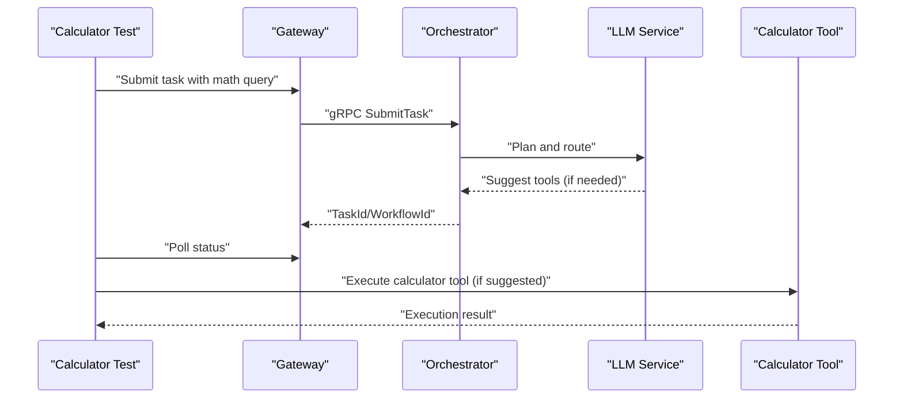
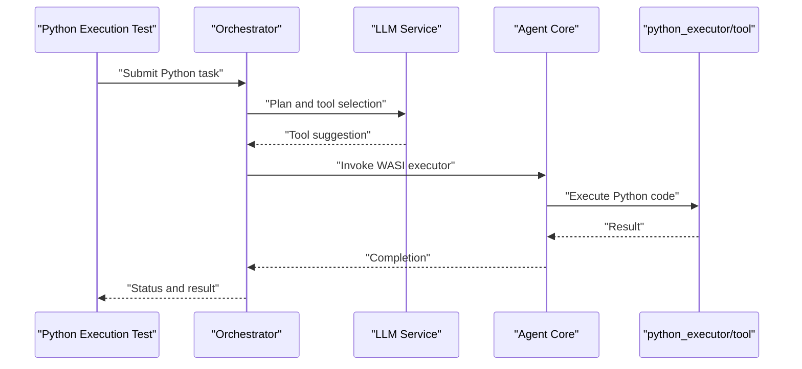
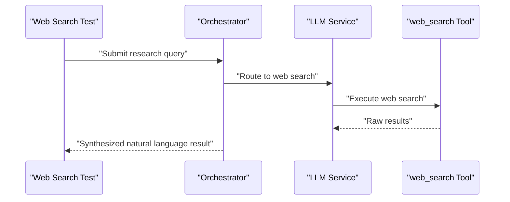
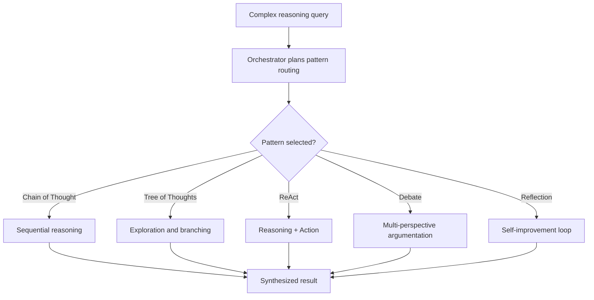
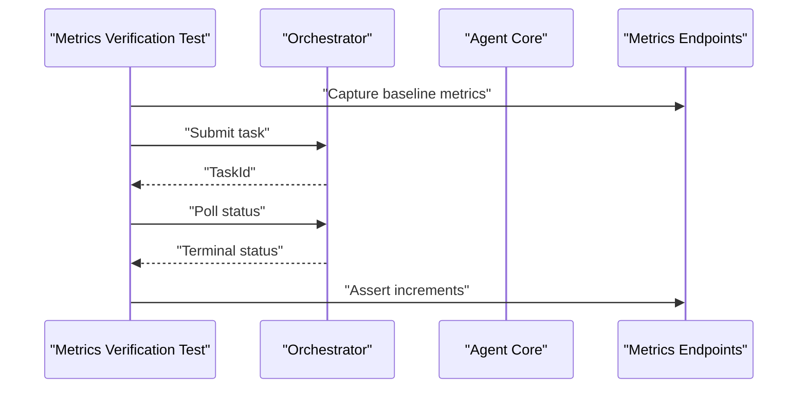
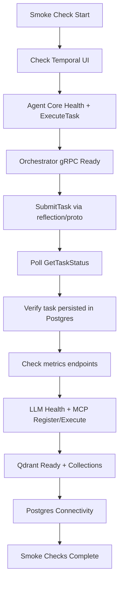
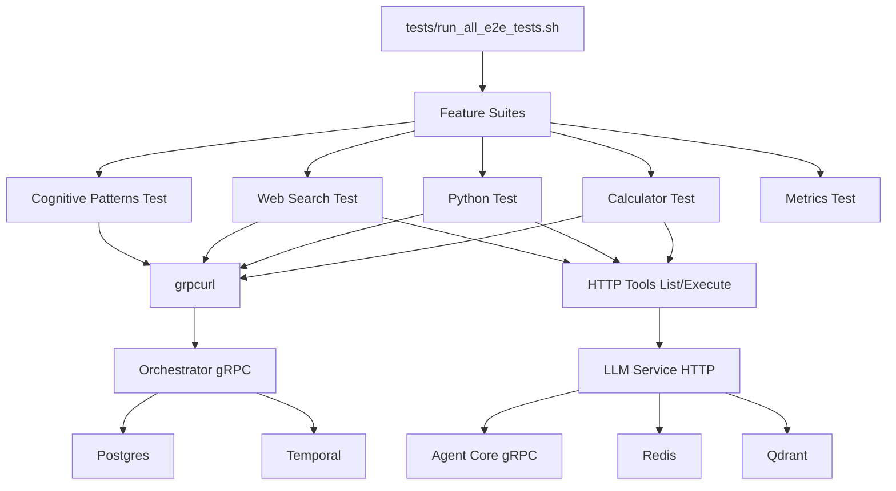

# End-to-End Testing

<cite>
**Referenced Files in This Document**
- [tests/README_E2E_TESTS.md](file://tests/README_E2E_TESTS.md)
- [tests/README.md](file://tests/README.md)
- [tests/run_all_e2e_tests.sh](file://tests/run_all_e2e_tests.sh)
- [tests/e2e/README.md](file://tests/e2e/README.md)
- [tests/e2e/comprehensive_system_test.sh](file://tests/e2e/comprehensive_system_test.sh)
- [tests/e2e/01_basic_calculator_test.sh](file://tests/e2e/01_basic_calculator_test.sh)
- [tests/e2e/02_python_execution_test.sh](file://tests/e2e/02_python_execution_test.sh)
- [tests/e2e/04_web_search_test.sh](file://tests/e2e/04_web_search_test.sh)
- [tests/e2e/05_cognitive_patterns_test.sh](file://tests/e2e/05_cognitive_patterns_test.sh)
- [tests/e2e/verify_metrics.sh](file://tests/e2e/verify_metrics.sh)
- [scripts/submit_task.sh](file://scripts/submit_task.sh)
- [tests/e2e/submit_and_get_response.sh](file://tests/e2e/submit_and_get_response.sh)
- [scripts/smoke_e2e.sh](file://scripts/smoke_e2e.sh)
- [deploy/compose/docker-compose.yml](file://deploy/compose/docker-compose.yml)
- [deploy/compose/docker-compose.release.yml](file://deploy/compose/docker-compose.release.yml)
</cite>

## Table of Contents
1. [Introduction](#introduction)
2. [Project Structure](#project-structure)
3. [Core Components](#core-components)
4. [Architecture Overview](#architecture-overview)
5. [Detailed Component Analysis](#detailed-component-analysis)
6. [Dependency Analysis](#dependency-analysis)
7. [Performance Considerations](#performance-considerations)
8. [Troubleshooting Guide](#troubleshooting-guide)
9. [Conclusion](#conclusion)
10. [Appendices](#appendices)

## Introduction
This document describes the end-to-end (E2E) testing strategy for the Shannon system. It documents the comprehensive test suite that validates the full application lifecycle—from task submission to result retrieval—across core workflows, tool execution, cognitive patterns, and system integration points. It explains the test environment orchestrated with Docker Compose, outlines practical scenarios and user workflows, and provides guidance for test data management, state validation, result verification, performance and load validation, and maintaining test reliability.

## Project Structure
The E2E test suite is organized under the tests directory with dedicated categories and runners:
- tests/e2e: Feature and workflow-focused E2E tests (numbered for categorization)
- tests/run_all_e2e_tests.sh: Master runner that orchestrates suites and reports outcomes
- tests/README.md and tests/README_E2E_TESTS.md: Overview and operational guidance
- scripts/submit_task.sh and tests/e2e/submit_and_get_response.sh: Helper scripts for task submission and result retrieval
- tests/e2e/verify_metrics.sh: Metrics verification after workflow execution
- scripts/smoke_e2e.sh: Lightweight smoke checks validating service readiness and basic gRPC interactions
- deploy/compose/docker-compose.yml and deploy/compose/docker-compose.release.yml: Service orchestration and environment configuration

**Diagram sources**
- [tests/run_all_e2e_tests.sh](file://tests/run_all_e2e_tests.sh#L1-L214)
- [tests/e2e/README.md](file://tests/e2e/README.md#L1-L241)
- [tests/e2e/comprehensive_system_test.sh](file://tests/e2e/comprehensive_system_test.sh#L1-L402)
- [tests/e2e/01_basic_calculator_test.sh](file://tests/e2e/01_basic_calculator_test.sh#L1-L127)
- [tests/e2e/02_python_execution_test.sh](file://tests/e2e/02_python_execution_test.sh#L1-L251)
- [tests/e2e/04_web_search_test.sh](file://tests/e2e/04_web_search_test.sh#L1-L176)
- [tests/e2e/05_cognitive_patterns_test.sh](file://tests/e2e/05_cognitive_patterns_test.sh#L1-L230)
- [tests/e2e/verify_metrics.sh](file://tests/e2e/verify_metrics.sh#L1-L201)
- [scripts/submit_task.sh](file://scripts/submit_task.sh#L1-L62)
- [tests/e2e/submit_and_get_response.sh](file://tests/e2e/submit_and_get_response.sh#L1-L29)
- [scripts/smoke_e2e.sh](file://scripts/smoke_e2e.sh#L1-L141)
- [deploy/compose/docker-compose.yml](file://deploy/compose/docker-compose.yml#L1-L411)
- [deploy/compose/docker-compose.release.yml](file://deploy/compose/docker-compose.release.yml#L1-L345)

**Section sources**
- [tests/README.md](file://tests/README.md#L1-L109)
- [tests/README_E2E_TESTS.md](file://tests/README_E2E_TESTS.md#L1-L300)
- [tests/e2e/README.md](file://tests/e2e/README.md#L1-L241)

## Core Components
- Master test runner: Aggregates and executes suites, performs pre-flight checks, and produces a consolidated report.
- Individual E2E suites: Feature-specific tests for calculator operations, Python execution, web search, and cognitive patterns.
- Helpers: Scripts to submit tasks via gRPC and poll for completion, and to retrieve results from the database.
- Metrics verification: Post-execution checks to assert metric increments and patterns.
- Smoke checks: Lightweight validations for service health and basic gRPC interactions.
- Environment: Docker Compose stacks for development and release configurations.

Key responsibilities:
- Validate end-to-end workflows from gateway to orchestrator, LLM service, and agent core.
- Confirm tool execution (calculator, Python executor), web search synthesis, and cognitive pattern routing.
- Ensure persistence, streaming, session management, and metadata correctness.
- Verify metrics and observability after workflow execution.

**Section sources**
- [tests/run_all_e2e_tests.sh](file://tests/run_all_e2e_tests.sh#L1-L214)
- [tests/e2e/comprehensive_system_test.sh](file://tests/e2e/comprehensive_system_test.sh#L1-L402)
- [tests/e2e/01_basic_calculator_test.sh](file://tests/e2e/01_basic_calculator_test.sh#L1-L127)
- [tests/e2e/02_python_execution_test.sh](file://tests/e2e/02_python_execution_test.sh#L1-L251)
- [tests/e2e/04_web_search_test.sh](file://tests/e2e/04_web_search_test.sh#L1-L176)
- [tests/e2e/05_cognitive_patterns_test.sh](file://tests/e2e/05_cognitive_patterns_test.sh#L1-L230)
- [tests/e2e/verify_metrics.sh](file://tests/e2e/verify_metrics.sh#L1-L201)
- [scripts/submit_task.sh](file://scripts/submit_task.sh#L1-L62)
- [tests/e2e/submit_and_get_response.sh](file://tests/e2e/submit_and_get_response.sh#L1-L29)
- [scripts/smoke_e2e.sh](file://scripts/smoke_e2e.sh#L1-L141)

## Architecture Overview
The E2E tests exercise the same runtime architecture used by the application:
- Gateway exposes HTTP endpoints for task submission and streaming.
- Orchestrator receives tasks via gRPC, manages workflows, and persists state.
- LLM service provides tool execution and synthesis.
- Agent core executes WASI-based tools in a sandbox.
- Temporal coordinates workflows; Redis and Postgres provide runtime state and persistence.
- Qdrant stores vector embeddings for memory and search.

**Diagram sources**
- [deploy/compose/docker-compose.yml](file://deploy/compose/docker-compose.yml#L1-L411)

## Detailed Component Analysis

### Master Test Runner
The master runner initializes colorized logging, defines the suites to run, performs pre-flight checks against gateway, orchestrator, and LLM service health endpoints, and aggregates results with pass/fail counts and a final report. It supports environment overrides for base URLs and integrates with CI-friendly exit codes.

**Diagram sources**
- [tests/run_all_e2e_tests.sh](file://tests/run_all_e2e_tests.sh#L1-L214)

**Section sources**
- [tests/run_all_e2e_tests.sh](file://tests/run_all_e2e_tests.sh#L1-L214)

### Calculator Operations E2E
Validates calculator tool suggestion and execution paths:
- Simple arithmetic handled by the LLM directly (no tool suggested).
- Complex expressions trigger the calculator tool.
- Direct tool registration and execution verification.
- Tool availability and execution results validated via HTTP endpoints.

**Diagram sources**
- [tests/e2e/01_basic_calculator_test.sh](file://tests/e2e/01_basic_calculator_test.sh#L1-L127)
- [scripts/submit_task.sh](file://scripts/submit_task.sh#L1-L62)

**Section sources**
- [tests/e2e/01_basic_calculator_test.sh](file://tests/e2e/01_basic_calculator_test.sh#L1-L127)

### Python Execution E2E
Validates Python code execution via WASI sandbox:
- Direct WASM module creation and execution (when tooling is available).
- Base64-encoded WASM payload testing through the code executor.
- Workflow integration with Python requests and history export for replay.
- Parameter validation and Unicode support checks.
- Optional Python WASM interpreter presence verification.

**Diagram sources**
- [tests/e2e/02_python_execution_test.sh](file://tests/e2e/02_python_execution_test.sh#L1-L251)
- [scripts/submit_task.sh](file://scripts/submit_task.sh#L1-L62)

**Section sources**
- [tests/e2e/02_python_execution_test.sh](file://tests/e2e/02_python_execution_test.sh#L1-L251)

### Web Search and Synthesis E2E
Validates web search tool registration and synthesis behavior:
- Tool registration verification.
- Queries triggering web search synthesis at the orchestrator level.
- Control tests to ensure non-web-search tools do not trigger synthesis.
- Result validation to ensure synthesized natural language output.

**Diagram sources**
- [tests/e2e/04_web_search_test.sh](file://tests/e2e/04_web_search_test.sh#L1-L176)

**Section sources**
- [tests/e2e/04_web_search_test.sh](file://tests/e2e/04_web_search_test.sh#L1-L176)

### Cognitive Patterns E2E
Validates multi-agent reasoning patterns:
- Chain of Thought, Tree of Thoughts, ReAct, Debate, Reflection.
- Pattern detection via orchestrator logs and supervisor workflow activation.
- Tool usage indicators and hybrid pattern validation.

**Diagram sources**
- [tests/e2e/05_cognitive_patterns_test.sh](file://tests/e2e/05_cognitive_patterns_test.sh#L1-L230)

**Section sources**
- [tests/e2e/05_cognitive_patterns_test.sh](file://tests/e2e/05_cognitive_patterns_test.sh#L1-L230)

### Metrics Verification E2E
Ensures metrics increment correctly after workflow execution:
- Captures baseline metrics from orchestrator and agent endpoints.
- Submits a test workflow and polls for completion.
- Asserts increments for workflows started/completed, gRPC requests, agent tasks, and specific metric families.

**Diagram sources**
- [tests/e2e/verify_metrics.sh](file://tests/e2e/verify_metrics.sh#L1-L201)

**Section sources**
- [tests/e2e/verify_metrics.sh](file://tests/e2e/verify_metrics.sh#L1-L201)

### Smoke E2E Checks
Lightweight validations for service readiness and basic gRPC interactions:
- Temporal UI accessibility.
- Agent Core health and task execution via gRPC.
- Orchestrator gRPC readiness and task submission.
- Persistence verification in Postgres.
- Metrics endpoints reachability.
- LLM service health and MCP tool registration and execution.
- Qdrant readiness and required collections.
- Postgres connectivity.

**Diagram sources**
- [scripts/smoke_e2e.sh](file://scripts/smoke_e2e.sh#L1-L141)

**Section sources**
- [scripts/smoke_e2e.sh](file://scripts/smoke_e2e.sh#L1-L141)

## Dependency Analysis
The E2E tests depend on the following runtime dependencies and integration points:
- Docker Compose services: gateway, orchestrator, llm-service, agent-core, temporal, redis, postgres, qdrant, playwright-service.
- Protobuf and gRPC tooling for task submission and status polling.
- Database access for persistence verification.
- Metrics endpoints for post-execution assertions.
- Optional MCP tool registration and execution.

**Diagram sources**
- [tests/run_all_e2e_tests.sh](file://tests/run_all_e2e_tests.sh#L1-L214)
- [tests/e2e/01_basic_calculator_test.sh](file://tests/e2e/01_basic_calculator_test.sh#L1-L127)
- [tests/e2e/02_python_execution_test.sh](file://tests/e2e/02_python_execution_test.sh#L1-L251)
- [tests/e2e/04_web_search_test.sh](file://tests/e2e/04_web_search_test.sh#L1-L176)
- [tests/e2e/05_cognitive_patterns_test.sh](file://tests/e2e/05_cognitive_patterns_test.sh#L1-L230)
- [tests/e2e/verify_metrics.sh](file://tests/e2e/verify_metrics.sh#L1-L201)
- [deploy/compose/docker-compose.yml](file://deploy/compose/docker-compose.yml#L1-L411)

**Section sources**
- [deploy/compose/docker-compose.yml](file://deploy/compose/docker-compose.yml#L1-L411)

## Performance Considerations
- Concurrency and worker settings: The orchestrator and agent-core expose environment variables controlling worker concurrency and timeouts. Tune these for performance-sensitive tests.
- Rate limits and backpressure: LLM service and tools define rate limits; consider adjusting during load testing to avoid throttling.
- Metrics-driven validation: Use metrics verification to detect regressions in latency and throughput.
- Database and cache: Monitor Postgres and Redis health; ensure adequate capacity for concurrent test loads.
- Streaming and SSE: Validate streaming endpoints under load to ensure event delivery completeness.

[No sources needed since this section provides general guidance]

## Troubleshooting Guide
Common issues and resolutions:
- Services not healthy: Use smoke checks to verify gateway, orchestrator, LLM service, agent-core, temporal UI, and Qdrant readiness.
- Task stuck or not completing: Inspect orchestrator and LLM service logs; verify database entries and Temporal workflow state.
- Tool not found: Confirm tool registration via HTTP endpoints and ensure required interpreters are present.
- Metrics not incrementing: Validate metrics endpoints and re-run metrics verification test to assert expected increments.
- Database access: Use provided commands to query task_executions and verify persistence.
- CI integration: Follow the documented GitHub Actions example and pre-commit hook guidance.

**Section sources**
- [tests/README_E2E_TESTS.md](file://tests/README_E2E_TESTS.md#L149-L213)
- [scripts/smoke_e2e.sh](file://scripts/smoke_e2e.sh#L1-L141)
- [tests/e2e/verify_metrics.sh](file://tests/e2e/verify_metrics.sh#L1-L201)

## Conclusion
The Shannon E2E test suite comprehensively validates the end-to-end workflows across calculator operations, Python execution, web search synthesis, and cognitive patterns. It leverages Docker Compose for environment orchestration, gRPC and HTTP endpoints for integration, and metrics and database checks for state validation. The suite is designed for CI-friendly execution, maintainability, and scalability, with guidance for performance and reliability.

[No sources needed since this section summarizes without analyzing specific files]

## Appendices

### Test Environment Setup
- Development stack: Use the provided Docker Compose files to start all services.
- Release stack: Use the release Compose file for containerized deployments.
- Prerequisites: Install docker, docker compose, grpcurl, psql, netcat, and jq.

**Section sources**
- [deploy/compose/docker-compose.yml](file://deploy/compose/docker-compose.yml#L1-L411)
- [deploy/compose/docker-compose.release.yml](file://deploy/compose/docker-compose.release.yml#L1-L345)
- [tests/README.md](file://tests/README.md#L13-L21)

### Practical Scenarios and Workflows
- Calculator: Simple arithmetic handled by LLM; complex expressions trigger the calculator tool.
- Python: Execute Python code via WASI sandbox; validate Unicode and parameter validation.
- Web search: Research queries synthesize results at the orchestrator level.
- Cognitive patterns: Multi-agent reasoning strategies routed by the orchestrator.
- Metrics: Post-execution assertions for workflow and token usage metrics.

**Section sources**
- [tests/e2e/01_basic_calculator_test.sh](file://tests/e2e/01_basic_calculator_test.sh#L1-L127)
- [tests/e2e/02_python_execution_test.sh](file://tests/e2e/02_python_execution_test.sh#L1-L251)
- [tests/e2e/04_web_search_test.sh](file://tests/e2e/04_web_search_test.sh#L1-L176)
- [tests/e2e/05_cognitive_patterns_test.sh](file://tests/e2e/05_cognitive_patterns_test.sh#L1-L230)
- [tests/e2e/verify_metrics.sh](file://tests/e2e/verify_metrics.sh#L1-L201)

### Test Data Management and Validation
- Use task_executions table for persistence verification.
- Retrieve results via database queries or helper scripts.
- Validate metadata (model_used, provider, usage) and streaming events.
- Export workflow histories for deterministic replay testing.

**Section sources**
- [tests/e2e/README.md](file://tests/e2e/README.md#L134-L186)
- [tests/e2e/comprehensive_system_test.sh](file://tests/e2e/comprehensive_system_test.sh#L321-L349)
- [tests/e2e/submit_and_get_response.sh](file://tests/e2e/submit_and_get_response.sh#L1-L29)

### Maintaining Test Reliability and Consistency
- Keep tests focused and deterministic; avoid flakiness by validating logs and metrics.
- Use environment overrides for URLs and ports.
- Integrate smoke checks in CI and pre-commit hooks.
- Periodically update tests to align with feature additions and API changes.

**Section sources**
- [tests/README_E2E_TESTS.md](file://tests/README_E2E_TESTS.md#L214-L279)
- [tests/run_all_e2e_tests.sh](file://tests/run_all_e2e_tests.sh#L209-L214)