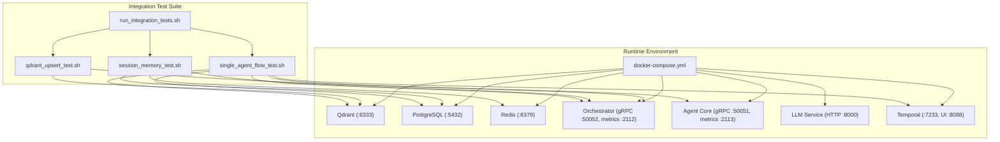
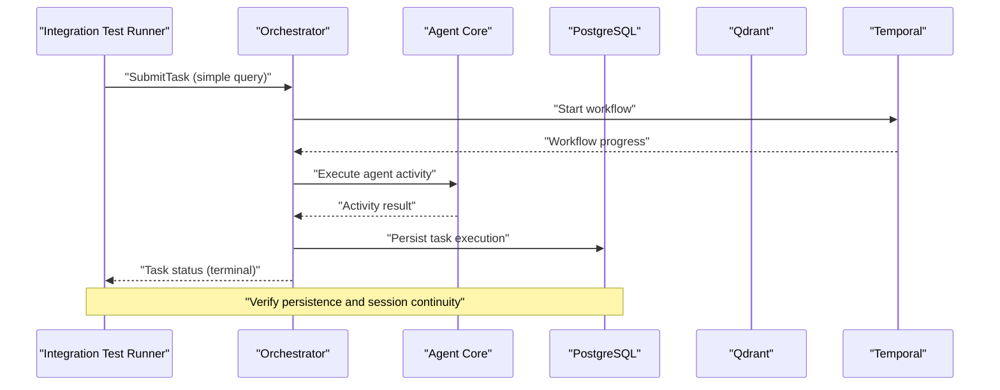
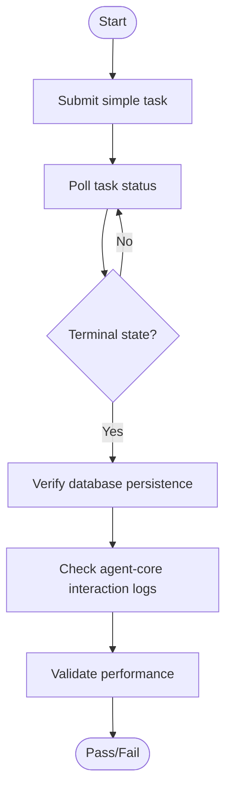
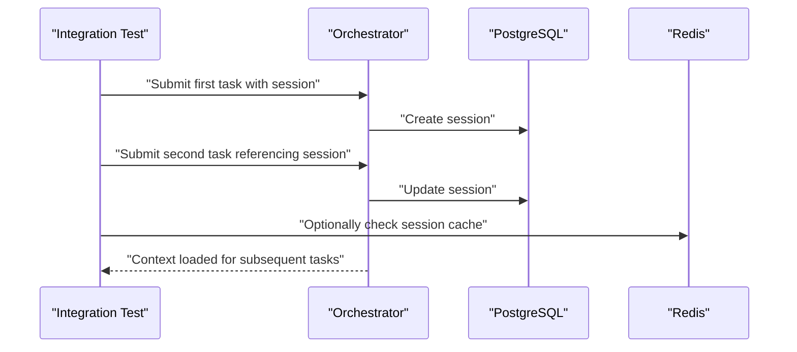
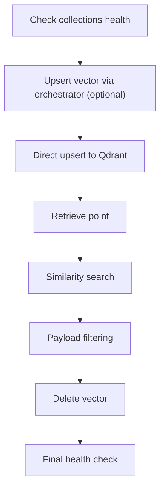
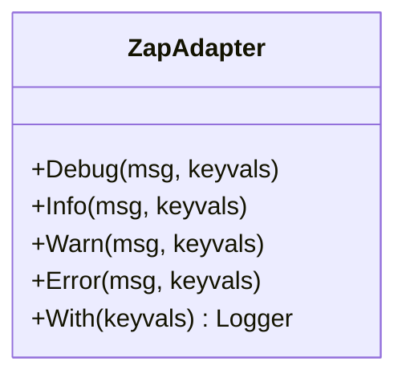
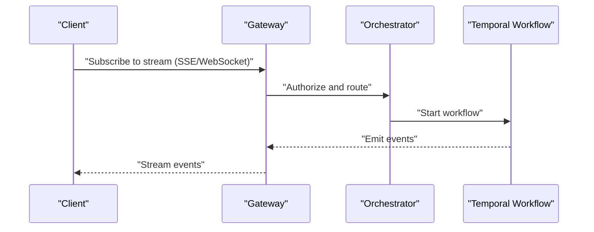
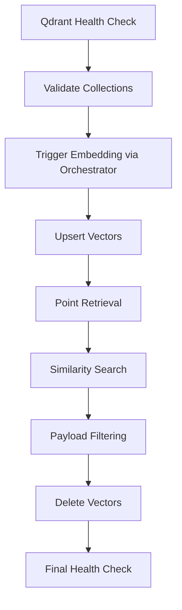
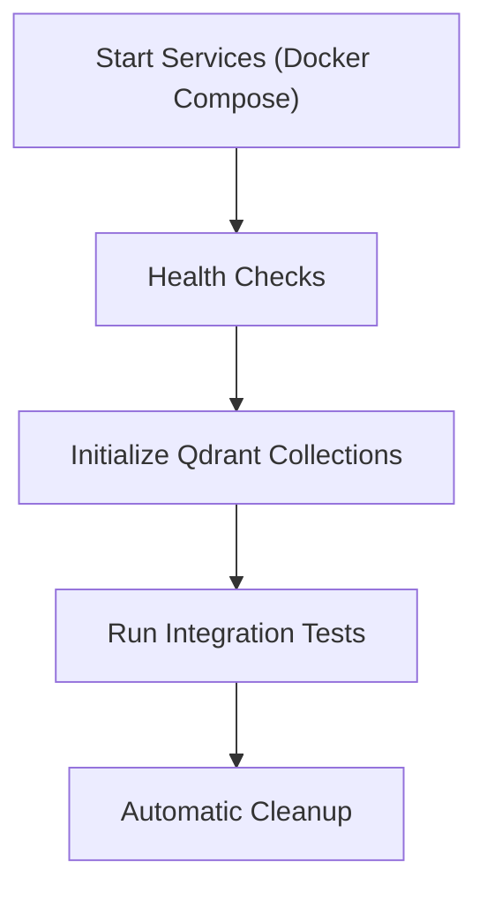
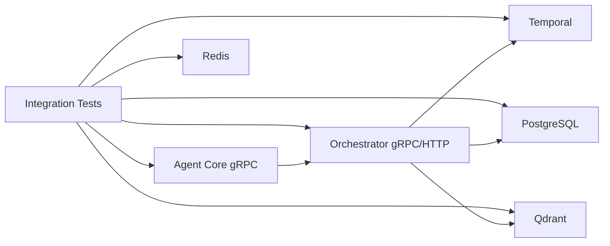

# Integration Testing

<cite>
**Referenced Files in This Document**
- [tests/integration/README.md](file://tests/integration/README.md)
- [tests/integration/run_integration_tests.sh](file://tests/integration/run_integration_tests.sh)
- [tests/integration/single_agent_flow_test.sh](file://tests/integration/single_agent_flow_test.sh)
- [tests/integration/session_memory_test.sh](file://tests/integration/session_memory_test.sh)
- [tests/integration/qdrant_upsert_test.sh](file://tests/integration/qdrant_upsert_test.sh)
- [go/orchestrator/internal/temporal/adapter.go](file://go/orchestrator/internal/temporal/adapter.go)
- [deploy/compose/docker-compose.yml](file://deploy/compose/docker-compose.yml)
- [scripts/init-qdrant-collections.sh](file://scripts/init-qdrant-collections.sh)
- [migrations/qdrant/create_collections.py](file://migrations/qdrant/create_collections.py)
- [python/llm-service/main.py](file://python/llm-service/main.py)
- [go/orchestrator/cmd/gateway/internal/handlers/session_events_test.go](file://go/orchestrator/cmd/gateway/internal/handlers/session_events_test.go)
- [go/orchestrator/internal/db/client.go](file://go/orchestrator/internal/db/client.go)
- [go/orchestrator/internal/vectordb/client.go](file://go/orchestrator/internal/vectordb/client.go)
- [go/orchestrator/internal/vectordb/search.go](file://go/orchestrator/internal/vectordb/search.go)
- [go/orchestrator/internal/workflows/template_workflow_test.go](file://go/orchestrator/internal/workflows/template_workflow_test.go)
- [go/orchestrator/internal/workflows/cognitive_workflows_test.go](file://go/orchestrator/internal/workflows/cognitive_workflows_test.go)
- [go/orchestrator/internal/workflows/patterns/patterns_exec_test.go](file://go/orchestrator/internal/workflows/patterns/patterns_exec_test.go)
- [go/orchestrator/internal/workflows/strategies/provider_override_test.go](file://go/orchestrator/internal/workflows/strategies/provider_override_test.go)
- [go/orchestrator/internal/workflows/strategies/scientific.go](file://go/orchestrator/internal/workflows/strategies/scientific.go)
- [go/orchestrator/internal/workflows/strategies/react.go](file://go/orchestrator/internal/workflows/strategies/react.go)
- [go/orchestrator/internal/workflows/strategies/browser_use.go](file://go/orchestrator/internal/workflows/strategies/browser_use.go)
- [go/orchestrator/internal/workflows/strategies/exploratory.go](file://go/orchestrator/internal/workflows/strategies/exploratory.go)
- [go/orchestrator/internal/workflows/strategies/dag.go](file://go/orchestrator/internal/workflows/strategies/dag.go)
- [go/orchestrator/internal/workflows/strategies/reflect.go](file://go/orchestrator/internal/workflows/strategies/reflect.go)
- [go/orchestrator/internal/workflows/strategies/tree_of_thoughts.go](file://go/orchestrator/internal/workflows/strategies/tree_of_thoughts.go)
- [go/orchestrator/internal/workflows/strategies/debate.go](file://go/orchestrator/internal/workflows/strategies/debate.go)
- [go/orchestrator/internal/workflows/strategies/options.go](file://go/orchestrator/internal/workflows/strategies/options.go)
- [go/orchestrator/internal/workflows/strategies/registry_test.go](file://go/orchestrator/internal/workflows/strategies/registry_test.go)
- [go/orchestrator/internal/workflows/strategies/registry.go](file://go/orchestrator/internal/workflows/strategies/registry.go)
- [go/orchestrator/internal/workflows/strategies/wrappers.go](file://go/orchestrator/internal/workflows/strategies/wrappers.go)
- [go/orchestrator/internal/workflows/strategies/types.go](file://go/orchestrator/internal/workflows/strategies/types.go)
- [go/orchestrator/internal/workflows/strategies/strategy_helpers.go](file://go/orchestrator/internal/workflows/strategies/strategy_helpers.go)
- [go/orchestrator/internal/workflows/strategies/strategies_exec_test.go](file://go/orchestrator/internal/workflows/strategies/strategies_exec_test.go)
- [go/orchestrator/internal/workflows/strategies/strategies_simple_test.go](file://go/orchestrator/internal/workflows/strategies/strategies_simple_test.go)
- [go/orchestrator/internal/workflows/strategies/provider_override_test.go](file://go/orchestrator/internal/workflows/strategies/provider_override_test.go)
- [go/orchestrator/internal/workflows/strategies/strategies_exec_test.go](file://go/orchestrator/internal/workflows/strategies/strategies_exec_test.go)
- [go/orchestrator/internal/workflows/strategies/strategies_simple_test.go](file://go/orchestrator/internal/workflows/strategies/strategies_simple_test.go)
- [go/orchestrator/internal/workflows/strategies/registry_test.go](file://go/orchestrator/internal/workflows/strategies/registry_test.go)
- [go/orchestrator/internal/workflows/strategies/registry.go](file://go/orchestrator/internal/workflows/strategies/registry.go)
- [go/orchestrator/internal/workflows/strategies/wrappers.go](file://go/orchestrator/internal/workflows/strategies/wrappers.go)
- [go/orchestrator/internal/workflows/strategies/types.go](file://go/orchestrator/internal/workflows/strategies/types.go)
- [go/orchestrator/internal/workflows/strategies/strategy_helpers.go](file://go/orchestrator/internal/workflows/strategies/strategy_helpers.go)
- [go/orchestrator/internal/workflows/strategies/strategies_exec_test.go](file://go/orchestrator/internal/workflows/strategies/strategies_exec_test.go)
- [go/orchestrator/internal/workflows/strategies/strategies_simple_test.go](file://go/orchestrator/internal/workflows/strategies/strategies_simple_test.go)
- [go/orchestrator/internal/workflows/strategies/provider_override_test.go](file://go/orchestrator/internal/workflows/strategies/provider_override_test.go)
- [go/orchestrator/internal/workflows/strategies/strategies_exec_test.go](file://go/orchestrator/internal/workflows/strategies/strategies_exec_test.go)
- [go/orchestrator/internal/workflows/strategies/strategies_simple_test.go](file://go/orchestrator/internal/workflows/strategies/strategies_simple_test.go)
- [go/orchestrator/internal/workflows/strategies/registry_test.go](file://go/orchestrator/internal/workflows/strategies/registry_test.go)
- [go/orchestrator/internal/workflows/strategies/registry.go](file://go/orchestrator/internal/workflows/strategies/registry.go)
- [go/orchestrator/internal/workflows/strategies/wrappers.go](file://go/orchestrator/internal/workflows/strategies/wrappers.go)
- [go/orchestrator/internal/workflows/strategies/types.go](file://go/orchestrator/internal/workflows/strategies/types.go)
- [go/orchestrator/internal/workflows/strategies/strategy_helpers.go](file://go/orchestrator/internal/workflows/strategies/strategy_helpers.go)
- [go/orchestrator/internal/workflows/strategies/strategies_exec_test.go](file://go/orchestrator/internal/workflows/strategies/strategies_exec_test.go)
- [go/orchestrator/internal/workflows/strategies/strategies_simple_test.go](file://go/orchestrator/internal/workflows/strategies/strategies_simple_test.go)
- [go/orchestrator/internal/workflows/strategies/provider_override_test.go](file://go/orchestrator/internal/workflows/strategies/provider_override_test.go)
- [go/orchestrator/internal/workflows/strategies/strategies_exec_test.go](file://go/orchestrator/internal/workflows/strategies/strategies_exec_test.go)
- [go/orchestrator/internal/workflows/strategies/strategies_simple_test.go](file://go/orchestrator/internal/workflows/strategies/strategies_simple_test.go)
- [go/orchestrator/internal/workflows/strategies/registry_test.go](file://go/orchestrator/internal/workflows/strategies/registry_test.go)
- [go/orchestrator/internal/workflows/strategies/registry.go](file://go/orchestrator/internal/workflows/strategies/registry.go)
- [go/orchestrator/internal/workflows/strategies/wrappers.go](file://go/orchestrator/internal/workflows/strategies/wrappers.go)
- [go/orchestrator/internal/workflows/strategies/types.go](file://go/orchestrator/internal/workflows/strategies/types.go)
- [go/orchestrator/internal/workflows/strategies/strategy_helpers.go](file://go/orchestrator/internal/workflows/strategies/strategy_helpers.go)
- [go/orchestrator/internal/workflows/strategies/strategies_exec_test.go](file://go/orchestrator/internal/workflows/strategies/strategies_exec_test.go)
- [go/orchestrator/internal/workflows/strategies/strategies_simple_test.go](file://go/orchestrator/internal/workflows/strategies/strategies_simple_test.go)
- [go/orchestrator/internal/workflows/strategies/provider_override_test.go](file://go/orchestrator/internal/workflows/strategies/provider_override_test.go)
- [go/orchestrator/internal/workflows/strategies/strategies_exec_test.go](file://go/orchestrator/internal/workflows/strategies/strategies_exec_test.go)
- [go/orchestrator/internal/workflows/strategies/strategies_simple_test.go](file://go/orchestrator/internal/workflows/strategies/strategies_simple_test.go)
- [go/orchestrator/internal/workflows/strategies/registry_test.go](file://go/orchestrator/internal/workflows/strategies/registry_test.go)
- [go/orchestrator/internal/workflows/strategies/registry.go](file://go/orchestrator/internal/workflows/strategies/registry.go)
- [go/orchestrator/internal/workflows/strategies/wrappers.go](file://go/orchestrator/internal/workflows/strategies/wrappers.go)
- [go/orchestrator/internal/workflows/strategies/types.go](file://go/orchestrator/internal/workflows/strategies/types.go)
- [go/orchestrator/internal/workflows/strategies/strategy_helpers.go](file://go/orchestrator/internal/workflows/strategies/strategy_helpers.go)
- [go/orchestrator/internal/workflows/strategies/strategies_exec_test.go](file://go/orchestrator/internal/workflows/strategies/strategies_exec_test.go)
- [go/orchestrator/internal/workflows/strategies/strategies_simple_test.go](file://go/orchestrator/internal/workflows/strategies/strategies_simple_test.go)
- [go/orchestrator/internal/workflows/strategies/provider_override_test.go](file://go/orchestrator/internal/workflows/strategies/provider_override_test.go)
- [go/orchestrator/internal/workflows/strategies/strategies_exec_test.go](file://go/orchestrator/internal/workflows/strategies/strategies_exec_test.go)
- [go/orchestrator/internal/workflows/strategies/strategies_simple_test.go](file://go/orchestrator/internal/workflows/strategies/strategies_simple_test.go)
- [go/orchestrator/internal/workflows/strategies/registry_test.go](file://go/orchestrator/internal/workflows/strategies/registry_test.go)
- [go/orchestrator/internal/workflows/strategies/registry.go](file://go/orchestrator/internal/workflows/strategies/registry.go)
- [go/orchestrator/internal/workflows/strategies/wrappers.go](file://go/orchestrator/internal/workflows/strategies/wrappers.go)
- [go/orchestrator/internal/workflows/strategies/types.go](file://go/orchestrator/internal/workflows/strategies/types.go)
- [go/orchestrator/internal/workflows/strategies/strategy_helpers.go](file://go/orchestrator/internal/workflows/strategies/strategy_helpers.go)
- [go/orchestrator/internal/workflows/strategies/strategies_exec_test.go](file://go/orchestrator/internal/workflows/strategies/strategies_exec_test.go)
- [go/orchestrator/internal/workflows/strategies/strategies_simple_test.go](file://go/orchestrator/internal/workflows/strategies/strategies_simple_test.go)
- [go/orchestrator/internal/workflows/strategies/provider_override_test.go](file://go/orchestrator/internal/workflows/strategies/provider_override_test.go)
- [go/orchestrator/internal/workflows/strategies/strategies_exec_test.go](file://go/orchestrator/internal/workflows/strategies/strategies_exec_test.go)
- [go/orchestrator/internal/workflows/strategies/strategies_simple_test.go](file://go/orchestrator/internal/workflows/strategies/strategies_simple_test.go)
- [go/orchestrator/internal/workflows/strategies/registry_test.go](file://go/orchestrator/internal/workflows/str......)
</cite>

## Table of Contents
1. [Introduction](#introduction)
2. [Project Structure](#project-structure)
3. [Core Components](#core-components)
4. [Architecture Overview](#architecture-overview)
5. [Detailed Component Analysis](#detailed-component-analysis)
6. [Dependency Analysis](#dependency-analysis)
7. [Performance Considerations](#performance-considerations)
8. [Troubleshooting Guide](#troubleshooting-guide)
9. [Conclusion](#conclusion)
10. [Appendices](#appendices)

## Introduction
This document provides comprehensive integration testing guidance for Shannon’s cross-service interactions. It focuses on validating service-to-service communication among the orchestrator, agent-core, and LLM service components, alongside database connectivity, Redis stream testing, session memory persistence, vector database operations with Qdrant, and Temporal workflow integration. It also includes practical examples of testing complete workflow execution paths, environment configuration, data seeding strategies, cleanup procedures, and guidelines for reliable integration tests that simulate realistic distributed system behavior.

## Project Structure
The integration tests are organized as a cohesive suite that exercises end-to-end flows across services. The suite is orchestrated by a runner script that validates prerequisites, executes individual tests, and aggregates results. Supporting scripts initialize Qdrant collections and manage environment setup.

**Diagram sources**
- [tests/integration/run_integration_tests.sh](file://tests/integration/run_integration_tests.sh#L1-L158)
- [tests/integration/single_agent_flow_test.sh](file://tests/integration/single_agent_flow_test.sh#L1-L155)
- [tests/integration/session_memory_test.sh](file://tests/integration/session_memory_test.sh#L1-L227)
- [tests/integration/qdrant_upsert_test.sh](file://tests/integration/qdrant_upsert_test.sh#L1-L266)
- [deploy/compose/docker-compose.yml](file://deploy/compose/docker-compose.yml)

**Section sources**
- [tests/integration/README.md](file://tests/integration/README.md#L1-L238)
- [tests/integration/run_integration_tests.sh](file://tests/integration/run_integration_tests.sh#L1-L158)

## Core Components
- Integration test runner: orchestrates prerequisite checks, executes tests, and reports results.
- Single agent flow test: validates a simple task end-to-end through the orchestrator, including database persistence and agent-core interaction.
- Session memory test: validates session creation, persistence, continuity across tasks, and Redis caching behavior.
- Qdrant vector database test: validates collection health, upsert, retrieval, similarity search, payload filtering, and deletion.
- Temporal adapter: bridges logging between orchestrator and Temporal for consistent observability.

**Section sources**
- [tests/integration/README.md](file://tests/integration/README.md#L65-L125)
- [tests/integration/run_integration_tests.sh](file://tests/integration/run_integration_tests.sh#L66-L112)
- [go/orchestrator/internal/temporal/adapter.go](file://go/orchestrator/internal/temporal/adapter.go#L1-L90)

## Architecture Overview
The integration tests exercise the following end-to-end flows:
- Simple task submission to the orchestrator, monitored until terminal state, persisted to the database, and validated for agent-core interaction.
- Session-based multi-task continuity with persistence and optional Redis caching.
- Vector operations via Qdrant, including embedding-triggered upserts and downstream similarity search.

**Diagram sources**
- [tests/integration/single_agent_flow_test.sh](file://tests/integration/single_agent_flow_test.sh#L33-L106)
- [go/orchestrator/internal/db/client.go](file://go/orchestrator/internal/db/client.go)

**Section sources**
- [tests/integration/single_agent_flow_test.sh](file://tests/integration/single_agent_flow_test.sh#L33-L106)

## Detailed Component Analysis

### Single Agent Flow Integration Test
This test validates the simplest end-to-end path for a task:
- Submits a simple query to the orchestrator via gRPC.
- Polls task status until terminal state.
- Verifies database persistence and agent-core interaction logs.
- Performs a performance check for quick completion.

**Diagram sources**
- [tests/integration/single_agent_flow_test.sh](file://tests/integration/single_agent_flow_test.sh#L33-L129)

**Section sources**
- [tests/integration/single_agent_flow_test.sh](file://tests/integration/single_agent_flow_test.sh#L67-L84)
- [tests/integration/single_agent_flow_test.sh](file://tests/integration/single_agent_flow_test.sh#L96-L106)
- [tests/integration/single_agent_flow_test.sh](file://tests/integration/single_agent_flow_test.sh#L108-L117)
- [tests/integration/single_agent_flow_test.sh](file://tests/integration/single_agent_flow_test.sh#L119-L129)

### Session Memory Persistence Integration Test
This test validates session continuity across multiple tasks:
- Creates a session and submits the first task.
- Verifies session presence in the database.
- Submits follow-up tasks and checks context continuity.
- Confirms session updates and optional Redis caching.

**Diagram sources**
- [tests/integration/session_memory_test.sh](file://tests/integration/session_memory_test.sh#L39-L147)
- [tests/integration/session_memory_test.sh](file://tests/integration/session_memory_test.sh#L149-L162)

**Section sources**
- [tests/integration/session_memory_test.sh](file://tests/integration/session_memory_test.sh#L80-L87)
- [tests/integration/session_memory_test.sh](file://tests/integration/session_memory_test.sh#L129-L138)
- [tests/integration/session_memory_test.sh](file://tests/integration/session_memory_test.sh#L149-L162)

### Qdrant Vector Database Integration Test
This test validates vector operations:
- Ensures collection health and initial statistics.
- Attempts embedding generation via orchestrator and verifies task completion.
- Performs direct upsert to Qdrant, retrieval, similarity search, payload filtering, and deletion.
- Confirms collection remains healthy after operations.

**Diagram sources**
- [tests/integration/qdrant_upsert_test.sh](file://tests/integration/qdrant_upsert_test.sh#L46-L101)
- [tests/integration/qdrant_upsert_test.sh](file://tests/integration/qdrant_upsert_test.sh#L103-L143)
- [tests/integration/qdrant_upsert_test.sh](file://tests/integration/qdrant_upsert_test.sh#L145-L201)
- [tests/integration/qdrant_upsert_test.sh](file://tests/integration/qdrant_upsert_test.sh#L203-L230)

**Section sources**
- [tests/integration/qdrant_upsert_test.sh](file://tests/integration/qdrant_upsert_test.sh#L46-L59)
- [tests/integration/qdrant_upsert_test.sh](file://tests/integration/qdrant_upsert_test.sh#L103-L143)
- [tests/integration/qdrant_upsert_test.sh](file://tests/integration/qdrant_upsert_test.sh#L145-L201)
- [tests/integration/qdrant_upsert_test.sh](file://tests/integration/qdrant_upsert_test.sh#L203-L230)

### Temporal Workflow Integration
The orchestrator integrates with Temporal for workflow execution. Logging bridging ensures consistent observability across services.

**Diagram sources**
- [go/orchestrator/internal/temporal/adapter.go](file://go/orchestrator/internal/temporal/adapter.go#L11-L81)

**Section sources**
- [go/orchestrator/internal/temporal/adapter.go](file://go/orchestrator/internal/temporal/adapter.go#L1-L90)

### Streaming and Event Propagation
While the integration tests focus on end-to-end flows, streaming and event propagation are exercised in dedicated tests and workflows. These include:
- SSE and WebSocket streaming endpoints guarded by authentication middleware.
- Session event tests validating event ingestion and propagation.
- Template and cognitive workflow tests ensuring proper control signals and child workflow behavior.

**Diagram sources**
- [go/orchestrator/cmd/gateway/internal/middleware/auth_validation_middleware_test.go](file://go/orchestrator/cmd/gateway/internal/middleware/auth_validation_middleware_test.go#L72-L109)
- [go/orchestrator/cmd/gateway/internal/handlers/session_events_test.go](file://go/orchestrator/cmd/gateway/internal/handlers/session_events_test.go)

**Section sources**
- [go/orchestrator/cmd/gateway/internal/middleware/auth_validation_middleware_test.go](file://go/orchestrator/cmd/gateway/internal/middleware/auth_validation_middleware_test.go#L72-L109)
- [go/orchestrator/cmd/gateway/internal/handlers/session_events_test.go](file://go/orchestrator/cmd/gateway/internal/handlers/session_events_test.go)

### Vector Database Operations with Qdrant
Vector operations are validated through orchestrator-driven embedding generation and direct Qdrant manipulation. The orchestrator coordinates with the LLM service to produce embeddings and persists vector data for downstream similarity search.

**Diagram sources**
- [tests/integration/qdrant_upsert_test.sh](file://tests/integration/qdrant_upsert_test.sh#L20-L34)
- [tests/integration/qdrant_upsert_test.sh](file://tests/integration/qdrant_upsert_test.sh#L103-L143)
- [tests/integration/qdrant_upsert_test.sh](file://tests/integration/qdrant_upsert_test.sh#L145-L201)
- [tests/integration/qdrant_upsert_test.sh](file://tests/integration/qdrant_upsert_test.sh#L203-L230)

**Section sources**
- [go/orchestrator/internal/vectordb/client.go](file://go/orchestrator/internal/vectordb/client.go)
- [go/orchestrator/internal/vectordb/search.go](file://go/orchestrator/internal/vectordb/search.go)

### Test Environment Configuration and Data Seeding
- Services are managed via Docker Compose and must be healthy before running tests.
- Qdrant collections are initialized using dedicated scripts and Python migration utilities.
- Test data is seeded with unique identifiers and cleaned up automatically; manual cleanup commands are provided.

**Diagram sources**
- [tests/integration/README.md](file://tests/integration/README.md#L13-L33)
- [scripts/init-qdrant-collections.sh](file://scripts/init-qdrant-collections.sh)
- [migrations/qdrant/create_collections.py](file://migrations/qdrant/create_collections.py)

**Section sources**
- [tests/integration/README.md](file://tests/integration/README.md#L13-L33)
- [tests/integration/README.md](file://tests/integration/README.md#L209-L227)

## Dependency Analysis
The integration tests depend on:
- Orchestrator gRPC and HTTP endpoints for task submission and status polling.
- Agent Core health and availability for agent interactions.
- PostgreSQL for task execution persistence.
- Redis for optional session caching.
- Qdrant for vector operations.
- Temporal for workflow orchestration.

**Diagram sources**
- [tests/integration/run_integration_tests.sh](file://tests/integration/run_integration_tests.sh#L28-L48)
- [tests/integration/single_agent_flow_test.sh](file://tests/integration/single_agent_flow_test.sh#L23-L29)
- [tests/integration/session_memory_test.sh](file://tests/integration/session_memory_test.sh#L23-L26)
- [tests/integration/qdrant_upsert_test.sh](file://tests/integration/qdrant_upsert_test.sh#L23-L32)

**Section sources**
- [tests/integration/run_integration_tests.sh](file://tests/integration/run_integration_tests.sh#L28-L48)

## Performance Considerations
- Tests include performance checks for simple tasks to ensure reasonable response times.
- Vector operations account for eventual consistency; tests include brief waits and validation of collection statistics.
- Streaming tests validate real-time event propagation and client subscription behavior.

[No sources needed since this section provides general guidance]

## Troubleshooting Guide
Common issues and remedies:
- Service connectivity: verify Docker Compose services are running and ports are accessible.
- Database connectivity: confirm PostgreSQL is reachable and recent sessions exist.
- Qdrant health: ensure readiness endpoints respond and collections exist.
- Agent Core health: validate gRPC health checks.
- Cleanup: remove test vectors and sessions using provided commands.

**Section sources**
- [tests/integration/README.md](file://tests/integration/README.md#L150-L186)
- [tests/integration/README.md](file://tests/integration/README.md#L218-L227)

## Conclusion
The integration tests comprehensively validate Shannon’s cross-service interactions, covering end-to-end task execution, session memory continuity, vector database operations, and Temporal workflow orchestration. By following the documented setup, execution, and troubleshooting procedures, teams can reliably validate system behavior under realistic conditions and maintain confidence in production deployments.

[No sources needed since this section summarizes without analyzing specific files]

## Appendices

### Practical Examples of Complete Workflow Execution Paths
- Simple task: submit a query, monitor until terminal state, verify persistence, and validate agent-core interaction.
- Session continuity: create a session, submit multiple tasks, verify persistence and context retrieval, and optionally check Redis caching.
- Vector operations: initialize collections, upsert vectors, retrieve points, perform similarity search, apply payload filters, delete vectors, and re-validate collection health.

**Section sources**
- [tests/integration/single_agent_flow_test.sh](file://tests/integration/single_agent_flow_test.sh#L33-L106)
- [tests/integration/session_memory_test.sh](file://tests/integration/session_memory_test.sh#L39-L162)
- [tests/integration/qdrant_upsert_test.sh](file://tests/integration/qdrant_upsert_test.sh#L46-L230)

### Guidelines for Writing Reliable Integration Tests
- Use unique identifiers for test data to avoid collisions.
- Validate prerequisites before executing tests.
- Include cleanup procedures for test artifacts.
- Account for eventual consistency in distributed systems.
- Leverage health checks and readiness endpoints.
- Document expected outcomes and failure modes.

**Section sources**
- [tests/integration/README.md](file://tests/integration/README.md#L229-L237)