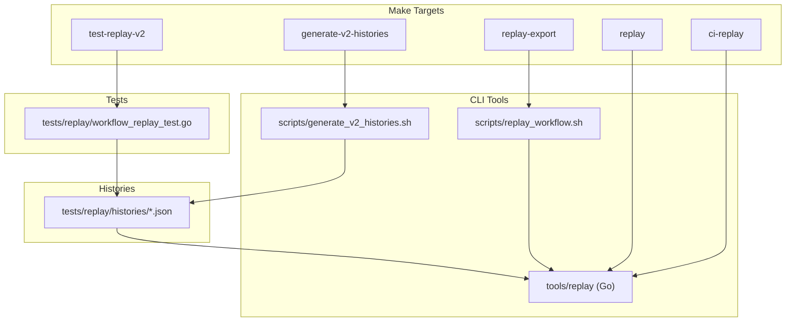
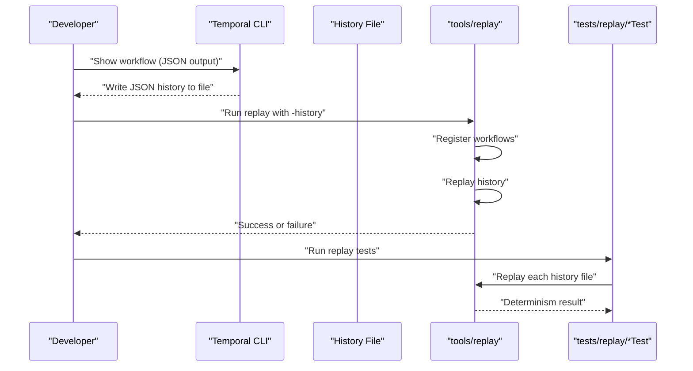
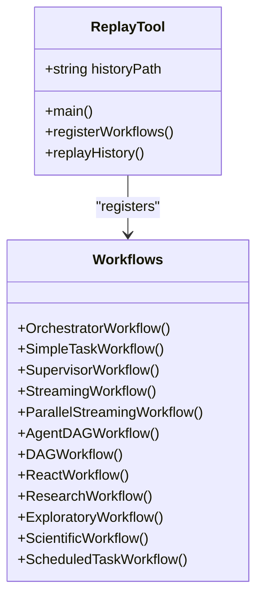
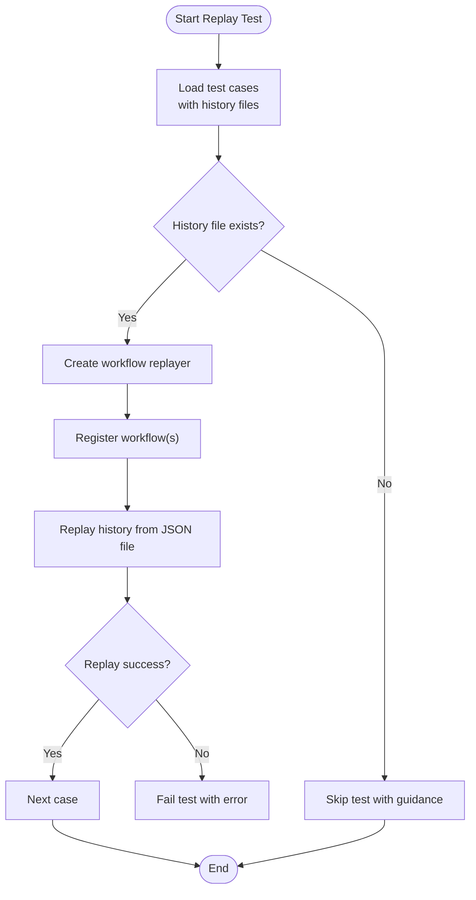
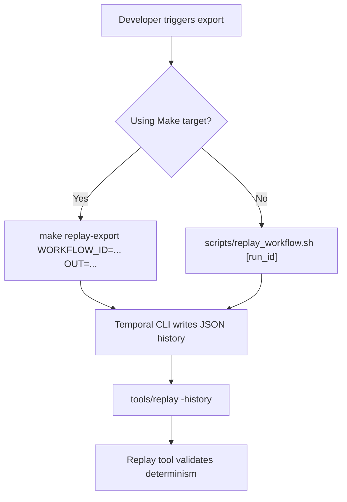
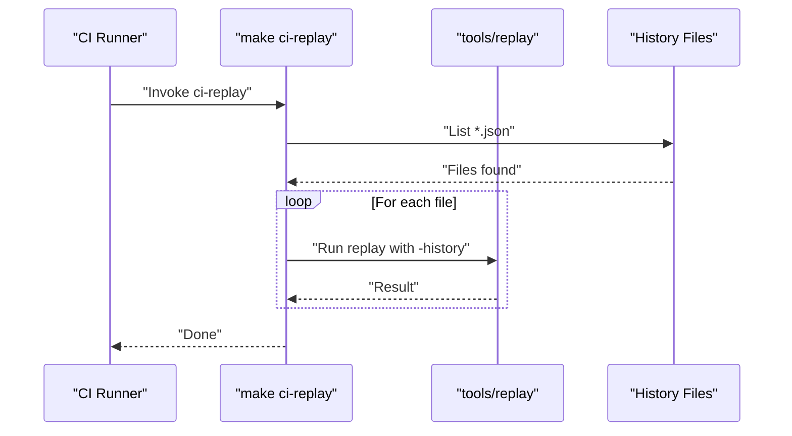
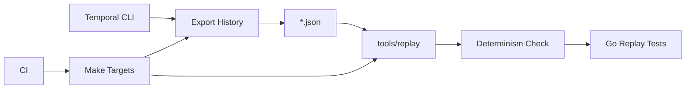

# Temporal Workflow Replay Testing

<cite>
**Referenced Files in This Document**
- [workflow_replay_test.go](file://go/orchestrator/tests/replay/workflow_replay_test.go)
- [generate_v2_histories.sh](file://go/orchestrator/scripts/generate_v2_histories.sh)
- [replay_workflow.sh](file://scripts/replay_workflow.sh)
- [main.go](file://go/orchestrator/tools/replay/main.go)
- [README.md](file://go/orchestrator/histories/README.md)
- [Makefile](file://Makefile)
- [types.go](file://go/orchestrator/internal/workflows/strategies/types.go)
</cite>

## Table of Contents
1. [Introduction](#introduction)
2. [Project Structure](#project-structure)
3. [Core Components](#core-components)
4. [Architecture Overview](#architecture-overview)
5. [Detailed Component Analysis](#detailed-component-analysis)
6. [Dependency Analysis](#dependency-analysis)
7. [Performance Considerations](#performance-considerations)
8. [Troubleshooting Guide](#troubleshooting-guide)
9. [Conclusion](#conclusion)
10. [Appendices](#appendices)

## Introduction
This document explains how Shannon implements deterministic replay testing for Temporal workflows. It covers how workflow histories are exported, stored, replayed, and integrated into CI to prevent regressions and ensure backward compatibility. The approach centers on:
- Exporting completed workflow histories from Temporal
- Storing them as JSON files in the repository
- Using Temporal’s workflow replayer to validate determinism against current code
- Automating replay checks in CI to catch breaking changes early

## Project Structure
The replay testing system spans several areas:
- History storage and generation scripts
- A dedicated replay tool for validating histories
- Go-based replay tests that exercise multiple workflow variants
- Make targets to export, replay, and integrate with CI

**Diagram sources**
- [workflow_replay_test.go](file://go/orchestrator/tests/replay/workflow_replay_test.go#L1-L98)
- [generate_v2_histories.sh](file://go/orchestrator/scripts/generate_v2_histories.sh#L1-L80)
- [replay_workflow.sh](file://scripts/replay_workflow.sh#L1-L33)
- [main.go](file://go/orchestrator/tools/replay/main.go#L1-L49)
- [Makefile](file://Makefile#L145-L258)

**Section sources**
- [Makefile](file://Makefile#L145-L258)
- [README.md](file://go/orchestrator/histories/README.md#L1-L38)

## Core Components
- Workflow history export and replay tooling
  - The replay tool loads a history file and replays it against all registered workflows to detect non-determinism.
  - Export scripts and Make targets capture histories from a running Temporal cluster.
- Deterministic replay tests
  - Go tests iterate over curated history files and assert replay succeeds for each workflow type.
- CI integration
  - A CI target iterates over all history files and replays them automatically.

Key responsibilities:
- Export histories from completed workflows
- Store histories in a versionable location
- Validate determinism against current code
- Enforce compatibility across versions

**Section sources**
- [main.go](file://go/orchestrator/tools/replay/main.go#L17-L48)
- [workflow_replay_test.go](file://go/orchestrator/tests/replay/workflow_replay_test.go#L12-L97)
- [Makefile](file://Makefile#L145-L179)

## Architecture Overview
The replay pipeline connects the Temporal CLI, history export, and the replay tool to validate workflow determinism.

**Diagram sources**
- [replay_workflow.sh](file://scripts/replay_workflow.sh#L16-L30)
- [main.go](file://go/orchestrator/tools/replay/main.go#L26-L45)
- [workflow_replay_test.go](file://go/orchestrator/tests/replay/workflow_replay_test.go#L36-L55)

## Detailed Component Analysis

### Replay Tool (tools/replay)
The replay tool registers multiple workflows and replays a given history file. It is used both for manual validation and CI.

**Diagram sources**
- [main.go](file://go/orchestrator/tools/replay/main.go#L17-L48)

**Section sources**
- [main.go](file://go/orchestrator/tools/replay/main.go#L17-L48)

### Replay Tests (tests/replay)
The replay tests define a set of histories and assert that replay succeeds deterministically for each workflow variant. They skip missing files and fail fast on replay errors.

**Diagram sources**
- [workflow_replay_test.go](file://go/orchestrator/tests/replay/workflow_replay_test.go#L36-L55)

**Section sources**
- [workflow_replay_test.go](file://go/orchestrator/tests/replay/workflow_replay_test.go#L12-L97)

### History Export Scripts and Make Targets
- Manual export via Make:
  - Use the replay-export target to export a history from a running Temporal cluster to a JSON file.
  - Optionally specify WORKFLOW_ID, RUN_ID, and OUT to customize the export.
- Direct export via script:
  - The replay_workflow.sh script exports a history using the Temporal CLI and immediately replays it with the replay tool.
- Automated generation for v2 workflows:
  - The generate_v2_histories.sh script submits tasks, waits for completion, and exports curated histories for DAG and ReAct workflows.

**Diagram sources**
- [Makefile](file://Makefile#L145-L172)
- [replay_workflow.sh](file://scripts/replay_workflow.sh#L16-L30)
- [generate_v2_histories.sh](file://go/orchestrator/scripts/generate_v2_histories.sh#L11-L41)

**Section sources**
- [Makefile](file://Makefile#L145-L172)
- [replay_workflow.sh](file://scripts/replay_workflow.sh#L1-L33)
- [generate_v2_histories.sh](file://go/orchestrator/scripts/generate_v2_histories.sh#L1-L80)

### CI Integration
The ci-replay target automates replay across all history files present in the histories directory. It is designed to run in CI to catch regressions automatically.

**Diagram sources**
- [Makefile](file://Makefile#L173-L179)
- [main.go](file://go/orchestrator/tools/replay/main.go#L42-L45)

**Section sources**
- [Makefile](file://Makefile#L173-L179)

## Dependency Analysis
The replay system depends on:
- Temporal CLI for exporting histories
- The replay tool for deterministic validation
- Go tests for orchestrating replay scenarios
- Make targets for automation and CI integration

**Diagram sources**
- [Makefile](file://Makefile#L145-L179)
- [main.go](file://go/orchestrator/tools/replay/main.go#L26-L45)
- [workflow_replay_test.go](file://go/orchestrator/tests/replay/workflow_replay_test.go#L36-L55)

**Section sources**
- [Makefile](file://Makefile#L145-L179)
- [main.go](file://go/orchestrator/tools/replay/main.go#L26-L45)
- [workflow_replay_test.go](file://go/orchestrator/tests/replay/workflow_replay_test.go#L36-L55)

## Performance Considerations
- Keep history files focused and minimal to reduce replay time.
- Prefer representative scenarios over overly large histories.
- Use targeted replay tests to validate specific workflow variants rather than replaying all histories in CI if necessary.

## Troubleshooting Guide
Common issues and resolutions:
- Missing history files
  - Tests skip missing files and suggest generating them via the Make target. Ensure the history directory exists and contains the expected files.
- Non-determinism detected during replay
  - The replay tool reports non-determinism between history and current code. Review recent changes to workflow logic or external dependencies.
- Export failures
  - Verify connectivity to the Temporal cluster and that the workflow ID is correct. Use the replay_workflow.sh script for quick export and replay cycles.
- CI replay skips when no histories are present
  - The ci-replay target silently skips when no history files are found. Ensure histories are generated and placed under the expected directory.

**Section sources**
- [workflow_replay_test.go](file://go/orchestrator/tests/replay/workflow_replay_test.go#L38-L40)
- [main.go](file://go/orchestrator/tools/replay/main.go#L42-L45)
- [Makefile](file://Makefile#L173-L179)

## Conclusion
Shannon’s replay testing system ensures deterministic workflow behavior by capturing histories from completed workflows and replaying them against current code. The combination of Make targets, export scripts, a dedicated replay tool, and automated CI checks provides a robust mechanism to prevent regressions and maintain backward compatibility across workflow versions.

## Appendices

### Practical Examples

- Export a history from a completed workflow
  - Use the Make target to export a history to a JSON file.
  - Alternatively, use the replay_workflow.sh script to export and replay in one step.

- Run replay tests locally
  - Execute the replay tests to validate determinism for curated histories.

- Generate v2 workflow histories
  - Use the v2 history generation script to produce representative histories for DAG and ReAct workflows.

**Section sources**
- [Makefile](file://Makefile#L145-L172)
- [replay_workflow.sh](file://scripts/replay_workflow.sh#L1-L33)
- [generate_v2_histories.sh](file://go/orchestrator/scripts/generate_v2_histories.sh#L1-L80)
- [workflow_replay_test.go](file://go/orchestrator/tests/replay/workflow_replay_test.go#L12-L97)

### Best Practices for Creating Meaningful Test Histories
- Include representative scenarios:
  - Simple tasks, parallel executions, and workflows with reflection to cover diverse control flows.
- Use descriptive filenames:
  - Follow the established naming convention to clearly indicate workflow type and complexity.
- Keep histories current:
  - Regenerate histories after significant workflow changes to avoid stale replays.
- Maintain a curated set:
  - Limit the number of histories to those that meaningfully exercise determinism.

**Section sources**
- [README.md](file://go/orchestrator/histories/README.md#L18-L26)
- [generate_v2_histories.sh](file://go/orchestrator/scripts/generate_v2_histories.sh#L43-L78)

### Naming Conventions and Maintenance Strategies
- Naming convention:
  - Use prefixes indicating workflow type and complexity (e.g., dag_v2_* and react_v2_*).
- Storage:
  - Place histories under the designated histories directory and avoid committing very large or environment-specific files.
- Maintenance:
  - Periodically regenerate histories to reflect current workflow behavior and remove outdated ones.

**Section sources**
- [README.md](file://go/orchestrator/histories/README.md#L18-L26)
- [README.md](file://go/orchestrator/histories/README.md#L27-L36)

### Workflow Versioning, Breaking Change Detection, and Compatibility Testing
- Versioning:
  - Use distinct prefixes (e.g., v2) to separate histories across workflow versions.
- Breaking change detection:
  - Non-determinism during replay signals potential breaking changes in workflow logic or external dependencies.
- Compatibility testing:
  - Run replay tests and ci-replay to validate that existing histories remain replayable after changes.

**Section sources**
- [generate_v2_histories.sh](file://go/orchestrator/scripts/generate_v2_histories.sh#L43-L78)
- [main.go](file://go/orchestrator/tools/replay/main.go#L42-L45)
- [Makefile](file://Makefile#L173-L179)