# Test Utilities and Helpers

<cite>
**Referenced Files in This Document**
- [tests/utils/README.md](file://tests/utils/README.md)
- [tests/utils/test_budget_controls.sh](file://tests/utils/test_budget_controls.sh)
- [tests/utils/test_token_aggregation.sh](file://tests/utils/test_token_aggregation.sh)
- [tests/utils/test_ci_local.sh](file://tests/utils/test_ci_local.sh)
- [tests/utils/test_grpc_reflection.sh](file://tests/utils/test_grpc_reflection.sh)
- [scripts/test_parameter_flow.sh](file://scripts/test_parameter_flow.sh)
- [scripts/test_stream_filtering.py](file://scripts/test_stream_filtering.py)
- [scripts/test_stream_filtering.sh](file://scripts/test_stream_filtering.sh)
- [scripts/bootstrap_qdrant.sh](file://scripts/bootstrap_qdrant.sh)
- [scripts/init_qdrant.sh](file://scripts/init_qdrant.sh)
- [scripts/smoke_e2e.sh](file://scripts/smoke_e2e.sh)
- [scripts/stream_smoke.sh](file://scripts/stream_smoke.sh)
- [tests/README.md](file://tests/README.md)
- [tests/README_E2E_TESTS.md](file://tests/README_E2E_TESTS.md)
- [tests/e2e/README.md](file://tests/e2e/README.md)
- [tests/integration/README.md](file://tests/integration/README.md)
</cite>

## Table of Contents
1. [Introduction](#introduction)
2. [Project Structure](#project-structure)
3. [Core Components](#core-components)
4. [Architecture Overview](#architecture-overview)
5. [Detailed Component Analysis](#detailed-component-analysis)
6. [Dependency Analysis](#dependency-analysis)
7. [Performance Considerations](#performance-considerations)
8. [Troubleshooting Guide](#troubleshooting-guide)
9. [Conclusion](#conclusion)
10. [Appendices](#appendices)

## Introduction
This document describes the comprehensive test utility collection and helper functions used throughout Shannon’s testing infrastructure. It focuses on:
- Budget control testing utilities
- Token aggregation validation helpers
- Parameter flow verification scripts
- Local CI testing utilities
- Stream filtering test helpers
- Practical examples for development and debugging
- Helper functions for test data generation, environment setup, and cleanup
- The role of shell scripts and Python utilities in test automation
- Test environment isolation, resource management, and cross-platform compatibility considerations
- Guidelines for extending the test utility library and maintaining test infrastructure quality

## Project Structure
Shannon’s test infrastructure is organized into:
- tests/utils: targeted feature and development utilities for quick validation
- scripts: reusable automation helpers for parameter flow, streaming, Qdrant bootstrapping, and smoke checks
- tests/e2e and tests/integration: comprehensive suites with detailed READMEs and runner scripts
- Root tests documentation: prerequisites, categories, and CI integration guidance

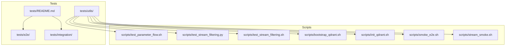

**Diagram sources**
- [tests/utils/README.md](file://tests/utils/README.md#L1-L55)
- [tests/README.md](file://tests/README.md#L1-L109)
- [scripts/test_parameter_flow.sh](file://scripts/test_parameter_flow.sh#L1-L129)
- [scripts/test_stream_filtering.py](file://scripts/test_stream_filtering.py#L1-L125)
- [scripts/test_stream_filtering.sh](file://scripts/test_stream_filtering.sh#L1-L91)
- [scripts/bootstrap_qdrant.sh](file://scripts/bootstrap_qdrant.sh#L1-L23)
- [scripts/init_qdrant.sh](file://scripts/init_qdrant.sh#L1-L22)
- [scripts/smoke_e2e.sh](file://scripts/smoke_e2e.sh#L1-L141)
- [scripts/stream_smoke.sh](file://scripts/stream_smoke.sh#L1-L39)

**Section sources**
- [tests/utils/README.md](file://tests/utils/README.md#L1-L55)
- [tests/README.md](file://tests/README.md#L1-L109)

## Core Components
This section outlines the primary test utility components and their responsibilities.

- Budget control testing
  - Purpose: Validate budget tracking, session limits, and backpressure behavior under token-heavy loads.
  - Key behaviors: Submit multiple tasks, extract task IDs, poll status, and inspect orchestrator logs for budget activity.
  - Typical usage: Run after bringing the stack up and ensuring gRPC endpoints are reachable.

- Token aggregation validation
  - Purpose: Verify token usage aggregation across services and validate metrics exposure.
  - Key behaviors: Submit a task, wait for completion, query task status with metrics, and extract token usage and cost.

- Parameter flow verification
  - Purpose: Validate parameter propagation through HTTP API, gRPC, orchestrator, and downstream services.
  - Key behaviors: Submit tasks with varied parameters (mode, model tier, context), check logs, and verify expected routing and overrides.

- Local CI testing utilities
  - Purpose: Simulate CI environment locally using Docker to validate build and test steps across languages and tools.
  - Key behaviors: Install system dependencies, generate protobufs, build and test Go, Rust, and Python components.

- Stream filtering test helpers
  - Purpose: Validate SSE event type filtering and gateway acceptance of event type filters and Redis stream IDs.
  - Key behaviors: Submit a task, count SSE events with and without filters, verify gateway responses, and confirm Redis stream ID handling.

- Qdrant bootstrapping and initialization
  - Purpose: Ensure required Qdrant collections exist and are initialized for vector operations.
  - Key behaviors: Create collections with appropriate vector sizes and distances; run as part of setup or during CI.

- Smoke and streaming smoke checks
  - Purpose: Rapid health checks for services and streaming endpoints.
  - Key behaviors: Verify UI, gRPC health, task submission, persistence, metrics, MCP tool registration and execution, Qdrant readiness, and Postgres connectivity; test SSE and gRPC streaming.

**Section sources**
- [tests/utils/test_budget_controls.sh](file://tests/utils/test_budget_controls.sh#L1-L42)
- [tests/utils/test_token_aggregation.sh](file://tests/utils/test_token_aggregation.sh#L1-L36)
- [scripts/test_parameter_flow.sh](file://scripts/test_parameter_flow.sh#L1-L129)
- [tests/utils/test_ci_local.sh](file://tests/utils/test_ci_local.sh#L1-L72)
- [scripts/test_stream_filtering.py](file://scripts/test_stream_filtering.py#L1-L125)
- [scripts/test_stream_filtering.sh](file://scripts/test_stream_filtering.sh#L1-L91)
- [scripts/bootstrap_qdrant.sh](file://scripts/bootstrap_qdrant.sh#L1-L23)
- [scripts/init_qdrant.sh](file://scripts/init_qdrant.sh#L1-L22)
- [scripts/smoke_e2e.sh](file://scripts/smoke_e2e.sh#L1-L141)
- [scripts/stream_smoke.sh](file://scripts/stream_smoke.sh#L1-L39)

## Architecture Overview
The test utilities integrate with the broader Shannon stack to validate end-to-end flows, service health, and cross-language parameter propagation. The following diagram maps the primary components and their interactions.

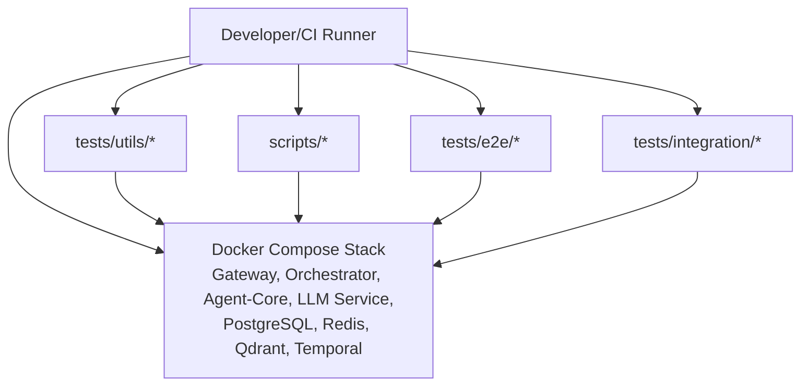

**Diagram sources**
- [tests/utils/README.md](file://tests/utils/README.md#L1-L55)
- [tests/README.md](file://tests/README.md#L1-L109)
- [tests/README_E2E_TESTS.md](file://tests/README_E2E_TESTS.md#L1-L300)
- [tests/e2e/README.md](file://tests/e2e/README.md#L1-L241)
- [tests/integration/README.md](file://tests/integration/README.md#L1-L238)

## Detailed Component Analysis

### Budget Control Testing Utility
Purpose:
- Validate budget tracking and backpressure behavior across multiple requests and heavy-token tasks.

Key behaviors:
- Submit multiple sample tasks and extract task IDs.
- Inspect orchestrator logs for budget-related entries.
- Submit a heavy-token task to trigger backpressure and poll status.

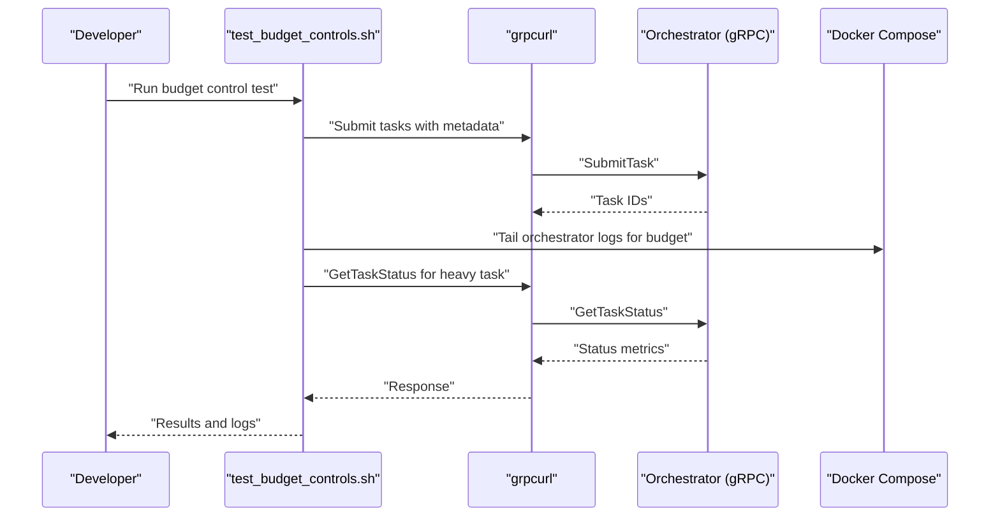

**Diagram sources**
- [tests/utils/test_budget_controls.sh](file://tests/utils/test_budget_controls.sh#L1-L42)

**Section sources**
- [tests/utils/test_budget_controls.sh](file://tests/utils/test_budget_controls.sh#L1-L42)

### Token Aggregation Validation Utility
Purpose:
- Verify token usage aggregation and cost reporting via task status metrics.

Key behaviors:
- Submit a task and capture workflow ID.
- Wait for completion and query task status with metrics.
- Extract total tokens and cost for validation.

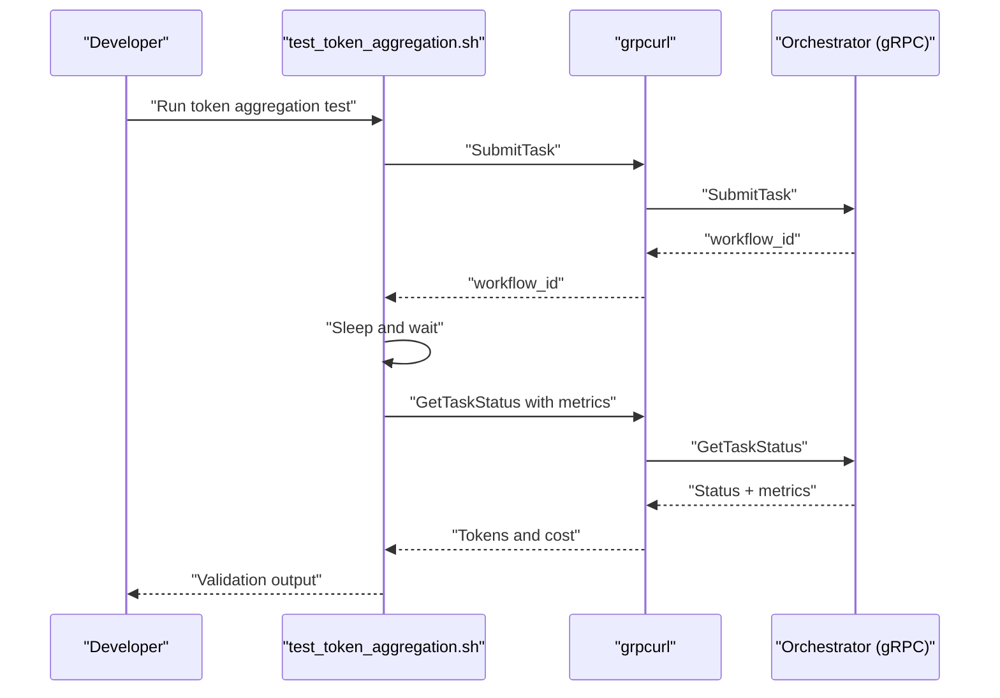

**Diagram sources**
- [tests/utils/test_token_aggregation.sh](file://tests/utils/test_token_aggregation.sh#L1-L36)

**Section sources**
- [tests/utils/test_token_aggregation.sh](file://tests/utils/test_token_aggregation.sh#L1-L36)

### Parameter Flow Verification Script
Purpose:
- Validate parameter propagation across HTTP API, gRPC, orchestrator, and downstream services.

Key behaviors:
- Define helper to submit tasks and check logs.
- Test multiple scenarios: mode routing, model tier injection (top-level and context), template aliases, combined parameters, and Rust tier override.
- Provide manual verification steps for Temporal UI, Grafana, and service logs.

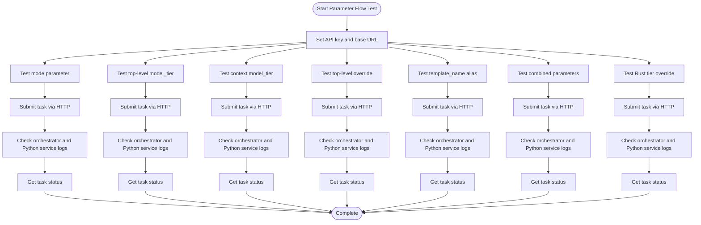

**Diagram sources**
- [scripts/test_parameter_flow.sh](file://scripts/test_parameter_flow.sh#L1-L129)

**Section sources**
- [scripts/test_parameter_flow.sh](file://scripts/test_parameter_flow.sh#L1-L129)

### Local CI Testing Utility
Purpose:
- Simulate CI environment locally using Docker to validate build and test steps for Go, Rust, and Python.

Key behaviors:
- Run Ubuntu 22.04 container with required tools.
- Install Go, Rust, Python, and Buf.
- Generate protobufs, build and test Go, build and test Rust, and run Python tests.

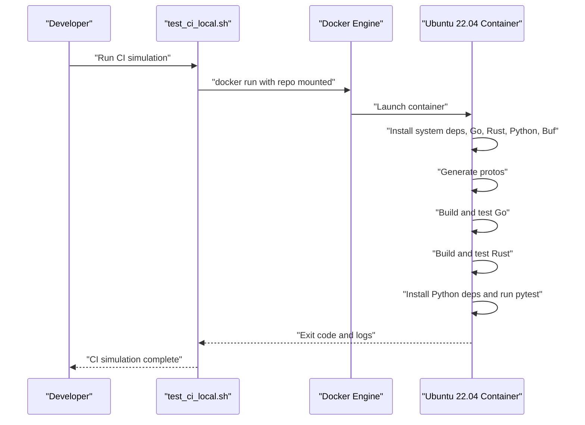

**Diagram sources**
- [tests/utils/test_ci_local.sh](file://tests/utils/test_ci_local.sh#L1-L72)

**Section sources**
- [tests/utils/test_ci_local.sh](file://tests/utils/test_ci_local.sh#L1-L72)

### Stream Filtering Test Helpers (Python)
Purpose:
- Validate SSE event type filtering and gateway acceptance of event type filters and Redis stream IDs.

Key behaviors:
- Submit a task and wait for completion.
- Count SSE events with and without filters.
- Verify gateway does not reject valid event types.
- Confirm gateway accepts Redis stream IDs.

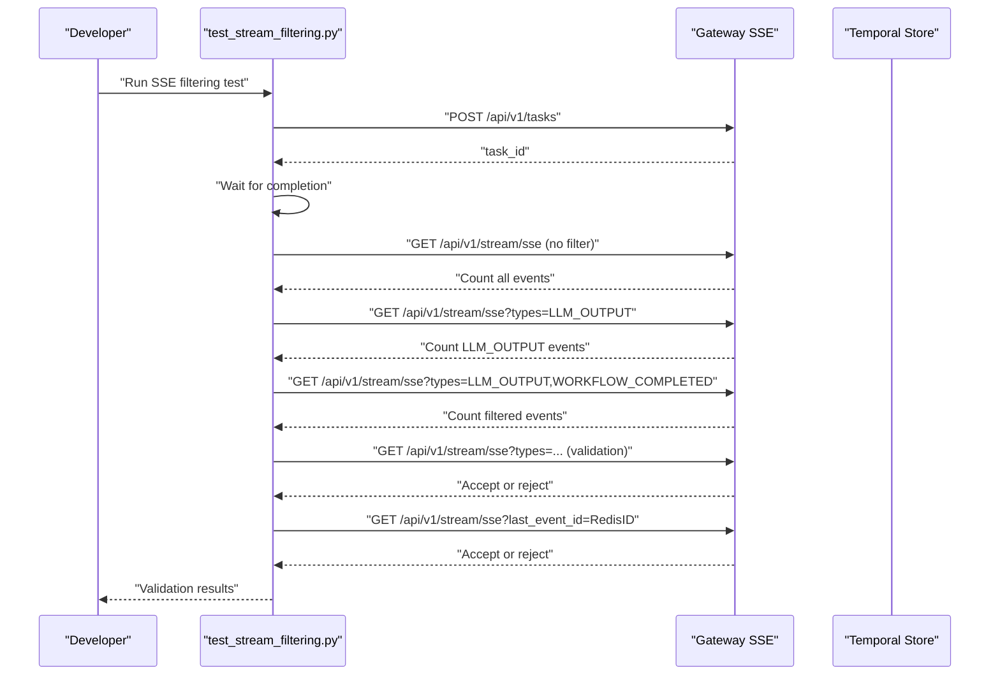

**Diagram sources**
- [scripts/test_stream_filtering.py](file://scripts/test_stream_filtering.py#L1-L125)

**Section sources**
- [scripts/test_stream_filtering.py](file://scripts/test_stream_filtering.py#L1-L125)

### Stream Filtering Test Helper (Shell)
Purpose:
- Lightweight smoke test for SSE event type filtering using curl.

Key behaviors:
- Submit a task and wait for completion.
- Count SSE events with and without filters.
- Verify gateway does not reject valid event types and accepts Redis stream IDs.

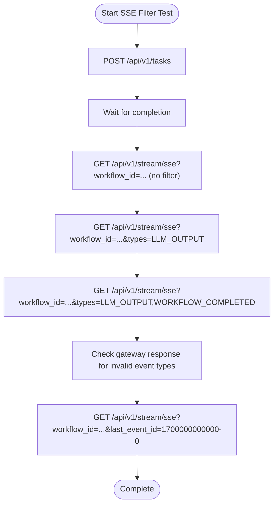

**Diagram sources**
- [scripts/test_stream_filtering.sh](file://scripts/test_stream_filtering.sh#L1-L91)

**Section sources**
- [scripts/test_stream_filtering.sh](file://scripts/test_stream_filtering.sh#L1-L91)

### Qdrant Bootstrapping and Initialization
Purpose:
- Ensure required Qdrant collections exist and are initialized for vector operations.

Key behaviors:
- Create collections with vector size and distance settings.
- Initialize via a Python script wrapper that works both in-container and locally.

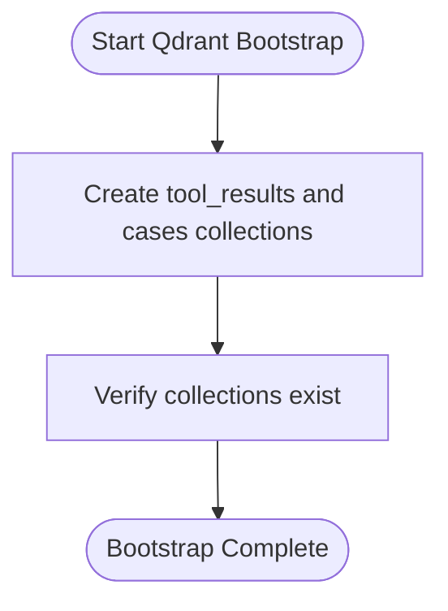

**Diagram sources**
- [scripts/bootstrap_qdrant.sh](file://scripts/bootstrap_qdrant.sh#L1-L23)
- [scripts/init_qdrant.sh](file://scripts/init_qdrant.sh#L1-L22)

**Section sources**
- [scripts/bootstrap_qdrant.sh](file://scripts/bootstrap_qdrant.sh#L1-L23)
- [scripts/init_qdrant.sh](file://scripts/init_qdrant.sh#L1-L22)

### Smoke and Streaming Smoke Checks
Purpose:
- Rapid health checks for services and streaming endpoints.

Key behaviors:
- Verify UI, gRPC health, task submission, persistence, metrics, MCP tool registration and execution, Qdrant readiness, and Postgres connectivity.
- Test SSE and gRPC streaming with optional Last-Event-ID or last_event_id.

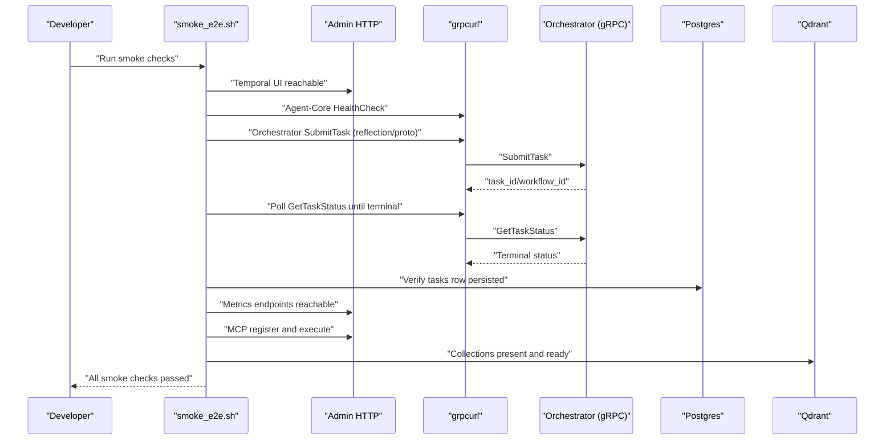

**Diagram sources**
- [scripts/smoke_e2e.sh](file://scripts/smoke_e2e.sh#L1-L141)
- [scripts/stream_smoke.sh](file://scripts/stream_smoke.sh#L1-L39)

**Section sources**
- [scripts/smoke_e2e.sh](file://scripts/smoke_e2e.sh#L1-L141)
- [scripts/stream_smoke.sh](file://scripts/stream_smoke.sh#L1-L39)

## Dependency Analysis
The test utilities depend on:
- Docker and Docker Compose for service orchestration
- grpcurl for gRPC introspection and task submission
- curl for HTTP API interactions
- Python requests for SSE filtering tests
- jq for JSON parsing in shell scripts
- Optional tools: netcat (nc), protobuf tools, and Buf for code generation

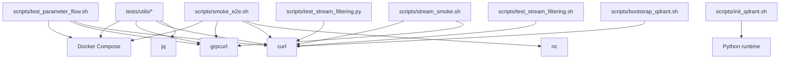

**Diagram sources**
- [tests/utils/README.md](file://tests/utils/README.md#L42-L47)
- [tests/README.md](file://tests/README.md#L13-L21)
- [scripts/test_parameter_flow.sh](file://scripts/test_parameter_flow.sh#L1-L129)
- [scripts/test_stream_filtering.py](file://scripts/test_stream_filtering.py#L1-L125)
- [scripts/test_stream_filtering.sh](file://scripts/test_stream_filtering.sh#L1-L91)
- [scripts/bootstrap_qdrant.sh](file://scripts/bootstrap_qdrant.sh#L1-L23)
- [scripts/init_qdrant.sh](file://scripts/init_qdrant.sh#L1-L22)
- [scripts/smoke_e2e.sh](file://scripts/smoke_e2e.sh#L1-L141)
- [scripts/stream_smoke.sh](file://scripts/stream_smoke.sh#L1-L39)

**Section sources**
- [tests/utils/README.md](file://tests/utils/README.md#L42-L47)
- [tests/README.md](file://tests/README.md#L13-L21)

## Performance Considerations
- Use timeouts and controlled waits to avoid long-running tests; leverage streaming smoke tests for quick validation.
- Minimize concurrent heavy-token tasks to prevent backpressure cascading across services.
- Prefer targeted utility tests for isolated validations rather than full E2E suites when diagnosing specific issues.
- Cache or reuse test data where safe to reduce repeated setup costs.

## Troubleshooting Guide
Common issues and remedies:
- Services not healthy
  - Use smoke checks to verify UI, gRPC health, task submission, persistence, metrics, MCP tool registration, Qdrant readiness, and Postgres connectivity.
  - Check orchestrator and service logs for errors.

- Parameter flow anomalies
  - Validate top-level overrides and context precedence using parameter flow script.
  - Inspect orchestrator and Python service logs for routing decisions.

- SSE filtering failures
  - Confirm gateway does not reject valid event types and accepts Redis stream IDs.
  - Use both Python and shell filtering helpers to isolate gateway behavior.

- Qdrant initialization problems
  - Ensure collections exist and are initialized; re-run bootstrap or init scripts.

- CI simulation failures
  - Verify Docker availability and network access; ensure required tools are installed in the container.

**Section sources**
- [scripts/smoke_e2e.sh](file://scripts/smoke_e2e.sh#L149-L180)
- [scripts/test_parameter_flow.sh](file://scripts/test_parameter_flow.sh#L124-L129)
- [scripts/test_stream_filtering.py](file://scripts/test_stream_filtering.py#L85-L117)
- [scripts/test_stream_filtering.sh](file://scripts/test_stream_filtering.sh#L63-L85)
- [scripts/bootstrap_qdrant.sh](file://scripts/bootstrap_qdrant.sh#L1-L23)
- [tests/utils/test_ci_local.sh](file://tests/utils/test_ci_local.sh#L1-L72)

## Conclusion
Shannon’s test utilities provide a robust toolkit for validating budget controls, token aggregation, parameter flow, and streaming behavior. They enable rapid isolation of issues, local CI simulation, and cross-platform compatibility checks. By leveraging these helpers alongside comprehensive E2E and integration suites, developers can maintain high-quality test infrastructure and accelerate debugging and validation cycles.

## Appendices

### Practical Examples
- Budget control validation
  - Run the budget control utility after starting the stack and ensure orchestrator logs reflect budget activity.

- Token aggregation verification
  - Execute the token aggregation script and review token usage and cost fields in task status metrics.

- Parameter flow validation
  - Use the parameter flow script to test mode routing, model tier overrides, and template aliases; follow manual verification steps for logs and UI.

- Local CI simulation
  - Execute the CI utility script to validate builds and tests across Go, Rust, and Python in a simulated Ubuntu environment.

- Stream filtering validation
  - Run the Python or shell filtering scripts to confirm SSE filtering and gateway acceptance of event types and Redis stream IDs.

- Qdrant setup
  - Bootstrap or initialize Qdrant collections to ensure vector operations are available for tests.

- Smoke checks
  - Run smoke and streaming smoke checks to quickly validate service health and streaming endpoints.

**Section sources**
- [tests/utils/test_budget_controls.sh](file://tests/utils/test_budget_controls.sh#L1-L42)
- [tests/utils/test_token_aggregation.sh](file://tests/utils/test_token_aggregation.sh#L1-L36)
- [scripts/test_parameter_flow.sh](file://scripts/test_parameter_flow.sh#L1-L129)
- [tests/utils/test_ci_local.sh](file://tests/utils/test_ci_local.sh#L1-L72)
- [scripts/test_stream_filtering.py](file://scripts/test_stream_filtering.py#L1-L125)
- [scripts/test_stream_filtering.sh](file://scripts/test_stream_filtering.sh#L1-L91)
- [scripts/bootstrap_qdrant.sh](file://scripts/bootstrap_qdrant.sh#L1-L23)
- [scripts/smoke_e2e.sh](file://scripts/smoke_e2e.sh#L1-L141)
- [scripts/stream_smoke.sh](file://scripts/stream_smoke.sh#L1-L39)

### Guidelines for Extending the Test Utility Library
- Keep tests focused and isolated; use tests/utils for targeted validations.
- Reuse shell and Python helpers for common operations (HTTP, gRPC, SSE).
- Maintain consistent environment variable usage and error handling.
- Document prerequisites and usage in READMEs alongside scripts.
- Add cleanup procedures where applicable to avoid resource leaks.
- Ensure cross-platform compatibility by using widely available tools and Dockerized environments for reproducibility.

**Section sources**
- [tests/utils/README.md](file://tests/utils/README.md#L1-L55)
- [tests/README.md](file://tests/README.md#L214-L241)
- [tests/README_E2E_TESTS.md](file://tests/README_E2E_TESTS.md#L214-L241)
- [tests/e2e/README.md](file://tests/e2e/README.md#L226-L233)
- [tests/integration/README.md](file://tests/integration/README.md#L209-L227)