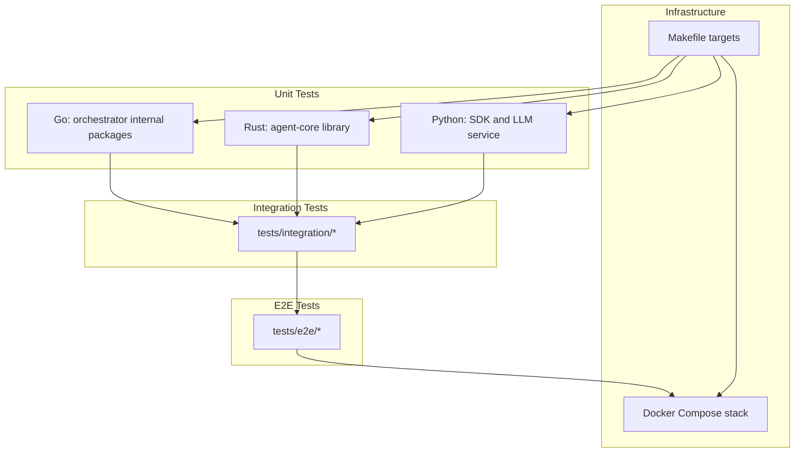
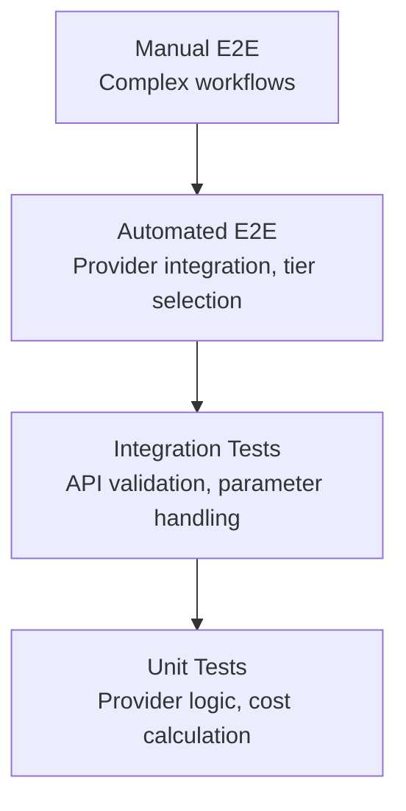
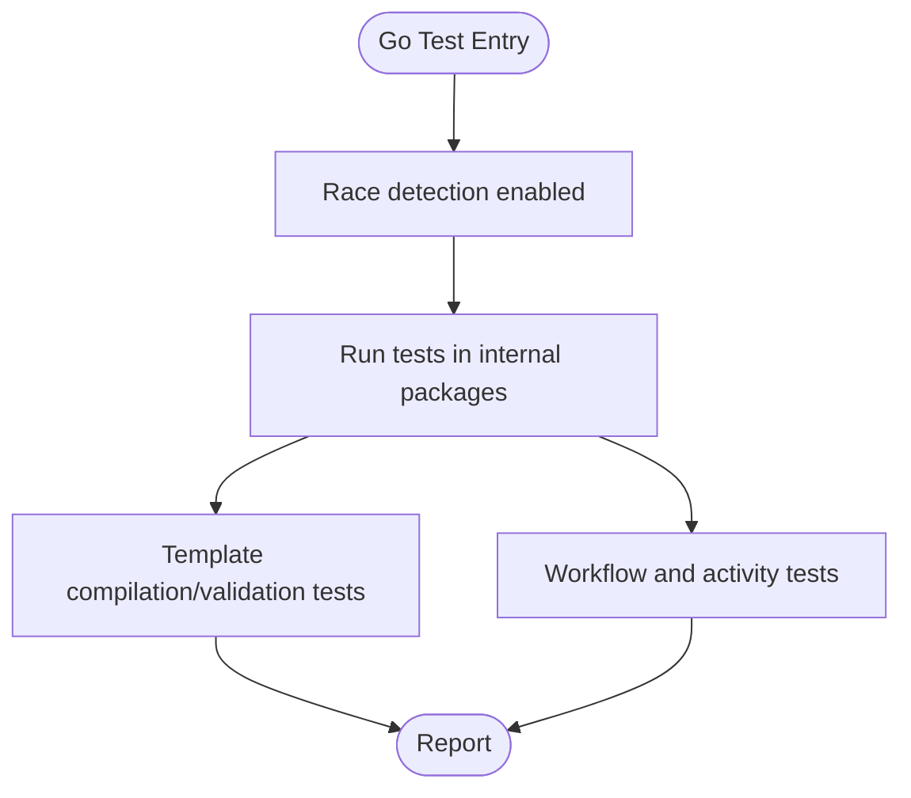
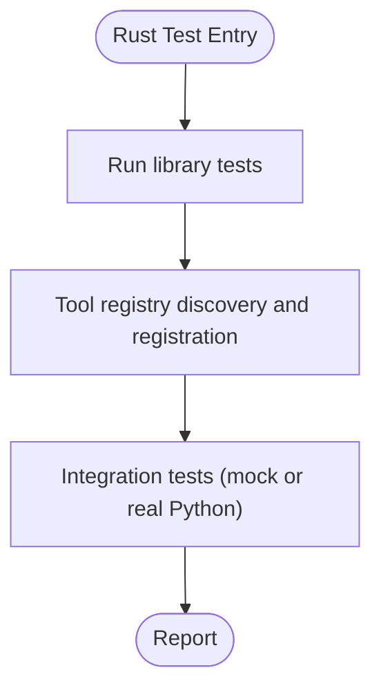
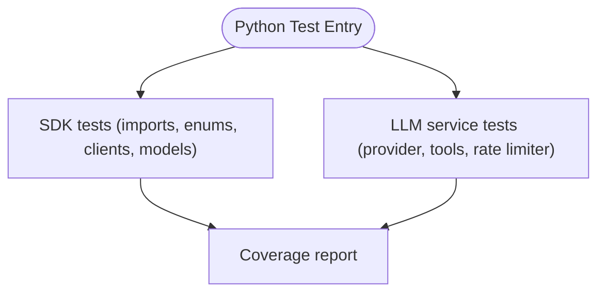
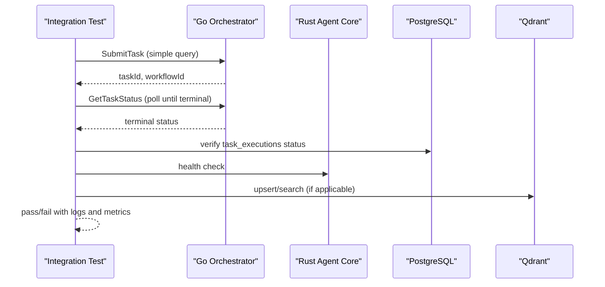
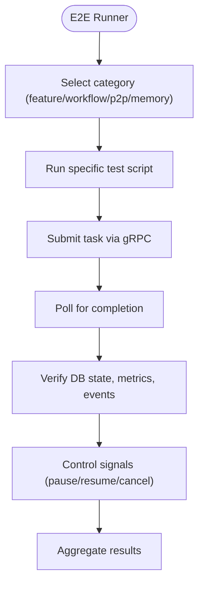
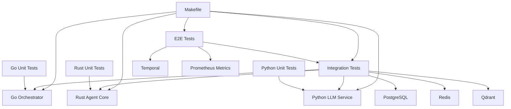

# Testing Strategy

<cite>
**Referenced Files in This Document**
- [docs/testing-strategy.md](file://docs/testing-strategy.md)
- [docs/testing.md](file://docs/testing.md)
- [go/orchestrator/README.md](file://go/orchestrator/README.md)
- [rust/agent-core/README.md](file://rust/agent-core/README.md)
- [tests/README.md](file://tests/README.md)
- [tests/e2e/README.md](file://tests/e2e/README.md)
- [tests/integration/README.md](file://tests/integration/README.md)
- [clients/python/tests/test_core.py](file://clients/python/tests/test_core.py)
- [go/orchestrator/internal/workflows/template_workflow_test.go](file://go/orchestrator/internal/workflows/template_workflow_test.go)
- [rust/agent-core/tests/test_tool_registry.rs](file://rust/agent-core/tests/test_tool_registry.rs)
- [tests/e2e/01_basic_calculator_test.sh](file://tests/e2e/01_basic_calculator_test.sh)
- [tests/integration/single_agent_flow_test.sh](file://tests/integration/single_agent_flow_test.sh)
- [Makefile](file://Makefile)
</cite>

## Table of Contents
1. [Introduction](#introduction)
2. [Project Structure](#project-structure)
3. [Core Components](#core-components)
4. [Architecture Overview](#architecture-overview)
5. [Detailed Component Analysis](#detailed-component-analysis)
6. [Dependency Analysis](#dependency-analysis)
7. [Performance Considerations](#performance-considerations)
8. [Troubleshooting Guide](#troubleshooting-guide)
9. [Conclusion](#conclusion)
10. [Appendices](#appendices)

## Introduction
This document defines Shannon’s multi-layered testing strategy across unit, integration, and end-to-end (E2E) scopes. It covers methodologies for Go, Rust, and Python components, service interaction validation, workflow execution determinism, and the comprehensive E2E test suite. It also documents test utilities, helper functions, infrastructure, CI/CD integration, coverage goals, performance testing, and regression strategies.

## Project Structure
Shannon organizes tests by language and scope:
- Unit tests co-locate with source code:
  - Go: `_test.go` files under `go/orchestrator/internal/...`
  - Rust: inline tests in `rust/agent-core/src/...`
  - Python: `clients/python/tests/` and `python/llm-service/tests/`
- Integration tests validate cross-service flows under Docker Compose.
- E2E tests exercise full system workflows and validate persistence, metrics, and control signals.

**Diagram sources**
- [Makefile](file://Makefile#L114-L127)
- [tests/README.md](file://tests/README.md#L3-L11)
- [tests/integration/README.md](file://tests/integration/README.md#L1-L12)
- [tests/e2e/README.md](file://tests/e2e/README.md#L1-L7)

**Section sources**
- [tests/README.md](file://tests/README.md#L3-L11)
- [tests/integration/README.md](file://tests/integration/README.md#L1-L12)
- [tests/e2e/README.md](file://tests/e2e/README.md#L1-L7)
- [Makefile](file://Makefile#L114-L127)

## Core Components
- Go unit tests: run with race detection and include workflow and activity tests.
- Rust unit tests: run with full output capture; includes integration tests against a Python service.
- Python unit tests: pytest-based with coverage reporting; SDK and LLM service tests.
- Integration tests: single agent flow, session memory, and Qdrant vector operations.
- E2E tests: calculator, Python execution, web search, cognitive patterns, P2P coordination, memory, context compression, templates, rate control, model tiers, and control signals.
- CI pipeline: builds, lints, tests, and optional coverage gates.

**Section sources**
- [docs/testing.md](file://docs/testing.md#L7-L121)
- [go/orchestrator/README.md](file://go/orchestrator/README.md#L261-L284)
- [rust/agent-core/README.md](file://rust/agent-core/README.md#L98-L118)
- [tests/integration/README.md](file://tests/integration/README.md#L65-L125)
- [tests/e2e/README.md](file://tests/e2e/README.md#L1-L96)
- [Makefile](file://Makefile#L114-L127)

## Architecture Overview
The testing pyramid emphasizes metadata completeness and provider parameter handling for model updates, with smoke, integration, and E2E layers validating provider selection, tier behavior, and cost estimation.

**Diagram sources**
- [docs/testing-strategy.md](file://docs/testing-strategy.md#L23-L42)

**Section sources**
- [docs/testing-strategy.md](file://docs/testing-strategy.md#L13-L42)

## Detailed Component Analysis

### Go Unit Testing Methodology
- Location: co-located `_test.go` files under internal packages.
- Coverage: workflow and activity tests, including template compilation and validation.
- Execution: race-detected tests via `go test -race ./...`.

**Diagram sources**
- [go/orchestrator/internal/workflows/template_workflow_test.go](file://go/orchestrator/internal/workflows/template_workflow_test.go#L11-L167)
- [go/orchestrator/README.md](file://go/orchestrator/README.md#L263-L272)

**Section sources**
- [go/orchestrator/internal/workflows/template_workflow_test.go](file://go/orchestrator/internal/workflows/template_workflow_test.go#L11-L167)
- [go/orchestrator/README.md](file://go/orchestrator/README.md#L261-L284)

### Rust Unit Testing Methodology
- Location: inline tests in `src/` and dedicated integration tests.
- Coverage: tool registry discovery, registration, and capability validation.
- Execution: `cargo test --lib` and integration tests with mock or real Python service.

**Diagram sources**
- [rust/agent-core/tests/test_tool_registry.rs](file://rust/agent-core/tests/test_tool_registry.rs#L3-L137)
- [rust/agent-core/README.md](file://rust/agent-core/README.md#L98-L113)

**Section sources**
- [rust/agent-core/tests/test_tool_registry.rs](file://rust/agent-core/tests/test_tool_registry.rs#L3-L137)
- [rust/agent-core/README.md](file://rust/agent-core/README.md#L98-L118)

### Python Unit Testing Methodology
- Location: SDK tests under `clients/python/tests/` and LLM service tests under `python/llm-service/tests/`.
- Coverage: imports, enums, error hierarchy, sync/async client initialization, event models, provider selection, rate limiting, tool execution, and more.
- Execution: `pytest` with coverage reporting.

**Diagram sources**
- [clients/python/tests/test_core.py](file://clients/python/tests/test_core.py#L16-L83)
- [docs/testing.md](file://docs/testing.md#L35-L50)

**Section sources**
- [clients/python/tests/test_core.py](file://clients/python/tests/test_core.py#L16-L83)
- [docs/testing.md](file://docs/testing.md#L35-L50)

### Integration Testing for Service Interactions
- Scope: single agent flow, session memory persistence, and Qdrant vector operations.
- Tools: gRPC health checks, metrics endpoints, database verification, and service logs.
- Patterns: task submission, polling for terminal state, verifying workflow type, database persistence, agent-core interaction logs, and performance thresholds.

**Diagram sources**
- [tests/integration/single_agent_flow_test.sh](file://tests/integration/single_agent_flow_test.sh#L33-L106)
- [tests/integration/README.md](file://tests/integration/README.md#L65-L125)

**Section sources**
- [tests/integration/README.md](file://tests/integration/README.md#L65-L125)
- [tests/integration/single_agent_flow_test.sh](file://tests/integration/single_agent_flow_test.sh#L33-L106)

### End-to-End Testing Strategies
- Scope: calculator tool, Python WASI execution, web search, cognitive patterns, P2P coordination, memory, context compression, templates, rate control, model tiers, and control signals.
- Utilities: master runner, submission helpers, metrics verification, and control signal manipulation via Temporal CLI.
- Data stores: task_executions table for persistence and metrics.

**Diagram sources**
- [tests/e2e/README.md](file://tests/e2e/README.md#L9-L126)
- [tests/e2e/01_basic_calculator_test.sh](file://tests/e2e/01_basic_calculator_test.sh#L25-L86)

**Section sources**
- [tests/e2e/README.md](file://tests/e2e/README.md#L1-L96)
- [tests/e2e/01_basic_calculator_test.sh](file://tests/e2e/01_basic_calculator_test.sh#L25-L86)

### Test Utilities, Helpers, and Infrastructure
- Makefile targets unify test execution, coverage, integration, and replay:
  - `make test`: run Go, Rust, and Python tests.
  - `make smoke`: health and connectivity checks.
  - `make integration-tests` and single targets for session/memory/Qdrant.
  - `make coverage` and coverage gates for Go and Python.
  - `make replay` and `make ci-replay` for Temporal deterministic replay.
- Docker Compose orchestrates services for integration and E2E tests.
- Test data and cleanup patterns are documented for integration tests.

**Section sources**
- [Makefile](file://Makefile#L114-L127)
- [Makefile](file://Makefile#L181-L227)
- [Makefile](file://Makefile#L145-L179)
- [tests/README.md](file://tests/README.md#L22-L60)
- [tests/integration/README.md](file://tests/integration/README.md#L209-L227)

### Practical Examples: Writing, Running, and Interpreting Tests
- Writing unit tests:
  - Go: add `_test.go` alongside the implementation; use testify assertions and logger injection.
  - Rust: write unit tests in the same module or dedicated test modules; use assert macros.
  - Python: pytest-style tests in `tests/`; validate imports, enums, client methods, and models.
- Running test suites:
  - `make test` for all unit tests.
  - `make smoke` for health checks.
  - `tests/e2e/run.sh` for E2E suite.
  - `make integration-tests` for integration tests.
- Interpreting results:
  - Color-coded outputs in integration scripts; pass/fail/info/warn semantics.
  - Metrics endpoints and database verification for E2E outcomes.

**Section sources**
- [go/orchestrator/internal/workflows/template_workflow_test.go](file://go/orchestrator/internal/workflows/template_workflow_test.go#L11-L60)
- [rust/agent-core/tests/test_tool_registry.rs](file://rust/agent-core/tests/test_tool_registry.rs#L3-L52)
- [clients/python/tests/test_core.py](file://clients/python/tests/test_core.py#L16-L83)
- [tests/integration/README.md](file://tests/integration/README.md#L126-L146)
- [docs/testing.md](file://docs/testing.md#L19-L31)

### Continuous Integration Setup and Quality Assurance
- CI stages:
  - Rust tests with clippy linting.
  - Go build and tests with race detection.
  - Python linting (ruff) and pytest.
  - Temporal workflow replay tests.
  - Coverage reporting (informational).
- Pre-merge requirements:
  - Smoke tests passing.
  - No 400 errors in logs.
  - Cost estimation non-zero for tasks.
  - Both providers verified.

**Section sources**
- [docs/testing.md](file://docs/testing.md#L114-L121)
- [docs/testing-strategy.md](file://docs/testing-strategy.md#L380-L418)

### Test Coverage Requirements
- Thresholds:
  - Go: minimum 50% coverage (current ~57%).
  - Python: baseline 20% coverage (target 70%).
  - Rust: informational only (no minimum).
- Gates:
  - `make coverage-gate` runs coverage for Go and Python and enforces thresholds.
  - `make coverage-go` and `make coverage-python` for individual coverage reports.

**Section sources**
- [docs/testing.md](file://docs/testing.md#L123-L161)
- [Makefile](file://Makefile#L181-L227)

### Performance Testing and Regression Strategies
- Performance testing:
  - Load testing with concurrent requests and metrics monitoring.
  - Benchmarks and performance metrics in Rust agent-core documentation.
- Regression testing:
  - Deterministic replay of Temporal workflows using exported histories.
  - CI replay of all histories to prevent breaking changes.
  - E2E regression tests for critical features (calculator, Python execution, memory, context compression).

**Section sources**
- [docs/testing.md](file://docs/testing.md#L212-L223)
- [rust/agent-core/README.md](file://rust/agent-core/README.md#L249-L267)
- [tests/README.md](file://tests/README.md#L62-L108)
- [tests/e2e/README.md](file://tests/e2e/README.md#L80-L96)

## Dependency Analysis
Testing dependencies span orchestration, agent execution, and LLM services, with Docker Compose providing the runtime environment.

**Diagram sources**
- [Makefile](file://Makefile#L114-L127)
- [tests/integration/README.md](file://tests/integration/README.md#L25-L32)
- [tests/e2e/README.md](file://tests/e2e/README.md#L141-L156)

**Section sources**
- [Makefile](file://Makefile#L114-L127)
- [tests/integration/README.md](file://tests/integration/README.md#L25-L32)
- [tests/e2e/README.md](file://tests/e2e/README.md#L141-L156)

## Performance Considerations
- Prefer deterministic tests for workflows; use replay to avoid flakiness.
- Use metrics endpoints to validate throughput and latency during load tests.
- Keep test data minimal and scoped; leverage cleanup patterns for integration tests.

[No sources needed since this section provides general guidance]

## Troubleshooting Guide
- Smoke test failures:
  - Verify service health and logs; ensure required ports are free.
- Integration test failures:
  - Check database connectivity and recent sessions; validate Qdrant collections and stats.
  - Confirm agent-core health and gRPC reachability.
- E2E test failures:
  - Validate task_executions persistence and control signals via Temporal CLI.
  - Inspect orchestrator and agent-core logs for workflow routing and execution details.

**Section sources**
- [tests/integration/README.md](file://tests/integration/README.md#L148-L186)
- [tests/e2e/README.md](file://tests/e2e/README.md#L209-L224)
- [docs/testing.md](file://docs/testing.md#L163-L210)

## Conclusion
Shannon’s testing strategy combines robust unit tests across languages, rigorous integration validations, and comprehensive E2E suites. The approach emphasizes metadata completeness, provider parameter handling, deterministic workflow replay, and CI gates to ensure reliability and maintainability as the platform evolves.

[No sources needed since this section summarizes without analyzing specific files]

## Appendices

### Appendix A: Quick Reference to Test Commands
- Run all unit tests: `make test`
- Smoke tests: `make smoke`
- E2E suite: `tests/e2e/run.sh`
- Integration tests: `make integration-tests`
- Coverage: `make coverage-gate`
- Temporal replay: `make ci-replay`

**Section sources**
- [docs/testing.md](file://docs/testing.md#L17-L31)
- [Makefile](file://Makefile#L114-L127)
- [tests/README.md](file://tests/README.md#L22-L57)