# Unit Testing

<cite>
**Referenced Files in This Document**
- [test_core.py](file://clients/python/tests/test_core.py)
- [test_http_errors.py](file://clients/python/tests/test_http_errors.py)
- [test_v030_comprehensive.py](file://clients/python/tests/test_v030_comprehensive.py)
- [test_manager.py](file://python/llm-service/tests/test_manager.py)
- [test_openapi_tool.py](file://python/llm-service/tests/test_openapi_tool.py)
- [test_web_search.py](file://python/llm-service/tests/test_web_search.py)
- [test_python_wasi_executor.py](file://python/llm-service/tests/test_python_wasi_executor.py)
- [session_test.go](file://go/orchestrator/cmd/gateway/internal/handlers/session_test.go)
- [task_test.go](file://go/orchestrator/cmd/gateway/internal/handlers/task_test.go)
- [grpcmeta_test.go](file://go/orchestrator/cmd/gateway/internal/handlers/grpcmeta_test.go)
- [util_test.go](file://go/orchestrator/internal/util/util_test.go)
- [test_tool_registry.rs](file://rust/agent-core/tests/test_tool_registry.rs)
- [test_wasm_cache.rs](file://rust/agent-core/tests/test_wasm_cache.rs)
- [test_full_integration.rs](file://rust/agent-core/tests/test_full_integration.rs)
</cite>

## Table of Contents
1. [Introduction](#introduction)
2. [Project Structure](#project-structure)
3. [Core Components](#core-components)
4. [Architecture Overview](#architecture-overview)
5. [Detailed Component Analysis](#detailed-component-analysis)
6. [Dependency Analysis](#dependency-analysis)
7. [Performance Considerations](#performance-considerations)
8. [Troubleshooting Guide](#troubleshooting-guide)
9. [Conclusion](#conclusion)
10. [Appendices](#appendices)

## Introduction
This document presents a comprehensive guide to unit testing methodologies across the Shannon multi-language codebase. It covers:
- Go unit testing with testify and standard testing packages, including HTTP handler tests, validation logic, and test doubles.
- Rust unit testing with examples from agent-core tests, focusing on WASI sandbox functionality and tool registry operations.
- Python unit testing for client SDK and LLM service components, including asynchronous operations, mocking external dependencies, and error handling.

The guide emphasizes practical examples, test organization, naming conventions, assertion patterns, and strategies for maintaining high test coverage.

## Project Structure
The repository organizes tests by language and domain:
- Go: Tests under go/orchestrator for HTTP handlers, middleware, utilities, and workflows.
- Python: Tests under clients/python and python/llm-service for SDK and LLM service components.
- Rust: Tests under rust/agent-core for agent core modules including tool registry, sandbox, and integration tests.

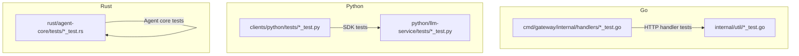

**Section sources**
- [test_core.py](file://clients/python/tests/test_core.py#L1-L84)
- [test_manager.py](file://python/llm-service/tests/test_manager.py#L1-L118)
- [test_tool_registry.rs](file://rust/agent-core/tests/test_tool_registry.rs#L1-L138)

## Core Components
This section outlines testing patterns and examples across languages.

- Go
  - Validation and sanitization tests for session title handling, including rune-length checks and control character removal.
  - HTTP handler tests validating request routing, metadata labeling, override injection, and provider validation.
  - gRPC metadata mapping tests ensuring proper header forwarding and identity propagation.
  - Utility tests for string containment, numeric parsing, and string truncation.

- Python
  - SDK tests verifying imports, enums, client initialization, and event model basics.
  - HTTP error mapping tests covering authentication, task/session not found, validation, server errors, permission, and rate-limit scenarios.
  - LLM Manager tests using stubbed provider dependencies and dummy/failing providers to validate routing and fallback behavior.
  - OpenAPI tool tests covering authentication types, request body handling, circuit breaker behavior, vendor adapter transformations, rate limiting, and error handling.
  - Web search tool tests validating engine normalization, response parsing for finance results, and tool metadata/schema.
  - Python WASI executor tests covering timeouts, syntax errors, memory exhaustion, large outputs, session persistence, stack overflow prevention, fork bomb mitigation, concurrent access, empty code handling, print statement correctness, session state extraction, and maximum timeout enforcement.

- Rust
  - Tool registry tests validating discovery by query/category, exclusion of dangerous tools, registration, and result limits.
  - WASM cache tests demonstrating caching performance improvements and cache clearing.
  - Full integration tests validating configuration, tool registry, discovery, cache statistics, error handling, modern Rust patterns, and tracing availability.

**Section sources**
- [session_test.go](file://go/orchestrator/cmd/gateway/internal/handlers/session_test.go#L1-L234)
- [task_test.go](file://go/orchestrator/cmd/gateway/internal/handlers/task_test.go#L1-L357)
- [grpcmeta_test.go](file://go/orchestrator/cmd/gateway/internal/handlers/grpcmeta_test.go#L1-L55)
- [util_test.go](file://go/orchestrator/internal/util/util_test.go#L1-L232)
- [test_core.py](file://clients/python/tests/test_core.py#L1-L84)
- [test_http_errors.py](file://clients/python/tests/test_http_errors.py#L1-L82)
- [test_manager.py](file://python/llm-service/tests/test_manager.py#L1-L118)
- [test_openapi_tool.py](file://python/llm-service/tests/test_openapi_tool.py#L1-L370)
- [test_web_search.py](file://python/llm-service/tests/test_web_search.py#L1-L258)
- [test_python_wasi_executor.py](file://python/llm-service/tests/test_python_wasi_executor.py#L1-L416)
- [test_tool_registry.rs](file://rust/agent-core/tests/test_tool_registry.rs#L1-L138)
- [test_wasm_cache.rs](file://rust/agent-core/tests/test_wasm_cache.rs#L1-L74)
- [test_full_integration.rs](file://rust/agent-core/tests/test_full_integration.rs#L1-L159)

## Architecture Overview
The testing architecture spans three languages, each with distinct patterns:
- Go tests focus on HTTP handlers, middleware, and utilities, often using httptest and testify for assertions.
- Python tests emphasize mocking external services (HTTP, gRPC, aiohttp) and validating SDK behavior against real backends.
- Rust tests target agent core modules, leveraging tokio for async tests and feature flags for WASI-related tests.

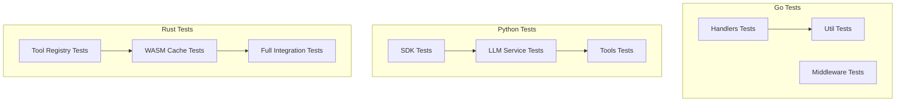

**Diagram sources**
- [session_test.go](file://go/orchestrator/cmd/gateway/internal/handlers/session_test.go#L1-L234)
- [task_test.go](file://go/orchestrator/cmd/gateway/internal/handlers/task_test.go#L1-L357)
- [grpcmeta_test.go](file://go/orchestrator/cmd/gateway/internal/handlers/grpcmeta_test.go#L1-L55)
- [util_test.go](file://go/orchestrator/internal/util/util_test.go#L1-L232)
- [test_core.py](file://clients/python/tests/test_core.py#L1-L84)
- [test_manager.py](file://python/llm-service/tests/test_manager.py#L1-L118)
- [test_openapi_tool.py](file://python/llm-service/tests/test_openapi_tool.py#L1-L370)
- [test_web_search.py](file://python/llm-service/tests/test_web_search.py#L1-L258)
- [test_python_wasi_executor.py](file://python/llm-service/tests/test_python_wasi_executor.py#L1-L416)
- [test_tool_registry.rs](file://rust/agent-core/tests/test_tool_registry.rs#L1-L138)
- [test_wasm_cache.rs](file://rust/agent-core/tests/test_wasm_cache.rs#L1-L74)
- [test_full_integration.rs](file://rust/agent-core/tests/test_full_integration.rs#L1-L159)

## Detailed Component Analysis

### Go: HTTP Handler Validation and Sanitization
This suite validates session title validation and sanitization logic, including:
- Empty/whitespace-only titles and control character handling.
- Rune-length validation for UTF-8 safety.
- Consistent trimming and control character removal.

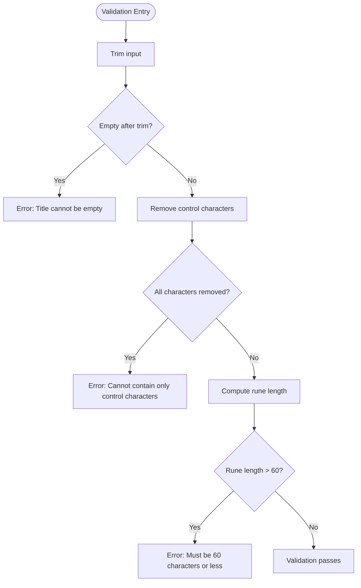

**Diagram sources**
- [session_test.go](file://go/orchestrator/cmd/gateway/internal/handlers/session_test.go#L78-L112)

**Section sources**
- [session_test.go](file://go/orchestrator/cmd/gateway/internal/handlers/session_test.go#L1-L234)

### Go: HTTP Handler Request Routing and Overrides
These tests validate:
- Mode acceptance and label injection.
- Provider validation and override injection.
- Context normalization and disable_ai conflict detection.

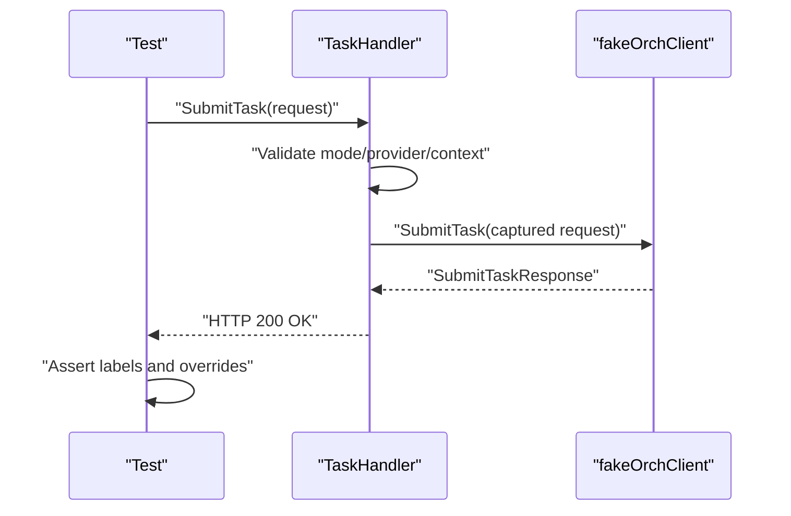

**Diagram sources**
- [task_test.go](file://go/orchestrator/cmd/gateway/internal/handlers/task_test.go#L121-L146)
- [task_test.go](file://go/orchestrator/cmd/gateway/internal/handlers/task_test.go#L203-L226)

**Section sources**
- [task_test.go](file://go/orchestrator/cmd/gateway/internal/handlers/task_test.go#L1-L357)

### Go: gRPC Metadata Mapping
Tests ensure:
- Authorization header conversion from Bearer API key to x-api-key.
- JWT authorization forwarded as-is.
- Identity headers (user/tenant) propagated via user context.

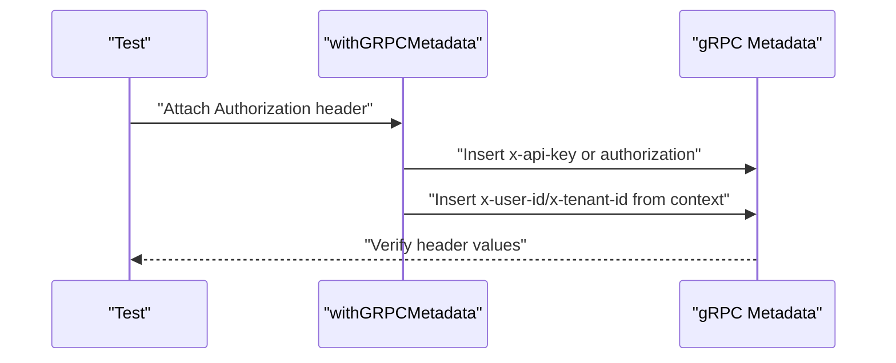

**Diagram sources**
- [grpcmeta_test.go](file://go/orchestrator/cmd/gateway/internal/handlers/grpcmeta_test.go#L14-L54)

**Section sources**
- [grpcmeta_test.go](file://go/orchestrator/cmd/gateway/internal/handlers/grpcmeta_test.go#L1-L55)

### Go: Utility Functions
Tests cover:
- String containment checks.
- Numeric value parsing with multiple patterns.
- String truncation preserving words or not.

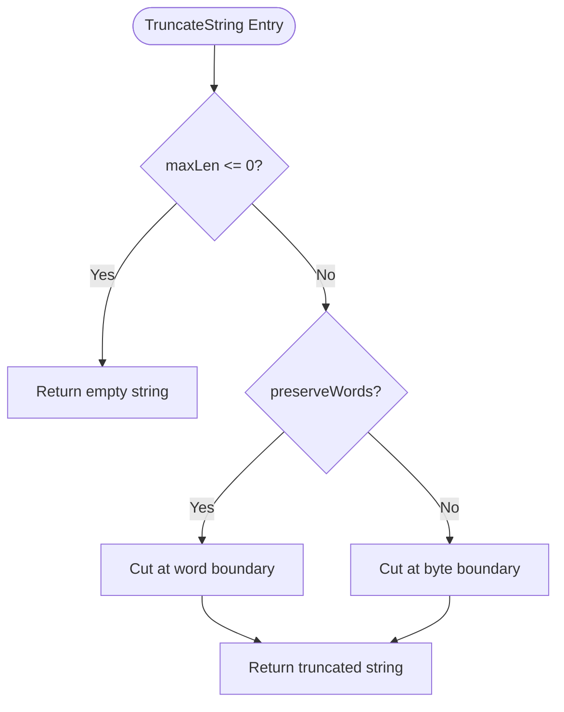

**Diagram sources**
- [util_test.go](file://go/orchestrator/internal/util/util_test.go#L150-L231)

**Section sources**
- [util_test.go](file://go/orchestrator/internal/util/util_test.go#L1-L232)

### Python: SDK Basics and Error Mapping
- SDK import and enum validation.
- Client initialization checks for method presence.
- HTTP error mapping to domain-specific exceptions and timeout wrapping.

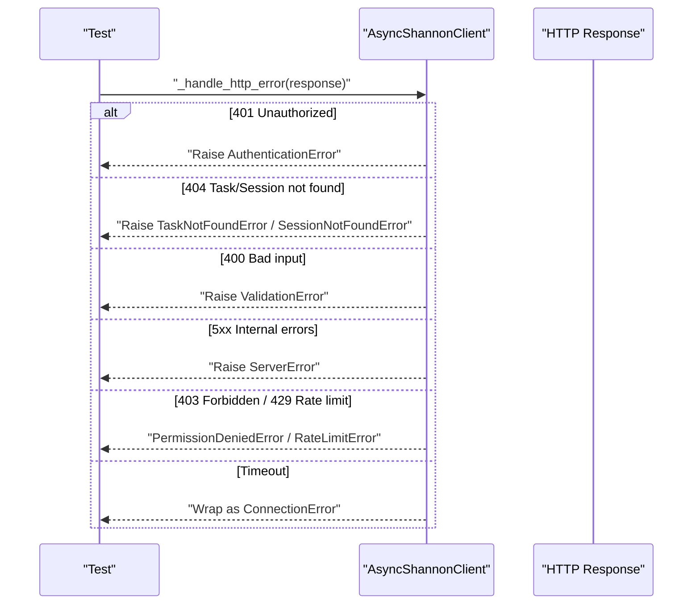

**Diagram sources**
- [test_http_errors.py](file://clients/python/tests/test_http_errors.py#L15-L82)

**Section sources**
- [test_core.py](file://clients/python/tests/test_core.py#L1-L84)
- [test_http_errors.py](file://clients/python/tests/test_http_errors.py#L1-L82)

### Python: LLM Manager Routing and Fallback
- Stubs external provider dependencies to avoid runtime requirements.
- Uses dummy providers to validate cache hits and fallback behavior.

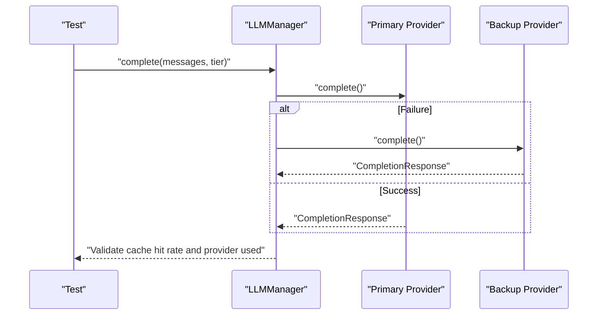

**Diagram sources**
- [test_manager.py](file://python/llm-service/tests/test_manager.py#L74-L117)

**Section sources**
- [test_manager.py](file://python/llm-service/tests/test_manager.py#L1-L118)

### Python: OpenAPI Tool Execution and Vendor Adapters
- Validates bearer, API key, and basic auth configurations.
- Tests request body injection and response parsing.
- Verifies circuit breaker behavior and vendor adapter transformations.

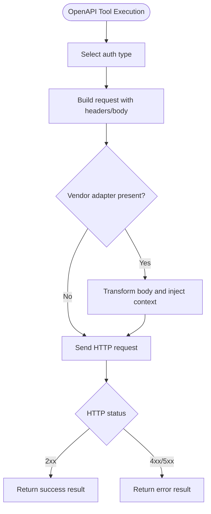

**Diagram sources**
- [test_openapi_tool.py](file://python/llm-service/tests/test_openapi_tool.py#L117-L171)
- [test_openapi_tool.py](file://python/llm-service/tests/test_openapi_tool.py#L223-L284)

**Section sources**
- [test_openapi_tool.py](file://python/llm-service/tests/test_openapi_tool.py#L1-L370)

### Python: Web Search Tool
- Engine normalization and parameter validation.
- Parsing of specialized engines (finance/markets).
- Tool metadata verification for engine, localization, time filters, and finance parameters.

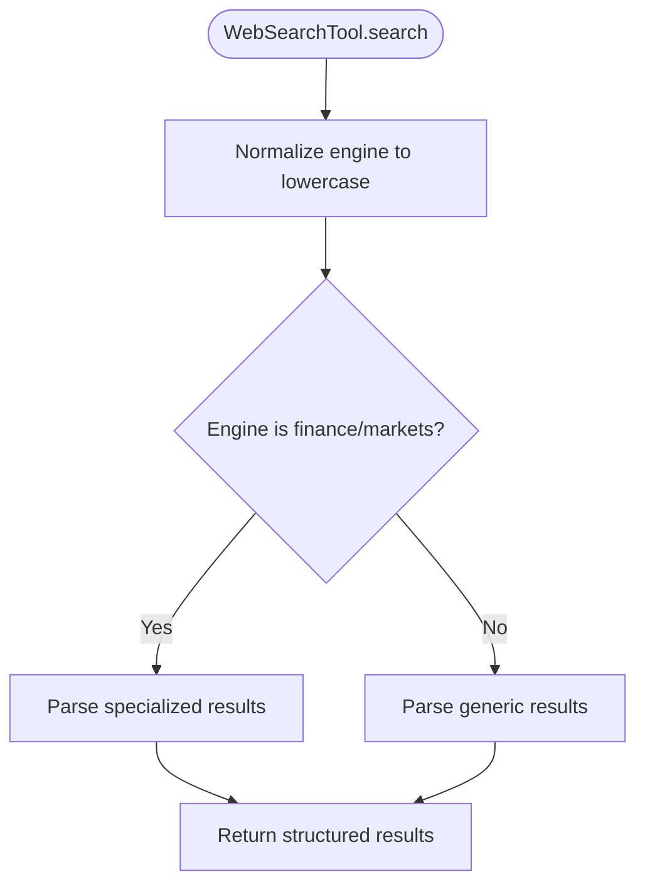

**Diagram sources**
- [test_web_search.py](file://python/llm-service/tests/test_web_search.py#L36-L95)
- [test_web_search.py](file://python/llm-service/tests/test_web_search.py#L96-L180)

**Section sources**
- [test_web_search.py](file://python/llm-service/tests/test_web_search.py#L1-L258)

### Python: Python WASI Executor Edge Cases
- Asynchronous execution with timeouts, syntax errors, memory exhaustion, and large outputs.
- Session persistence and cleanup, concurrent access safety, and state extraction.
- Fork bomb prevention and maximum timeout enforcement.

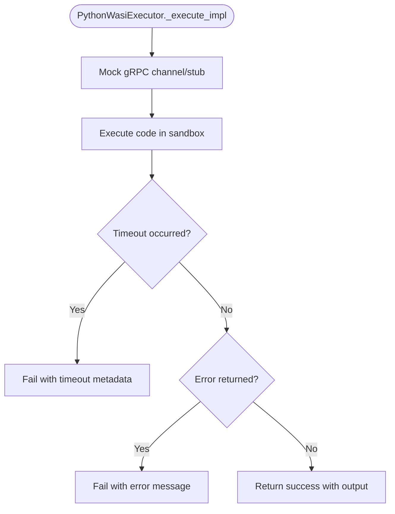

**Diagram sources**
- [test_python_wasi_executor.py](file://python/llm-service/tests/test_python_wasi_executor.py#L37-L71)
- [test_python_wasi_executor.py](file://python/llm-service/tests/test_python_wasi_executor.py#L103-L135)
- [test_python_wasi_executor.py](file://python/llm-service/tests/test_python_wasi_executor.py#L169-L189)

**Section sources**
- [test_python_wasi_executor.py](file://python/llm-service/tests/test_python_wasi_executor.py#L1-L416)

### Rust: Tool Registry Operations
- Initialization and default tool discovery.
- Query and category-based discovery.
- Excluding dangerous tools and registering custom tools.
- Result limiting.

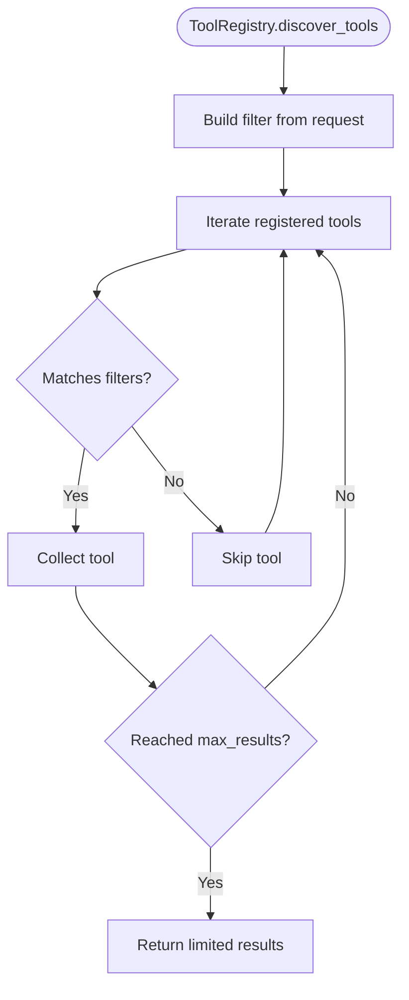

**Diagram sources**
- [test_tool_registry.rs](file://rust/agent-core/tests/test_tool_registry.rs#L18-L52)
- [test_tool_registry.rs](file://rust/agent-core/tests/test_tool_registry.rs#L54-L89)

**Section sources**
- [test_tool_registry.rs](file://rust/agent-core/tests/test_tool_registry.rs#L1-L138)

### Rust: WASM Cache Performance and Cleanup
- Demonstrates performance improvement from caching compiled modules.
- Validates cache clearing functionality.

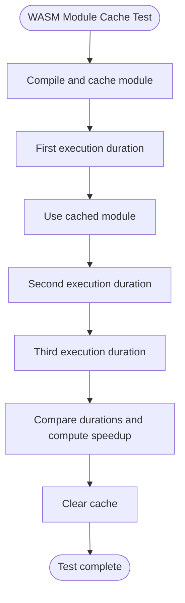

**Diagram sources**
- [test_wasm_cache.rs](file://rust/agent-core/tests/test_wasm_cache.rs#L11-L65)

**Section sources**
- [test_wasm_cache.rs](file://rust/agent-core/tests/test_wasm_cache.rs#L1-L74)

### Rust: Full System Integration
- Validates configuration, tool registry, discovery, cache statistics, error handling, modern Rust patterns, and tracing.

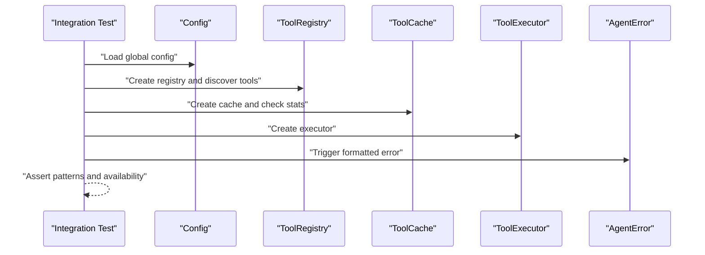

**Diagram sources**
- [test_full_integration.rs](file://rust/agent-core/tests/test_full_integration.rs#L10-L118)

**Section sources**
- [test_full_integration.rs](file://rust/agent-core/tests/test_full_integration.rs#L1-L159)

## Dependency Analysis
- Go
  - Handlers depend on internal auth and orchestrator protobufs; tests isolate dependencies via fake clients and test HTTP servers.
  - Middleware tests validate header propagation and context injection.
  - Utilities are pure functions tested independently.

- Python
  - SDK tests rely on httpx and pytest; error mapping tests validate exception hierarchy.
  - LLM Manager tests stub external provider libraries to avoid runtime dependencies.
  - Tools tests extensively mock external services (aiohttp, httpx, gRPC) to simulate network conditions.

- Rust
  - Tests exercise public APIs and feature-gated modules; integration tests validate end-to-end behavior without external services.

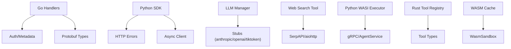

**Diagram sources**
- [task_test.go](file://go/orchestrator/cmd/gateway/internal/handlers/task_test.go#L22-L97)
- [test_http_errors.py](file://clients/python/tests/test_http_errors.py#L15-L82)
- [test_manager.py](file://python/llm-service/tests/test_manager.py#L15-L42)
- [test_web_search.py](file://python/llm-service/tests/test_web_search.py#L46-L95)
- [test_python_wasi_executor.py](file://python/llm-service/tests/test_python_wasi_executor.py#L47-L62)
- [test_tool_registry.rs](file://rust/agent-core/tests/test_tool_registry.rs#L1-L16)
- [test_wasm_cache.rs](file://rust/agent-core/tests/test_wasm_cache.rs#L5-L11)

**Section sources**
- [task_test.go](file://go/orchestrator/cmd/gateway/internal/handlers/task_test.go#L1-L357)
- [test_http_errors.py](file://clients/python/tests/test_http_errors.py#L1-L82)
- [test_manager.py](file://python/llm-service/tests/test_manager.py#L1-L118)
- [test_web_search.py](file://python/llm-service/tests/test_web_search.py#L1-L258)
- [test_python_wasi_executor.py](file://python/llm-service/tests/test_python_wasi_executor.py#L1-L416)
- [test_tool_registry.rs](file://rust/agent-core/tests/test_tool_registry.rs#L1-L138)
- [test_wasm_cache.rs](file://rust/agent-core/tests/test_wasm_cache.rs#L1-L74)

## Performance Considerations
- Go
  - Use httptest to avoid network overhead in handler tests.
  - Prefer table-driven tests for validation logic to minimize duplication and improve coverage.

- Python
  - Mock external services to eliminate flakiness and reduce test execution time.
  - Use pytest fixtures to share expensive setup (e.g., stubbed managers) across tests.

- Rust
  - Feature flags enable WASI-related tests while keeping default builds fast.
  - Integration tests should be marked as ignored or optional when external resources are unavailable.

[No sources needed since this section provides general guidance]

## Troubleshooting Guide
Common issues and resolutions:
- Go handler tests fail due to missing context or headers:
  - Ensure user context and metadata are injected before invoking handlers.
  - Validate that fake clients capture requests and return deterministic responses.

- Python SDK tests fail with timeouts:
  - Use monkeypatch to replace client creation and simulate timeouts.
  - Wrap httpx exceptions to verify error mapping.

- Python LLM Manager tests fail due to missing provider dependencies:
  - Import manager after stubbing external modules to avoid loading heavy dependencies during import.

- Python WASI executor tests fail due to sandbox restrictions:
  - Mock gRPC stub responses to simulate sandbox behavior and enforce security boundaries.

- Rust WASM cache tests fail due to missing WASM files:
  - Skip tests or mark them as ignored when external WASM artifacts are not present.

**Section sources**
- [grpcmeta_test.go](file://go/orchestrator/cmd/gateway/internal/handlers/grpcmeta_test.go#L38-L54)
- [test_http_errors.py](file://clients/python/tests/test_http_errors.py#L68-L82)
- [test_manager.py](file://python/llm-service/tests/test_manager.py#L15-L42)
- [test_python_wasi_executor.py](file://python/llm-service/tests/test_python_wasi_executor.py#L47-L62)
- [test_wasm_cache.rs](file://rust/agent-core/tests/test_wasm_cache.rs#L18-L21)

## Conclusion
The Shannon codebase employs robust unit testing strategies across Go, Python, and Rust:
- Go tests validate HTTP handlers, middleware, and utilities using httptest and testify.
- Python tests leverage mocking to isolate external dependencies and validate SDK behavior comprehensively.
- Rust tests focus on agent core modules, including tool registries, sandboxing, and integration scenarios.

Adhering to the patterns and guidelines outlined here will help maintain high-quality, reliable, and maintainable tests across the codebase.

[No sources needed since this section summarizes without analyzing specific files]

## Appendices

### Test Organization and Naming Conventions
- Go
  - Files ending with *_test.go; functions prefixed with Test*; table-driven tests for validation logic.
- Python
  - Files under tests/ with descriptive names; pytest fixtures for shared setup; async tests marked with @pytest.mark.asyncio.
- Rust
  - Files under tests/ with descriptive names; async tests annotated with #[tokio::test]; feature-gated tests for WASI.

[No sources needed since this section provides general guidance]

### Assertion Patterns
- Go
  - Use require/ensure assertions for early failure and standard assertions for validation.
- Python
  - Use pytest assertions and raises contexts for error validation.
- Rust
  - Use assert macros for conditions and match expressions for Result handling.

[No sources needed since this section provides general guidance]

### Mocking External Dependencies
- Go
  - Use fake clients implementing gRPC interfaces; httptest for HTTP endpoints.
- Python
  - Use unittest.mock.patch to replace external calls; AsyncMock for async functions.
- Rust
  - Use mocks via crates.io mocks or feature-gated stubs; integration tests may use local services.

[No sources needed since this section provides general guidance]

### Testing Asynchronous Operations
- Python
  - Use pytest.mark.asyncio and asyncio.run for coroutine tests; AsyncMock for async external calls.
- Rust
  - Use tokio::test for async tests; futures::join for concurrent execution validation.

[No sources needed since this section provides general guidance]

### Validating Error Conditions
- Go
  - Assert error messages and status codes; validate error types in handler tests.
- Python
  - Assert raised exceptions and error mappings; wrap timeouts to domain-specific errors.
- Rust
  - Assert formatted error strings and Result variants; use match for exhaustive error handling.

[No sources needed since this section provides general guidance]