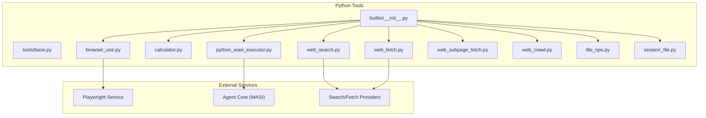
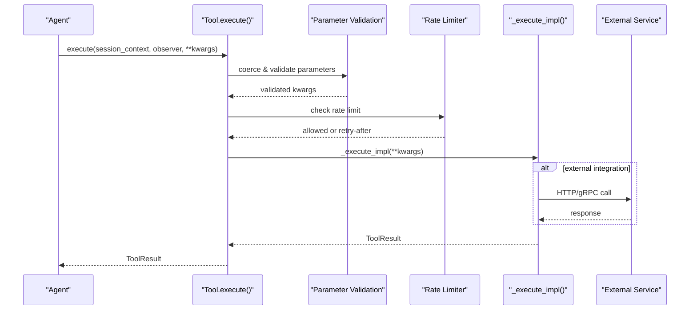
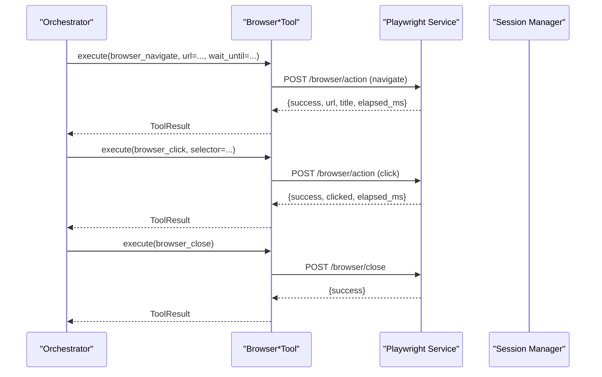
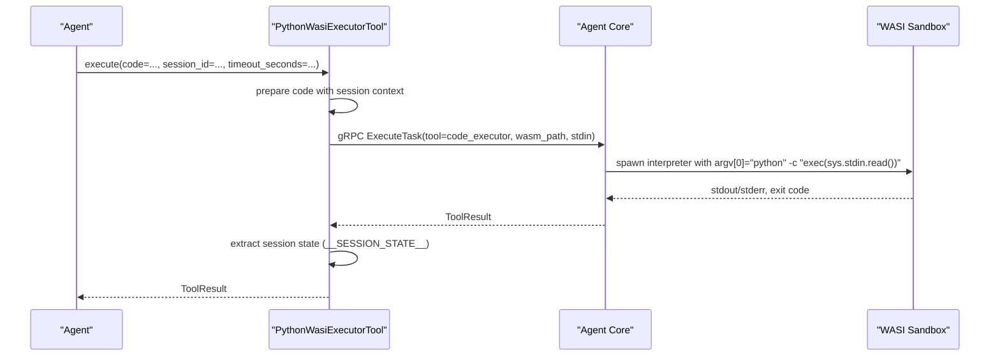
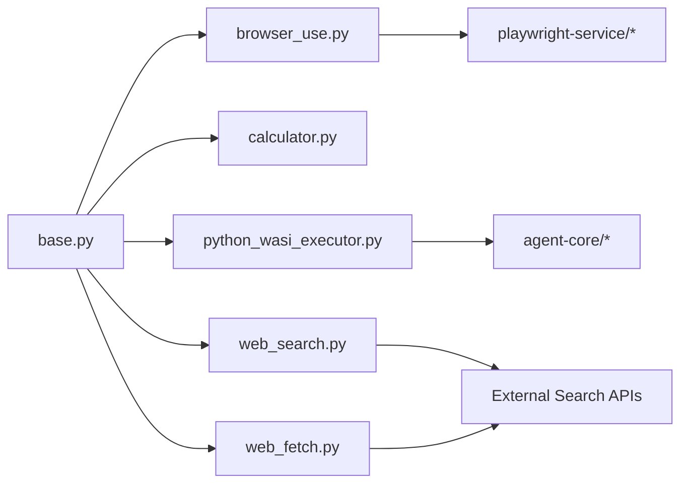

# Built-in Tools Library

<cite>
**Referenced Files in This Document**
- [builtin/__init__.py](file://python/llm-service/llm_service/tools/builtin/__init__.py)
- [base.py](file://python/llm-service/llm_service/tools/base.py)
- [browser_use.py](file://python/llm-service/llm_service/tools/builtin/browser_use.py)
- [calculator.py](file://python/llm-service/llm_service/tools/builtin/calculator.py)
- [python_wasi_executor.py](file://python/llm-service/llm_service/tools/builtin/python_wasi_executor.py)
- [web_fetch.py](file://python/llm-service/llm_service/tools/builtin/web_fetch.py)
- [web_search.py](file://python/llm-service/llm_service/tools/builtin/web_search.py)
- [web_subpage_fetch.py](file://python/llm-service/llm_service/tools/builtin/web_subpage_fetch.py)
- [web_crawl.py](file://python/llm-service/llm_service/tools/builtin/web_crawl.py)
- [file_ops.py](file://python/llm-service/llm_service/tools/builtin/file_ops.py)
- [session_file.py](file://python/llm-service/llm_service/tools/builtin/session_file.py)
- [config.py](file://python/llm-service/llm_service/config.py)
- [openapi_parser.py](file://python/llm-service/llm_service/tools/openapi_parser.py)
- [playwright_service/app.py](file://python/playwright-service/app.py)
- [playwright_service/session_manager.py](file://python/playwright-service/session_manager.py)
- [agent-core/tool_registry.rs](file://rust/agent-core/src/tool_registry.rs)
- [agent-core/wasi_sandbox.rs](file://rust/agent-core/src/wasi_sandbox.rs)
- [agent-core/sandbox.rs](file://rust/agent-core/src/sandbox.rs)
- [go/orchestrator/internal/activities/activities.go](file://go/orchestrator/internal/activities/activities.go)
- [go/orchestrator/cmd/gateway/internal/middleware/ratelimit.go](file://go/orchestrator/cmd/gateway/internal/middleware/ratelimit.go)
- [go/orchestrator/cmd/gateway/internal/middleware/auth.go](file://go/orchestrator/cmd/gateway/internal/middleware/auth.go)
- [docs/web-search-configuration.md](file://docs/web-search-configuration.md)
- [docs/web-fetch-configuration.md](file://docs/web-fetch-configuration.md)
- [docs/python-code-execution.md](file://docs/python-code-execution.md)
- [docs/python-wasi-setup.md](file://docs/python-wasi-setup.md)
- [docs/troubleshooting.md](file://docs/troubleshooting.md)
</cite>

## Table of Contents
1. [Introduction](#introduction)
2. [Project Structure](#project-structure)
3. [Core Components](#core-components)
4. [Architecture Overview](#architecture-overview)
5. [Detailed Component Analysis](#detailed-component-analysis)
6. [Dependency Analysis](#dependency-analysis)
7. [Performance Considerations](#performance-considerations)
8. [Troubleshooting Guide](#troubleshooting-guide)
9. [Conclusion](#conclusion)

## Introduction
This document describes Shannon's built-in tools library that powers agent workflows. It covers four essential categories:
- Browser automation and scraping via Playwright-backed tools
- Mathematical computation with a safe expression evaluator
- Secure Python code execution using WASI
- Information retrieval through web search and content fetching

The guide explains configuration options, parameter specifications, usage patterns, security features, rate limiting, performance characteristics, customization, and troubleshooting.

## Project Structure
The built-in tools are implemented in Python under the tools/builtin package and integrate with the broader platform via a shared base class, configuration, and orchestration layers.

**Diagram sources**
- [builtin/__init__.py](file://python/llm-service/llm_service/tools/builtin/__init__.py#L1-L75)
- [base.py](file://python/llm-service/llm_service/tools/base.py#L94-L214)
- [browser_use.py](file://python/llm-service/llm_service/tools/builtin/browser_use.py#L1-L694)
- [calculator.py](file://python/llm-service/llm_service/tools/builtin/calculator.py#L1-L321)
- [python_wasi_executor.py](file://python/llm-service/llm_service/tools/builtin/python_wasi_executor.py#L1-L426)
- [web_search.py](file://python/llm-service/llm_service/tools/builtin/web_search.py#L1-L1653)
- [web_fetch.py](file://python/llm-service/llm_service/tools/builtin/web_fetch.py#L1-L2127)

**Section sources**
- [builtin/__init__.py](file://python/llm-service/llm_service/tools/builtin/__init__.py#L1-L75)
- [base.py](file://python/llm-service/llm_service/tools/base.py#L94-L214)

## Core Components
- Browser Use Tools: Multi-action browser automation via Playwright service with session management and safety controls.
- Calculator Tool: Safe AST-based expression evaluation with configurable precision and rate limiting.
- Python WASI Executor: Secure, sandboxed Python execution using a full CPython WASM interpreter with session persistence.
- Web Search Tool: Multi-provider search with intelligent fallback and source routing for research workflows.
- Web Fetch Tool: Multi-provider content extraction with SSRF protections, memory limits, and batch fetching.

**Section sources**
- [browser_use.py](file://python/llm-service/llm_service/tools/builtin/browser_use.py#L122-L694)
- [calculator.py](file://python/llm-service/llm_service/tools/builtin/calculator.py#L52-L321)
- [python_wasi_executor.py](file://python/llm-service/llm_service/tools/builtin/python_wasi_executor.py#L54-L426)
- [web_search.py](file://python/llm-service/llm_service/tools/builtin/web_search.py#L730-L1653)
- [web_fetch.py](file://python/llm-service/llm_service/tools/builtin/web_fetch.py#L848-L2127)

## Architecture Overview
The tools follow a consistent execution model:
- Tools inherit from a shared base class that validates parameters, enforces rate limits, and tracks execution.
- Some tools integrate with external services (Playwright, Agent Core) via HTTP or gRPC.
- Configuration is environment-driven and can be overridden per tool.

**Diagram sources**
- [base.py](file://python/llm-service/llm_service/tools/base.py#L127-L214)
- [browser_use.py](file://python/llm-service/llm_service/tools/builtin/browser_use.py#L36-L98)
- [python_wasi_executor.py](file://python/llm-service/llm_service/tools/builtin/python_wasi_executor.py#L327-L386)

## Detailed Component Analysis

### Browser Use Tools
These tools provide granular browser automation actions backed by a Playwright service. They share a common session lifecycle and safety controls.

Key capabilities:
- Navigation, clicking, typing, screenshots, content extraction, scrolling, waiting, script evaluation, and session closing.
- Session-aware execution with automatic cleanup and per-session isolation.
- Safety: environment variables control service URL and timeouts; selectors and actions are validated.

Parameters and behaviors:
- Navigation: url, wait_until, timeout_ms
- Click: selector, button, click_count, timeout_ms
- Type: selector, text, timeout_ms
- Screenshot: full_page
- Extract: selector, extract_type, attribute
- Scroll: selector, x, y
- Wait: selector, timeout_ms
- Evaluate: script (dangerous)
- Close: no parameters

Security and rate limiting:
- Rate limits vary by action (e.g., navigate, click, type).
- Environment variables: PLAYWRIGHT_SERVICE_URL, PLAYWRIGHT_TIMEOUT.
- Session isolation prevents cross-task interference.

Usage patterns:
- Chain actions within a session for multi-step flows.
- Use evaluate for dynamic data extraction when necessary.
- Always close sessions to free resources.

**Diagram sources**
- [browser_use.py](file://python/llm-service/llm_service/tools/builtin/browser_use.py#L122-L694)
- [playwright_service/app.py](file://python/playwright-service/app.py#L1-L200)
- [playwright_service/session_manager.py](file://python/playwright-service/session_manager.py#L1-L200)

**Section sources**
- [browser_use.py](file://python/llm-service/llm_service/tools/builtin/browser_use.py#L122-L694)

### Calculator Tool
Safe mathematical expression evaluation using AST parsing to prevent arbitrary code execution.

Capabilities:
- Evaluates arithmetic, functions (sqrt, sin, cos, log, exp, etc.), and basic control structures.
- Configurable precision and safe operator/function whitelist.
- Statistical calculator for arrays of numbers.

Parameters:
- expression (required): Mathematical expression string
- precision (optional): Decimal places (0–15)

Security and performance:
- Sandboxed execution with memory limits.
- Rate limit configurable via environment variable.
- Fast execution with bounded timeout.

Usage patterns:
- Use for quick computations in agent workflows.
- Combine with web search results for numeric analysis.

**Section sources**
- [calculator.py](file://python/llm-service/llm_service/tools/builtin/calculator.py#L52-L321)

### Python WASI Executor
Secure Python execution using a full CPython 3.11.4 interpreter compiled to WebAssembly. Provides a persistent execution environment with resource controls.

Key features:
- Full Python stdlib support
- Resource limits (CPU, memory, timeout)
- Optional persistent sessions across invocations
- Streaming-like output capture with session state extraction

Parameters:
- code (required): Python source to execute
- session_id (optional): Persist variables/functions across runs
- timeout_seconds (optional, default 30, max 60)
- stdin (optional): Input data for stdin

Security:
- WASI sandbox isolates execution from host system.
- Interpreter cached for performance; hash-checked for integrity.
- Output sanitized and session state limited to Python literals.

Performance:
- Interpreter caching reduces cold-start latency.
- Session management with LRU eviction and TTL.

**Diagram sources**
- [python_wasi_executor.py](file://python/llm-service/llm_service/tools/builtin/python_wasi_executor.py#L273-L401)
- [agent-core/wasi_sandbox.rs](file://rust/agent-core/src/wasi_sandbox.rs#L1-L200)
- [agent-core/sandbox.rs](file://rust/agent-core/src/sandbox.rs#L1-L200)

**Section sources**
- [python_wasi_executor.py](file://python/llm-service/llm_service/tools/builtin/python_wasi_executor.py#L54-L426)

### Web Search Tool
Multi-provider search with intelligent fallback and source routing for research workflows.

Providers:
- Exa AI (semantic search)
- Firecrawl (search + scrape)
- Google Custom Search
- Serper
- SerpAPI (multi-engine)
- Bing

Parameters:
- query (required)
- max_results (1–100)
- Provider-specific parameters (e.g., engine, gl, hl, location, time_filter, window, trend)

Source routing:
- official, aggregator, news, academic, github, financial, local_cn, local_jp
- Automatically builds site filters and category mappings

Security and reliability:
- API key validation and sanitization
- Fallback to lightweight scrape when no provider configured
- Rate limiting and timeouts per provider

Usage patterns:
- Use source routing for structured research (e.g., official domains, news aggregators).
- Combine with web_fetch to retrieve full content for top results.

**Section sources**
- [web_search.py](file://python/llm-service/llm_service/tools/builtin/web_search.py#L1-L1653)

### Web Fetch Tool
Multi-provider content extraction with SSRF protections, memory limits, and batch fetching.

Providers:
- Exa (semantic extraction)
- Firecrawl (smart crawling + actions)
- Pure Python (free, fast)

Key features:
- Single URL and batch modes
- Intelligent provider selection
- SSRF protection (private IP blocking, same-domain redirects)
- Memory and response size limits
- Snippet generation and citation-friendly formatting

Parameters:
- url or urls (mutually exclusive)
- max_length (per page or total budget)
- concurrency (batch mode)
- total_chars_cap (batch mode)

Usage patterns:
- After web_search, fetch top URLs in batch mode for efficiency.
- Use subpage fetching for multi-page site exploration.

**Section sources**
- [web_fetch.py](file://python/llm-service/llm_service/tools/builtin/web_fetch.py#L1-L2127)

### Supporting Tools
- Web Subpage Fetch and Web Crawl: Specialized multi-page extraction flows.
- File Ops and Session File: File system operations integrated with session context.

**Section sources**
- [web_subpage_fetch.py](file://python/llm-service/llm_service/tools/builtin/web_subpage_fetch.py#L1-L200)
- [web_crawl.py](file://python/llm-service/llm_service/tools/builtin/web_crawl.py#L1-L200)
- [file_ops.py](file://python/llm-service/llm_service/tools/builtin/file_ops.py#L1-L200)
- [session_file.py](file://python/llm-service/llm_service/tools/builtin/session_file.py#L1-L200)

## Dependency Analysis
The tools depend on a shared base class for execution semantics and configuration for environment-driven behavior. External dependencies include:
- Playwright service for browser automation
- Agent Core for WASI execution
- Third-party providers for search and fetch

**Diagram sources**
- [base.py](file://python/llm-service/llm_service/tools/base.py#L94-L214)
- [browser_use.py](file://python/llm-service/llm_service/tools/builtin/browser_use.py#L1-L694)
- [python_wasi_executor.py](file://python/llm-service/llm_service/tools/builtin/python_wasi_executor.py#L1-L426)
- [web_search.py](file://python/llm-service/llm_service/tools/builtin/web_search.py#L1-L1653)
- [web_fetch.py](file://python/llm-service/llm_service/tools/builtin/web_fetch.py#L1-L2127)

**Section sources**
- [base.py](file://python/llm-service/llm_service/tools/base.py#L94-L214)

## Performance Considerations
- Browser tools: Session reuse reduces overhead; timeouts configurable via environment variables.
- Calculator: Lightweight AST evaluation with bounded memory and fast execution.
- WASI executor: Interpreter caching and session persistence reduce cold starts; enforce CPU/memory/timeouts.
- Web search/fetch: Provider selection prioritizes speed and quality; batch fetching reduces latency; SSRF and memory protections prevent resource exhaustion.

[No sources needed since this section provides general guidance]

## Troubleshooting Guide
Common issues and resolutions:
- Browser automation failures: Verify PLAYWRIGHT_SERVICE_URL and network connectivity; check session lifecycle and cleanup.
- WASI execution errors: Confirm interpreter path and permissions; validate timeout and memory limits; inspect sandbox logs.
- Search provider errors: Validate API keys and required IDs; check rate limits and fallback behavior.
- Fetch failures: Review SSRF protections and URL validation; adjust max_length and concurrency; monitor memory limits.

**Section sources**
- [browser_use.py](file://python/llm-service/llm_service/tools/builtin/browser_use.py#L36-L98)
- [python_wasi_executor.py](file://python/llm-service/llm_service/tools/builtin/python_wasi_executor.py#L388-L401)
- [web_search.py](file://python/llm-service/llm_service/tools/builtin/web_search.py#L829-L927)
- [web_fetch.py](file://python/llm-service/llm_service/tools/builtin/web_fetch.py#L1077-L1100)
- [docs/troubleshooting.md](file://docs/troubleshooting.md#L1-L200)

## Conclusion
Shannon's built-in tools library provides a robust, secure, and extensible foundation for agent workflows. The browser tools enable precise automation, the calculator ensures safe computation, the WASI executor delivers secure code execution, and the web search/fetch tools power efficient information retrieval. With strong security features, rate limiting, and performance optimizations, these tools integrate seamlessly into production systems while remaining customizable and maintainable.