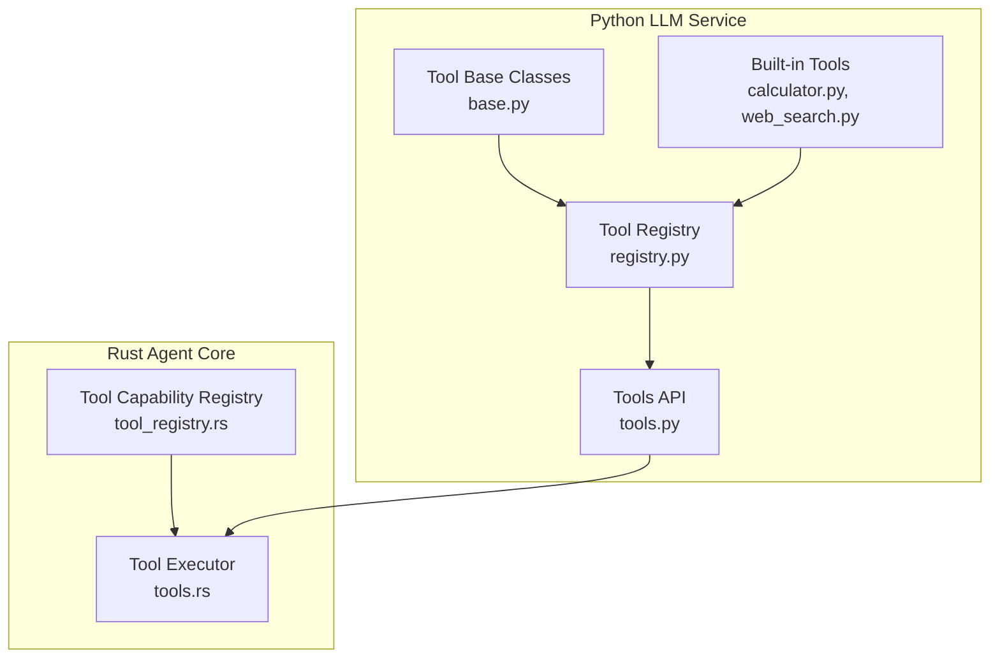
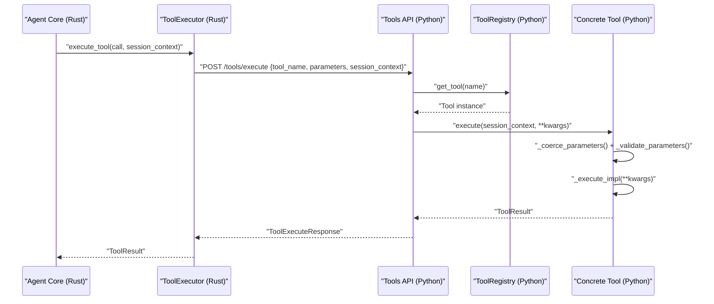
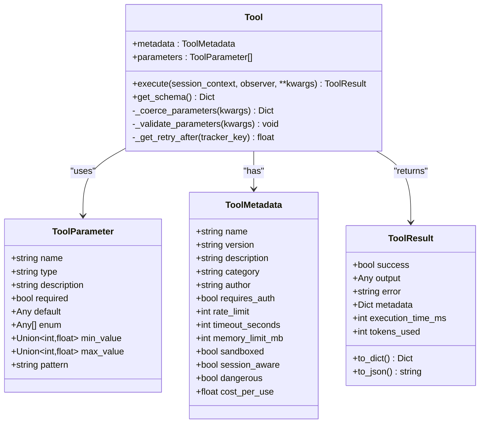
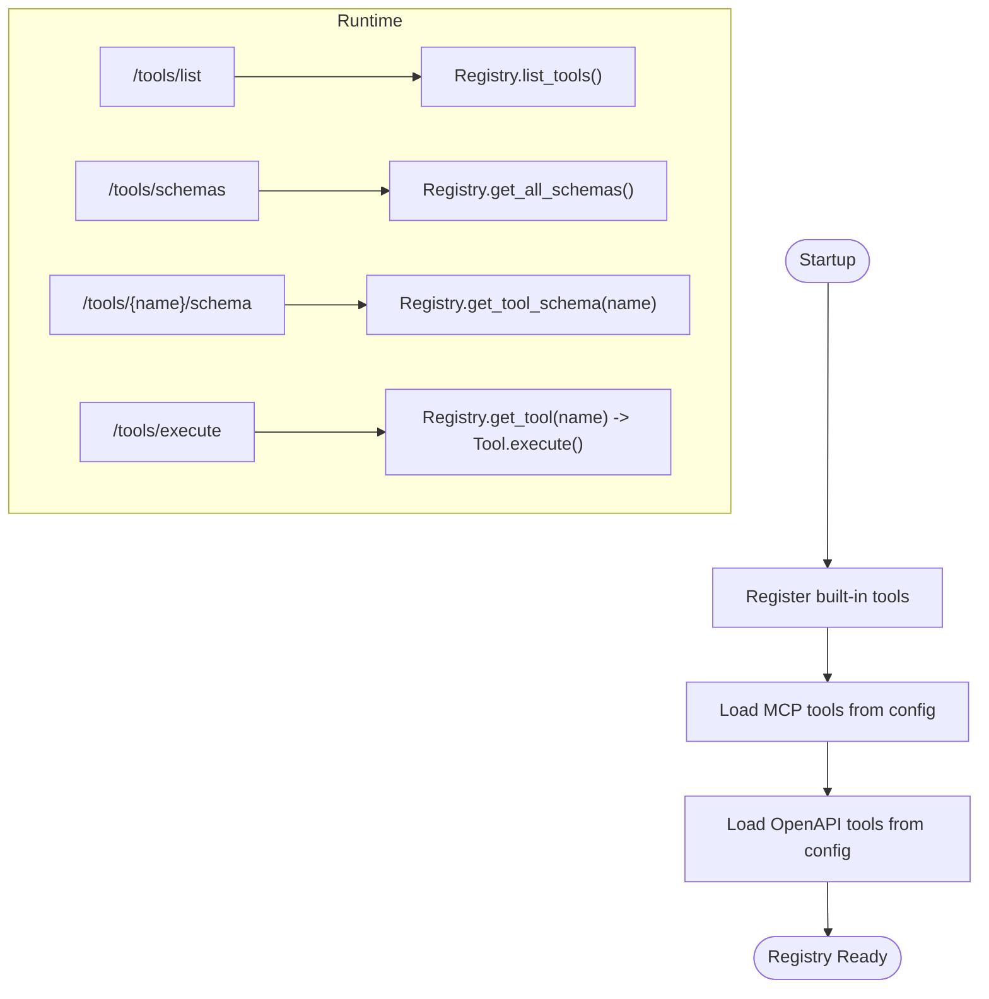
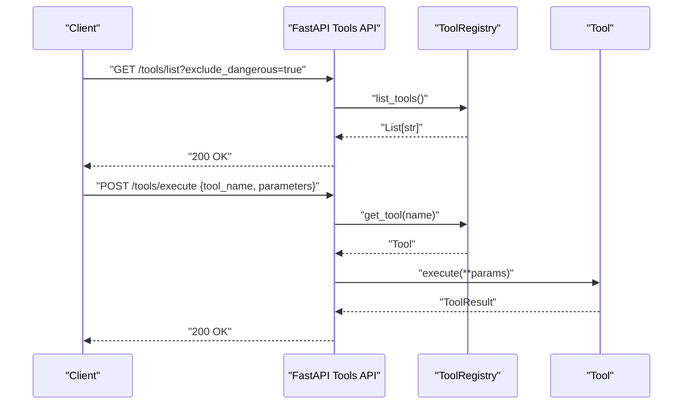
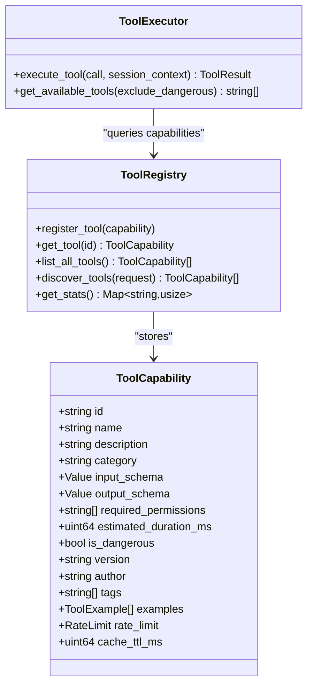
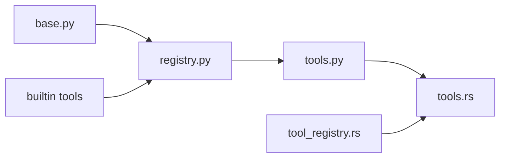

# Custom Tool Development

<cite>
**Referenced Files in This Document**
- [adding-custom-tools.md](file://docs/adding-custom-tools.md)
- [base.py](file://python/llm-service/llm_service/tools/base.py)
- [registry.py](file://python/llm-service/llm_service/tools/registry.py)
- [tools.py](file://python/llm-service/llm_service/api/tools.py)
- [calculator.py](file://python/llm-service/llm_service/tools/builtin/calculator.py)
- [web_search.py](file://python/llm-service/llm_service/tools/builtin/web_search.py)
- [tool_registry.rs](file://rust/agent-core/src/tool_registry.rs)
- [tools.rs](file://rust/agent-core/src/tools.rs)
</cite>

## Table of Contents
1. [Introduction](#introduction)
2. [Project Structure](#project-structure)
3. [Core Components](#core-components)
4. [Architecture Overview](#architecture-overview)
5. [Detailed Component Analysis](#detailed-component-analysis)
6. [Dependency Analysis](#dependency-analysis)
7. [Performance Considerations](#performance-considerations)
8. [Troubleshooting Guide](#troubleshooting-guide)
9. [Conclusion](#conclusion)
10. [Appendices](#appendices)

## Introduction
This document provides a comprehensive guide to developing custom tools within Shannon’s ecosystem. It covers the Tool base class interface, metadata and parameter specifications, lifecycle and execution patterns, result handling, security and sandboxing, resource limitations, step-by-step tutorials, testing and validation, debugging, performance optimization, and best practices. The guide references the Python tool system and Rust agent core components that power tool discovery, execution, and orchestration.

## Project Structure
Shannon’s tool system spans two primary layers:
- Python LLM service: Defines the Tool base class, parameter and metadata schemas, tool registry, and HTTP APIs for tool discovery, registration, and execution.
- Rust agent core: Provides a separate tool capability registry and executor for agent-side tool selection and execution, including WASI sandboxing for code execution.

**Diagram sources**
- [base.py](file://python/llm-service/llm_service/tools/base.py#L94-L443)
- [registry.py](file://python/llm-service/llm_service/tools/registry.py#L16-L230)
- [tools.py](file://python/llm-service/llm_service/api/tools.py#L325-L373)
- [calculator.py](file://python/llm-service/llm_service/tools/builtin/calculator.py#L52-L137)
- [web_search.py](file://python/llm-service/llm_service/tools/builtin/web_search.py#L730-L800)
- [tool_registry.rs](file://rust/agent-core/src/tool_registry.rs#L55-L319)
- [tools.rs](file://rust/agent-core/src/tools.rs#L58-L345)

**Section sources**
- [base.py](file://python/llm-service/llm_service/tools/base.py#L1-L443)
- [registry.py](file://python/llm-service/llm_service/tools/registry.py#L1-L230)
- [tools.py](file://python/llm-service/llm_service/api/tools.py#L1-L966)
- [calculator.py](file://python/llm-service/llm-service/tools/builtin/calculator.py#L1-L321)
- [web_search.py](file://python/llm-service/llm-service/tools/builtin/web_search.py#L1-L1653)
- [tool_registry.rs](file://rust/agent-core/src/tool_registry.rs#L1-L319)
- [tools.rs](file://rust/agent-core/src/tools.rs#L1-L345)

## Core Components
- Tool base class and schemas:
  - ToolParameterType enumerates supported parameter types.
  - ToolParameter defines parameter metadata (name, type, description, required, default, enum, min/max, pattern).
  - ToolMetadata defines tool metadata (name, version, description, category, author, requires_auth, rate_limit, timeout_seconds, memory_limit_mb, sandboxed, session_aware, dangerous, cost_per_use, input_examples).
  - ToolResult encapsulates execution outcomes (success, output, error, metadata, execution_time_ms, tokens_used).
  - Tool abstract base class orchestrates parameter coercion/validation, rate limiting, execution, and result assembly.
- Tool registry:
  - ToolRegistry manages registration, discovery, filtering, and schema retrieval for tools.
- Tools API:
  - FastAPI endpoints expose tool listing, schemas, metadata, execution, batch execution, and dynamic registration for MCP and OpenAPI tools.
- Built-in tools:
  - CalculatorTool demonstrates safe expression evaluation and parameter validation.
  - WebSearchTool illustrates provider abstraction, error sanitization, and fallback behavior.

**Section sources**
- [base.py](file://python/llm-service/llm_service/tools/base.py#L20-L443)
- [registry.py](file://python/llm-service/llm_service/tools/registry.py#L16-L230)
- [tools.py](file://python/llm-service/llm_service/api/tools.py#L375-L800)
- [calculator.py](file://python/llm-service/llm-service/tools/builtin/calculator.py#L52-L137)
- [web_search.py](file://python/llm-service/llm-service/tools/builtin/web_search.py#L730-L800)

## Architecture Overview
The tool architecture integrates Python-defined tools with Rust agent execution and capability registries.

**Diagram sources**
- [tools.rs](file://rust/agent-core/src/tools.rs#L114-L320)
- [tools.py](file://python/llm-service/llm_service/api/tools.py#L694-L747)
- [base.py](file://python/llm-service/llm_service/tools/base.py#L127-L214)
- [registry.py](file://python/llm-service/llm_service/tools/registry.py#L74-L86)

**Section sources**
- [tools.rs](file://rust/agent-core/src/tools.rs#L114-L320)
- [tools.py](file://python/llm-service/llm_service/api/tools.py#L694-L747)
- [base.py](file://python/llm-service/llm_service/tools/base.py#L127-L214)
- [registry.py](file://python/llm-service/llm_service/tools/registry.py#L74-L86)

## Detailed Component Analysis

### Tool Base Class and Schemas
- Parameter types and validation:
  - Supports string, integer, float, boolean, array, object, and file types.
  - Automatic coercion for numeric-like strings and boolean-like strings.
  - Validation includes required fields, enum constraints, min/max bounds, regex patterns, and unknown parameter detection.
- Metadata and result:
  - ToolMetadata includes sandboxing, session awareness, dangerous flag, cost, and rate limit.
  - ToolResult standardizes outputs and execution timing.
- Execution lifecycle:
  - Parameter coercion and validation occur before execution.
  - Rate limiting is enforced per session or agent when configured; high-throughput tools bypass rate limiting thresholds.
  - Execution time is recorded and attached to results.

**Diagram sources**
- [base.py](file://python/llm-service/llm_service/tools/base.py#L20-L443)

**Section sources**
- [base.py](file://python/llm-service/llm_service/tools/base.py#L20-L443)

### Tool Registry
- Responsibilities:
  - Register/unregister tools by class.
  - Maintain category indices and singleton instances.
  - Discover tools from packages and filter by category, danger, and cost.
  - Provide schemas and metadata for tool selection.
- Usage:
  - Centralized via get_registry() singleton.

**Diagram sources**
- [tools.py](file://python/llm-service/llm_service/api/tools.py#L325-L373)
- [registry.py](file://python/llm-service/llm_service/tools/registry.py#L16-L230)

**Section sources**
- [registry.py](file://python/llm-service/llm_service/tools/registry.py#L16-L230)
- [tools.py](file://python/llm-service/llm_service/api/tools.py#L375-L476)

### Tools API Endpoints
- Listing and filtering:
  - GET /tools/list, categories, schemas, metadata.
- Execution:
  - POST /tools/execute and /tools/batch-execute.
- Dynamic registration:
  - POST /tools/mcp/register and /tools/openapi/register with admin token gating.
- Configuration-driven loading:
  - Startup loads MCP and OpenAPI tools from configuration.

**Diagram sources**
- [tools.py](file://python/llm-service/llm_service/api/tools.py#L375-L747)

**Section sources**
- [tools.py](file://python/llm-service/llm_service/api/tools.py#L375-L747)

### Built-in Tools Patterns
- CalculatorTool:
  - Demonstrates safe evaluation, parameter validation, and error handling.
- WebSearchTool:
  - Provider abstraction, error sanitization, and fallback behavior for site scraping.

**Section sources**
- [calculator.py](file://python/llm-service/llm-service/tools/builtin/calculator.py#L52-L137)
- [web_search.py](file://python/llm-service/llm-service/tools/builtin/web_search.py#L730-L800)

### Rust Agent Core Tool Registry and Executor
- Tool capability registry:
  - Stores tool capabilities with input/output schemas, permissions, rate limits, and caching hints.
- Tool executor:
  - Executes tools remotely via HTTP to the Python LLM service, with special-case handling for calculator and code executor (when WASI feature is enabled).
  - Converts session context from protobuf to JSON for tool execution.

**Diagram sources**
- [tool_registry.rs](file://rust/agent-core/src/tool_registry.rs#L6-L319)
- [tools.rs](file://rust/agent-core/src/tools.rs#L58-L345)

**Section sources**
- [tool_registry.rs](file://rust/agent-core/src/tool_registry.rs#L6-L319)
- [tools.rs](file://rust/agent-core/src/tools.rs#L58-L345)

## Dependency Analysis
- Python tool system dependencies:
  - Tool depends on ToolParameter, ToolMetadata, ToolResult.
  - ToolRegistry depends on Tool and maintains category indices.
  - Tools API depends on ToolRegistry and FastAPI for endpoints.
- Rust agent core dependencies:
  - ToolExecutor depends on HTTP client and optional WASI sandbox.
  - ToolRegistry stores structured capability metadata.

**Diagram sources**
- [base.py](file://python/llm-service/llm_service/tools/base.py#L94-L443)
- [registry.py](file://python/llm-service/llm_service/tools/registry.py#L16-L230)
- [tools.py](file://python/llm-service/llm_service/api/tools.py#L325-L373)
- [tools.rs](file://rust/agent-core/src/tools.rs#L114-L320)
- [tool_registry.rs](file://rust/agent-core/src/tool_registry.rs#L55-L319)

**Section sources**
- [base.py](file://python/llm-service/llm_service/tools/base.py#L94-L443)
- [registry.py](file://python/llm-service/llm_service/tools/registry.py#L16-L230)
- [tools.py](file://python/llm-service/llm_service/api/tools.py#L325-L373)
- [tools.rs](file://rust/agent-core/src/tools.rs#L114-L320)
- [tool_registry.rs](file://rust/agent-core/src/tool_registry.rs#L55-L319)

## Performance Considerations
- Parameter coercion and validation:
  - Efficiently coerce numeric-like strings and booleans to reduce downstream errors.
- Rate limiting:
  - Use per-session or per-agent tracking for fairness; high-throughput tools bypass rate limiting above thresholds.
- Execution time tracking:
  - ToolResult records execution_time_ms for observability and optimization.
- Built-in tools:
  - CalculatorTool sets low timeouts and small memory limits for fast, lightweight operations.
- Rust executor:
  - Local calculator evaluation avoids network latency; WASI code execution is sandboxed and controlled.

[No sources needed since this section provides general guidance]

## Troubleshooting Guide
- Tool not found:
  - Verify registration via /tools/list and ensure the tool name matches metadata.name.
- Parameter validation errors:
  - Confirm parameter types, enums, ranges, and required fields align with ToolParameter definitions.
- Rate limit exceeded:
  - Inspect retry_after_seconds in ToolResult metadata and adjust rate_limit or session context.
- Execution failures:
  - Check ToolResult.error and ToolResult.execution_time_ms; review tool-specific error handling (e.g., calculator exceptions).
- API registration:
  - Ensure MCP_REGISTER_TOKEN is set and used for /tools/mcp/register and /tools/openapi/register endpoints.

**Section sources**
- [tools.py](file://python/llm-service/llm_service/api/tools.py#L694-L747)
- [base.py](file://python/llm-service/llm_service/tools/base.py#L162-L175)
- [calculator.py](file://python/llm-service/llm-service/tools/builtin/calculator.py#L127-L136)

## Conclusion
Shannon’s tool system provides a robust, extensible framework for building and operating custom tools. The Python Tool base class and registry, combined with FastAPI endpoints and Rust agent execution, enable secure, observable, and scalable tool usage. By following the guidelines in this document—especially around metadata, parameter specification, lifecycle management, security, and performance—you can develop high-quality tools that integrate seamlessly into the Shannon ecosystem.

[No sources needed since this section summarizes without analyzing specific files]

## Appendices

### Step-by-Step Tutorial: Creating a Custom Tool
- Define the tool class:
  - Subclass Tool and implement _get_metadata(), _get_parameters(), and _execute_impl().
- Register the tool:
  - Add import and tool class to the startup registration list in tools.py.
- Test the tool:
  - Use /tools/list, /tools/{name}/schema, and /tools/execute to verify availability and behavior.
- Optional: Dynamic registration:
  - Use /tools/mcp/register or /tools/openapi/register for runtime additions.

**Section sources**
- [adding-custom-tools.md](file://docs/adding-custom-tools.md#L448-L625)
- [tools.py](file://python/llm-service/llm_service/api/tools.py#L325-L373)
- [base.py](file://python/llm-service/llm_service/tools/base.py#L94-L126)

### Tool Lifecycle and Execution Patterns
- Lifecycle:
  - Registration (startup or runtime).
  - Discovery (/tools/list, /tools/schemas).
  - Execution (/tools/execute, /tools/batch-execute).
  - Result handling (ToolResult).
- Execution patterns:
  - Parameter coercion and validation.
  - Rate limiting and retry-after handling.
  - Sandbox-aware execution (WASI for code execution in Rust).

**Section sources**
- [tools.py](file://python/llm-service/llm_service/api/tools.py#L375-L747)
- [base.py](file://python/llm-service/llm_service/tools/base.py#L127-L214)
- [tools.rs](file://rust/agent-core/src/tools.rs#L114-L320)

### Security, Sandboxing, and Resource Limits
- Sandboxing:
  - ToolMetadata.sandboxed flag indicates sandboxed execution.
  - WASI sandbox in Rust for code execution.
- Security gates:
  - Domain allowlists for MCP/OpenAPI tools.
  - Admin token gating for dynamic registration.
- Resource limits:
  - ToolMetadata.timeout_seconds and memory_limit_mb.
  - Rate limits via ToolMetadata.rate_limit.

**Section sources**
- [adding-custom-tools.md](file://docs/adding-custom-tools.md#L83-L127)
- [base.py](file://python/llm-service/llm_service/tools/base.py#L48-L64)
- [tools.rs](file://rust/agent-core/src/tools.rs#L191-L276)

### Testing, Validation, and Debugging
- Health checks and verification:
  - Use /tools/list, /tools/schemas, and /tools/{name}/schema endpoints.
- Validation:
  - Use /tools/openapi/validate to preview operations before registration.
- Debugging:
  - Inspect ToolResult.error and execution_time_ms.
  - Review logs for registration and execution events.

**Section sources**
- [tools.py](file://python/llm-service/llm_service/api/tools.py#L478-L520)
- [tools.py](file://python/llm-service/llm_service/api/tools.py#L522-L590)
- [tools.py](file://python/llm-service/llm_service/api/tools.py#L778-L800)

### Best Practices
- Define precise ToolParameter constraints (types, enums, min/max, patterns).
- Keep ToolMetadata accurate (category, cost, rate_limit, sandboxed).
- Implement robust error handling and sanitization (e.g., web search error redaction).
- Prefer sandboxed execution for potentially dangerous tools.
- Use rate limits for high-traffic tools and monitor execution times.

**Section sources**
- [web_search.py](file://python/llm-service/llm-service/tools/builtin/web_search.py#L88-L111)
- [base.py](file://python/llm-service/llm_service/tools/base.py#L48-L64)
- [calculator.py](file://python/llm-service/llm-service/tools/builtin/calculator.py#L62-L76)