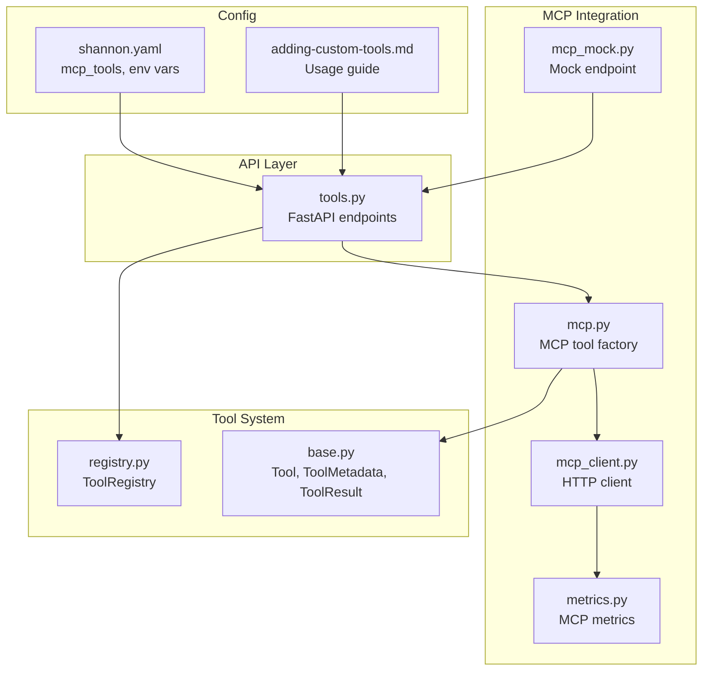
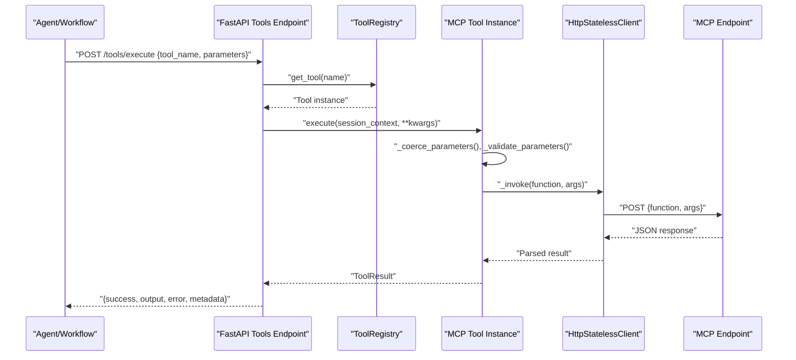
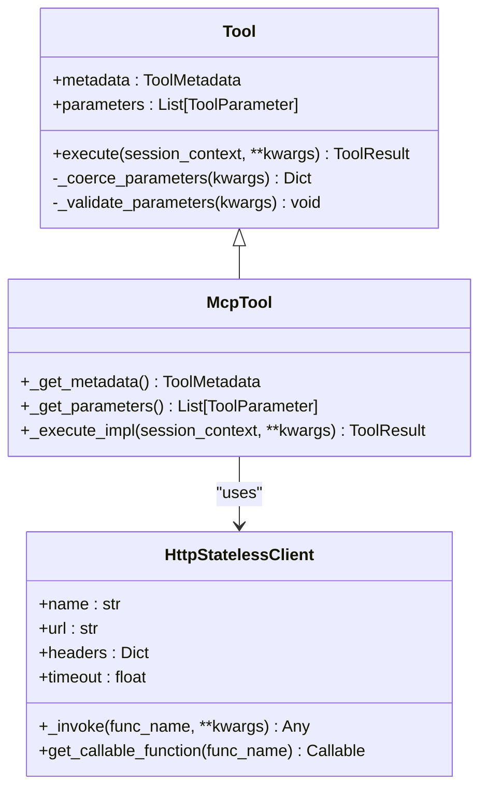
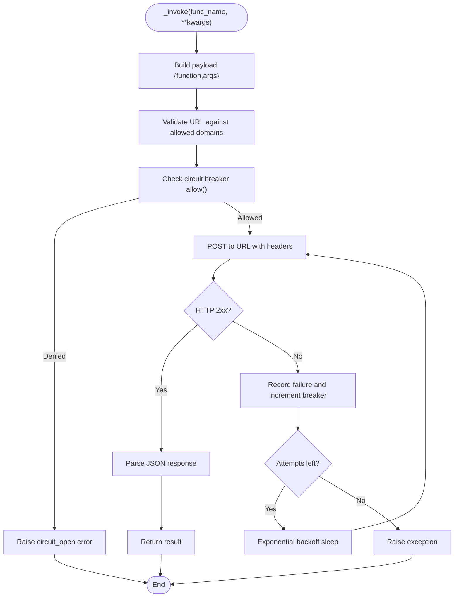
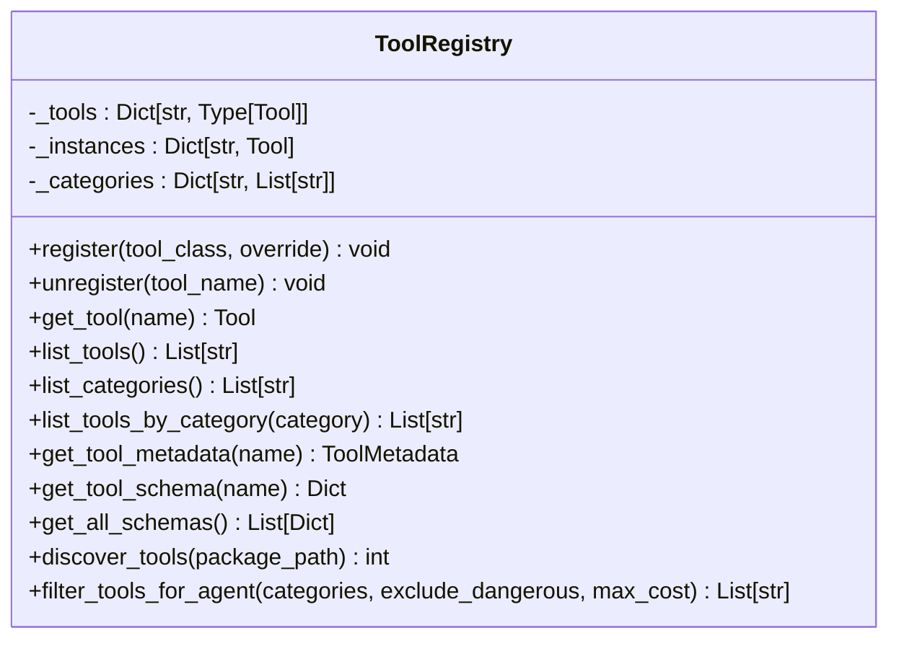
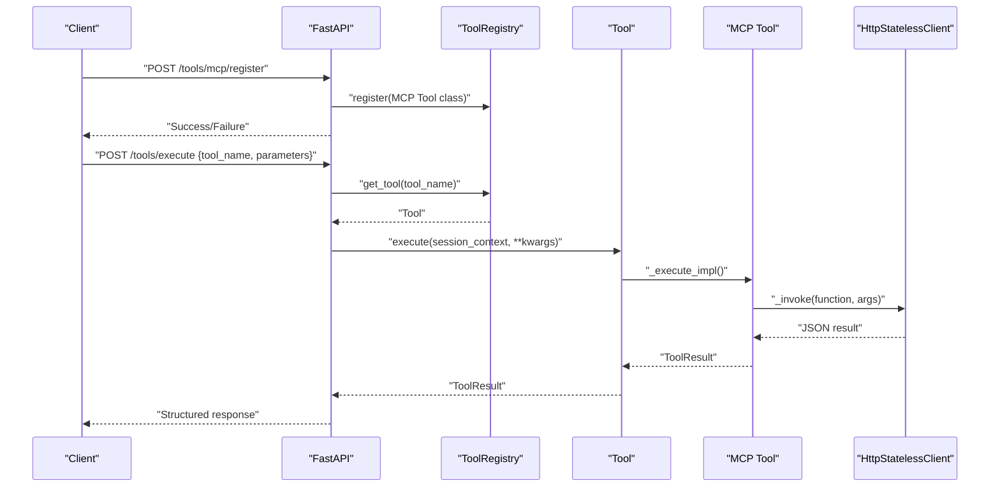
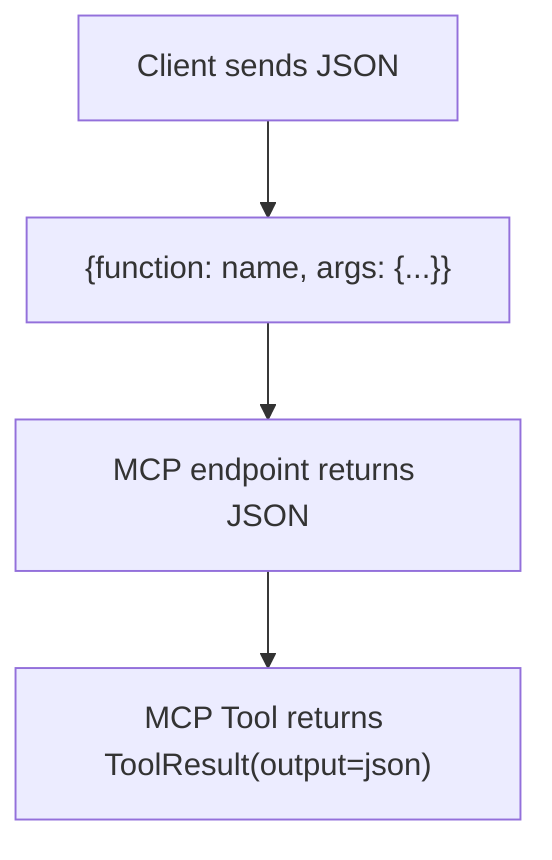
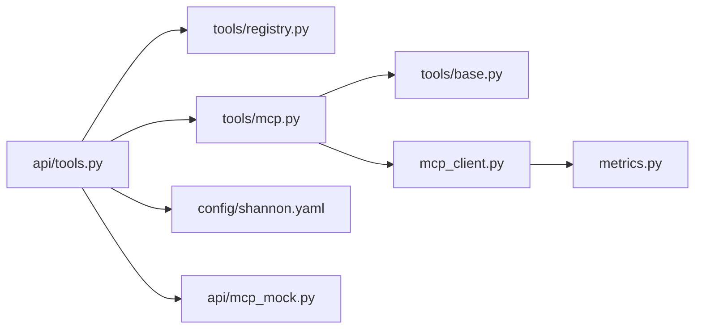

# MCP Protocol Integration

<cite>
**Referenced Files in This Document**
- [mcp.py](file://python/llm-service/llm_service/tools/mcp.py)
- [mcp_client.py](file://python/llm-service/llm_service/mcp_client.py)
- [base.py](file://python/llm-service/llm_service/tools/base.py)
- [registry.py](file://python/llm-service/llm_service/tools/registry.py)
- [tools.py](file://python/llm-service/llm_service/api/tools.py)
- [metrics.py](file://python/llm-service/llm_service/metrics.py)
- [mcp_mock.py](file://python/llm-service/llm_service/api/mcp_mock.py)
- [shannon.yaml](file://config/shannon.yaml)
- [adding-custom-tools.md](file://docs/adding-custom-tools.md)
</cite>

## Table of Contents
1. [Introduction](#introduction)
2. [Project Structure](#project-structure)
3. [Core Components](#core-components)
4. [Architecture Overview](#architecture-overview)
5. [Detailed Component Analysis](#detailed-component-analysis)
6. [Dependency Analysis](#dependency-analysis)
7. [Performance Considerations](#performance-considerations)
8. [Troubleshooting Guide](#troubleshooting-guide)
9. [Conclusion](#conclusion)
10. [Appendices](#appendices)

## Introduction
This document explains how Shannon integrates the Model Context Protocol (MCP) to connect external tools and services through HTTP. It covers the MCP client implementation, tool registration and discovery, execution patterns, protocol conventions, authentication and security controls, bidirectional communication via the LLM service API, and operational concerns such as rate limiting, circuit breakers, and monitoring. Practical examples show how to implement MCP-compliant tools, configure connections, and handle responses.

## Project Structure
Shannon’s MCP integration spans several modules:
- Tool base and registry define the abstraction and lifecycle for tools.
- MCP tool factory generates typed tool classes that invoke remote HTTP endpoints.
- MCP HTTP client encapsulates transport, domain allowlists, retries, timeouts, and circuit breakers.
- API layer exposes endpoints for dynamic registration, schema retrieval, and execution.
- Metrics capture MCP request counts and durations.
- Configuration files define MCP tool definitions and environment variables for security and behavior.

**Diagram sources**
- [mcp.py](file://python/llm-service/llm_service/tools/mcp.py#L33-L131)
- [mcp_client.py](file://python/llm-service/llm_service/mcp_client.py#L47-L149)
- [metrics.py](file://python/llm-service/llm_service/metrics.py#L44-L133)
- [mcp_mock.py](file://python/llm-service/llm_service/api/mcp_mock.py#L1-L23)
- [base.py](file://python/llm-service/llm_service/tools/base.py#L94-L443)
- [registry.py](file://python/llm-service/llm_service/tools/registry.py#L16-L230)
- [tools.py](file://python/llm-service/llm_service/api/tools.py#L1-L966)
- [shannon.yaml](file://config/shannon.yaml#L53-L90)
- [adding-custom-tools.md](file://docs/adding-custom-tools.md#L39-L211)

**Section sources**
- [mcp.py](file://python/llm-service/llm_service/tools/mcp.py#L1-L131)
- [mcp_client.py](file://python/llm-service/llm_service/mcp_client.py#L1-L149)
- [base.py](file://python/llm-service/llm_service/tools/base.py#L1-L443)
- [registry.py](file://python/llm-service/llm_service/tools/registry.py#L1-L230)
- [tools.py](file://python/llm-service/llm_service/api/tools.py#L1-L966)
- [metrics.py](file://python/llm-service/llm_service/metrics.py#L1-L161)
- [mcp_mock.py](file://python/llm-service/llm_service/api/mcp_mock.py#L1-L23)
- [shannon.yaml](file://config/shannon.yaml#L53-L90)
- [adding-custom-tools.md](file://docs/adding-custom-tools.md#L39-L211)

## Core Components
- MCP tool factory: Creates a Tool subclass that posts JSON to an MCP endpoint and returns the parsed JSON result. It supports parameter schemas and per-tool rate limiting.
- HTTP stateless client: Validates domains, enforces response size limits, retries with exponential backoff, and applies a per-URL circuit breaker.
- Base tool system: Provides parameter coercion/validation, rate limiting, execution tracking, and JSON schema generation.
- Tool registry: Centralized registration, discovery, and filtering of tools.
- API endpoints: Dynamic MCP registration, schema listing, and execution dispatch.
- Metrics: MCP request counters and durations for observability.
- Mock endpoint: Smoke-testing utility for MCP-style invocations.

**Section sources**
- [mcp.py](file://python/llm-service/llm_service/tools/mcp.py#L33-L131)
- [mcp_client.py](file://python/llm-service/llm_service/mcp_client.py#L47-L149)
- [base.py](file://python/llm-service/llm_service/tools/base.py#L94-L443)
- [registry.py](file://python/llm-service/llm_service/tools/registry.py#L16-L230)
- [tools.py](file://python/llm-service/llm_service/api/tools.py#L478-L747)
- [metrics.py](file://python/llm-service/llm_service/metrics.py#L44-L133)
- [mcp_mock.py](file://python/llm-service/llm_service/api/mcp_mock.py#L1-L23)

## Architecture Overview
Shannon’s MCP integration follows a layered design:
- External tools expose HTTP endpoints that accept a JSON body with a function name and arguments.
- The MCP tool factory generates a Tool class that invokes the endpoint via the HTTP client.
- The API layer registers tools statically from configuration or dynamically via endpoints.
- Execution routes through the tool registry and base tool execution pipeline, applying validation, rate limiting, and error handling.
- Observability tracks MCP requests and durations.

**Diagram sources**
- [tools.py](file://python/llm-service/llm_service/api/tools.py#L694-L747)
- [registry.py](file://python/llm-service/llm_service/tools/registry.py#L74-L86)
- [base.py](file://python/llm-service/llm_service/tools/base.py#L127-L214)
- [mcp.py](file://python/llm-service/llm_service/tools/mcp.py#L95-L128)
- [mcp_client.py](file://python/llm-service/llm_service/mcp_client.py#L105-L140)

## Detailed Component Analysis

### MCP Tool Factory
The MCP tool factory creates a Tool subclass that:
- Accepts a remote function name and endpoint URL.
- Converts YAML-defined parameter schemas into ToolParameter instances.
- Implements metadata with cost-per-use, timeouts, and sandbox/session flags.
- Executes by invoking the HTTP client with a standardized JSON payload.

**Diagram sources**
- [base.py](file://python/llm-service/llm_service/tools/base.py#L94-L443)
- [mcp_client.py](file://python/llm-service/llm_service/mcp_client.py#L47-L149)
- [mcp.py](file://python/llm-service/llm_service/tools/mcp.py#L59-L131)

**Section sources**
- [mcp.py](file://python/llm-service/llm_service/tools/mcp.py#L33-L131)

### HTTP Stateless Client
The HTTP client enforces:
- Domain allowlist validation for URLs.
- Response size limits.
- Retries with exponential backoff.
- Per-URL circuit breaker with failure threshold and recovery timeout.
- Metrics recording for MCP requests.

**Diagram sources**
- [mcp_client.py](file://python/llm-service/llm_service/mcp_client.py#L105-L140)

**Section sources**
- [mcp_client.py](file://python/llm-service/llm_service/mcp_client.py#L14-L149)

### Tool Registry and Discovery
The registry:
- Registers tool classes and maintains singleton instances.
- Indexes tools by category for filtering.
- Discovers tools from packages and filters for agent selection.

**Diagram sources**
- [registry.py](file://python/llm-service/llm_service/tools/registry.py#L16-L230)

**Section sources**
- [registry.py](file://python/llm-service/llm_service/tools/registry.py#L16-L230)

### API Endpoints and Execution
Endpoints:
- Static registration from configuration (YAML) during startup.
- Dynamic registration via admin-protected endpoints.
- Tool listing, schema retrieval, and execution.
- Batch execution support.

Execution flow:
- Sanitizes session context.
- Resolves tool by name.
- Unwraps nested parameters if needed.
- Executes tool with validation and rate limiting.
- Returns structured ToolResult.

**Diagram sources**
- [tools.py](file://python/llm-service/llm_service/api/tools.py#L478-L747)
- [registry.py](file://python/llm-service/llm_service/tools/registry.py#L74-L86)
- [mcp.py](file://python/llm-service/llm_service/tools/mcp.py#L95-L128)
- [mcp_client.py](file://python/llm-service/llm_service/mcp_client.py#L105-L140)

**Section sources**
- [tools.py](file://python/llm-service/llm_service/api/tools.py#L228-L355)
- [tools.py](file://python/llm-service/llm_service/api/tools.py#L478-L747)

### Protocol Messages and Conventions
- Request convention: POST to the MCP endpoint with JSON body containing a function name and arguments object.
- Response convention: Return JSON; the MCP tool wrapper treats the entire JSON as the tool output.
- Mock endpoint: Supports a simple echo function for smoke testing.

**Diagram sources**
- [mcp_mock.py](file://python/llm-service/llm_service/api/mcp_mock.py#L8-L22)
- [mcp.py](file://python/llm-service/llm_service/tools/mcp.py#L95-L128)

**Section sources**
- [adding-custom-tools.md](file://docs/adding-custom-tools.md#L188-L211)
- [mcp_mock.py](file://python/llm-service/llm_service/api/mcp_mock.py#L1-L23)

### Authentication and Security
- Domain allowlist: MCP_ALLOWED_DOMAINS restricts outbound domains; wildcard allowed only in development.
- Response size limits: MCP_MAX_RESPONSE_BYTES caps response sizes.
- Retries and timeouts: MCP_RETRIES and MCP_TIMEOUT_SECONDS tune resilience and latency.
- Admin token gate: MCP_REGISTER_TOKEN protects dynamic registration endpoints.
- Circuit breaker: MCP_CB_FAILURES and MCP_CB_RECOVERY_SECONDS govern transient failure handling.

**Section sources**
- [mcp_client.py](file://python/llm-service/llm_service/mcp_client.py#L59-L88)
- [tools.py](file://python/llm-service/llm_service/api/tools.py#L478-L520)
- [shannon.yaml](file://config/shannon.yaml#L53-L90)
- [adding-custom-tools.md](file://docs/adding-custom-tools.md#L715-L731)

### Bidirectional Communication
- Outbound: MCP tools send HTTP requests to external endpoints.
- Inbound: The LLM service exposes endpoints for tool registration and execution, enabling agents to discover and invoke tools.

**Section sources**
- [tools.py](file://python/llm-service/llm_service/api/tools.py#L325-L373)
- [mcp_client.py](file://python/llm-service/llm_service/mcp_client.py#L105-L140)

### Practical Implementation Examples
- Implementing an MCP-compliant tool: Expose an HTTP endpoint that accepts the standardized JSON and returns JSON.
- Configuring MCP connections: Define tool entries in the YAML configuration with URL, function name, parameters, and optional headers.
- Handling responses: The MCP tool returns the raw JSON as the tool output; wrap complex responses in ToolResult-compatible structures.

**Section sources**
- [adding-custom-tools.md](file://docs/adding-custom-tools.md#L39-L211)
- [mcp.py](file://python/llm-service/llm_service/tools/mcp.py#L95-L128)

### Tool Lifecycle Management
- Registration: Static from YAML at startup; dynamic via admin-protected endpoints.
- Discovery: ToolRegistry supports listing, filtering, and schema retrieval.
- Execution: Base tool pipeline validates parameters, applies rate limits, and records execution time.

**Section sources**
- [tools.py](file://python/llm-service/llm_service/api/tools.py#L228-L355)
- [registry.py](file://python/llm-service/llm_service/tools/registry.py#L74-L117)
- [base.py](file://python/llm-service/llm_service/tools/base.py#L127-L214)

### Error Handling and Observability
- Errors propagate as ToolResult with error messages.
- Metrics capture MCP request totals and durations.
- Circuit breaker prevents cascading failures during outages.

**Section sources**
- [base.py](file://python/llm-service/llm_service/tools/base.py#L207-L213)
- [metrics.py](file://python/llm-service/llm_service/metrics.py#L125-L133)
- [mcp_client.py](file://python/llm-service/llm_service/mcp_client.py#L14-L44)

## Dependency Analysis
The MCP integration depends on:
- Tool base and registry for lifecycle and validation.
- HTTP client for transport and resilience.
- API layer for registration and execution.
- Metrics for observability.
- Configuration for security and behavior.

**Diagram sources**
- [tools.py](file://python/llm-service/llm_service/api/tools.py#L1-L966)
- [registry.py](file://python/llm-service/llm_service/tools/registry.py#L1-L230)
- [mcp.py](file://python/llm-service/llm_service/tools/mcp.py#L1-L131)
- [base.py](file://python/llm-service/llm_service/tools/base.py#L1-L443)
- [mcp_client.py](file://python/llm-service/llm_service/mcp_client.py#L1-L149)
- [metrics.py](file://python/llm-service/llm_service/metrics.py#L1-L161)
- [shannon.yaml](file://config/shannon.yaml#L53-L90)
- [mcp_mock.py](file://python/llm-service/llm_service/api/mcp_mock.py#L1-L23)

**Section sources**
- [tools.py](file://python/llm-service/llm_service/api/tools.py#L1-L966)
- [mcp.py](file://python/llm-service/llm_service/tools/mcp.py#L1-L131)
- [mcp_client.py](file://python/llm-service/llm_service/mcp_client.py#L1-L149)
- [base.py](file://python/llm-service/llm_service/tools/base.py#L1-L443)
- [registry.py](file://python/llm-service/llm_service/tools/registry.py#L1-L230)
- [metrics.py](file://python/llm-service/llm_service/metrics.py#L1-L161)
- [shannon.yaml](file://config/shannon.yaml#L53-L90)
- [mcp_mock.py](file://python/llm-service/llm_service/api/mcp_mock.py#L1-L23)

## Performance Considerations
- Use domain allowlists and response size limits to bound resource usage.
- Tune retries and timeouts to balance reliability and latency.
- Apply per-tool rate limiting to protect upstream services.
- Monitor MCP request counts and durations via metrics.
- Circuit breakers reduce load during outages.

[No sources needed since this section provides general guidance]

## Troubleshooting Guide
Common issues and remedies:
- Domain not allowed: Ensure the MCP endpoint hostname matches MCP_ALLOWED_DOMAINS.
- Rate limit exceeded: Adjust MCP_RATE_LIMIT_DEFAULT or reduce invocation frequency.
- Circuit breaker open: Wait for recovery timeout or reduce failures.
- Registration unauthorized: Provide MCP_REGISTER_TOKEN via Authorization or X-Admin-Token header.
- Parameter validation errors: Confirm parameter types and required fields align with the tool schema.

**Section sources**
- [mcp_client.py](file://python/llm-service/llm_service/mcp_client.py#L90-L99)
- [mcp.py](file://python/llm-service/llm_service/tools/mcp.py#L53-L57)
- [tools.py](file://python/llm-service/llm_service/api/tools.py#L487-L496)
- [base.py](file://python/llm-service/llm_service/tools/base.py#L268-L315)

## Conclusion
Shannon’s MCP integration provides a robust, secure, and observable way to connect external HTTP endpoints as tools. The MCP tool factory, HTTP client, and API layer work together to enforce safety, reliability, and performance while exposing a simple JSON protocol. Administrators can manage tools declaratively or dynamically, and operators can monitor MCP activity through metrics.

[No sources needed since this section summarizes without analyzing specific files]

## Appendices

### MCP Configuration Reference
- mcp_tools: Define tool entries with URL, function name, parameters, headers, and cost.
- Environment variables: MCP_ALLOWED_DOMAINS, MCP_MAX_RESPONSE_BYTES, MCP_RETRIES, MCP_TIMEOUT_SECONDS, MCP_CB_FAILURES, MCP_CB_RECOVERY_SECONDS, MCP_REGISTER_TOKEN, MCP_RATE_LIMIT_DEFAULT, MCP_COST_<NAME>.

**Section sources**
- [shannon.yaml](file://config/shannon.yaml#L53-L90)
- [adding-custom-tools.md](file://docs/adding-custom-tools.md#L659-L731)