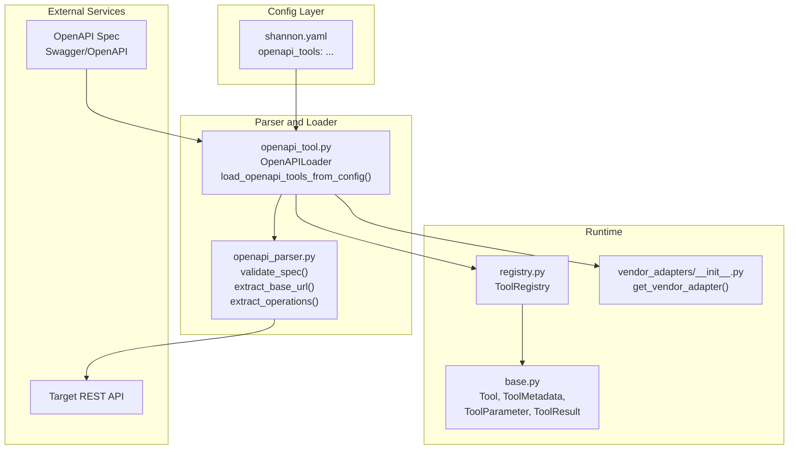
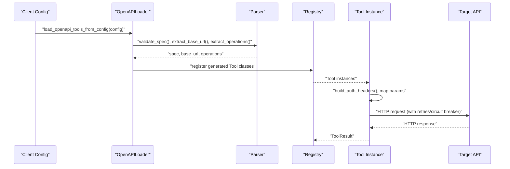
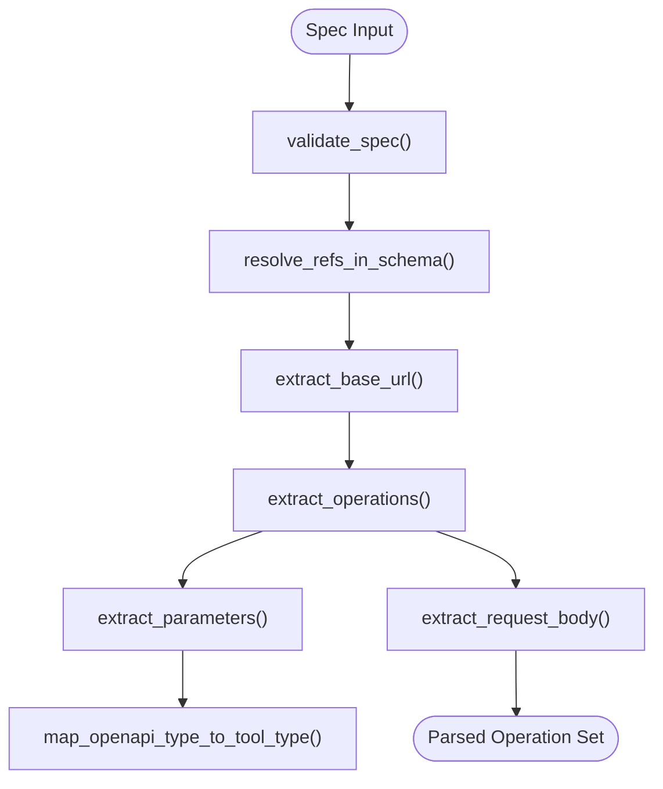
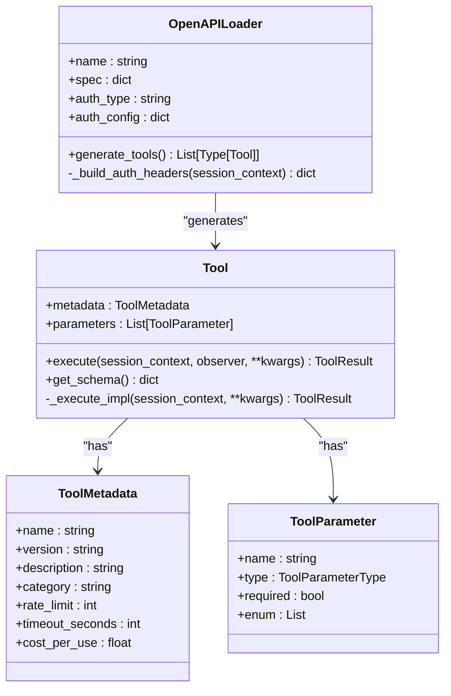
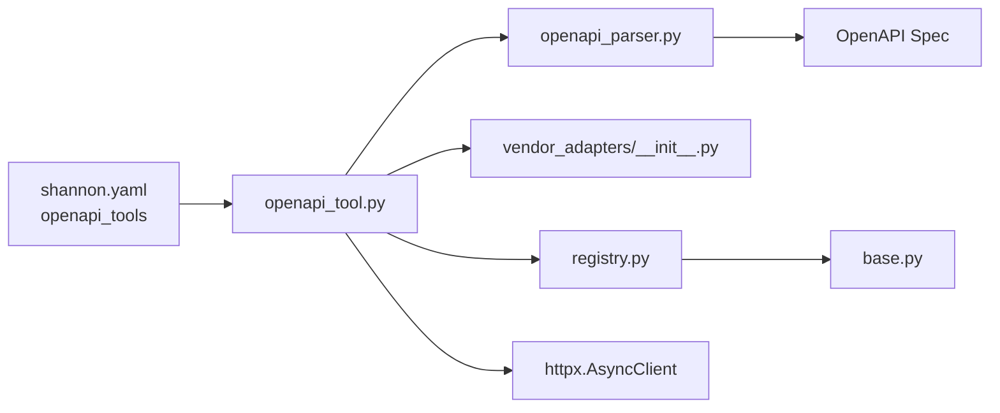

# OpenAPI Tool Integration

<cite>
**Referenced Files in This Document**
- [openapi-tools.md](file://docs/openapi-tools.md)
- [openapi_parser.py](file://python/llm-service/llm_service/tools/openapi_parser.py)
- [openapi_tool.py](file://python/llm-service/llm_service/tools/openapi_tool.py)
- [base.py](file://python/llm-service/llm_service/tools/base.py)
- [registry.py](file://python/llm-service/llm_service/tools/registry.py)
- [vendor_adapters/__init__.py](file://python/llm-service/llm_service/tools/vendor_adapters/__init__.py)
- [openapi.go](file://go/orchestrator/cmd/gateway/internal/handlers/openapi.go)
- [06_openapi_petstore_test.sh](file://tests/e2e/06_openapi_petstore_test.sh)
- [shannon.yaml](file://config/shannon.yaml)
- [test_openapi_parser.py](file://python/llm-service/tests/test_openapi_parser.py)
- [test_openapi_tool.py](file://python/llm-service/tests/test_openapi_tool.py)
</cite>

## Table of Contents
1. [Introduction](#introduction)
2. [Project Structure](#project-structure)
3. [Core Components](#core-components)
4. [Architecture Overview](#architecture-overview)
5. [Detailed Component Analysis](#detailed-component-analysis)
6. [Dependency Analysis](#dependency-analysis)
7. [Performance Considerations](#performance-considerations)
8. [Troubleshooting Guide](#troubleshooting-guide)
9. [Conclusion](#conclusion)
10. [Appendices](#appendices)

## Introduction
This document explains how the Shannon platform integrates external REST services via OpenAPI 3.x specifications. It covers automatic tool generation, authentication, parameter mapping, request/response transformation, security controls, rate limiting, and testing/validation. The goal is to help developers configure OpenAPI tools from Swagger/OpenAPI specs, tune runtime behavior, and operate them safely at scale.

## Project Structure
OpenAPI tool integration spans three primary areas:
- Parser and loader: Converts OpenAPI specs into executable tools
- Runtime tool execution: Handles authentication, parameter mapping, request building, and response handling
- Configuration and validation: Defines tool collections, authentication, rate limits, and domain allowlists

**Diagram sources**
- [openapi_parser.py](file://python/llm-service/llm_service/tools/openapi_parser.py#L169-L286)
- [openapi_tool.py](file://python/llm-service/llm_service/tools/openapi_tool.py#L604-L679)
- [base.py](file://python/llm-service/llm_service/tools/base.py#L94-L214)
- [registry.py](file://python/llm-service/llm_service/tools/registry.py#L16-L117)
- [vendor_adapters/__init__.py](file://python/llm-service/llm_service/tools/vendor_adapters/__init__.py#L62-L137)
- [shannon.yaml](file://config/shannon.yaml#L91-L158)

**Section sources**
- [openapi-parser.py](file://python/llm-service/llm_service/tools/openapi_parser.py#L1-L538)
- [openapi_tool.py](file://python/llm-service/llm_service/tools/openapi_tool.py#L1-L758)
- [base.py](file://python/llm-service/llm_service/tools/base.py#L1-L443)
- [registry.py](file://python/llm-service/llm_service/tools/registry.py#L1-L230)
- [vendor_adapters/__init__.py](file://python/llm-service/llm_service/tools/vendor_adapters/__init__.py#L1-L223)
- [shannon.yaml](file://config/shannon.yaml#L91-L158)

## Core Components
- OpenAPI Parser: Validates specs, extracts base URLs, operations, parameters, and request bodies; resolves $ref references locally.
- OpenAPI Loader: Builds Tool classes per operation, injects authentication, applies vendor adapters, and executes HTTP requests with retry/backoff, circuit breaker, and response size limits.
- Tool Base: Provides parameter coercion/validation, rate limiting, and standardized result handling.
- Tool Registry: Discovers, registers, and exposes tools by name and category.
- Vendor Adapters: Optional, whitelisted adapters to transform request/response bodies for specific vendors.

**Section sources**
- [openapi_parser.py](file://python/llm-service/llm_service/tools/openapi_parser.py#L169-L538)
- [openapi_tool.py](file://python/llm-service/llm_service/tools/openapi_tool.py#L125-L758)
- [base.py](file://python/llm-service/llm_service/tools/base.py#L94-L443)
- [registry.py](file://python/llm-service/llm_service/tools/registry.py#L16-L230)
- [vendor_adapters/__init__.py](file://python/llm-service/llm_service/tools/vendor_adapters/__init__.py#L62-L137)

## Architecture Overview
The integration pipeline:
1. Configuration defines tool collections (one or more OpenAPI specs).
2. Loader fetches/spec validates, extracts operations, and generates Tool classes.
3. Tool execution builds headers/body, sends HTTP requests, applies vendor transforms, and returns structured results.
4. Registry exposes tools for discovery and agent selection.

**Diagram sources**
- [openapi_tool.py](file://python/llm-service/llm_service/tools/openapi_tool.py#L604-L679)
- [openapi_parser.py](file://python/llm-service/llm_service/tools/openapi_parser.py#L169-L354)
- [registry.py](file://python/llm-service/llm_service/tools/registry.py#L27-L54)

## Detailed Component Analysis

### OpenAPI Parser
Responsibilities:
- Validate OpenAPI 3.x specs (3.0/3.1), ensure required fields, and reject unsupported versions.
- Resolve local $ref pointers and detect circular references.
- Extract base URL with SSRF protections and relative URL handling.
- Extract operations with optional filters by operationId/tags and deduplicate IDs.
- Map OpenAPI parameter types to tool parameter types and extract request bodies.

**Diagram sources**
- [openapi_parser.py](file://python/llm-service/llm_service/tools/openapi_parser.py#L169-L538)

**Section sources**
- [openapi_parser.py](file://python/llm-service/llm_service/tools/openapi_parser.py#L169-L538)

### OpenAPI Loader and Tool Execution
Responsibilities:
- Load configuration, fetch spec (URL or inline), and validate domain allowlist.
- Generate Tool classes per operation with metadata, parameters, and execution logic.
- Build authentication headers (Bearer/API Key/Basic) and optional extra headers.
- Construct URL/path/query/body, apply vendor adapter transforms, and send HTTP requests.
- Enforce response size limits, circuit breaker, retries with exponential backoff, and rate limiting.
- Return structured ToolResult with success/error and timing.

**Diagram sources**
- [openapi_tool.py](file://python/llm-service/llm_service/tools/openapi_tool.py#L125-L602)
- [base.py](file://python/llm-service/llm_service/tools/base.py#L48-L125)

**Section sources**
- [openapi_tool.py](file://python/llm-service/llm_service/tools/openapi_tool.py#L125-L758)
- [base.py](file://python/llm-service/llm_service/tools/base.py#L94-L443)

### Authentication Methods
Supported:
- None: No authentication.
- Bearer: Adds Authorization: Bearer <token>.
- API Key: Header or query parameter with configurable name/value.
- Basic: Encoded Authorization header.

Environment variable resolution is supported in configuration values and headers.

**Section sources**
- [openapi_tool.py](file://python/llm-service/llm_service/tools/openapi_tool.py#L217-L274)
- [openapi-tools.md](file://docs/openapi-tools.md#L81-L214)

### Parameter Mapping and Request Building
- Path/query/header parameters mapped to ToolParameter definitions.
- Request body support limited to application/json; tool passes raw JSON body.
- Path parameters are URL-encoded; query parameters are passed as-is.
- Vendor adapters can transform headers/body before sending.

**Section sources**
- [openapi_parser.py](file://python/llm-service/llm_service/tools/openapi_parser.py#L392-L507)
- [openapi_tool.py](file://python/llm-service/llm_service/tools/openapi_tool.py#L377-L598)
- [vendor_adapters/__init__.py](file://python/llm-service/llm_service/tools/vendor_adapters/__init__.py#L62-L137)

### Response Handling and Transformation
- Accepts application/json and plain text responses.
- Applies response size limits; truncates and returns error if exceeded.
- Logs sanitized request/response when enabled.
- Returns ToolResult with success flag, output, error message, and execution time.

**Section sources**
- [openapi_tool.py](file://python/llm-service/llm_service/tools/openapi_tool.py#L522-L553)

### Security Controls
- Domain allowlist enforced via environment variable; rejects unsafe hosts.
- SSRF protections in base URL extraction and server variable resolution.
- Circuit breaker per base URL to protect external APIs.
- Vendor adapters are whitelisted for OpenAPI tools.

**Section sources**
- [openapi_tool.py](file://python/llm-service/llm_service/tools/openapi_tool.py#L101-L123)
- [openapi_parser.py](file://python/llm-service/llm_service/tools/openapi_parser.py#L198-L286)
- [vendor_adapters/__init__.py](file://python/llm-service/llm_service/tools/vendor_adapters/__init__.py#L104-L114)

### Rate Limiting and Concurrency
- Per-tool rate limiting enforced by the base Tool class.
- Circuit breaker protects against repeated failures.
- Retries with exponential backoff reduce transient failure impact.

**Section sources**
- [base.py](file://python/llm-service/llm_service/tools/base.py#L14-L17)
- [base.py](file://python/llm-service/llm_service/tools/base.py#L368-L397)
- [openapi_tool.py](file://python/llm-service/llm_service/tools/openapi_tool.py#L64-L98)
- [openapi_tool.py](file://python/llm-service/llm_service/tools/openapi_tool.py#L492-L592)

### Tool Registration and Discovery
- Tools are generated and registered by name; registry supports category indexing and schema retrieval.
- Tool schemas conform to function-call-compatible JSON schema.

**Section sources**
- [openapi_tool.py](file://python/llm-service/llm_service/tools/openapi_tool.py#L276-L289)
- [registry.py](file://python/llm-service/llm_service/tools/registry.py#L27-L117)
- [base.py](file://python/llm-service/llm_service/tools/base.py#L398-L443)

## Dependency Analysis

**Diagram sources**
- [shannon.yaml](file://config/shannon.yaml#L91-L158)
- [openapi_tool.py](file://python/llm-service/llm_service/tools/openapi_tool.py#L604-L679)
- [openapi_parser.py](file://python/llm-service/llm_service/tools/openapi_parser.py#L169-L354)
- [vendor_adapters/__init__.py](file://python/llm-service/llm_service/tools/vendor_adapters/__init__.py#L62-L137)
- [registry.py](file://python/llm-service/llm_service/tools/registry.py#L16-L117)
- [base.py](file://python/llm-service/llm_service/tools/base.py#L94-L125)

**Section sources**
- [shannon.yaml](file://config/shannon.yaml#L91-L158)
- [openapi_tool.py](file://python/llm-service/llm_service/tools/openapi_tool.py#L604-L679)
- [openapi_parser.py](file://python/llm-service/llm_service/tools/openapi_parser.py#L169-L354)
- [vendor_adapters/__init__.py](file://python/llm-service/llm_service/tools/vendor_adapters/__init__.py#L62-L137)
- [registry.py](file://python/llm-service/llm_service/tools/registry.py#L16-L117)
- [base.py](file://python/llm-service/llm_service/tools/base.py#L94-L125)

## Performance Considerations
- Use operation/tag filters to limit tool surface and reduce parsing overhead.
- Tune rate_limit per tool to align with upstream provider limits.
- Adjust timeout_seconds and max_response_bytes to balance responsiveness and safety.
- Prefer inline specs for controlled environments to avoid network latency.
- Monitor execution_time_ms in ToolResult to identify slow endpoints.

[No sources needed since this section provides general guidance]

## Troubleshooting Guide
Common issues and resolutions:
- Tool not registered: Validate spec, check logs, confirm enabled flag, and verify domain allowlist.
- Domain validation errors: Configure OPENAPI_ALLOWED_DOMAINS appropriately.
- Spec fetch timeout: Increase OPENAPI_FETCH_TIMEOUT or use local file:// specs.
- Circuit breaker triggered: Investigate upstream failures and adjust timeouts.
- Rate limit exceeded: Increase tool rate_limit or reduce concurrency.
- Authentication failures: Confirm environment variables and auth type.

**Section sources**
- [openapi-tools.md](file://docs/openapi-tools.md#L317-L428)
- [openapi_tool.py](file://python/llm-service/llm_service/tools/openapi_tool.py#L682-L758)

## Conclusion
Shannon’s OpenAPI tool integration provides a secure, configurable pathway to connect external REST services. By validating and parsing OpenAPI specs, generating precise tools, enforcing domain allowlists and rate limits, and supporting vendor-specific transformations, the system enables robust automation while maintaining safety and performance.

[No sources needed since this section summarizes without analyzing specific files]

## Appendices

### Practical Examples and Workflows
- Creating tools from Swagger/OpenAPI specs: Use configuration to define tool collections with spec_url or spec_inline, auth_type, and optional filters.
- Executing tools: Use the tool registry to list and execute tools, passing parameters as defined by each tool’s schema.
- End-to-end validation: Run the provided E2E script to validate a spec, register selected operations, list tools, and execute them.

**Section sources**
- [openapi-tools.md](file://docs/openapi-tools.md#L431-L586)
- [06_openapi_petstore_test.sh](file://tests/e2e/06_openapi_petstore_test.sh#L1-L122)

### API and Handler Context
The gateway also exposes an OpenAPI spec for internal services, demonstrating how OpenAPI is used across the platform.

**Section sources**
- [openapi.go](file://go/orchestrator/cmd/gateway/internal/handlers/openapi.go#L27-L701)

### Validation and Testing
- Parser tests cover $ref resolution, parameter extraction, SSRF protections, and spec validation.
- Tool execution tests cover authentication, request body handling, circuit breaker behavior, vendor adapter integration, rate limiting, and error handling.

**Section sources**
- [test_openapi_parser.py](file://python/llm-service/tests/test_openapi_parser.py#L1-L341)
- [test_openapi_tool.py](file://python/llm-service/tests/test_openapi_tool.py#L1-L370)