# Tool Integration

<cite>
**Referenced Files in This Document**
- [mcp.py](file://python/llm-service/llm_service/tools/mcp.py)
- [openapi_tool.py](file://python/llm-service/llm_service/tools/openapi_tool.py)
- [registry.py](file://python/llm-service/llm_service/tools/registry.py)
- [base.py](file://python/llm-service/llm_service/tools/base.py)
- [plugin_loader.py](file://python/llm-service/llm_service/tools/plugin_loader.py)
- [web_search.py](file://python/llm-service/llm_service/tools/builtin/web_search.py)
- [calculator.py](file://python/llm-service/llm_service/tools/builtin/calculator.py)
- [python_wasi_executor.py](file://python/llm-service/llm_service/tools/builtin/python_wasi_executor.py)
- [shannon.yaml](file://config/shannon.yaml)
</cite>

## Table of Contents
1. [Introduction](#introduction)
2. [Project Structure](#project-structure)
3. [Core Components](#core-components)
4. [Architecture Overview](#architecture-overview)
5. [Detailed Component Analysis](#detailed-component-analysis)
6. [Dependency Analysis](#dependency-analysis)
7. [Performance Considerations](#performance-considerations)
8. [Troubleshooting Guide](#troubleshooting-guide)
9. [Conclusion](#conclusion)
10. [Appendices](#appendices)

## Introduction
This document explains how Shannon’s extensible tool ecosystem integrates with Model Context Protocol (MCP), OpenAPI specifications, and a central tool registry. It covers built-in tools (web search, web fetch, calculator, and Python WASI executor), plus practical guidance for building custom tools, registering them, connecting external APIs, enforcing security and rate limits, and applying circuit breaker patterns. It also includes testing and performance optimization strategies.

## Project Structure
Shannon organizes tooling under a shared abstraction with three primary integration paths:
- MCP remote functions
- OpenAPI tool generation
- Built-in tools and dynamic plugin loading

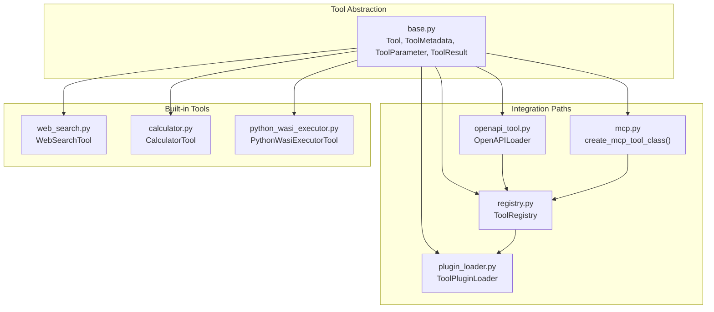

**Diagram sources**
- [base.py](file://python/llm-service/llm_service/tools/base.py#L94-L443)
- [mcp.py](file://python/llm-service/llm_service/tools/mcp.py#L33-L131)
- [openapi_tool.py](file://python/llm-service/llm_service/tools/openapi_tool.py#L125-L758)
- [registry.py](file://python/llm-service/llm_service/tools/registry.py#L16-L230)
- [plugin_loader.py](file://python/llm-service/llm_service/tools/plugin_loader.py#L24-L454)
- [web_search.py](file://python/llm-service/llm_service/tools/builtin/web_search.py#L730-L800)
- [calculator.py](file://python/llm-service/llm_service/tools/builtin/calculator.py#L52-L321)
- [python_wasi_executor.py](file://python/llm-service/llm_service/tools/builtin/python_wasi_executor.py#L54-L426)

**Section sources**
- [base.py](file://python/llm-service/llm_service/tools/base.py#L94-L443)
- [registry.py](file://python/llm-service/llm_service/tools/registry.py#L16-L230)
- [plugin_loader.py](file://python/llm-service/llm_service/tools/plugin_loader.py#L24-L454)
- [mcp.py](file://python/llm-service/llm_service/tools/mcp.py#L33-L131)
- [openapi_tool.py](file://python/llm-service/llm_service/tools/openapi_tool.py#L125-L758)
- [web_search.py](file://python/llm-service/llm_service/tools/builtin/web_search.py#L730-L800)
- [calculator.py](file://python/llm-service/llm_service/tools/builtin/calculator.py#L52-L321)
- [python_wasi_executor.py](file://python/llm-service/llm_service/tools/builtin/python_wasi_executor.py#L54-L426)

## Core Components
- Tool base: Defines metadata, parameters, execution lifecycle, validation, rate limiting, and schema generation.
- Tool registry: Central discovery and registration mechanism with filtering and schema export.
- Plugin loader: Hot-reloadable loader for built-in and community tools, plus JSON-defined tools.
- MCP integration: Generates Tool subclasses from MCP endpoints with per-tool rate limiting.
- OpenAPI integration: Parses specs, validates domains, builds tools, applies circuit breakers, retries, and vendor adapters.
- Built-in tools: Web search, calculator, and Python WASI executor.

**Section sources**
- [base.py](file://python/llm-service/llm_service/tools/base.py#L94-L443)
- [registry.py](file://python/llm-service/llm_service/tools/registry.py#L16-L230)
- [plugin_loader.py](file://python/llm-service/llm_service/tools/plugin_loader.py#L24-L454)
- [mcp.py](file://python/llm-service/llm_service/tools/mcp.py#L33-L131)
- [openapi_tool.py](file://python/llm-service/llm_service/tools/openapi_tool.py#L125-L758)
- [web_search.py](file://python/llm-service/llm_service/tools/builtin/web_search.py#L730-L800)
- [calculator.py](file://python/llm-service/llm_service/tools/builtin/calculator.py#L52-L321)
- [python_wasi_executor.py](file://python/llm-service/llm_service/tools/builtin/python_wasi_executor.py#L54-L426)

## Architecture Overview
The tool system composes a unified execution pipeline:
- Discovery: Registry loads tools from built-ins, plugins, and configuration.
- Validation: Domain allowlists, timeouts, and response size limits.
- Execution: Parameter coercion/validation, rate limiting, circuit breakers, retries, and sandboxing.
- Observability: Progress callbacks, execution time, and structured results.

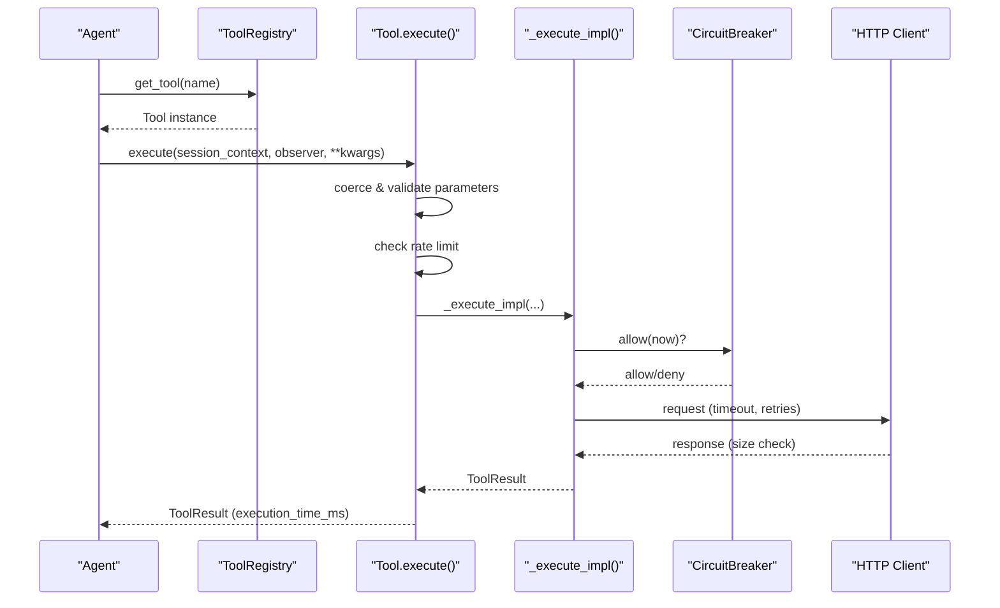

**Diagram sources**
- [base.py](file://python/llm-service/llm_service/tools/base.py#L127-L214)
- [openapi_tool.py](file://python/llm-service/llm_service/tools/openapi_tool.py#L377-L598)

## Detailed Component Analysis

### Tool Base and Execution Pipeline
- Metadata, parameters, and schema generation align with OpenAI-style function calling.
- Execution enforces parameter coercion, validation, and rate limiting keyed by session/agent or request-scoped.
- Results include execution time, optional tokens used, and structured metadata.

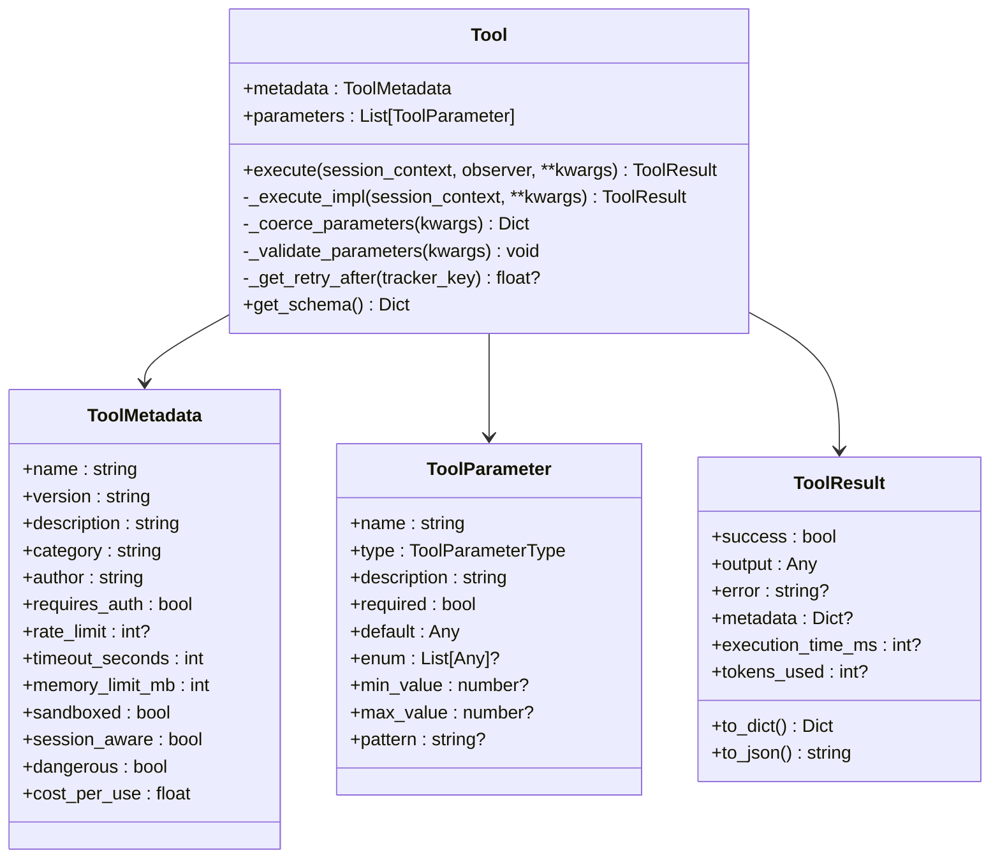

**Diagram sources**
- [base.py](file://python/llm-service/llm_service/tools/base.py#L20-L443)

**Section sources**
- [base.py](file://python/llm-service/llm_service/tools/base.py#L94-L443)

### Tool Registry and Management
- Registers tools by name and category, supports singleton instances, and exposes discovery and filtering.
- Discovers tools from packages by importing modules and scanning for Tool subclasses.
- Provides schema exports and per-tool metadata retrieval.

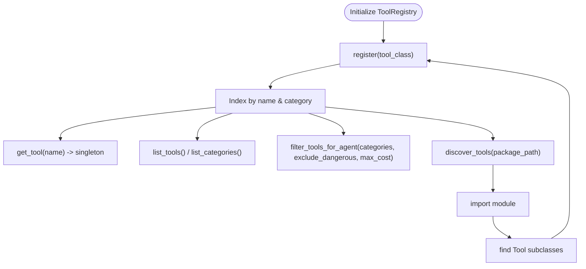

**Diagram sources**
- [registry.py](file://python/llm-service/llm_service/tools/registry.py#L16-L230)

**Section sources**
- [registry.py](file://python/llm-service/llm_service/tools/registry.py#L16-L230)

### Plugin Loader and Hot Reload
- Scans directories for Python modules and JSON tool definitions (.shannon-tool).
- Dynamically imports modules, registers Tool subclasses, and supports hot reload via watchdog.
- Supports JSON-defined tools with script or API execution strategies.

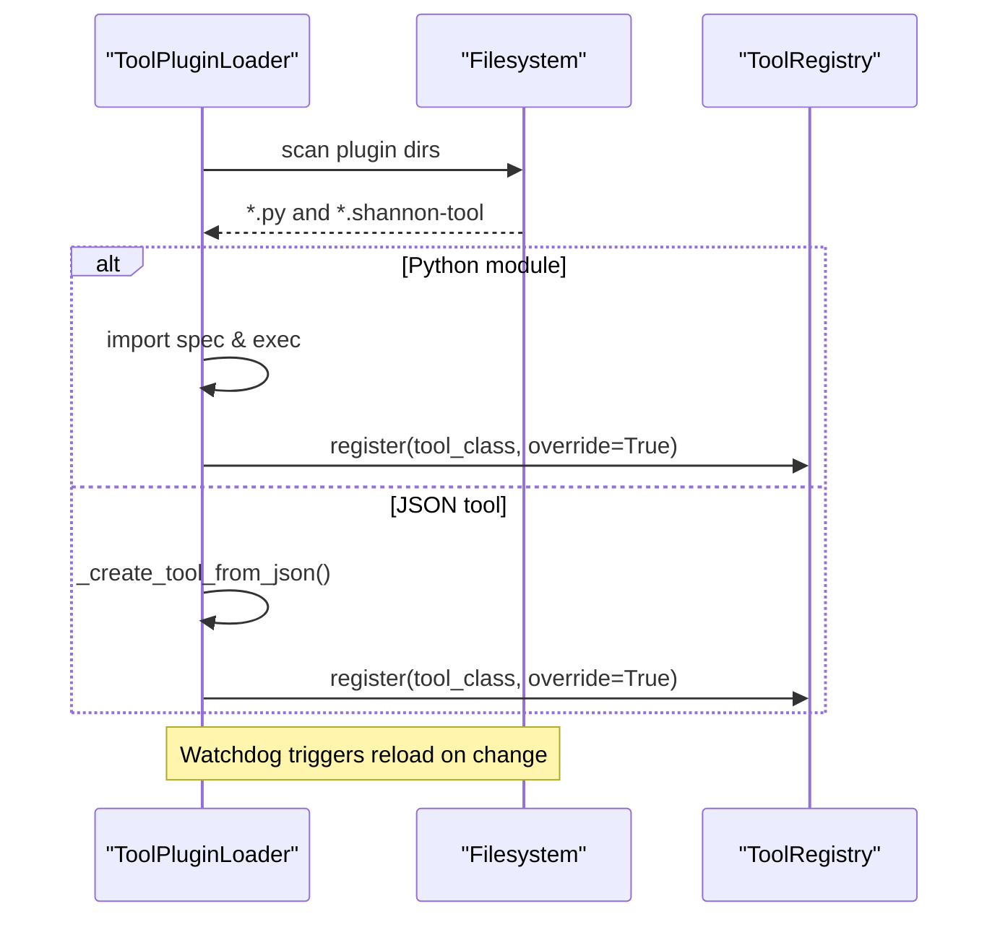

**Diagram sources**
- [plugin_loader.py](file://python/llm-service/llm_service/tools/plugin_loader.py#L24-L454)

**Section sources**
- [plugin_loader.py](file://python/llm-service/llm_service/tools/plugin_loader.py#L24-L454)

### MCP Integration
- Creates Tool subclasses that call MCP HTTP endpoints.
- Supports per-tool rate limiting, cost configuration via environment, and flexible parameter schemas.
- Uses a stateless HTTP client to invoke functions.

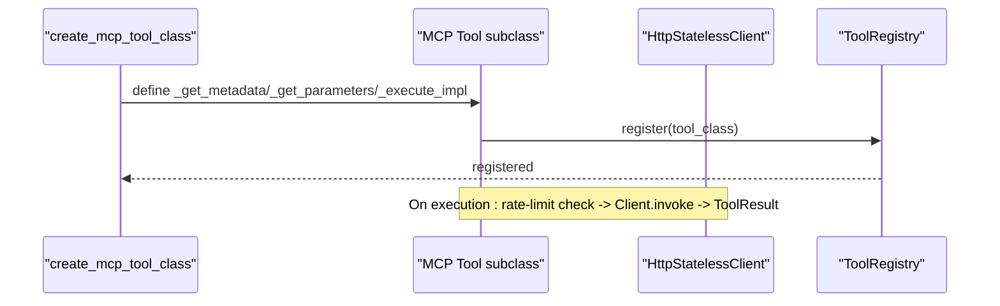

**Diagram sources**
- [mcp.py](file://python/llm-service/llm_service/tools/mcp.py#L33-L131)

**Section sources**
- [mcp.py](file://python/llm-service/llm_service/tools/mcp.py#L33-L131)

### OpenAPI Tool Integration
- Loads OpenAPI specs from URL or inline YAML/JSON, validates and extracts operations.
- Builds Tool subclasses per operation with parameter schemas and metadata.
- Enforces domain allowlists, response size limits, and circuit breakers.
- Supports authentication modes (none, api_key, bearer, basic), environment variable resolution, and vendor adapters.

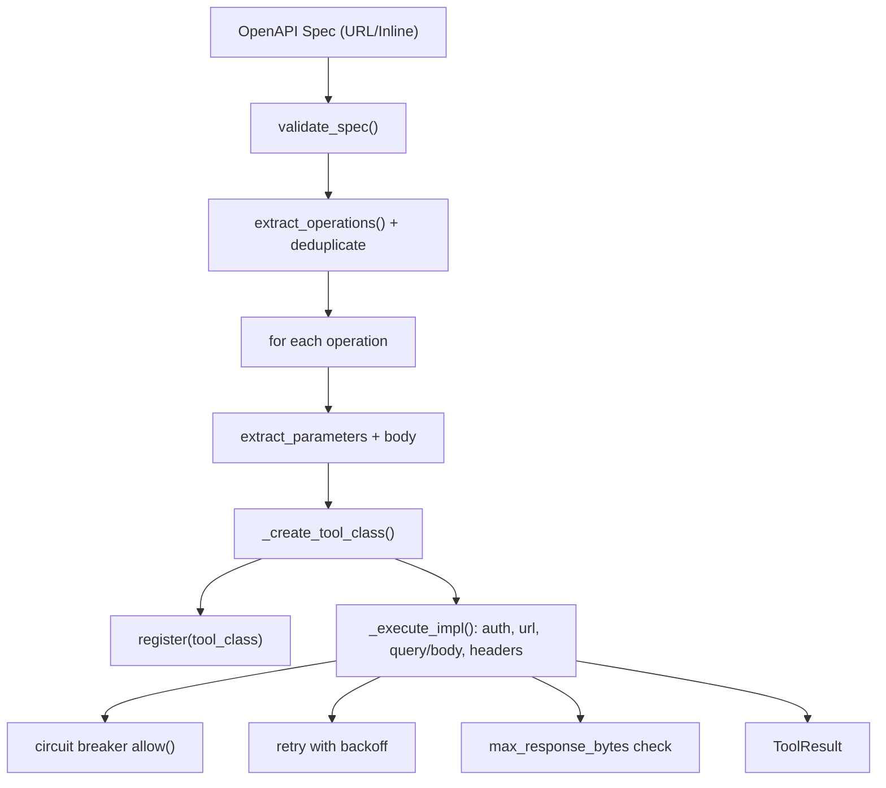

**Diagram sources**
- [openapi_tool.py](file://python/llm-service/llm_service/tools/openapi_tool.py#L125-L758)

**Section sources**
- [openapi_tool.py](file://python/llm-service/llm_service/tools/openapi_tool.py#L125-L758)

### Built-in Tools

#### Web Search Tool
- Multi-provider search (Exa, Firecrawl, Google, Serper, SerpAPI, Bing).
- Validates API keys, sanitizes errors, and enforces max results.
- Falls back to fetching a single site when no provider is configured.

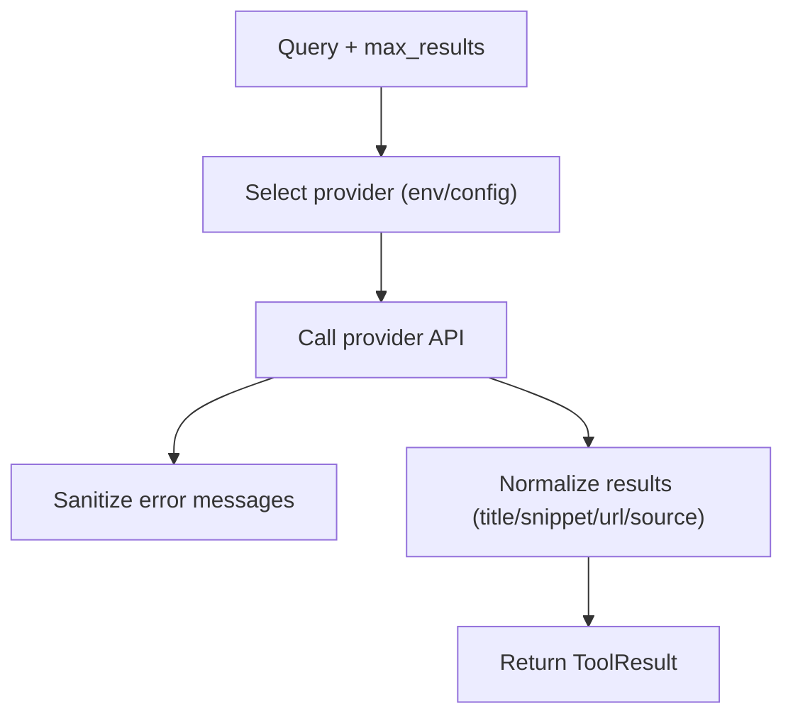

**Diagram sources**
- [web_search.py](file://python/llm-service/llm_service/tools/builtin/web_search.py#L730-L800)

**Section sources**
- [web_search.py](file://python/llm-service/llm_service/tools/builtin/web_search.py#L730-L800)

#### Calculator Tool
- Safe expression evaluation using AST parsing with allowed operators/functions.
- Supports precision control and statistical operations on arrays.

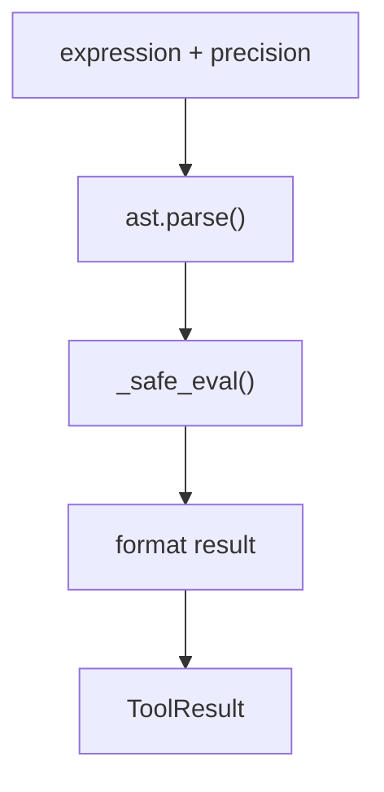

**Diagram sources**
- [calculator.py](file://python/llm-service/llm_service/tools/builtin/calculator.py#L52-L321)

**Section sources**
- [calculator.py](file://python/llm-service/llm_service/tools/builtin/calculator.py#L52-L321)

#### Python WASI Executor Tool
- Executes Python code in a secure WASI sandbox via agent-core gRPC.
- Supports persistent sessions, interpreter caching, and session state capture.
- Emits progress via observer and enforces timeouts.

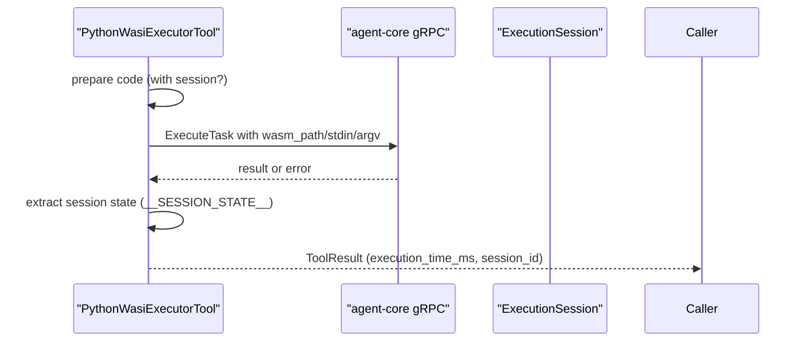

**Diagram sources**
- [python_wasi_executor.py](file://python/llm-service/llm_service/tools/builtin/python_wasi_executor.py#L273-L401)

**Section sources**
- [python_wasi_executor.py](file://python/llm-service/llm_service/tools/builtin/python_wasi_executor.py#L54-L426)

## Dependency Analysis
- ToolRegistry depends on Tool subclasses and metadata to index and expose tools.
- PluginLoader depends on ToolRegistry to register discovered tools and supports hot reload.
- OpenAPI and MCP tools depend on Tool base for metadata, parameters, and execution lifecycle.
- Built-in tools depend on Tool base and configuration/settings.

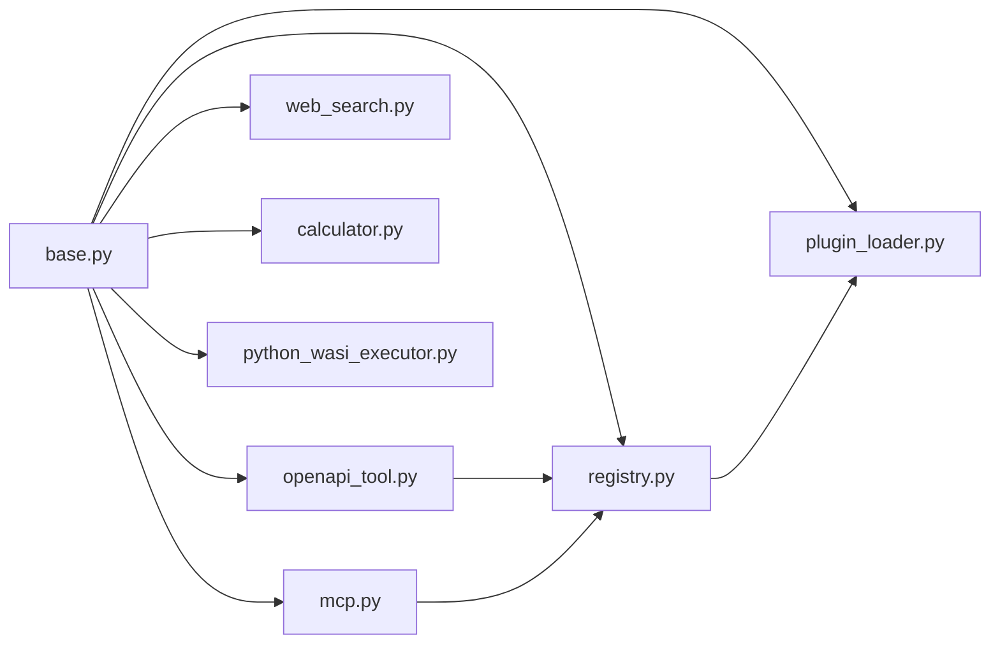

**Diagram sources**
- [base.py](file://python/llm-service/llm_service/tools/base.py#L94-L443)
- [registry.py](file://python/llm-service/llm_service/tools/registry.py#L16-L230)
- [plugin_loader.py](file://python/llm-service/llm_service/tools/plugin_loader.py#L24-L454)
- [mcp.py](file://python/llm-service/llm_service/tools/mcp.py#L33-L131)
- [openapi_tool.py](file://python/llm-service/llm_service/tools/openapi_tool.py#L125-L758)
- [web_search.py](file://python/llm-service/llm_service/tools/builtin/web_search.py#L730-L800)
- [calculator.py](file://python/llm-service/llm_service/tools/builtin/calculator.py#L52-L321)
- [python_wasi_executor.py](file://python/llm-service/llm_service/tools/builtin/python_wasi_executor.py#L54-L426)

**Section sources**
- [base.py](file://python/llm-service/llm_service/tools/base.py#L94-L443)
- [registry.py](file://python/llm-service/llm_service/tools/registry.py#L16-L230)
- [plugin_loader.py](file://python/llm-service/llm_service/tools/plugin_loader.py#L24-L454)
- [mcp.py](file://python/llm-service/llm_service/tools/mcp.py#L33-L131)
- [openapi_tool.py](file://python/llm-service/llm_service/tools/openapi_tool.py#L125-L758)
- [web_search.py](file://python/llm-service/llm_service/tools/builtin/web_search.py#L730-L800)
- [calculator.py](file://python/llm-service/llm_service/tools/builtin/calculator.py#L52-L321)
- [python_wasi_executor.py](file://python/llm-service/llm_service/tools/builtin/python_wasi_executor.py#L54-L426)

## Performance Considerations
- Rate limiting: Tool base enforces per-minute throttling keyed by session/agent or request-scoped; high-throughput tools bypass per-session tracking above thresholds.
- Circuit breakers: OpenAPI tools use per-base-url breakers to protect downstream services during failures.
- Retries: Exponential backoff reduces load on failing endpoints.
- Caching: Python WASI interpreter cache reduces cold-start overhead.
- Memory limits: Tool metadata includes memory limits; WASI executor enforces runtime constraints.
- Timeouts: Configurable per-tool and per-call to avoid resource starvation.

[No sources needed since this section provides general guidance]

## Troubleshooting Guide
Common issues and mitigations:
- Domain allowlists: MCP and OpenAPI require explicit allowlists via environment variables; ensure domains are whitelisted.
- Authentication: Verify bearer/api_key/basic credentials and environment variable resolution.
- Response size limits: OpenAPI tools reject oversized responses; adjust max_response_bytes if needed.
- Circuit breaker: When open, requests fail fast; monitor breaker state and tune thresholds.
- Rate limiting: If encountering “Retry after” responses, reduce request frequency or increase rate_limit.
- WASI execution: Confirm agent-core availability, interpreter path, and gRPC connectivity.

**Section sources**
- [openapi_tool.py](file://python/llm-service/llm_service/tools/openapi_tool.py#L195-L207)
- [openapi_tool.py](file://python/llm-service/llm_service/tools/openapi_tool.py#L384-L390)
- [openapi_tool.py](file://python/llm-service/llm_service/tools/openapi_tool.py#L522-L530)
- [base.py](file://python/llm-service/llm_service/tools/base.py#L162-L174)
- [python_wasi_executor.py](file://python/llm-service/llm_service/tools/builtin/python_wasi_executor.py#L339-L353)

## Conclusion
Shannon’s tool ecosystem unifies diverse integration patterns—MCP, OpenAPI, and built-in tools—through a robust abstraction and registry. Security, reliability, and performance are addressed via domain allowlists, circuit breakers, retries, timeouts, and sandboxing. The plugin loader enables hot-reloadable extensions, while configuration-driven tool definitions streamline deployment and maintenance.

[No sources needed since this section summarizes without analyzing specific files]

## Appendices

### Practical Guides

- Developing a custom MCP tool
  - Define tool metadata and parameters.
  - Use the builder to generate a Tool subclass pointing to your MCP endpoint.
  - Register with the global registry and configure domain allowlists.

  **Section sources**
  - [mcp.py](file://python/llm-service/llm_service/tools/mcp.py#L33-L131)
  - [registry.py](file://python/llm-service/llm_service/tools/registry.py#L27-L53)

- Integrating an external API via OpenAPI
  - Provide spec_url or spec_inline, configure auth_type and auth_config.
  - Set OPENAPI_ALLOWED_DOMAINS and tune rate_limit, timeout, and response size.
  - Optionally apply vendor adapters for body/header transformations.

  **Section sources**
  - [openapi_tool.py](file://python/llm-service/llm_service/tools/openapi_tool.py#L604-L679)
  - [openapi_tool.py](file://python/llm-service/llm_service/tools/openapi_tool.py#L195-L207)

- Registering tools with the platform
  - Use ToolPluginLoader to discover and register tools from directories.
  - Alternatively, programmatically register via ToolRegistry.register.

  **Section sources**
  - [plugin_loader.py](file://python/llm-service/llm_service/tools/plugin_loader.py#L53-L72)
  - [registry.py](file://python/llm-service/llm_service/tools/registry.py#L27-L53)

- Built-in tool usage
  - Web search: Configure provider credentials and environment variables.
  - Calculator: Provide expression and precision; validated via AST.
  - Python WASI executor: Provide code and optional session_id; observe progress.

  **Section sources**
  - [web_search.py](file://python/llm-service/llm_service/tools/builtin/web_search.py#L730-L800)
  - [calculator.py](file://python/llm-service/llm_service/tools/builtin/calculator.py#L52-L321)
  - [python_wasi_executor.py](file://python/llm-service/llm_service/tools/builtin/python_wasi_executor.py#L273-L401)

### Security, Rate Limiting, and Circuit Breakers

- Security
  - MCP/OpenAPI require allowlisted domains; environment variable resolution for secrets.
  - Built-in tools sanitize errors and restrict private IP access where applicable.

- Rate limiting
  - Tool base enforces per-minute limits keyed by session/agent or request-scoped.
  - MCP tools include per-tool rate limiting controlled by environment.

- Circuit breakers
  - OpenAPI tools use per-base-url breakers to protect downstream services.

**Section sources**
- [openapi_tool.py](file://python/llm-service/llm_service/tools/openapi_tool.py#L195-L207)
- [openapi_tool.py](file://python/llm-service/llm_service/tools/openapi_tool.py#L344-L348)
- [mcp.py](file://python/llm-service/llm_service/tools/mcp.py#L53-L111)
- [base.py](file://python/llm-service/llm_service/tools/base.py#L162-L174)

### Testing and Validation Strategies
- Unit tests for tool logic (parameter coercion, validation, execution).
- Integration tests for HTTP clients, circuit breakers, and retries.
- E2E tests validating end-to-end workflows with tools.
- Mock providers and controlled environments for reproducible test runs.

[No sources needed since this section provides general guidance]