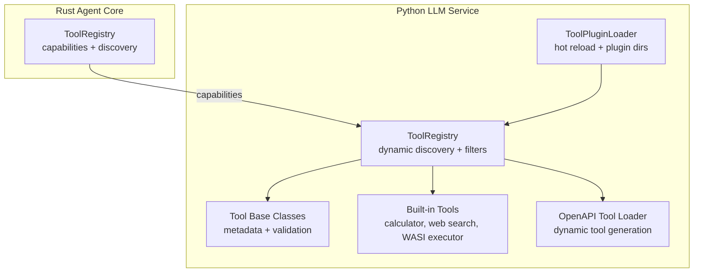
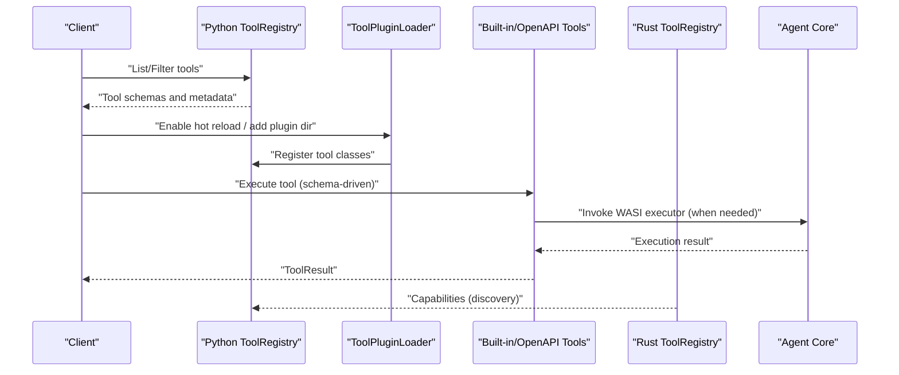
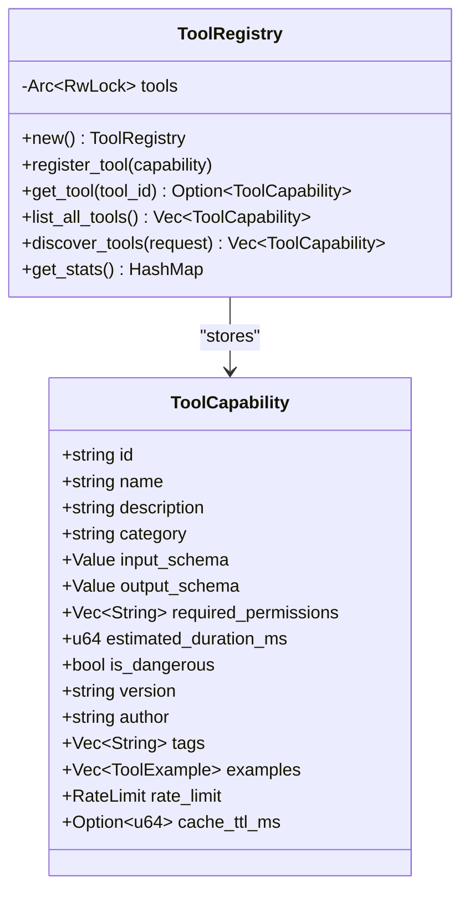
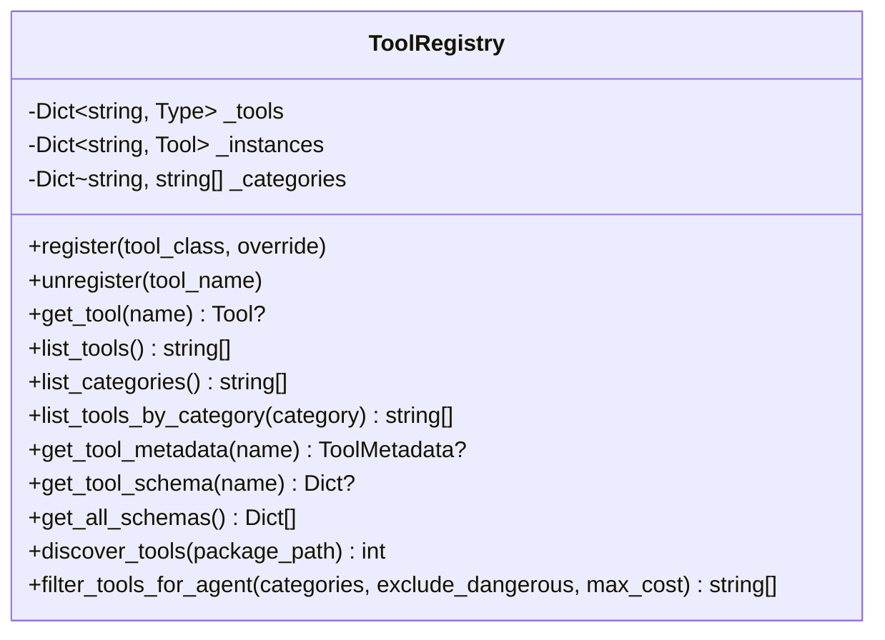
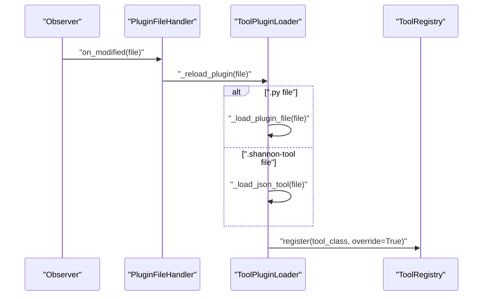
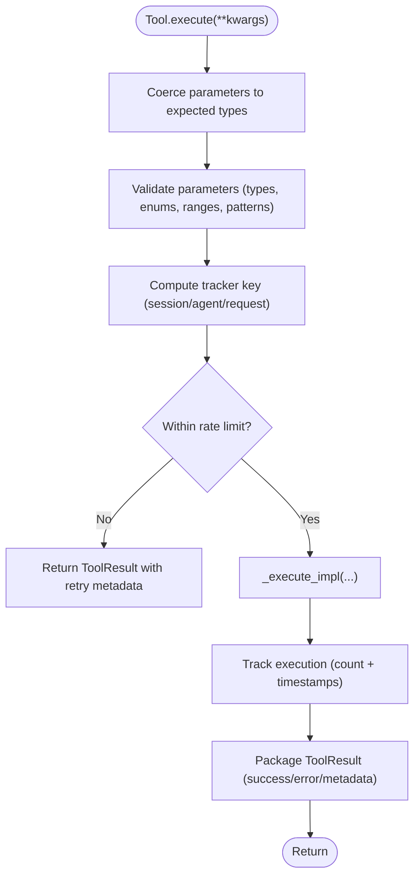
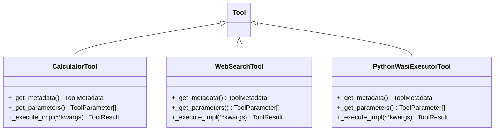
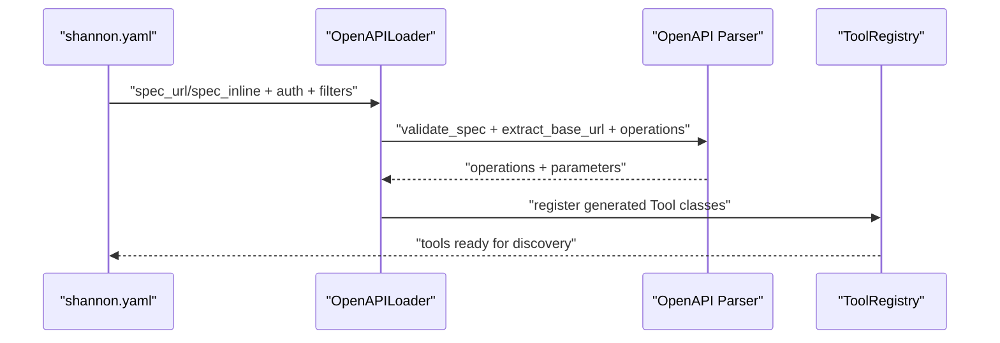
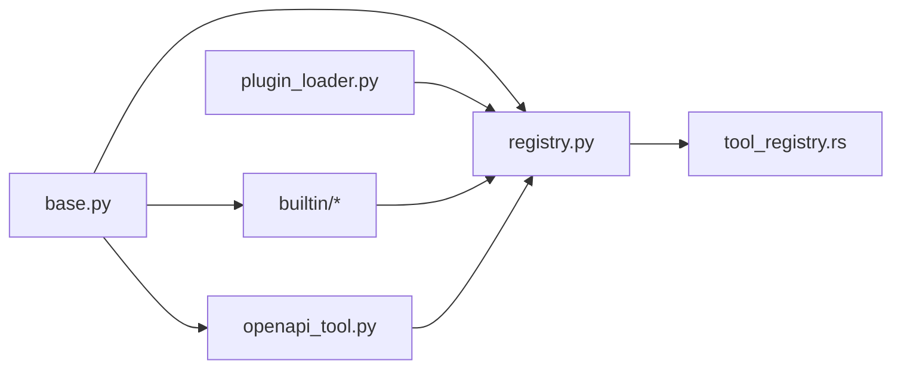

# Tool Registry and Management

<cite>
**Referenced Files in This Document**
- [tool_registry.rs](file://rust/agent-core/src/tool_registry.rs)
- [base.py](file://python/llm-service/llm_service/tools/base.py)
- [registry.py](file://python/llm-service/llm_service/tools/registry.py)
- [plugin_loader.py](file://python/llm-service/llm_service/tools/plugin_loader.py)
- [builtin/__init__.py](file://python/llm-service/llm_service/tools/builtin/__init__.py)
- [calculator.py](file://python/llm-service/llm_service/tools/builtin/calculator.py)
- [web_search.py](file://python/llm-service/llm_service/tools/builtin/web_search.py)
- [python_wasi_executor.py](file://python/llm-service/llm_service/tools/builtin/python_wasi_executor.py)
- [openapi_tool.py](file://python/llm-service/llm_service/tools/openapi_tool.py)
- [adding-custom-tools.md](file://docs/adding-custom-tools.md)
</cite>

## Table of Contents
1. [Introduction](#introduction)
2. [Project Structure](#project-structure)
3. [Core Components](#core-components)
4. [Architecture Overview](#architecture-overview)
5. [Detailed Component Analysis](#detailed-component-analysis)
6. [Dependency Analysis](#dependency-analysis)
7. [Performance Considerations](#performance-considerations)
8. [Troubleshooting Guide](#troubleshooting-guide)
9. [Conclusion](#conclusion)
10. [Appendices](#appendices)

## Introduction
This document explains the tool registry and management system across the Rust agent core and Python LLM service. It covers:
- Tool discovery, registration, and lifecycle management
- Dynamic plugin loading and hot reloading
- Metadata, schemas, and dependency handling
- Practical examples for registering custom tools
- Versioning, compatibility, and migration strategies
- Performance monitoring, resource management, and scaling

## Project Structure
The tool system spans two primary implementations:
- Rust agent core: a compact, strongly typed tool registry with capability metadata and discovery
- Python LLM service: a dynamic registry with plugin loader, hot reloading, and multiple tool types (built-in, OpenAPI, MCP)

**Diagram sources**
- [tool_registry.rs](file://rust/agent-core/src/tool_registry.rs#L56-L312)
- [registry.py](file://python/llm-service/llm_service/tools/registry.py#L16-L230)
- [plugin_loader.py](file://python/llm-service/llm_service/tools/plugin_loader.py#L24-L454)
- [base.py](file://python/llm-service/llm_service/tools/base.py#L94-L443)
- [builtin/__init__.py](file://python/llm-service/llm_service/tools/builtin/__init__.py#L1-L75)
- [openapi_tool.py](file://python/llm-service/llm_service/tools/openapi_tool.py#L125-L758)

**Section sources**
- [tool_registry.rs](file://rust/agent-core/src/tool_registry.rs#L56-L312)
- [registry.py](file://python/llm-service/llm_service/tools/registry.py#L16-L230)
- [plugin_loader.py](file://python/llm-service/llm_service/tools/plugin_loader.py#L24-L454)
- [base.py](file://python/llm-service/llm_service/tools/base.py#L94-L443)
- [builtin/__init__.py](file://python/llm-service/llm_service/tools/builtin/__init__.py#L1-L75)
- [openapi_tool.py](file://python/llm-service/llm_service/tools/openapi_tool.py#L125-L758)

## Core Components
- Rust ToolRegistry: central registry for tool capabilities with discovery, filtering, and statistics; initializes default tools (calculator, web search, WASI executor).
- Python ToolRegistry: dynamic registry supporting discovery by package, category filtering, and schema retrieval; maintains singleton access.
- ToolPluginLoader: discovers and loads Python tool modules and JSON tool definitions from configured directories, with hot reload via watchdog.
- Tool base classes: define metadata, parameter validation, rate limiting, and execution lifecycle.
- Built-in tools: calculator, web search (multi-provider), and WASI executor.
- OpenAPI tool loader: converts OpenAPI 3.x specs into dynamic Tool classes with authentication, retries, and circuit breaking.

**Section sources**
- [tool_registry.rs](file://rust/agent-core/src/tool_registry.rs#L56-L312)
- [registry.py](file://python/llm-service/llm_service/tools/registry.py#L16-L230)
- [plugin_loader.py](file://python/llm-service/llm_service/tools/plugin_loader.py#L24-L454)
- [base.py](file://python/llm-service/llm_service/tools/base.py#L94-L443)
- [calculator.py](file://python/llm-service/llm_service/tools/builtin/calculator.py#L52-L321)
- [web_search.py](file://python/llm-service/llm_service/tools/builtin/web_search.py#L730-L800)
- [python_wasi_executor.py](file://python/llm-service/llm_service/tools/builtin/python_wasi_executor.py#L54-L426)
- [openapi_tool.py](file://python/llm-service/llm_service/tools/openapi_tool.py#L125-L758)

## Architecture Overview
End-to-end tool orchestration and discovery across systems:

**Diagram sources**
- [registry.py](file://python/llm-service/llm_service/tools/registry.py#L74-L116)
- [plugin_loader.py](file://python/llm-service/llm_service/tools/plugin_loader.py#L372-L418)
- [base.py](file://python/llm-service/llm_service/tools/base.py#L127-L214)
- [tool_registry.rs](file://rust/agent-core/src/tool_registry.rs#L233-L291)
- [python_wasi_executor.py](file://python/llm-service/llm_service/tools/builtin/python_wasi_executor.py#L273-L401)

## Detailed Component Analysis

### Rust ToolRegistry
- Responsibilities:
  - Initialize default tools with metadata (schemas, permissions, rate limits, caching).
  - Register, lookup, list, and discover tools by query/tags/categories.
  - Provide statistics by category.
- Design:
  - Thread-safe via RwLock around a HashMap of tool ID to capability.
  - Discovery filters include query substring matching, category/tag inclusion, and optional exclusion of dangerous tools.
- Lifecycle:
  - Singleton-like via default constructor; initialized with defaults on creation.

**Diagram sources**
- [tool_registry.rs](file://rust/agent-core/src/tool_registry.rs#L6-L312)

**Section sources**
- [tool_registry.rs](file://rust/agent-core/src/tool_registry.rs#L56-L312)

### Python ToolRegistry
- Responsibilities:
  - Dynamic registration/unregistration of tool classes.
  - Instance caching (singleton per tool name).
  - Category indexing and filtering for agent selection.
  - Schema and metadata retrieval compatible with OpenAI-style function calling.
- Discovery:
  - Package-based discovery scanning Python modules for Tool subclasses.
  - Filtering by category, dangerousness, and cost.

**Diagram sources**
- [registry.py](file://python/llm-service/llm_service/tools/registry.py#L16-L230)

**Section sources**
- [registry.py](file://python/llm-service/llm_service/tools/registry.py#L16-L230)

### ToolPluginLoader (Hot Reload)
- Responsibilities:
  - Scan directories for Python tool modules and JSON tool definitions.
  - Load modules dynamically, find Tool subclasses, and register them.
  - Hot reload via watchdog: watches file changes and reloads modified plugins.
  - Support for adding plugin directories at runtime.
- Safety:
  - Tracks file hashes to avoid reloading unchanged files.
  - Unloads modules and removes them from sys.modules on reload.

**Diagram sources**
- [plugin_loader.py](file://python/llm-service/llm_service/tools/plugin_loader.py#L430-L454)
- [plugin_loader.py](file://python/llm-service/llm_service/tools/plugin_loader.py#L372-L418)
- [registry.py](file://python/llm-service/llm_service/tools/registry.py#L27-L54)

**Section sources**
- [plugin_loader.py](file://python/llm-service/llm_service/tools/plugin_loader.py#L24-L454)
- [registry.py](file://python/llm-service/llm_service/tools/registry.py#L27-L54)

### Tool Base Classes and Execution Lifecycle
- ToolMetadata: defines name, version, description, category, author, permissions, rate limits, timeouts, sandboxing, and cost.
- ToolParameter: parameter definitions with type, validation (enums, ranges, patterns), and defaults.
- Tool.execute: handles parameter coercion/validation, rate limiting, session-aware execution, and result packaging.
- ToolResult: standardized output with success flag, output, error, and execution metadata.

**Diagram sources**
- [base.py](file://python/llm-service/llm_service/tools/base.py#L127-L214)
- [base.py](file://python/llm-service/llm_service/tools/base.py#L215-L332)
- [base.py](file://python/llm-service/llm_service/tools/base.py#L368-L397)

**Section sources**
- [base.py](file://python/llm-service/llm_service/tools/base.py#L47-L92)
- [base.py](file://python/llm-service/llm_service/tools/base.py#L215-L332)
- [base.py](file://python/llm-service/llm_service/tools/base.py#L368-L397)

### Built-in Tools
- CalculatorTool: safe expression evaluation using AST parsing; configurable rate limit and precision.
- WebSearchTool: multi-provider search (Exa, Firecrawl, Google, Serper, SerpAPI, Bing); includes sanitization and fallback site scraping.
- PythonWasiExecutorTool: secure Python execution via WASI with session persistence, caching, and gRPC integration to agent-core.

**Diagram sources**
- [calculator.py](file://python/llm-service/llm_service/tools/builtin/calculator.py#L52-L321)
- [web_search.py](file://python/llm-service/llm_service/tools/builtin/web_search.py#L730-L800)
- [python_wasi_executor.py](file://python/llm-service/llm_service/tools/builtin/python_wasi_executor.py#L54-L426)

**Section sources**
- [calculator.py](file://python/llm-service/llm_service/tools/builtin/calculator.py#L52-L321)
- [web_search.py](file://python/llm-service/llm_service/tools/builtin/web_search.py#L730-L800)
- [python_wasi_executor.py](file://python/llm-service/llm_service/tools/builtin/python_wasi_executor.py#L54-L426)

### OpenAPI Tool Loader
- Converts OpenAPI 3.x specs into Tool classes per operation.
- Supports authentication (none, api_key, bearer, basic), vendor adapters, retries, circuit breaking, and domain allowlisting.
- Generates schemas compatible with function calling.

**Diagram sources**
- [openapi_tool.py](file://python/llm-service/llm_service/tools/openapi_tool.py#L604-L679)
- [openapi_tool.py](file://python/llm-service/llm_service/tools/openapi_tool.py#L125-L216)

**Section sources**
- [openapi_tool.py](file://python/llm-service/llm_service/tools/openapi_tool.py#L125-L758)

## Dependency Analysis
- Python ToolRegistry depends on Tool base classes and built-in tool modules.
- ToolPluginLoader depends on ToolRegistry and uses watchdog for hot reload.
- Built-in tools depend on Tool base classes and may integrate with agent-core via gRPC (WASI executor).
- Rust ToolRegistry provides capability metadata consumed by Python components for discovery.

**Diagram sources**
- [base.py](file://python/llm-service/llm_service/tools/base.py#L94-L443)
- [registry.py](file://python/llm-service/llm_service/tools/registry.py#L16-L230)
- [plugin_loader.py](file://python/llm-service/llm_service/tools/plugin_loader.py#L24-L454)
- [builtin/__init__.py](file://python/llm-service/llm_service/tools/builtin/__init__.py#L1-L75)
- [openapi_tool.py](file://python/llm-service/llm_service/tools/openapi_tool.py#L125-L758)
- [tool_registry.rs](file://rust/agent-core/src/tool_registry.rs#L56-L312)

**Section sources**
- [registry.py](file://python/llm-service/llm_service/tools/registry.py#L16-L230)
- [plugin_loader.py](file://python/llm-service/llm_service/tools/plugin_loader.py#L24-L454)
- [base.py](file://python/llm-service/llm_service/tools/base.py#L94-L443)
- [builtin/__init__.py](file://python/llm-service/llm_service/tools/builtin/__init__.py#L1-L75)
- [openapi_tool.py](file://python/llm-service/llm_service/tools/openapi_tool.py#L125-L758)
- [tool_registry.rs](file://rust/agent-core/src/tool_registry.rs#L56-L312)

## Performance Considerations
- Rate limiting:
  - Python Tool base enforces per-session/per-agent rate limits with configurable thresholds and memory-limited trackers.
  - High-throughput tools bypass per-session tracking to reduce overhead.
- Resource management:
  - WASI executor caches the interpreter and manages sessions with bounded concurrency and timeouts.
  - OpenAPI tools cap response sizes and apply circuit breakers and retries.
- Caching and discovery:
  - Rust ToolRegistry caches capabilities and supports fast discovery with filters.
  - Python ToolPluginLoader avoids reloading unchanged files via file hashing.
- Scaling:
  - Hot reload enables incremental updates without restarts.
  - OpenAPI tool generation scales across operations; vendor adapters decouple transformations.

[No sources needed since this section provides general guidance]

## Troubleshooting Guide
- Tool not appearing:
  - Verify registration via ToolRegistry.list_tools and ToolRegistry.list_categories.
  - For Python, confirm ToolPluginLoader scanned the directory and loaded the module.
- Validation errors:
  - Check ToolParameter definitions and ensure inputs match types/enums/ranges.
- Rate limit exceeded:
  - Inspect ToolResult metadata for retry-after seconds; adjust ToolMetadata.rate_limit or session context.
- OpenAPI failures:
  - Confirm OPENAPI_ALLOWED_DOMAINS configuration and spec fetch limits.
  - Review circuit breaker state and retry behavior.
- WASI execution issues:
  - Ensure agent-core address and interpreter path are correct; check timeouts and session state extraction.

**Section sources**
- [registry.py](file://python/llm-service/llm_service/tools/registry.py#L87-L116)
- [plugin_loader.py](file://python/llm-service/llm_service/tools/plugin_loader.py#L326-L353)
- [base.py](file://python/llm-service/llm_service/tools/base.py#L162-L175)
- [openapi_tool.py](file://python/llm-service/llm_service/tools/openapi_tool.py#L196-L207)
- [python_wasi_executor.py](file://python/llm-service/llm_service/tools/builtin/python_wasi_executor.py#L339-L353)

## Conclusion
The tool registry and management system combines a robust Rust capability registry with a flexible Python dynamic registry and loader. Together they provide:
- Strong metadata and discovery in Rust
- Dynamic registration, hot reload, and schema-driven execution in Python
- Built-in and extensible tool types (calculator, web search, WASI executor, OpenAPI)
- Comprehensive validation, rate limiting, and reliability controls

[No sources needed since this section summarizes without analyzing specific files]

## Appendices

### Practical Examples

- Register a custom built-in tool:
  - Define a class inheriting Tool with _get_metadata and _get_parameters, then register it in the Python ToolRegistry.
  - Reference: [adding-custom-tools.md](file://docs/adding-custom-tools.md#L448-L626), [base.py](file://python/llm-service/llm_service/tools/base.py#L94-L443), [registry.py](file://python/llm-service/llm_service/tools/registry.py#L27-L54)

- Manage tool dependencies and filtering:
  - Use ToolRegistry.filter_tools_for_agent to restrict by category, dangerousness, and cost.
  - Reference: [registry.py](file://python/llm-service/llm_service/tools/registry.py#L174-L214)

- Implement tool discovery patterns:
  - Use ToolPluginLoader to scan directories and hot reload changes; leverage ToolRegistry.discover_tools for schema-driven discovery.
  - Reference: [plugin_loader.py](file://python/llm-service/llm_service/tools/plugin_loader.py#L53-L72), [tool_registry.rs](file://rust/agent-core/src/tool_registry.rs#L233-L291)

- Versioning, compatibility, and migration:
  - ToolMetadata.version drives compatibility checks; ToolPluginLoader supports overrides for hot reload.
  - Reference: [base.py](file://python/llm-service/llm_service/tools/base.py#L48-L65), [plugin_loader.py](file://python/llm-service/llm_service/tools/plugin_loader.py#L152-L156)

- Performance monitoring and scaling:
  - Monitor ToolResult.execution_time_ms; tune rate limits and timeouts; leverage WASI caching and OpenAPI circuit breakers.
  - Reference: [base.py](file://python/llm-service/llm_service/tools/base.py#L76-L92), [python_wasi_executor.py](file://python/llm-service/llm_service/tools/builtin/python_wasi_executor.py#L130-L152), [openapi_tool.py](file://python/llm-service/llm_service/tools/openapi_tool.py#L344-L348)